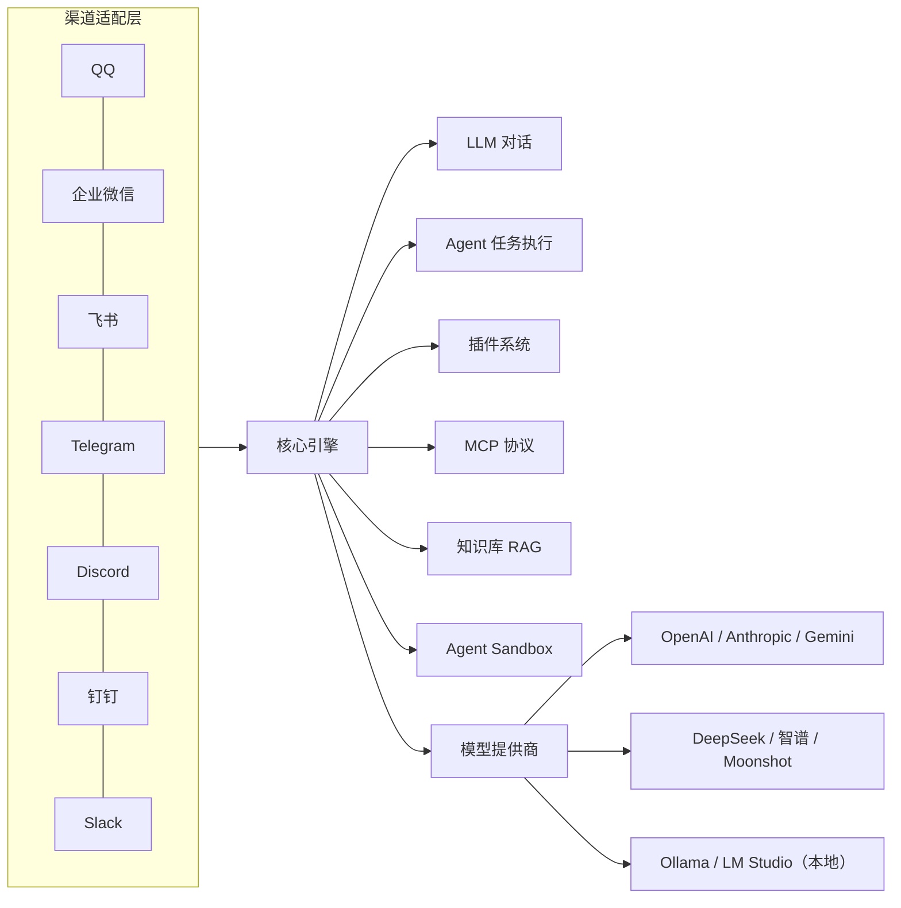

# AstrBot：把同一套 Agent 能力送到十几个 IM 平台

AstrBot（[AstrBotDevs/AstrBot](https://github.com/AstrBotDevs/AstrBot)，40.8k Stars）解决的是"怎么让同一个机器人同时活在十几个 IM 平台上"。它为每个平台写一套协议适配，把渠道接入、模型调用、工具执行、插件扩展统一收进一个后端，配一次，QQ、企业微信、飞书、Telegram、Discord 就都能说话。

仓库描述管自己叫"集成了大量 IM 平台、LLM、插件和 AI 能力的 AI Agent 助手与开发框架"，并注明"can be your openclaw alternative"——想当 OpenClaw 的替代品。

## 项目速览

| 指标 | 数值 |
|------|------|
| GitHub Stars | **40,801** |
| Forks | **2,953** |
| 语言 | Python（后端）+ Vue（管理界面） |
| 许可证 | AGPL-3.0 |
| 最新版本 | v4.28.1（2026-09-14） |
| 创建时间 | 2022-12-08 |
| Python 要求 | 3.12+ |
| 官方文档 | https://astrbot.app |

数据来自 GitHub API，观测时间 2026-09-22。

## 系统总览

AstrBot 大体分三层，先记住一个前提：渠道和模型都是可插拔的。



左侧渠道把 IM 平台的协议统一成内部消息格式，中间引擎决定"这条消息交给谁处理"，右侧模型和工具是引擎的依赖。三块之间没有硬耦合，所以能同时接十几个平台，改一处不会崩全局。

## 先拆开两个容易混的概念

很多机器人项目把"IM 接入"和"模型对话"写死在一起，AstrBot 把这两件事拆成了独立的主线：

- **渠道接入**回答的是"消息从哪来、回哪去"。QQ 的消息要经过 OneBot、Telegram 走 Bot API、企业微信要申请应用凭证，协议各不相同。AstrBot 用适配层把差异屏蔽掉，上层只看到一个统一的消息对象。
- **Agent 能力**回答的是"消息进来之后怎么处理"。这一层跟平台无关，负责多轮对话、调用工具、执行多步任务、检索知识库。

拆开之后，接一个新平台只需要写对应的渠道适配；加一个能力只需要在引擎侧扩展，不需要迁就某个 IM 的接口。RAG（Retrieval-Augmented Generation，检索增强生成）、MCP（Model Context Protocol，模型上下文协议）、Agent Sandbox（代码执行沙箱）这些能力对每个平台是一致的，因为它们都住在引擎层。

## 核心机制

### 1. 渠道适配层：屏蔽协议差异

官方维护的渠道有 QQ、OneBot v11、Telegram、企业微信（含 WeCom AI Bot）、微信公众号、飞书、钉钉、Slack、Discord、LINE、Satori、KOOK、Misskey、Mattermost，WhatsApp 标注为 Coming Soon。Matrix、Rocket.Chat、VoceChat 由社区适配器维护。

每个渠道本质是一个适配器：把平台的消息格式翻译成统一消息，再把引擎的回复翻译回平台格式。多一条渠道，就是多一份协议翻译，AstrBot 的收益在于这些翻译只写一次，全部平台共用引擎。

### 2. LLM 抽象层：模型无关

模型层同样走"适配器"思路。官方列出 OpenAI 及兼容服务、Anthropic、Google Gemini、Moonshot（月之暗面）、智谱 AI、DeepSeek，以及本地部署的 Ollama、LM Studio。还有一批 API 网关和国内云服务（MiraRouter、AIHubMix、CompShare、302.AI、TokenPony、SiliconFlow、PPIO Cloud、ModelScope、OneAPI）作为补充入口。

语音侧也有对应抽象：STT（Speech-to-Text，语音转文字）支持 OpenAI Whisper、SenseVoice、小米 MiMo Omni；TTS（Text-to-Speech，文字转语音）支持 OpenAI TTS、Gemini TTS、GPT-Sovits、FishAudio、Edge TTS、阿里云百炼、Azure、MiniMax、小米 MiMo、火山引擎等。

换模型不换代码，模型无关在这里是可操作的事实，不是抽象承诺。Dify、阿里云百炼应用、Coze、DeerFlow 这类 Agent 编排平台也能作为接入源，适合已经把 Agent 流程编排在这些平台上的团队。

### 3. Agent 引擎与工具执行

Agent 引擎负责把用户的自然语言请求拆成可执行的步骤。一个"帮我查北京天气然后发到群里"的请求，引擎会决定调用哪个工具、以什么顺序调用、拿到结果后怎么组织回复。工具可以是内置的，也可以是插件或 MCP 服务提供的。除了被动应答，引擎还能挂定时任务和主动型 Agent（Proactive Agent）——让机器人按计划执行任务，或者在满足条件时主动发起消息。

### 4. MCP 协议

MCP 让 AstrBot 连上外部数据源和服务，而不必为每个服务写专用集成。用 MCP server 暴露读 GitHub Issues、查库、发消息这类能力，AstrBot 通过标准协议调用。这对"机器人不只是聊天，还能操纵外部系统"这一步很关键。

### 5. 知识库（RAG）

上传 PDF、Word、Markdown 等文档，AstrBot 会分块、向量化存入知识库。用户提问时，先检索相关片段注入上下文，再让模型作答。它解决的是"模型不知道你内部文档"的问题，适合客服、团队助手这类场景。

### 6. Agent Sandbox：让代码执行有边界

Agent 要跑代码或 Shell 命令，就得有隔离环境，否则一次恶意操作就能波及宿主机。AstrBot 从 v4.12.0 起用 Sandbox 替代了旧的代码执行器，目前仍标注为技术预览。官方文档给出三个驱动选择：

- **Shipyard Neo（默认，推荐）**：稳定的 Python / Shell / 文件系统沙箱，内部由三部分组成——Bay 是控制面 API，负责创建和管理沙箱；Ship 负责 Python、Shell 和文件系统能力；Gull 负责浏览器自动化。工作区根目录固定为 `/workspace`，和 AstrBot 的工作区、Skills 同步、长期运行模式贴合。官方还建议把它单独部署在一台资源更充足的机器上，再让 AstrBot 远程接入，因为浏览器运行时对资源消耗不小。
- **Shipyard**：旧方案，仍可继续使用。
- **CUA**：面向电脑使用（Computer Use）的运行时，支持桌面截图、鼠标点击、键盘输入这类 GUI 自动化，镜像覆盖 Linux、macOS、Windows、Android，适合在不同操作系统里测行为。

每个沙箱环境被限制为最高 1 CPU、512 MB 内存，官方建议宿主机至少 2 CPU、4 GB 内存并开启 Swap，否则多实例跑不稳。沙箱还会按会话维度复用，同一消息会话的后续请求尽量沿用同一个沙箱，失效再重建。

### 7. 插件系统

插件是 AstrBot 扩张能力的主渠道，官方市场的可一键安装插件已有 1300 多个（2026-09-22 观测为 1329 个），覆盖图像生成、搜索、日程、办公、社交等场景。插件系统本身是这套东西的生态溢价：核心框架只维护骨架，具体功能交给社区插件填充。

### 8. 技能（Skills）：按需加载的"操作手册"

v4.13.0 之后，AstrBot 支持了 Anthropic 的 Agent Skills 标准。一个 Skill 是一个含 SKILL.md 的文件夹，里面装着指令、脚本和参考资源，官方文档的比喻是：Tool 是模型与外部世界交互的"具体工具接口"，Skill 则是把指令、模板和工具组合在一起的"标准化任务执行手册"。

它省 token 的方式是按需加载（Progressive Disclosure）：模型初始只看到每个技能的名称和一句描述，任务真正匹配时才加载完整的 SKILL.md。对比传统做法把所有工具的 API 定义一次性塞进系统提示词，工具一多，对话还没开始就先烧掉大量 token。

技能可以从四个地方来：本地技能（WebUI 上传，或放在 `data/skills/<skill_name>/SKILL.md`）、插件自带的 `skills/` 目录、Sandbox 里预置的技能，以及当前会话工作区下的 `skills/` 目录。本地和插件自带的技能都会出现在管理面板的"插件 → 技能"页，只是插件内置的那部分由插件自己管理，不能在这个页面编辑或删除。

和插件的区别值得说一句：插件要写 Python 代码、走框架 API，适合深度集成；技能本质上是一份结构化的说明书，不用写代码就能教 Agent 一套新流程，可复用范围还覆盖 Claude Code、Claude API 这些同样遵循 Anthropic Skills 标准的场景。

### 9. 人格与上下文压缩

人格设定（Persona）让机器人可以有不同的性格、语气和角色设定，适合情感陪伴这类场景。上下文压缩（Auto Context Compression）在长对话里自动压缩历史，保持响应速度的同时控制 token 消耗。这两项都在引擎层，所以对所有平台生效。

## 一次请求如何穿过系统

拿"企业微信客服"这个场景串一遍。用户在企业微信里问"去年退货政策是什么"：

1. **渠道层**收到企业微信消息，翻译成统一消息对象，交给引擎。
2. **引擎**判断这不是普通寒暄，而是知识类问题，于是走 RAG 流程。
3. **知识库**把问题向量化，检索出"2025 年退货政策"相关文档片段。
4. **LLM 层**带着检索片段生成回答，措辞符合人格设定。
5. **回复**原路返回渠道层，翻译回企业微信格式，发给用户。

全程用户只看到"问一句、答一句"，背后是渠道、知识库、模型三层协作。如果这个问题涉及执行操作（比如查订单状态），引擎会在第 3、4 步之间先调用 MCP 或插件工具，再汇总结果作答。

## 这些数字怎么读

Stars 40,801、Forks 2,953 说明关注度很高，但推不出"生产就绪"。这两个数字反映的是"多少人关注并收藏了这个仓库"，是项目活跃度的风向标，不是质量背书。Stars 涨得快可能只是踩中了 IM 机器人这个热点，不代表它在你的流量规模下稳定。插件数 1300+ 来自官方市场统计，它描述的是"有多少插件可用"，不是"每个插件都维护良好"——社区插件质量参差，上生产前要各自评估。

另外几件事更值得放在心上：AGPL-3.0 许可证意味着商用要留意开源义务；项目从 2022 年底持续更新到 2026 年 9 月，渠道适配频繁跟进各平台接口变化，说明维护是活的。近期 v4.28 这条线也能看出迭代方向：WebUI 的模型提供商、机器人、配置文件三组页面重做，日志、追踪、对话管理合并进"数据与日志"页；引入统一消息来源（UMO，Unified Message Origin）的概念，自动记录群名、用户名这类可读名称，限流也按 UMO 隔离；网页搜索补了内置的 AnySearch 供应源；敏感配置字段改为掩码显示。都是往"更好管理、更安全"方向走的改动。

## 上手路径

### uv 一键部署

```bash
uv tool install astrbot --python 3.12
astrbot init   # 仅首次执行，初始化环境
astrbot run
```

macOS 用户首次运行可能因为系统安全检查多等 10-20 秒。更新用 `uv tool upgrade astrbot --python 3.12`。

启动后打开 `http://localhost:6185` 进入管理界面，在 LLM 配置里填 API Key，到消息平台里启用对应渠道，就能开始对话。管理界面默认跑在 6185 端口，首次登录用启动日志里打印的随机初始密码（用户名通常是 `astrbot`），登录后立即改掉。

### 其他部署方式

- **Docker / Docker Compose**：适合生产，官方文档 ([docs.astrbot.app](https://docs.astrbot.app/deploy/astrbot/docker.html)) 有完整步骤。
- **云端一键部署**：RainYun 提供托管，适合不想管服务器的用户。
- **桌面应用**：AstrBot Desktop，主要面向想在桌面用 ChatUI 的用户。
- **Launcher**：适合要多实例隔离的桌面用户。
- **更轻量的**：AUR（`yay -S astrbot-git`，带 systemd 多实例支持）、宝塔面板、1Panel、CasaOS 都属于社区或面板方案，文档另有 Kubernetes 部署一节。

配置都在管理界面完成，不需要手写配置文件。若要完全本地运行，用 Ollama 或 LM Studio 起本地模型，不依赖任何外部 API。

## 常见问题与维护

**换渠道会不会影响已配置的模型和插件？**

不会。渠道、模型、插件在引擎层解耦：渠道只负责消息格式的翻译，模型与工具都挂在引擎上。接新平台只是多一份渠道适配，已配置的模型、插件、知识库对每个平台一致生效。

**沙箱资源不够用怎么办？**

每个沙箱实例被限制为最高 1 CPU、512 MB 内存，官方建议宿主机至少 2 CPU、4 GB 内存并开启 Swap。若多实例运行不稳，先检查宿主机规格是否满足建议值，而不是直接调大单个沙箱的配额。

**插件装多了会影响性能吗？**

官方市场插件超过 1300 个，质量参差，上生产前建议逐个评估，而不是有多少装多少。插件是 AstrBot 扩张能力的主渠道，但框架本身只维护骨架，具体功能的质量由各插件自己负责。

**升级要注意什么？**

升级用 `uv tool upgrade astrbot --python 3.12`。配置都在管理界面完成，升级前建议先看一眼 release notes：渠道适配经常跟随各平台接口变化调整，个别渠道可能需要重新授权。v4.28.0 有两条官方升级提醒值得专门留意：一是配置文件结构做了优化，升级后再降级会导致部分配置重置，谨慎降级；二是 `/reset` 的行为对齐了 `/new`——内置 Agent 会开新对话但保留旧历史和当前人格，第三方 Agent 后端则会重置会话 ID，旧记录不一定保留。

**如何确认渠道是否连上了？**

在管理界面启用渠道后，可以直接发一条测试消息。若收不到回复，先确认渠道在管理界面处于在线状态，再检查 LLM 配置里有没有可用的 API Key，最后看引擎返回的报错信息。按这个顺序排查，大部分问题能定位到渠道层或模型层。

**多平台服务同一个机器人，回复会串台吗？**

不会。渠道层记录消息来自哪个平台，回复会原路返回对应的渠道；引擎按会话维度处理消息，不同平台的消息不会混在一起作答。

## 什么时候值得用，什么时候先等等

AstrBot 的强项是把"多平台 + Agent + 插件"打包成一套拿来即用的东西，适合这几类人：

- 想快速在 QQ / 企业微信 / 飞书等平台上线 AI 助手的个人或小团队。
- 需要同一个 Agent 能力在多个平台保持一致服务的场景（客服、团队助手）。
- 想用插件生态和 Agent Sandbox 快速验证想法，而不是从零写渠道适配。

可以先等等的情况：

- 只需要一个平台的机器人，且要求极简——直接用该平台的 Bot SDK 可能更轻。
- 需要高度定制内部流程，且团队愿意自己做渠道层——AstrBot 的抽象会带来一层学习成本。
- 对 AGPL-3.0 许可证敏感，或商用合规要求严格——需要先评估许可证义务。

和 OpenClaw 的差异，按 AstrBot 自己的定位来理解：它把自己定位成 IM 平台集成导向的替代品，重渠道接入和插件生态；如果你要的是更偏通用 Agent 的天花板，方向不完全一致。选择取决于你的主战场在"消息平台"还是"通用 Agent 编排"。

## 结语

回到系统层看，AstrBot 的价值不在某一个功能，而在"适配层 + 引擎层 + 生态"这套结构。渠道可插拔让它覆盖十几个平台，模型可插拔让它不被某家云绑定，插件、MCP 和 Skills 让它不停长能力。对大多数想"在 IM 里跑一个 AI 助手"的人来说，它提供了一个比从零搭建省力得多的起点——只要愿意接受它设定的抽象边界。

如果决定试试，最快路径是：用 `uv` 装起来，接一个你最常用的平台和一个模型，先跑通"问一句、答一句"，再往引擎层加 RAG、插件或技能、Sandbox。判断它合不合用，这个流程走一遍就够。