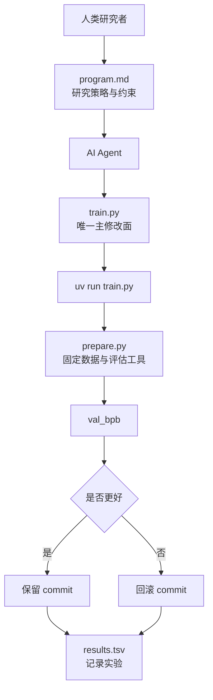

<!-- markdownlint-disable-file MD003 MD025 -->

# AutoResearch：AI 自主科研智能体完全指南

> 一句话判断：AutoResearch 真正新鲜的，不是“让 AI 帮你调参”，而是把研究员最常见、也最容易被脚本化的一段工作压缩成一个很硬的闭环：只改一个文件、固定跑 5 分钟、只认一个指标、结果不好就回滚。
>
> 前置知识：知道单卡训练、验证集、Transformer、优化器这些基本概念即可。
>
> 资料口径：本文基于 GitHub 仓库 README、program.md、prepare.py、train.py 和仓库主页公开信息写成，状态截至 2026-07-07。

---

## 学习目标

读完这篇文章，你应该能够：

1. 判断 AutoResearch 到底是在解决“研究流程”问题，还是“模型能力”问题。
2. 说清 `prepare.py`、`train.py`、`program.md`、`results.tsv` 各自负责什么。
3. 理解为什么固定 5 分钟预算和 `val_bpb` 指标是这套系统的地基。
4. 按照官方约束跑通第一次基线实验，并知道下一步该怎么迭代。
5. 判断它是否适合你的硬件、研究目标和工作方式。

## 目录

- [这套系统真正解决的是什么](#这套系统真正解决的是什么)
- [项目状态：热度很高，但它不是成熟训练框架](#项目状态热度很高但它不是成熟训练框架)
- [系统地图：四个文件，四种职责](#系统地图四个文件四种职责)
- [一次完整实验如何流过这套系统](#一次完整实验如何流过这套系统)
- [固定 5 分钟预算 + val_bpb，才让这个循环成立](#固定-5-分钟预算--val_bpb才让这个循环成立)
- [从源码看，Agent 真正能动哪些旋钮](#从源码看agent-真正能动哪些旋钮)

- [program.md 真正定义的是“研究政策”](#programmd-真正定义的是研究政策)
- [它和 nanochat、AutoML、传统超参搜索有什么区别](#它和-nanochatautoml传统超参搜索有什么区别)
- [快速上手：先跑单次，再进入自主实验](#快速上手先跑单次再进入自主实验)
- [小显存和非 NVIDIA 路线：能跑，但要降预期](#小显存和非-nvidia-路线能跑但要降预期)
- [适用边界：哪些人该用，哪些人先别用](#适用边界哪些人该用哪些人先别用)

- [常见错误与排查](#常见错误与排查)
- [常见问题](#常见问题)
- [自测](#自测)
- [练习](#练习)
- [进阶路径](#进阶路径)
- [参考资料](#参考资料)

---

## 这套系统真正解决的是什么

如果只看标题，你很容易把 AutoResearch 理解成“AI 自动做科研”。这话不算错，但不够精确。

它真正自动化的，不是完整科研流程，而是**单卡 LLM 预训练实验里最重复、最适合做 keep-or-discard 判断的那一段**：

1. 改一点训练代码。
2. 跑一次短实验。
3. 看验证指标有没有变好。
4. 变好就保留，变差就丢掉。
5. 继续下一轮。

这和很多人想象中的“AI 独立提出研究问题、设计理论、写论文”不是一回事。AutoResearch 的范围收得非常小，几乎小到有点刻意：

- 单 GPU。
- 单个训练脚本。
- 单个固定指标。
- 单个固定时间预算。
- 单个主战场文件 `train.py`。

也正因为它收得这么小，Agent 才有机会真的“自己跑一夜”。如果你把变量放大到多机训练、复杂数据管道、评估指标一堆、实验说明全靠人补，Agent 的自主性马上就会被工程复杂度吃掉。

换句话说，AutoResearch 的核心贡献不是发明了什么新模型，而是把“夜里不停做小实验”这件事，做成了一个**可比较、可回滚、可审查**的最小研究闭环。

## 项目状态：热度很高，但它不是成熟训练框架

截至 2026-07-07，GitHub 公开页面显示这个项目大致处在下面这个状态：

| 指标 | 公开状态 |
| ---- | ---- |
| Stars | 90.2k+ |
| Forks | 13k+ |
| Contributors | 9 |
| 最新公开提交 | `228791f` |
| License | MIT |
| 官方运行前提 | 单 NVIDIA GPU、Python 3.10+、`uv` |

这些数字说明两件事。

第一，它的传播性很强。Karpathy 把一个很容易让人产生画面感的想法写成了极小、可运行、可 fork 的仓库，天然适合被开发者转发和复现。

第二，**你不该把高热度误判成“功能完备”**。AutoResearch 不是 Lightning、DeepSpeed、Axolotl 这类训练框架，也不是标准的超参搜索平台。它更像一份带强约束的实验样板：你可以在它上面做很多事，但默认仓库本身故意不负责那些“企业级该有的东西”。

这点从 README 的口吻就能看出来。它不是在卖“完整方案”，而是在交付一个“你今晚就能跑起来的研究玩具”，只是这个玩具恰好足够真实。

## 系统地图：四个文件，四种职责

AutoResearch 能成立，靠的不是“AI 很聪明”，而是**边界切得死**。下面这张图是它的最小系统地图：



如果你只记一张表，记这张就够了：

| 文件 | 谁主导 | 负责什么 | 默认态度 |
| ---- | ---- | ---- | ---- |
| `prepare.py` | 仓库作者 | 固定常量、数据下载、Tokenizer、Dataloader、评估函数 | 不要改 |
| `train.py` | Agent | 模型、优化器、训练循环、主要超参数 | 这里随便试 |
| `program.md` | 人类 | 研究流程、keep/discard 规则、日志约束、复杂度偏好 | 持续迭代 |
| `results.tsv` | Agent + 人类都看 | 实验账本，记录每次尝试是否值得留下 | 不提交到 Git |

这套切法最重要的作用，是把“研究策略”和“训练实现”拆开。

传统研究工作流里，人会一边改代码，一边在脑子里记住“为什么这么改、失败后怎么回滚、下一步试什么”。AutoResearch 把这部分外显成 `program.md`，等于把“研究员的工作习惯”也当成可编辑对象。

## 一次完整实验如何流过这套系统

理解 AutoResearch 最好的方式，不是背文件名，而是跟着一次实验走完一圈。

官方 `program.md` 定义的大致流程是这样的：

### 第 1 步：先建一个独立实验分支

不是直接在当前分支乱改，而是先约定一个 run tag，例如 `jul7`，然后创建形如 `autoresearch/jul7` 的分支。这样一晚上的探索都挂在同一条分支上，保留下来的 commit 会形成一条实验轨迹。

### 第 2 步：先跑一次“什么都不改”的基线

这一步非常关键。第一轮不是灵光一现式优化，而是**记录 baseline**。没有基线，后面所有“变好了”都只是感觉。

### 第 3 步：Agent 只改 `train.py`

它可以换超参数、调模型深度、改优化器策略，甚至改局部架构，但默认不碰 `prepare.py`，也不准顺手把评估标准改掉。

### 第 4 步：跑一次固定 5 分钟实验

命令很朴素：

```bash
uv run train.py > run.log 2>&1
```

### 第 5 步：读取结果，只看关键指标

实验结束后，重点从日志里抽出两类信息：

- `val_bpb`：核心指标，越低越好。
- `peak_vram_mb`：副指标，用来评估代价是否失控。

### 第 6 步：写入实验账本，然后做 keep / discard 判断

`results.tsv` 的表头长这样：

```tsv
commit  val_bpb  memory_gb  status  description
```

一份合理的实验账本示例大概像这样：

```tsv
commit    val_bpb   memory_gb   status   description
a1b2c3d   0.997900  44.0        keep     baseline
b2c3d4e   0.995800  44.2        keep     lower depth and keep window pattern
c3d4e5f   0.000000  0.0         crash    double width caused OOM
```

这里最有意思的地方是：**AutoResearch 把“失败实验”也当成一等公民**。崩了就记 `crash`，变差就 `discard`。这不是噪音，而是研究搜索面的一部分。

## 固定 5 分钟预算 + val_bpb，才让这个循环成立

很多人第一次看这个项目，会把注意力放在“Agent 自动改代码”上。其实更关键的是两个看起来很朴素的约束：

1. 每轮训练只给 5 分钟。
2. 每轮比较只看 `val_bpb`。

少了任何一个，这套循环都会变得不稳定。

### 为什么必须是固定 5 分钟

在官方实现里，`prepare.py` 把 `TIME_BUDGET` 固定成 300 秒。`train.py` 的训练循环也按这个预算停表，且明确把启动和编译开销排除在外。

这样做有三个直接好处：

| 好处 | 具体意义 |
| ---- | ---- |
| 可比较 | 不管 Agent 把模型改成什么样，所有实验都在同一时间预算下比赛 |
| 可连续运行 | 每小时大约能做 12 次实验，一夜下来大概能积累近百次尝试 |
| 贴合真实硬件 | 它优化的是“你这台机器上 5 分钟能练出什么”，不是理论最佳点 |

代价也很明确：**不同机器之间的结果不能直接横向比较**。H100 上的最优配置，不会自动变成 M3 Max、RTX 4090 或 AMD 卡上的最优配置。

这不是缺陷，而是设计取舍。AutoResearch 优先解决的是“我自己的机器今晚该怎么探索”，不是“所有人共享一个公平榜单”。

### 为什么用 `val_bpb`，而不是随便一个 loss

`val_bpb` 是 validation bits per byte。源码里的评估逻辑会把验证集上的交叉熵按目标字节数归一化，再转成 bits per byte。

它的意义在于：**尽量把词表大小变化从比较里剥掉**。

如果你直接拿某些 token-level loss 去比，不同 tokenizer 或不同词表规模会让结果失真。`val_bpb` 不是万能指标，但对于“我要不要保留这次结构改动”这个问题，它足够稳定，也更接近 AutoResearch 需要的那种 apples-to-apples 比较。

一句话记忆：

- 固定 5 分钟，保证实验成本一致。
- 固定 `val_bpb`，保证胜负口径一致。

这两个固定项，才让 Agent 的搜索不是玄学。

## 从源码看，Agent 真正能动哪些旋钮

如果只看 README，你会觉得 `train.py` 只是个普通训练脚本。真正读过当前源码后，你会发现它其实比“玩具脚本”复杂一些，但复杂度仍然被压在单文件里。

### `prepare.py` 是护栏，不是 playground

`prepare.py` 里有几组特别关键的固定量：

```python
MAX_SEQ_LEN = 2048
TIME_BUDGET = 300
EVAL_TOKENS = 40 * 524288
VOCAB_SIZE = 8192
```

除此之外，它还负责：

- 下载 `climbmix-400b-shuffle` 数据分片。
- 训练 BPE Tokenizer。
- 固定一份 pinned validation shard。
- 提供 dataloader。
- 提供 `evaluate_bpb()`。

也就是说，`prepare.py` 本质上在扮演“裁判 + 赛道维护者”的角色。你可以 fork 它、改它，但那已经不是“在官方约束下跑 AutoResearch”了，而是开始做你自己的变体。

### `train.py` 是唯一主战场

当前版本的 `train.py` 大体有这些可调部位：

```python
ASPECT_RATIO = 64
HEAD_DIM = 128
WINDOW_PATTERN = "SSSL"
TOTAL_BATCH_SIZE = 2**19
DEPTH = 8
DEVICE_BATCH_SIZE = 128
```

这几个参数后面，其实挂着一整套设计选择：

- `DEPTH` 控制模型层数，是最直接的复杂度旋钮。
- `ASPECT_RATIO` 和 `HEAD_DIM` 决定模型宽度与头数推导方式。
- `WINDOW_PATTERN = "SSSL"` 表示交替使用短窗口和全窗口注意力，而不是所有层都全注意力。
- `TOTAL_BATCH_SIZE` 和 `DEVICE_BATCH_SIZE` 决定梯度累积步数与吞吐量。

源码里还有一些更值得注意的实现细节：

- 使用 `RMSNorm` 风格归一化。
- 使用 rotary embeddings。
- MLP 走的是 `ReLU^2` 路线，而不是最朴素的 GELU。
- 部分层带 value embedding / gate 机制。
- 优化器是 Muon + AdamW 的混合分组方案。
- 显式做 NaN / 爆炸 loss 的 fast-fail。

这意味着什么？意味着 AutoResearch 不是把 Agent 限定在“改两个超参数”的狭窄空间里。它允许改的范围其实很宽，只是**宽度被单文件边界约束住了**。这正是它比传统自动调参脚本更有意思的地方。

## `program.md` 真正定义的是“研究政策”

很多文章介绍 AutoResearch 时，会把 `program.md` 说成“给 Agent 的提示词文件”。这不算错，但说轻了。

更准确地说，`program.md` 定义的是这套系统的**研究政策**。

它至少规定了下面这些事：

| 规则 | 含义 |
| ---- | ---- |
| 第一轮必须跑 baseline | 先有基线，再谈优化 |
| 只能修改 `train.py` | 缩小搜索面，保证 diff 可审查 |
| 不能修改 `prepare.py` | 裁判不能和选手一起改 |
| 不能新增依赖 | 避免“为了优化一行指标，顺手改了半个系统” |
| 结果写入 `results.tsv` | 每次实验都要留下账本 |
| 指标更差就回滚 | 分支只向更好结果推进 |
| 复杂度也要计成本 | 不是所有微小提升都值得留下 |

这里最值得学的，是它把“研究员的判断标准”写死了。

比如 `program.md` 明确强调：如果一个改动只带来 0.001 级别的 `val_bpb` 提升，但引入了 20 行难看的 hack，未必值得保留；反过来，如果删掉一些东西，结果差不多甚至更好，那是简化收益，应该偏向保留。

这比“让 Agent 无限试”高级得多。它不是把 Agent 当随机搜索器，而是给 Agent 一套**带审美和复杂度偏好的研究纪律**。

## 它和 `nanochat`、AutoML、传统超参搜索有什么区别

README 已经点明：AutoResearch 的训练代码是从 [nanochat](https://github.com/karpathy/nanochat) 里 cherry-pick 和简化出来的单 GPU 版本。

但两者不要混为一谈。

| 对象 | 主要目标 | 核心特征 |
| ---- | ---- | ---- |
| `nanochat` | 更完整的训练与实现参考 | 平台覆盖更广，代码面更大 |
| AutoResearch | 给 Agent 一个可连续试验的最小研究场 | 单 GPU、单文件、固定时间预算 |
| 传统超参搜索 | 搜离散或连续参数空间 | 通常不改训练代码结构本身 |
| AutoML / NAS | 自动搜索结构或 pipeline | 往往系统更重，抽象更多 |

AutoResearch 的独特点，在于它把“结构改动”和“参数改动”放到了同一条 Agent 工作流里。Agent 既能改学习率，也能改窗口模式，甚至改局部架构，而不需要切换到另一套搜索系统。

这也是它的边界所在：

- 它没有做大规模实验调度。
- 没有帮你做多机资源编排。
- 没有可视化实验面板。
- 没有自动统计显著性。

所以更合理的定位不是“研究平台终局”，而是“研究自动化的一个很锋利的最小切片”。

## 快速上手：先跑单次，再进入自主实验

这里建议分成两条路径，不要一上来就让 Agent 跑通宵。

### 路径 A：先确认你的环境能跑单次训练

```bash
git clone https://github.com/karpathy/autoresearch.git
cd autoresearch
uv sync
uv run prepare.py
uv run train.py
```

如果这一步都没跑通，不要急着谈 Agent 自主实验。先把数据、Tokenizer、GPU 环境和单次训练打通。

### 路径 B：再进入自主实验模式

单次训练没问题后，再让 Agent 进场：

1. 打开仓库。
2. 读 `README.md`、`prepare.py`、`train.py`、`program.md`。
3. 禁掉不必要权限，避免 Agent 越界。
4. 先建 run branch。
5. 先跑 baseline。
6. 再开始第一轮真实修改。

README 给的启动提示很简单：

```text
Hi have a look at program.md and let's kick off a new experiment! let's do the setup first.
```

真正重要的不是这句 prompt 本身，而是你已经提前把实验边界和日志纪律定义好了。

### 一个更稳的采用顺序

如果你是第一次玩这类系统，我更建议按这个顺序走：

1. 只跑 `prepare.py` 和 `train.py`，确认 baseline 能出结果。
2. 人工改一个最小参数，比如 `DEPTH` 或 `TOTAL_BATCH_SIZE`，感受一次 keep / discard。
3. 再把这套判断规则交给 Agent。
4. 最后才考虑让它连续跑一整晚。

这样你对系统会有手感，不会把每次提升都归功于“Agent 很神”。

## 小显存和非 NVIDIA 路线：能跑，但要降预期

官方 README 说得很直接：当前代码要求单 NVIDIA GPU，官方测试环境是 H100。对 CPU、MPS、AMD 或 Windows 的支持，主要靠社区 fork。

公开列出来的 notable forks 包括：

| 平台 | 参考仓库 |
| ---- | ---- |
| macOS | [miolini/autoresearch-macos](https://github.com/miolini/autoresearch-macos) |
| macOS + MLX | [trevin-creator/autoresearch-mlx](https://github.com/trevin-creator/autoresearch-mlx) |
| Windows RTX | [jsegov/autoresearch-win-rtx](https://github.com/jsegov/autoresearch-win-rtx) |
| AMD GPU | [andyluo7/autoresearch](https://github.com/andyluo7/autoresearch) |

如果你打算在小显存平台上玩，README 给的思路很务实，不是“勉强照抄官方默认值”：

### 1. 先换低熵数据集

官方建议优先考虑 [TinyStories](https://huggingface.co/datasets/karpathy/tinystories-gpt4-clean)。数据更窄、更干净，小模型更容易在短时间预算里学到点东西。

### 2. 再降词表与上下文长度

- `VOCAB_SIZE` 可以从 8192 往下减。
- `MAX_SEQ_LEN` 可以大幅下调，比如到 256。
- `EVAL_TOKENS` 也要同步减少，不然评估时间会吞掉实验预算。

### 3. 把 `DEPTH` 当成第一复杂度旋钮

官方明确说了：在 `train.py` 里，控制模型复杂度最直接的旋钮是 `DEPTH`。从 8 降到 4，常常比你东改一点西改一点有效。

### 4. 小机器上优先试 `WINDOW_PATTERN = "L"`

默认的 `SSSL` 交替窗口模式在某些平台上可能并不划算。对于较弱设备，全部全窗口也许更慢，但实现更简单、行为更稳定，值得作为对照组。

这里最重要的心态是：**你在小机器上做的是“本机最优搜索”，不是“复现官方数字”**。如果硬把 H100 级配置压到 MacBook 上，再拿结果和官方截图比，意义不大。

## 适用边界：哪些人该用，哪些人先别用

AutoResearch 很吸引人，但不是人人都该上手。

### 适合的人

- 你有单卡 GPU，希望把夜里的空闲算力用起来。
- 你对“训练代码本身的搜索”感兴趣，不只想扫学习率。
- 你愿意把实验纪律写进文件，而不是只靠脑内记忆。
- 你接受很多实验会失败，而且失败也要记录。

### 暂时不太适合的人

- 你需要的是生产级训练平台、实验管理平台或集群调度系统。
- 你想做跨机器可严格复现的 benchmark 排名。
- 你没有 GPU，只想在 CPU 上无痛体验全部默认流程。
- 你还没搞清 baseline，已经想让 Agent 一晚上替你“发明新架构”。

一个很实用的判断标准是：

> 如果你自己本来就会在深夜做“改一点、跑 5 分钟、看趋势”的训练实验，AutoResearch 很可能适合你；如果你平时根本不这么工作，它也不会凭空替你创造研究方法。

## 常见错误与排查

这部分很实用，因为 AutoResearch 失败时，通常不是“AI 不够聪明”，而是边界没守住。

### 错误 1：没跑 `prepare.py` 就直接进训练

现象：找不到数据分片、Tokenizer 或 validation 数据。

排查方式：

1. 先确认 `~/.cache/autoresearch/` 里已经有 data 和 tokenizer。
2. 如果没有，先跑：

```bash
uv run prepare.py
```

### 错误 2：第一次实验就不是 baseline

现象：后面所有“提升”都没有稳固参照。

排查方式：

- 看 `results.tsv` 第一行是不是 `baseline`。
- 如果不是，建议重建实验分支，从原始版本重新记账。

### 错误 3：把 OOM 或 crash 当成“只是一次小失误”

现象：Agent 连续尝试大幅放大模型，日志里全是 crash，但实验账本不完整。

排查方式：

- 失败也写进 `results.tsv`。
- 把 `status` 标成 `crash`。
- 观察是不是某类改动反复导致同一类崩溃。

### 错误 4：横向比较不同机器上的 `val_bpb`

现象：拿 H100、4090、M3 Max 的结果直接排高低。

排查方式：

- 先确认双方是不是相同数据、相同 fork、相同时间预算、相同平台语义。
- 如果不是，就把比较目标改成“各自平台上的局部最优”，不要硬排总榜。

### 错误 5：为了提升一点指标，把代码改得越来越难看

现象：`val_bpb` 小幅下降了，但 `train.py` 复杂度明显恶化。

排查方式：

- 回到 `program.md` 的复杂度准则。
- 评估这次收益是否值得长期维护成本。

这类错误最容易被忽视，因为数字会让人上头。

## 常见问题

### Q1：AutoResearch 的“研究”到底自动到了什么程度？

它自动的是局部实验循环，不是完整科研生命周期。更准确地说，它把“训练脚本迭代 + 指标裁决 + 账本记录”自动化了。

### Q2：为什么这个项目 Stars 那么高？

因为它把一个很大的愿景压成了一个很容易理解、很容易 fork、很容易脑补未来形态的最小样板。传播效率高，不等于功能完备。

### Q3：它会取代人类研究员吗？

至少从当前仓库形态看，不会。它更像把研究员最机械的一段工作外包出去，让人把时间留给问题定义、约束设计和结果解释。

### Q4：可以直接把它当 AutoML 平台吗？

不太合适。它没有完整实验编排、资源调度、统计汇总和大规模对照基础设施，更像一个 Agent-first 的研究 harness。

### Q5：最值得先读哪个文件？

如果你想理解这套系统为什么成立，先读 `program.md`；如果你想理解它到底能改什么，再读 `train.py`；如果你想理解哪些东西故意不让你动，再读 `prepare.py`。

## 自测

看完后，你可以试着回答下面 5 个问题：

1. 为什么 AutoResearch 要把 Agent 的主要改动面收缩到 `train.py`？
2. 为什么 `TIME_BUDGET = 300` 不是一个随手写的常量，而是系统设计的一部分？
3. `val_bpb` 相比直接比较 token loss，多解决了什么问题？
4. `program.md` 为什么比“提示词模板”更接近研究纪律文件？
5. 如果你在 M3 Max 上跑一个社区 fork，为什么不该拿结果直接和官方 H100 结果拼总榜？

如果这 5 个问题你都能不看文章答出来，这篇文章的主线你就吃透了。

## 练习

如果你准备自己动手，建议按下面的顺序练，不要一上来就放任 Agent 无限制乱试：

1. **练习 1：跑通 baseline**
   目标：在原始官方代码上生成第一条 `baseline` 记录。
2. **练习 2：只改一个旋钮**
   目标：只改 `DEPTH` 或 `TOTAL_BATCH_SIZE`，观察 `val_bpb` 与 VRAM 的变化。
3. **练习 3：写自己的复杂度规则**
   目标：在 `program.md` 里明确什么样的收益值得增加复杂度，什么样的不值得。
4. **练习 4：复盘失败实验**
   目标：从 `results.tsv` 里挑 3 条失败记录，总结哪些思路以后不必再试。

这几步做完，你再让 Agent 连续跑一晚，体验会完全不同。

## 进阶路径

如果你不只想“把仓库跑起来”，而是想把它真正变成自己的研究工具，可以按这个顺序继续：

### 第一阶段：吃透官方边界

- 逐行读 `program.md` 的 keep / discard 逻辑。
- 理解 `prepare.py` 里哪些量是故意固定的。
- 读懂 `train.py` 的关键结构与优化器分组。

### 第二阶段：把你的研究偏好写进 `program.md`

- 明确你更偏向保守简化，还是激进尝试。
- 明确你对 VRAM 增长容忍到什么程度。
- 明确失败重试策略和停止条件。

### 第三阶段：迁移到你自己的数据和平台

- 换成更贴合你任务的数据。
- 调整 `MAX_SEQ_LEN`、词表规模与 batch 策略。
- 建立你自己的 baseline，而不是照搬公开数字。

### 第四阶段：从“单 Agent 调参”升级到“研究组织设计”

这也是 README 留下的真正悬念：当 `program.md` 已经不只是 prompt，而是研究组织的代码，那下一步就不只是“让一个 Agent 试”，而是“怎么设计一套更好的研究政策”。

这一步，才是 AutoResearch 往更大想象空间延伸的地方。

## 参考资料

- GitHub 仓库：[karpathy/autoresearch](https://github.com/karpathy/autoresearch)
- 官方 README：[README.md](https://raw.githubusercontent.com/karpathy/autoresearch/master/README.md)
- 研究流程约束：[program.md](https://raw.githubusercontent.com/karpathy/autoresearch/master/program.md)
- 固定数据与评估：[prepare.py](https://raw.githubusercontent.com/karpathy/autoresearch/master/prepare.py)
- 单文件训练实现：[train.py](https://raw.githubusercontent.com/karpathy/autoresearch/master/train.py)
- 上游训练参考：[karpathy/nanochat](https://github.com/karpathy/nanochat)
- 小模型低熵数据集：[TinyStories](https://huggingface.co/datasets/karpathy/tinystories-gpt4-clean)

最后给一个尽量不夸张的结论：AutoResearch 值得关注，不是因为它已经把“AI 做科研”做完了，而是因为它把这个问题里最容易被验证、最容易被自动化、也最容易一夜之间持续运行的那一块，先切了出来，而且切得很干净。
