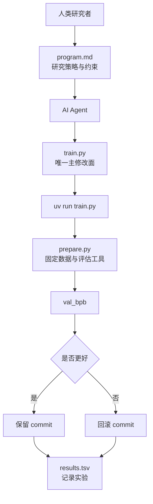

<!-- markdownlint-disable-file MD003 MD025 -->

# AutoResearch：AI 自主科研智能体完全指南

> 一句话判断：AutoResearch 真正新鲜的，不是"让 AI 帮你调参"，而是把研究员最常见、也最容易被脚本化的一段工作压缩成一个很硬的闭环——只改一个文件、固定跑 5 分钟、只认一个指标、结果不好就回滚。
>
> 前置知识：知道单卡训练、验证集、Transformer、优化器这些基本概念即可。
>
> 资料口径：本文基于 GitHub 仓库 README、program.md、prepare.py、train.py 逐行读完写成，状态截至 2026-07-08。

---

## 学习目标

读完这篇文章，你应该能够：

1. 判断 AutoResearch 到底是在解决"研究流程"问题，还是"模型能力"问题。
2. 说清 `prepare.py`、`train.py`、`program.md`、`results.tsv` 各自负责什么，以及为什么这样切。
3. 理解固定 5 分钟预算和 `val_bpb` 指标为什么是这套系统的地基，而不是随手选的参数。
4. 读懂 `train.py` 里的模型架构、Muon + AdamW 混合优化器、训练循环各自的实现要点。
5. 按照官方约束跑通第一次基线实验，并知道下一步该怎么迭代。
6. 判断它是否适合你的硬件、研究目标和工作方式。

## 目录

- [这套系统真正解决的是什么](#这套系统真正解决的是什么)
- [项目状态：热度很高，但它不是成熟训练框架](#项目状态热度很高但它不是成熟训练框架)
- [系统地图：四个文件，四种职责](#系统地图四个文件四种职责)
- [一次完整实验如何流过这套系统](#一次完整实验如何流过这套系统)
- [固定 5 分钟预算 + val_bpb，才让这个循环成立](#固定-5-分钟预算--val_bpb才让这个循环成立)
- [从源码看，Agent 真正能动哪些旋钮](#从源码看agent-真正能动哪些旋钮)
- [模型架构：比玩具脚本复杂得多的 GPT](#模型架构比玩具脚本复杂得多的-gpt)
- [优化器：Muon 加 AdamW 的混合分组方案](#优化器muon-加-adamw-的混合分组方案)
- [训练循环：时间预算驱动的工程细节](#训练循环时间预算驱动的工程细节)
- [数据管道：BOS 对齐与 best-fit packing](#数据管道bos-对齐与-best-fit-packing)
- [program.md 真正定义的是"研究政策"](#programmd-真正定义的是研究政策)
- [它和 nanochat、AutoML、传统超参搜索有什么区别](#它和-nanochatautoml传统超参搜索有什么区别)
- [快速上手：先跑单次，再进入自主实验](#快速上手先跑单次再进入自主实验)
- [小显存和非 NVIDIA 路线：能跑，但要降预期](#小显存和非-nvidia-路线能跑但要降预期)
- [适用边界：哪些人该用，哪些人先别用](#适用边界哪些人该用哪些人先别用)
- [常见错误与排查](#常见错误与排查)
- [常见问题](#常见问题)
- [自测](#自测)
- [练习](#练习)
- [进阶路径](#进阶路径)
- [参考资料](#参考资料)

---

## 这套系统真正解决的是什么

如果只看标题，你很容易把 AutoResearch 理解成"AI 自动做科研"。这个理解太宽了。

它真正自动化的，是**单卡 LLM 预训练实验里最重复、最适合做 keep-or-discard 判断的那一段**：

1. 改一点训练代码。
2. 跑一次短实验。
3. 看验证指标有没有变好。
4. 变好就保留，变差就丢掉。
5. 继续下一轮。

这和很多人想象中的"AI 独立提出研究问题、设计理论、写论文"不是一回事。AutoResearch 的范围收得非常小，几乎小到有点刻意：

- 单 GPU。
- 单个训练脚本。
- 单个固定指标。
- 单个固定时间预算。
- 单个主战场文件 `train.py`。

也正因为它收得这么小，Agent 才有机会真的"自己跑一夜"。如果你把变量放大到多机训练、复杂数据管道、评估指标一堆、实验说明全靠人补，Agent 的自主性马上就会被工程复杂度吃掉。

Karpathy 在 README 里把它说得很直白：你不再是像平时那样去碰 Python 文件，而是在编写 `program.md`——给 AI Agent 提供上下文、搭建自主研究组织的 Markdown 文件。默认的 `program.md` 故意只给一个最简骨架，但你能看出怎么在上面迭代，找到让研究进度最快的"研究组织代码"。

AutoResearch 没有发明新模型，它做的事情是把"夜里不停做小实验"压成一个**可比较、可回滚、可审查**的最小研究闭环。

## 项目状态：热度很高，但它不是成熟训练框架

截至 2026-07-08，GitHub 公开页面显示这个项目处在下面这个状态：

| 指标 | 公开状态 |
| ---- | ---- |
| Stars | 90.2k+ |
| Forks | 13k+ |
| Commits | 36 |
| Contributors | 9 |
| 最新公开提交 | `228791f`（2026-03-26，合并 PR #342） |
| 首次提交 | 2026-03-07 |
| License | MIT |
| 官方运行前提 | 单 NVIDIA GPU、Python 3.10+、`uv` |

这些数字说明两件事。

第一，它的传播性很强。Karpathy 把一个很容易让人产生画面感的想法写成了极小、可运行、可 fork 的仓库，天然适合被开发者转发和复现。从首次提交到 9 万 Star 只用了不到三周，这个速度即便在 AI 领域也不常见。

第二，**你不该把高热度误判成"功能完备"**。整个仓库只有 36 个 commit、9 个贡献者，核心代码集中在三个文件里。AutoResearch 不是 Lightning、DeepSpeed、Axolotl 这类训练框架，也不是标准的超参搜索平台。它更像一份带强约束的实验样板：你可以在它上面做很多事，但默认仓库本身故意不负责那些"企业级该有的东西"。

这点从 README 的口吻就能看出来。它没有在卖"完整方案"，更像在交付一个"你今晚就能跑起来的研究玩具"，只是这个玩具恰好足够真实。

## 系统地图：四个文件，四种职责

AutoResearch 能成立，靠的不是"AI 很聪明"，而是**边界切得死**。README 说得很明确：仓库故意保持很小，真正重要的只有三个文件。加上运行时产生的实验账本，一共四个角色。



如果你只记一张表，记这张就够了：

| 文件 | 谁主导 | 负责什么 | 默认态度 |
| ---- | ---- | ---- | ---- |
| `prepare.py` | 仓库作者 | 固定常量、数据下载、Tokenizer、Dataloader、评估函数 | 不要改 |
| `train.py` | Agent | 模型、优化器、训练循环、主要超参数 | 这里随便试 |
| `program.md` | 人类 | 研究流程、keep/discard 规则、日志约束、复杂度偏好 | 持续迭代 |
| `results.tsv` | Agent 写、人类看 | 实验账本，记录每次尝试是否值得留下 | 不提交到 Git |

这套切法最重要的作用，是把"研究策略"和"训练实现"拆开。

传统研究工作流里，人会一边改代码，一边在脑子里记住"为什么这么改、失败后怎么回滚、下一步试什么"。AutoResearch 把这部分外显成 `program.md`，等于把"研究员的工作习惯"也当成可编辑对象。README 里有一句话点破了这层意思：`program.md` 本质上是一个超轻量的"skill"。

## 一次完整实验如何流过这套系统

理解 AutoResearch 最好的方式，是跟着一次实验走完一圈。`program.md` 把整个流程写得非常死，几乎没有给 Agent 自由发挥的余地。

### 第 1 步：先约定一个 run tag，建独立分支

先和用户约定一个 tag，比如 `mar5`，然后创建 `autoresearch/mar5` 分支，不要直接在 master 上改。`program.md` 明确要求：这个分支不能已经存在，必须是全新的 run。这样一晚上的探索都挂在同一条分支上，保留下来的 commit 会形成一条实验轨迹。

### 第 2 步：先跑一次"什么都不改"的基线

这一步非常关键。`program.md` 写死了：第一轮必须跑 baseline，也就是原样运行 `train.py`。没有基线，后面所有"变好了"都只是感觉。

### 第 3 步：Agent 只改 `train.py`

它可以换超参数、调模型深度、改优化器策略，甚至改局部架构，但默认不碰 `prepare.py`，也不准顺手把评估标准改掉。`program.md` 还有一条硬约束：不能新增依赖，只能用 `pyproject.toml` 里已有的包。这是为了避免"为了优化一行指标，顺手改了半个系统"。

### 第 4 步：跑一次固定 5 分钟实验

命令很朴素：

```bash
uv run train.py > run.log 2>&1
```

`program.md` 特别强调：不要用 `tee`，不要让输出灌进 Agent 的上下文窗口。全部重定向到 `run.log`，后面再 grep 关键行。这是工程上的小细节，但对长时间运行的 Agent 来说很重要——如果每次实验都往上下文里灌几千行训练日志，Agent 很快就会被噪声淹没。

### 第 5 步：读取结果，只看关键指标

实验结束后，从日志里抽出两类信息：

```bash
grep "^val_bpb:\|^peak_vram_mb:" run.log
```

- `val_bpb`：核心指标，越低越好。
- `peak_vram_mb`：副指标，用来评估代价是否失控。

如果 grep 结果为空，说明跑崩了。这时候要 `tail -n 50 run.log` 看一下 Python 栈，判断是 typo 这种小问题还是思路本身有问题。

### 第 6 步：写入实验账本，然后做 keep / discard 判断

`results.tsv` 的表头长这样：

```tsv
commit  val_bpb  memory_gb  status  description
```

一份合理的实验账本示例大概像这样：

```tsv
commit    val_bpb   memory_gb   status   description
a1b2c3d   0.997900  44.0        keep     baseline
b2c3d4e   0.993200  44.2        keep     increase LR to 0.04
c3d4e5f   1.005000  44.0        discard  switch to GeLU activation
d4e5f6g   0.000000  0.0         crash    double model width (OOM)
```

有意思的是，AutoResearch 把"失败实验"也当成一等公民。崩了就记 `crash`，变差就 `discard`。这些记录本身就有价值——它们划出了搜索面的边界。`program.md` 甚至明确要求：不要把 `results.tsv` 提交到 Git，保持 untracked。这样实验账本是本地积累的，不会污染版本历史。

### 判断规则：什么时候 keep，什么时候 discard

`program.md` 给的规则比你想的更细致：

- `val_bpb` 更低 → keep，保留 commit，分支前进。
- `val_bpb` 持平或更高 → discard，`git reset` 回到之前的状态。
- 跑崩了 → 如果是小问题（typo、漏 import），修了重跑；如果思路本身有问题，标 `crash` 跳过。

还有一条容易忽略的规则：**复杂度也要计成本**。一个只带来 0.001 级别提升但加了 20 行难看 hack 的改动，未必值得保留；反过来，如果删掉一些东西结果差不多甚至更好，那是简化收益，应该偏向保留。这条规则直接写在 `program.md` 里，等于给 Agent 一套带审美的研究纪律。

## 固定 5 分钟预算 + val_bpb，才让这个循环成立

很多人第一次看这个项目，会把注意力放在"Agent 自动改代码"上。其实更关键的是两个看起来很朴素的约束：

1. 每轮训练只给 5 分钟。
2. 每轮比较只看 `val_bpb`。

少了任何一个，这套循环都会变得不稳定。

### 为什么必须是固定 5 分钟

在 `prepare.py` 里，`TIME_BUDGET` 被固定成 300 秒。`train.py` 的训练循环按这个预算停表，而且明确把前 10 步的编译和启动开销排除在外——只有 `step > 10` 之后的时间才算进 `total_training_time`。这样不管 Agent 把模型改成什么样，所有实验都在同一口径下比赛。

这样做有三个直接好处：

| 好处 | 具体意义 |
| ---- | ---- |
| 可比较 | 不管 Agent 把模型改成什么样，所有实验都在同一时间预算下比赛 |
| 可连续运行 | 每小时大约能做 12 次实验，一夜下来大概能积累近百次尝试 |
| 贴合真实硬件 | 它优化的是"你这台机器上 5 分钟能练出什么"，不是理论最佳点 |

README 自己也点出了代价：**不同机器之间的结果不能直接横向比较**。H100 上的最优配置，不会自动变成 M3 Max、RTX 4090 或 AMD 卡上的最优配置。

这是设计取舍，不是缺陷。AutoResearch 优先解决的是"我自己的机器今晚该怎么探索"，不负责"所有人共享一个公平榜单"。README 原话是：这让 autoresearch 能找到在给定时间预算内最适合你平台的最优模型，代价是你的结果和别人在别的算力上跑的结果没法直接比。

### 为什么用 `val_bpb`，而不是随便一个 loss

`val_bpb` 是 validation bits per byte。`prepare.py` 里 `evaluate_bpb()` 的实现逻辑是这样的：

1. 在固定验证分片 `shard_06542` 上跑前向，拿到每个 token 的交叉熵（单位是 nats）。
2. 用预计算的 `token_bytes` 查找表，把每个目标 token 映射成它的 UTF-8 字节数。特殊 token（字节数为 0）会被排除。
3. 把总 nats 除以 `log(2) * total_bytes`，得到 bits per byte。

```python
# prepare.py 里的核心逻辑（简化）
total_nats += (loss_flat * mask).sum().item()
total_bytes += nbytes.sum().item()
return total_nats / (math.log(2) * total_bytes)
```

它的意义在于：**尽量把词表大小变化从比较里剥掉**。

如果你直接拿 token-level loss 去比，不同 tokenizer 或不同词表规模会让结果失真——同样是交叉熵 2.0，词表 8192 和词表 4096 的信息密度完全不同。`val_bpb` 不是万能指标，但对于"我要不要保留这次结构改动"这个问题，它足够稳定，也更接近 AutoResearch 需要的那种 apples-to-apples 比较。

一句话记忆：

- 固定 5 分钟，保证实验成本一致。
- 固定 `val_bpb`，保证胜负口径一致。

这两个固定项，才让 Agent 的搜索不是玄学。

## 从源码看，Agent 真正能动哪些旋钮

如果只看 README，你会觉得 `train.py` 只是个普通训练脚本。真正逐行读过源码后，你会发现它比"玩具脚本"复杂得多，但复杂度仍然被压在单文件里。AutoResearch 比"传统自动调参脚本"有意思的地方就在这：Agent 能改的范围其实很宽，只是宽度被单文件边界约束住了。

### `prepare.py` 是护栏，不是 playground

`prepare.py` 里有几组特别关键的固定量：

```python
MAX_SEQ_LEN = 2048            # 上下文长度
TIME_BUDGET = 300             # 训练时间预算（秒）
EVAL_TOKENS = 40 * 524288     # 验证集评估的 token 数（约 2097 万）
VOCAB_SIZE = 8192             # BPE 词表大小
MAX_SHARD = 6542              # 最后一个数据分片编号
VAL_SHARD = 6542              # 固定验证集分片
```

除此之外，它还负责：

- 从 HuggingFace 下载 `climbmix-400b-shuffle` 的 parquet 分片，支持多线程下载和 5 次重试。
- 用 `rustbpe` 训练 BPE Tokenizer，再转成 `tiktoken` 格式保存。
- 把验证集固定钉在最后一个分片 `shard_06542`，训练时只用前面的分片。
- 提供 BOS 对齐、best-fit packing 的 dataloader。
- 提供 `evaluate_bpb()`——这是整个系统的"裁判函数"。

也就是说，`prepare.py` 本质上在扮演"裁判 + 赛道维护者"的角色。你可以 fork 它、改它，但一旦改了，你就已经脱离官方约束，在做自己的变体了。

### `train.py` 是唯一主战场

当前版本的 `train.py` 顶部有这些可调超参数：

```python
# 模型架构
ASPECT_RATIO = 64        # model_dim = depth * ASPECT_RATIO
HEAD_DIM = 128           # attention head 维度
WINDOW_PATTERN = "SSSL"  # 滑动窗口模式：L=全上下文，S=半上下文

# 优化
TOTAL_BATCH_SIZE = 2**19  # 每个优化器步的 token 数（约 524K）
EMBEDDING_LR = 0.6        # token embedding 学习率
UNEMBEDDING_LR = 0.004    # lm_head 学习率
MATRIX_LR = 0.04          # 矩阵参数学习率（Muon）
SCALAR_LR = 0.5           # 逐层标量学习率
WEIGHT_DECAY = 0.2        # Muon 的 cautious weight decay
ADAM_BETAS = (0.8, 0.95)
WARMUP_RATIO = 0.0        # LR warmup 时间比例
WARMDOWN_RATIO = 0.5      # LR warmdown 时间比例
FINAL_LR_FRAC = 0.0       # 最终 LR 占初始 LR 的比例

# 模型规模
DEPTH = 8                 # transformer 层数
DEVICE_BATCH_SIZE = 128   # 每设备 batch size
```

这几个参数后面，其实挂着一整套设计选择：

- `DEPTH` 控制模型层数，是最直接的复杂度旋钮。`model_dim` 会从 `DEPTH * ASPECT_RATIO` 推导出来，再对齐到 `HEAD_DIM` 的整数倍。
- `ASPECT_RATIO` 和 `HEAD_DIM` 决定模型宽度与头数推导方式。默认 `DEPTH=8` 时，`model_dim = 8 * 64 = 512`，对齐到 128 的倍数后是 512，头数就是 `512 / 128 = 4`。
- `WINDOW_PATTERN = "SSSL"` 表示交替使用短窗口（上下文的一半，即 1024）和全窗口（2048）注意力。最后一层强制用全窗口，保证能看到完整上下文。
- `TOTAL_BATCH_SIZE` 和 `DEVICE_BATCH_SIZE` 决定梯度累积步数：`grad_accum_steps = TOTAL_BATCH_SIZE // (DEVICE_BATCH_SIZE * MAX_SEQ_LEN)`。

但超参数只是表面。真正让 `train.py` 有意思的，是它里面那套从 nanochat cherry-pick 来的模型架构和优化器。下一节展开讲。

## 模型架构：比玩具脚本复杂得多的 GPT

很多人以为 AutoResearch 的 `train.py` 就是个最简 GPT。逐行读完源码后，你会发现它塞进了不少 2024-2025 年的研究成果。

### 归一化：RMSNorm，不是 LayerNorm

整个模型用 `F.rms_norm` 做归一化，没有 bias，也没有可学习参数。这是当前 LLM 预训练的主流选择，比传统 LayerNorm 更省显存、更快。

### 注意力：Flash Attention 3 + QK Norm + 滑动窗口

注意力模块是整个 `train.py` 里最密集的部分：

```python
# CausalSelfAttention.forward 的关键路径
q = self.c_q(x).view(B, T, self.n_head, self.head_dim)
k = self.c_k(x).view(B, T, self.n_kv_head, self.head_dim)
v = self.c_v(x).view(B, T, self.n_kv_head, self.head_dim)

# Value residual（ResFormer）：用 input-dependent gate 混入 value embedding
if ve is not None:
    gate = 2 * torch.sigmoid(self.ve_gate(x[..., :self.ve_gate_channels]))
    v = v + gate.unsqueeze(-1) * ve

# 旋转位置编码 + QK Norm
q, k = apply_rotary_emb(q, cos, sin), apply_rotary_emb(k, cos, sin)
q, k = norm(q), norm(k)

# Flash Attention 3，支持滑动窗口
y = fa3.flash_attn_func(q, k, v, causal=True, window_size=window_size)
```

几个值得注意的细节：

1. **Flash Attention 3**：源码会检测 GPU 架构，Hopper（capability 9.0）用 `varunneal/flash-attention-3`，其他卡回退到 `kernels-community/flash-attn3`。这就是为什么官方只测 H100——非 Hopper 卡上 FA3 的行为不一定稳。

2. **QK Norm**：对 q 和 k 各做一次 RMSNorm。这是 Gemma 2 等模型开始流行的技巧，能让训练更稳定，尤其是在大学习率下。

3. **滑动窗口**：`WINDOW_PATTERN = "SSSL"` 意味着前三层用半上下文窗口（1024），第四层用全上下文（2048），循环。`_compute_window_sizes` 会把 pattern 展开成每层的窗口大小，最后一层强制设成全窗口。短窗口层省算力，全窗口层保证长程依赖。

### Value Embedding：ResFormer 风格的 value residual

这是 `train.py` 里最容易让人困惑的设计。value embedding 只出现在**交替层**上：

```python
def has_ve(layer_idx, n_layer):
    """奇偶交替，最后一层一定有。"""
    return layer_idx % 2 == (n_layer - 1) % 2
```

有 VE 的层会额外维护一个 `nn.Embedding(vocab_size, kv_dim)`，直接从 token id 查出 value 向量。然后在注意力里，用一个 input-dependent 的 gate 把它混进 v：

```python
gate = 2 * torch.sigmoid(self.ve_gate(x[..., :32]))  # gate 初始化为 0，sigmoid(0)=0.5，乘 2 后是 1.0（中性）
v = v + gate.unsqueeze(-1) * ve
```

这个思路来自 ResFormer：给 value 路径加一条不经过注意力权重的捷径。每一层有 VE 的层都维护一个独立的 embedding 表，直接从 token id 查出 value 向量，用 gate 混入注意力的 v 里。`ve_gate` 初始化为零，意味着一开始 gate=1.0，value embedding 完整混入；随着训练进行，gate 可以学到要不要削弱它。

### MLP：ReLU 平方，不是 GELU

```python
def forward(self, x):
    x = self.c_fc(x)
    x = F.relu(x).square()   # ReGLU 风格的 ReLU^2
    x = self.c_proj(x)
    return x
```

这里用的是 `ReLU(x)^2`，不是最常见的 GELU 或 SwiGLU。ReLU 平方最早出现在 Primer（2021）里，后来在 SoRA、nanochat 等工作中被重新捡起来。它的好处是实现极简——一次 ReLU 加一次逐元素平方，没有分支也没有近似，在大规模训练里和 GELU 相当甚至更快。MLP 的中间维度是 `4 * n_embd`，这是标准配置。

### 残差连接：可学习的标量混合

每个 Block 的残差比标准的 `x = x + sublayer(x)` 多了一层加权：

```python
# GPT.forward 里的残差路径
x = self.resid_lambdas[i] * x + self.x0_lambdas[i] * x0
x = block(x, ve, cos_sin, self.window_sizes[i])
```

这里有两个可学习标量：

- `resid_lambdas[i]`：控制当前层输入的权重，初始化为 1.0。
- `x0_lambdas[i]`：控制原始 embedding 的权重，初始化为 0.1。

也就是说，每一层的输入是"上一层输出"和"原始 token embedding"的加权混合。这让网络可以选择在多大程度上保留原始输入信息，类似于一种更深层的残差 highway。

### Logit 软上限：softcap=15

```python
softcap = 15
logits = self.lm_head(x)
logits = logits.float()
logits = softcap * torch.tanh(logits / softcap)
```

logits 被限制在 `[-15, 15]` 之间。这是 Gemma 2 引入的技巧，能防止个别 logit 爆炸到几百几千，让 softmax 更稳定。对训练初期特别有用——没有 softcap 的话，偶尔一个超大 logit 就能把梯度带飞。

### 初始化：不是随便来的

`init_weights` 里的每个选择都有讲究：

- `wte`（token embedding）：正态分布 `N(0, 1)`。
- `lm_head`（输出层）：正态分布 `N(0, 0.001)`，故意小，配合 softcap 让初始 logits 平坦。
- 注意力和 MLP 的权重：均匀分布 `U(-s, s)`，其中 `s = sqrt(3) * n_embd^(-0.5)`。
- `c_proj`（输出投影）：初始化为零，保证残差路径一开始是恒等映射。
- `ve_gate`：初始化为零，gate 初始值为 1.0（中性）。
- embedding 类参数转成 `bfloat16`，省显存。

这套初始化是 nanochat 里反复调过的，每个数字都有来历。Agent 改 `train.py` 时如果动到初始化，很容易把训练搞崩，这也是为什么 `program.md` 要强调"先跑 baseline"。

## 优化器：Muon 加 AdamW 的混合分组方案

`train.py` 里最硬核的部分是 `MuonAdamW`——一个把 Muon 和 AdamW 缝在一起的混合优化器，从头实现的，没有依赖现成库。

### 为什么要分两组

源码把所有参数分成两组，用不同的优化器：

| 参数组 | 优化器 | 默认学习率 | 为什么 |
| ---- | ---- | ---- | ---- |
| 矩阵参数（注意力和 MLP 的权重） | Muon | 0.04 | 2D 矩阵，适合正交化更新 |
| token embedding | AdamW | 0.6 | 嵌入需要大学习率 |
| lm_head | AdamW | 0.004 | 输出层要稳，学习率小 |
| value embeddings | AdamW | 0.6 | 和 token embedding 同等对待 |
| 逐层标量（resid/x0 lambdas） | AdamW | 0.5 | 标量参数，独立学习率 |

Muon 是 2024 年底由 Keller Jordan 等人提出的新优化器，核心思路是：对 2D 矩阵参数的梯度做正交化（把梯度投影到正交矩阵附近），再用 Nesterov 动量更新。它在 modded-nanogPT（GPT-2 small speedrun）里把收敛速度推到了比 AdamW 更快的水平，后来被 nanochat 等项目采纳。

### Muon 的三步内部流程

`train.py` 里的 Muon 更新分三步，全部用 `@torch.compile` 融合编译过：

**第一步：Nesterov 动量。**

```python
momentum_buffer.lerp_(stacked_grads, 1 - momentum)
g = stacked_grads.lerp_(momentum_buffer, momentum)
```

momentum 本身会从 0.85 线性预热到 0.95（300 步内）：

```python
def get_muon_momentum(step):
    frac = min(step / 300, 1)
    return (1 - frac) * 0.85 + frac * 0.95
```

**第二步：Polar Express 正交化。**

这是 Muon 的核心。传统做法是对梯度做 SVD 然后取正交部分，但 SVD 太慢。Polar Express 用一组预计算的系数做多步 Newton-Schulz 迭代来近似：

```python
# 5 步 Newton-Schulz 迭代，系数是预计算好的
for a, b, c in polar_express_coeffs[:ns_steps]:
    A = X.mT @ X
    B = b * A + c * (A @ A)
    X = a * X + X @ B
```

源码里硬编码了 5 组系数（`polar_express_coeffs`），这些系数是通过离线优化得到的，能在 5 步内把梯度投影到接近正交矩阵。

**第三步：NorMuon 方差归约 + cautious weight decay。**

```python
# NorMuon：用二阶动量归一化梯度范数
second_momentum_buffer.lerp_(v_mean, 1 - beta2)
step_size = second_momentum_buffer.clamp_min(1e-10).rsqrt()
g = g * final_scale

# Cautious weight decay：只对梯度方向和参数方向一致的维度做衰减
mask = (g * stacked_params) >= 0
stacked_params.sub_(lr * g + lr * wd * stacked_params * mask)
```

Cautious weight decay 是一个有意思的细节：它只对那些"梯度和参数符号一致"的维度施加权重衰减。直觉是，如果梯度在推参数往某个方向走，那就别用 weight decay 把它往回拽。这比无差别的 weight decay 更温和。

### AdamW 的学习率缩放

AdamW 组的学习率按模型维度缩放：

```python
dmodel_lr_scale = (model_dim / 768) ** -0.5
```

这是 width-based LR scaling：模型越宽，学习率越小，按 `1/sqrt(d_model)` 缩放。思路和 μP（maximal update parameterization）一脉相承，但只保留了最核心的宽度缩放规则。基准是在 `d_model=768` 下调好的。Agent 如果改了 `DEPTH` 或 `ASPECT_RATIO` 导致 `model_dim` 变化，学习率会自动跟着缩，不需要手动调。

### 学习率调度：没有 warmup，直接 warmdown

```python
WARMUP_RATIO = 0.0      # 不做 warmup
WARMDOWN_RATIO = 0.5    # 后一半时间线性降到 0
FINAL_LR_FRAC = 0.0     # 最终学习率是 0
```

调度逻辑很简单：

```python
def get_lr_multiplier(progress):
    if progress < WARMUP_RATIO:
        return 1.0   # warmup_ratio=0，所以这分支不走
    elif progress < 1.0 - WARMDOWN_RATIO:
        return 1.0   # 前一半时间恒定
    else:
        cooldown = (1.0 - progress) / WARMDOWN_RATIO
        return cooldown  # 后一半时间线性降到 0
```

为什么不做 warmup？因为只有 5 分钟训练时间，warmup 会吃掉宝贵的有效训练步数。直接用恒定学习率跑前半段，后半段线性降下来，是短训练预算下的务实选择。

weight decay 也会随 progress 线性衰减到 0，让后期训练更"收敛"而不是继续正则化。

## 训练循环：时间预算驱动的工程细节

`train.py` 的训练循环有不少值得学的工程技巧，这些技巧直接决定了 5 分钟能跑多少步。

### 前 10 步不计时

```python
if step > 10:
    total_training_time += dt
```

前 10 步包含 `torch.compile` 的编译开销和 CUDA kernel 的首次加载，这几步会慢很多。如果把它们算进时间预算，实际训练步数会少很多。排除前 10 步后，`total_training_time` 反映的是稳态训练速度。

### 关掉 Python GC

```python
if step == 0:
    gc.collect()
    gc.freeze()
    gc.disable()
elif (step + 1) % 5000 == 0:
    gc.collect()
```

Python 的垃圾回收会触发周期性的全堆扫描，在 GPU 训练里这种停顿能到 500ms。第一步之后直接冻结 GC，每 5000 步手动触发一次。这个技巧在短训练里尤其重要——5 分钟里每多一次 500ms 停顿，就少跑好几百个 token。

### Fast fail：NaN 或 loss 爆炸立即退出

```python
if math.isnan(train_loss_f) or train_loss_f > 100:
    print("FAIL")
    exit(1)
```

如果训练 loss 超过 100 或者变成 NaN，直接退出，不浪费时间。`program.md` 要求 Agent 把这种情况记成 `crash` 然后跳过。这条防线能防止 Agent 在一个已经发散的配置上浪费完整 5 分钟。

### 时间预算检查

```python
if step > 10 and total_training_time >= TIME_BUDGET:
    break
```

每步结束后检查，一旦稳态训练时间超过 300 秒就停。注意是 `>=` 不是 `>`，而且只在 `step > 10` 后才检查，保证至少跑完编译期。

### 最终输出格式

训练结束后打印一段固定格式的摘要：

```text
---
val_bpb:          0.997900
training_seconds: 300.1
total_seconds:    325.9
peak_vram_mb:     45060.2
mfu_percent:      39.80
total_tokens_M:   499.6
num_steps:        953
num_params_M:     50.3
depth:            8
```

这个格式是给 Agent grep 用的。`program.md` 里教的提取方式就是 `grep "^val_bpb:" run.log`。固定格式 + grep 是最朴素也最可靠的 Agent-脚本接口。

## 数据管道：BOS 对齐与 best-fit packing

`prepare.py` 的 `make_dataloader` 是整个系统里最容易被忽略、但实际很精巧的部分。

### BOS 对齐

每个序列都以 BOS token 开头。Tokenizer 的 `encode` 方法支持 `prepend` 参数，会自动在每篇文档前插一个 BOS。这让模型始终知道"这里是一个新文档的开始"，对 packing 后的序列特别重要。

### Best-fit packing

传统的 padding 做法是：把每篇文档截断或补齐到固定长度，不够的用 padding token 填。这样会浪费大量计算。

`make_dataloader` 用的是 best-fit packing：

1. 维护一个文档缓冲区。
2. 对当前行剩余空间，找缓冲区里能整体放进去的最长文档。
3. 如果没有任何文档能放下，就裁剪最短的文档来填满剩余空间。
4. 100% 利用率，零 padding。

这样每行的 2048 个 token 全是有意义的内容，没有浪费。代价是实现复杂度上来了——要维护缓冲区、要做 best-fit 查找。但对 5 分钟训练来说，每一颗 token 都很珍贵，这个优化值得。

### 预分配的 GPU buffer

```python
row_buffer = torch.empty((B, row_capacity), dtype=torch.long)
cpu_buffer = torch.empty(2 * B * T, dtype=torch.long, pin_memory=True)
gpu_buffer = torch.empty(2 * B * T, dtype=torch.long, device="cuda")
```

数据加载用了三层 buffer：CPU 上的 `row_buffer` 做 packing，`cpu_buffer`（pin_memory）做 H2D 传输，`gpu_buffer` 直接在 GPU 上。每步只做一次 `gpu_buffer.copy_(cpu_buffer, non_blocking=True)`，`pin_memory` 加 `non_blocking` 让 H2D 拷贝可以和 GPU 计算重叠。

### 固定验证分片

验证集固定钉在 `shard_06542`——数据集的最后一个分片。训练时只用前面的分片，评估时只读这个分片。这保证了所有实验的验证集完全相同，`val_bpb` 的比较才有意义。

## program.md 真正定义的是"研究政策"

很多文章介绍 AutoResearch 时，会把 `program.md` 说成"给 Agent 的提示词文件"。这个说法太轻了。

更准确地说，`program.md` 定义的是这套系统的**研究政策**。它至少规定了下面这些事：

| 规则 | 含义 |
| ---- | ---- |
| 第一轮必须跑 baseline | 先有基线，再谈优化 |
| 只能修改 `train.py` | 缩小搜索面，保证 diff 可审查 |
| 不能修改 `prepare.py` | 裁判不能和选手一起改 |
| 不能新增依赖 | 避免"为了优化一行指标，顺手改了半个系统" |
| 结果写入 `results.tsv` | 每次实验都要留下账本 |
| 指标更差就回滚 | 分支只向更好结果推进 |
| 复杂度也要计成本 | 不是所有微小提升都值得留下 |
| 永不停止 | 一旦开始就别问人类要不要继续 |

最后一条值得单独说一下。`program.md` 里有一段加了粗体的 `NEVER STOP`：一旦实验循环开始，不要暂停问人类"要不要继续"，人类可能在睡觉。Agent 应该自主运行，直到被手动打断。如果想法用完了，就"想得更狠一点"——读代码里引用的论文，重读文件找新角度，尝试组合之前的差一点就成功的改动，或者试更激进的架构变化。

最值得学的一点，是它把"研究员的判断标准"写死了。

比如 `program.md` 明确强调：如果一个改动只带来 0.001 级别的 `val_bpb` 提升，但引入了 20 行难看的 hack，未必值得保留；反过来，如果删掉一些东西，结果差不多甚至更好，那是简化收益，应该偏向保留。

这比"让 Agent 无限试"高级得多。它给 Agent 的是一套**带审美和复杂度偏好的研究纪律**，而不是随机搜索。

## 它和 nanochat、AutoML、传统超参搜索有什么区别

README 已经点明：AutoResearch 的训练代码是从 nanochat 里 cherry-pick 和简化出来的单 GPU 版本。

但两者不要混为一谈。

| 对象 | 主要目标 | 核心特征 |
| ---- | ---- | ---- |
| nanochat | 更完整的训练与实现参考 | 平台覆盖更广，代码面更大，支持多种设备 |
| AutoResearch | 给 Agent 一个可连续试验的最小研究场 | 单 GPU、单文件、固定时间预算 |
| 传统超参搜索 | 搜离散或连续参数空间 | 通常不改训练代码结构本身 |
| AutoML / NAS | 自动搜索结构或 pipeline | 往往系统更重，抽象更多 |

AutoResearch 的独特点，在于它把"结构改动"和"参数改动"放到了同一条 Agent 工作流里。Agent 既能改学习率，也能改窗口模式，甚至改 MLP 激活函数，而不需要切换到另一套搜索系统。

它的边界也很清楚：

- 它没有做大规模实验调度。
- 没有帮你做多机资源编排。
- 没有可视化实验面板（不过仓库里附了一个 `analysis.ipynb`，可以用来分析 `results.tsv`）。
- 没有自动统计显著性。

所以更合理的定位是"研究自动化的一个很锋利的最小切片"，而非"研究平台终局"。

## 快速上手：先跑单次，再进入自主实验

这里建议分成两条路径，不要一上来就让 Agent 跑通宵。

### 路径 A：先确认你的环境能跑单次训练

```bash
# 1. 安装 uv（如果还没有）
curl -LsSf https://astral.sh/uv/install.sh | sh

# 2. 克隆仓库
git clone https://github.com/karpathy/autoresearch.git
cd autoresearch

# 3. 安装依赖
uv sync

# 4. 下载数据并训练 tokenizer（一次性，约 2 分钟）
uv run prepare.py

# 5. 手动跑一次训练实验（约 5 分钟）
uv run train.py
```

如果这一步都没跑通，不要急着谈 Agent 自主实验。先把数据、Tokenizer、GPU 环境和单次训练打通。`prepare.py` 默认下载 10 个训练分片加 1 个验证分片，够跑通完整流程。

### 路径 B：再进入自主实验模式

单次训练没问题后，再让 Agent 进场：

1. 打开仓库，让 Agent 读 `README.md`、`prepare.py`、`train.py`、`program.md`。
2. 禁掉不必要权限，避免 Agent 越界。
3. 先建 run branch，比如 `autoresearch/jul8`。
4. 先跑 baseline。
5. 再开始第一轮真实修改。

README 给的启动提示很简单：

```text
Hi have a look at program.md and let's kick off a new experiment! let's do the setup first.
```

真正重要的东西在 prompt 背后——你已经提前把实验边界和日志纪律定义好了。

### 一个更稳的采用顺序

如果你是第一次玩这类系统，我更建议按这个顺序走：

1. 只跑 `prepare.py` 和 `train.py`，确认 baseline 能出结果。
2. 人工改一个最小参数，比如 `DEPTH` 或 `TOTAL_BATCH_SIZE`，感受一次 keep / discard。
3. 再把这套判断规则交给 Agent。
4. 最后才考虑让它连续跑一整晚。

这样你对系统会有手感，不会把每次提升都归功于"Agent 很神"。

## 小显存和非 NVIDIA 路线：能跑，但要降预期

官方 README 说得很直接：当前代码要求单 NVIDIA GPU，官方测试环境是 H100。对 CPU、MPS、AMD 或 Windows 的支持，主要靠社区 fork。

公开列出来的 notable forks 包括：

| 平台 | 参考仓库 |
| ---- | ---- |
| macOS | [miolini/autoresearch-macos](https://github.com/miolini/autoresearch-macos) |
| macOS + MLX | [trevin-creator/autoresearch-mlx](https://github.com/trevin-creator/autoresearch-mlx) |
| Windows RTX | [jsegov/autoresearch-win-rtx](https://github.com/jsegov/autoresearch-win-rtx) |
| AMD GPU | [andyluo7/autoresearch](https://github.com/andyluo7/autoresearch) |

如果你打算在小显存平台上玩，README 给的思路很务实，不是"勉强照抄官方默认值"。以下是 README 原话整理出来的调参建议：

### 1. 先换低熵数据集

官方建议优先考虑 [TinyStories](https://huggingface.co/datasets/karpathy/tinystories-gpt4-clean)。这是 GPT-4 生成的短故事，数据范围窄、干净，小模型更容易在短时间预算里学到点东西。如果你在小模型上跑 climbmix 这种高熵数据，5 分钟可能连 loss 都没降下来。

### 2. 再降词表与上下文长度

- `VOCAB_SIZE` 可以从 8192 往下减，比如 4096、2048、1024，甚至直接用 256 的字节级 tokenizer。
- `MAX_SEQ_LEN` 可以大幅下调，比如到 256。
- `EVAL_TOKENS` 也要同步减少，不然评估时间会吞掉实验预算。

README 还提了一个组合技巧：降 `MAX_SEQ_LEN` 的同时，可以适当把 `DEVICE_BATCH_SIZE` 往上调一点来补偿，因为每次前向反向的 token 数是这两个的乘积。

### 3. 把 `DEPTH` 当成第一复杂度旋钮

官方明确说了：在 `train.py` 里，控制模型复杂度最直接的旋钮是 `DEPTH`。从 8 降到 4，常常比你东改一点西改一点有效。因为 `model_dim` 是 `DEPTH * ASPECT_RATIO` 推导的，降 `DEPTH` 会同时缩小宽度和参数量。

### 4. 小机器上优先试 `WINDOW_PATTERN = "L"`

默认的 `SSSL` 交替窗口模式在某些平台上可能并不划算，因为短窗口的 banded attention 实现可能没有优化好。对于较弱设备，全部全窗口也许更慢，但实现更简单、行为更稳定，值得作为对照组。

### 5. 降 `TOTAL_BATCH_SIZE`，但保持 2 的幂

README 建议可以降到 `2**14`（约 16K）甚至更低，但必须保持 2 的幂，因为 `grad_accum_steps` 的整除检查依赖这个。

在小机器上做的是"本机最优搜索"，不是"复现官方数字"。如果硬把 H100 级配置压到 MacBook 上，再拿结果和官方截图比，意义不大。

## 适用边界：哪些人该用，哪些人先别用

AutoResearch 很吸引人，但不是人人都该上手。

### 适合的人

- 你有单卡 GPU，希望把夜里的空闲算力用起来。
- 你对"训练代码本身的搜索"感兴趣，不只想扫学习率。
- 你愿意把实验纪律写进文件，而不是只靠脑内记忆。
- 你接受很多实验会失败，而且失败也要记录。

### 暂时不太适合的人

- 你需要的是生产级训练平台、实验管理平台或集群调度系统。
- 你想做跨机器可严格复现的 benchmark 排名。
- 你没有 GPU，只想在 CPU 上无痛体验全部默认流程。
- 你还没搞清 baseline，已经想让 Agent 一晚上替你"发明新架构"。

判断标准很直接：

> 如果你自己本来就会在深夜做"改一点、跑 5 分钟、看趋势"的训练实验，AutoResearch 很可能适合你；如果你平时根本不这么工作，它也不会凭空替你创造研究方法。

## 常见错误与排查

这部分很实用，因为 AutoResearch 失败时，问题通常出在边界没守住，而非 AI 本身不够聪明。

### 错误 1：没跑 `prepare.py` 就直接进训练

现象：找不到数据分片、Tokenizer 或 validation 数据。

排查方式：

1. 先确认 `~/.cache/autoresearch/` 里已经有 data 和 tokenizer 子目录。
2. 如果没有，先跑：

```bash
uv run prepare.py
```

默认下载 10 个训练分片加 1 个验证分片，首次跑大约 2 分钟。

### 错误 2：第一次实验就不是 baseline

现象：后面所有"提升"都没有稳固参照。

排查方式：

- 看 `results.tsv` 第一行是不是 `baseline`。
- 如果不是，建议重建实验分支，从原始版本重新记账。

### 错误 3：把 OOM 或 crash 当成"只是一次小失误"

现象：Agent 连续尝试大幅放大模型，日志里全是 crash，但实验账本不完整。

排查方式：

- 失败也写进 `results.tsv`，`val_bpb` 填 `0.000000`，`memory_gb` 填 `0.0`，`status` 标 `crash`。
- 观察是不是某类改动（比如反复加大 `DEPTH`）反复导致同一类崩溃。
- 如果某个思路连续 crash 三次以上，大概率是思路本身有问题，跳过它。

### 错误 4：横向比较不同机器上的 `val_bpb`

现象：拿 H100、4090、M3 Max 的结果直接排高低。

排查方式：

- 先确认双方是不是相同数据、相同 fork、相同时间预算、相同平台语义。
- 如果不是，就把比较目标改成"各自平台上的局部最优"，不要硬排总榜。
- README 原话就是：这个设计决策的 downside 是你的结果和别人在别的算力上跑的结果没法直接比。

### 错误 5：为了提升一点指标，把代码改得越来越难看

现象：`val_bpb` 小幅下降了，但 `train.py` 复杂度明显恶化。

排查方式：

- 回到 `program.md` 的复杂度准则：0.001 的提升值不值得 20 行 hack？
- 评估这次收益是否值得长期维护成本。
- 如果删掉一些代码结果差不多甚至更好，那是简化收益，应该 keep。

这类错误最容易被忽视，因为数字会让人上头。

### 错误 6：让输出灌进 Agent 上下文

现象：Agent 跑了几轮之后开始"忘事"或者给出离谱的修改建议。

排查方式：

- 确认实验命令是 `uv run train.py > run.log 2>&1`，不是直接让输出打到终端。
- 不要用 `tee`，因为 `tee` 会在写文件的同时也写终端。
- 只 grep 关键行：`grep "^val_bpb:\|^peak_vram_mb:" run.log`。

`program.md` 特意强调了这一点，因为长时间运行的 Agent 如果每轮都吃几千行训练日志，上下文窗口很快就会被噪声占满。

## 常见问题

### Q1：AutoResearch 的"研究"到底自动到了什么程度？

它自动的是局部实验循环，不是完整科研生命周期。更准确地说，它把"训练脚本迭代 + 指标裁决 + 账本记录"自动化了。提出问题、设计理论、写论文这些它都不管。

### Q2：为什么这个项目 Stars 那么高？

因为它把一个很大的愿景压成了一个很容易理解、很容易 fork、很容易脑补未来形态的最小样板。Karpathy 在 README 开头写的那段"10,205th generation"的科幻独白，本身就自带传播力。传播效率高，不等于功能完备。

### Q3：它会取代人类研究员吗？

至少从当前仓库形态看，不会。它更像把研究员最机械的一段工作外包出去，让人把时间留给问题定义、约束设计和结果解释。`program.md` 本身就需要人来写、来迭代，这本身就是高杠杆的研究工作。

### Q4：可以直接把它当 AutoML 平台吗？

不太合适。它没有完整实验编排、资源调度、统计汇总和大规模对照基础设施，更像一个 Agent-first 的研究 harness。如果你需要的是 Optuna 或 Ray Tune 那种东西，AutoResearch 不是替代品。

### Q5：最值得先读哪个文件？

如果你想理解这套系统为什么成立，先读 `program.md`；如果你想理解它到底能改什么，再读 `train.py`；如果你想理解哪些东西故意不让你动，再读 `prepare.py`。三个文件的阅读顺序正好对应"政策 → 执行 → 护栏"。

### Q6：Muon 优化器是什么？为什么要用它？

Muon 是 2024 年底提出的新优化器，核心是对 2D 矩阵参数的梯度做正交化（通过 Newton-Schulz 迭代近似极分解），再用 Nesterov 动量更新。它在小模型预训练里展现出比 AdamW 更快的收敛速度。AutoResearch 用 Muon 处理 transformer block 里的矩阵参数，用 AdamW 处理 embedding 和标量参数，是当前 nanochat 系列的标准配置。

### Q7：为什么验证集要固定在最后一个分片？

因为 `val_bpb` 的可比性依赖于所有实验用同一份验证数据。如果验证集随机变化，不同实验的指标就没法直接比。`prepare.py` 把 `VAL_SHARD` 硬编码成 `6542`，训练时只用前面的分片，评估时只读这个分片，从源头锁死了比较口径。

## 自测

看完后，你可以试着回答下面 6 个问题：

1. 为什么 AutoResearch 要把 Agent 的主要改动面收缩到 `train.py`？如果允许改 `prepare.py` 会出什么问题？
2. 为什么 `TIME_BUDGET = 300` 是系统设计的一部分，而不是随手写的常量？前 10 步不计时有什么用？
3. `val_bpb` 相比直接比较 token loss，多解决了什么问题？它是怎么把词表大小从比较里剥掉的？
4. `program.md` 为什么比"提示词模板"更接近研究纪律文件？它规定了哪些"研究员的判断标准"？
5. Muon 和 AdamW 在 `train.py` 里各自负责哪类参数？为什么要这样分？
6. 如果你在 M3 Max 上跑一个社区 fork，为什么不该拿结果直接和官方 H100 结果拼总榜？

如果这 6 个问题你都能不看文章答出来，这篇文章的主线你就吃透了。

## 练习

如果你准备自己动手，建议按下面的顺序练，不要一上来就放任 Agent 无限制乱试：

1. **练习 1：跑通 baseline**
   目标：在原始官方代码上生成第一条 `baseline` 记录，确认 `val_bpb` 能正常输出。
2. **练习 2：只改一个旋钮**
   目标：只改 `DEPTH` 或 `TOTAL_BATCH_SIZE`，观察 `val_bpb` 与 `peak_vram_mb` 的变化方向。
3. **练习 3：写自己的复杂度规则**
   目标：在 `program.md` 里明确什么样的收益值得增加复杂度，什么样的不值得，然后让 Agent 按你的规则跑一轮。
4. **练习 4：复盘失败实验**
   目标：从 `results.tsv` 里挑 3 条 `crash` 或 `discard` 记录，总结哪些思路以后不必再试。
5. **练习 5：对比两种窗口模式**
   目标：分别用 `WINDOW_PATTERN = "SSSL"` 和 `"L"` 各跑一次，对比 `val_bpb` 和 `mfu_percent`，理解短窗口的代价和收益。

这几步做完，你再让 Agent 连续跑一晚，体验会完全不同。

## 进阶路径

如果你不只想"把仓库跑起来"，而是想把它真正变成自己的研究工具，可以按这个顺序继续：

### 第一阶段：吃透官方边界

- 逐行读 `program.md` 的 keep / discard 逻辑和 NEVER STOP 段。
- 理解 `prepare.py` 里哪些量是故意固定的，`evaluate_bpb` 为什么是"裁判函数"。
- 读懂 `train.py` 的模型架构（RMSNorm、QK Norm、Value Embedding、残差标量混合）和优化器分组。

### 第二阶段：把你的研究偏好写进 `program.md`

- 明确你更偏向保守简化，还是激进尝试。
- 明确你对 VRAM 增长容忍到什么程度。
- 明确失败重试策略和停止条件。
- 考虑要不要加"每 N 轮强制回到 baseline 验证"这类元规则。

### 第三阶段：迁移到你自己的数据和平台

- 换成更贴合你任务的数据，重新训练 tokenizer。
- 调整 `MAX_SEQ_LEN`、词表规模与 batch 策略。
- 建立你自己的 baseline，而不是照搬公开数字。
- 如果在非 NVIDIA 平台上跑，参考社区 fork 的实现差异。

### 第四阶段：从"单 Agent 调参"升级到"研究组织设计"

这也是 README 留下的真正悬念：当 `program.md` 已经不只是 prompt，而是研究组织的代码，那下一步就不只是"让一个 Agent 试"，而是"怎么设计一套更好的研究政策"。

README 原话提到：你能看出怎么在上面迭代，找到让研究进度最快的"研究组织代码"，怎么往混合里加更多 Agent。这一步，才是 AutoResearch 往更大想象空间延伸的地方。

## 参考资料

- GitHub 仓库：[karpathy/autoresearch](https://github.com/karpathy/autoresearch)
- 官方 README：[README.md](https://raw.githubusercontent.com/karpathy/autoresearch/master/README.md)
- 研究流程约束：[program.md](https://raw.githubusercontent.com/karpathy/autoresearch/master/program.md)
- 固定数据与评估：[prepare.py](https://raw.githubusercontent.com/karpathy/autoresearch/master/prepare.py)
- 单文件训练实现：[train.py](https://raw.githubusercontent.com/karpathy/autoresearch/master/train.py)
- 实验分析 notebook：[analysis.ipynb](https://github.com/karpathy/autoresearch/blob/master/analysis.ipynb)
- 上游训练参考：[karpathy/nanochat](https://github.com/karpathy/nanochat)
- 小模型低熵数据集：[TinyStories](https://huggingface.co/datasets/karpathy/tinystories-gpt4-clean)
- Karpathy 项目介绍推文：[x.com/karpathy/status/2029701092347630069](https://x.com/karpathy/status/2029701092347630069)

最后给一个尽量不夸张的结论：AutoResearch 值得关注，因为它把"AI 做科研"这个问题里最容易被验证、最容易被自动化、也最容易一夜之间持续运行的那一块，先切了出来，而且切得很干净。`train.py` 里那一套从 nanochat 搬来的模型架构和 Muon 优化器，已经足够让 Agent 在真实的研究空间里探索，而不只是调几个超参数。剩下的想象空间，留给了 `program.md` 这个"研究组织代码"会怎么演化。
