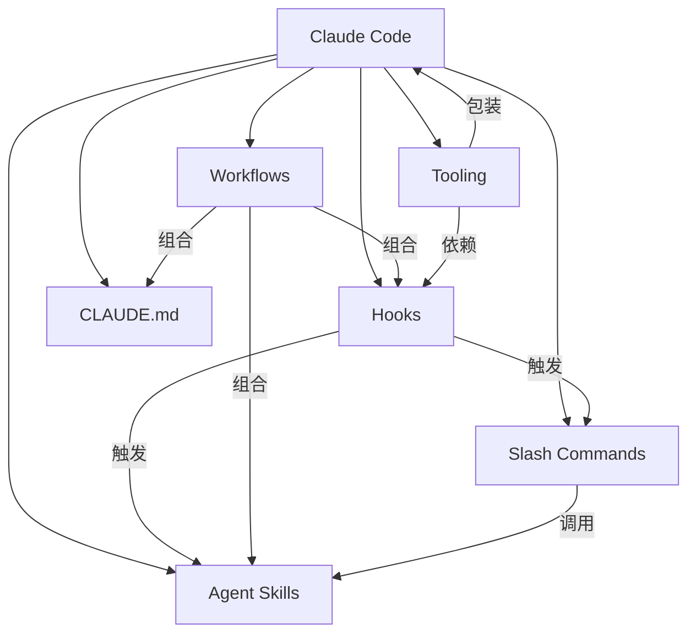

# Awesome Claude Code 资源指南：从看过到用起来

Claude Code 生态里不缺工具列表，缺的是搞清楚 **这些扩展在你的工作流里分别解决什么问题，以及按什么顺序把它们串起来**。本文基于 34.4k Stars 的 [Awesome Claude Code](https://github.com/hesreallyhim/awesome-claude-code) 资源合集，从 Skills、Workflows、Hooks（钩子）到 Tooling（工具链），梳理一条能用起来的路径。

如果你已经用过 Claude Code 的基础功能、写过一两份 `CLAUDE.md`，这篇文章会帮你在几十个项目里挑出真正对你管用的那几个。

---

## 学习目标

读完本文，你应该能回答这几个问题：

- Skills 和 Slash Commands（斜杠命令）到底有什么区别？什么时候该用哪个？
- 怎么把 Hooks 嵌到自己的开发流程里，而不是装完就忘？
- Ralph Wiggum 这类自主循环模式什么时候比手动交互划算？
- 已有项目里最先该装哪几个 Skill？自己从头写 Skill 该拿哪个当模板？
- 贡献回 Awesome List 的完整链路是什么？

---

## 一、看懂这张地图

把 Awesome Claude Code 收录的六类资源摊开看，它们之间不是平行的——有些是“原材料”（配置、脚本），有些是“打包好的方案”（Workflow、Tooling），还有一类是“用户与 Agent 之间的交互入口”（Slash Commands）。

### 1.1 资源关系总览



这张图的核心含义是：Skills、Hooks、CLAUDE.md 是基础构件，Workflows 把它们打包成可复用的流程，Tooling 则是在整个 Claude Code 之上做应用层的封装。Slash Commands 是你和 Agent 之间的交互入口，既可以调用 Skill，也可以独立运行。

如果你刚开始接触，记住一条就够了：**Skill 教 Agent 怎么做事，Hook 决定什么时候自动做事，Workflow 把多个 Skill 和 Hook 编成一套流程。**

### 1.2 六类资源一览

| 分类 | 你把它想成什么 | 一句话说明 |
|------|--------------|-----------|
| Agent Skills | 专业能力卡 | 模型控制的配置文件，教 Claude Code 做特定领域的事 |
| Workflows | 操作手册 | 把多个 Skill + Hook + CLAUDE.md 打包成一套流程 |
| Hooks | 自动化触发器 | 在工具执行前后、报错时自动跑的脚本 |
| Slash Commands | 快捷指令 | 你手动调用的提示词模板 |
| CLAUDE.md | 项目说明书 | 告诉 Claude Code 你的项目怎么组织的文件 |
| Tooling | 外部 App | 构建在 Claude Code 之上的独立应用程序 |

### 1.3 项目数据

| 指标 | 数值 |
|------|------|
| GitHub Stars | **34.4k** |
| GitHub Forks | **2.5k** |
| 提交数 | 935 次 |

### 1.4 一个任务流过系统的例子

假设你要给一个 Python 项目加新 API 端点，并确保代码风格和测试都过关。一套典型流程大概是：

1. 你输入 `/implement`，这是一个 Slash Command，背后调用了 `writing-plans` Skill。
2. `writing-plans` 把需求拆成 5 个小任务，每步 2-5 分钟。
3. 每完成一个任务，`post-tool` Hook 自动跑 `black` 和 `ruff` 格式化代码。
4. 全部任务完成后，`subagent-driven-development` Skill 启动子 Agent 并行跑单元测试。
5. 测试通过后，`/git-commit` Slash Command 生成 Conventional Commits 格式的提交信息。

这一整条链路里，Skill 负责“知道怎么做事”，Hook 负责“在正确时机自动执行”，Slash Command 负责“让你用一句话启动整个流程”。你不需要在每个步骤之间手动切换工具。

---

## 二、核心分类详解

### 2.1 Agent Skills

Agent Skills 是模型控制的配置文件（文件、脚本、资源），让 Claude Code 能处理需要专门知识的任务。跟 Slash Commands 的关键区别：Skill 是 Agent 自己决定调用的，而 Slash Command 是你手动输入的。

**推荐 Skills**：

| 技能 | 作者 | 场景 |
|------|------|------|
| **Superpowers** | obra | 软件工程全流程，从需求到发布 |
| **AgentSys** | avifenesh | DevOps 工作流自动化，IaC 代码生成 |
| **Claude Scientific Skills** | K-Dense | 科研、工程计算、金融建模、学术写作 |
| **Book Factory** | robertguss | 自动化电子书出版流水线 |
| **cc-devops-skills** | akin-ozer | DevOps 工程师常用技能集 |
| **Trail of Bits Security** | trailofbits | 安全审计与漏洞检测 |

**Superpowers 详解**

Superpowers 是目前最活跃的 Skills 集合，覆盖了软件工程的标准流程。以下五个 Skill 是按你可以依次使用的顺序排的：

| Skill | 你用它做什么 | 调用时机 |
|-------|-------------|---------|
| `brainstorming` | 苏格拉底式追问，把模糊需求逼成明确规格 | 项目开始时 |
| `writing-plans` | 把规格拆成 2-5 分钟能做完的小任务 | 需求明确后 |
| `subagent-driven-development` | 启动多个子 Agent 并行完成不同任务 | 执行阶段 |
| `test-driven-development` | RED-GREEN-REFACTOR 循环 | 写代码过程中 |
| `code-review` | 代码审查并给出可落地的修改建议 | 提交前 |

**安装**：

```bash
/claude-code install https://github.com/obra/superpowers
```

### 2.2 Workflows

Workflow 是紧密关联的 Claude Code 原生资源集合，用于完成特定项目。如果你已经在用某个 Workflow，它会帮你决定“什么时候调用哪个 Skill、什么时候触发哪个 Hook”，这样你就不需要每次都从头想一遍流程。

**推荐 Workflows**：

| 工作流 | 作者 | 说明 |
|--------|------|------|
| **RIPER Workflow** | tony | Research-Plan-Execute-Review 阶段分离 |
| **AB Method** | ayoubben18 | 原则驱动的 Spec 驱动开发 |
| **Claude Code PM** | ranaroussi | 项目管理完整工作流 |
| **Ralph Wiggum** | 多个作者 | 自主 AI 循环直到任务完成 |

**Ralph Wiggum 模式**

Ralph Wiggum 的核心思路是：给 Agent 一个目标、一组工具和一个停止条件，让它自己循环推进直到达成目标。适合那些你已经清楚要什么结果、但不想每一步都手动交互的任务——比如批量重构、文档生成、跨文件的一致性修改。

```bash
# Ralph 工作原理
while [任务未完成] && [未超限]; do
    Claude_Code 执行任务
    if [满足完成条件]; then
        标记完成
    fi
done
```

**相关项目**：

| 项目 | 说明 |
|------|------|
| **awesome-ralph** | Ralph 资源合集 |
| **ralph-claude-code** | 自主开发框架，智能退出检测 |
| **ralph-orchestrator** | 被 Anthropic 官方文档引用 |
| **The Ralph Playbook** | 详细的 Ralph 技术指南 |

### 2.3 Tooling

Tooling 是构建在 Claude Code 之上的独立应用程序。它们不是 Claude Code 的内置功能，而是用外部程序包装或扩展 Claude Code 的能力。

**推荐工具**：

| 工具 | 作者 | 说明 |
|------|------|------|
| **claude-devtools** | matt1398 | 会话可视化分析桌面应用 |
| **Claude Composer** | possibilities | Claude Code 小增强工具 |
| **recall** | zippoxer | 会话全文搜索 |
| **cclogviewer** | Brads3290 | JSONL 会话文件 HTML 查看器 |
| **cc-tools** | Veraticus | Go 实现的 Hooks 和工具 |
| **ContextKit** | FlineDev | 4 阶段规划方法论 |

### 2.4 Status Lines

状态栏显示工具，实时监控 Claude Code 运行状态。

- **Claude HUD**（jarrodwatts）— 显示上下文使用量、活动工具、运行中的 Agents、待办进度

### 2.5 Hooks

Hooks 是在特定事件触发时执行的自动化脚本。它们不会主动被调用——你把它们配好后，到了对应的时机 Claude Code 会自己跑。

| Hook 类型 | 什么时候触发 | 典型用途 |
|-----------|-------------|---------|
| `pre-tool` | 工具执行前 | 代码格式化、权限检查 |
| `post-tool` | 工具执行后 | 自动提交、通知、日志记录 |
| `on-compact` | 上下文压缩时 | 备份当前状态 |
| `on-error` | 错误发生时 | 告警、自动重试 |

关键约束：Hook 脚本必须是可执行文件，且路径相对于 `~/.claude/` 目录。

### 2.6 Slash Commands

Slash Commands 是你手动调用的快捷指令。它们是提示词模板，可以包含变量，也可以嵌套调用 Skill。

| 命令类别 | 示例 | 实际用途 |
|----------|------|---------|
| 版本控制 | `/git-commit`, `/pr-create` | 生成提交信息、创建 PR |
| 代码分析 | `/explain`, `/review` | 解释代码逻辑、审查变更 |
| 上下文加载 | `/context-load`, `/prime` | 加载项目文档到上下文 |
| 文档 | `/readme`, `/changelog` | 生成或更新文档 |
| CI/CD | `/deploy`, `/test` | 触发部署或测试流程 |

---

## 三、快速开始

### 3.1 安装 Claude Code

```bash
# macOS/Linux
npm install -g @anthropic-ai/claude-code

# 启动
claude
```

### 3.2 使用 Skills

```bash
# 安装 Skill
/claude-code install https://github.com/obra/superpowers

# 使用 Skill
/superpowers brainstorm
```

### 3.3 配置 Hooks

在 `~/.claude/settings.json` 中配置：

```json
{
  "hooks": {
    "pre-tool": "./hooks/pre-tool.sh",
    "post-tool": "./hooks/post-tool.sh"
  }
}
```

### 3.4 编写 CLAUDE.md

在项目根目录创建 `CLAUDE.md`：

```markdown
# 项目背景
这是一个 Python Web 应用，使用 FastAPI + React。

# 技术栈
- 后端：FastAPI, SQLAlchemy, PostgreSQL
- 前端：React 18, TypeScript, TailwindCSS

# 代码规范
- 使用 Black 格式化
- 类型注解必须完整
- 提交信息遵循 Conventional Commits
```

---

## 四、精选项目

### 4.1 Superpowers

**GitHub**: [obra/superpowers](https://github.com/obra/superpowers)
**Stars**: 118k+

这是目前生态里装机量最大的 Skills 集合。它的价值不在于 Skill 数量多，而在于把软件工程的标准流程拆成了几个可以独立使用、也可以串联的模块。你可以先用 `code-review` 一个 Skill 试试效果，也可以走完 brainstorming → writing-plans → TDD → code-review 一整条链。

| Skill | 功能 |
|-------|------|
| `brainstorming` | 苏格拉底式需求澄清 |
| `writing-plans` | 分解成 2-5 分钟的小任务 |
| `subagent-driven-development` | 子 Agent 并行执行 |
| `test-driven-development` | RED-GREEN-REFACTOR 循环 |

### 4.2 Claude Scientific Skills

**GitHub**: [K-Dense/claude-scientific-skills](https://github.com/K-Dense-AI/claude-scientific-skills)

这套 Skills 面向科研场景，覆盖了从实验设计到论文写作的完整链路。如果你是研究生或研究员，最实用的三个方向是：数据分析（实验数据处理和统计检验）、工程计算（数值模拟和参数优化）以及学术写作（文献综述和论文润色）。金融建模方向则适合量化分析场景。

### 4.3 Trail of Bits Security Skills

**GitHub**: [trailofbits/skills](https://github.com/trailofbits/skills)

安全审计方向的标杆。Trail of Bits 是业界知名的安全公司，这套 Skills 把他们的审计方法论做成了 Agent 可直接调用的配置：

- CodeQL 静态分析
- Semgrep 规则编写
- 变体分析
- 修复验证
- 差异代码审查

如果你要做安全审计或漏洞检测，优先装这套，再考虑其他通用 Skills。

### 4.4 claudekit

| 功能 | 说明 |
|------|------|
| 自动保存检查点 | 防止工作丢失 |
| 代码质量 Hooks | 自动化质量门禁 |
| 规格生成执行 | TDD 支持 |
| 20+ 专业 Subagents | Oracle、Code Reviewer 等 |

---

## 五、CLAUDE.md 编写指南

### 5.1 基本结构

```markdown
# 项目名称

简短描述项目做什么。

## 技术栈
- 框架/语言/数据库

## 代码规范
- 格式化工具
- 命名约定
- 提交规范

## 项目结构
├── src/       # 源代码
├── tests/     # 测试
└── docs/      # 文档
```

### 5.2 分类参考

| 类型 | 示例 |
|------|------|
| 语言特定 | Python、JavaScript、Go |
| 领域特定 | Web 开发、数据科学 |
| 项目脚手架 | Next.js、Django |

---

## 六、Alternative Clients

Claude Code 的替代客户端：

| 客户端 | 说明 |
|--------|------|
| **Cursor** | AI 代码编辑器 |
| **Windsurf** | Codeium 产品 |
| **GitHub Copilot** | 微软出品 |
| **Cline** | 开源替代 |

---

## 七、最佳实践

### 7.1 Skill 选择建议

不是所有项目都需要装一整套 Skills。以下是按场景的推荐：

| 场景 | 推荐 Skill | 为什么 |
|------|-----------|--------|
| 全栈开发 | Superpowers | 覆盖需求到部署全流程 |
| 安全审计 | Trail of Bits | 方法论成熟，直接用于生产 |
| 科研计算 | Claude Scientific | 唯一的科研专用 Skills 集 |
| DevOps | cc-devops-skills | 专注 IaC 和 CI/CD |

### 7.2 Hooks 自动化

```bash
# pre-tool hook 示例：自动格式化
#!/bin/bash
if [[ "$CLAUDE_TOOL" == "Write" ]]; then
    prettier --write "$CLAUDE_TOOL_INPUT"
fi
```

### 7.3 工作流集成

```bash
# 使用 RIPER 工作流
/riper-research 研究新功能
/riper-plan 制定计划
/riper-execute 执行开发
/riper-review 代码审查
```

---

## 八、常见问题

### Q1：如何选择合适的 Skill？

| 需求 | 推荐 |
|------|------|
| 快速上手 | Superpowers |
| 专业领域 | 领域特定 Skills |
| 安全审计 | Trail of Bits |

### Q2：Ralph 循环安全吗？

Ralph 有多重保护：

- Rate Limiting 防止过度调用
- Circuit Breaker 自动熔断
- 人工监督模式可用

### Q3：如何贡献到 Awesome List？

1. Fork 仓库
2. 添加项目到相应分类
3. 更新 `THE_RESOURCES_TABLE.csv`
4. 提交 PR

---

## 九、从哪里开始

具体怎么落地，取决于你目前的阶段：

**如果你刚装好 Claude Code**

1. 先写一份 `CLAUDE.md`，把项目的基本信息告诉 Agent。
2. 装 [Superpowers](https://github.com/obra/superpowers)，只用 `code-review` 一个 Skill 试试效果。
3. 配一个最简单的 `post-tool` Hook：写完代码自动格式化。

**如果你已经在日常使用**

1. 把 Superpowers 的 `writing-plans` + `test-driven-development` 串起来，体验端到端的 Skill 组合。
2. 试一次 [Ralph Wiggum](https://github.com/frankbria/ralph-claude-code) 自主循环——找一个你明确知道要什么结果但不想一步步交互的任务（比如批量重命名、文档生成）。
3. 读 [The Ralph Playbook](https://github.com/ClaytonFarr/ralph-playbook)，理解自主循环的边界和陷阱。

**如果你想给团队推广**

1. 选一个 Workflow（RIPER 或 AB Method），在团队项目里跑通一遍，把它写进项目的 `CLAUDE.md`。
2. 用 [claude-devtools](https://github.com/matt1398/claude-devtools) 分析团队成员的会话，找出高频操作，把重复操作用 Hook 或 Slash Command 自动化。
3. 把你们发现的好项目贡献回 [Awesome Claude Code](https://github.com/hesreallyhim/awesome-claude-code)。

不急着一步到位。Claude Code 的扩展体系是按模块化设计的，你可以从单个 Hook 或单个 Skill 开始，用熟了再考虑 Workflow 层面的整合。

---

## 资源速查

| 资源 | 链接 |
|------|------|
| Awesome Claude Code | https://github.com/hesreallyhim/awesome-claude-code |
| Superpowers | https://github.com/obra/superpowers |
| Ralph Playbook | https://github.com/ClaytonFarr/ralph-playbook |
| claude-devtools | https://github.com/matt1398/claude-devtools |
| Trail of Bits Security | https://github.com/trailofbits/skills |

*文档版本 1.2 | 更新日期：2026-06-02*