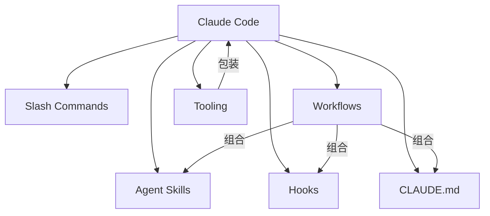

# Awesome Claude Code 资源指南：从看过到用起来

Claude Code 生态里不缺工具列表，缺的是搞清楚 **这些扩展在你的工作流里分别解决什么问题，以及按什么顺序把它们串起来**。基于 5.4 万 Stars 的 [Awesome Claude Code](https://github.com/hesreallyhim/awesome-claude-code) 资源合集（2026 年 9 月收录 220+ 条），从 Skills、Workflows、Hooks（钩子）到 Tooling（工具链），梳理一条能用起来的路径。

帮你在两百多条资源里挑出真正对你管用的那几个。

---

## 学习目标

读完本文，你可以回答这几个问题：

- Skills 和 Slash Commands（斜杠命令）到底有什么区别？什么时候该用哪个？
- 怎么把 Hooks 嵌到自己的开发流程里，而不是装完就忘？
- Ralph Wiggum 这类自主循环模式什么时候比手动交互划算？
- 已有项目里最先该装哪套 Skill？自己从头写 Skill 该拿哪个当模板？
- 推荐资源进 Awesome List 的正确方式是什么？

---

## 一、看懂这张地图

Awesome Claude Code 按资源类型分节收录。本文展开讲的六类，在列表里各有独立章节：Skills、Workflows、Hooks、Slash Commands、CLAUDE.md、Tooling。它们之间不是平行的——有些是"原材料"（配置、脚本），有些是"打包好的方案"（Workflow、Tooling），还有一类是"用户与 Agent 之间的交互入口"（Slash Commands）。

### 1.1 资源关系总览


```mermaid
graph TD
    CC[Claude Code] --> SK[Agent Skills]
    CC --> HK[Hooks]
    CC --> SC[Slash Commands]
    CC --> MD[CLAUDE.md]
    CC --> WF[Workflows]
    CC --> TL[Tooling]

    WF -->|组合| SK
    WF -->|组合| HK
    WF -->|组合| MD
    TL -->|包装| CC
```

这张图说的是：Skills、Hooks、CLAUDE.md 是基础构件，Workflows 把它们打包成可复用的流程，Tooling 则是在整个 Claude Code 之上做应用层的封装。Slash Commands 是你和 Agent 之间的交互入口，独立于前几者运行。除这六类，列表还有 Status Lines（状态栏定制）、Alternative Clients（替代前端）和官方文档导航几个章节，后文会提到。

如果你刚开始接触，记住一条就够了：**Skill 教 Agent 怎么做事，Hook 决定什么时候自动做事，Workflow 把多个 Skill 和 Hook 编成一套流程。**

### 1.2 六类资源一览

| 分类 | 你把它想成什么 | 一句话说明 |
|------|--------------|-----------|
| Agent Skills | 专业能力卡 | 模型控制的配置文件，教 Claude Code 做特定领域的事 |
| Workflows | 操作手册 | 把多个 Skill + Hook + CLAUDE.md 打包成一套流程 |
| Hooks | 自动化触发器 | 在生命周期事件点（工具调用前后、压缩前等）自动执行的命令 |
| Slash Commands | 快捷指令 | 你手动调用的提示词模板 |
| CLAUDE.md | 项目说明书 | 告诉 Claude Code 你的项目怎么组织的文件 |
| Tooling | 外部 App | 构建在 Claude Code 之上的独立应用程序 |

### 1.3 项目数据

| 指标 | 数值（2026-09-21，GitHub API） |
|------|------|
| GitHub Stars | **54.4k** |
| GitHub Forks | **4.7k** |
| 收录资源 | 220+ 条 |
| 提交数 | 1851 次 |

### 1.4 一个任务流过系统的例子

假设你要给一个 Python 项目加新 API 端点，并确保代码风格和测试都过关。装好 Superpowers（下文详解的 Skills 集合）之后，一套典型流程大概是：

1. 你用自然语言描述需求。`brainstorming` Skill **自动激活**——Superpowers 的 Skill 不需要手动调用，它在写代码前主动追问，把模糊想法逼成明确规格。
2. 设计确认后，`writing-plans` 把工作拆成 2-5 分钟的小任务，每个任务带文件路径和验证步骤。
3. 每次写完文件，`PostToolUse` Hook 自动跑格式化脚本（比如 `black` 和 `ruff`）。
4. `subagent-driven-development` 为每个任务派发独立的子 Agent，做完一个审一个。
5. 收尾时用 `/commit`（列表收录的斜杠命令，来自 evmts 团队）按 Conventional Commits 格式生成提交信息。

这一整条链路里，Skill 负责"知道怎么做事"，Hook 负责"在正确时机自动执行"，Slash Command 负责"让你用一句话启动收尾动作"。你不需要在每个步骤之间手动切换工具。

---

## 二、核心分类详解

### 2.1 Agent Skills

Agent Skills 是模型控制的配置文件（文件、脚本、资源），让 Claude Code 能处理需要专门知识的任务。跟 Slash Commands 的关键区别：Skill 是 Agent 自己决定调用的，而 Slash Command 是你手动输入的。

**推荐 Skills**：

| 技能 | 作者 | 场景 |
|------|------|------|
| **Superpowers** | obra | 软件工程全流程，从需求到发布 |
| **AgentSys** | avifenesh | 任务到生产的自动化：PR 管理、代码清理、性能排查、多 Agent 代码审查 |
| **Claude Scientific Skills** | K-Dense | 科研、工程计算、金融建模、学术写作 |
| **Book Factory** | robertguss | 自动化电子书出版流水线 |
| **cc-devops-skills** | akin-ozer | DevOps 工程师技能集，生成高质量 IaC 代码 |
| **Trail of Bits Security** | trailofbits | 安全审计与漏洞检测 |

**Superpowers 详解**

Superpowers 是生态里关注度最高的 Skills 集合（29 万 Stars），覆盖软件工程的标准流程。官方 README 把六个 Skill 列成一条工作链，顺序如下：

| Skill | 你用它做什么 | 调用时机 |
|-------|-------------|---------|
| `brainstorming` | 苏格拉底式追问，把模糊需求逼成明确规格 | 项目开始时，自动激活 |
| `using-git-worktrees` | 建隔离工作区、跑项目初始化、确认测试基线干净 | 设计通过后 |
| `writing-plans` | 把规格拆成 2-5 分钟能做完的小任务 | 需求明确后 |
| `subagent-driven-development`（或 `executing-plans`） | 逐任务派发子 Agent 并审查；或在当前会话内联执行 | 执行阶段，二选一 |
| `test-driven-development` | 强制 RED-GREEN-REFACTOR 循环 | 写代码过程中 |
| `requesting-code-review` | 对照计划审查，按严重度报告问题，Critical 级阻断推进 | 任务间隙，提交前 |

**安装**：

```bash
# 从 Anthropic 官方插件市场安装
/plugin install superpowers@claude-plugins-official

# 或者用 Superpowers 自建市场
/plugin marketplace add obra/superpowers-marketplace
/plugin install superpowers@superpowers-marketplace
```

装完即生效，不需要额外配置。

### 2.2 Workflows

Workflow 是紧密关联的 Claude Code 原生资源集合，用于完成特定项目。如果你已经在用某个 Workflow，它会帮你决定"什么时候调用哪个 Skill、什么时候触发哪个 Hook"，这样你就不需要每次都从头想一遍流程。

**推荐 Workflows**：

| 工作流 | 作者 | 说明 |
|--------|------|------|
| **RIPER Workflow** | tony | Research-Innovate-Plan-Execute-Review 五阶段分离 |
| **AB Method** | ayoubben18 | 原则驱动的 Spec 驱动开发 |
| **Claude Code PM** | ranaroussi | 项目管理完整工作流（8.4k Stars） |
| **Ralph Wiggum** | 多个作者 | 自主 AI 循环直到任务完成 |

**Ralph Wiggum 模式**

Ralph Wiggum 的核心思路是：给 Agent 一个目标、一组工具和一个停止条件，让它自己循环推进直到达成目标。适合那些你已经清楚要什么结果、但不想每一步都手动交互的任务——比如批量重构、文档生成、跨文件的一致性修改。

```bash
# Ralph 工作原理
while [任务未完成] && [未超限]; do
    Claude_Code 执行任务
    if [满足完成条件]; then
        标记完成
    fi
done
```

**相关项目**：

| 项目 | 说明 |
|------|------|
| **awesome-ralph** | Ralph 资源合集 |
| **Ralph for Claude Code** | 自主开发框架，内置智能退出检测、速率限制和熔断模式 |
| **ralph-orchestrator** | Anthropic 的 Ralph 插件文档也引用了它 |
| **The Ralph Playbook** | 详细的 Ralph 技术指南 |

### 2.3 Tooling

Tooling 是构建在 Claude Code 之上的独立应用程序。它们不是 Claude Code 的内置功能，而是用外部程序包装或扩展 Claude Code 的能力。

**推荐工具**：

| 工具 | 作者 | 说明 |
|------|------|------|
| **claude-devtools** | matt1398 | 会话可视化分析桌面应用 |
| **Claude Composer** | possibilities | Claude Code 小增强工具 |
| **recall** | zippoxer | 会话全文搜索，搜到即恢复 |
| **cclogviewer** | Brads3290 | JSONL 会话文件 HTML 查看器 |
| **cc-tools** | Veraticus | Go 实现的 Hooks 和工具 |
| **ContextKit** | FlineDev | 4 阶段规划方法论 |

### 2.4 Status Lines

状态栏定制，把模型、用量、Git 状态这些信息常驻在终端状态栏上。这一节更新很快，两个代表：

- **CCometixLine**（Haleclipse）— Rust 写的高性能状态栏，带 Git 集成和用量追踪。
- **Claude HUD**（jarrodwatts）— 当前列表里热度最高的一款（2.8 万 Stars），显示上下文使用量、活动工具、运行中的 Agents、待办进度。

### 2.5 Hooks

Hooks 是在 Claude Code 生命周期特定事件点自动执行的命令。它们不会主动被调用——你把它们配好后，到了对应的时机 Claude Code 会自己跑。事件由 Claude Code 官方定义，常用的有：

| 事件 | 什么时候触发 | 典型用途 |
|------|-------------|---------|
| `PreToolUse` | 工具执行前 | 拦截危险命令、权限检查 |
| `PostToolUse` | 工具执行后 | 自动格式化、日志记录 |
| `UserPromptSubmit` | 你提交提示词时 | 注入项目上下文 |
| `PreCompact` | 上下文压缩前 | 备份当前状态 |
| `SessionStart` / `SessionEnd` | 会话开始/结束 | 环境准备、收尾通知 |
| `Stop` | 一轮回答结束 | 完成通知 |

完整事件清单见官方 [Hooks reference](https://code.claude.com/docs/en/hooks)。配置写在 `~/.claude/settings.json`（对全部项目生效）或项目里的 `.claude/settings.json`（可提交进仓库）。触发时，Claude Code 把事件上下文以 JSON 从标准输入传给脚本。Hook 不只支持 shell 命令，还可以是 HTTP 端点、MCP 工具调用、提示词甚至子 Agent。

### 2.6 Slash Commands

Slash Commands 是你手动调用的快捷指令。它们是提示词模板，可以包含变量。列表按用途分子节，每类挑两个真实收录的命令：

| 命令类别 | 示例 | 实际用途 |
|----------|------|---------|
| 版本控制 | `/commit`, `/create-pr` | 按项目规范生成提交、走完整 PR 流程 |
| 代码分析 | `/check`, `/tdd` | 质量与安全检查、TDD 流程引导 |
| 上下文加载 | `/context-prime`, `/prime` | 加载项目结构与关键文档到上下文 |
| 文档 | `/docs`, `/add-to-changelog` | 生成文档、按既有格式追加变更日志 |
| CI/CD | `/release`, `/run-ci` | 管理发布流程、迭代修复 CI 报错 |

---

## 三、快速开始

### 3.1 安装 Claude Code

```bash
# macOS/Linux
npm install -g @anthropic-ai/claude-code

# 启动
claude
```

### 3.2 使用 Skills

```bash
# 安装 Superpowers 插件
/plugin install superpowers@claude-plugins-official

# 安装后直接用自然语言描述需求即可
# brainstorming 会在写代码前自动激活，无需手动调用
```

### 3.3 配置 Hooks

在 `~/.claude/settings.json` 中配置：

```json
{
  "hooks": {
    "PostToolUse": [
      {
        "matcher": "Write|Edit",
        "hooks": [
          {
            "type": "command",
            "command": "${CLAUDE_PROJECT_DIR}/.claude/hooks/format.sh"
          }
        ]
      }
    ]
  }
}
```

这三层嵌套的含义：选一个事件（`PostToolUse`），加一个匹配器（只对 Write 和 Edit 工具生效），再定义要执行的命令。

### 3.4 编写 CLAUDE.md

在项目根目录创建 `CLAUDE.md`：

```markdown
# 项目背景
这是一个 Python Web 应用，使用 FastAPI + React。

# 技术栈
- 后端：FastAPI, SQLAlchemy, PostgreSQL
- 前端：React 18, TypeScript, TailwindCSS

# 代码规范
- 使用 Black 格式化
- 类型注解必须完整
- 提交信息遵循 Conventional Commits
```

---

## 四、精选项目

### 4.1 Superpowers

**GitHub**: [obra/superpowers](https://github.com/obra/superpowers)
**Stars**: 289k+（2026-09-21）

这是目前生态里关注度最高的 Skills 集合。它的价值不在于 Skill 数量多，而在于把软件工程的标准流程拆成了可以独立生效、也可以串成整链的模块：六个核心 Skill 按上文 §2.1 的顺序依次激活，从需求澄清一直到代码审查。装完之后你什么都不用配，先拿一个小需求跑一遍，观察每个 Skill 在什么时机介入——这比读任何文档都直观。

### 4.2 Claude Scientific Skills

**GitHub**: [K-Dense-AI/scientific-agent-skills](https://github.com/K-Dense-AI/scientific-agent-skills)（原名 claude-scientific-skills，4.6 万 Stars）

这套 Skills 面向科研场景，覆盖了从实验设计到论文写作的完整链路。如果你是研究生或研究员，最实用的三个方向是：数据分析（实验数据处理和统计检验）、工程计算（数值模拟和参数优化）以及学术写作（文献综述和论文润色）。金融建模方向则适合量化分析场景。

### 4.3 Trail of Bits Security Skills

**GitHub**: [trailofbits/skills](https://github.com/trailofbits/skills)

安全审计方向的标杆。Trail of Bits 是业界知名的安全公司，这套 Skills 把他们的审计方法论做成了 Agent 可直接调用的配置：

- CodeQL 静态分析
- Semgrep 静态分析
- 变体分析
- 修复验证
- 差异代码审查

如果你要做安全审计或漏洞检测，优先装这套，再考虑其他通用 Skills。

### 4.4 claudekit

**GitHub**: [carlrannaberg/claudekit](https://github.com/carlrannaberg/claudekit)

| 功能 | 说明 |
|------|------|
| 自动保存检查点 | 防止工作丢失 |
| 代码质量 Hooks | 自动化质量门禁 |
| 规格生成执行 | TDD 支持 |
| 20+ 专业 Subagents | Oracle、Code Reviewer 等 |

---

## 五、CLAUDE.md 编写指南

### 5.1 基本结构

```markdown
# 项目名称

简短描述项目做什么。

## 技术栈
- 框架/语言/数据库

## 代码规范
- 格式化工具
- 命名约定
- 提交规范

## 项目结构
├── src/       # 源代码
├── tests/     # 测试
└── docs/      # 文档
```

### 5.2 分类参考

列表的 CLAUDE.md Files 节按三类收录真实项目的范例文件：

| 类型 | 示例 |
|------|------|
| 语言特定 | Kotlin 多平台、Go、TypeScript |
| 领域特定 | 安全审计工具、游戏开发 |
| 项目脚手架 | Monorepo、MCP 服务端 |

---

## 六、Alternative Clients

列表里这一类指的是 **Claude Code 的替代界面和前端**——用别的 UI 来驱动同一个引擎，而不是竞品编辑器。几个代表：

| 客户端 | 说明 |
|--------|------|
| **Claudable** | 开源 Web 构建器，底层调用 Claude Code、Cursor Agent 等本地 CLI 来构建和部署产品 |
| **crystal** | 桌面应用，编排、监控多个 Claude Code Agent（现名 Nimbalyst） |
| **Omnara** | 跨终端、Web、手机同步 Claude Code 会话的指挥中心，支持远程监督和人工介入 |
| **claude-tmux** | 在 tmux 弹窗里管理所有 Claude Code 实例，快速切换、监控状态 |

---

## 七、推荐做法

### 7.1 Skill 选择建议

不是所有项目都需要装一整套 Skills。以下是按场景的推荐：

| 场景 | 推荐 Skill | 为什么 |
|------|-----------|--------|
| 全栈开发 | Superpowers | 覆盖需求到部署全流程 |
| 安全审计 | Trail of Bits | 方法论成熟，直接用于生产 |
| 科研计算 | Claude Scientific | 科研场景覆盖最全 |
| DevOps | cc-devops-skills | 专注生成高质量 IaC 代码 |

### 7.2 Hooks 自动化

接着 §3.3 的配置，`format.sh` 长这样：

```bash
#!/bin/bash
# Claude Code 把事件上下文以 JSON 从 stdin 传入
input=$(cat)
file_path=$(echo "$input" | jq -r '.tool_input.file_path')

case "$file_path" in
  *.ts|*.tsx|*.js|*.jsx|*.json|*.md) prettier --write "$file_path" ;;
esac
```

脚本从 stdin 的 JSON 里取出 `tool_input.file_path`，按扩展名决定要不要跑 Prettier。格式化放在 `PostToolUse`（写完之后）而不是写之前——拦截写操作会让每次编辑都多一步等待。

### 7.3 工作流集成

```bash
# 使用 RIPER 工作流（五阶段，命令以冒号分隔）
/riper:research 分析认证系统现状
/riper:innovate 头脑风暴几种方案
/riper:plan 制定 OAuth2 接入计划
/riper:execute
/riper:review
```

`/riper:strict` 可以开启严格模式，强制每个阶段只做该阶段的事。

---

## 八、常见问题

### Q1：如何选择合适的 Skill？

| 需求 | 推荐 |
|------|------|
| 快速上手 | Superpowers |
| 专业领域 | 领域特定 Skills |
| 安全审计 | Trail of Bits |

### Q2：Ralph 循环安全吗？

Ralph 本身只是一个"循环运行直到完成"的朴素技巧，安全性完全取决于具体实现。列表收录的 Ralph for Claude Code 内置了智能退出检测、速率限制、熔断模式和防死循环的安全护栏；ralph-wiggum-bdd 则走另一条路——保留人工监督模式，跑的时候必须有人盯着。朴素循环加自主权限确实有风险，选带护栏的实现，或者守住人工监督，是两类现成答案。

### Q3：如何推荐资源进 Awesome List？

作者把推荐流程做成了自动化 issue 表单，但几条硬规则要知道（来自 CONTRIBUTING.md）：

1. 只通过 [issue 表单](https://github.com/hesreallyhim/awesome-claude-code/issues/new?template=recommend-resource.yml)推荐，**不要开 PR**——README 的原话是：唯一被允许向这个仓库提交 PR 的，只有 Claude 自己。
2. 收录门槛：项目至少 14 天且仍在活跃开发，或者至少 100 Stars。
3. 一次只能推荐一个资源，且必须由人提交（资源本身可以是 AI 写的）。
4. 描述写成单行的客观陈述，不要推销腔，不要 emoji。
5. 列表采用 CC BY-NC-ND 4.0 协议：可以 fork 和署名转载，但不能分发修改版，不能商用。

---

## 九、从哪里开始

具体怎么落地，取决于你目前的阶段：

**如果你刚装好 Claude Code**

1. 先写一份 `CLAUDE.md`，把项目的基本信息告诉 Agent。
2. 装 [Superpowers](https://github.com/obra/superpowers)，拿一个小需求跑一遍完整流程，看 `brainstorming` 和 `requesting-code-review` 分别在什么时机自动介入。
3. 配一个最简单的 `PostToolUse` Hook：写完代码自动格式化。

**如果你已经在日常使用**

1. 让 Superpowers 的 `writing-plans` + `test-driven-development` 串起来，体验端到端的 Skill 组合。
2. 试一次 [Ralph Wiggum](https://github.com/frankbria/ralph-claude-code) 自主循环——找一个你明确知道要什么结果但不想一步步交互的任务（比如批量重命名、文档生成）。
3. 读 [The Ralph Playbook](https://github.com/ClaytonFarr/ralph-playbook)，理解自主循环的边界和陷阱。

**如果你想给团队推广**

1. 选一个 Workflow（RIPER 或 AB Method），在团队项目里跑通一遍，把它写进项目的 `CLAUDE.md`。
2. 用 [claude-devtools](https://github.com/matt1398/claude-devtools) 分析团队成员的会话记录，找出高频操作，把重复操作用 Hook 或 Slash Command 自动化。
3. 发现好项目，按 §八 Q3 的流程推荐回 [Awesome Claude Code](https://github.com/hesreallyhim/awesome-claude-code)。

不急着一步到位。Claude Code 的扩展体系是按模块化设计的，你可以从单个 Hook 或单个 Skill 开始，用熟了再考虑 Workflow 层面的整合。

---

## 资源速查

| 资源 | 链接 |
|------|------|
| Awesome Claude Code | https://github.com/hesreallyhim/awesome-claude-code |
| Superpowers | https://github.com/obra/superpowers |
| Ralph Playbook | https://github.com/ClaytonFarr/ralph-playbook |
| claude-devtools | https://github.com/matt1398/claude-devtools |
| Trail of Bits Security | https://github.com/trailofbits/skills |

## 参考来源与口径说明

- 本文 2026-03-31 发布时，Awesome Claude Code README 按资源类型分节（Agent Skills / Workflows & Knowledge Guides / Tooling / Status Lines / Hooks / Slash-Commands / CLAUDE.md Files / Alternative Clients / Official Documentation），本文的分类框架对应这一版结构。2026-09-21 复核时列表已重构为 20 余个主题分类（Start Here、From Anthropic、Security、Observability、Agent Orchestration、Skills 等），原类型条目大多散布进新主题节（如 Hooks 类资源现见于 Security、Testing、Linting 等）。
- Stars / Forks / 提交数与各项目数据来自 GitHub API，均为 2026-09-21 读数。列表收录条数按 README 当日 224 条计。
- Superpowers 的安装命令、六步工作流与 Skill 名单对照 obra/superpowers 官方 README；Hooks 事件名、三层配置结构、stdin JSON 输入对照 Claude Code 官方 Hooks reference；贡献规则对照仓库 CONTRIBUTING.md 与 README 的 Contributing 节。
- 文中提到的部分仓库在文章发布后更名，旧链接经 GitHub 重定向仍然可达：avifenesh/agentsys → agent-sh/agentsys、robertguss/claude-skills → claude-code-toolkit、K-Dense-AI/claude-scientific-skills → scientific-agent-skills、Veraticus/cc-tools → joshsymonds/steward、opactorai/Claudable → anymorph-ai/Claudable、stravu/crystal → Nimbalyst。
