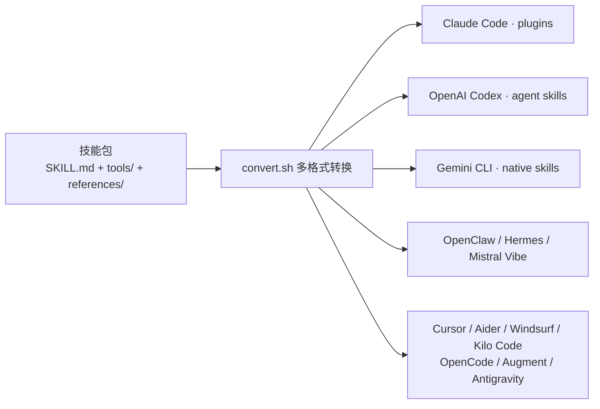

# Claude Code Skills & Plugins：AI 编程智能体技能库完全指南

AI 编程工具缺的往往不是知识，而是可重复的工作流。通用模型知道概念，但不太清楚怎么把概念落成一套能跑、可维护的具体做法。alirezarezvani/claude-skills 做的是把领域专家的决策流程写进文件，让 AI 加载后照着执行，而不是靠训练数据里的模糊记忆临场发挥。

截至 2026-08-06，这个仓库收录了 362 个技能、102 个 Agent、7 个 Persona、116 个命令，覆盖 18 个领域，能通过一份 `convert.sh` 分发到 13 个编码工具。真正值得看的地方不是数量，而是三件事：技能包怎么组织、Skills/Agents/Personas 怎么分层、以及一套无框架的编排协议怎么把跨领域的活串起来。

---

## 系统地图

一个技能包由三部分组成：`SKILL.md` 定义工作流和决策框架，`tools/` 放纯标准库的 Python 脚本，`references/` 放模板和检查清单。仓库里这类技能包有 362 个。



下面这张表把 18 个领域和技能数对应起来，方便你判断哪些领域值得先看。

| 领域 | 技能数 | 覆盖方向 |
|------|--------|---------|
| Engineering — Core | 52 | 架构、前后端、全栈、QA、DevOps、SecOps、Playwright Pro |
| Engineering — POWERFUL | 84 | Agent 设计、RAG 架构、数据库设计、CI/CD、安全审计、MCP 构建 |
| Product | 17 | 产品经理、UX 研究、落地页、SaaS 脚手架 |
| Marketing | 48 | 内容、SEO + AEO、CRO、增长、销售（8 个分组） |
| Productivity | 11 | capture、email、reflect、weekly-review、deep-work、meetings |
| Marketing（顶层 landing） | 1 | 单文件 HTML 落地页生成 |
| Research（学术） | 9 | litreview、grants、patent、deep-research 等 |
| Research Operations | 5 | 临床研究、研发财务、市场研究、产品研究 |
| Project Management | 9 | 高级 PM、scrum master、Jira、Confluence |
| Regulatory & QM | 19 | ISO、FDA、GDPR、SOC 2、CAPA |
| Compliance OS | 9 | 合规操作系统：控制项、证据、审计就绪 |
| C-Level Advisory | 68 | 完整 C-suite 顾问 + founder-mode 代理 |
| Business & Growth | 5 | 客户成功、销售工程、收入运营 |
| Business Operations | 7 | 流程映射、供应商管理、采购优化 |
| Commercial | 8 | 定价策略、联合合作、RFP 应答 |
| Finance | 4 | 财务分析、SaaS 指标、投资顾问 |
| Loop Library | 1 | 有边界 AI-agent 循环的发现与设计 |
| Markdown → HTML | 5 | markdown 转交互式 HTML 工具链 |

---

## Skills、Agents、Personas：三层分工

仓库把智能增强明确分成三层，职责不同，别混着用。

| 维度 | Skills | Agents | Personas |
|------|--------|--------|----------|
| 解决什么 | 怎么执行任务 | 该执行什么任务 | 谁在思考 |
| 范围 | 单领域 | 单领域 | 跨领域 |
| 语气 | 中性 | 专业严肃 | 个性化驱动 |
| 示例指令 | "Follow these steps for SEO" | "Run a security audit" | "Think like a startup CTO" |

**Skills** 管"怎么做"。加载 `/seo-auditor` 后，AI 按文件里写好的流程跑检查，而不是随口说一句"优化一下 SEO"。它的价值是把一次性的提示词变成可重复执行的检查清单。

**Agents** 在 Skills 之上加了"该做什么"的判断。`/security-agent` 不等人命令，会自己扫描项目里值得审计的地方，再按需拉起对应技能。

**Personas** 改的是思考框架，不绑定具体任务。给 AI 设定 `"Think like a startup CTO"` 后，它在讨论技术选型时会自动带上成本、团队能力、迁移风险的权衡。仓库预置了 Startup CTO、Growth Marketer、Solo Founder 三个 Persona，用法是复制到 `~/.claude/agents/` 或通过 `convert.sh` 转换。

三层配合使用，而不是只挑一层。仓库为怎么组合它们单独写了编排协议（见下文任务流）。

---

## 核心机制：技能包怎么组织

一个技能包的结构是固定的，`SKILL.md` 是核心，它定义了 AI 在该领域如何提问、执行和验证。

```text
<skill-name>/
├── SKILL.md           # 技能核心定义：流程、决策框架、验证标准
├── README.md          # 人类可读的使用说明
├── CLAUDE.md          # AI 智能体的配置与指令
├── tools/             # 可选：Python 工具脚本
├── references/        # 可选：模板、检查清单
└── package.json       # 技能元数据
```

一份合格的 `SKILL.md` 通常包含：目标声明、前置条件、执行流程、决策框架、验证标准。执行流程里每一步都写明输入、输出和检查点，AI 照着走完就能确认任务质量。

**tools/ 是自动化能力的承重墙**。仓库里 644 个 Python 脚本全部只用标准库，零第三方依赖，这是刻意为之的约束：脚本在任何 Python 环境都能直接跑，不会因为 pip 安装失败而中断一条技能链。每个脚本只做一件事，靠管道组合出复杂功能。外部命令（如 `curl`、`jq`、`git`）在脚本内部有 fallback 或明确的依赖声明。

**references/ 是支撑材料**。741 份模板、检查清单和领域知识文件，让技能在具体场景里有可以套用的底稿。

整套结构解答了一个问题：为什么技能比零散提示词可靠。因为工作流被写进了文件，AI 每一步的输入输出都是预先定义的，交接给下一个技能时不需要重新猜测上下文。

---

## 多格式转换与安装

一份技能库要真正散开，关键是格式转换。`scripts/convert.sh` 负责把技能转成目标工具的原生格式，`scripts/install.sh` 负责装进项目。

```bash
# 转换所有技能到所有工具（约 15 秒）
./scripts/convert.sh --tool all

# 安装到当前项目（带确认）
./scripts/install.sh --tool cursor --target /path/to/project

# 跳过确认直接装
./scripts/install.sh --tool aider --target . --force

# 验证安装
find .cursor/rules -name "*.mdc" | wc -l
```

各工具的安装入口如下。

**Claude Code（推荐，走插件市场）**：

```bash
/plugin marketplace add alirezarezvani/claude-skills

# 按领域分组安装
/plugin install engineering-skills@claude-code-skills          # 24 个核心工程
/plugin install engineering-advanced-skills@claude-code-skills  # 25 个 POWERFUL 级
/plugin install product-skills@claude-code-skills               # 12 个产品
/plugin install marketing-skills@claude-code-skills             # 43 个营销
/plugin install ra-qm-skills@claude-code-skills                 # 12 个监管/质量
/plugin install pm-skills@claude-code-skills                    # 6 个项目管理
/plugin install c-level-skills@claude-code-skills               # 28 个 C-level 顾问
/plugin install business-growth-skills@claude-code-skills       # 4 个商业增长
/plugin install finance-skills@claude-code-skills               # 2 个金融

# 或安装单个技能
/plugin install skill-security-auditor@claude-code-skills
/plugin install playwright-pro@claude-code-skills
/plugin install self-improving-agent@claude-code-skills
```

**Gemini CLI**：

```bash
git clone https://github.com/alirezarezvani/claude-skills.git
cd claude-skills
./scripts/gemini-install.sh
# 在 Gemini CLI 中激活
> activate_skill(name="senior-architect")
```

**OpenAI Codex**：

```bash
npx agent-skills-cli add alirezarezvani/claude-skills --agent codex
# 或：git clone 后运行 ./scripts/codex-install.sh
```

**OpenClaw**：

```bash
bash <(curl -s https://raw.githubusercontent.com/alirezarezvani/claude-skills/main/scripts/openclaw-install.sh)
```

**手动安装**：克隆仓库后，把任意技能目录复制到 `~/.claude/skills/`（Claude Code）或 `~/.codex/skills/`（Codex）。

工具与格式的对应关系：Claude Code 用 plugins，Codex 用 agent skills，Gemini CLI 用 native skills，Hermes 和 Mistral Vibe 走一次本地同步脚本（`sync-hermes-skills.py` / `vibe-install.sh`），其余 Cursor、Aider、Windsurf、Kilo Code、OpenCode、Augment、Antigravity 都通过 `convert.sh` 转换后安装。

---

## 任务流：一次跨领域交付怎么串起来

仓库用一套轻量编排协议（Orchestration）把 Persona、技能和 Agent 组合起来处理跨领域任务，不依赖任何框架。它定义了四种模式：

| 模式 | 做法 | 适用 |
|------|------|------|
| Solo Sprint | 跨项目阶段切换 Persona | 个人项目、MVP |
| Domain Deep-Dive | 一个 Persona + 多个堆叠技能 | 架构评审、合规审计 |
| Multi-Agent Handoff | 多个 Persona 互相审阅产出 | 高利害决策、上线前检查 |
| Skill Chain | 纯技能串行，不需要 Persona | 内容流水线、重复检查清单 |

README 用一个 6 周的产品发布示例把机制串起来：

```
第 1-2 周：startup-cto + aws-solution-architect + senior-frontend → 开发
第 3-4 周：growth-marketer + launch-strategy + copywriting + seo-audit → 准备
第 5-6 周：solo-founder + email-sequence + analytics-tracking → 上线并迭代
```

每一阶段切换 Persona 等于换了思考框架，叠加对应的技能完成具体动作。交接点靠"下一个角色读得到上一个角色的上下文"来保证，不需要额外搭调度系统。Skill Chain 模式还把这种串行复用到了内容生产这类不涉及角色判断的重复流程上。

---

## 数据解读：这套数字说明什么

先说明这些数字在测什么：它们是仓库的自报口径（README 徽章 + 技能总览表），度量的是"技能的静态规模"，不是"技能的运行效果"。基于这个前提，能读出三点：

1. **363 左右的总量里有明显的金字塔结构**。C-Level Advisory（68）和 Engineering（Core 52 + POWERFUL 84）占了近一半。这说明仓库的定位偏向"决策辅助 + 工程落地"，而不是纯代码生成。
2. **18 个领域是对"AI 编程工具"的泛化**。Marketing、Product、Compliance、Commercial 这些和写代码关系不大的领域也在，意味着它把"编码智能体"做成了"通用工作代理"。
3. **不能推出**"技能越多越好用"。362 个技能全部加载会给上下文带来巨大负担，反而拖低输出质量。数量是规模信号，不是质量信号。

GitHub 侧的事实（API，2026-08-06 验证）：Stars 23,495、Forks 3,247、主语言 Python、MIT 许可证、默认分支 main、创建于 2025-10-19、最近推送 2026-07-17。项目通过 SkillCheck 验证（getskillcheck.com）。

---

## 从哪里开始引入

技能不是装得越多越好。按这个顺序会稳一些：

**第一步：工程核心**。日常开发最常见的需求都在这里——架构、前后端、测试、CI/CD。这是最稳的起点，也是收益最快的一批。

**第二步：按你的角色扩展**。日常带 UI 测试就加 Playwright Pro；想让 AI 在多次对话里逐步改进输出，加 Self-Improving Agent；要写文档转 HTML，用 Markdown → HTML 那组。

**第三步：跨领域技能**。Product 和 Marketing 适合需要 AI 参与产品讨论或内容生产的团队。C-Level 顾问在技术方案评审、架构决策场景里有实际价值，但不必日常加载。

**谁可以等一等**：如果团队刚接触 AI 编程工具，或者日常任务以简单 CRUD 为主，先装 Engineering Core 就够。POWERFUL 级技能和 Agent 模板的收益，要在你已经习惯按技能驱动 AI 工作之后才体现出来。

**什么时候不必用**：如果你的工具本身不支持插件市场，也不想维护一套转换出来的规则文件，那直接看两眼 README 挑几个手动复制技能目录就够了，不需要引入整套分发流程。

---

## 结语

claude-skills 的价值不在 362 这个数字，而在它把"提示词"从每次手写变成了可复用、可编排、可跨工具分发的文件。SKILL.md + 纯标准库 tools 的结构保证了技能在任何 Python 环境能跑起来，convert.sh 让一份技能库能散到 13 个工具，Orchestration 又给了它跨领域组合的方式。真要评估它，先看你的工作流否需要"跨工具分发 + 跨领域编排"，需要就用，不需要就挑几个技能手动复制。

**开源协议与社区**：MIT 许可证，可自由使用和修改。官方仓库：[alirezarezvani/claude-skills](https://github.com/alirezarezvani/claude-skills)。