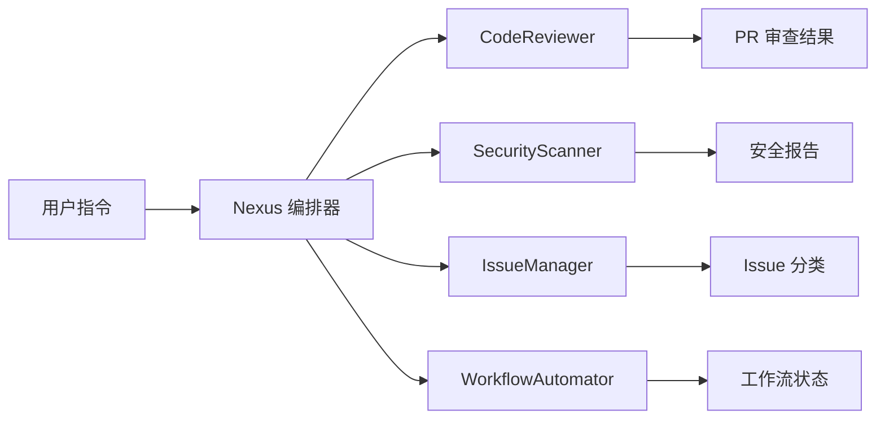
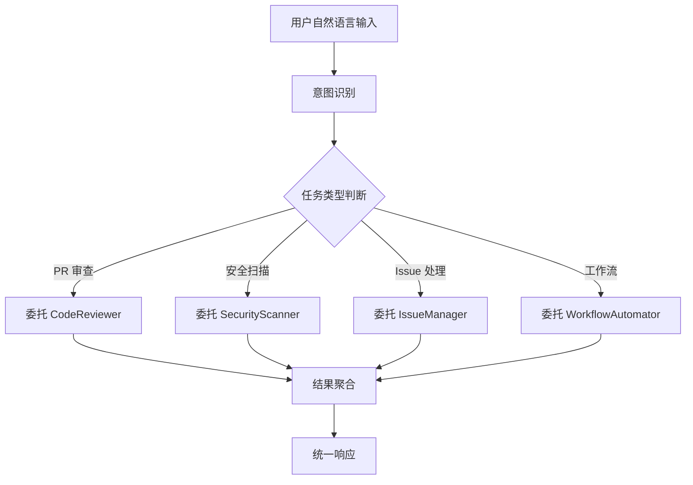

# GitNexus 智能 GitHub 管理 Agent：从入门到精通

> **目标读者**：DevOps 工程师、GitHub 管理员、CI/CD 开发者、AI 编程爱好者
> **前置知识**：了解 GitHub 基础操作、有 Node.js 开发经验
> **预计学习时间**：1-2 小时（入门），3-4 小时（精通）

---

## 🎯 学习目标

完成本文档后，你将掌握：

- ✅ 理解 GitNexus 的核心定位与多 Agent 架构
- ✅ 掌握五种专业 Agent 的职责分工
- ✅ 配置 GitHub App 集成
- ✅ 使用 Claude Code 自然语言管理 GitHub
- ✅ 自动化 PR 代码审查
- ✅ 配置安全扫描规则
- ✅ 智能 Issue 分类与路由
- ✅ 自动化工作流配置
- ✅ 开发自定义 Agent 扩展

---

## 一、项目概述与背景

### 1.1 什么是 GitNexus？

GitNexus（[abhigyanpatwari/GitNexus](https://github.com/abhigyanpatwari/GitNexus)）是**智能 GitHub 管理 Agent**，基于 Claude Code 和多 Agent 框架，自主处理代码仓库分析、Issue 解决、PR 审查、安全审计和工作流自动化。

**核心定位**：让 GitHub 管理从手动操作升级为 AI 驱动的自动化协作。



### 1.2 项目数据

| 指标 | 数值 |
|------|------|
| GitHub Stars | **1.8k** |
| GitHub Forks | **206** |
| 最新版本 | **v1.3.2** (Mar 29, 2026) |
| 许可证 | Apache-2.0 |
| 语言 | JavaScript 100% |

### 1.3 解决的问题

| 痛点 | 传统方案 | GitNexus |
|------|-----------|----------|
| **多账号管理** | 频繁切换账号 | 统一入口，多账号聚合 |
| **Issue 处理** | 手动分类分配 | AI 自动分类 + 路由 |
| **PR 审查** | 人工 Review 耗时 | 自动化规则 + AI 建议 |
| **安全审计** | 定期扫描滞后 | 实时漏洞检测 |
| **工作流维护** | 手动配置 CI/CD | 智能工作流自动化 |

---

## 二、多 Agent 架构详解

### 2.1 Agent 系统概览

GitNexus 采用**五 Agent 协作系统**：

| Agent | 名称 | 职责 |
|-------|------|------|
| **Nexus** | 编排器 | 协调所有 Agent，管理上下文，委托任务 |
| **CodeReviewer** | 代码审查员 | 分析 PR，建议改进 |
| **SecurityScanner** | 安全扫描器 | 漏洞检测 |
| **IssueManager** | Issue 管理器 | Issue 分类和路由 |
| **WorkflowAutomator** | 工作流自动化 | CI/CD 流水线管理 |

### 2.2 Nexus 编排器详解

Nexus 是整个系统的核心，负责：



### 2.3 Agent 间通信

Agent 之间通过共享上下文进行通信：

```javascript
// Agent 上下文共享示例
const sharedContext = {
  repository: "owner/repo",
  currentTask: "pr_review",
  previousResults: {
    CodeReviewer: { issues: 3, suggestions: 12 },
    SecurityScanner: { vulnerabilities: 1, severity: "medium" }
  },
  pendingTasks: ["workflow_optimization"]
};
```

---

## 三、GitHub 集成架构

### 3.1 支持的 GitHub 类型

| 类型 | 支持 | 说明 |
|------|------|------|
| **GitHub.com** | ✅ 完全支持 | 公共和私有仓库 |
| **GitHub Enterprise Server** | ✅ 完全支持 | 本地部署版本 |
| **GitHub Enterprise Cloud** | ✅ 完全支持 | 混合云版本 |

### 3.2 GitHub App 集成

GitNexus 使用 **OAuth 2.0** 的 GitHub App 进行认证：

```mermaid
graph sequence
    A["用户"] --> B["GitNexus"]
    B --> C["GitHub App"]
    C --> D["授权确认"]
    D --> E["访问令牌"]
    E --> B
    B --> F["API 操作"]
    F --> G["仓库/Issue/PR"]
```

### 3.3 权限配置

| 权限 | 级别 | 用途 |
|------|------|------|
| **Repository** | read/write | 仓库读写操作 |
| **Issues** | read/write | Issue 管理 |
| **Pull requests** | read/write | PR 审查 |
| **Contents** | read/write | 文件操作 |
| **Actions** | read/write | CI/CD 管理 |
| **Security events** | read | 安全审计 |

---

## 四、快速开始

### 4.1 安装 GitNexus

```bash
# NPM 全局安装
npm install -g gitnexus

# 或克隆源码
git clone https://github.com/abhigyanpatwari/GitNexus.git
cd GitNexus
npm install
npm start
```

### 4.2 配置 GitHub App

1. 创建 GitHub App：
   - 访问 https://github.com/settings/apps/new
   - 设置 Webhook URL（可选）
   - 配置权限（见上表）

2. 获取配置信息：
   ```bash
   # 获取 App ID
   export GITHUB_APP_ID=123456
   
   # 生成并下载私钥
   # 私钥文件保存为 private-key.pem
   
   # 设置 Webhook Secret
   export GITHUB_WEBHOOK_SECRET=your_webhook_secret
   ```

3. 初始化配置：
   ```bash
   gitnexus init --app-id $GITHUB_APP_ID \
                 --private-key ./private-key.pem \
                 --repo "owner/name"
   ```

### 4.3 连接 Claude Code

```bash
# 验证 Claude Code 集成
gitnexus verify-claude

# 配置 Claude Code 路径
gitnexus config set claude.path "/usr/local/bin/claude"
```

---

## 五、核心功能详解

### 5.1 PR 自动化审查

CodeReviewer Agent 自动分析 PR 变更：

```javascript
// PR 审查配置
const reviewConfig = {
  rules: {
    // 代码风格检查
    style: {
      indent: "spaces",
      indentSize: 2,
      maxLineLength: 120
    },
    // 安全检查
    security: {
      detectSecrets: true,
      checkDependencies: true,
      requireTests: true
    },
    // 质量检查
    quality: {
      maxComplexity: 10,
      requireDocumentation: true,
      disallowDeadCode: true
    }
  },
  // 审查级别
  severity: {
    blocking: ["security", "secrets"],
    warning: ["style", "quality"],
    info: ["documentation"]
  }
};

// 执行审查
const result = await gitnexus.reviewPR({
  owner: "owner",
  repo: "repo",
  prNumber: 123,
  config: reviewConfig
});
```

### 5.2 安全扫描

SecurityScanner Agent 检测漏洞：

| 扫描类型 | 检测内容 |
|----------|----------|
| **密钥检测** | API Key、Token、私钥泄露 |
| **依赖漏洞** | package.json 中的已知 CVE |
| **代码漏洞** | SQL 注入、XSS、CSRF |
| **配置问题** | .gitignore 遗漏、权限过大 |

```javascript
// 安全扫描示例
const scanResult = await gitnexus.scan({
  target: "owner/repo",
  scanType: ["secrets", "dependencies", "code"],
  severityThreshold: "medium"
});

console.log(`发现 ${scanResult.vulnerabilities.length} 个漏洞`);
```

### 5.3 Issue 智能管理

IssueManager Agent 自动分类 Issue：

| 分类 | 路由目标 |
|------|----------|
| **bug** | 指定 assignee |
| **enhancement** | 规划里程碑 |
| **question** | 自动回复模板 |
| **security** | 安全团队通知 |
| **documentation** | 文档仓库 |

```javascript
// Issue 自动分类配置
const issueConfig = {
  autoClassify: {
    enabled: true,
    keywords: {
      bug: ["crash", "error", "failed", "broken"],
      enhancement: ["feature", "improve", "optimize"],
      security: ["vulnerability", "exploit", "cve"],
      question: ["how", "what", "why", "?"]
    },
    routing: {
      bug: { team: "engineering", label: "priority:high" },
      security: { team: "security", notify: true }
    }
  }
};
```

### 5.4 工作流自动化

WorkflowAutomator Agent 管理 CI/CD：

```yaml
# .github/workflows/gitnexus-automation.yml
name: GitNexus Automation

on:
  issue_comment:
    types: [created]
  pull_request:
    types: [opened, synchronize]

jobs:
  nexus-review:
    runs-on: ubuntu-latest
    steps:
      - uses: actions/checkout@v4
      
      - name: Run GitNexus Review
        uses: abhigyanpatwari/gitnexus-action@v1.3
        with:
          command: review
          target: ${{ github.event.pull_request.number }}
```

---

## 六、架构设计详解

### 6.1 系统架构

```
┌─────────────────────────────────────────────────────────┐
│                   GitNexus 系统架构                        │
├─────────────────────────────────────────────────────────┤
│                                                        │
│  ┌──────────────────────────────────────────────────┐  │
│  │               Electron 桌面应用                   │  │
│  │  ┌─────────────┐  ┌─────────────┐              │  │
│  │  │   React UI  │  │ Claude Code │              │  │
│  │  │   前端界面   │  │   自然语言   │              │  │
│  │  └─────────────┘  └─────────────┘              │  │
│  └──────────────────────────────────────────────────┘  │
│                          │                              │
│  ┌──────────────────────────────────────────────────┐  │
│  │              Node.js/Express 后端                  │  │
│  │  ┌─────────────────────────────────────────┐    │  │
│  │  │              Nexus Orchestrator           │    │  │
│  │  │  ┌─────┐ ┌─────┐ ┌─────┐ ┌─────┐    │    │  │
│  │  │  │Code │ │Sec  │ │Issue│ │Work │    │    │  │
│  │  │  │Rev- │ │Scan-│ │Man- │ │flow │    │    │  │
│  │  │  │iewer│ │ner │ │ager │ │Auto-│    │    │  │
│  │  │  └─────┘ └─────┘ └─────┘ │mator│    │    │  │
│  │  └─────────────────────────────┘    │    │  │
│  └─────────────────────────────────────────┘    │  │
│                          │                              │
│  ┌──────────────────────────────────────────────────┐  │
│  │              SQLite 本地数据库                    │  │
│  │  • 仓库配置   • Agent 状态   • 扫描结果          │  │
│  └──────────────────────────────────────────────────┘  │
│                          │                              │
│  ┌──────────────────────────────────────────────────┐  │
│  │              GitHub API / GitHub Enterprise        │  │
│  └──────────────────────────────────────────────────┘  │
└─────────────────────────────────────────────────────────┘
```

### 6.2 技术栈

| 层级 | 技术 | 说明 |
|------|------|------|
| **桌面应用** | Electron | 跨平台桌面框架 |
| **前端** | React | UI 组件库 |
| **后端** | Node.js/Express | 服务器运行时 |
| **数据库** | SQLite | 本地持久化 |
| **AI 集成** | Claude Code CLI | 自然语言接口 |
| **GitHub API** | REST/GraphQL | GitHub 交互 |

### 6.3 数据流

```mermaid
sequence
    User->>Nexus: 自然语言指令
    Nexus->>ContextBuilder: 构建上下文
    ContextBuilder->>AgentHub: 分发任务
    AgentHub->>CodeReviewer: PR 审查任务
    AgentHub->>SecurityScanner: 安全扫描任务
    CodeReviewer-->>AgentHub: 审查结果
    SecurityScanner-->>AgentHub: 扫描报告
    AgentHub-->>Nexus: 结果聚合
    Nexus-->>User: 统一响应
    Nexus->>GitHubAPI: 更新状态
    Nexus->>SQLite: 保存记录
```

---

## 七、部署与配置

### 7.1 开发环境部署

```bash
# 克隆仓库
git clone https://github.com/abhigyanpatwari/GitNexus.git
cd GitNexus

# 安装依赖
npm install

# 复制配置模板
cp config/config.example.json config/config.json

# 编辑配置
vim config/config.json

# 启动开发服务器
npm run dev
```

### 7.2 生产环境部署

```bash
# 构建应用
npm run build

# 使用 PM2 启动
pm2 start npm --name "gitnexus" -- start

# 配置 Nginx 反向代理
# /etc/nginx/sites-available/gitnexus
server {
    listen 443 ssl;
    server_name gitnexus.example.com;
    
    location / {
        proxy_pass http://localhost:3000;
        proxy_http_version 1.1;
        proxy_set_header Upgrade $http_upgrade;
        proxy_set_header Connection 'upgrade';
    }
}
```

### 7.3 配置选项

```json
{
  "server": {
    "port": 3000,
    "host": "0.0.0.0"
  },
  "github": {
    "appId": "${GITHUB_APP_ID}",
    "privateKey": "${GITHUB_PRIVATE_KEY_PATH}",
    "enterpriseUrl": "https://github.mycompany.com"
  },
  "claude": {
    "path": "/usr/local/bin/claude",
    "model": "claude-opus-4-5",
    "maxTokens": 4096
  },
  "agents": {
    "nexus": {
      "maxConcurrent": 5,
      "timeout": 300000
    }
  },
  "database": {
    "path": "./data/gitnexus.db"
  }
}
```

---

## 八、开发扩展指南

### 8.1 创建自定义 Agent

```javascript
// agents/CustomAgent.js
const BaseAgent = require('./BaseAgent');

class CustomAgent extends BaseAgent {
  constructor(config) {
    super('CustomAgent', config);
    this.capabilities = ['custom_task_1', 'custom_task_2'];
  }

  async process(task) {
    // 1. 准备上下文
    const context = await this.prepareContext(task);
    
    // 2. 执行自定义逻辑
    const result = await this.executeCustomLogic(context);
    
    // 3. 生成响应
    return this.formatResponse(result);
  }

  async prepareContext(task) {
    return {
      repository: task.repository,
      user: task.user,
      customData: task.customData
    };
  }

  async executeCustomLogic(context) {
    // 实现你的自定义逻辑
    return { success: true, data: context };
  }
}

module.exports = CustomAgent;
```

### 8.2 注册自定义 Agent

```javascript
// agent-registry.js
const CustomAgent = require('./agents/CustomAgent');

NexusOrchestrator.registerAgent({
  name: 'CustomAgent',
  instance: new CustomAgent({
    enabled: true,
    priority: 5
  }),
  capabilities: ['custom_task_1', 'custom_task_2'],
  triggerKeywords: ['custom', 'special']
});
```

### 8.3 编写 Agent 规则

在 `rules/` 目录添加规则文件：

```yaml
# rules/custom-agent-rules.yaml
name: Custom Task Rules
agent: CustomAgent

rules:
  - id: custom_rule_1
    description: 处理自定义任务类型
    condition: task.type === 'custom_task_1'
    action:
      type: transform
      transform: normalizeCustomData
    output:
      format: json
      schema: custom_schema.json

  - id: custom_rule_2
    description: 验证自定义数据
    condition: task.type === 'custom_task_2'
    action:
      type: validate
      rules:
        - required: ['field1', 'field2']
        - types:
            field1: string
            field2: number
```

---

## 九、应用场景

### 9.1 企业代码管理

```
场景：大型企业多团队 GitHub 管理
方案：GitNexus 统一管理所有团队的仓库
效果：
  ✅ 自动化 PR 审查减轻人工负担
  ✅ 安全扫描实时发现漏洞
  ✅ Issue 自动分类提高响应速度
  ✅ 工作流自动化提升协作效率
```

### 9.2 开源项目维护

```
场景：开源项目维护者管理多个仓库
方案：GitNexus 处理日常 Issue 和 PR
效果：
  ✅ 自动识别 bug 和功能请求
  ✅ PR 审查建议标准化
  ✅ 安全问题自动告警
  ✅ 社区贡献者快速反馈
```

### 9.3 DevOps 自动化

```
场景：CI/CD 流水线优化
方案：WorkflowAutomator Agent 智能管理
效果：
  ✅ 自动检测失败原因
  ✅ 智能重试策略
  ✅ 性能监控告警
  ✅ 部署回滚自动化
```

---

## 十、最佳实践

### 10.1 安全配置

```bash
# 使用环境变量存储敏感信息
export GITHUB_APP_ID=123456
export GITHUB_PRIVATE_KEY_PATH=/secure/path/to/private-key.pem

# 限制 GitHub App 权限
# 仅授予所需的最小权限
```

### 10.2 性能优化

```javascript
// 缓存 GitHub API 响应
const cacheConfig = {
  ttl: 300,  // 5 分钟缓存
  maxSize: 1000,
  strategies: {
    repository: "LRU",
    issues: "TTL",
    prs: "TIME_BASED"
  }
};
```

### 10.3 故障排查

| 问题 | 解决方案 |
|------|----------|
| Claude Code 连接失败 | 检查路径配置 `gitnexus verify-claude` |
| GitHub API 限流 | 减少并发请求，使用缓存 |
| Agent 无响应 | 检查日志 `npm run logs` |
| 数据库锁定 | 重启服务 `pm2 restart gitnexus` |

---

## 十一、常见问题

### Q1: 如何添加新的 GitHub 仓库？

```bash
gitnexus repo add owner/repo
```

### Q2: 支持 GitHub Enterprise 吗？

✅ 是的，配置 `enterpriseUrl` 即可：

```bash
gitnexus config set github.enterpriseUrl "https://github.mycompany.com"
```

### Q3: Agent 可以并行工作吗？

✅ 是的，Nexus 支持最多 5 个 Agent 并行处理：

```javascript
const config = {
  agents: {
    nexus: {
      maxConcurrent: 5
    }
  }
};
```

### Q4: 如何查看 Agent 执行日志？

```bash
# 实时日志
gitnexus logs --follow

# 查看特定 Agent 日志
gitnexus logs --agent CodeReviewer

# 导出日志
gitnexus logs --export ./logs
```

---

## 十二、总结

GitNexus 是 GitHub 管理领域的创新解决方案：

| 优势 | 说明 |
|------|------|
| 🤖 **多 Agent 协作** | 专业 Agent 分工，智能协调 |
| 🔒 **安全优先** | 实时漏洞检测，密钥保护 |
| ⚡ **高效自动化** | PR 审查、Issue 分类、工作流自动化 |
| 🔧 **可扩展** | 自定义 Agent 和规则 |
| 🌐 **Universal** | 支持 GitHub.com 和 Enterprise |
| 💬 **自然语言** | Claude Code 驱动的交互 |

**下一步推荐**：

1. [快速开始](#四快速开始)：安装并配置第一个 GitNexus 实例
2. [PR 审查](#51-pr-自动化审查)：配置代码审查规则
3. [安全扫描](#52-安全扫描)：启用实时安全监控
4. [自定义 Agent](#八开发扩展指南)：开发你自己的 Agent

---

**文档信息**

- 难度：⭐⭐（进阶）
- 类型：完整教程
- 更新日期：2026-03-31
- 预计学习时间：1-2 小时（入门），3-4 小时（精通）
- GitHub：https://github.com/abhigyanpatwari/GitNexus
- Stars：1.8k ⭐
- 最新版本：v1.3.2

🦞 由钳岳星君撰写 | 项目源码：https://github.com/abhigyanpatwari/GitNexus