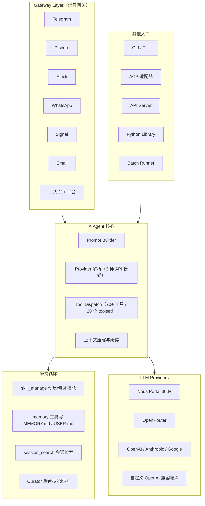

# Hermes Agent：自改进 AI Agent 框架

大多数 AI Agent 有一个共同的短板：每次会话都是全新的开始。Agent 学会了一个新技能，会话结束后就丢了；用户反复解释同一套偏好，Agent 每次都得从头来。Hermes Agent 把从经验中学习写进了架构，不是停留在口号层面。

它是 Nous Research 出品的自改进 AI Agent（self-improving AI agent）。官方对它的定位相当强硬：这是唯一一个自带学习循环的 Agent——从经验中创建技能、在使用中改进技能、主动提醒自己持久化知识、检索自己过去的对话，并在长期相处中逐步建立对用户的认知模型。

## 目录

1. [传统 Agent 的问题](#1-传统-agent-的问题)
2. [架构：学习循环 / Gateway / Memory / Skills](#2-架构学习循环--gateway--memory--skills)
3. [安装与配置](#3-安装与配置)
4. [日常使用](#4-日常使用)
5. [二次开发：Python 库与插件系统](#5-二次开发python-库与插件系统)
6. [与同类项目对比](#6-与同类项目对比)
7. [FAQ](#7-faq)

## 1. 传统 Agent 的问题

### 1.1 通用 Agent 的固有局限

当前主流的 AI Agent（Claude Code、ChatGPT 的 Agent 模式、各类 coding agent）能力很强，但都绕不开四个共性问题：

**知识无法积累**：每次会话都是全新的开始，Agent 无法记住之前学到的技能和经验。用户需要反复解释相同的偏好、规则和上下文。

**技能无法复用**：当 Agent 摸索出一条做某类任务的有效路径，这条路径只存在于当前会话的上下文里，下一次又要重新摸索。

**平台绑定**：大多数 Agent 只在单一入口运行——要么是终端工具，要么是某个聊天平台里的机器人。在 Telegram 上问一句，不能接着让它在你的电脑上干活。

**模型锁定**：Agent 与特定 LLM 提供商耦合，切换模型往往要改代码。

### 1.2 Hermes Agent 的回答

Hermes Agent 的核心主张：**Agent 应该像人一样，从经验中学习，并把学到的东西带到下一个会话**。对应四条设计原则：

1. **持久化知识**：学习成果写进磁盘，不随会话结束消失
2. **技能显式化**：从经验中生成的技能是独立的 SKILL.md 文档，可以被命名、检索、复用
3. **多平台统一**：一个 Gateway 进程接入 Telegram、Discord、Slack、WhatsApp、Signal、Email 等消息平台，背后是同一个 Agent
4. **模型无关**：Nous Portal、OpenRouter、OpenAI、Anthropic、Google 或任意 OpenAI 兼容端点，`hermes model` 一条命令切换，不改代码

### 1.3 学习循环的真实机制

"内置学习循环"不是一句宣传语，它由五个具体的子系统组成，每一个都能在文档和源码里找到对应实现：

**技能创建**：Agent 解决了一个非平凡问题后，系统提示会要求它用 `skill_manage` 工具把有效路径存成技能——一个放在 `~/.hermes/skills/` 下的 SKILL.md 文档。下一次遇到同类任务，按需加载即可。

**技能改进**：技能在使用过程中可以被 `skill_manage` 的 `patch` 动作修补，把新踩的坑、更好的参数写回去。文档对技能内容有一条明确标准："记录教训，而不是日志"（lessons, not logs）——一条坑要写成可泛化的规则加一句机制解释，而不是流水账。

**知识沉淀提醒**：小而重要的持久事实（用户偏好、环境信息）由 memory 系统管理。Agent 会在合适的时机"提醒自己"把值得记的东西写进记忆文件——这是官方描述里 "nudges itself to persist knowledge" 的含义。

**会话检索**：所有会话存储在 SQLite 数据库里，用 FTS5 全文索引，配 LLM 摘要。Agent 可以用 `session_search` 搜自己的过去对话，找到"上次是怎么解决的"。

**用户建模**：`USER.md` 文件保存用户的偏好、沟通风格、技术背景；可选接入 [Honcho](https://github.com/plastic-labs/honcho) 做更细粒度的用户认知建模。

这五件事合在一起，构成一个闭环：干完活 → 沉淀技能和记忆 → 下个会话开局加载 → 遇到新问题先查过去的会话 → 又产生新的经验。

---

## 2. 架构：学习循环 / Gateway / Memory / Skills

### 2.1 整体架构



几个要点：

- **入口层**：官方架构图上共六个入口——CLI（含 TUI 形态）、消息网关、ACP 适配器、API Server、Python 库和批量轨迹生成（Batch Runner），全部汇到同一个 `AIAgent` 核心。消息网关和 CLI 可以同时开着——你在终端里给它派活，同一个 Agent 在 Telegram 上应答。
- **AIAgent 核心**：负责组装系统提示、解析模型提供商、分发工具调用、压缩上下文。Provider 解析支持三种 API 协议（OpenAI chat completions、Codex responses、Anthropic Messages），所以任意提供商都能接。
- **学习循环**：不是独立的守护进程，而是 Agent 核心的一组能力（skill_manage、memory、session_search）加上两个后台角色——turn 结束后的自改进评审（background self-improvement review）和定期维护技能库的 Curator。
- **会话存储**：SQLite + FTS5，一个文件搞定，这也是它能跑在廉价 VPS 上的原因之一。

### 2.2 Memory：两个 Markdown 文件的容量哲学

Hermes 的持久记忆刻意做得很小：

| 文件 | 内容 | 上限 |
|------|------|------|
| `MEMORY.md` | Agent 的个人笔记：环境事实、项目约定、踩坑经验 | 2,200 字符（约 800 token） |
| `USER.md` | 用户画像：偏好、沟通风格、技术背景 | 1,375 字符（约 500 token） |

两个文件都存在 `~/.hermes/memories/`，会话开始时作为冻结快照注入系统提示。Agent 通过 `memory` 工具增删改条目（`add` / `replace` / `remove`），写入立即落盘，但要到下一个会话才进入系统提示——这是为了保住 LLM 的前缀缓存。

小容量是刻意设计：写满时 `memory` 工具直接报错而不是悄悄丢弃，逼 Agent 自己做取舍——合并旧条目、删掉不重要的，腾出空间再写。记忆的质量靠这种压力维持。

### 2.3 Skills：过程性记忆

技能系统遵循 agentskills.io 开放标准，用渐进式披露（progressive disclosure）控制 token 成本：平时只加载技能清单，用到某个技能才读全文。所有技能放在 `~/.hermes/skills/`，每个技能自动成为一个斜杠命令：

```bash
/gif-search funny cats          # 调用 gif-search 技能
/excalidraw                     # 只给技能名，Agent 会问你要画什么
/github-pr-workflow /test-driven-development fix issue #123   # 一条消息叠两个技能
```

`/learn` 是把经验变成技能的最短路径——指向本地代码、在线文档、刚刚走过的操作流程，甚至一整本 PDF，Agent 自己收集材料并按规范写成技能：

```bash
/learn the REST client in ~/projects/acme-sdk, focus on auth + pagination
/learn how I just deployed the staging server
```

### 2.4 Curator：技能库的园丁

自改进循环有个天然的副作用：技能会越攒越多，几十个高度相似的窄技能会把目录污染掉。Curator 是专门的后台维护进程，负责技能库的修剪：

- 跟踪每个技能的查看、使用、修补频次，让长期不用的技能沿 `active → stale → archived` 流转：14 天未用标记 stale，30 天未用移入 `~/.hermes/skills/.archive/`（可随时恢复）
- 默认每 7 天跑一次，且要求 Agent 空闲至少 2 小时——绝不打断正事
- 可选开启 LLM 整合（`curator.consolidate: true`）：让辅助模型通读技能库，合并重复技能、归纳出类级"伞技能"。这一步默认关闭，因为一次全面整合要消耗 50–100 次 API 调用
- 有几条铁律：置顶技能永不处理；从 Skills Hub（agentskills.io）安装的技能永不处理；任何情况下都不自动删除，最坏结果也只是归档

### 2.5 安全阀门

学习循环意味着 Agent 会自己改自己的"大脑"，Hermes 为此留了审批闸门。`memory.write_approval: true` 和 `skills.write_approval: true` 分别管住记忆写入和技能写入：后台评审产生的修改不再直接落盘，而是暂存待审，你在 CLI 或聊天平台里用 `/memory pending`、`/skills pending` 逐条批准或驳回。小模型容易"声称保存了但实际没调用工具"、隔离环境需要审计，这两个闸门就是为这些场景准备的。

---

## 3. 安装与配置

### 3.1 安装

Linux / macOS / WSL2 / Termux（Android）：

```bash
curl -fsSL https://hermes-agent.nousresearch.com/install.sh | bash
```

Windows 原生（PowerShell）：

```powershell
iex (irm https://hermes-agent.nousresearch.com/install.ps1)
```

安装脚本会装好全部依赖：uv、Python 3.11、Node.js、ripgrep、ffmpeg；Windows 下还会带一个独立的 MinGit，不碰系统里已有的 Git。装完重载 shell，敲 `hermes` 直接开聊。

两条注意事项：

- **Docker 部署不支持 `hermes update`**，升级靠换新镜像
- **PyPI / brew / AUR 安装方式官方明确列为 Unsupported**——网上教程里的 `pip install hermes-agent` 不受支持，出问题不会修，建议换回官方安装脚本

### 3.2 初始化

```bash
hermes              # 交互式 CLI，直接开聊
hermes model        # 选择模型提供商和模型
hermes tools        # 配置启用哪些工具
hermes setup        # 完整设置向导，一次配完所有项
hermes doctor       # 诊断环境问题
hermes update       # 更新到最新版
```

最省事的路径是 Nous Portal：`hermes setup --portal` 一条命令完成 OAuth 登录，一个订阅覆盖 300+ 模型和全套工具网关（Firecrawl 网页搜索、FAL 图像生成、OpenAI 语音合成、Browser Use 云浏览器），不用挨个收集五家服务商的 API key。想继续用自己的 key 也行——工具网关按后端逐个启用，不是一刀切。

### 3.3 模型切换

```bash
hermes model                          # 交互式选择器，CLI 和网关共用
hermes chat --provider openrouter     # 单次会话强制走 OpenRouter
hermes chat --model "anthropic/claude-sonnet-4.6"
```

提供商注册表内置 Nous Portal、OpenRouter、OpenAI、Anthropic、Google 等，也可以指向任意 OpenAI 兼容端点（比如本地 Ollama）。切换不改代码，会话中途用 `/model` 斜杠命令也能换。

### 3.4 从 OpenClaw 迁移

Hermes 支持从 OpenClaw 一键迁移——首次运行 `hermes setup` 时会自动检测 `~/.openclaw` 并询问是否导入；装完之后随时可以：

```bash
hermes claw migrate              # 交互式全量迁移
hermes claw migrate --dry-run    # 预览会迁移什么
```

导入范围包括 SOUL.md 人格文件、MEMORY.md / USER.md 记忆、用户自建技能、命令白名单、消息平台配置和常用 API key。从 OpenClaw 搬过来基本是无损的。

---

## 4. 日常使用

### 4.1 两个入口

Hermes 有两个日常入口：终端里敲 `hermes` 进交互式会话；或者跑 `hermes gateway setup` 配置消息平台、`hermes gateway start` 启动网关，然后在 Telegram、Discord、Slack、WhatsApp、Signal 或 Email 里和它聊。网关目前支持 21+ 消息平台（19 个原生适配器，IRC 和 Microsoft Teams 走插件）。

两边共享大部分斜杠命令：`/new` 开新会话、`/model` 换模型、`/compress` 压缩上下文、`/usage` 查用量、`/skills` 浏览技能、`/retry` 重试上一轮。CLI 里 `Ctrl+C` 或发新消息可打断当前工作，消息平台上对应 `/stop`。

```bash
hermes chat -q "总结这个仓库的 commit 历史"     # 单次查询，不进交互
hermes --continue                               # 续上最近一次 CLI 会话
hermes --resume latest --in ./dir               # 续指定目录的最近会话
```

### 4.2 记忆与会话边界

官方文档里有一条容易被忽视的实践建议：**主动制造会话边界**。在消息平台上，一个聊天默认是永续会话——重启机器都不断，几个月不重置的话它会越长越贵（反复压缩超长历史），而且"遗忘 → 查记忆 → 搜旧会话"的学习循环几乎没机会触发。自然的边界包括：一个任务做完、话题切换、新的一天开始，这时候发 `/new`。

### 4.3 定时任务与委托

**Cron 定时任务**：用自然语言或 cron 表达式安排周期任务（日报、夜间备份、每周审计），结果投递到任意平台，支持暂停、恢复、编辑。内部只有一个 `cronjob_manage` 工具，用 action 风格操作全部生命周期；网关进程每 60 秒 tick 一次执行到期任务，连续失败 3 次会发提醒。

**子 Agent 委托**：`delegate_task` 可以拉起隔离子 Agent 并行干活，适合几条互不依赖的工作流同时推进。

**代码执行**：`execute_code` 让 Agent 写 Python 脚本、通过 RPC 调用工具，把多步流水线折叠进零上下文开销的一轮。

---

## 5. 二次开发：Python 库与插件系统

### 5.1 作为 Python 库使用

Hermes 不只是一个 CLI。官方文档明确支持把 `AIAgent` 导进自己的 Python 程序——注意导入路径是 `run_agent`，而且官方只支持从 git 检出配合 `uv sync` 使用，不发 PyPI wheel：

```bash
git clone https://github.com/NousResearch/hermes-agent.git
cd hermes-agent
uv sync
uv run python your_app.py
```

```python
from run_agent import AIAgent

agent = AIAgent(
    model="anthropic/claude-sonnet-4.6",
    quiet_mode=True,   # 嵌入自己的程序时必设，否则 CLI 的转圈动画会污染你的输出
)
response = agent.chat("解释一下什么是异步编程")
print(response)
```

需要完整控制时用 `run_conversation()`，它返回完整的结果字典——最终回复、全部消息历史都在里面：

```python
result = agent.run_conversation(
    user_message="搜一下 Python 3.13 的新特性",
    task_id="my-task-1",
    system_message="你是一个简洁的技术助手。",   # 可选，覆盖本轮临时系统提示
)
print(result["final_response"])
history = result["messages"]          # 传回 conversation_history 即可多轮续聊
```

工具面可以用 `enabled_toolsets` / `disabled_toolsets` 收放，比如做一个只开 `web` 的研究机器人，或者禁掉 `terminal` 的共享环境 Agent。

### 5.2 插件系统

想给 Agent 加自定义工具，正确的扩展点是插件系统（不是手写适配器类）。一个 Python 插件在初始化时通过上下文对象注册能力：

```python
def register_tools(ctx):
    ctx.register_tool(
        name="deploy_status",
        toolset="company",
        schema={
            "type": "function",
            "function": {
                "name": "deploy_status",
                "description": "查询内部系统的部署状态",
                "parameters": {
                    "type": "object",
                    "properties": {
                        "env": {"type": "string", "description": "环境名：staging / prod"}
                    },
                    "required": ["env"],
                },
            },
        },
        handler=check_deploy_status,
    )
```

插件还能打包技能（`ctx.register_skill(name, path)`，以 `plugin:skill` 命名空间加载）、挂生命周期 hooks、接外部服务。插件可以发布成 pip 包独立分发（如 `hermes-plugin-calculator`），官方还有一键安装的插件目录（Plugin Catalog）。

### 5.3 让学习循环更保守

默认设置下 Agent 写技能相当自由。如果希望它学得慢一点、稳一点，config.yaml 里有现成的旋钮：

```yaml
# ~/.hermes/config.yaml
skills:
  write_approval: true        # 所有技能写入先暂存待审
memory:
  write_approval: true        # 记忆写入先暂存待审
curator:
  consolidate: false          # 保持默认：只修剪，不做 LLM 整合
```

再配合 `memory.nudge_interval` / `skills.creation_nudge_interval` 调低后台自改进评审的频率，学习循环就收窄成"只在人工批准时沉淀"的保守模式——适合生产环境或对小模型不放心的场景。

---

## 6. 与同类项目对比

| 维度 | Hermes Agent | Claude Code | 通用框架（LangChain 等） |
|------|-------------|-------------|------------------------|
| 定位 | 开箱即用的个人 Agent，自学习是卖点 | 终端编码 Agent | Agent 构建框架/编排库 |
| 持久学习 | 内置闭环：skill_manage + memory + Curator | CLAUDE.md 记忆文件，靠手维护 | 无内置，需自建 |
| 多平台消息 | 21+ 平台单一网关 | 无 | 需自行集成 |
| 模型 | 任意提供商，`hermes model` 切换 | 仅 Claude 系 | 模型无关，但要写代码 |
| 适合谁 | 想要一个"越用越懂你"的全能助理 | 专注写代码 | 想完全掌控架构的团队 |

这个表想说明的只有一件事：Hermes 的差异化不在单点能力，而在把"从经验中学习"做成了默认行为——别家要么没有，要么要你自己搭。

**适用**：

- 需要长期记忆和多平台接入的个人 AI 助理
- 希望重复性工作流被自动沉淀成技能的日常自动化
- 需要频繁切换模型、又不想绑定单一提供商的开发者
- 跑在廉价 VPS 或闲置服务器上的常驻 Agent

**不适用**：

- 需要毫秒级响应的实时系统——它是为对话节奏设计的
- 需要严格沙箱与审计合规的生产服务——虽有命令审批与容器隔离，但自学习循环本身需要人工监督

---

## 7. FAQ

**Q: Hermes Agent 的自改进和普通 LLM 的上下文学习有什么区别？**

上下文学习只活在当前会话，关掉就没。Hermes 的学习循环把经验写到磁盘上的具体位置——技能是 `~/.hermes/skills/` 下的 SKILL.md，事实是 `~/.hermes/memories/` 下的 MEMORY.md / USER.md，历史会话在 SQLite 里可全文检索。一个学会的"部署 staging 服务器"流程不会因为关掉终端就消失，下个会话按需加载。

**Q: 消息网关需要一直开着吗？**

需要。网关进程停下，Telegram 那边就没法收发消息。但 Agent 的状态（技能、记忆、会话）都在磁盘上，网关重启后一切恢复。如果只是自己用，不开网关、纯 CLI 也完全成立。

**Q: 和 LangChain、AutoGPT 这类框架有什么本质区别？**

LangChain 是构建框架，给你零件，自学习要自己造；AutoGPT 展示了自主 Agent 的可能性，但没有把经验沉淀做成产品级机制。Hermes 把学习循环做成了默认行为：技能创建、使用中修补、Curator 修剪、后台评审，每个环节都有对应工具和审批闸门。你要写代码才能在框架里复刻这套东西，而在 Hermes 里它是装完就有的。

**Q: $5/月 的 VPS 真的能跑？**

能，这是官方明说的部署目标。Agent 循环本身是一个 Python 进程，会话状态存 SQLite，资源占用很低；真正吃资源的是 LLM API 调用和工具执行，前者由提供商计费，后者发生在你给它配的终端后端里。更妙的是 Modal、Daytona 这类 serverless 后端支持环境休眠——空闲时几乎不花钱，来消息了自动唤醒。

**Q: 我怎么知道 Agent 有没有真的"记住"？**

最直接的办法：`cat ~/.hermes/memories/MEMORY.md`。官方 FAQ 里专门列了一条高频故障——模型说"我记住了"但实际没调用 memory 工具，尤其是 30B 以下的小模型。文件里没有就是没记住，让它显式调用工具重写一遍。这也是 `write_approval` 闸门存在的意义。

---

## 参考来源与口径说明

- 本文数据口径：**2026-09-22**，对照 GitHub 仓库 `NousResearch/hermes-agent`（main 分支）、官方 README 与 hermes-agent.nousresearch.com 文档站（llms.txt 全量文本）核实
- stars / forks：247,952 / 52,259（GitHub API，2026-09-22）。项目 2025-07-22 创建，增长极快，阅读时请以仓库实时数据为准
- 工具数（70+）、toolset 数（28）、终端后端数（7）、消息平台数（21+）、Curator 参数（14/30 天、7 天间隔、2 小时空闲）、MEMORY.md/USER.md 字符上限（2,200/1,375）均出自官方文档原文；Python 库用法出自官方 "Using Hermes as a Python Library" 指南；PyPI/brew/AUR 属 Unsupported 出自 Platform Support 页
- 本文早期版本引用的部分接口与配置示例（`from hermes import Hermes`、`hermes run`、`hermes pick` 等）在官方仓库与文档中均不存在，已在本次更新中替换为文档实证的真实接口；安装命令、CLI 用法、配置项一律以官方文档为准
