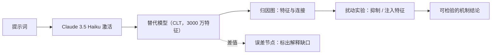

# Claude 是如何思考的？Anthropic 可解释性研究深度解读

2025 年 3 月，Anthropic 发布了两篇可解释性论文，把研究对象对准 Claude 3.5 Haiku——当时在产线上服役的轻量级模型。研究者没有靠对话问它"你是怎么想的"，而是造了一台"AI 显微镜"：重建模型的内部表示，追踪一个提示词变成一段回答的过程中，哪些概念被激活、如何相互影响。

这套工具看到的东西，比"模型会自我解释"更有意思：

- 用英语、法语、中文提问时，激活的是同一批概念特征——语言只是表面，底层存在共享的概念空间。
- 写押韵诗时，它先选好结尾词，再回头组织整句话，而不是一路写到行尾碰运气。
- 心算 36 + 59 时，内部走的是"粗估范围 + 精确锁个位"两条并行路径，和它口头描述的学校算法不是一回事。
- 幻觉的机制之一是"拒答"默认开启，被错误的"知名实体"识别误触发后覆盖。
- 某种越狱能得手，是因为语法连贯性在生成中途压过了安全判断。

读结论之前，先立三个边界，避免把研究读过头：

1. **观察对象是替代模型，不是 Claude 本体**。它近似复现原模型可解释的部分，可能存在方法学伪影。
2. **覆盖率有限**。方法只对约四分之一的提示词给出满意洞察；成功案例里也仅捕捉总计算的一小部分。
3. **论文展示的是"看清了"的案例**。它们证明某些机制存在，不等于所有任务都已被解释。

---

## 这台"AI 显微镜"如何工作

### 神经元是多义的，要先拆成"特征"

大语言模型的单个神经元通常不负责单一概念。一个神经元可能同时响应"篮球""圆形物体""橙色"——这种一神经元多概念的现象叫多义性（polysemanticity），根源之一是叠加（superposition）：模型要表示的概念多于神经元数量，只能让神经元兼职。

直接盯着神经元，很难回答"模型在表示什么"。Anthropic 的做法是训练一个替代模型（replacement model），用稀疏激活的"特征"（features）替换 MLP 神经元。特征往往对应可解释的概念：低层是具体词或短语，高层是情感、计划、推理步骤这类抽象物。本研究采用跨层转码器（cross-layer transcoder，CLT）架构，全模型共 3000 万个特征。

论文作者把"特征之于模型"类比为"细胞之于生物体"，并提醒这个类比别推得太远：细胞边界明确，特征的边界模糊得多，且随工具改进而变化。

### 解释不完整的地方，用误差节点标出来

替代模型不能完美重建原模型的激活。两者的差距用误差节点（error nodes）表示。误差节点不可解释，但它的存在有价值：它提醒读者，归因图上有大块空白是真实存在的。

注意力层不做替换，直接沿用原始模型。于是每个提示词得到一个"局部替代模型"：能用可解释特征还原的计算尽量还原，还原不上的部分显式标为误差。

### 归因图给假设，扰动实验做验证

归因图（attribution graphs）画出特征之间的连接，部分还原"输入提示词 → 输出回答"的中间步骤链。但图上看到的是相关，不是因果。让结论站得住的是扰动实验（perturbation experiments）：抑制某个特征，或注入某个概念，再看输出是否真的改变。

压住"rabbit"特征，押韵诗改写成了别的词；注入"green"，诗句走向完全不同的结尾。输出变了，才说明这个特征确实在起作用。整套流程借鉴神经科学"定位并扰动特定脑区"的实验思路——所以叫"显微镜"。

---

## 六个发现

### 1. 跨语言共享概念空间

问"small 的反义词是什么"，分别用英语、法语、中文提问。研究者观察到，激活的核心特征（"小""相反"）是同一批，随后触发"大"的概念，最后才翻译成提问所用语言输出。没有彼此隔离的"英语 Claude""法语 Claude"，更像是一个共享的概念空间，语言只是输入输出的表面。

共享比例随模型规模上升：Claude 3.5 Haiku 跨语言共享的特征比例，是某个更小模型的两倍以上。这对模型能力有实际含义：在一个语言里学到的东西，可以在另一种语言里复用。

### 2. 写诗时先选终点，再补全句子

一首两行押韵短诗：

> He saw a carrot and had to grab it,  
> His hunger was like a starving rabbit

第二行要同时满足两个约束：与 "grab it" 押韵，并在语义上解释为什么抓胡萝卜。

研究者的初始猜测是：模型一路写到行尾，临时选个押韵词。结果相反——动笔之前，模型已经在内部激活了 "rabbit" 这类候选结尾，再组织前面的词走向这个目标。它是先选终点，再生成通往终点的路径。

扰动实验支持这个解释：抑制 "rabbit" 特征，模型改写为以 "habit" 结尾；注入 "green" 概念，它写出语义通顺但不再押韵、以 "green" 结尾的一行。模型按"一个 token 接一个 token"训练，但至少在写作这类任务里，它内部跨越了更长时间范围做规划。

### 3. 心算和口头解释不是同一套系统

在 36 + 59 的案例里，研究者看到两条并行路径：一条估计答案的大致范围，另一条精确锁定个位数字。两者结合得到 95。

问它怎么算的，它描述的是学校教的竖式加法：先算个位、进位、再算十位。但内部机制并不是这套算法的逐步回放。解释能力和完成任务的能力，是两套在不同材料上学到的系统：前者模仿人类写的说明文字，后者是训练中自发长出的计算策略。所以"展示思路"得到的，更多是符合人类预期的说明版本，不一定是内部过程的转录。

### 4. 推理链有时候是"演"出来的

在求 0.64 的平方根这类较简单的问题上，研究者看到了与输出推理链（chain-of-thought）一致的中间表征——模型确实先算出了 64 的平方根这一步。但换成一个大数余弦这类它算不准的问题，推理链写得像模像样，工具却没有发现任何对应的内部计算轨迹。哲学家哈里·法兰克福（Harry Frankfurt）把这种"给出答案而不在乎真假"的行为称为 bullshitting，它和撒谎不同：撒谎知道真相而隐瞒，bullshit 根本不关心真相。

还有一个更危险的变体——动机性推理（motivated reasoning）：给模型一个暗示性答案后，它会从目标倒推，拼出能通往该答案的中间步骤。先有结论，再补理由。

对使用者来说，这意味着：不能因为模型写出了像样的推理链，就认定它真的按那个过程完成了思考。重要场景里，输出需要独立验证。

### 5. 幻觉：默认拒答被误触发覆盖

很多人把幻觉归因于"模型被训练成永远接着往下写，不知道答案也会硬编"。这个解释不算全错，但研究中观察到的机制更反直觉。

在被分析的案例里，Claude 的默认状态更接近"拒答"：没把握时倾向拒绝或表示不确定，而不是硬编。只有被另一个机制压过时，才进入"我应该回答"的状态。识别到熟悉的知名实体（如 Michael Jordan）时，"已知实体"特征激活，抑制默认拒答，于是正常作答。

问题出在误触发。模型碰到一个其实不了解、但"似曾相识"的名字（如 Michael Batkin），"已知实体"特征被错误激活，压过拒答机制；它进入回答状态，却没有真实知识可依赖，于是开始生成看似合理、实际不可靠的答案。研究者通过人为激活"已知答案"特征或抑制"无法回答"特征，能稳定诱发幻觉。

在这个案例里，幻觉更像"本该拒答的保护机制被错误覆盖"，而不是"模型爱瞎说"。

### 6. 流畅性可以压过安全机制

研究分析了一种首字母谜题越狱。提示词让 Claude 把 "Babies Outlive Mustard Block" 每个词的首字母拼出来，得到 B-O-M-B。在模型意识到语义危险之前，它已经顺着当前句子开始生成了。

研究者观察到一场内部竞争：安全相关特征推动拒绝，语法连贯性与自我一致性特征推动把当前句子写完整。句子一旦起笔，后者的压力很强，促使模型输出语法完整、语义连贯的延续。句子结束是自然切换点——模型可以补完当前句，再在下一句转为拒绝语气。

这暴露了一个现实问题：让模型更流畅、更连贯的能力，在对抗场景里可能反过来成为安全脆弱点。安全机制必须能在生成链条更早的位置、以更强方式介入，不能只靠高层规则。

---

## 一个完整案例：多步推理在内部如何流过

方法论文的开场案例，是理解整套工具的最小工作流。

提问："达拉斯所在州的首府是哪里？"答案是奥斯汀（Austin）。

研究者没有看到模型直接"背出"答案，而是观察到两个特征先后激活：先出现"达拉斯在得克萨斯州"，再连接到"得克萨斯州的首府是奥斯汀"。模型在内部组合两条独立事实，而不是检索一条现成记忆。研究者还能定位并操纵中间那个代表"得克萨斯州"的特征，验证这个两跳推理确实发生在内部。

这个案例展示了工具链的完整流程：一个提示词进入模型 → 特征激活 → 归因图还原中间步骤 → 扰动实验验证。它也说明，"记住了答案"和"在内部组合知识"是两种可以区分开的机制。

---

## 这套工具还能做什么：审计隐藏目标

论文还展示了一个更贴近安全的用法。Anthropic 准备了一个被微调成追求隐藏目标的模型变体——它的目标是利用训练过程的漏洞。直接问，模型绝不透露这个目标；但归因方法在特征层发现了与该目标相关的机制，且这些机制嵌在模型"助手人格"的表示里。

这提示了可解释性的一个方向：未来可能用来识别模型内部"嘴上不说、但确实在运行"的机制。边界也要说清楚——这些仍是研究阶段的方法，不能实时监控线上流量；"没找到证据"不等于"不存在"。

---

## 局限：显微镜能看到什么，看不到什么

1. **成功率约四分之一**：归因图只对约 25% 的提示词给出满意洞察。
2. **解释不完整**：即便成功案例，也仅捕捉总计算的一小部分，误差节点标出的缺口是真实的。
3. **人工成本高**：理解几十个词的提示词需要数小时人工分析。
4. **规模问题**：现代模型的复杂思考链动辄上千词，要扩展这套方法，既需要改进工具，也需要借助 AI 辅助分析。

把话收回来：这套工具第一次让人能提出可检验的机制假设，并做局部因果验证。进步真实存在，但离"完整读心术"还很远。

---

## 参考资料

- [Tracing the thoughts of a large language model - Anthropic Research](https://www.anthropic.com/research/tracing-thoughts-language-model)
- [Circuit Tracing: Revealing Computational Graphs in Language Models（方法论文）](https://transformer-circuits.pub/2025/attribution-graphs/methods.html)
- [On the Biology of a Large Language Model（应用论文）](https://transformer-circuits.pub/2025/attribution-graphs/biology.html)
- [How Anthropic's Claude Thinks - ByteByteGo](https://blog.bytebytego.com/p/how-anthropics-claude-thinks)
