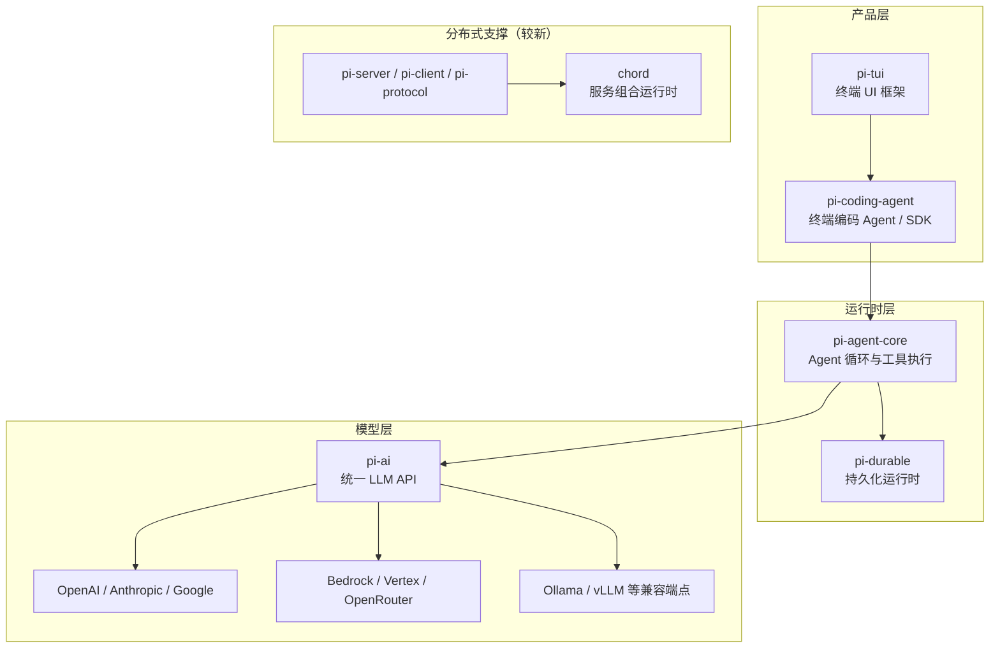

# Pi：从七包工具包到十万星 Agent Harness

> 预计阅读时间：17 分钟 | 基于 v0.87.1（2026-09-22）

写这篇文章时，这个项目还叫 badlogic/pi-mono，7 个包，不到三万星。半年后再核对，它已经改名 earendil-works/pi，包目录扩到 12 个，stars 从约 2.9 万涨到 10.8 万——半年变成原来的近四倍。

原来那套"统一 LLM API＋Agent 运行时＋编码 Agent"的组合还在，但旧文里能查到的接口几乎全换了版本，Slack Bot、Web UI、vLLM 部署三个组件直接从仓库里消失了。所以这篇按现行版本重讲一遍：Pi 是什么，怎么用，每个包干什么，以及它为什么敢把别的 Agent 工具当作标配的东西一件件砍掉。

## 一、Pi 是什么

Pi 的自我定位只有一句话，官网和 README 保持一致：

> Pi is a minimal agent harness. Adapt Pi to your workflows, not the other way around.

它是一个跑在终端里的 AI Agent（智能体）运行框架：给一个工作目录和一个模型，它能读文件、跑命令、改代码、推进多步任务。你既可以把它当日常编码 Agent 用（对标 Claude Code、Codex CLI 这一挂），也可以把它拆开——统一 LLM API 和 Agent 循环是两个独立的库，拿来做自己的 Agent 应用。

仓库基本信息（GitHub API，2026-09-23 读数）：

| 项目 | 值 |
|------|-----|
| 仓库 | [earendil-works/pi](https://github.com/earendil-works/pi)（原 badlogic/pi-mono，已 301 迁移） |
| Stars / Forks | 108,527 / 13,765（文章发布时约 29,100，见文末口径说明） |
| 提交 / 贡献者 | 6,500+ / 287 |
| 当前版本 | v0.87.1（2026-09-22） |
| 许可证 | MIT |
| 作者 | Mario Zechner（GitHub: badlogic，libGDX 作者） |

项目归 Earendil Inc. 运营，官网 [pi.dev](https://pi.dev)（域名由 exe.dev 捐赠）。社区在 [Discord](https://discord.com/invite/3cU7Bz4UPx)。同名账号下还有一条值得注意的政策：**新贡献者的 issue 和 PR 默认自动关闭**，维护者每天人工审查一次——这是项目应对爆火后垃圾贡献的方式，CONTRIBUTING.md 里写明了门槛。

## 二、五分钟上手

```bash
# npm 安装（需要 Node.js 22.19+）
npm install -g --ignore-scripts @earendil-works/pi-coding-agent

# 或者 macOS / Linux 用安装脚本
curl -fsSL https://pi.dev/install.sh | sh

# 验证
pi --version
```

注意 npm 命令里的 `--ignore-scripts`：Pi 的依赖不执行生命周期脚本，这是它供应链加固的一部分（见第七节），官方所有安装文档都带这个参数。

进工作目录启动，`/login` 连模型：

```bash
cd /path/to/project
pi
```

```text
/login    # 选 provider，订阅登录或存 API key
/model    # 换模型
```

然后直接给任务。Pi 默认只给模型四个工具：`read`、`bash`、`edit`、`write`（源码 `sdk.ts` 里 `defaultActiveToolNames` 写死这四个），它不会在每次工具调用前弹窗确认——官方安全文档的原话是"把模型生成的命令和代码当作不可信内容"，安全的边界要靠操作系统权限和容器来做，第七节细说。

几个立刻能用的高频命令：`@文件名` 引用文件（编辑器里输 `@` 可以搜索）、`/resume` 恢复历史会话、`pi --continue` 在命令行直接续上最近一次会话、`/tree` 浏览会话树、`/fork` 从任意一条历史消息分叉。

## 三、架构：12 个包的分工

Pi 是 npm workspace 单仓。现行 12 个包：

| 包 | 干什么 |
|----|--------|
| `pi-ai` | 统一多 Provider LLM API，认证解析、token（词元）/成本统计 |
| `pi-agent-core` | Agent 循环：工具执行、事件流、状态管理 |
| `pi-coding-agent` | 终端编码 Agent CLI，也是 TypeScript SDK |
| `pi-tui` | 终端 UI 框架，差分渲染 |
| `pi-durable` | 持久化会话、任务、文档运行时 |
| `pi-server` | 实验性服务端 |
| `pi-client` / `pi-protocol` | 远程会话客户端 / CBOR 传输协议 |
| `pi-session-backends` | 会话存储后端（SQLite 等单独拆包） |
| `pi-telemetry` | 供应商中立的遥测契约与类型化 schema（模式） |
| `pi-evals` | 评测 |
| `chord` | 应用组合运行时：服务、副本状态、RPC、插件 |

依赖主线是三层：`pi-ai` 管"怎么调模型"，`pi-agent-core` 管"模型和工具怎么循环起来"，`pi-coding-agent` 在这两层之上装配出完整的终端产品，`pi-tui` 给它供界面。



对照半年前：原七包里的 `pi-mom`（Slack Bot）拆去了独立仓库 [earendil-works/pi-chat](https://github.com/earendil-works/pi-chat)，README 明说"Slack/chat 自动化见 pi-chat"；`pi-web-ui`（Web 聊天组件）和 `pi-pods`（vLLM 部署 CLI）被移除，org 和作者名下都找不到后续仓库。新增的 `chord`/`pi-durable`/`pi-server`/`pi-client`/`pi-protocol` 这一批，指向同一个方向——从单机 CLI 往可托管的远程会话服务走，`pi-server` 目前仍自标 experimental。

## 四、pi-ai：统一 LLM API

这是三个核心库里最"基础设施"的一个。它只收录支持工具调用（function calling）的模型——官方理由很直接：这对 Agent 工作流是必需品。

支持 40+ Provider：OpenAI、Anthropic、Google、Vertex AI、Amazon Bedrock、Azure OpenAI、xAI、Groq、Cerebras、Mistral、DeepSeek、OpenRouter、MiniMax、Moonshot、Qwen，以及任意 OpenAI 兼容端点（Ollama、vLLM、LM Studio）。各 Provider 内部共享三种线协议实现（`anthropic-messages`、`openai-responses`、`openai-completions`），GitHub Copilot、OpenCode Zen 这类混合型按模型分发。

现行 API 的核心是 **Models 集合**：

```typescript
import { builtinModels } from '@earendil-works/pi-ai/providers/all';

const models = builtinModels();          // 注册全部内置 Provider
const model = models.getModel('anthropic', 'claude-sonnet-4-6')!;
```

发一次带工具的请求，完整走一遍：

```typescript
import { Type, type Context, type Tool } from '@earendil-works/pi-ai';

const tools: Tool[] = [{
  name: 'get_time',
  description: 'Get the current time',
  parameters: Type.Object({
    timezone: Type.Optional(Type.String())
  })
}];

const context: Context = {
  systemPrompt: 'You are a helpful assistant.',
  messages: [{ role: 'user', content: 'What time is it?', timestamp: Date.now() }],
  tools
};

// 流式：事件驱动
const s = models.stream(model, context);
for await (const event of s) {
  if (event.type === 'text_delta') process.stdout.write(event.delta);
}
const finalMessage = await s.result();
context.messages.push(finalMessage);

// 非流式：一次拿全
const response = await models.complete(model, context);
console.log(`Cost: $${finalMessage.usage.cost.total.toFixed(4)}`);
```

值得展开的机制有四个。

**认证解析归 Provider 所有。** 调 `stream()`/`complete()` 时，集合会通过所属 Provider 解析认证——存储的凭证、环境变量、OAuth 刷新、AWS profile 之类的环境源，逐级回退；显式传入的 `apiKey` 优先级最高。`models.getAuth(model)` 可以不发请求、单查某个模型的认证来源和最终 header。存储层（`CredentialStore`）默认在内存，应用可以注入持久化实现；OAuth 刷新在串行化的 `modify` 里执行，并发请求不会把同一个 token 刷两次。

**工具参数用 TypeBox 定义。** `Type.Object(...)` 这种写法让 schema 同时是运行时校验器和 TypeScript 类型，工具调用参数可以流式解析（部分 JSON 也有事件）。

**上下文可序列化、可跨模型交接。** `Context` 就是普通对象，`JSON.stringify` 即可持久化；把消息数组从一个模型的上下文交给另一个模型继续（cross-provider handoff）是内置能力，`pi-ai` 负责转换成目标 Provider 认识的格式。

**按需注册控制包体。** `builtinModels()` 是"全都要"的入口；在乎 bundle 体积的应用改用单个 Provider 工厂（`import { anthropicProvider } from '@earendil-works/pi-ai/providers/anthropic'`），SDK 依赖会被打包工具（bundler）切进懒加载 chunk，首次请求对应协议的模型时才载入。

如果只想要文本进出，不关心事件流，还有 `streamSimple()` / `completeSimple()` 两个简化入口——后面 Agent 循环默认挂的就是前者。

## 五、pi-agent-core：Agent 循环

一个有状态的 Agent，核心就是把"模型响应 → 工具执行 → 结果回填 → 再请求"这个循环做扎实。`pi-agent-core` 的做法：

```typescript
import { Agent } from '@earendil-works/pi-agent-core';

const agent = new Agent({
  initialState: {
    systemPrompt: 'You are a helpful assistant.',
    model,                                   // pi-ai 里查到的模型对象
    tools: myTools,                          // AgentTool[]
    thinkingLevel: 'medium',                 // off ~ max 七档
  },
  streamFn: models.streamSimple.bind(models), // 必填：流式函数
});

agent.subscribe((event) => {
  if (event.type === 'message_update' &&
      event.assistantMessageEvent.type === 'text_delta') {
    process.stdout.write(event.assistantMessageEvent.delta);
  }
});

await agent.prompt('Hello!');
```

注意构造方式：Agent 不直接持有"LLM 客户端"，而是接收一个 `streamFn`。这层解耦让循环逻辑不绑定任何特定 Provider 调用方式。

一次 `prompt()` 的事件序列长这样：

```text
agent_start
└─ turn_start
   ├─ message_start/end   (user)
   ├─ message_start
   ├─ message_update ...  (assistant 流式块)
   ├─ message_end
   ├─ tool_execution_start / update / end   (如有工具调用)
   └─ turn_end
└─ turn_start ...         (工具结果触发下一轮)
agent_end
```

几组值得知道的机制：

**消息双轨制。** Agent 内部流转的是 `AgentMessage`——除了 `user`/`assistant`/`toolResult` 三种 LLM 认识的角色，应用可以声明合并出自定义消息类型（UI 提示、中间状态）。每次调模型前，`convertToLlm` 把上下文过滤转换成纯 LLM 格式；`transformContext` 在它之前跑，做消息裁剪和压缩。

**工具执行的并行语义有讲究。** 默认 `parallel` 模式下，工具调用按顺序预检、允许并发的并发执行，完成事件按完成顺序发出，但持久化的 toolResult 消息仍按助手声明的顺序落盘——界面可以"谁先好谁先显示"，历史记录保持确定顺序。

**钩子覆盖循环的每个关口。** `beforeToolCall` 在参数校验后、执行前跑，可以拦截（返回 `block: true`，还能带 `terminate: true` 连后续的自动补轮一起省掉）；`afterToolCall` 在执行后改写结果；`prepareRequest` 在每次请求前重建上下文；`finishTurn` 在一轮结束后决定继续还是收尾。steering（当前轮次一结束就插入的消息）和 follow-up（整个 run 结束后再处理的消息）各有队列，模式可设 `one-at-a-time` 或 `all`。

这些钩子不是摆设——pi-coding-agent 自己的权限确认、上下文压缩，就是用同一套扩展点实现的。

## 六、pi-coding-agent：产品、SDK 与定制生态

三层能力叠完，最上面就是大多数人实际会用的东西。

### 四种运行方式

同一套 Agent 与会话机制，四种入口：

| 方式 | 用途 |
|------|------|
| 交互式 | 终端对话，`pi` 直接启动 |
| print / JSON 模式 | 脚本一次性任务；JSON 模式把事件流输出为 JSONL |
| RPC 模式 | 独立 Pi 进程，stdin/stdout 上走 JSONL 命令，供外部程序控制 |
| SDK | 进程内嵌入：`createAgentSession()` 拿到会话直接 `prompt()` |

SDK 的最小用法：

```typescript
import { createAgentSession } from '@earendil-works/pi-coding-agent';

const { session } = await createAgentSession();
try {
  await session.prompt('What files are in the current directory?');
  console.log(session.getLastAssistantText());
} finally {
  session.dispose();
}
```

会话、工具、模型、资源加载器每个边界都可以显式注入替换，仓库里 `examples/sdk/` 下有 13 个对应示例，全部随仓库做类型检查。

### 会话是一棵树

这是 Pi 会话系统最有辨识度的设计。持久化会话是 JSONL 文件，每条记录带 ID 和父引用，构成一棵树；当前活跃的叶节点到根的路径才是模型看到的上下文。`/fork` 从历史任意一条用户消息开出新分支，`/clone` 复制当前会话，被放弃的分支不删除、随时可以用 `/tree` 切回去。上下文压缩（`/compact`）插入的是一条摘要记录，原始消息仍在树里——回退无损。

官网演示里"rewind 到任意一条消息再分叉、整个会话可以分享"，靠的就是这个结构；`/share` 能把会话上传并返回查看链接。

### 定制梯度：从一段话到一个包

Pi 的可扩展性是分层的，官方 Quickstart 给了一张"从最轻的机制开始"的选择表：

| 需求 | 用什么 |
|------|--------|
| 给一个目录写持久指令 | `AGENTS.md` |
| 复用一段提示词 | Prompt template |
| 任务级指令 + 附带文件 | Skill |
| 可执行的工具、命令、事件处理 | Extension |
| 自定义终端组件 | Terminal UI |
| 接入不支持的模型服务 | Custom provider |
| 打包分发以上多种资源 | Pi package |

**Skills** 实现的是 Agent Skills 开放规范（agentskills.io）：一个含 `SKILL.md` 的目录，frontmatter 里 `name` 加 `description`。启动时 Pi 只把名字、描述、路径放进系统提示词，任务匹配上才读全文——上下文花销被压到最低。`/skill:名字` 可以强制加载。Skills 放在 `~/.agents/skills/`（用户级）或 `.agents/skills/`（项目级，需授予 project trust）。

**Extensions** 是 TypeScript 模块，跑在 Pi 进程内，同操作系统权限。一个最小的扩展：

```typescript
// ~/.pi/agent/extensions/hello.ts
import type { ExtensionAPI } from '@earendil-works/pi-coding-agent';

export default function (pi: ExtensionAPI) {
  pi.registerCommand('hello', {
    description: 'Show a greeting',
    handler: async (name, ctx) => {
      ctx.ui.notify(`Hello, ${name || 'world'}!`, 'info');
    },
  });
}
```

启动后 `/hello` 即用。`jiti` 加载让本地 TypeScript 免编译，`pi --extension ./hello.ts` 可以单次试载。注册面覆盖 `registerTool`（加模型可调用的工具）、`registerCommand`（斜杠命令）、`registerProvider`（加模型服务）、`registerShortcut`、事件监听、终端渲染——第五节那套 Agent 循环钩子在这里全部可达。

**Pi Packages** 把 skills、extensions、模板、主题打成一个单元，从 npm 或 git 分发：

```bash
pi install npm:@example/pi-tools@1.0.0
pi install git:github.com/example/pi-tools@v1
pi list            # 查看已装
pi remove <source> # 移除
```

npm 与 git 的版本规格都是钉死的（tag 和 commit 不随更新漂移）。装进项目的包声明（`.pi/settings.json`）只有在用户授予 project trust 之后才会被读取。

## 七、设计取舍：它不做什么

Pi 在同类产品里最扎眼的地方，是官方文档里一长串"没有"。3 月版 README 曾整段列出六条——No MCP、No sub-agents、No permission popups、No plan mode、No built-in to-dos、No background bash。现行 README 不再单列这一节，但立场没有变，只是从"宣言"收进了文档的机制描述里。逐条看逻辑：

- **没有内置权限系统。** README 原话："Pi does not include a built-in permission system for restricting filesystem, process, network, or credential access." 它以启动用户的权限运行，不做每次调用的确认弹窗。要边界，官方给三条容器化路线：Gondolin 扩展（Pi 留在宿主机，内置工具路由进本地 Linux micro-VM）、整机进 Docker、或 OpenShell 策略沙箱。
- **没有 sub-agents 和 plan mode。** 官方的判断是"做法太多，不该替你选"：要并行的 Agent 就用 tmux 起 Pi 实例，或者用扩展自己造，或者装一个符合你口味的第三方包。计划写进文件，待办用 TODO.md。
- **没有 MCP。** Mario 专门写过一篇《[What if you don't need MCP?](https://mariozechner.at/posts/2025-11-02-what-if-you-dont-need-mcp/)》，主张"带 README 的 CLI 工具 + Skills"在多数场景够用；需要 MCP 的话，写个扩展加上就是。现行文档没有内置 MCP 支持的迹象。
- **没有后台 bash。** 用 tmux，全程可观察、可直接交互。

这套取舍的统一逻辑：**核心保持最小，把"怎么工作"的决定权交给扩展机制**。代价同样明确——开箱体验依赖用户自己补齐安全边界，不适合把"默认就安全"当作第一诉求的场景；project trust 能挡住项目资源静默加载，但挡不住工具调用的实际权限范围，security.md 对此毫不讳言。

另外值得工程管理者注意的是它的供应链纪律：直接外部依赖全部钉死精确版本，`.npmrc` 设 `min-release-age=2`（拒绝发布不满两天的依赖版本），CLI 包自带 shrinkwrap 钉住传递依赖，CI 统一 `npm ci --ignore-scripts`，还有定时跑 `npm audit`。npm 安装命令带 `--ignore-scripts` 不是防你不信任 Pi，是 Pi 不信任 npm 生态的生命周期脚本。

## 八、生态与现状

主仓之外，Earendil org 下已经长出一圈配套仓库（stars 为 2026-09-23 读数）：`pi-review`（代码评审扩展，569）、`pi-review-loop`（增量评审循环，160）、`pi-transcribe`（转录，247）、`pi-tutorial`（教程模式，172）、`gondolin`（micro-VM 沙箱，2,181）、`absurd`（基于 Postgres 的 durable execution 工作流系统，2,436，与 `pi-durable` 同属持久化方向）；技能合集在 badlogic/pi-skills。README 还点名了 openclaw/openclaw 作为真实世界的 SDK 集成案例。

采用前值得掂量的几点：

- **迭代速度极快。** 半年内 scope 改名、七个包重构、Slack/Web/vLLM 组件移除。跟着它做集成的项目要有跟版本的准备，锁版本比追主线省心。
- **文档质量高但更新快。** `packages/coding-agent/docs/` 下 39 篇文档覆盖了从快捷键到会话文件格式的每一层，遇到不确定的机制，让 Pi 自己解释自己（官方原话："you can also ask the agent to explain itself"）或直接读对应文档，比搜博客可靠。
- **三个已移除组件的替代。** Slack/IM 场景看 pi-chat；Web UI 组件和 vLLM 部署 CLI 没有官方继任者，vLLM 本身作为 OpenAI 兼容端点仍可从 pi-ai 直连。

一句话收尾：Pi 的故事不是"又一个全家桶框架"，而是一个把"最小核心 + 极致可扩展"执行得很彻底的 Agent harness——它赌的是，Agent 时代的工作流差异太大，没有任何工具适合替你把工作流定死。半年十万星的涨幅说明这个赌注目前颇有人买账。

---

## 参考来源与口径说明

- **版本锚点**：全文机制描述以 v0.87.1（2026-09-22 发布）与 2026-09-23 的仓库/文档状态为准；stars/forks 为 GitHub API 2026-09-23 读数（108,527/13,765，commits 分页上限 6,500+，contributors 287）。
- **历史口径**：本文 2026-03-30 首发，对应 v0.64.0（2026-03-29 发版）。"发布时约 29,100 stars"取自 Wayback Machine 2026-03-30 快照。原七包结构（含 pi-mom/pi-web-ui/pi-pods）经该时点 `packages/` 目录核实。
- **仓库迁移**：badlogic/pi-mono 已 301 至 earendil-works/pi；npm 侧 @mariozechner/* 止于 0.73.1（2026-05-07），@earendil-works/* 自 v0.74.0（2026-05-07）起。
- **移除组件**：pi-mom 的后继为 earendil-works/pi-chat（2026-04-20 创建）；pi-web-ui、pi-pods 无官方继任仓库。
- **机制出处**：统一 API、Agent 循环、扩展、技能、包管理、会话树、安全与容器化等机制描述，分别对照 `packages/ai/README.md`、`packages/agent/README.md`、`packages/coding-agent/README.md` 与 `docs/`（sdk/extensions/skills/packages/security/containerization/quickstart/slash-commands 等）、`src/core/sdk.ts` 源码。默认工具四件套出自 `src/core/sdk.ts` 的 `defaultActiveToolNames`。
- **"六个 No"的时点**：整段哲学清单出自 2026-03-30 时点 README；现行 README 已不单列此节，本文逐条核对了各条立场在现行文档中的存续（无内置权限系统、容器化路线、无内置 MCP 均有现行出处），故分开交代。
- **外链状态**：pi.dev、pi.dev/docs/latest、pi.dev/install.sh、Discord 邀请、shittycodingagent.ai（旧 logo 站）均于 2026-09-23 实测可达。
