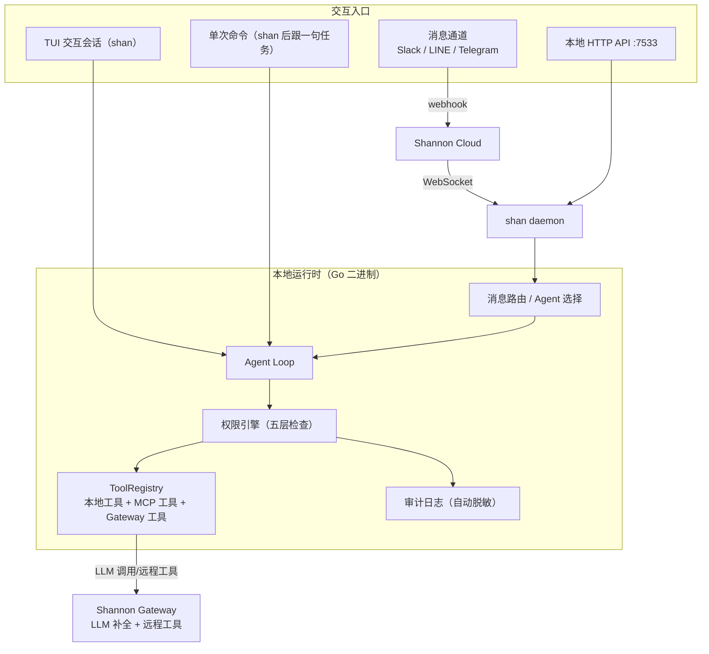

# ShanClaw（现名 Kocoro）：macOS 原生 AI Agent CLI 指南

> 预计阅读时间：23 分钟 | 难度：⭐⭐⭐

多数终端里的 AI Agent 生命周期只有一轮对话：提问、回答、退出。ShanClaw（命令名 `shan`）押的是另一个方向——Agent 应该以命名身份常驻 macOS：在本机直接读写文件、点击界面、跑 AppleScript，按 cron 和心跳自己巡逻，Slack 或 Telegram 里 @一下就能使唤。它由 [Kocoro-lab](https://github.com/Kocoro-lab) 开发，Go 编写、MIT 协议，LLM 推理交给同组织的开源框架 [Shannon Gateway](https://github.com/Kocoro-lab/Shannon)（云服务或自托管均可）。

一个值得先说清的变化：仓库原名 `Kocoro-lab/ShanClaw`，现已改名为 `Kocoro-lab/Kocoro`，命令行入口仍是 `shan`。本文以 2026-04-01 的仓库快照（main@`2a8de6ace`）为口径写成，改名后的主要演进见文末口径说明。

## 一、它解决什么问题

把 ShanClaw 与常见编码 CLI 区分开的是三件事，它们都指向同一个判断：**Agent 的价值在对话之外的时间里**。

**第一，本地工具直达 GUI。** 它不只是读写文件、跑 shell，而是通过 macOS 辅助功能（Accessibility）接口读界面树、按引用点击控件，配合截图与 CGEvent 鼠标键盘事件兜底。Finder、Safari、日历、系统设置都在可操作范围内——这是"操控电脑"四个字的实际含义。

**第二，命名 Agent 常驻。** 每个 Agent 是磁盘上的一个目录：独立的指令（`AGENT.md`）、独立的记忆（`MEMORY.md`）、独立的工具白名单和会话历史。你可以同时养一个运维机器人、一个代码评审员和一个资料整理员，互不串上下文。

**第三，离开终端也能用。** daemon 模式把 Agent 接进 Slack、LINE、Telegram（经 Shannon Cloud 中转），再暴露一个本地 HTTP API（端口 7533）给脚本和原生应用调用；launchd 定时任务和心跳机制让 Agent 在没人提问时也保持巡逻。

### 1.1 与 Shannon 的分工

| | ShanClaw（现 Kocoro） | Shannon Gateway |
|------|------|------|
| 定位 | macOS 本地 Agent 运行时（客户端） | 多智能体编排框架（服务端） |
| 形态 | 单个 Go 二进制 + TUI/daemon | docker compose 自托管，或 shannon.run 云服务 |
| 职责 | Agent 循环、本地工具、权限、调度、通道接入 | LLM 补全、远程工具（联网搜索等）、多 Agent 编排 |
| 协议 | MIT（开源） | 开源（仓库同在 Kocoro-lab） |

这个分工决定了 ShanClaw 的一个硬前提：**它不能直接填 OpenAI 或 Anthropic 的 API key，推理必须经 Shannon Gateway**。想完全离线自用，就得自己跑一套 Gateway 的 docker compose。

### 1.2 关键数据

| 指标 | 数值（2026-09-23 GitHub API 读数） |
|------|------|
| 仓库 | Kocoro-lab/Kocoro（原名 ShanClaw，301 重定向） |
| Stars / Forks | 409 / 130 |
| 语言 / 协议 | Go / MIT |
| 最新 release | v0.4.9（2026-08-23） |
| 仓库创建 | 2026-02-23 |
| npm 包 | `@kocoro/shanclaw`（2026-03-17 上架，29 个版本，latest 0.1.6） |

原文发布时（2026-04-01）仓库尚无正式 release，README 主推 npm 安装；现在官方推荐下载 Kocoro Desktop（闭源 GUI，跑在这个开源 daemon 之上），CLI 安装包已换名为 `@kocoro/kocoro`。版本演进见文末口径说明。

## 二、系统总览



源码结构与职责一一对应，`internal/` 下 20 个模块（2026-04-01 时点实测）：

```text
ShanClaw/
├── cmd/                  # 子命令入口
├── internal/
│   ├── agent/            # Agent Loop 与工具接口（loop.go / tools.go）
│   ├── agents/           # 命名 Agent 加载与管理
│   ├── audit/            # 审计日志（JSON-lines，自动脱敏）
│   ├── client/           # Shannon Gateway 客户端
│   ├── config/           # 多层配置合并
│   ├── context/          # 会话上下文
│   ├── daemon/           # 后台服务与通道消息
│   ├── heartbeat/        # 心跳保活
│   ├── hooks/            # 生命周期钩子
│   ├── instructions/     # 指令文件加载
│   ├── mcp/              # MCP 客户端（ClientManager）
│   ├── permissions/      # 权限引擎
│   ├── prompt/           # Prompt 组装
│   ├── schedule/         # launchd 定时任务
│   ├── session/          # 会话持久化与 FTS5 搜索
│   ├── skills/           # SKILL.md 加载
│   ├── tools/            # 本地工具实现（register.go 统一注册）
│   ├── tui/              # 终端 UI
│   ├── update/           # 自动更新
│   └── watcher/          # 文件监听
├── npm/                  # npm 发布配置
├── test/                 # 测试
├── main.go               # 程序入口
├── go.mod
└── install.sh            # 安装脚本
```

## 三、核心机制

### 3.1 Agent Loop

`internal/agent/loop.go` 的 `AgentLoop` 是全项目的发动机。构造时注入五样东西：Gateway 客户端、工具注册表、模型档位（small/medium/large）、配置目录、权限配置；另有审批器、审计器、钩子运行器协同。一轮对话里它反复做一件事：把系统提示（指令 + 记忆 + 工具 schema + MCP context）发给 Gateway，解析返回的工具调用，过权限检查后执行，把结果截断回传，循环直到模型给出最终答复或触达迭代上限（`max_iterations`，默认 25）。

它的可配置面比一般 CLI 宽：温度、思考预算（extended thinking，adaptive/enabled 两档）、上下文窗口、指定模型覆盖，都可以通过 config 或 TUI 的 `/model` 命令调整。远程任务（`/research`、`/swarm`）的进度经 SSE 事件流入 TUI，`WORKFLOW_STARTED`、`TOOL_INVOKED`、`thread.message.delta` 等事件各有对应的终端显示。

### 3.2 工具系统：一个接口，三种来源

所有工具实现同一个三方法接口（`internal/agent/tools.go` 原文）：

```go
type Tool interface {
	Info() ToolInfo
	Run(ctx context.Context, args string) (ToolResult, error)
	RequiresApproval() bool
}
```

`ToolInfo` 携带名称、描述与 JSON Schema 参数；`RequiresApproval` 决定是否弹审批；返回值 `ToolResult` 里最有意思的是错误四分类——`transient`（超时/网络，可重试）、`validation`（参数错误，修了再试）、`business`（策略违规，禁止重试）、`permission`（需升级给用户）。这让模型能对失败做出有依据的重试决策，而不是盲目重来。

三个可选接口扩展行为：`SafeChecker` 声明某些参数组合免审批（如 `git status`）；`NativeToolProvider` 使用厂商原生工具 schema（`computer` 工具即采用 Anthropic 的 `computer_20251124`，含视网膜屏坐标换算）；`ToolSourcer` 标注来源，注册表按 local、mcp、gateway 三类排序。

本地工具按 `internal/tools/register.go` 的注册项清点，共 27 个：文件六件套（`file_read`/`file_write`/`file_edit`/`glob`/`grep`/`directory_list`）、`bash`（120 秒超时，安全命令自动放行）、`memory_append`、`think`、`http`（走网络白名单）、`system_info`、`clipboard`、`notify`、`process`、`applescript`、`accessibility`（主力 GUI 工具，经编译好的 Swift sidecar 常驻读取界面树）、`ghostty`（终端标签与分屏，需 Ghostty ≥ 1.3.0）、`browser`（Playwright MCP 优先，pinchtab/chromedp 兜底）、`screenshot`、`computer`、`wait_for`（等 UI 条件而非 sleep）、`schedule_*` 四件、`session_search`（FTS5 全文检索历史会话），外加激活 Skills 的 `use_skill`。

Gateway 侧另有一份白名单式的远程工具（`web_search`、`web_fetch`、`web_crawl`、财报与广告分析、GA4 报表等约 20 个），同样注册进注册表；名字冲突时本地工具恒优先。

工具结果有硬尺寸约束：bash 输出上限 30000 字符，单条工具结果截断线同为 30000 字符，参数展示截到 200 字符——上下文预算是设计时考量的第一公民。

### 3.3 权限引擎：五层检查

危险命令不会走到"弹窗问一下"那一步。五层依次是：

1. **硬黑名单**——`rm -rf /`、`mkfs`、`dd if=`、`curl | sh` 等内置常量，任何配置都解不开；
2. **显式拒绝**——config 的 `permissions.denied_commands`；
3. **复合命令拆分**——`&&`、`||`、`;`、`|` 切开逐段检查，堵"白名单命令后面接危险命令"的绕路；
4. **显式允许**——`permissions.allowed_commands` 的 glob 模式（如 `"git *"`）；
5. **用户审批**——TUI 内 `[y/n]`，one-shot 模式配 `-y` 全放行。

文件路径另有独立检查：symlink 经 `filepath.EvalSymlinks` 解析后再验（防借道跳目录）、`.env`/`*.pem`/`id_rsa` 等敏感模式、`allowed_dirs` 边界。网络出口按白名单放行，localhost 恒允许。同一轮里被你拒绝过的"工具+参数"组合不会再次弹窗。

### 3.4 审计日志与 Hooks

所有工具调用追加写入 `~/.shannon/logs/audit.log`（JSON-lines），每条含时间戳、会话 ID、工具名、输入输出摘要、决策与耗时。写入前自动脱敏：AWS key、JWT、`sk-`/`key-` 前缀、Bearer token、PEM 标记、环境变量赋值语句都会被打码。

Hooks 提供四个生命周期事件，配置在 `~/.shannon/config.yaml`：

```yaml
hooks:
  PreToolUse:
    - matcher: "bash"
      command: ".shannon/hooks/check-bash.sh"
  PostToolUse:
    - matcher: "file_edit|file_write"
      command: ".shannon/hooks/post-edit.sh"
  SessionStart:
    - command: ".shannon/hooks/on-start.sh"
  Stop:
    - command: ".shannon/hooks/on-stop.sh"
```

协议是 shell 脚本经 stdin 收 JSON（工具名、参数、结果），退出码 0 放行、2 拒绝（仅 `PreToolUse` 有效）；10 秒超时、10KB 输出上限。出于安全考虑，hook 命令必须带 `./` 前缀或位于 `~/.shannon/` 下的绝对路径，裸命令名和目录外绝对路径一律拒收。

### 3.5 MCP：客户端与服务器双形态

作为客户端，ShanClaw 把外部 MCP server 的工具并入注册表。配置键是 `mcp_servers`（注意不是 `mcp.servers`），支持 stdio 和 HTTP 两种传输：

```yaml
mcp_servers:
  github:
    command: "npx"
    args: ["-y", "@modelcontextprotocol/server-github"]
    env:
      GITHUB_PERSONAL_ACCESS_TOKEN: "ghp_xxxxx"
    context: "GitHub user 'yourname'. query 'user:yourname' for repos."
```

`context` 字段是这个设计的点睛之处——它被注入系统提示，告诉模型"现在以谁的身份、该用什么查询方式"。README 原话很直白：没有 context，模型会猜错。其他要点：所有 MCP 工具默认要审批；`disabled: true` 停用不删配置；one-shot 模式每次冷启动连接，TUI 会话内连接保持；项目级可用 `.shannon/config.yaml` 覆盖全局。

反过来，`shan mcp serve` 把本地工具经 JSON-RPC 2.0 over stdio 暴露给任何 MCP 客户端（比如让别的 Agent 框架调用你 Mac 上的截图和 AppleScript）。MCP 模式强制走同一套权限引擎和审计，无 TTY 可弹审批的工具一律拒绝——安全的失败方向（fail-safe）。

### 3.6 Skills 与自定义命令

Skills 采用 Anthropic 的 [SKILL.md 规范](https://agentskills.io/specification)：每个技能一个目录、一份带 name/description frontmatter 的 Markdown。技能清单以"名称 + 描述"进系统提示，模型判断需要时调 `use_skill` 工具取回全文——典型的渐进披露，提示词体积不受技能数量膨胀拖累。来源优先级：Agent 目录 `skills/` > 全局 `~/.shannon/skills/` > 内置；技能还会自动注册成斜杠命令（`/summarize`）。

不需要模型自主判断的固定流程，用自定义斜杠命令更直接。在 `.shannon/commands/review.md` 写好提示词，`$ARGUMENTS` 会被替换成命令后的实际参数，TUI 里 `/review src/auth/login.go` 即触发。

## 四、一次真实任务的任务流

把机制串起来看一条命令的完整路径：

```bash
shan --agent ops-bot "check error rate in prod"
```

1. CLI 从 `~/.shannon/agents/ops-bot/` 读 `AGENT.md`（替换默认系统提示）与 `MEMORY.md`（跨会话记忆）；若该目录有 `config.yaml`，工具注册表按 allow/deny 收窄，MCP server 按 `_inherit` 决定继承全局还是只用自己的一份。
2. 组装请求：AGENT.md + 记忆 + 工具 schema（本地、MCP、Gateway 三源排序）+ MCP context，发往 Shannon Gateway。
3. 模型返回工具调用，比如 `bash` 跑一段查询脚本。请求先进权限引擎五层检查，`PreToolUse` 钩子有机会拦截，通过后执行；审计日志记一条（已脱敏）。
4. 工具结果按 30000 字符截断回传，模型继续推理；循环直到给出结论，或触达 `max_iterations`。
5. TUI 在回复末尾显示 `[tokens: N | cost: $X.XXXX]`；会话写入 `~/.shannon/agents/ops-bot/sessions/<id>.json`，同时进 SQLite FTS5 索引，之后 `/search error rate` 可检索。

如果这条命令换成从 Telegram 发来——`@ops-bot check prod`——前三步完全相同，只是入口变成了 Shannon Cloud 的 WebSocket 消息，回复原路送回频道。审批也不缺位：需要批准的操作会经 Cloud 中转成频道里的审批卡片，支持"本次允许"与"always allow"。

## 五、命名 Agent：目录即身份

创建 Agent 没有 `create` 子命令，就是建目录写文件：

```bash
mkdir -p ~/.shannon/agents/ops-bot
cat > ~/.shannon/agents/ops-bot/AGENT.md << 'EOF'
You are ops-bot, a production operations assistant.
- Monitor health metrics and error rates
- Summarize incidents concisely
- Always recommend next steps
EOF
```

`AGENT.md` 是指令本体，直接替换默认系统提示，不带模板变量。完整的目录约定：

```text
~/.shannon/agents/
  ops-bot/
    AGENT.md          # 指令（替换默认系统提示）
    MEMORY.md         # Agent 专属记忆（跨会话持久）
    config.yaml       # 可选：工具过滤、MCP 范围、模型覆盖
    commands/         # 可选：Agent 专属斜杠命令（*.md）
    skills/           # 可选：Agent 专属技能
```

`config.yaml` 是能力收窄的开关面板：

```yaml
# 工具白名单——配了 allow，白名单之外全部不可用
tools:
  allow: [file_read, grep, glob, bash]

# MCP 范围：_inherit: false 表示只用下面这份，忽略全局配置
mcp_servers:
  _inherit: false
  github:
    command: mcp-server-github
    env:
      GITHUB_TOKEN: "${GITHUB_TOKEN}"

# 模型与行为覆盖
agent:
  model: "claude-sonnet-4-6"
  max_iterations: 10
  temperature: 0.2
  max_tokens: 16000
  context_window: 64000

# 文件监听：命中 glob 的文件变化会触发 Agent
watch:
  - path: ~/Code/myproject
    glob: "*.go"

# 心跳
heartbeat:
  every: 30m
  active_hours: "09:00-22:00"
```

工具过滤对三种来源统一生效（本地、MCP、Gateway）；allow 与 deny 同时存在时 allow 优先。Agent 名字须匹配 `^[a-z0-9][a-z0-9_-]{0,63}$`。会话天然隔离——每个 Agent 有自己的 `sessions/` 目录。

## 六、定时任务、心跳与文件监听

这三件事合起来构成"无人值守"的完整拼图，各有分工：定时任务管"什么时候跑"，心跳管"有没有需要担心的事"，文件监听管"外部世界变了要不要反应"。

**定时任务**走 launchd，重启后依然生效：

```bash
shan schedule create --agent ops-bot --cron "0 9 * * *" --prompt "check production health"
shan schedule list
shan schedule sync        # 重新同步失败的 plist
```

完整的五段 cron 语法（经 [gronx](https://github.com/adhocore/gronx) 库），支持区间、步进、列表。真相源是 `~/.shannon/schedules.json`，实际执行体是 `~/Library/LaunchAgents/com.shannon.schedule.<id>.plist`，每次运行等价于 `shan -y --agent <name> "<prompt>"` 的 one-shot，日志落在 `~/.shannon/logs/schedule-<id>.log`。写入用"临时文件 + 改名"的原子操作加文件锁，`SyncStatus` 追踪 plist 是否与配置同步（ok/pending/failed）。一个值得注意的安全默认：daemon 模式下，`schedule_create/update/remove` 工具默认拒绝——频道里的消息不能私自给自己加定时任务。

**心跳**解决"检查清单要不要每天人肉跑一遍"。在 Agent 目录放一份 `HEARTBEAT.md` 列检查项，config 里配间隔：

```bash
cat > ~/.shannon/agents/ops-bot/HEARTBEAT.md << 'EOF'
- Check if any git repos in ~/Code have uncommitted changes
- Check if disk usage > 90%
- Check if any background processes are stuck
EOF
```

```yaml
heartbeat:
  every: 30m                    # Go duration，必填
  active_hours: "09:00-22:00"   # 可选时间窗，支持跨夜 "22:00-02:00"
  model: small                  # 可选：例行检查用便宜档
  isolated_session: true        # 默认 true：每次心跳全新会话
```

成本控制做在了四处：隔离会话不携带历史、可用低档模型、`HEARTBEAT.md` 缺失或为空则整个跳过（零 token）、上一轮没跑完则本轮跳过。事事正常时 Agent 回 `HEARTBEAT_OK`，系统静默丢弃——不通知、不存会话；有异常才作为 `heartbeat_alert` 事件发出来。

**文件监听**让 Agent 对文件系统变化实时反应。`watch` 配置（见上文 agent config 示例）命中 glob 的创建、修改、删除、重命名都会打包成一条提示送进 Agent 会话，2 秒防抖窗口合并快速连续保存，子目录递归监听、新目录自动加入，多个 Agent 重叠监听时各自拿到独立的事件批次。`POST /config/reload` 可在不重启 daemon 的情况下重建全部监听器。

## 七、Daemon 与消息通道

daemon 同时扮演两个角色：经 WebSocket 连 Shannon Cloud 收发频道消息，以及在本地 7533 端口暴露 HTTP API。架构只有一条线：

```text
Slack/LINE ──webhook──▶ Shannon Cloud ──WebSocket──▶ shan daemon (macOS)
                                                      ├─ Agent loop + local tools
                                                      └─ HTTP :7533 (local API)
                                                           ▲
                                              curl / native apps / scripts
```

注意通道消息**不经本地 Bot token 直连**——Slack、LINE、Telegram 的接入都由 Shannon Cloud 侧完成，webhook 打到云端，云端再经 WebSocket 推给你 Mac 上的 daemon。通道与 Agent 的绑定关系在云端配置，未绑定频道回落到 `@mention` 解析（`@ops-bot check prod` 路由给 ops-bot，普通消息走默认 Agent）。

消息层协议有工程细节：类型化信封加 claim/ack 握手（广播 + 先到先认领），长任务运行期间以 15 秒间隔的心跳续期认领 TTL，worker 池上限 5 个并发 Agent 防止资源耗尽，断线指数退避重连，关闭时发送下线消息。

本地 HTTP API 是脚本集成的正门，常用端点：

| 端点 | 方法 | 用途 |
|------|------|------|
| `/health` | GET | 存活检查 |
| `/status` | GET | 连接状态、当前 Agent、运行时长 |
| `/agents` | GET | 列出命名 Agent |
| `/message` | POST | 发消息给 Agent 并取回回复（支持 HITL 注入） |
| `/sessions/search` | GET | 检索会话历史 |
| `/events` | GET | SSE 事件流（`agent_reply`、`heartbeat_alert` 等） |
| `/config/reload` | POST | 热重载配置 |

```bash
# 同步调用：阻塞到 Agent 完成
curl -X POST http://localhost:7533/message \
  -d '{"text":"check disk usage","agent":"ops-bot","session_id":"2026-03-08-abc123"}' \
  -H "Content-Type: application/json"

# SSE 流式：带工具进度与文本增量
curl -X POST http://localhost:7533/message \
  -d '{"text":"analyze this codebase"}' \
  -H "Content-Type: application/json" \
  -H "Accept: text/event-stream"
```

daemon 的启停只有三条命令：`shan daemon start`（前台）、`shan daemon start -d`（后台，自动注册 launchd 服务，重启存活）、`shan daemon stop`（停止并移除 launchd 服务）。`shan daemon status` 显示连接与 launchd 状态。

## 八、安装与配置

三种安装方式（2026-04-01 时点 README 口径）：

```bash
# 方式一：npm（当时 README 推荐，启动时自动更新）
npm install -g @kocoro/shanclaw

# 方式二：安装脚本（下载最新 release 二进制到 /usr/local/bin）
curl -fsSL https://raw.githubusercontent.com/Kocoro-lab/Kocoro/main/install.sh | sh

# 方式三：源码编译（需 Go 1.25+，二进制落在 $GOPATH/bin）
git clone https://github.com/Kocoro-lab/Kocoro.git
cd Kocoro && go install .
```

初始化用 `shan --setup`（注意是带连字符的 flag，不是子命令），二选一：连 Shannon Cloud（endpoint `https://api-dev.shannon.run`，key 从 shannon.run 获取），或指向自托管 Gateway（`http://localhost:8080`，key 留空）。

配置分三层合并，后者覆盖前者：全局 `~/.shannon/config.yaml` → 项目 `.shannon/config.yaml` → 本地 `.shannon/config.local.yaml`（gitignore）。合并规则：标量覆盖、列表合并去重、结构体逐字段合并。TUI 里 `/config` 可查看合并结果及每个值来自哪个文件。主干配置：

```yaml
# 连接
endpoint: http://localhost:8080    # Shannon Gateway 地址
api_key: ""                        # Gateway API key
model_tier: medium                 # small / medium / large（默认 medium）

# 权限
permissions:
  allowed_dirs:
    - ~/Documents/notes
  allowed_commands:
    - "git *"
    - "go test *"
  denied_commands:
    - "rm -rf *"
  network_allowlist:
    - "localhost"
    - "api.example.com"

# Agent 行为
agent:
  max_iterations: 25               # 每轮工具调用上限（默认 25）
  temperature: 0
  max_tokens: 32000
  thinking: true                   # extended thinking 开关
  thinking_budget: 10000
  context_window: 128000

# 工具
tools:
  bash_timeout: 120                # 秒
  bash_max_output: 30000           # 字符
  result_truncation: 30000
```

指令与记忆是两个平行的个性化通道：`~/.shannon/instructions.md`（全局）与 `.shannon/instructions.md`（项目）都会注入系统提示（带 token 预算、去重）；`~/.shannon/memory/MEMORY.md` 的前 200 行随启动加载，Agent 自己也会往里写——跨会话记忆就是这么攒起来的。会话以 JSON 文件存于 `~/.shannon/sessions/`（命名 Agent 在各自目录下），标题取首条用户消息前 50 字符；旁边的 `sessions.db`（SQLite FTS5）是自动维护的搜索索引，删了会在下次启动重建。

## 九、上手路径与采用建议

**推荐顺序**：先 `shan` 进 TUI 单会话，用文件与 shell 工具建立信任边界，顺手试 `/research deep "<主题>"`（Gateway 远程深度研究）和 `/swarm "<目标>"`（多 Agent 编排）；然后建第一个命名 Agent（ops-bot 是个好起点），配上工具白名单；跑顺了再加 `schedule` 定时检查和心跳；最后才是 daemon 接频道、脚本调 7533 端口。每一步都可独立回退。

**它适合**：整天在 macOS 上工作、想让 Agent 处理 GUI 自动化（界面操作、应用控制）、消息通道值守或定时巡逻的个人用户与小型团队；已有 Shannon 自托管经验、想给多 Agent 体系加本地执行端的团队。

**先等等，如果你**：在 Windows/Linux 上（本地工具与 launchd 调度均为 macOS 专属）；预期 one-shot 流式输出（它等完整回复才显示）；不希望引入 Gateway 这层依赖（推理必须过它）；或需要的是纯编码工作流——Claude Code 一类编码 CLI 在代码场景的工具链更成熟，ShanClaw 的差异化在 GUI 控制与常驻值守，不在写代码本身。

**已知边界**（README "Known Limitations" 口径）：视觉依赖截图，缩到 1200px 内以 base64 送模型，官方明言视觉模型可能把看到的内容与训练知识混淆，关键细节需人工核实；复杂 cron 表达式（区间、步进）会退化为 `StartInterval` 而非精确的 `StartCalendarInterval`。

## 参考来源与口径说明

- **版本锚点**：本文机制与配置描述以 2026-04-01 的仓库快照 main@`2a8de6ace`（commit "fix: correct cache ratio formula for Anthropic token semantics"，2026-04-01 02:15 UTC）的 README 与源码为口径；涉及当前状态处已单独注明。
- **改名与演进**：仓库原名 `Kocoro-lab/ShanClaw`，现名 `Kocoro-lab/Kocoro`（GitHub 301 重定向），命令行入口仍为 `shan`。截至 2026-09-23 的主要演进：官方推荐 Kocoro Desktop（闭源 GUI，构建于开源 daemon 之上，支持一键导入 `~/.claude/` 的 agents/skills/instructions）；CLI npm 包改为 `@kocoro/kocoro`；新增语音入口 Voice Front Brain（`shan koe`）、云端记忆同步（Kocoro Cloud）、会话云同步、Feishu 通道、上下文压缩、对话批注/Side Chat/分支等桌面功能；release 现至 v0.4.9（2026-08-23）。
- **数据读数**：stars/forks、release 列表为 GitHub API 2026-09-23 读数；npm 包信息（上架时间、版本数、latest）为 npm registry API 同日读数。stars 类数字波动频繁，引用时请以查询当日为准。
- **路径说明**：配置与数据目录名为 `~/.shannon/`（与底层 Shannon 框架同名，而非 ShanClaw/Kocoro 本名），检索本机文件时以此为准。
- **工具计数口径**：本地工具 27 个，按 `internal/tools/register.go` 的注册项（26 个）加 README 单列的 `session_search` 清点；`web_search` 等 Gateway 远程工具约 20 个，按 `register.go` 的 `gatewayAllowedTools` 白名单清点。
- **素材来源**：安装/配置/Hooks/MCP/命名 Agent/定时任务/心跳/Daemon 各节的功能描述与代码示例，均出自快照时点 README 原文，或对 `internal/agent/tools.go`、`internal/agent/loop.go`、`internal/tools/register.go`、`internal/mcp/client.go` 源码的转述；工具审批流程图、daemon 架构图为 README 原图的翻译。
