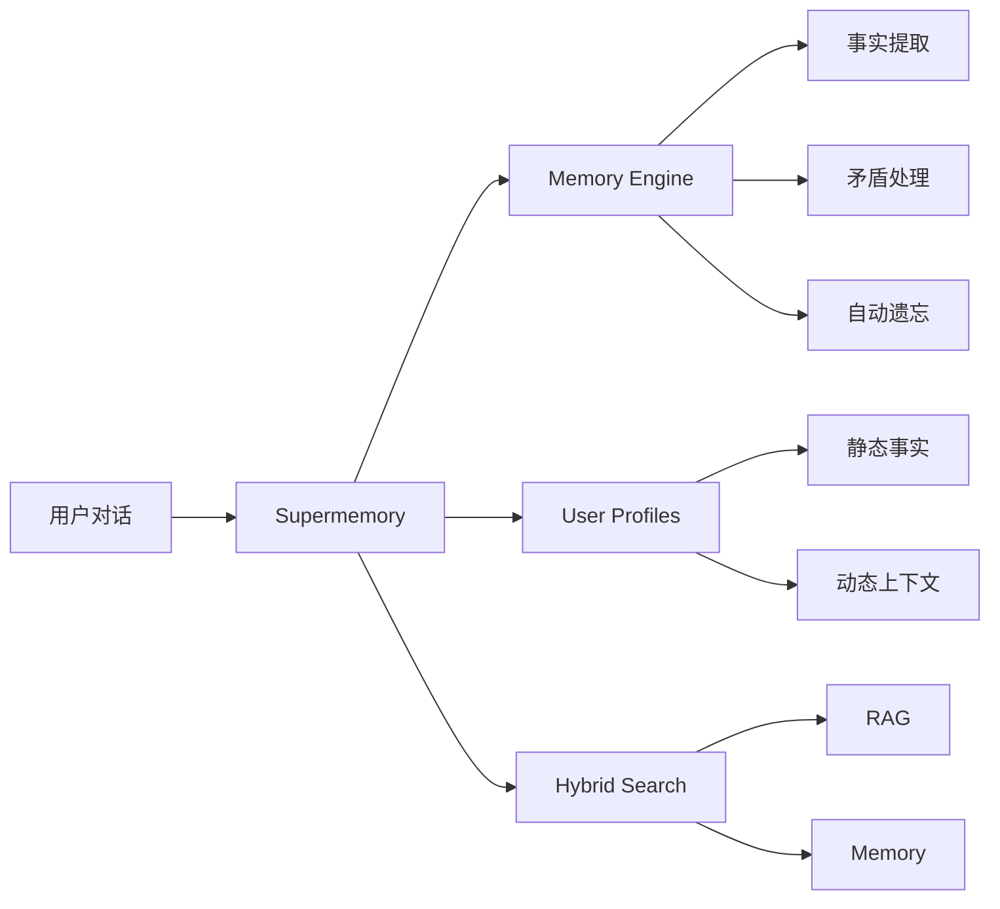
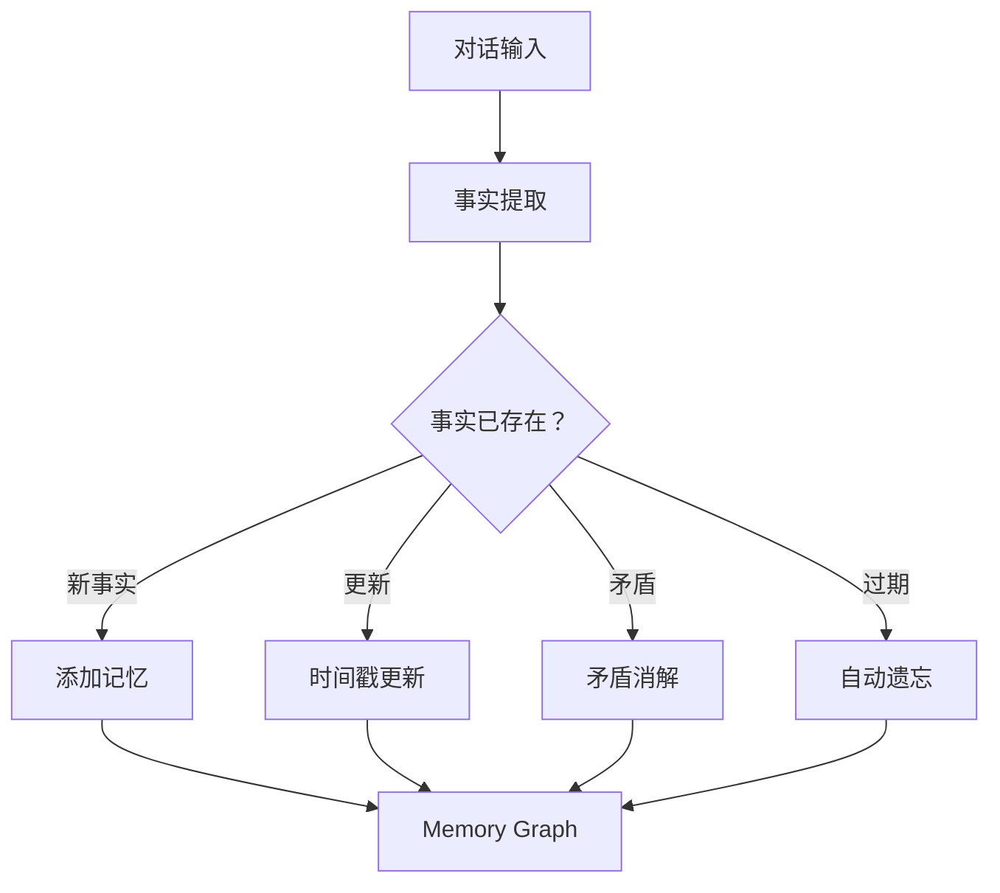

# Supermemory：从入门到精通 — AI 记忆与上下文引擎

> 预计阅读时间：30分钟 | 难度：⭐⭐⭐⭐

---

> **目标读者**：AI 应用开发者、智能体工程师、数据工程师、对 AI 记忆系统感兴趣的技术人员
> **预计学习时间**：1-2 小时（入门），4-6 小时（精通）

---

## 🎯 学习目标

完成本文档后，你将掌握：

- ✅ 理解 Supermemory 的核心定位与差异化优势
- ✅ 掌握 Memory Engine 的工作原理（事实提取、矛盾处理、自动遗忘）
- ✅ 理解 User Profiles 自动维护机制
- ✅ 掌握 Hybrid Search（RAG + Memory 一体化查询）
- ✅ 配置 Connectors（Google Drive/Gmail/Notion/GitHub）
- ✅ 使用 Multi-modal Extractors 处理 PDF/图片/视频/代码
- ✅ 集成到主流 AI 框架（Vercel AI SDK/LangChain/LangGraph 等）
- ✅ 调用 Supermemory API 构建智能应用
- ✅ 部署 MCP Server 供 AI 工具使用
- ✅ 理解三大基准测试的评测方法论

---

## 一、项目概述与背景

### 1.1 什么是 Supermemory？

Supermemory（[supermemoryai/supermemory](https://github.com/supermemoryai/supermemory)）是**AI 时代的记忆与上下文引擎**，为 AI 智能体提供持久化记忆、用户画像、混合搜索和数据连接能力。

**核心定位**：解决 AI 在对话之间"失忆"的问题，让 AI 能够跨会话记住用户偏好、项目背景、历史讨论。



### 1.2 项目数据

| 指标 | 数值 |
|------|------|
| GitHub Stars | **20.5k** |
| GitHub Forks | **1.9k** |
| Contributors | **75** |
| Commits | **1,479** |
| 许可证 | MIT |
| 主要语言 | TypeScript 61.6%, MDX 31.2%, Python 6.5% |

### 1.3 基准测试成绩

Supermemory 在三大 AI 记忆基准测试中**全部排名第一**：

| 基准测试 | 评测内容 | 成绩 |
|----------|-----------|------|
| **LongMemEval** | 跨会话长期记忆与知识更新 | **81.6% — #1** |
| **LoCoMo** | 单跳/多跳/时序/对抗性事实检索 | **#1** |
| **ConvoMem** | 个性化与偏好学习 | **#1** |

### 1.4 与传统 RAG 的本质区别

| 维度 | 传统 RAG | Supermemory |
|------|-----------|-------------|
| **数据** | 文档 chunks（静态） | 用户事实（动态） |
| **个性化** | 对所有人相同结果 | 理解用户差异 |
| **时序** | 不感知时间变化 | 知道"我刚搬到 SF"替代"我住 NYC" |
| **遗忘** | 永不遗忘 | 自动过期临时事实 |
| **矛盾** | 不处理 | 自动消解 |

---

## 二、核心概念深度解析

### 2.1 Memory Engine（记忆引擎）

Memory Engine 是 Supermemory 的核心，负责从对话中提取和管理事实：



**核心能力**：

| 能力 | 说明 |
|------|------|
| **事实提取** | 从自然语言对话中提取结构化事实 |
| **时序变化** | 理解"我搬到了 SF"替代"我住 NYC" |
| **矛盾处理** | 自动消解冲突信息 |
| **自动遗忘** | 临时事实（如"明天有考试"）过期后自动删除 |

### 2.2 User Profiles（用户画像）

传统记忆依赖搜索（需要知道问什么），Supermemory 自动维护用户画像：

```typescript
// 获取用户画像
const { profile } = await client.profile({
    containerTag: "user_123"
});

// profile.static → 长期事实
// ["在 Acme 工作", "喜欢深色模式", "使用 Vim"]

// profile.dynamic → 近期上下文
// ["正在做 auth 迁移", "调试 rate limits"]
```

**特点**：
- 一次调用，~50ms 响应
- 自动聚合静态事实和动态上下文
- 可直接注入到系统提示词

### 2.3 Hybrid Search（混合搜索）

RAG + Memory 一体化查询，一次返回知识库文档和用户个性化记忆：

```typescript
// 混合搜索（默认）
const results = await client.search.memories({
    q: "如何部署？",
    containerTag: "user_123",
    searchMode: "hybrid"
});
// 返回：部署文档（RAG）+ 用户的部署偏好（Memory）
```

### 2.4 Connectors（数据连接器）

支持多种数据源的实时同步：

| 连接器 | 说明 |
|--------|------|
| **Google Drive** | 文档、表格、幻灯片 |
| **Gmail** | 邮件内容 |
| **Notion** | 笔记和数据库 |
| **OneDrive** | 文件同步 |
| **GitHub** | Issues、PRs、代码 |
| **Web Crawler** | 网页抓取 |

### 2.5 Multi-modal Extractors（多模态处理）

| 类型 | 处理方式 |
|------|----------|
| **PDF** | 文本提取和分块 |
| **图片** | OCR 光学字符识别 |
| **视频** | 语音转录 |
| **代码** | AST-aware 分块（保留语法结构） |

---

## 三、快速开始

### 3.1 安装方式

```bash
# JavaScript/TypeScript
npm install supermemory

# Python
pip install supermemory
```

### 3.2 基础使用

```typescript
import Supermemory from "supermemory";

const client = new Supermemory();

// 存储对话
await client.add({
    content: "用户喜欢 TypeScript，偏爱函数式编程",
    containerTag: "user_123"
});

// 获取用户画像 + 记忆
const { profile, searchResults } = await client.profile({
    containerTag: "user_123",
    q: "用户偏好的编程风格是什么？"
});
```

```python
from supermemory import Supermemory

client = Supermemory()

# 存储对话
client.add(
    content="用户喜欢 TypeScript，偏爱函数式编程",
    container_tag="user_123"
)

# 获取用户画像
result = client.profile(
    container_tag="user_123",
    q="编程风格偏好"
)
print(result.profile.static)  # 长期事实
print(result.profile.dynamic)  # 近期上下文
```

### 3.3 MCP Server 安装（AI 工具集成）

```bash
# 一键安装（支持 OAuth）
npx -y install-mcp@latest https://mcp.supermemory.ai/mcp --client claude --oauth=yes
```

支持的客户端：`claude`、`cursor`、`windsurf`、`vscode` 等。

### 3.4 AI 工具使用

安装后，AI 获得三个核心工具：

| 工具 | 功能 |
|------|------|
| `memory` | 保存或遗忘信息，AI 自动调用 |
| `recall` | 按查询搜索记忆，返回相关记忆和用户画像 |
| `context` | 在对话开始时注入完整用户画像 |

---

## 四、API 详解

### 4.1 核心方法一览

| 方法 | 用途 |
|------|------|
| `client.add()` | 存储内容（文本、对话、URL、HTML） |
| `client.profile()` | 获取用户画像 + 可选搜索 |
| `client.search.memories()` | 混合搜索（记忆和文档） |
| `client.search.documents()` | 文档搜索（带元数据过滤） |
| `client.documents.uploadFile()` | 上传 PDF、图片、视频、代码 |
| `client.documents.list()` | 列出和过滤文档 |
| `client.settings.update()` | 配置记忆提取和分块策略 |

### 4.2 搜索模式

```typescript
// 混合搜索（默认）— RAG + Memory 合一
const results = await client.search.memories({
    q: "部署偏好",
    containerTag: "user_123",
    searchMode: "hybrid"
});

// 仅记忆搜索
const results = await client.search.memories({
    q: "用户偏好",
    containerTag: "user_123",
    searchMode: "memories"
});
```

### 4.3 用户画像详解

```typescript
const { profile } = await client.profile({
    containerTag: "user_123"
});

// profile.static → 长期稳定事实
// ["Acme 高级工程师", "喜欢深色模式", "使用 Vim 编辑器"]

// profile.dynamic → 近期动态上下文
// ["正在做 auth 迁移项目", "调试 API rate limits"]
```

### 4.4 文件上传

```typescript
// 上传文件
const doc = await client.documents.uploadFile({
    file: "./report.pdf",
    containerTag: "project_abc"
});

// 列出文档
const docs = await client.documents.list({
    containerTag: "project_abc",
    filter: { type: "pdf" }
});
```

---

## 五、框架集成

### 5.1 Vercel AI SDK

```typescript
import { withSupermemory } from "@supermemory/tools/ai-sdk";
import { openai } from "ai-sdk";

const model = withSupermemory(
    openai("gpt-4o"),
    "user_123"  // containerTag
);
```

### 5.2 Mastra

```typescript
import { withSupermemory } from "@supermemory/tools/mastra";

const agent = new Agent(
    withSupermemory(config, "user-123", {
        mode: "full"  // 或 "memory-only"
    })
);
```

### 5.3 支持的框架

| 框架 | 集成方式 |
|------|----------|
| **Vercel AI SDK** | `withSupermemory()` 包装器 |
| **LangChain** | 自定义 Retriever |
| **LangGraph** | 状态管理和记忆节点 |
| **OpenAI Agents SDK** | Tool 集成 |
| **Mastra** | Agent 中间件 |
| **Agno** | Memory Layer |
| **Claude Memory Tool** | 原生兼容 |
| **n8n** | Workflow 节点 |

---

## 六、技术架构解析

### 6.1 系统架构

```
┌─────────────────────────────────────┐
│         Your App / AI Tool           │
└─────────────────┬───────────────────┘
                  │
┌─────────────────▼───────────────────┐
│          Supermemory                 │
│  ┌────────────────────────────────┐ │
│  │     Memory Engine              │ │
│  │  • 事实提取                    │ │
│  │  • 时序变化追踪                │ │
│  │  • 矛盾消解                    │ │
│  │  • 自动遗忘                    │ │
│  └────────────────────────────────┘ │
│  ┌────────────────────────────────┐ │
│  │     User Profiles              │ │
│  │  • Static Facts（静态事实）    │ │
│  │  • Dynamic Context（动态上下文）│ │
│  └────────────────────────────────┘ │
│  ┌────────────────────────────────┐ │
│  │     Hybrid Search              │ │
│  │  • RAG（知识库检索）          │ │
│  │  • Memory（个性化记忆）        │ │
│  └────────────────────────────────┘ │
│  ┌────────────────────────────────┐ │
│  │     Connectors                 │ │
│  │  • Google Drive / Gmail       │ │
│  │  • Notion / OneDrive         │ │
│  │  • GitHub / Web Crawler      │ │
│  └────────────────────────────────┘ │
│  ┌────────────────────────────────┐ │
│  │     Multi-modal Extractors     │ │
│  │  • PDF / Images (OCR)         │ │
│  │  • Videos (Transcription)     │ │
│  │  • Code (AST-aware)          │ │
│  └────────────────────────────────┘ │
└─────────────────────────────────────┘
```

### 6.2 目录结构

```
supermemory/
├── apps/                 # 应用程序
├── packages/            # 核心包
├── skills/
│   └── supermemory/    # Agent Skill
├── .github/workflows/   # CI/CD
├── turbo.json          # Turborepo 配置
├── biome.json          # 代码格式配置
├── bun.lock            # 依赖锁定
└── package.json
```

### 6.3 技术栈

| 层级 | 技术 |
|------|------|
| **运行时** | Node.js / Bun |
| **语言** | TypeScript, Python |
| **数据库** | PostgreSQL |
| **向量检索** | 支持多种 Embedding 提供商 |
| **框架** | Vercel AI SDK, LangChain, Mastra |

---

## 七、应用场景

### 7.1 智能客服

```
用户：我想取消订阅
AI：
  → Supermemory 检索用户历史
  → 发现：用户于 2025年3月 订阅了年费会员
  → 自动将订阅状态、购买历史注入上下文
  → 提供精准的取消帮助
```

### 7.2 个人 AI 助手

```
用户1：我在做一个新项目，是电商平台的支付系统
用户1：我偏好使用 Stripe 而不是 PayPal

[第二天]

用户1：帮我设计支付模块
AI：
  → Supermemory 检索"用户偏好 Stripe"
  → 检索"电商项目背景"
  → 直接基于 Stripe 设计，不提 PayPal
```

### 7.3 企业知识管理

```
新员工：我们的技术栈是什么？
AI：
  → Supermemory 检索公司知识库
  → 结合员工背景（前端工程师）
  → 返回：React/Next.js 后端，部署在 Vercel
```

---

## 八、基准测试详解

### 8.1 LongMemEval

**评测内容**：跨会话长期记忆与知识更新处理能力

**Supermemory 成绩**：81.6%（第一名）

**评测维度**：
- 跨会话事实保留
- 知识更新后的状态同步
- 对抗性干扰下的记忆稳定性

### 8.2 LoCoMo

**评测内容**：单跳/多跳/时序/对抗性事实检索

**Supermemory 成绩**：第一名

**评测维度**：
- 单跳检索（直接事实查询）
- 多跳检索（需要推理的关系查询）
- 时序推理（"现在住哪里" vs "之前住哪里"）
- 对抗性测试（故意误导的信息）

### 8.3 ConvoMem

**评测内容**：个性化与偏好学习

**Supermemory 成绩**：第一名

**评测维度**：
- 用户偏好提取
- 偏好随时间的演变
- 跨话题偏好关联

### 8.4 MemoryBench 工具

Supermemory 团队开源了 MemoryBench 框架，用于标准化评测记忆系统：

```bash
# 对比不同记忆系统
bun run src/index.ts run -p supermemory -b longmemeval -j gpt-4o -r my-run
```

---

## 九、最佳实践

### 9.1 记忆组织

使用 `containerTag`（项目容器）分离不同上下文：

```typescript
// 工作项目
await client.add({
    content: "用户正在开发支付系统",
    containerTag: "work_project_abc"
});

// 个人学习
await client.add({
    content: "用户在学 Rust",
    containerTag: "personal_learning"
});
```

### 9.2 上下文注入

在对话开始时注入完整用户画像：

```typescript
const { profile } = await client.profile({
    containerTag: "user_123"
});

// 注入到系统提示词
const systemPrompt = `
用户信息：
- 长期背景：${profile.static.join(", ")}
- 当前上下文：${profile.dynamic.join(", ")}
`;
```

### 9.3 性能优化

| 优化项 | 方法 |
|--------|------|
| 减少延迟 | 使用 `profile()` 而非多次 `search()` |
| 节约成本 | 设置 `searchMode: "memories"` 限制范围 |
| 数据隔离 | 严格使用 `containerTag` 分离项目 |

---

## 十、常见问题

### Q1: Supermemory 和 Mem0/Zep 有什么区别？

| 维度 | Supermemory | Mem0 | Zep |
|------|-------------|------|-----|
| **基准测试** | 全部第一 | 未公开 | 部分公开 |
| **架构** | Memory + RAG 一体 | Memory | Memory |
| **遗忘机制** | 自动 | 手动 | 手动 |
| **多模态** | 原生支持 | 有限 | 有限 |

### Q2: 如何处理敏感数据？

- 使用私有化部署（Supermemory 支持本地部署）
- 敏感信息使用 `containerTag` 严格隔离
- 配置数据保留策略

### Q3: 支持私有化部署吗？

是的，Supermemory 支持企业私有化部署，请联系官方获取方案。

### Q4: 如何贡献代码？

```bash
# Fork 仓库
# 创建分支
git checkout -b feature/new-feature

# 提交 PR
# 遵循 CONTRIBUTING.md 规范
```

---

## 十一、总结

Supermemory 是 AI 记忆领域的标杆项目：

| 优势 | 说明 |
|------|------|
| 🏆 **基准第一** | LongMemEval/LoCoMo/ConvoMem 全部第一 |
| 🧠 **智能记忆** | 事实提取 + 矛盾处理 + 自动遗忘 |
| 👤 **用户画像** | ~50ms 响应，自动维护 |
| 🔍 **混合搜索** | RAG + Memory 一体化 |
| 🔌 **数据连接** | 主流数据源实时同步 |
| 📄 **多模态** | PDF/图片/视频/代码原生支持 |
| 🌐 **框架集成** | Vercel/LangChain/Mastra 等一键接入 |
| 🔒 **企业级** | 支持私有化部署 |

**下一步推荐**：

1. [快速开始](#三快速开始)：安装 npm 包，运行第一个示例
2. [MCP 集成](#三四-mcp-server-安装ai-工具集成)：为 Claude Code/Cursor 安装记忆能力
3. [API 详解](#四api-详解)：深入理解核心接口
4. [框架集成](#五框架集成)：集成到你的 AI 应用

---

**文档信息**

- 难度：⭐⭐（进阶）
- 类型：完整教程
- 更新日期：2026-03-31
- 预计学习时间：1-2 小时（入门），4-6 小时（精通）
- GitHub：https://github.com/supermemoryai/supermemory
- 官网：https://supermemory.ai
- 文档：https://supermemory.ai/docs

🦞 由钳岳星君撰写 | 项目源码：https://github.com/supermemoryai/supermemory