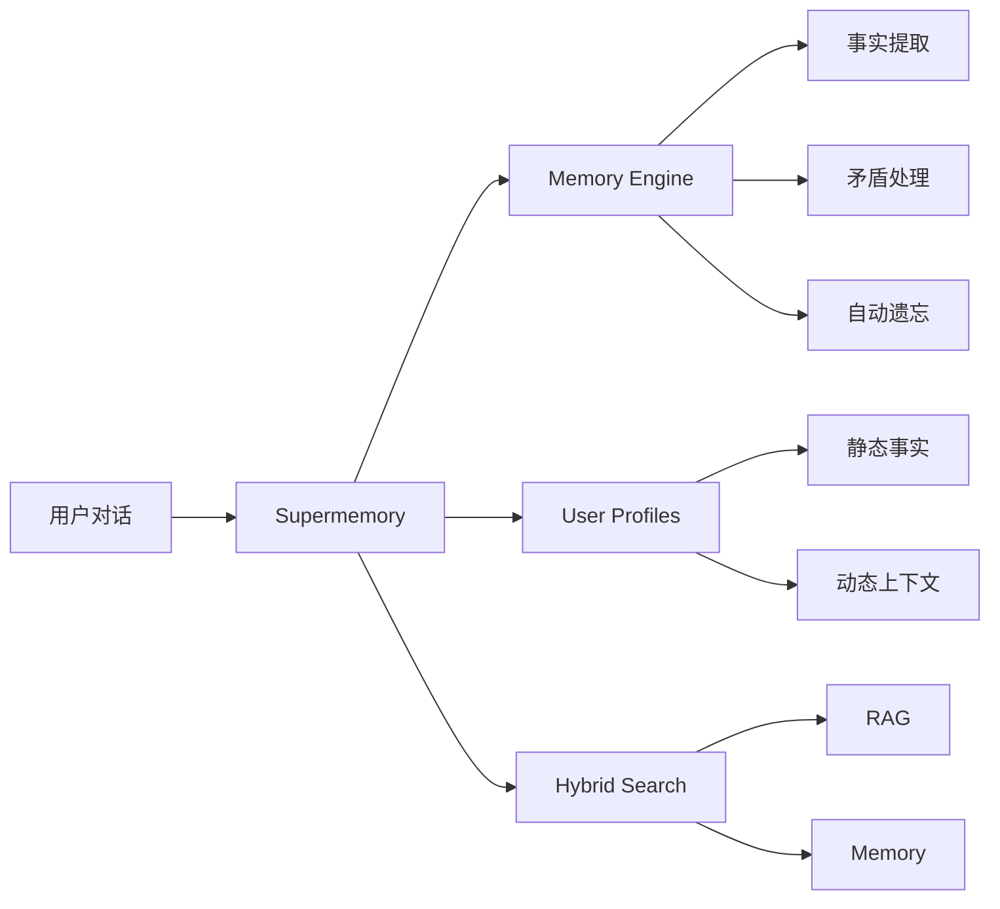
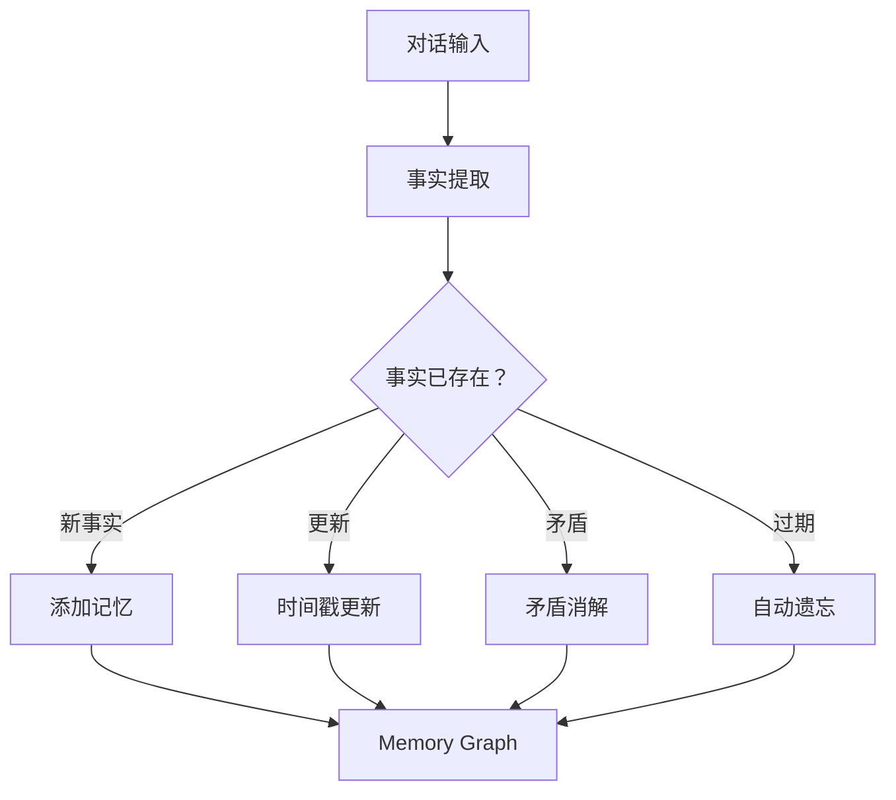

# Supermemory：从入门到精通 AI 记忆与上下文引擎

AI 记忆系统的核心矛盾不是"存不下"，而是"存了之后查不出来该用的那条"。Supermemory 在这件事上做对了一件事：把记忆检索和用户画像维护合并成一条通路，而不是让开发者在 RAG 和 Memory 两套系统之间来回切换。

本文假设你已有 AI 应用开发经验，预计阅读 30 分钟。读完你会理解 Supermemory 各子系统如何协作，以及它在什么场景下比传统 RAG 更合适。

> 难度：⭐⭐⭐⭐ | 预计动手时间：1-2 小时（入门），4-6 小时（精通）

---

## 一、项目概述

### 1.1 Supermemory 解决什么问题

[Supermemory](https://github.com/supermemoryai/supermemory)（20.5k Stars，MIT 协议）解决的是 AI 对话中的"跨会话失忆"：用户今天说过的事情，明天 AI 就忘了。更准确地说，它解决的是失忆链条上的三个具体问题：

1. 对话结束后，提取出的用户事实散落在日志里，下次对话时没有机制把它们注入到上下文窗口。
2. 同一个用户的前后说法可能矛盾（"我住 NYC" → "我刚搬到 SF"），传统方案要么全保留要么人工清理。
3. 临时信息（"明天有考试"）会一直占用存储，永远不会过期。

Supermemory 的方案是把这三个问题合并到一条处理链里：Memory Engine 负责提取和更新事实，User Profiles 负责聚合静态/动态上下文，Hybrid Search 负责在检索阶段同时返回知识库文档和用户个性化记忆。



### 1.2 子系统速览

Supermemory 的五个子系统各管一段，但最终在 Hybrid Search 处汇合：

| 子系统 | 职责 | 输入 | 输出 |
|--------|------|------|------|
| **Memory Engine** | 从对话中提取事实、处理矛盾、管理过期 | 自然语言对话 | 结构化事实图 |
| **User Profiles** | 聚合静态属性与动态上下文 | 历史事实 | 可注入 prompt 的用户画像 |
| **Hybrid Search** | 同时检索知识库和用户记忆 | 查询字符串 + containerTag | 文档 + 记忆混合结果 |
| **Connectors** | 同步外部数据源 | Google Drive/Gmail/Notion 等 | 索引化的文档 |
| **Multi-modal Extractors** | 把非文本内容转为可检索文本 | PDF/图片/视频/代码 | 分块文本 |

### 1.3 基准测试成绩

Supermemory 在三大 AI 记忆基准测试中全部排名第一。这些数字的价值在于：它们不是测"跑得快不快"，而是测"记忆系统在跨会话场景下能不能给出正确的个性化答案"。第八章会详细拆解每个基准测试测的是什么、不能推出什么。

| 基准测试 | 评测内容 | 成绩 |
|----------|-----------|------|
| **LongMemEval** | 跨会话长期记忆与知识更新 | **81.6% — #1** |
| **LoCoMo** | 单跳/多跳/时序/对抗性事实检索 | **#1** |
| **ConvoMem** | 个性化与偏好学习 | **#1** |

### 1.4 与传统 RAG 的区别

| 维度 | 传统 RAG | Supermemory |
|------|-----------|-------------|
| **数据** | 文档 chunks（静态） | 用户事实（动态） |
| **个性化** | 对所有人相同结果 | 理解用户差异 |
| **时序** | 不感知时间变化 | 知道"我刚搬到 SF"替代"我住 NYC" |
| **遗忘** | 永不遗忘 | 自动过期临时事实 |
| **矛盾** | 不处理 | 自动消解 |

---

## 二、核心概念

### 2.1 Memory Engine（记忆引擎）

Memory Engine 负责从对话中提取结构化的用户事实，并在事实变化时自动更新或淘汰旧信息。它的处理链如下：



四条处理路径对应四种场景：

| 路径 | 触发条件 | 例子 |
|------|----------|------|
| 新事实 | 首次出现的用户信息 | "我在 Acme 工作" → 存入 |
| 时间戳更新 | 重复出现但内容相同 | 再次说"我在 Acme 工作" → 刷新时间 |
| 矛盾消解 | 新事实与旧事实冲突 | "我刚搬到 SF" 覆盖 "我住 NYC" |
| 自动遗忘 | 临时事实过期 | "明天有考试"在考试日后自动删除 |

### 2.2 User Profiles（用户画像）

传统记忆系统依赖用户主动搜索（你得先知道要查什么），Supermemory 的做法是自动维护一份用户画像，一次调用返回两类信息：

```typescript
const { profile } = await client.profile({
    containerTag: "user_123"
});

// profile.static → 长期事实
// ["在 Acme 工作", "喜欢深色模式", "使用 Vim"]

// profile.dynamic → 近期上下文
// ["正在做 auth 迁移", "调试 rate limits"]
```

`profile.static` 存放的是跨越多次对话仍稳定的用户属性，`profile.dynamic` 存放的是当前活跃的话题和项目状态。一次调用约 50ms 返回，可以直接拼接到系统提示词里。

### 2.3 Hybrid Search（混合搜索）

Hybrid Search 把 RAG 和 Memory 合并成一次查询：同一个搜索请求同时返回知识库文档和用户个性化记忆，省去了开发者自己协调两套系统的工作。

```typescript
const results = await client.search.memories({
    q: "如何部署？",
    containerTag: "user_123",
    searchMode: "hybrid"
});
// 返回：部署文档（RAG）+ 用户的部署偏好（Memory）
```

### 2.4 Connectors（数据连接器）

| 连接器 | 数据源 |
|--------|--------|
| **Google Drive** | 文档、表格、幻灯片 |
| **Gmail** | 邮件内容 |
| **Notion** | 笔记和数据库 |
| **OneDrive** | 文件同步 |
| **GitHub** | Issues、PRs、代码 |
| **Web Crawler** | 网页抓取 |

### 2.5 Multi-modal Extractors（多模态提取器）

| 文件类型 | 处理方式 |
|----------|----------|
| **PDF** | 文本提取和分块 |
| **图片** | OCR 光学字符识别 |
| **视频** | 语音转录 |
| **代码** | AST-aware 分块（保留语法结构） |

---

## 三、快速开始

### 3.1 安装

```bash
# JavaScript/TypeScript
npm install supermemory

# Python
pip install supermemory
```

### 3.2 基础调用

```typescript
import Supermemory from "supermemory";

const client = new Supermemory();

await client.add({
    content: "用户喜欢 TypeScript，偏爱函数式编程",
    containerTag: "user_123"
});

const { profile, searchResults } = await client.profile({
    containerTag: "user_123",
    q: "用户偏好的编程风格是什么？"
});
```

```python
from supermemory import Supermemory

client = Supermemory()

client.add(
    content="用户喜欢 TypeScript，偏爱函数式编程",
    container_tag="user_123"
)

result = client.profile(
    container_tag="user_123",
    q="编程风格偏好"
)
print(result.profile.static)
print(result.profile.dynamic)
```

### 3.3 MCP Server（AI 工具集成）

```bash
npx -y install-mcp@latest https://mcp.supermemory.ai/mcp --client claude --oauth=yes
```

支持的客户端：`claude`、`cursor`、`windsurf`、`vscode`。

安装后 AI 获得三个工具：

| 工具 | 作用 |
|------|------|
| `memory` | 保存或遗忘信息，AI 自动调用 |
| `recall` | 按查询搜索记忆，返回相关记忆和用户画像 |
| `context` | 对话开始时注入完整用户画像 |

---

## 四、API 参考

### 4.1 核心方法

| 方法 | 用途 |
|------|------|
| `client.add()` | 存储内容（文本、对话、URL、HTML） |
| `client.profile()` | 获取用户画像 + 可选搜索 |
| `client.search.memories()` | 混合搜索（记忆和文档） |
| `client.search.documents()` | 文档搜索（带元数据过滤） |
| `client.documents.uploadFile()` | 上传 PDF、图片、视频、代码 |
| `client.documents.list()` | 列出和过滤文档 |
| `client.settings.update()` | 配置记忆提取和分块策略 |

### 4.2 搜索模式

```typescript
// 混合搜索（默认）— RAG + Memory
const results = await client.search.memories({
    q: "部署偏好",
    containerTag: "user_123",
    searchMode: "hybrid"
});

// 仅记忆搜索
const results = await client.search.memories({
    q: "用户偏好",
    containerTag: "user_123",
    searchMode: "memories"
});
```

### 4.3 用户画像

```typescript
const { profile } = await client.profile({
    containerTag: "user_123"
});

// profile.static → ["Acme 高级工程师", "喜欢深色模式", "使用 Vim"]
// profile.dynamic → ["正在做 auth 迁移项目", "调试 API rate limits"]
```

### 4.4 文件上传

```typescript
const doc = await client.documents.uploadFile({
    file: "./report.pdf",
    containerTag: "project_abc"
});

const docs = await client.documents.list({
    containerTag: "project_abc",
    filter: { type: "pdf" }
});
```

---

## 五、框架集成

Supermemory 通过 `withSupermemory()` 包装器接入主流框架，核心思路是把记忆检索和用户画像注入到模型的上下文窗口里，而不是让开发者手动管理记忆调用。

### 5.1 Vercel AI SDK

```typescript
import { withSupermemory } from "@supermemory/tools/ai-sdk";
import { openai } from "ai-sdk";

const model = withSupermemory(
    openai("gpt-4o"),
    "user_123"
);
```

### 5.2 Mastra

```typescript
import { withSupermemory } from "@supermemory/tools/mastra";

const agent = new Agent(
    withSupermemory(config, "user-123", {
        mode: "full"
    })
);
```

### 5.3 支持的框架

| 框架 | 集成方式 |
|------|----------|
| **Vercel AI SDK** | `withSupermemory()` 包装器 |
| **LangChain** | 自定义 Retriever |
| **LangGraph** | 状态管理和记忆节点 |
| **OpenAI Agents SDK** | Tool 集成 |
| **Mastra** | Agent 中间件 |
| **Agno** | Memory Layer |
| **Claude Memory Tool** | 原生兼容 |
| **n8n** | Workflow 节点 |

---

## 六、技术架构

### 6.1 系统架构

```
┌─────────────────────────────────────┐
│         Your App / AI Tool           │
└─────────────────┬───────────────────┘
                  │
┌─────────────────▼───────────────────┐
│          Supermemory                 │
│  ┌────────────────────────────────┐ │
│  │     Memory Engine              │ │
│  │  · 事实提取                    │ │
│  │  · 时序变化追踪                │ │
│  │  · 矛盾消解                    │ │
│  │  · 自动遗忘                    │ │
│  └────────────────────────────────┘ │
│  ┌────────────────────────────────┐ │
│  │     User Profiles              │ │
│  │  · Static Facts（静态事实）    │ │
│  │  · Dynamic Context（动态上下文）│ │
│  └────────────────────────────────┘ │
│  ┌────────────────────────────────┐ │
│  │     Hybrid Search              │ │
│  │  · RAG（知识库检索）          │ │
│  │  · Memory（个性化记忆）        │ │
│  └────────────────────────────────┘ │
│  ┌────────────────────────────────┐ │
│  │     Connectors                 │ │
│  │  · Google Drive / Gmail       │ │
│  │  · Notion / OneDrive         │ │
│  │  · GitHub / Web Crawler      │ │
│  └────────────────────────────────┘ │
│  ┌────────────────────────────────┐ │
│  │     Multi-modal Extractors     │ │
│  │  · PDF / Images (OCR)         │ │
│  │  · Videos (Transcription)     │ │
│  │  · Code (AST-aware)          │ │
│  └────────────────────────────────┘ │
└─────────────────────────────────────┘
```

### 6.2 一次对话如何流过系统

以用户连续两次对话为例，看 Supermemory 各子系统如何协作：

**第一次对话**：
```
用户：我最近在做一个电商平台的支付系统，后端用 Go
AI：了解了，支付系统 + Go 后端
```

这时发生了什么：

1. 对话文本进入 Memory Engine，提取出事实："正在开发电商支付系统""后端技术栈 Go"。
2. 这两个事实都是新事实，直接存入 Memory Graph。
3. User Profiles 更新：`profile.dynamic` 加入"电商支付系统项目"。

**第二次对话**（第二天）：
```
用户：帮我设计支付模块的 API 接口
```

1. 请求到达 Hybrid Search，`searchMode: "hybrid"`。
2. Hybrid Search 同时做两件事：在知识库文档中搜索"支付模块 API 设计"（RAG 通道），在用户记忆中搜索 containerTag 对应用户的历史事实（Memory 通道）。
3. Memory 通道返回："用户正在开发电商支付系统""后端技术栈 Go"。
4. 两条记忆和 RAG 结果一起拼入上下文窗口，AI 看到的是"用户在做 Go 支付系统，这里的设计文档是..."，而不是空洞的"请设计支付 API"。

如果用户第二天说"我改用 Rust 重写了"，Memory Engine 会检测到矛盾（Go → Rust），自动更新事实并保留旧版本的时间戳，而不是同时保留两条矛盾信息。

### 6.3 目录结构

```
supermemory/
├── apps/
├── packages/
├── skills/
│   └── supermemory/
├── .github/workflows/
├── turbo.json
├── biome.json
├── bun.lock
└── package.json
```

### 6.4 技术栈

| 层级 | 技术 |
|------|------|
| **运行时** | Node.js / Bun |
| **语言** | TypeScript, Python |
| **数据库** | PostgreSQL |
| **向量检索** | 支持多种 Embedding 提供商 |
| **框架** | Vercel AI SDK, LangChain, Mastra |

---

## 七、应用场景

### 7.1 智能客服

```
用户：我想取消订阅
AI：
  → Supermemory 检索用户历史
  → 发现：用户于 2025年3月 订阅了年费会员
  → 自动将订阅状态、购买历史注入上下文
  → 提供精准的取消帮助
```

### 7.2 个人 AI 助手

```
用户1：我在做一个新项目，是电商平台的支付系统
用户1：我偏好使用 Stripe 而不是 PayPal

[第二天]

用户1：帮我设计支付模块
AI：
  → Supermemory 检索"用户偏好 Stripe"
  → 检索"电商项目背景"
  → 直接基于 Stripe 设计，不提 PayPal
```

### 7.3 企业知识管理

```
新员工：我们的技术栈是什么？
AI：
  → Supermemory 检索公司知识库
  → 结合员工背景（前端工程师）
  → 返回：React/Next.js 后端，部署在 Vercel
```

---

## 八、基准测试详解

三个基准测试分别从不同角度评估记忆系统。理解它们的关键不在于记住分数，而在于搞清楚每个测试**在测什么、对应系统的哪部分能力、不能直接推出什么结论**。

### 8.1 LongMemEval — 测长期记忆的稳定性

**测什么**：在多次对话之间，记忆系统能否正确保留和更新用户事实。场景包括：用户先说自己住在 NYC，十轮对话后改口说搬到了 SF，系统是否用新信息替代旧信息。

**成绩**：81.6%（第一名）

**对应系统哪部分**：主要考验 Memory Engine 的时序变化追踪和矛盾消解能力。分数高说明 Supermemory 在"事实随时间变化"的场景下，不会把旧事实和新事实混在一起返回。

**不能推出什么**：LongMemEval 不测检索速度，也不测多用户并发场景。81.6% 是正确率，不是吞吐量。

### 8.2 LoCoMo — 测检索的复杂度

**测什么**：从简单到复杂的四类事实检索——单跳（直接查一条事实）、多跳（需要推理关联多条事实）、时序（"现在住哪里"vs"之前住哪里"）、对抗性（故意插入误导信息看系统是否被干扰）。

**成绩**：第一名

**对应系统哪部分**：主要考验 Hybrid Search 的检索质量，尤其是 Memory 通道在复杂查询下的召回能力。多跳和对抗性两项是区分不同记忆系统能力的关键。

**不能推出什么**：LoCoMo 测试的是检索准确性，不是系统在超大规模记忆库（百万级以上）下的性能表现。

### 8.3 ConvoMem — 测个性化偏好

**测什么**：系统能否从对话中正确提取用户偏好，并在偏好随时间变化时做出正确判断。比如用户先是偏好 Python，后来转向 Rust，系统能否识别这种偏好迁移。

**成绩**：第一名

**对应系统哪部分**：同时考验 Memory Engine 的事实提取和 User Profiles 的动态上下文维护。偏好不是一次性事实，而是需要从多次对话中加权推断的软信息。

**不能推出什么**：ConvoMem 不测多模态内容（PDF、图片）的记忆能力，也不评估连接器同步外部数据源后的表现。

### 8.4 MemoryBench 工具

Supermemory 团队开源了 MemoryBench 框架，可以用同一套标准对比不同记忆系统：

```bash
bun run src/index.ts run -p supermemory -b longmemeval -j gpt-4o -r my-run
```

如果你在做记忆系统选型，建议用 MemoryBench 在自己的数据集上跑一轮，而不是只看公开 benchmark 的分数。

---

## 九、最佳实践

### 9.1 记忆组织

`containerTag` 是 Supermemory 中最重要的隔离边界。不同项目、不同用户域的数据应该用不同的 containerTag 分开，避免记忆污染：

```typescript
await client.add({
    content: "用户正在开发支付系统",
    containerTag: "work_project_abc"
});

await client.add({
    content: "用户在学 Rust",
    containerTag: "personal_learning"
});
```

### 9.2 上下文注入

在对话开始时，把用户画像拼入系统提示词，让模型在生成回复之前就拥有上下文：

```typescript
const { profile } = await client.profile({
    containerTag: "user_123"
});

const systemPrompt = `
用户信息：
- 长期背景：${profile.static.join(", ")}
- 当前上下文：${profile.dynamic.join(", ")}
`;
```

### 9.3 性能优化

| 优化项 | 方法 |
|--------|------|
| 减少延迟 | 用 `profile()` 一次调用替代多次 `search()` |
| 节约成本 | 设置 `searchMode: "memories"` 限制检索范围 |
| 数据隔离 | 严格按 `containerTag` 分离项目，防止跨项目记忆泄漏 |

---

## 十、常见问题

### Q1: Supermemory 和 Mem0/Zep 有什么区别？

| 维度 | Supermemory | Mem0 | Zep |
|------|-------------|------|-----|
| **基准测试** | 全部第一 | 未公开 | 部分公开 |
| **架构** | Memory + RAG 一体 | Memory | Memory |
| **遗忘机制** | 自动 | 手动 | 手动 |
| **多模态** | 原生支持 | 有限 | 有限 |

### Q2: 如何处理敏感数据？

- 私有化部署：Supermemory 支持本地部署，数据不出企业网络
- 使用 `containerTag` 对不同安全级别的数据做严格隔离
- 配置数据保留策略，限制敏感信息的存储时长

### Q3: 支持私有化部署吗？

支持。联系官方获取企业部署方案。

### Q4: 如何贡献代码？

```bash
git checkout -b feature/new-feature
# 遵循 CONTRIBUTING.md 规范提交 PR
```

---

## 十一、采用建议

Supermemory 适合下面这些场景，按优先级排序：

**优先采用**：你的 AI 应用需要跨会话记住用户偏好和项目上下文，且当前用的是"把历史对话全文塞进 prompt"的笨办法。Supermemory 的 Memory Engine + User Profiles 组合可以显著减少 token 消耗，同时提升个性化回答的质量。

**值得评估**：你已经有了 RAG 管道，但知识库检索和用户记忆是两套独立系统，维护成本高。Hybrid Search 可以把它们合并成一次查询。

**可以等等**：你的应用场景是单轮问答（每次对话独立），或者用户量级在百万以上且对延迟极度敏感。Supermemory 目前的优势在记忆质量而非极致吞吐，建议先用 MemoryBench 在你的数据集上跑一轮再看。

**不要因为 benchmark 分数就选型**。第八章已经说清楚了：这些分数测的是记忆准确性，不是你的业务场景。把 Supermemory 和 Mem0、Zep 一起用 MemoryBench 测一遍，看哪个在你的数据上表现更好。

**从哪里开始**：

1. 装 npm 包，跑一个 `client.add()` + `client.profile()` 的完整回路（[快速开始](#三快速开始)）
2. 如果你用 Claude Code 或 Cursor，装 MCP Server 让 AI 直接获得记忆能力（[MCP 集成](#三3-mcp-serverai-工具集成)）
3. 把 `profile()` 结果拼入你的系统提示词，对比有无记忆时的回答质量差异
4. 需要接入外部数据源时，再配置 Connectors

---

**文档信息**

- 难度：⭐⭐⭐⭐
- 更新日期：2026-03-31
- GitHub：https://github.com/supermemoryai/supermemory
- 官网：https://supermemory.ai
- 文档：https://supermemory.ai/docs

🦞 由钳岳星君撰写 | 项目源码：https://github.com/supermemoryai/supermemory