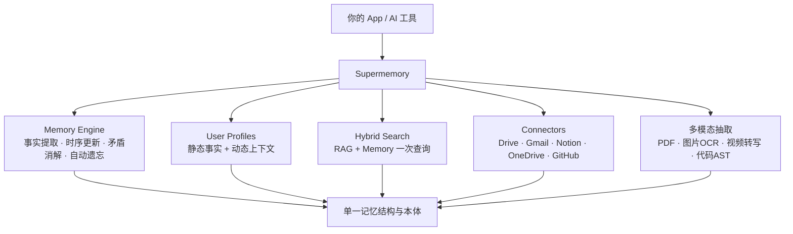

# Supermemory：AI 记忆不是 RAG，是一条独立的上下文通路

AI 对话的失忆不是"存不下"，而是存下来的东西和"该给模型看什么"没对上。Supermemory 把这个问题拆成了两条不同的通路：RAG 负责检索知识库里的文档块，Memory 负责追踪每个用户的事实，两条通路各管各的，再合并成一次查询返回给模型。

这个区分是理解它的关键。RAG 检索出来的东西是无状态的——同一个问题，对所有人返回一样的结果。而记忆要处理的是会变的事实："我住纽约"和"我刚搬到旧金山"是矛盾的，RAG 不会发现，记忆层必须处理。Supermemory 的价值不在存得多，而在它把"这个人是谁"从"库里有什么"里单独拆出来维护。

## 一、项目坐标

| 项目 | 现状（GitHub API 2026-08-07 核验） |
|---|---|
| 仓库 | [supermemoryai/supermemory](https://github.com/supermemoryai/supermemory) |
| Stars | 28,694 |
| Forks | 2,497 |
| 主语言 | TypeScript |
| 开源协议 | MIT |
| 默认分支 | main |
| 定位 | 记忆与上下文引擎 + App，可本地完整运行 |
| 文档 | supermemory.ai/docs |

技术栈里值得注意的一点：它部署在 Cloudflare Workers / Pages / KV 上，用 Postgres + Drizzle，前端是 Remix + Vite + Tailwind。也就是说，这套"记忆引擎"不是又一家向量数据库，而是一个跑在边缘计算上的应用服务。

## 二、系统地图

README 把产品能力写成了五块，其实都汇进同一套记忆结构：


```mermaid
graph TB
    App["你的 App / AI 工具"] --> SM["Supermemory"]

    SM --> Memory["Memory Engine<br/>事实提取 · 时序更新 · 矛盾消解 · 自动遗忘"]
    SM --> Profile["User Profiles<br/>静态事实 + 动态上下文"]
    SM --> Search["Hybrid Search<br/>RAG + Memory 一次查询"]
    SM --> Conn["Connectors<br/>Drive · Gmail · Notion · OneDrive · GitHub"]
    SM --> Extract["多模态抽取<br/>PDF · 图片OCR · 视频转写 · 代码AST"]

    Memory --> Ontology["单一记忆结构与本体"]
    Profile --> Ontology
    Search --> Ontology
    Conn --> Ontology
    Extract --> Ontology
```

各块职责：

| 块 | 做什么 |
|---|---|
| Memory Engine | 从对话里抽事实，跟踪变化，消解矛盾，自动遗忘过期信息 |
| User Profiles | 维护静态事实 + 近期活动，一次调用约 50ms |
| Hybrid Search | RAG + Memory 合并成单次查询 |
| Connectors | 实时同步外部数据源，走 webhook |
| 多模态抽取 | PDF、图片（OCR）、视频（转写）、代码（AST 感知分块） |

## 三、核心区分：Memory 和 RAG 不是一回事

README 用一句话说清楚了官方立场：**Memory 不是 RAG**。

RAG 检索的是文档块，结果无状态，对所有人一样。Memory 提取并追踪的是关于用户的**事实**，它要理解"我刚搬到旧金山"压过了"我住纽约"。Supermemory 默认把两者跑在一起，所以每次查询既有知识库召回，又有个性化上下文。

这解释了为什么它把自己定位成"上下文引擎"而不是"向量数据库"。它交付的不是一个检索接口，而是一套持续维护的用户状态。

## 四、三个核心机制

### 4.1 Memory Engine：事实的增删改

从对话里抽事实只是第一步。真正要处理的是事实随时间变化的三件事：

- **更新**：同一事实有了新版本，旧版本要覆盖。
- **矛盾**：前后说法冲突时，要能判断哪个生效。
- **遗忘**：临时事实（"明天有考试"）日期过了就过期，噪声不会变成永久记忆。

这三件事是 RAG 完全不管的，也是记忆层存在的理由。

### 4.2 User Profiles：一次调用拿画像

传统记忆靠搜索——你得先知道要问什么，才能召回。Supermemory 反过来，为每个用户自动维护一份画像，一次调用几十毫秒返回：

```typescript
const { profile } = await client.profile({ containerTag: "user_123" });

// profile.static  → ["Acme 高级工程师", "喜欢深色模式", "使用 Vim"]
// profile.dynamic → ["在做 auth 迁移", "调试 rate limits"]
```

静态事实是长期不变的，动态上下文是最近在忙的事。把这份结果拼进系统提示词，模型就大概知道自己在跟谁说话。

### 4.3 Hybrid Search：把两条通路接成一次查询

```typescript
// 混合搜索（默认）：一次查询同时返回知识库文档 + 个性化记忆
const results = await client.search({
  q: "如何部署？",
  containerTag: "user_123",
  searchMode: "hybrid",
});

// 只看记忆
const results = await client.search({
  q: "用户偏好",
  containerTag: "user_123",
  searchMode: "memories",
});
```

`containerTag` 是作用域，用来把工作记忆和个人记忆分开，也可以按客户、按仓库组织。

## 五、一次对话怎么流过系统

把上面的机制串起来看一次真实交互：

```text
第 1 次对话
用户：我最近在做电商平台的支付系统，后端用 Go
  → add()：抽事实「支付系统」+「Go 后端」入库

第 2 次对话（第二天）
用户：帮我设计支付模块的 API 接口
  → profile()：拿静态事实「支付系统、Go」
  → 拼进系统提示词，模型直接基于 Go 上下文回答
```

模型不需要 read 历史全文，靠画像就能接上上下文。这也是官方给的两个最核心的调用：`add` 写入，`profile` 读取。

## 六、与框架的接法

官方提供了 drop-in 包装器，覆盖主流 AI 框架：

```typescript
// Vercel AI SDK
import { withSupermemory } from "@supermemory/tools/ai-sdk";
const model = withSupermemory(openai("gpt-4o"), {
  containerTag: "user_123",
  customId: "conv-1",
});

// Mastra
import { withSupermemory } from "@supermemory/tools/mastra";
const agent = new Agent(withSupermemory(config, "user-123", { mode: "full" }));
```

支持的框架清单：Vercel AI SDK、LangChain、LangGraph、OpenAI Agents SDK、Mastra、Agno、Claude Memory Tool、n8n。

对终端用户，Supermemory 还提供了一套 MCP Server，AI 助手装上后能直接获得记忆能力。支持的客户端包括 Claude Desktop、Cursor、Windsurf、VS Code、Claude Code、OpenCode、OpenClaw、Hermes。MCP 工具主要三个：`memory`（存/忘信息）、`recall`（按查询搜记忆并附带画像摘要）、`context`（在对话开头注入完整画像，Cursor 和 Claude Code 里直接敲 `/context`）。

MCP 配置：

```json
{
  "mcpServers": {
    "supermemory": {
      "url": "https://mcp.supermemory.ai/mcp"
    }
  }
}
```

## 七、自托管：一个二进制跑全套

除了托管平台，README 提供了一条本地路线：

```bash
curl -fsSL https://supermemory.ai/install | bash
# 或
npx supermemory local
```

首次启动会初始化内嵌的记忆图引擎、本地 embedding 和凭据，然后打印 API key。完整记忆 API 跑在 `http://localhost:6767`，客户端只需改一个 `baseURL` 就能从云端切到本地：

```typescript
const client = new Supermemory({
  apiKey: "sm_...",
  baseURL: "http://localhost:6767",
});
```

- 模型随便带：OpenAI、Anthropic、Gemini、Groq，或任何 OpenAI 兼容端点。
- 本地 embedding 默认 `Xenova/bge-base-en-v1.5`，不需要 API key。
- 想完全离线就指向 Ollama（README 说 `gpt-oss:20b` 效果不错），数据不离开机器。
- 所有数据在 `./.supermemory` 目录里，方便备份和迁移。

## 八、benchmark 解读

官方给的三张 benchmark 表：

| 基准 | 测什么 | 结果 |
|---|---|---|
| LongMemEval | 跨会话的长期记忆 + 知识更新 | #1 |
| LoCoMo | 长对话里的事实召回（单跳 / 多跳 / 时序 / 对抗） | #1 |
| ConvoMem | 个性化和偏好学习 | #1 |

在 LongMemEval 上，官方给出更细的数字：**95% Recall@15，只增加约 720 token 上下文，即 99.4% 的上下文缩减**（@10 是 99.6%，@5 是 99.8%）。按类别拆：知识更新 99%、助手召回 100%、用户召回 97%、多会话 93%、时序推理 91%、偏好 90%。

读这些数字前先分清测的是什么：**测的是记忆召回准确性，不是你的业务效果**。它能说明在"从长对话里准确找回用户事实"这件事上，Supermemory 的分数领先；它不能推出你的应用场景里答案质量一定更高，也不能推出它在高并发下跟得上——那需要你拿自己的数据跑一遍。

官方也提供了 MemoryBench，一个开源的、可复现的基准框架，用来横向比较各记忆提供方：

```bash
bun run src/index.ts run -p supermemory -b longmemeval -j gpt-4o -r my-run
```

里面对比的提供方包括 Mem0、Zep 等。选型时别只看印象分，用 MemoryBench 在你的数据集上把几家跑一遍更靠谱。

## 九、采用建议

按优先级看哪些场景适合先上：

- **优先采用**：你的 AI 应用需要跨会话记住用户偏好和项目上下文，现在还在用"把历史对话全文塞进 prompt"的笨办法。Memory Engine + User Profiles 能显著减少 token，同时提升回答的个性化。
- **值得评估**：你已经有了 RAG 管道，但知识库检索和用户记忆是两套独立系统，维护成本高。Hybrid Search 把它们合并成一次查询。
- **可以等等**：应用是单轮问答（每次对话独立），或者用户量级很大、对延迟极度敏感。Supermemory 的优势在记忆质量而非极致吞吐，先用 MemoryBench 在自己的数据上跑一轮再看。
- **不要因为 benchmark 分数就定选型**：那些分数测的是记忆准确性，不是你的业务。把 Supermemory、Mem0、Zep 摆在你的数据上比一比再决定。

从哪里开始：装 npm 包，跑通一个 `add()` + `profile()` 的完整回路；用 Claude Code 或 Cursor 的话，装 MCP Server 让 AI 直接获得记忆；把 `profile()` 的结果拼进系统提示词，对比有无记忆时的回答差异；需要接外部数据源时，再配 Connectors。

## 十、结尾

Supermemory 做的事，是在 RAG 之外单独维护了一条关于用户的记忆通路，再把两条通路合并成一次查询。它既是给 AI 应用用的记忆 API，也是一个能本地跑起来的上下文引擎。对想给 AI 接记忆的团队，值得先分清"你要的是文档召回，还是用户事实"，再决定要不要用它。

**文档信息**

- 难度：⭐⭐⭐⭐
- 更新日期：2026-03-31
- GitHub：https://github.com/supermemoryai/supermemory
- 官网：https://supermemory.ai
- 文档：https://supermemory.ai/docs

🦞 由钳岳星君撰写 | 项目源码：https://github.com/supermemoryai/supermemory