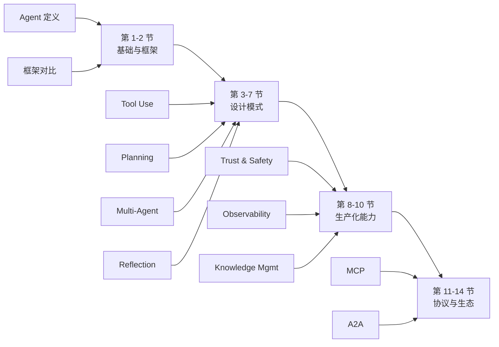
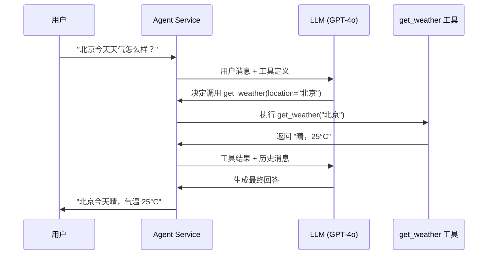

# 微软 AI Agents for Beginners 完全指南：14 节课程从入门到精通

## 目录

- [一、判断：这门课程真正解决什么问题](#一判断这门课程真正解决什么问题)
- [二、课程总览地图](#二课程总览地图)
- [三、AI Agent 核心概念：与传统 LLM 应用的根本区别](#三ai-agent-核心概念与传统-llm-应用的根本区别)
- [四、14 节课程内容详解](#四14-节课程内容详解)
- [五、核心架构：Microsoft Agent Framework 与 Azure AI Foundry Agent Service V2](#五核心架构microsoft-agent-framework-与-azure-ai-foundry-agent-service-v2)
- [六、快速上手：环境配置与第一个 Agent](#六快速上手环境配置与第一个-agent)
- [七、开发扩展：基于课程的项目实践](#七开发扩展基于课程的项目实践)
- [八、与微软其他 AI 课程的协同](#八与微软其他-ai-课程的协同)
- [九、采用顺序与适用边界](#九采用顺序与适用边界)
- [自测题](#自测题)
- [进阶路径](#进阶路径)
- [FAQ](#faq)

## 学习目标

完成本文阅读后，你将能够：

- 说清 AI Agent 与传统 LLM 应用的三点本质区别
- 画出微软 AI Agents for Beginners 14 节课程的知识地图
- 用 OpenAI function calling 写出一个可运行的最小 Agent
- 判断自己或团队是否应该投入时间学习这门课程
- 制定一条从课程示例到生产系统的迁移路径

---

## 一、判断：这门课程真正解决什么问题

2025 年 AI Agent 概念泛滥，但多数开发者卡在同一个地方：能跑通 demo，却说不清 Agent 和带 function calling 的 LLM 应用到底差在哪。微软的 [ai-agents-for-beginners](https://github.com/microsoft/ai-agents-for-beginners) 试图填这个坑。它不是又一份 prompt 工程教程，而是一份从设计模式到生产部署的工程地图。

课程仓库收录 57,904 Stars 和 19,892 Forks，MIT 许可证，以 Jupyter Notebook + Python 为载体，基于 Microsoft Agent Framework 和 Azure AI Foundry Agent Service V2。它的价值不在教你怎么调 API，而在帮你建立"Agent 系统该怎么拆"的工程判断。

下面从核心概念、课程内容、架构设计、上手实践四个维度展开。

---

## 二、课程总览地图

14 节课程按主题分为四组，每组解决一个工程问题：

| 主题组 | 节次 | 解决的问题 | 核心产出 |
|--------|------|-----------|---------|
| 基础与框架 | 第 1-2 节 | Agent 是什么？该用哪个框架？ | 框架选型对照表 |
| 设计模式 | 第 3-7 节 | Agent 该怎么组织？ | 四大设计模式代码模板 |
| 生产化能力 | 第 8-10 节 | 怎么让 Agent 安全可控？ | 评估、监控、知识管理方案 |
| 协议与生态 | 第 11-14 节 | 怎么和外部系统打通？ | MCP、A2A 协议实践 |



这张地图回答三个问题：课程按什么逻辑组织（从概念到生产）、各节之间怎么衔接（设计模式是核心，生产化是过渡，协议是扩展）、读者该从哪里切入（按角色选起点，见第九节）。

---

## 三、AI Agent 核心概念：与传统 LLM 应用的根本区别

课程开篇给了一个定义：AI Agent 是能够自主感知环境、做出决策并执行行动的智能系统。这个定义本身不复杂，关键在于它和传统 LLM 应用的三点区别。

### 3.1 自主行动能力（Autonomy）

传统 LLM 应用是响应式的：用户输入文本，模型输出文本，交互到此结束。Agent 多了一层——它能调用外部工具、读写文件、操作数据库、发送网络请求。课程第 3 节"Tool Use Design Pattern"专门讲这一层的设计与实现。

区别不在"能不能调函数"，而在"谁来决定调不调"。传统 function calling 是模型建议、代码执行；Agent 系统里，模型自己判断该不该调、调哪个、调完之后下一步做什么。

### 3.2 目标导向行为（Goal-Directed）

Agent 不是按固定指令执行单一步骤，而是能将复杂目标拆解为多个子任务，并动态规划执行路径。课程第 4 节"Planning Design Pattern"深入探讨了这一模式。

举个例子，"帮我分析这份财报"不是一个单步任务。Agent 需要拆成：读取文档 → 提取关键数据 → 查询行业基准 → 生成对比分析 → 输出报告。每一步的执行结果会影响下一步怎么走。

### 3.3 记忆与上下文管理（Memory & Context）

Agent 具备长期记忆能力（第 13 节"Managing Agentic Memory"），能在多轮交互中保持上下文一致性，并利用历史经验优化后续决策。

记忆不是简单的对话历史拼接。课程区分了短期记忆（当前任务的上下文窗口）和长期记忆（跨会话的知识存储），并给出了对应的实现方式。

下面这段代码展示了一个最小可用的 Agent 闭环：模型感知用户意图 → 决定调用 `get_weather` → 代码执行工具 → 模型根据结果生成回答。把它和"直接调 chat completion"对比，差别就在中间那层"工具调用决策"。

```python
import json
from openai import OpenAI

client = OpenAI()


def get_weather(location: str) -> str:
    """获取指定城市的天气信息"""
    weather_data = {
        "北京": "晴，25°C",
        "上海": "多云，28°C",
        "广州": "雨，30°C",
    }
    return weather_data.get(location, "暂无天气数据")


tools = [
    {
        "type": "function",
        "function": {
            "name": "get_weather",
            "description": "获取指定城市的天气信息",
            "parameters": {
                "type": "object",
                "properties": {
                    "location": {
                        "type": "string",
                        "description": "城市名称，如北京、上海",
                    }
                },
                "required": ["location"],
            },
        },
    }
]


def run_agent(user_input: str) -> str:
    """运行一个最小可用的 Agent：感知 → 规划 → 行动 → 返回"""
    messages = [{"role": "user", "content": user_input}]

    # 第 1 步：模型决定是否调用工具
    response = client.chat.completions.create(
        model="gpt-4o-mini",
        messages=messages,
        tools=tools,
    )
    message = response.choices[0].message

    # 第 2 步：如果模型决定调用工具，执行工具并把结果回传
    if message.tool_calls:
        messages.append(message)
        for tool_call in message.tool_calls:
            args = json.loads(tool_call.function.arguments)
            result = get_weather(**args)
            messages.append({
                "role": "tool",
                "tool_call_id": tool_call.id,
                "content": result,
            })

        # 第 3 步：模型根据工具结果生成最终回答
        final_response = client.chat.completions.create(
            model="gpt-4o-mini",
            messages=messages,
            tools=tools,
        )
        return final_response.choices[0].message.content

    return message.content


if __name__ == "__main__":
    print(run_agent("北京今天天气怎么样？"))
```

---

## 四、14 节课程内容详解

### 4.1 第 1-3 节：基础概念与框架选型

第 1 节回答"Agent 是什么"，第 2 节回答"该用哪个框架"。第 2 节的框架对比是这门课的第一个工程判断点：Microsoft Agent Framework、LangChain、AutoGen、CrewAI 各有适用场景，课程给出了对照表。

第 3 节进入第一个设计模式——Tool Use。这一节是后续所有模式的基础：没有工具调用，Planning 和 Multi-Agent 都无从谈起。

### 4.2 第 4-7 节：四大设计模式

这是课程的核心。四种设计模式解决四类不同问题：

| 设计模式 | 解决的问题 | 典型场景 |
|---------|-----------|---------|
| Tool Use | Agent 需要外部能力 | 查数据库、调 API、执行代码 |
| Planning | 任务需要多步分解 | 写报告、做分析、修 Bug |
| Multi-Agent | 单 Agent 能力不足 | 复杂工作流、角色分工 |
| Reflection | 输出质量需要验证 | 代码审查、文档校对 |

第 3 节（Tool Use）讲工具定义、调用、错误处理，是后续所有模式的基础。Multi-Agent 讲多个 Agent 怎么分工、怎么通信、怎么避免死循环。第 4 节（Planning）讲任务拆解策略，包括 ReAct、Plan-and-Execute 等模式。Reflection 讲让 Agent 检查自己的输出并迭代改进。

### 4.3 第 8-10 节：生产化能力

这三节是从 demo 到生产的分水岭。

Trust & Safety 讲怎么防止 Agent 做危险操作：工具调用前的权限校验、输出内容的安全过滤、对敏感操作的二次确认。

Observability & Evaluation 讲怎么知道 Agent 在干什么、干得怎么样：trace 工具调用链、记录每步决策、建立评估指标。

第 10 节（Knowledge Management）和第 13 节（Managing Agentic Memory）讲 Agent 怎么获取和管理知识：RAG 检索、长期记忆、知识库更新策略。

### 4.4 第 11-14 节：协议与生态

最后四节关注 Agent 怎么和外部系统打通。

Function Calling 深入函数调用的工程细节：参数校验、错误重试、并发调用。Human-in-the-loop 讲怎么在关键节点插入人工审核。第 11 节（MCP）讲 Model Context Protocol，2025 年 Agent 领域最重要的协议标准之一，解决工具定义的标准化问题。A2A 讲 Agent-to-Agent 协议，解决多个 Agent 之间的互操作问题。

---

## 五、核心架构：Microsoft Agent Framework 与 Azure AI Foundry Agent Service V2

### 5.1 Microsoft Agent Framework

Microsoft Agent Framework 是课程的主要载体。它的前身是 Semantic Kernel，2025 年重组后统一到 Agent Framework 名下。框架解决三个工程问题：

1. **工具定义标准化**：用装饰器或类声明定义工具，框架自动处理参数校验和序列化
2. **执行流程编排**：内置 Tool Use、Planning 等模式的实现，不用从零写控制流
3. **状态管理**：维护对话历史、工具调用记录、中间结果

### 5.2 Azure AI Foundry Agent Service V2

Azure AI Foundry Agent Service V2 是课程的云端运行时。它把 Agent 部署、扩展、监控打包成托管服务：

- **托管运行时**：不用自己管服务器，Agent 在 Azure 上运行
- **内置模型路由**：支持 GPT-4o、o3 等多种模型，按需切换
- **企业级安全**：Azure AD 集成、数据加密、合规审计

### 5.3 任务流案例：一次工具调用如何流过系统

用一个具体任务把架构串起来。用户问"北京今天天气怎么样？"，Agent 的处理流程：



这个流程里有三个关键决策点：

1. **模型决策**：LLM 收到用户消息后，判断需要调用工具还是直接回答
2. **工具执行**：Agent Service 接收模型的工具调用请求，执行对应函数
3. **结果整合**：LLM 拿到工具结果后，决定是否需要再调一次工具，还是生成最终回答

整个流程里，Agent Service 承担的是"调度器"角色：它不生成内容，但负责把模型、工具、状态串起来。理解这一点，才能理解为什么 Agent 不是"LLM + function calling"那么简单——多了一层独立的调度逻辑。

---

## 六、快速上手：环境配置与第一个 Agent

### 6.1 环境准备

课程仓库支持完整克隆和稀疏克隆两种方式。完整克隆包含所有翻译和图片资源；稀疏克隆只拉取课程代码和英文文档，节省带宽。

```bash
# 方式 1：完整克隆
git clone https://github.com/microsoft/ai-agents-for-beginners.git
cd ai-agents-for-beginners

# 方式 2：稀疏克隆（跳过翻译目录，节省带宽）
git clone --filter=blob:none --sparse https://github.com/microsoft/ai-agents-for-beginners.git
cd ai-agents-for-beginners
git sparse-checkout set --no-cone '/*' '!translations' '!translated_images'
```

进入 `00-course-setup` 目录，按 README 配置 API 密钥和模型参数。课程同时支持 Azure OpenAI 和 OpenAI 两种后端，二选一即可。

### 6.2 第一个可运行 Agent

如果不想配置 Azure，可以用 OpenAI API 直接跑一个最小 Agent。把第三节的代码保存为 `agent_demo.py`，然后运行：

```bash
# 安装依赖
pip install openai

# 设置 API Key
export OPENAI_API_KEY="sk-your-api-key"

# 运行
python agent_demo.py
```

预期输出：

```text
北京今天晴，气温 25°C。
```

如果想用 Azure AI Foundry Agent Service，课程提供了对应的 Notebook 示例。核心代码如下，需要 Azure 订阅和 AI Project 资源：

```python
import asyncio
from azure.ai.projects import AIProjectClient
from azure.ai.projects.models import FunctionTool, ToolSet
from azure.identity import DefaultAzureCredential


async def main() -> None:
    project_client = AIProjectClient(
        endpoint="https://your-project.services.ai.azure.com/api/projects/your-project",
        credential=DefaultAzureCredential(),
    )

    def get_weather(location: str) -> str:
        """获取指定城市的天气信息"""
        return f"{location} 今天晴，25°C"

    agent = await project_client.agents.create_agent(
        model="gpt-4o-mini",
        name="weather-agent",
        instructions="你是天气助手，使用 get_weather 工具回答问题。",
        toolset=ToolSet([FunctionTool(get_weather)]),
    )

    thread = await project_client.agents.create_thread()
    await project_client.agents.create_message(
        thread_id=thread.id,
        role="user",
        content="北京今天天气怎么样？",
    )

    await project_client.agents.create_and_process_run(
        thread_id=thread.id,
        assistant_id=agent.id,
    )

    messages = await project_client.agents.list_messages(thread_id=thread.id)
    print(messages["data"][0]["content"][0]["text"]["value"])


asyncio.run(main())
```

两种方式的区别：OpenAI 版本自己管理对话状态和工具调用循环；Azure 版本把状态管理和调度交给 Agent Service，代码更短，但依赖 Azure 订阅。

### 6.3 学习路径建议

- **零基础开发者**：从第 1 节开始，按顺序学习，重点关注第 3、4、7 节的设计模式
- **有 LLM 开发经验**：从第 2 节框架对比开始，重点学习 Agent 特有的架构思路
- **产品/架构人员**：重点阅读第 2 节框架对比、第 8 节信任与安全、第 9 节可观测性、第 11 节 MCP 协议

### 6.4 学习资源

- **视频教程**：每节课配有配套视频，可在课程页面直接观看
- **Discord 社区**：微软 Foundry Discord 频道有专门的 Agent 学习讨论区
- **关联课程**：[Generative AI for Beginners](https://aka.ms/genai-beginners)（21 节）、[MCP for Beginners](https://github.com/microsoft/mcp-for-beginners)

---

## 七、开发扩展：基于课程的项目实践

### 7.1 从课程示例到生产系统

课程 `code_samples` 目录提供了可直接运行的示例代码。以 Tool Use 为例，可以扩展为三类生产场景：

**企业内部知识问答 Agent**：基于私有文档库构建，支持自然语言查询、自动摘要和相关文档推荐。核心是 Tool Use + RAG 的组合。

**自动化测试 Agent**：理解测试需求 → 编写测试代码 → 执行测试用例 → 生成测试报告。核心是 Planning + Tool Use 的组合。

**代码审查 Agent**：集成代码分析工具，自动进行代码质量检查、安全漏洞扫描和性能优化建议。核心是 Multi-Agent + Reflection 的组合。

### 7.2 与 MCP 协议的结合

课程第 11 节详细介绍 MCP（Model Context Protocol）。基于课程学到的 Agent 设计理念，可以快速迁移到 MCP 架构：

- 将工具定义迁移到 MCP Resource 和 Tool 格式
- 使用 MCP 协议进行跨服务通信
- 利用 MCP 的服务发现机制构建动态 Agent 工具链

MCP 的价值在于标准化：不同框架（Microsoft Agent Framework、LangChain、Claude）都能接入同一套工具定义，避免锁定。

### 7.3 社区贡献

课程仓库接受社区贡献，包括新增代码示例、改进文档翻译、修复 Bug、提出新章节建议。所有贡献需要签署 CLA（Contributor License Agreement），流程见仓库 CONTRIBUTING 文档。

---

## 八、与微软其他 AI 课程的协同

微软构建了一套 AI 学习课程体系，AI Agents for Beginners 是其中一环：

| 课程 | 定位 | 难度 |
|------|------|------|
| Generative AI for Beginners | GenAI 基础概念 | ⭐ |
| AI for Beginners | AI 核心概念 | ⭐ |
| AI Agents for Beginners | Agent 系统开发 | ⭐⭐ |
| MCP for Beginners | Agent 协议标准 | ⭐⭐ |
| LangChain for Beginners | Agent 开发框架 | ⭐⭐ |
| AZD for Beginners | Azure 开发部署 | ⭐⭐⭐ |

从 GenAI 基础到 Agent 进阶，再到生产部署，这套体系覆盖了 AI 开发者从入门到精通的路径。建议先学 Generative AI for Beginners 建立基础，再进入本课程。

---

## 九、采用顺序与适用边界

### 谁应该现在就学

- **有 Azure 订阅的团队**：课程直接对接 Azure AI Foundry，学完能立刻上手
- **想系统理解 Agent 架构的开发者**：课程的设计模式部分是同类资源里最完整的
- **正在选型 Agent 框架的技术负责人**：第 2 节框架对比能省掉大量调研时间

### 谁可以等等

- **只用 LangChain 且不打算换的团队**：课程的框架对比仍有参考价值，但代码示例需要自己迁移
- **没有 Azure 订阅的个人开发者**：可以用 OpenAI API 跑通大部分示例，但 Azure AI Foundry 相关章节无法实操
- **刚接触 LLM 的新手**：建议先学 Generative AI for Beginners，再进入本课程

### 从哪里开始

1. 先读第 1-2 节，建立 Agent 概念和框架认知
2. 跑通第 3 节的 Tool Use 示例，确认环境没问题
3. 按需跳到第 4-7 节的设计模式，选一个和当前工作相关的深入
4. 上生产前必读第 8-10 节的安全、可观测性和知识管理
5. 第 11-14 节按需选学，MCP 优先级最高

---

## 自测题

1. **Agent 和带 function calling 的 LLM 应用，本质区别是什么？**
   答：在于"谁来决定调不调"。function calling 是模型建议、代码执行；Agent 系统里，模型自己判断该不该调、调哪个、调完之后下一步做什么，存在独立的调度层。

2. **课程的四大设计模式分别解决什么问题？**
   答：Tool Use 解决外部能力调用，Planning 解决多步任务分解，Multi-Agent 解决单 Agent 能力不足，Reflection 解决输出质量验证。

3. **Microsoft Agent Framework 和 Azure AI Foundry Agent Service V2 的分工是什么？**
   答：Framework 是 SDK，负责工具定义和执行流程编排；Agent Service 是托管运行时，负责部署、扩展、监控。

4. **MCP 协议解决什么问题？**
   答：工具定义的标准化。不同框架都能接入同一套工具定义，避免锁定。

5. **课程里哪一节是生产化的分水岭？**
   答：第 8-10 节。Trust & Safety、Observability、Knowledge Management 三节决定了 Agent 能不能从 demo 走到生产。

---

## 进阶路径

- **想深入 MCP 协议**：学 [MCP for Beginners](https://github.com/microsoft/mcp-for-beginners)
- **想深入多 Agent 系统**：研究 AutoGen 和 CrewAI 的官方文档
- **想深入 Agent 评估**：读 Azure AI Foundry 的 evaluation 文档
- **想深入生产部署**：学 [AZD for Beginners](https://github.com/Azure-Samples/azure-dev)，掌握 Azure 开发部署流程

---

## FAQ

**Q：课程需要 Azure 订阅吗？**
A：不是必须的。大部分示例可以用 OpenAI API 跑通，但 Azure AI Foundry Agent Service 相关的章节需要 Azure 订阅才能实操。

**Q：课程用什么编程语言？**
A：Python，以 Jupyter Notebook 为载体。需要基本的 Python 语法和 pip 包管理能力。

**Q：课程会讲 LangChain 吗？**
A：第 2 节会对比 LangChain 和 Microsoft Agent Framework，但代码示例以 Microsoft Agent Framework 为主。想深入 LangChain 可以看 [LangChain for Beginners](https://github.com/gkamradt/langchaincourse)。

**Q：课程更新频率如何？**
A：微软保持季度更新，跟进新的模型和协议。截至 2026 年 4 月，仓库最新更新于 2026-04-11。

**Q：学完课程能直接上生产吗？**
A：不能。课程覆盖了从概念到生产的关键知识点，但生产部署还需要自己补日志、监控、容错、成本控制等工程能力。课程第 8-10 节是切入点。

---

## 结语

[microsoft/ai-agents-for-beginners](https://github.com/microsoft/ai-agents-for-beginners) 的价值不在 14 节课本身，而在它把 Agent 系统的工程问题拆得足够清楚：设计模式、生产化、协议标准，每一层都有对应的章节和代码。如果你正在学习 AI Agent，或者计划将 Agent 能力引入产品，这份课程值得投入时间。

课程仓库：[microsoft/ai-agents-for-beginners](https://github.com/microsoft/ai-agents-for-beginners) | 许可证：MIT
