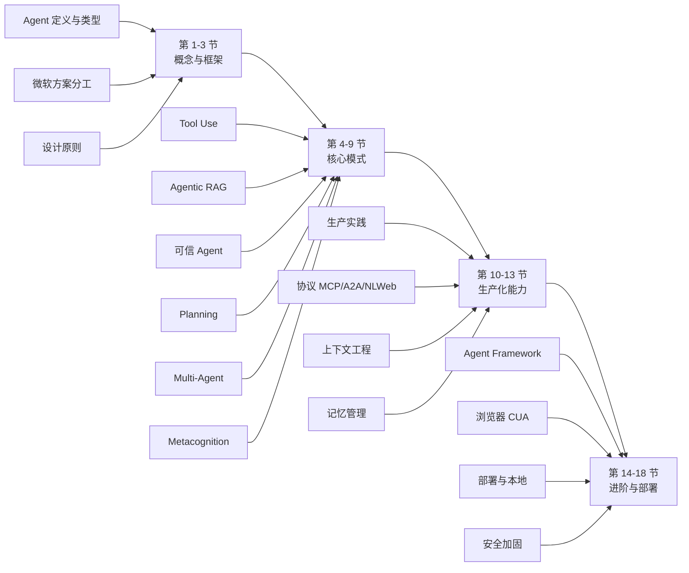
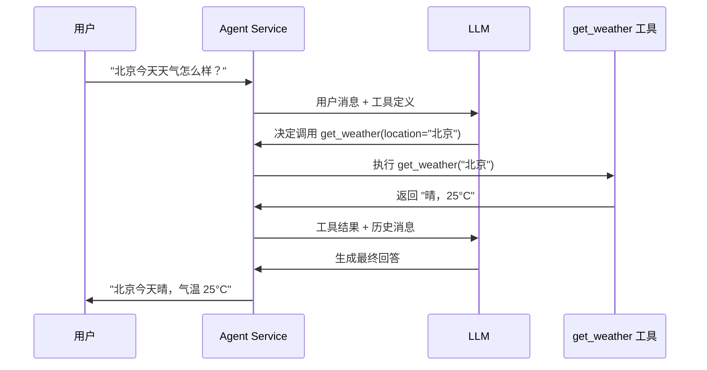

# 微软 AI Agents for Beginners 完全指南：18 节课程从入门到精通

2025 年 AI Agent 概念泛滥，多数开发者卡在同一个地方：能跑通 demo，却说不清 Agent 和带 function calling 的 LLM 应用到底差在哪。微软的 [ai-agents-for-beginners](https://github.com/microsoft/ai-agents-for-beginners) 试图填这个坑——一份从设计模式到生产部署的工程地图，共 18 节课，MIT 许可证，以 Jupyter Notebook + Python 为载体，代码基于 Microsoft Agent Framework（MAF）与 Microsoft Foundry Agent Service V2。

这门课改版很勤：前 13 节配有视频，代码示例已全面迁移到 Microsoft Agent Framework。本文描述的是 2026 年 9 月的仓库状态，框架与服务命名以仓库当前 README 为准。

本文拆解这套课程的核心内容、架构设计和上手路径；要不要投入时间，第八节给了采用建议。

## 目录

- [一、课程总览地图](#一课程总览地图)
- [二、AI Agent 核心概念：与传统 LLM 应用的根本区别](#二ai-agent-核心概念与传统-llm-应用的根本区别)
- [三、18 节课程内容详解](#三18-节课程内容详解)
- [四、核心架构：Microsoft Agent Framework 与 Microsoft Foundry Agent Service V2](#四核心架构microsoft-agent-framework-与-microsoft-foundry-agent-service-v2)
- [五、快速上手：环境配置与第一个 Agent](#五快速上手环境配置与第一个-agent)
- [六、开发扩展：基于课程的项目实践](#六开发扩展基于课程的项目实践)
- [七、与微软其他 AI 课程的协同](#七与微软其他-ai-课程的协同)
- [八、采用顺序与适用边界](#八采用顺序与适用边界)
- [九、自测题](#九自测题)
- [十、动手练习](#十动手练习)
- [十一、进阶路径](#十一进阶路径)
- [十二、FAQ](#十二faq)
- [十三、结语](#十三结语)

---

## 一、课程总览地图

18 节课按主题分为四组，每组解决一个工程问题：

| 主题组 | 节次 | 解决的问题 | 核心产出 |
|--------|------|-----------|---------|
| 概念与框架 | 第 1-3 节 | Agent 是什么？微软的两个方案怎么分工？ | Agent 定义与类型、方案选型、设计原则 |
| 核心模式 | 第 4-9 节 | Agent 该怎么组织？ | 五大设计模式与可信 Agent 的代码模板 |
| 生产化能力 | 第 10-13 节 | 怎么让 Agent 安全可控、可观测？ | 生产、协议、上下文与记忆方案 |
| 进阶与部署 | 第 14-18 节 | 怎么落地到具体平台与生产？ | 框架实战、浏览器、容器与安全 |


```mermaid
graph LR
    A["第 1-3 节<br/>概念与框架"] --> B["第 4-9 节<br/>核心模式"]
    B --> C["第 10-13 节<br/>生产化能力"]
    C --> D["第 14-18 节<br/>进阶与部署"]

    A1["Agent 定义与类型"] --> A
    A2["微软方案分工"] --> A
    A3["设计原则"] --> A

    B1["Tool Use"] --> B
    B2["Agentic RAG"] --> B
    B3["可信 Agent"] --> B
    B4["Planning"] --> B
    B5["Multi-Agent"] --> B
    B6["Metacognition"] --> B

    C1["生产实践"] --> C
    C2["协议 MCP/A2A/NLWeb"] --> C
    C3["上下文工程"] --> C
    C4["记忆管理"] --> C

    D1["Agent Framework"] --> D
    D2["浏览器 CUA"] --> D
    D3["部署与本地"] --> D
    D4["安全加固"] --> D
```

课程按"从概念到生产"的逻辑组织：设计模式是核心，生产化是过渡，协议与部署是扩展。读者按角色选起点（见第八节）。

---

## 二、AI Agent 核心概念：与传统 LLM 应用的根本区别

课程第 1 节给的定义很直接：AI Agent 是让 LLM 真正做事的系统——给 LLM 工具和知识去作用于世界，而不只是回应 prompt。课程把 Agent 拆成三个组成部分：环境（Agent 所处的空间，比如订票平台）、感知器（读取环境状态的方式，比如查酒店房态）、执行器（采取行动的方式，比如下单订房）。LLM 在这个系统里是推理引擎，负责把模糊的用户请求变成具体的行动计划。

这个定义本身不复杂，关键在于它和传统 LLM 应用的三点区别。

### 2.1 自主行动能力（Autonomy）

传统 LLM 应用是响应式的：用户输入文本，模型输出文本，交互到此结束。Agent 多了一层——它能调用外部工具、读写文件、操作数据库、发送网络请求。

区别不在"能不能调函数"，而在"谁来决定调不调"。传统 function calling 是模型建议、代码执行；Agent 系统里，模型自己判断该不该调、调哪个、调完之后下一步做什么。

### 2.2 目标导向行为（Goal-Directed）

Agent 能将复杂目标拆解为多个子任务，并动态规划执行路径，区别于按固定指令执行单一步骤的传统程序。

举个例子，"帮我分析这份财报"不是一个单步任务。Agent 需要拆成：读取文档 → 提取关键数据 → 查询行业基准 → 生成对比分析 → 输出报告。每一步的执行结果会影响下一步怎么走。

第 1 节还按能力把 Agent 分成五类，从简单到复杂：简单反射型（硬编码规则，无记忆无规划）、基于模型的反射型（维护内部世界模型）、目标型（围绕目标逐步规划）、效用型（在多个方案里权衡最优）、学习型（从反馈中持续改进）。这个分类给后面的设计模式提供了坐标系——你不必每个 Agent 都上多 Agent 编排，很多场景一个目标型 Agent 就够了。

### 2.3 记忆与上下文管理（Memory & Context）

课程把记忆拆成两层：短期记忆对应当前对话的上下文，长期记忆对应外部知识存储（客户数据库、历史交互记录），两层各有对应的实现方式，远超对话历史的简单拼接。第 13 节会专门展开取舍和持久化策略。

下面这段代码展示了一个最小可用的 Agent 闭环。先说明：课程示例已经不这样写了（课程用第四节的 Microsoft Agent Framework），这段是通用的 OpenAI SDK 写法，用来把工具调用的机制看清楚。理解它的关键是四步演进：第一步是最简 chat completion，只传 `messages`，模型直接返回文本；第二步加上 `tools` 参数，模型有机会建议调用工具；第三步是工具执行，代码层把模型建议的函数真正跑一遍；第四步是结果回传，把工具输出塞回 `messages` 再请求一次，模型据此生成最终回答。差别就在中间那层"工具调用决策"。

```python
import json
from openai import OpenAI

client = OpenAI()

def get_weather(location: str) -> str:
    """获取指定城市的天气信息"""
    weather_data = {
        "北京": "晴，25°C",
        "上海": "多云，28°C",
        "广州": "雨，30°C",
    }
    return weather_data.get(location, "暂无天气数据")

tools = [
    {
        "type": "function",
        "function": {
            "name": "get_weather",
            "description": "获取指定城市的天气信息",
            "parameters": {
                "type": "object",
                "properties": {
                    "location": {
                        "type": "string",
                        "description": "城市名称，如北京、上海",
                    },
                },
                "required": ["location"],
            },
        },
    }
]

def run_agent(user_input: str) -> str:
    """运行一个最小可用的 Agent：感知 → 规划 → 行动 → 返回"""
    messages = [{"role": "user", "content": user_input}]

    # 第 1 步：模型决定是否调用工具（最简 chat completion 只到这一步就返回）
    response = client.chat.completions.create(
        model="gpt-4o-mini",
        messages=messages,
        tools=tools,
    )
    message = response.choices[0].message

    # 第 2 步：如果模型决定调用工具，执行工具并把结果回传
    if message.tool_calls:
        messages.append(message)
        for tool_call in message.tool_calls:
            args = json.loads(tool_call.function.arguments)
            result = get_weather(**args)
            messages.append({
                "role": "tool",
                "tool_call_id": tool_call.id,
                "content": result,
            })

        # 第 3 步：模型根据工具结果生成最终回答
        final_response = client.chat.completions.create(
            model="gpt-4o-mini",
            messages=messages,
            tools=tools,
        )
        return final_response.choices[0].message.content

    return message.content

if __name__ == "__main__":
    print(run_agent("北京今天天气怎么样？"))
```

---

## 三、18 节课程内容详解

### 3.1 第 1-3 节：基础概念与框架

第 1 节回答"Agent 是什么"，除定义和三组件外，还给出五类 Agent 的分类和典型用例。第 2 节回答"微软的两个方案怎么分工"——对比 Microsoft Agent Framework 和 Microsoft Foundry Agent Service：前者是构建 Agent 的 SDK，后者是托管部署平台。官方建议是先用 Agent Framework 构建和迭代，等需要部署扩展时再上 Agent Service。第 3 节讲 Agentic 设计原则（Agent Space、Agent Time、Agent Core 三个视角），并用一个旅行订票 Agent 贯穿演示。

### 3.2 第 4-9 节：核心设计模式

这是课程的主体。主要模式覆盖 Tool Use、Agentic RAG、Planning、Multi-Agent 与 Metacognition，第 6 节从信任与安全角度约束 Agent 的行为边界：

| 设计模式 | 解决的问题 | 典型场景 |
|---------|-----------|---------|
| Tool Use | Agent 需要外部能力 | 查数据库、调 API、执行代码 |
| Agentic RAG | 从知识库检索并推理 | 私有文档问答、检索增强生成 |
| Planning | 任务需要多步分解 | 写报告、做分析、修 Bug |
| Multi-Agent | 单 Agent 能力不足 | 复杂工作流、角色分工 |
| Metacognition | 输出质量需要验证 | 代码审查、自我反思、文档校对 |

第 4 节（Tool Use）是后续所有模式的地基，讲怎么用 `@tool` 装饰器定义工具——函数的 docstring 和参数的类型注解会被框架自动转成工具 schema，不用手写 JSON Schema；同一节还演示了用 Pydantic 模型拿结构化输出，以及 `approval_mode` 参数控制哪些工具执行前需要人工审批。第 5 节（Agentic RAG）把检索能力接进 Agent，让它能依据私有知识作答；示例默认用内存知识库，可切换到 Azure AI Search。第 6 节（Building Trustworthy AI Agents）讲三件事：用系统消息框架约束 Agent 行为、认识五类威胁（指令操纵、关键系统访问、资源过载、知识库投毒、级联错误）、用 human-in-the-loop 在关键动作前插入人工审批。

第 7 节（Planning）讲任务拆解：把总目标分解成子任务、用结构化输出表达计划、用多 Agent 编排执行、按执行结果迭代调整计划。第 8 节（Multi-Agent）讲多个 Agent 怎么分工与协作，示例用 Bing grounding 给 Agent 补充实时信息。第 9 节（Metacognition）让 Agent 检查自己的输出并迭代改进。

### 3.3 第 10-13 节：生产化能力

这几节是从 demo 到生产的分水岭。第 10 节（AI Agents in Production）讲上线要补齐的工程能力。第 11 节（Using Agentic Protocols）讲三个协议：MCP 用 client-server 架构标准化工具与数据的接入，服务端向外声明 Tools、Resources 等原语，Agent 动态发现可用工具，换模型、换框架不用重写集成；A2A 解决多个 Agent 之间的通信与协作，让不同来源的 Agent 能协同工作；NLWeb 给网站加自然语言接口，让 Agent 能发现并交互网站内容。第 12 节（Context Engineering）讲如何为模型组织更有效的上下文。第 13 节（Managing Agentic Memory）讲短期记忆与长期记忆的取舍和持久化策略。

### 3.4 第 14-18 节：进阶与部署

最后五节落到具体平台与生产。第 14 节深入 Microsoft Agent Framework 的实际用法。第 15 节讲基于浏览器操作的 Agent（Computer Use，CUA）。第 16 节讲可扩展 Agent 的部署，包括小模型、大模型两档的成本感知路由。第 17 节讲如何在本地创建 Agent（Foundry Local）。第 18 节讲 Agent 的安全加固。对多数读者，第 14-15 节优先级最高——平台实战和浏览器场景最快见到产出。

需要说明的是，前 13 节每节配有视频，第 14-18 节目前只有文字和代码。课程还会在具体示例中穿插两类工程能力：参数与输出的类型化描述（类型注解加 Pydantic 模型），以及人工审批（`approval_mode` 控制敏感工具的执行门槛），它们是协议落地时配套的工程能力。

---

## 四、核心架构：Microsoft Agent Framework 与 Microsoft Foundry Agent Service V2

### 4.1 Microsoft Agent Framework

Microsoft Agent Framework 是课程的主要载体。按官方说法，它是 Semantic Kernel 与 AutoGen 的直接继任者——由同一个团队打造，合并了 AutoGen 简洁的 Agent 抽象和 Semantic Kernel 的企业级特性（会话状态管理、类型安全、中间件、遥测），在此之上新增了基于图的工作流，让多 Agent 的执行路径可以被显式编排。Semantic Kernel 和 AutoGen 仍在独立维护，官方提供了两条迁移指南，存量项目有路可走。

框架覆盖四大板块：Agents（单个 Agent 的构建与工具调用）、Workflows（函数与 Agent 的显式编排）、Integrations（模型、服务、工具、评测等生态接入），以及面向长任务的 Harness Agent（内置规划、上下文压缩、记忆和审批）。支持 Python、.NET 和 Go 三种语言，其中 Go 处于公开预览阶段。

框架解决的第一个工程问题是工具定义标准化：用 `@tool` 装饰器声明函数，docstring 和类型注解自动生成工具 schema，省掉手写 JSON Schema 的工作量。第二个是执行流程编排，内置 Tool Use、多 Agent 编排等模式的实现，避免从零写控制流。第三个是状态管理，框架维护对话历史、工具调用记录和中间结果，开发者不用自己拼消息列表。

### 4.2 Microsoft Foundry Agent Service V2

Microsoft Foundry Agent Service V2 是课程的云端运行时。它把 Agent 部署、扩展、监控打包成托管服务：

- **托管运行时**：不用自己管服务器，Agent 在 Azure 上运行
- **模型按部署名调用**：Foundry 项目里部署什么模型就调什么（课程示例用 gpt-5-mini），第 16 节还演示了小模型、大模型两档的成本感知路由
- **企业级安全**：Microsoft Entra ID 身份集成；课程大部分 Notebook 用 `az login` 会话做无密钥认证（`AzureCliCredential` / `DefaultAzureCredential`），`.env` 文件里不需要放 API 密钥，少数课和可选集成才用密钥

### 4.3 任务流案例：一次工具调用如何流过系统

用一个具体任务把架构串起来。用户问"北京今天天气怎么样？"，Agent 的处理流程：


```mermaid
sequenceDiagram
    participant U as 用户
    participant A as Agent Service
    participant M as LLM
    participant T as get_weather 工具

    U->>A: "北京今天天气怎么样？"
    A->>M: 用户消息 + 工具定义
    M->>A: 决定调用 get_weather(location="北京")
    A->>T: 执行 get_weather("北京")
    T->>A: 返回 "晴，25°C"
    A->>M: 工具结果 + 历史消息
    M->>A: 生成最终回答
    A->>U: "北京今天晴，气温 25°C"
```

这个流程里有三个关键决策点。模型决策环节，LLM 收到用户消息后判断需要调用工具还是直接回答。工具执行环节，Agent Service 接收模型的工具调用请求，执行对应函数。结果整合环节，LLM 拿到工具结果后决定是否再调一次工具，还是生成最终回答。

整个流程里，Agent Service 承担"调度器"角色，负责把模型、工具、状态串起来，内容生成交给 LLM。这层独立的调度逻辑，就是 Agent 和"LLM + function calling"的分界。

---

## 五、快速上手：环境配置与第一个 Agent

### 5.1 环境准备

课程仓库支持完整克隆和稀疏克隆两种方式。完整克隆包含所有翻译和图片资源；稀疏克隆只拉取课程代码和英文文档，节省带宽。

```bash
# 方式 1：完整克隆
git clone https://github.com/microsoft/ai-agents-for-beginners.git
cd ai-agents-for-beginners

# 方式 2：稀疏克隆（跳过翻译目录，节省带宽）
git clone --filter=blob:none --sparse https://github.com/microsoft/ai-agents-for-beginners.git
cd ai-agents-for-beginners
git sparse-checkout set --no-cone '/*' '!translations' '!translated_images'
```

课程要求 Python 3.12+。主路径需要 Azure 订阅和一个 Microsoft Foundry 项目（里面部署好模型），配置步骤：

```bash
# 1. 创建虚拟环境并安装依赖（仓库根目录执行）
python3.12 -m venv venv
source venv/bin/activate
pip install -r requirements.txt

# 2. 配置环境变量：复制样例文件，填入两个值
cp .env.example .env
#   AZURE_AI_PROJECT_ENDPOINT       Foundry 项目的端点
#   AZURE_AI_MODEL_DEPLOYMENT_NAME  部署的模型名（如 gpt-5-mini）

# 3. 登录 Azure（课程用 az login 会话做无密钥认证）
az login
```

不是所有课都要 Foundry。部分课支持直连 Azure OpenAI（Responses API）；MiniMax（MiniMax-M3，上下文最长 204K tokens）、Novita AI 等 OpenAI 兼容服务商可以替代跑一部分示例，具体看每节课的前置条件说明。

### 5.2 第一个可运行 Agent

如果暂时不想配 Azure，可以用 OpenAI API 直接跑一个最小 Agent，验证工具调用闭环。把第二节的代码保存为 `agent_demo.py`，然后运行：

```bash
# 安装依赖
pip install openai

# 设置 API Key
export OPENAI_API_KEY="sk-your-api-key"

# 运行
python agent_demo.py
```

预期输出：

```text
北京今天晴，气温 25°C。
```

要走课程的主路径（Microsoft Foundry Agent Service），用的是 Microsoft Agent Framework 的写法。下面是课程示例的代码形态（源自第 2、4 节的 Notebook），需要先完成 5.1 的环境配置：

```python
import asyncio
import os

from agent_framework import tool
from agent_framework.foundry import FoundryChatClient
from azure.identity import DefaultAzureCredential
from typing import Annotated

@tool(approval_mode="never_require")
def get_weather(
    location: Annotated[str, "城市名称，如北京、上海"],
) -> str:
    """获取指定城市的天气信息"""
    weather_data = {
        "北京": "晴，25°C",
        "上海": "多云，28°C",
        "广州": "雨，30°C",
    }
    return weather_data.get(location, "暂无天气数据")

async def main() -> None:
    client = FoundryChatClient(
        project_endpoint=os.environ["AZURE_AI_PROJECT_ENDPOINT"],
        model=os.environ["AZURE_AI_MODEL_DEPLOYMENT_NAME"],
        credential=DefaultAzureCredential(),
    )

    agent = client.as_agent(
        name="weather-agent",
        instructions="你是天气助手，使用 get_weather 工具回答问题。",
        tools=[get_weather],
    )

    response = await agent.run("北京今天天气怎么样？")
    print(response)

asyncio.run(main())
```

两种方式的区别：OpenAI 版本自己管理对话状态和工具调用循环；MAF 版本把这些交给框架——`@tool` 声明工具，`as_agent` 组装 Agent，`agent.run` 一次调用跑完整个"模型决策 → 工具执行 → 结果整合"循环。代价是依赖 Azure 订阅和 Foundry 项目。

### 5.3 学习路径建议

- **零基础开发者**：从第 1 节开始按顺序学习，第 1-6 节是官方建议的入门顺序，重点关注第 3、4、7 节
- **有 LLM 开发经验**：从第 2 节微软方案分工开始，重点学习 Agent 特有的架构思路
- **产品/架构人员**：重点阅读第 2 节方案分工、第 6 节可信 Agent、第 10 节生产、第 11 节协议（MCP）

### 5.4 学习资源

- **视频教程**：前 13 节配有配套视频，可在课程页面直接观看
- **学习指南**：仓库根目录的 STUDY_GUIDE.md，官方建议带着一个具体的 demo 想法学会程，每学完一节问自己"我的 Agent 现在多会了什么"
- **Discord 社区**：Microsoft Foundry Discord 有专门的 [AI Agents 学习频道](https://aka.ms/ai-agents/discord)，可提问、参加 office hours
- **关联课程**：[Generative AI for Beginners](https://aka.ms/genai-beginners)（21 节）、[MCP for Beginners](https://github.com/microsoft/mcp-for-beginners)

---

## 六、开发扩展：基于课程的项目实践

### 6.1 从课程示例到生产系统

每节课目录下的 `code_samples` 子目录提供可直接运行的示例，Python Notebook 统一命名为 `*-python-agent-framework.ipynb`，部分课附带 .NET 版本。以第 4 节的 Tool Use 为例，可以扩展为三类生产场景：

- **企业内部知识问答 Agent**：基于私有文档库构建，支持自然语言查询、自动摘要和相关文档推荐。核心是 Tool Use + RAG 的组合。
- **自动化测试 Agent**：理解测试需求 → 编写测试代码 → 执行测试用例 → 生成测试报告。核心是 Planning + Tool Use 的组合。
- **代码审查 Agent**：集成代码分析工具，自动进行代码质量检查、安全漏洞扫描和性能优化建议。核心是 Multi-Agent + Metacognition 的组合。

以企业内部知识问答 Agent 为例，最小实现骨架如下，工具层接 RAG 检索：

```python
import json

from openai import OpenAI

client = OpenAI()

def search_knowledge_base(query: str, top_k: int = 3) -> str:
    """从私有文档库检索相关片段，生产环境替换为向量数据库查询"""
    # 这里用 mock 数据演示，生产环境接 Milvus / Qdrant / Azure AI Search
    docs = {
        "报销流程": "员工报销需在 OA 系统提交发票，经直属上级审批后转财务。",
        "年假政策": "入职满一年享 5 天年假，满三年 10 天，满五年 15 天。",
    }
    hits = [v for k, v in docs.items() if k in query]
    return "\n".join(hits[:top_k]) if hits else "未检索到相关文档"

tools = [
    {
        "type": "function",
        "function": {
            "name": "search_knowledge_base",
            "description": "从企业内部知识库检索文档片段",
            "parameters": {
                "type": "object",
                "properties": {
                    "query": {"type": "string", "description": "检索关键词"},
                    "top_k": {"type": "integer", "description": "返回片段数量，默认 3"},
                },
                "required": ["query"],
            },
        },
    }
]

def run_kb_agent(user_input: str) -> str:
    """知识问答 Agent：检索 → 整合 → 回答"""
    messages = [
        {"role": "system", "content": "你是企业知识助手，基于检索到的文档片段回答问题。"},
        {"role": "user", "content": user_input},
    ]
    response = client.chat.completions.create(
        model="gpt-4o-mini", messages=messages, tools=tools
    )
    msg = response.choices[0].message
    if msg.tool_calls:
        messages.append(msg)
        for tc in msg.tool_calls:
            args = json.loads(tc.function.arguments)
            result = search_knowledge_base(**args)
            messages.append({"role": "tool", "tool_call_id": tc.id, "content": result})
        final = client.chat.completions.create(
            model="gpt-4o-mini", messages=messages, tools=tools
        )
        return final.choices[0].message.content
    return msg.content
```

这个骨架和第二节的 `get_weather` 结构一致，区别在于工具层从"查天气"换成了"查知识库"，生产环境把 mock 数据替换成向量数据库查询即可。

### 6.2 与 MCP 协议的结合

课程第 11 节详细讲解 MCP（Model Context Protocol）——一个让应用以标准化方式向 LLM 提供上下文和工具的开放协议。基于课程学到的 Agent 设计理念，可以迁移到 MCP 架构：

- 将工具定义迁移到 MCP 的 Tools 和 Resources 格式
- 使用 MCP 协议进行跨服务通信
- 利用 MCP 的动态工具发现机制构建可插拔的 Agent 工具链

MCP 的价值在于标准化：工具写一次，不同框架、不同模型都能接入同一套 MCP 服务器，避免逐个集成。

### 6.3 社区贡献

课程仓库接受社区贡献，包括新增代码示例、改进文档翻译、修复 Bug、提出新章节建议。所有贡献需要签署 CLA（Contributor License Agreement），流程见仓库 CONTRIBUTING 文档。

---

## 七、与微软其他 AI 课程的协同

微软构建了一套 AI 学习课程体系，AI Agents for Beginners 是其中一环：

| 课程 | 定位 | 难度 |
|------|------|------|
| Generative AI for Beginners | GenAI 基础概念 | ⭐ |
| AI for Beginners | AI 核心概念 | ⭐ |
| AI Agents for Beginners | Agent 系统开发 | ⭐⭐ |
| MCP for Beginners | Agent 协议标准 | ⭐⭐ |
| LangChain for Beginners | Agent 开发框架 | ⭐⭐ |
| AZD for Beginners | Azure 开发部署 | ⭐⭐⭐ |

从 GenAI 基础到 Agent 进阶，再到生产部署，这套体系覆盖了 AI 开发者从入门到精通的路径。建议先学 Generative AI for Beginners 建立基础，再进入本课程。

---

## 八、采用顺序与适用边界

### 谁应该现在就学

- **有 Azure 订阅的团队**：课程直接对接 Microsoft Foundry，学完能立刻上手
- **想系统理解 Agent 架构的开发者**：课程的设计模式部分是同类资源里最完整的
- **正在做微软技术栈选型的技术负责人**：第 2 节把 Agent Framework 和 Agent Service 的分工讲得足够清楚，能省掉大量调研时间

### 谁可以等等

- **用 LangChain、LlamaIndex 等其他框架且不打算换的团队**：课程的设计模式部分仍有参考价值，但代码示例需要自己迁移
- **没有 Azure 订阅的个人开发者**：主路径（Foundry）跑不了，部分示例可以用 MiniMax、Novita AI 等 OpenAI 兼容服务商替代，覆盖面有限
- **刚接触 LLM 的新手**：建议先学 Generative AI for Beginners，再进入本课程

### 从哪里开始

1. 先读第 1-3 节，建立 Agent 概念、微软方案分工与设计原则的认知
2. 跑通第 4 节的 Tool Use 示例，确认环境没问题
3. 按需跳到第 4-9 节的设计模式，选一个和当前工作相关的深入
4. 上生产前必读第 10-13 节的生产、协议、上下文工程与记忆管理
5. 第 11 节（协议）优先级最高，14-18 节按需选学

---

## 九、自测题

先想再对答案，每题折叠了参考答案。

1. **Agent 和带 function calling 的 LLM 应用，本质区别是什么？**

<details>
<summary>参考答案</summary>

在于"谁来决定调不调"。function calling 是模型建议、代码执行；Agent 系统里，模型自己判断该不该调、调哪个、调完之后下一步做什么，存在独立的调度层。

</details>

2. **课程的主要设计模式分别解决什么问题？**

<details>
<summary>参考答案</summary>

Tool Use 解决外部能力调用，Agentic RAG 解决知识检索推理，Planning 解决多步任务分解，Multi-Agent 解决单 Agent 能力不足，Metacognition 解决输出质量验证；第 6 节从安全边界上约束这几种模式的行为。

</details>

3. **Microsoft Agent Framework 和 Microsoft Foundry Agent Service V2 的分工是什么？**

<details>
<summary>参考答案</summary>

Framework 是构建 Agent 的 SDK，负责工具定义、执行编排和状态管理；Agent Service 是托管运行时，负责部署、扩展、监控。官方建议先用 Framework 构建迭代，需要部署扩展时再上 Agent Service。

</details>

4. **MCP 协议解决什么问题？**

<details>
<summary>参考答案</summary>

工具与数据接入的标准化。MCP 服务器向外声明 Tools、Resources 等原语，Agent 动态发现可用工具——工具写一次，不同框架、不同模型都能接入，避免逐个集成。

</details>

5. **课程里哪一节是生产化的分水岭？**

<details>
<summary>参考答案</summary>

第 10-13 节。生产、协议、上下文工程与记忆管理这一组，决定了 Agent 能不能从 demo 走到生产。

</details>

---

## 十、动手练习

把第二节的 `get_weather` 工具改造一下，验证你是否真的理解了工具调用闭环。

**练习目标**：给 `get_weather` 增加 `humidity` 参数（湿度），并让 Agent 在用户问"北京天气和湿度"时同时返回两个信息。

**改造步骤**：

1. 修改 `get_weather` 函数签名，增加 `humidity` 参数，返回值里同时包含天气和湿度
2. 更新 `tools` 列表里的 JSON Schema，把 `humidity` 加进 `properties`，并在 `description` 里说明用途
3. 运行 `run_agent("北京今天天气和湿度怎么样？")`，观察模型是否同时传入了 `location` 和 `humidity`

**验证标准**：

- 模型返回的消息里同时包含天气和湿度信息
- `tool_call.function.arguments` 解析后能看到 `humidity` 字段
- 如果模型只传了 `location` 没传 `humidity`，检查 `description` 是否写清楚了参数含义

<details>
<summary>参考实现</summary>

```python
def get_weather(location: str, humidity: bool = False) -> str:
    """获取指定城市的天气信息，humidity 为 True 时同时返回湿度"""
    weather_data = {
        "北京": "晴，25°C",
        "上海": "多云，28°C",
        "广州": "雨，30°C",
    }
    humidity_data = {
        "北京": "湿度 40%",
        "上海": "湿度 65%",
        "广州": "湿度 85%",
    }
    result = weather_data.get(location, "暂无天气数据")
    if humidity:
        result += "，" + humidity_data.get(location, "暂无湿度数据")
    return result

tools = [
    {
        "type": "function",
        "function": {
            "name": "get_weather",
            "description": "获取指定城市的天气信息，可通过 humidity 参数控制是否返回湿度",
            "parameters": {
                "type": "object",
                "properties": {
                    "location": {
                        "type": "string",
                        "description": "城市名称，如北京、上海",
                    },
                    "humidity": {
                        "type": "boolean",
                        "description": "是否返回湿度信息，True 返回，False 不返回",
                    },
                },
                "required": ["location"],
            },
        },
    }
]
```

</details>

---

## 十一、进阶路径

- **想深入 MCP 协议**：学 [MCP for Beginners](https://github.com/microsoft/mcp-for-beginners)
- **想深入多 Agent 编排**：读 Microsoft Agent Framework 的 workflows 文档；存量 Semantic Kernel 或 AutoGen 项目可参考官方迁移指南
- **想深入 Agent 评估**：读 Microsoft Foundry 的 evaluation 文档
- **想深入生产部署**：学 [AZD for Beginners](https://github.com/microsoft/AZD-for-beginners)，掌握 Azure 开发部署流程

---

## 十二、FAQ

**Q：课程需要 Azure 订阅吗？**
A：主路径需要。课程代码基于 Microsoft Agent Framework + Microsoft Foundry Agent Service V2，要求 Azure 订阅、Foundry 项目和 `az login` 认证。部分课支持直连 Azure OpenAI（Responses API）；MiniMax、Novita AI 等 OpenAI 兼容服务商能替代跑一部分示例，但覆盖不全。

**Q：课程用什么编程语言？**
A：Python 3.12+，以 Jupyter Notebook 为载体，需要基本的 Python 语法和 pip 包管理能力。部分课附带 .NET 10+ 示例。

**Q：课程会讲 LangChain 吗？**
A：不会深入。第 2 节对比的是微软自家的 Agent Framework 与 Agent Service。想学 LangChain 可以看微软官方的 [LangChain for Beginners](https://github.com/microsoft/langchain-for-beginners)。

**Q：课程更新频率如何？**
A：很勤，代码示例随微软产品演进而改（比如已整体迁移到 Agent Framework）。本文事实核对基于 2026 年 9 月的仓库状态，具体内容以仓库当前 README 为准。

**Q：学完课程能直接上生产吗？**
A：不能。课程覆盖了从概念到生产的关键知识点，但生产部署还需要自己补日志、监控、容错、成本控制等工程能力。课程第 10-13 节是切入点。

---

## 十三、结语

[microsoft/ai-agents-for-beginners](https://github.com/microsoft/ai-agents-for-beginners) 的强项是工程地图的完整性：设计模式、生产化、协议标准各有对应章节和可运行的代码，18 节课把"Agent 到底差在哪"拆成了可以逐个验证的问题。它的边界同样清楚：主路径深度绑定微软生态，Foundry 是绕不开的前置条件。团队技术栈在 Azure 上，这门课是最短路径；不在 Azure 上，第 3-9 节的设计模式部分仍然值得读，代码示例需要自己迁移。

课程仓库：[microsoft/ai-agents-for-beginners](https://github.com/microsoft/ai-agents-for-beginners) | 许可证：MIT
