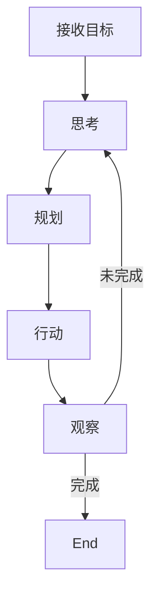

# 近年 AI 应用技术串讲：从新手到专家的完整学习路线

> **目标读者**：希望系统掌握 AI 应用技术的开发者
> **预计时间**：完整学习约需 3-6 个月
> **前置知识**：有编程基础，了解基本的数据结构和算法

---

## 📋 前言

近年 AI 技术发展迅猛。本文串讲了当下最重要的 12 个 AI 应用技术主题，设计了完整的学习路线，帮助你：

- 🎯 **建立系统认知**：形成完整知识体系
- 📈 **少走弯路**：按照科学的学习顺序，循序渐进
- 🚀 **动手实践**：每个概念都有实战案例
- 🎓 **成为专家**：从会用工具到理解原理

---

## 🗺️ 学习路线总览

本文设计了**三条并行学习路径**：

| 路径 | 目标人群 | 核心问题 | 进阶 |
|------|---------|---------|-------|
| 用户路径 | 使用 AI 工具 | 这个怎么用？ | ⭐ 到 ⭐⭐⭐⭐ |
| 开发路径 | 开发 AI 应用 | 这个怎么实现？ | ⭐ 到 ⭐⭐⭐⭐ |
| 进阶路径 | 提升技术能力 | 为什么这样设计？ | ⭐ 到 ⭐⭐⭐⭐ |

---

## §1 LLM：大语言模型基础 ⭐⭐⭐

> **前置知识**：机器学习基础概念
> **预计时间**：2-3 周

### 1.1 什么是 LLM？

**LLM（Large Language Model，大语言模型）** 是通过海量文本数据训练、能够理解和生成自然语言（及代码）的深度学习模型。

### 1.2 Transformer 架构

LLM 的基础是 **Transformer**（2017 年 Google 提出），核心是**注意力机制**。

```
Transformer 架构演进：

┌────────────────────────────────────────────┐
│           Transformer 架构                    │
└────────────────────────────────────────────┘
                       │
    ┌─────────────────┼─────────────────┐
    ▼                 ▼                 ▼
┌────────┐      ┌────────┐      ┌────────┐
│Encoder │      │Enc-Dec │      │Decoder │ ← 当前主流
│ BERT   │      │  T5    │      │ GPT 系列 │
└────────┘      └────────┘      └────────┘
```

### 1.3 Decoder-Only 为何是主流？

| 特性 | Encoder-Decoder | Decoder-Only |
|------|----------------|--------------|
| 训练效率 | 计算量大 | 更高效 |
| 生成质量 | 需额外学习 | 自回归更自然 |
| 工程实现 | 结构复杂 | 相对简单 |

### 1.4 核心概念：Token 和上下文窗口

**Token** 是 LLM 处理文本的基本单位。**上下文窗口**是 LLM 一次能处理的最大 Token 数量。

| 模型 | 上下文窗口 |
|------|-----------|
| GPT-4 Turbo | 128k tokens |
| Claude 3 | 200k tokens |
| Gemini 1.5 | 1M tokens |

---

## §2 Prompt Engineering：提示词工程 ⭐

> **前置知识**：LLM 基础
> **预计时间**：1-2 周

### 2.1 核心 Prompt 技巧

#### Few-Shot Learning（少样本学习）

```markdown
# ❌ 零样本
用户：把"你好"翻译成英文
AI：Hello

# ✅ 少样本
用户：把"早上好"翻译成英文
AI：Good morning
用户：把"你好"翻译成英文
AI：Hello
```

#### Chain-of-Thought（思维链）

```markdown
# 让 LLM 展示推理过程，提高复杂问题准确性
用户：计算 245 + 178
AI：让我一步步思考：
     1. 245 + 100 = 345
     2. 345 + 70 = 415
     3. 415 + 8 = 423
     答案是 423
```

### 2.2 常见反模式

| 反模式 | 问题 | 正确做法 |
|--------|------|----------|
| 模糊指令 | "写好一点" | 具体要求字数、重点 |
| 过长 Prompt | 塞入所有信息 | 只提供相关信息 |

---

## §3 Fine-tuning：微调技术 ⭐⭐⭐

> **前置知识**：LLM、深度学习训练
> **预计时间**：2-3 周

### 3.1 LoRA：低秩适配

**LoRA（Low-Rank Adaptation）** 是当前最流行的微调算法，核心思想是"只训练少量参数"。

```
全参数微调 vs LoRA：

全参数微调：更新 70B 参数 → 需要 80GB+ A100，数周
LoRA：更新 0.1B 参数 → 仅需 8GB+ RTX 3090，数小时
```

### 3.2 什么时候需要微调？

| 场景 | 推荐方案 |
|------|---------|
| 特定写作风格 | Prompt Engineering |
| 特定任务格式 | LoRA |
| 新知识注入 | RAG 更合适 |

---

## §4 RAG：检索增强生成 ⭐⭐

> **前置知识**：LLM、信息检索
> **预计时间**：2-3 周

### 4.1 RAG 工作流程

```
用户问题 → 检索引擎 → 知识库 → LLM 生成
              ↓
         Vector DB (语义相似度匹配)
```

### 4.2 RAG vs 其他方案

| 方案 | 优势 | 劣势 | 适用场景 |
|------|------|------|---------|
| 纯 LLM | 通用能力强 | 知识过时、幻觉 | 开放式问答 |
| RAG | 知识新鲜、可溯源 | 增加复杂度 | 企业知识库 |
| 微调 | 任务适配好 | 成本高 | 特定风格 |

---

## §5 Function Calling & MCP ⭐⭐⭐

> **前置知识**：LLM、API 概念

### 5.1 Function Calling

让 LLM 调用外部工具或 API 的机制。

### 5.2 MCP vs Function Calling

| 特性 | Function Calling | MCP |
|------|-----------------|-----|
| 标准化 | 厂商私有 | 社区开放标准 |
| 跨应用 | 需重复定义 | 一次定义，多处复用 |

---

## §6 Agent：智能体 ⭐⭐⭐

> **前置知识**：LLM、Function Calling、MCP
> **预计时间**：3-4 周

### 6.1 Agent 核心公式

```
Agent = LLM + Planning + Memory + Tools
```

### 6.2 Agent Loop：思考-行动-观察循环



---

## §7 Multi-Agent：多智能体系统 ⭐⭐⭐⭐

> **前置知识**：Agent、Context Engineering
> **预计时间**：3-4 周

### 什么时候需要 Multi-Agent？

| 场景 | 单 Agent | Multi-Agent |
|------|---------|-------------|
| 简单任务 | ✅ 快速 | ❌ 协作开销大 |
| 多步骤任务 | ⚠️ 可行 | ✅ 自然拆分 |
| 需要专业技能 | ❌ 难以精通所有 | ✅ 各有所长 |

---

## §8 Context Engineering：上下文工程 ⭐⭐⭐

> **前置知识**：LLM、Prompt Engineering

### 三大挑战

| 挑战 | 表现 | 解决思路 |
|------|------|---------|
| 上下文长度限制 | Token 上限 | 智能压缩、摘要 |
| 信息噪音 | 干扰推理 | 相关性检索 |
| 上下文质量 | 影响输出 | Prompt 优化 |

---

## §9 Agent Skill：智能体技能 ⭐⭐⭐

> **前置知识**：Agent、MCP

### Skill 封装内容

```
SKILL.md - 技能定义文件
tools/ - 工具脚本目录
knowledge/ - 知识文件目录
```

### Skill 优势

| 特性 | 传统方式 | Skill 方式 |
|------|---------|-----------|
| 复用性 | 复制粘贴 | 一键安装复用 |
| 版本管理 | 无 | 支持版本升级 |

---

## §10 OpenClaw & Harness Engineering ⭐⭐⭐⭐

### OpenClaw

开源、高可扩展的 AI Agent 框架，基于 TypeScript。

| 创新点 | 说明 |
|--------|------|
| 多入口支持 | 飞书、微信等 IM |
| Skill 原生 | 内置 Skill 生态 |
| 本地优先 | 数据本地存储 |

### Harness Engineering

构建受控环境，让 Agent 高效可靠完成任务。

| 维度 | 传统软件工程 | Harness Engineering |
|------|-------------|-------------------|
| 测试 | 单元测试 | 评估集+人工评估 |
| Bug 处理 | 修 Bug | 调试 Prompt |

---

## 📚 优质资源推荐

| 资源 | 类型 | 链接 |
|------|------|------|
| Attention Is All You Need | 论文 | [arXiv](https://arxiv.org/abs/1706.03762) |
| Anthropic Cookbook | 示例 | [GitHub](https://github.com/anthropics/anthropic-cookbook) |
| Prompt Engineering Guide | 指南 | [promptengineering.org](https://www.promptengineering.org/) |

---

## 📋 学习路线总结

### 入门阶段（1-2 月）

| 周次 | 主题 |
|------|------|
| 1-2 周 | LLM 基础 + Prompt Engineering |
| 3-4 周 | RAG + Function Calling |
| 5-8 周 | Agent 核心 + MCP |

### 进阶阶段（3-4 月）

| 周次 | 主题 |
|------|------|
| 9-12 周 | Multi-Agent + Context Engineering |
| 13-16 周 | Agent Skill + OpenClaw |
| 17-24 周 | Harness Engineering + 实战项目 |

---

**文档元信息**
难度：⭐⭐⭐ | 类型：技术笔记 | 更新日期：2026-04-14 | 预计阅读时间：60 分钟
