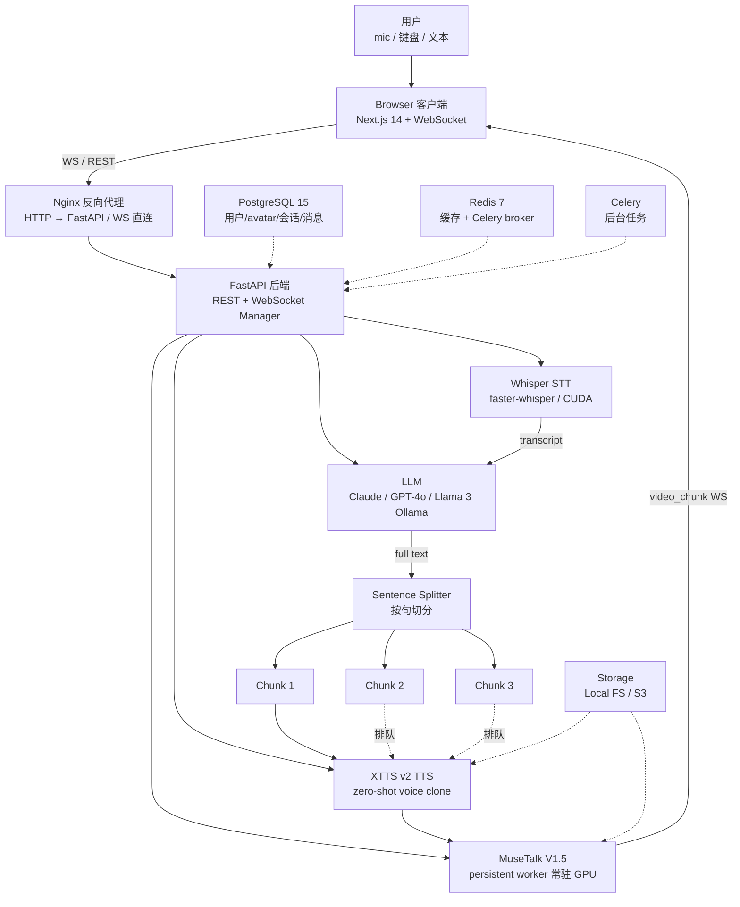

# AvatarAI：把照片+5 秒音频变成实时对话数字人，底层那套流式架构才是护城河

## 核心判断

`ai-avatar-system`（仓库 [PunithVT/ai-avatar-system](https://github.com/PunithVT/ai-avatar-system)，MIT 许可，218 stars）解决的不是"数字人怎么做"——这是被 MuseTalk、XTTS、Wav2Lip、SadTalker 等开源模型反复回答过的问题。它回答的是一个工程整合层面的问题：**怎么把 4 个独立模型（Whisper STT → LLM → XTTS TTS → MuseTalk 唇形同步）拼成"用户感觉像在跟真人说话"的端到端体验？**

仓库 README 把答案藏在了两段不起眼的描述里：

1. **"Sentence-chunk streaming — first video chunk plays while the rest is still being generated"** ——流式分句推送，首帧在生成完成前就到浏览器
2. **"Persistent MuseTalk worker (models loaded once)"** ——唇形同步 worker 常驻 GPU，避免每次请求都重载 9GB 模型

把这两点看明白，仓库其他 95% 的代码就只是把它们落地。AvatarAI 护城河不在模型选型（MuseTalk / XTTS 都开源、可替换），而在**流式架构 + 持久化 worker + WebSocket 句子切片推送**这一整套工程整合。多数同类仓库卡在"能用但慢"的阶段，根因都在没把这两件事做对。

## 系统地图

下表把仓库拆成 5 层，从用户输入到浏览器看到的视频，标注每个环节的实现与瓶颈：



前 3 层（STT、LLM、TTS）独立看都不稀缺，主流 LLM 应用都这么做。仓库作者把差异化押在了第 4 层（Sentence Splitter）和第 5 层（WebSocket 推送）上 —— 这两层在多数同类项目里要么没做，要么做得粗糙，结果就是"能跑但慢"。AvatarAI 把 sentence-level chunking 写成了本能反应，浏览器在每个 chunk 完成后立即播，第 0 帧不等 LLM 完整跑完。

## 4 阶段 Pipeline：每个阶段的瓶颈

AvatarAI 的端到端对话拆成 4 阶段。每阶段瓶颈不同，不能均匀优化：

| 阶段 | 模型 | 典型耗时 | 瓶颈 | 优化空间 |
|------|------|----------|------|----------|
| **STT** | Whisper（`faster-whisper`） | 0.3-1.5s（10s 音频，base 模型，GPU） | 模型精度 vs 速度 | `base` 折中；`large-v3` 翻 4 倍 |
| **LLM** | Claude Sonnet 4 / GPT-4o / Llama 3 | 1-3s（流式，首 token ~300ms） | API 网络延迟 + token 限速 | 切 Ollama 本地免网络延迟 |
| **TTS** | XTTS v2 | 0.5-1.5s/句 | 0.1-0.3s 合成 + GPU 调度 | multi-GPU 排队 |
| **唇形同步** | MuseTalk V1.5 | 0.8-1.2s/句（GPU）；30-90s/句（CPU） | **单卡 GPU 串行** | 多 worker 平行 + 批处理 |

**最贵的是唇形同步**。CPU 上 30-90s/句 几乎不可用；GPU 上也要近 1 秒。仓库 README 明说："CPU is 30-50× slower"。**没有 GPU 就没有真"实时"**，这是 AvatarAI 的硬件门槛。

## 持久化 MuseTalk Worker

仓库 `backend/models/MuseTalk/scripts/musetalk_worker.py` 是这套架构里最值得展开的一个文件：

```python
# 伪代码：worker.py 核心逻辑
class MuseTalkWorker:
    def __init__(self):
        # 一次启动，所有模型加载到 GPU 显存
        self.face_parser = load_model(...)     # ~2 GB
        self.lip_sync = load_model(...)        # ~5 GB
        self.audio_encoder = load_model(...)   # ~2 GB
        # 共 ~9 GB 占满 A10G 24GB 显存

    def process(self, audio_path, face_path):
        # 直接复用已加载模型，避免每次重载
        return self.lip_sync.generate(audio, face)
```

**为什么"持久化 worker"是核心？**

- 唇形同步模型加载一次 ~60s（GPU）/ ~5min（CPU）
- 如果用 HTTP 短调用模式，每次对话都得重载，9GB 模型搬进搬出 GPU 显存
- 持久化 worker 让模型**只加载一次**，常驻显存；接 WebSocket 接受任务，结果直接推回主进程

这套模式在 LLM serving 圈叫 **"model warm pool"** 或 **"sticky worker"**——vLLM、Triton、TensorRT-LLM 都在用同样的思路：模型只加载一次，任务排队进 worker，不让 I/O 拖慢推理。AvatarAI 把同样的思路套到了 MuseTalk 上，9GB 模型常驻 A10G 显存，9GB 一次加载、永久在线。

## 句子级流式：让"实时感"成立

AvatarAI 把"实时"做出来的关键是 **WebSocket 上的 sentence-chunk streaming**：

```json
// Server → Client WS 消息序列
{
  "type": "transcription", "text": "Hello! How are you today?"
}
{
  "type": "video_chunk_start", "total_chunks": 3
}
{
  "type": "video_chunk", "chunk_index": 0,
  "video_url": "/tmp/chunk_0.mp4", "text": "Hello!"
}
{
  "type": "status", "message": "Animating part 1 of 3…"
}
{
  "type": "video_chunk", "chunk_index": 1,
  "video_url": "/tmp/chunk_1.mp4", "text": "How are you?"
}
// 浏览器：第 0 帧已经在播，第 1 帧在后台生成
{
  "type": "video_chunk", "chunk_index": 2, ...
}
{
  "type": "video_chunk_end"
}
```

**关键设计选择**：

1. **句子级切片**：LLM 输出完整文本后，按句号/问号/感叹号切分；不是等 LLM 完整跑完再一次性处理
2. **流式推送**：每个 chunk 完成后立即通过 WebSocket 推到浏览器，浏览器**边下边播**
3. **首帧 2-4s**：在 `g5.xlarge` 上首视频片段约 2-4 秒完成（README 原话："< 2–4 s first chunk on AWS GPU"）
4. **空闲动画**：等待时浏览器播 CSS breathing animation（**用户感知不到"卡"**）

这套设计带来了三个不同层面的改善：

- 用户感知延迟降到首 chunk 时间（2-4s），不再是 LLM 完整响应时间
- 长答案（3-5 句）的后几句在第 1 句播放时后台跑，端到端不串行
- chunk 之间播 idle animation，体验上"永远有反馈"

没有 sentence-chunk 的方案需要等所有句子 TTS + 唇形同步完成才能播放首帧，3 句答案通常 10s+。AvatarAI 把这个数字压到 2-4s——同样数量的模型、同样的硬件，只换了"切片 + 流式"的写法。

## Benchmark 解读：测什么、不能推出什么

README 给出的性能数据：

| 项 | 数字 | 测试条件 | 注意 |
|---|---|---|---|
| MuseTalk FPS | 30 FPS @ 256×256 | V100-class GPU | **峰值**；真实端到端 FPS 受 TTS/WS 影响 |
| CPU 退化 | 30-50× 慢 | 同模型 | 数量级，不是精确比 |
| 首 chunk | 2-4s | `g5.xlarge`（A10G） | AWS GPU 实测，**不含首请求冷启动** |
| 冷启动 | ~60s GPU / ~5min CPU | 首次请求 | 模型从磁盘加载到 VRAM |
| 显存占用 | ~9GB | MuseTalk 模型 | A10G 24GB，剩余 15GB 给其他进程 |

**能推出的**：

- AWS `g5.xlarge` 配 A10G 是**甜点**——30 FPS 真实时，~$0.30/hr Spot 划算
- T4 (`g4dn.xlarge`) 是降级选项——15-20 FPS，勉强能对话
- L4 (`g6.xlarge`) 价格和 A10G 接近，30 FPS 但更新一代

**不能推出的**（仓库 README 没明说）：

- "30 FPS" 是 MuseTalk 单独跑的分；端到端的 video FPS 受 STT/LLM/TTS 串行影响
- **多用户并发**性能——单 worker 同时只能处理 1 句，2 用户并发要排队；仓库未给基准
- **长答案 5+ 句的尾延迟**——前几个 chunk 可能 2-4s，最后一个 chunk 受 LLM 完成时间影响
- **CPU 上的"实时"是空话**——30-90s/句完全不可用

## 5 任务流案例：用户发送语音 → avatar 视频响应

把抽象机制串成一个具体流程：

**Step 1：用户在浏览器按住 mic 说话**

浏览器通过 WebM 编码，base64 后通过 WebSocket 发到 FastAPI：

```json
{ "type": "audio", "audio": "<base64-webm>" }
```

**Step 2：FastAPI 收到音频 → Whisper 转写**

`backend/app/services/stt.py` 调用 `faster-whisper`：

```python
# 伪代码
from faster_whisper import WhisperModel
model = WhisperModel("base", device="cuda")  # 启动时加载一次
segments, info = model.transcribe(audio_path, language="en")
text = " ".join(seg.text for seg in segments)
# → "Hello, how are you?"
```

`transcription` 消息推回浏览器作为 STT 反馈。

**Step 3：转写文本 → LLM 完整响应**

`backend/app/services/llm.py` 调 Claude / GPT-4o / Ollama：

```python
response = await anthropic.messages.create(
    model="claude-sonnet-4-20250514",
    messages=[{"role": "user", "content": text}],
    max_tokens=300,
)
full_text = response.content[0].text
# → "I'm doing great! How can I help you today?"
```

**Step 4：按句切片**

`backend/app/websocket.py` 的 `split_sentences`：

```python
import re
sentences = re.split(r'(?<=[.!?])\s+', full_text)
# → ["I'm doing great!", "How can I help you today?"]
```

**Step 5：每句 → XTTS → MuseTalk → WebSocket 推送**

并行处理（不是并行计算，是流水线并行）：

```python
# 伪代码
for i, sentence in enumerate(sentences):
    # 5a. XTTS 生成语音 wav
    audio_wav = xtts.tts(sentence, speaker_wav_path=cloned_voice)

    # 5b. MuseTalk 生成视频 mp4
    video_mp4 = musetalk_worker.process(audio_wav, face_image_path)

    # 5c. 推 WebSocket
    await ws.send_json({
        "type": "video_chunk",
        "chunk_index": i,
        "video_url": save_to_local_or_s3(video_mp4),
        "text": sentence
    })
```

**Step 6：浏览器拼装**

Next.js 端拿到 video_url 列表后，按 chunk_index 顺序拼到 `<video>` 元素，**第 0 帧先播**，后续帧在后台 append。

**端到端时间线**：

```
T+0s: 用户说话
T+0.5s: WS 收到音频
T+1.0s: Whisper 转写完 → "Hello, how are you?"
T+1.5s: LLM 首 token 返回
T+3.0s: LLM 完整响应 → "I'm doing great! How can I help you today?"
T+3.5s: 第 1 句 TTS 完成 + MuseTalk 完成
T+3.7s: chunk 0 推到浏览器 → 用户看到嘴动
T+4.5s: 第 2 句完成
T+4.7s: chunk 1 推到浏览器 → 用户看到完整答案
```

端到端首帧延迟：~3.7s。这个数字看上去比"30 FPS 理论值"还低，但用户实际感知到的是"3-4 秒内 avatar 开始说话"——3-4 秒在心理上已经算"实时"的范围，远低于 10s+ 的同类方案。

## 仓库元数据

| 维度 | 取值 | 验证来源 |
|------|------|----------|
| 仓库全名 | `PunithVT/ai-avatar-system` | GitHub API |
| Stars | 218 | GitHub API（2026-06-03） |
| Forks | 38 | GitHub API |
| Language | Python（后端）+ TypeScript（前端） | GitHub API |
| License | MIT | LICENSE |
| 创建时间 | 2025-11-30 | GitHub API |
| 最后更新 | 2026-06-02 | GitHub API |
| 最后 Push | 2026-05-19 | GitHub API |
| 仓库大小 | 2.5 MB | GitHub API |
| Topics | ai-avatar, claude-ai, fastapi, lip-sync, nextjs, sadtalker, speech-to-text, talking-avatar, text-to-speech, voice-cloning, websocket, whisper-ai, xtts-v2 | GitHub API |
| 默认分支 | main | GitHub API |

## 适用边界与采用顺序

**适合的场景**：

- 客服 avatar：把 5 句常见问答做成预录 + 实时合成混合
- 教学数字人：K12 课程讲师、瑜伽/健身教练
- 商业演示：销售 bot 替代冷冰冰的 2D 客服
- 个人项目：把逝去亲人的照片 + 录音带做出可对话的纪念
- 内部工具：会议记录转 avatar 摘要

**不适合的场景**：

- 实时视频会议：30 FPS 唇形同步仍显呆滞，对话延迟 3-4s 无法替代 Zoom/Meet
- 大规模并发：单 GPU 串行 worker，10+ 并发用户就要排队
- 隐私敏感：Whisper/Claude 都走 API，录音和头像**默认不加密出本地**（除非用 Ollama + Local Whisper）
- 移动端部署：MuseTalk 9GB 显存，移动 SoC 跑不动

**采用顺序**（先跑通再上生产）：

1. **本地 CPU 起步**：先 `git clone + docker compose up`，看 avatar 跑起来
2. **跑通后切 GPU**：本地有 NVIDIA 卡就走 `gpu` profile，没卡就上 AWS Spot
3. **替换 LLM 为 Ollama**：把 `LLM_PROVIDER=ollama` 改掉，Llama 3 跑本地，零 API 成本
4. **替换 STT 为本地 Whisper**：`faster-whisper` 本地推理
5. **替换 TTS 为本地 XTTS**：已经在本地（`coqui` TTS）
6. **接 S3 + CloudFront**：从 local storage 切到 S3，CDN 加速视频分发
7. **Terraform 部署**：用 `infrastructure/main.tf` 上 ECS + RDS + ElastiCache
8. **生产化**：JWT 鉴权、rate limit、Sentry、Prometheus 都已经内置

**第 3-5 步是做到"100% 离线"的关键**。完成这步后，AvatarAI 才算"数据本地不外发"。

## 与同类项目的差异

| 项目 | 唇形同步 | 语音克隆 | 流式架构 | 部署难度 | Stars |
|------|----------|----------|----------|----------|-------|
| **ai-avatar-system** | MuseTalk V1.5 | XTTS v2 | sentence-chunk WS | 中（Docker Compose） | 218 |
| [HeyGen](https://heygen.com) | 自研 | 自研 | 商业流式 | SaaS | — |
| [D-ID](https://d-id.com) | 自研 | 支持 | 商业流式 | SaaS | — |
| [SadTalker](https://github.com/OpenTalker/SadTalker) | SadTalker | ✗ | 单帧批处理 | 高（CUDA 配置） | 12K+ |
| [MuseTalk 原版](https://github.com/TMElyralab/MuseTalk) | MuseTalk | ✗ | 命令行 | 中 | 4K+ |
| [Hallo](https://github.com/fudan-generative-vision/hallo) | 自研 | ✗ | 单次推理 | 高 | 3K+ |

AvatarAI 强在整合度：把 STT + LLM + TTS + 唇形同步 + Web UI 五件事拼成可一键部署的开源方案，目前 GitHub 上没看到第二家做到这个完整度。生产级细节（JWT、S3、Prometheus、Celery、alembic 迁移）也内置了，省掉二次搭骨架的时间。`scripts/deploy-aws.sh` 在 `g5.xlarge` 上跑通的真实路径已经写在仓库里。

同类的不可替代之处也很明显：要商业级唇形质量，HeyGen / D-ID 仍是首选；要纯研究探索，MuseTalk / Hallo 原版更直接；要做到 <1s 端到端延迟，整个领域都还做不到，AvatarAI 也一样。

## 参考资源

- **仓库入口**：[github.com/PunithVT/ai-avatar-system](https://github.com/PunithVT/ai-avatar-system)
- **SETUP 详细指南**：[SETUP_GUIDE.md](https://github.com/PunithVT/ai-avatar-system/blob/main/SETUP_GUIDE.md)
- **MuseTalk 论文**：[arxiv.org/abs/2410.10122](https://arxiv.org/abs/2410.10122)
- **XTTS v2 仓库**：[github.com/coqui-ai/TTS](https://github.com/coqui-ai/TTS)
- **Whisper 仓库**：[github.com/openai/whisper](https://github.com/openai/whisper)
- **faster-whisper 仓库**：[github.com/SYSTRAN/faster-whisper](https://github.com/SYSTRAN/faster-whisper)
- **AWS g5.xlarge 文档**：[aws.amazon.com/ec2/instance-types/g5](https://aws.amazon.com/ec2/instance-types/g5/)
- **Ollama 本地 LLM**：[ollama.ai](https://ollama.ai)
