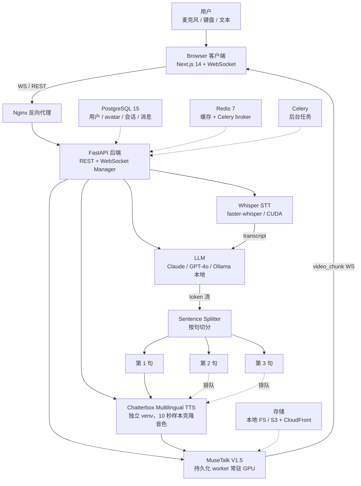

# AvatarAI：把一张照片变成实时对话数字人，token 级流式管线才是护城河

> **快速信息卡**
>
> | 项目 | 信息 |
> |------|------|
> | 仓库 | [PunithVT/ai-avatar-system](https://github.com/PunithVT/ai-avatar-system) |
> | Stars | 493（截至 2026-09-18） |
> | Forks | 119 |
> | 许可证 | MIT |
> | 语言 | Python / TypeScript |
> | 最近推送 | 2026-09-17 |

## 学习目标

读完这篇文章后，你应该能够：

- 说出 ai-avatar-system 的核心管线：Whisper STT → LLM 流式生成 → Chatterbox TTS → MuseTalk 唇形同步
- 解释 token 级流式加按句视频切片如何把首帧延迟压到 2–4 秒
- 理解持久化 MuseTalk worker 的设计价值：模型只加载一次，后续请求只付推理成本
- 说出 TTS 后备链（chatterbox → edge-tts → gTTS）和引擎档位（simple / musetalk / liveavatar）各自的适用场景
- 在 Docker Compose 或 AWS g5.xlarge 上部署这套系统，并验证首帧延迟

## 目录

- [核心判断](#核心判断)
- [系统地图](#系统地图)
- [优雅降级：后备链与引擎档位](#优雅降级后备链与引擎档位)
- [与同类项目的差异](#与同类项目的差异)
- [参考资源](#参考资源)
- [自测题](#自测题)
- [练习](#练习)
- [进阶路径](#进阶路径)
- [常见问题 FAQ](#常见问题-faq)

---

## 核心判断

`ai-avatar-system`（仓库 [PunithVT/ai-avatar-system](https://github.com/PunithVT/ai-avatar-system)，MIT 许可）解决的不是"数字人怎么做"——这是被 MuseTalk、Wav2Lip、SadTalker 等开源模型反复回答过的问题。它回答的是一个工程整合问题：**怎么把语音识别、对话生成、语音合成、唇形同步四个环节拼成"用户感觉在跟真人说话"的端到端体验？**

项目 2026 年 3 月的一次升级最能说明作者在意什么：把 TTS 引擎从 XTTS v2 整体换成 Resemble AI 的 Chatterbox Multilingual，同时上线了 MuseTalk 持久化 worker 和 token 级流式。换引擎是小事，后两件事才是这套系统的立身之本：

1. **流式管线**——LLM 一边吐 token，后端一边按句切片送 TTS 和唇形同步，第一个视频块在模型说完整句话之前就到达浏览器。README 给的口径是 AWS GPU 上首帧 2–4 秒。
2. **持久化 worker**——约 9 GB 的 MuseTalk 模型在首次请求时装进显存（GPU 约 60 秒），之后每个请求只付推理成本，约 30 FPS。没有这一层，每句话都要等一次模型重载。

再加上一条层层兜底的降级链（Chatterbox 挂了落 edge-tts，再挂落 gTTS；MuseTalk 挂了落无唇形同步的 simple 引擎），这套系统的工程性格就清楚了：模型全部开源可替换，真正的门槛在于把延迟压进对话体验的容忍区间，并且在任何一环出问题时优雅地降级，而不是报错中断。

## 系统地图

### 端到端管线


```mermaid
flowchart TD
    A[用户<br/>麦克风 / 键盘 / 文本] --> B[Browser 客户端<br/>Next.js 14 + WebSocket]
    B -->|WS / REST| C[Nginx 反向代理]
    C --> D[FastAPI 后端<br/>REST + WebSocket Manager]
    D --> E1[Whisper STT<br/>faster-whisper / CUDA]
    D --> E2[LLM<br/>Claude / GPT-4o / Ollama 本地]
    D --> E3[Chatterbox Multilingual TTS<br/>独立 venv，10 秒样本克隆音色]
    D --> E4[MuseTalk V1.5<br/>持久化 worker 常驻 GPU]
    E1 -->|transcript| E2
    E2 -->|token 流| F[Sentence Splitter<br/>按句切分]
    F --> G1[第 1 句] --> E3 --> E4
    F --> G2[第 2 句] -.->|排队| E3
    F --> G3[第 3 句] -.->|排队| E3
    E4 -->|video_chunk WS| B

    H[PostgreSQL 15<br/>用户 / avatar / 会话 / 消息] -.-> D
    I[Redis 7<br/>缓存 + Celery broker] -.-> D
    J[Celery<br/>后台任务] -.-> D
    K[存储<br/>本地 FS / S3 + CloudFront] -.-> E4
```

四层职责：浏览器负责采集和播放；Nginx 把 HTTP 和 WebSocket 分流给 FastAPI；FastAPI 里的 WebSocket Manager 是真正的编排者，负责"切句 → TTS → MuseTalk → 流式推送"这个循环；四个模型各管一段——Whisper 听、LLM 想、Chatterbox 说、MuseTalk 让嘴动起来。

### WebSocket 协议

浏览器和后端之间只有一条 WebSocket 通道（`/ws/session/{session_id}`），所有实时消息都走它。客户端能发的消息类型：

```json
{ "type": "text", "text": "Hello!" }
{ "type": "audio", "audio": "<base64-webm>" }
{ "type": "stop" }
{ "type": "set_voice", "voice_id": "<uuid>" }
{ "type": "ping" }
```

服务端推回来的消息类型：

```json
{ "type": "token", "token": "Hel" }
{ "type": "transcription", "text": "Hello!" }
{ "type": "message", "content": "Hi! How can I help?", "role": "assistant" }
{ "type": "video_chunk_start", "total_chunks": -1 }
{ "type": "video_chunk", "chunk_index": 0, "video_url": "...", "text": "Hi!" }
{ "type": "video_chunk_end", "sent_chunks": 3 }
{ "type": "status", "message": "Animating…", "stage": "animation" }
{ "type": "tts_fallback", "engine": "edge-tts", "voice_cloned": false }
{ "type": "interrupted", "message": "Previous response interrupted" }
```

三个细节值得注意。`video_chunk_start` 里的 `total_chunks: -1` 表示流式模式下连后端自己都不知道会切几句，句子是边生成边排队的。`stop` 消息是插话打断（barge-in）的入口：用户中途开口或按下停止，进行中的回复立刻取消，服务端回一条 `interrupted`——对话可以像和真人说话一样被打断。`tts_fallback` 则在克隆音色没能生效时告知用户降级到了哪个引擎，界面会显示一次性提示。

### 持久化 worker：为什么模型只加载一次

MuseTalk 是整条管线里最贵的环节。它的权重下载约 9 GB，推理时建议 16–24 GB 显存，GPU 上约 30 FPS（256×256，V100 级显卡）。仓库用独立进程把它做成常驻 worker（`backend/models/MuseTalk/scripts/musetalk_worker.py`）：

```python
# 伪代码：musetalk_worker.py 的常驻设计
class MuseTalkWorker:
    def warmup(self):
        # 首个请求触发：全部模型装进显存，GPU 约 60 秒，之后常驻
        self.models = load_musetalk_checkpoints()

    def process(self, audio_path, face_path):
        # 后续请求只付推理成本，不再重载模型
        return self.models.lip_sync(audio_path, face_path)  # ~30 FPS
```

对比一下反过来的设计：每条语音都冷启动一次 worker，等于每个句子前面都加一段分钟级的模型加载。这也是 README 里"第一次回复偏慢"的官方解释——首个请求承担 warmup，之后的请求复用已加载的模型。

### 一次对话的完整时间线

把上面的机制串起来，一次对话回合是这样的（相对时间，量级对应 README"AWS GPU 上首帧视频块 2–4 秒"的口径）：

```text
T+0s    用户说完话，浏览器把 WebM 音频推给后端
T+1s    Whisper 转写完成，LLM 开始流式输出 token
T+2s    首句凑齐 → Chatterbox 合成 → MuseTalk 出视频
        → 第一个视频块到达浏览器，用户看到嘴动
        ——此刻 LLM 往往还没说完后半句
T+4s    LLM 回复完毕；剩余句子在后台逐句合成，边生成边播
```

这条时间线里藏着这套系统全部的延迟设计：Whisper 要快、LLM 要流式、切句要趁早、worker 要常驻。任何一环变成"等上一步全部完成再开始"，首帧就会从秒级掉进十几秒的区间。

### 部署与验证

CPU 开发环境不需要 AWS，本地存储默认开启：

```bash
# 1. 启动全栈
git clone https://github.com/PunithVT/ai-avatar-system.git
cd ai-avatar-system
cp .env.example .env        # 填入 ANTHROPIC_API_KEY，或改用 Ollama 本地模型
docker compose up -d
# Frontend: localhost:3000  Backend: localhost:8000  Swagger: localhost:8000/docs

# 2. GPU 可见性（GPU 主机）
docker exec avatar-backend python -c "import torch; print(torch.cuda.is_available())"
# 期望: True

# 3. 启用唇形同步：下载约 9 GB 模型（一次性），切引擎，重启后端
bash scripts/setup_musetalk.sh
# .env 中设 AVATAR_ENGINE=musetalk 后:
docker compose restart backend

# 4. WebSocket 联通（会话需先经 REST 创建）
wscat -c ws://localhost:8000/ws/session/<session_id>
> {"type": "text", "text": "Hello"}
# 期望依次收到: transcription → token×N → message → video_chunk_start
#              → video_chunk×N → video_chunk_end

# 5. 没有素材也能聊：预置三个 AI 生成面孔的 demo 数字人
python scripts/seed_demo.py             # 加 --with-voices 连演示音色一起克隆
```

如果首帧明显超过 README 的 2–4 秒口径，先分清两种慢：**第一次请求慢**是 worker 在 warmup（GPU 约 60 秒，CPU 约 5 分钟），属正常；**每次请求都慢**才说明 worker 没有常驻成功，用 `nvidia-smi` 看推理时显存占用是否符合 MuseTalk 的 16–24 GB 档位。

## 优雅降级：后备链与引擎档位

流式和常驻解决快的问题，降级链解决稳的问题。这套系统里每个可替换环节都有退路：

**TTS 三级后备链。** Chatterbox 需要独立 venv——它固定 torch 2.6 / transformers 5.2，而 MuseTalk 管线需要 torch 2.2 / transformers 4.37，两者无法共存于一个环境。没装 Chatterbox 时管线不会失败，而是自动落到 edge-tts（微软免费神经语音，纯 CPU），再落到 gTTS。克隆音色是唯一依赖 Chatterbox 的功能，其余对话照常。

**引擎三档。** `AVATAR_ENGINE` 决定视频怎么生成，引擎失败自动回落 simple 而不是让整个回合报错：

| 引擎 | 显存 | 速度 | 适用 |
|------|------|------|------|
| `simple` | 无 | 即时 | CPU 主机，无唇形同步 |
| `musetalk`（默认） | 16–24 GB | 约 30 FPS | 实时对话 |
| `liveavatar` | 48 GB（FP8）/ 80 GB | 每回合分钟级 | 离线渲染，保真优先 |

LiveAvatar（阿里 Quark 的 Wan2.2-S2V-14B + LoRA，Apache 2.0）保真度更高，但作者明确没把它做成默认：48 GB 显存是另一个硬件档位，且它每次调用都要重新加载 14B 模型、没有持久化模式，一个回合要几分钟。README 里有一句值得记住的判断——给上游打补丁做持久化 worker，正是 SadTalker 当初被从这个项目移除的那类维护债，所以故意不做。**这个项目知道自己不做什么。**

**面部修复是加分项不是依赖项。** MuseTalk 在 256×256 上重新生成嘴部再贴回原图，而 avatar 本身按 `AVATAR_RESOLUTION`（512）存储——嘴部分辨率只有周围脸的一半，这是管线可见的质量上限，换唇形引擎解决不了。可选的 GFPGAN 修复（`FACE_RESTORE=gfpgan`）逐帧跑，用帧率换清晰度；它故意不进 `requirements.txt`（其依赖 basicsr 与 CUDA 基础镜像冲突，会弄坏所有人的镜像构建），任何一环出问题都静默回落到原始 MuseTalk 输出。唇形同步是功能，锐度只是修饰。

## 与同类项目的差异

README 给的官方对比（2026-09 口径）：

| | **AvatarAI** | Duix-Avatar | Linly-Talker | AIAvatarKit |
|---|---|---|---|---|
| 实时对话 | ✅ WebSocket 流式 | ❌ 离线视频生成 | ✅（Gradio / WebRTC 分支） | ✅ |
| 唇形同步视频 | ✅ MuseTalk V1.5 | ✅ 专有模型 | ✅ 多引擎 | ❌ 驱动外部形象 |
| 声音克隆 | ✅ 10 秒样本，23 种语言 | ✅ | ✅ | ❌ |
| 插话打断 | ✅ | ❌ | ✅（流式变体） | ✅ |
| 本地 / 免费 LLM | ✅ Ollama、vLLM | ❌ | ✅ | ✅ |
| 带认证与历史的 Web 应用 | ✅ Next.js + JWT + Postgres | ❌ Windows 客户端 | ❌ Gradio 演示 UI | ❌ 库 |
| 许可证 | MIT | 自定义 | MIT | Apache-2.0 |

放到更大的开源同类里看：SadTalker（14K+ stars）做单帧批处理、部署门槛高，且已因维护债务被本项目移除；MuseTalk 原版（6.5K+ stars）只有命令行入口；Hallo（8.7K+ stars）是单次推理的研究实现。它们各自解决"模型"这一层，而 AvatarAI 做的是整合：STT + LLM + TTS + 唇形同步 + Web UI 五件事拼成可一键部署的完整服务，生产级细节（JWT httpOnly cookie、按用户限流、S3/CloudFront、Prometheus、Celery、Alembic 迁移、pytest 套件、GHCR 预构建镜像）也全部内置。

它的边界同样清楚：要商业级唇形保真，LiveAvatar 或闭源 SaaS（如 HeyGen）仍然更强；要亚秒级端到端延迟，整个领域都还做不到——WebRTC 全双工流式在这个项目的 Roadmap 上，尚未实现。

## 参考资源

- **仓库入口**：[github.com/PunithVT/ai-avatar-system](https://github.com/PunithVT/ai-avatar-system)
- **部署指南**：[SETUP_GUIDE.md](https://github.com/PunithVT/ai-avatar-system/blob/main/SETUP_GUIDE.md)
- **MuseTalk 论文**（30 FPS 口径出处）：[arxiv.org/abs/2410.10122](https://arxiv.org/abs/2410.10122)
- **Chatterbox 仓库**（TTS + 零样本克隆，23 种语言）：[github.com/resemble-ai/chatterbox](https://github.com/resemble-ai/chatterbox)
- **LiveAvatar 仓库**（可选高保真引擎）：[github.com/Alibaba-Quark/LiveAvatar](https://github.com/Alibaba-Quark/LiveAvatar)
- **faster-whisper 仓库**：[github.com/SYSTRAN/faster-whisper](https://github.com/SYSTRAN/faster-whisper)
- **AWS g5 实例文档**：[aws.amazon.com/ec2/instance-types/g5](https://aws.amazon.com/ec2/instance-types/g5/)
- **Ollama 本地 LLM**：[ollama.com](https://ollama.com)

## 自测题

下面 5 道题用来检验你对 ai-avatar-system 核心架构和部署要点的掌握程度。点击参考答案前的三角展开查看解析。

1. ai-avatar-system 的流式架构核心是什么？为什么首帧能压进 2–4 秒？

<details>
<summary>参考答案</summary>

**核心**：两级流式叠加。LLM 以 token 为单位流式输出，后端凑齐一个句子就立刻触发 TTS + 唇形同步，视频分片经 WebSocket 逐个推送；`video_chunk_start` 的 `total_chunks: -1` 表示总数未知，句子边生成边排队。

**首帧快的原因**：浏览器不必等 LLM 说完整句话。首句合成完成后第一个视频块就到达浏览器（README 口径：AWS GPU 上 2–4 秒），此刻模型往往还在生成后半段回复，后续句子与播放并行。

**对比**：非流式方案要等完整文本 → 完整 TTS → 完整视频，首帧退回到十几秒量级。

（对应章节：系统地图）

</details>

2. 持久化 MuseTalk worker 的设计价值是什么？"第一次请求慢"和"每次请求都慢"分别说明什么？

<details>
<summary>参考答案</summary>

**设计价值**：MuseTalk 权重约 9 GB，首次加载到显存在 GPU 上约 60 秒（CPU 约 5 分钟）。常驻 worker 让这段成本只付一次，后续请求直接复用已加载模型，只付推理成本（约 30 FPS）。

**两种"慢"的分辨**：第一次请求慢是 warmup，属正常现象；每次请求都慢说明 worker 没有常驻成功——要么模型没有完整加载，要么每次都在冷启动，用 `nvidia-smi` 对照 16–24 GB 的显存档位排查。

（对应章节：系统地图）

</details>

3. 管线里的四个模型各自负责什么？Chatterbox 为什么必须装在独立 venv 里？

<details>
<summary>参考答案</summary>

**四个模型**：
1. **Whisper STT**（faster-whisper）：语音转文本
2. **LLM**（Claude / GPT-4o / Ollama 本地）：流式生成回复
3. **Chatterbox Multilingual**：文本转语音 + 10 秒样本零样本音色克隆，23 种语言
4. **MuseTalk V1.5**：唇形同步，音频 + 人脸照片 → 视频

**独立 venv 的原因**：Chatterbox 锁定 torch 2.6 / transformers 5.2 / librosa 0.11，而 MuseTalk 管线需要 torch 2.2 / transformers 4.37，两者无法共存于同一个 Python 环境。没装 Chatterbox 时 TTS 自动降级到 edge-tts → gTTS，只有音色克隆功能受影响。

（对应章节：系统地图、优雅降级）

</details>

4. 三个引擎档位（simple / musetalk / liveavatar）分别什么场景用？为什么 LiveAvatar 保真更高却没做成默认？

<details>
<summary>参考答案</summary>

**档位**：`simple` 无显存需求、即时出结果，给 CPU 主机和无唇形同步场景；`musetalk` 需要 16–24 GB 显存、约 30 FPS，是实时对话的默认引擎；`liveavatar` 需要 48 GB（FP8）到 80 GB 显存，每回合分钟级，只适合离线 Celery 渲染路径。

**LiveAvatar 不做默认的原因**：48 GB 起的显存是另一个硬件档位；它每次调用都重新加载 14B 模型、没有持久化模式，一个回合要几分钟。给上游打补丁做持久化 worker 属于 SadTalker 当初被移除的那类维护债务，作者刻意不碰。

（对应章节：优雅降级）

</details>

5. 用户在数字人说话中途开口插话，系统里会发生什么？

<details>
<summary>参考答案</summary>

**打断链路**：客户端免手模式由前端 VAD（语音活动检测）判断用户开口，或用户手动发送 `stop` 消息；后端立刻取消进行中的回复，回推一条 `interrupted` 消息，头像让出发言权。

**相关机制**：前端的 VAD 用自适应环境阈值（先测约 700 毫秒环境底噪）、约 900 毫秒静音判回合结束、短于约 300 毫秒的声音直接丢弃（咳嗽、关门不算一句话），并请求回声消除——否则开放麦克风会听到扬声器里的数字人，会话自言自语。

（对应章节：系统地图）

</details>

[↑ 回到目录](#目录)

---

## 练习

为了把本文真正学扎实，建议你完成下面三个练习：

### 练习 1：部署并量化首帧延迟

按 README 的 Quick Start 在 Docker Compose 里启动全栈（CPU 模式即可跑通），完成：

1. GPU 主机上用 `torch.cuda.is_available()` 验证 CUDA 可见
2. `bash scripts/setup_musetalk.sh` 下载模型，切换 `AVATAR_ENGINE=musetalk` 后重启后端
3. 用 `python scripts/seed_demo.py` 预置 demo 数字人，省去自备照片和音色
4. 记录两类数字：第一次请求的耗时（含 worker warmup）与第二次请求的首帧耗时，验证"常驻 worker"是否生效

**目标**：把"流式 + 常驻"从概念变成自己测出来的数字。

### 练习 2：体验 TTS 后备链

Chatterbox 装与不装，系统行为应该完全不同：

1. 不装 Chatterbox，直接对话，确认 `tts_fallback` 消息或界面提示显示降级到 edge-tts
2. 按 README 的 Voice Cloning 章节创建 `venv-tts` 并安装 `backend/requirements-tts.txt`，设 `TTS_PROVIDER=chatterbox`
3. 录 10–60 秒清晰语音克隆音色，对比克隆音色与 edge-tts 默认音色的效果差异

**目标**：理解"降级不报错"的工程设计，以及独立 venv 的依赖冲突处理方式。

### 练习 3：分析延迟瓶颈并做 GFPGAN A/B

1. 在启用 MuseTalk 的 GPU 环境里，从 WebSocket 日志拆出各环节耗时：Whisper 转写、LLM 首 token、首句 TTS、首块视频生成
2. 找出首帧 2–4 秒里占比最大的一环，提出一个优化假设（更小的 Whisper 档位、更短的句子切分阈值等）
3. 打开 `FACE_RESTORE=gfpgan` 与关闭状态各跑同一段对话，量化帧率损失和清晰度收益——README 明确建议在上生产前做这个 A/B

**目标**：掌握实时音视频管线的性能分析方法。

---

## 进阶路径

掌握基础部署后，可以按以下三个阶段继续深入：

### 阶段 1：读懂流式实现（1–2 周）

- 精读 `backend/app/websocket.py`：WebSocket Manager 如何切句、排队、推送
- 精读 `frontend/lib/vad.ts`：免手模式的自适应阈值与回合判定逻辑，注意它是纯函数设计，可以用合成信号测试
- 对照 WebSocket 协议里的 `token`、`video_chunk`、`interrupted` 消息，理解打断链路的端到端实现
- 延伸方向：项目的 Roadmap 把 WebRTC 全双工（亚秒级、替代分片 MP4）列为未完成项，可关注其进展

### 阶段 2：扩展模型与引擎（2–4 周）

- 切换 LLM 后端：`LLM_PROVIDER` 在 anthropic / openai / ollama 之间切换，Ollama、vLLM、LM Studio 走 OpenAI 兼容接口，可完全离线
- 评估 LiveAvatar：48 GB+ 显存主机上跑 `scripts/setup_liveavatar.sh`，体验高保真离线渲染，理解它为什么只适合 Celery 离线路径
- 阅读 MuseTalk 论文（arXiv 2410.10122）的 30 FPS 实现细节；Roadmap 上的 Wav2Lip 轻量引擎适合弱 GPU 场景，可关注

### 阶段 3：生产部署（4–8 周）

- 生产编排：`docker-compose.prod.yml` 加了 GPU 预留、float16 推理（Tensor Core 提速约 2 倍）、持久化模型卷、日志轮转；或走 `infrastructure/` 的 Terraform ECS 路径（RDS + ElastiCache + CloudFront）
- 认证与会话：JWT + httpOnly cookie、访客账户（`GUEST_ACCOUNTS_ENABLED`、`GUEST_RETENTION_HOURS` 自动清理）、按用户限流
- 观测：Prometheus、Celery Flower、Sentry、结构化日志；S3/CloudFront 存储视频分片
- 一键部署：`scripts/deploy-aws.sh` 在 g5.xlarge（A10G，24 GB，Spot 约 $0.30/小时）上从裸机到可用

---

## 常见问题 FAQ

### Q1：需要什么硬件？

实时唇形同步需要 16 GB 以上显存的 NVIDIA 显卡，或 AWS g5.xlarge（A10G 24 GB，Spot 约 $0.30/小时）。MuseTalk 权重下载约 9 GB，运行时显存档位 16–24 GB。

### Q2：可以用 CPU 运行吗？

可以，整套系统在 CPU 上能跑：MuseTalk 在 CPU 上每句约 30–90 秒，`simple` 引擎即时出结果但无唇形同步。CPU 模式适合开发和验证流程，实时对话场景需要 GPU。

### Q3：支持中文吗？

支持。Chatterbox Multilingual 覆盖 23 种语言，中文（zh）在列，录 10–60 秒清晰中文语音即可克隆音色；Chatterbox 还提供专门的中文微调包（ResembleAI/Chatterbox-Multilingual-zh-cmn）。STT 侧 Whisper 本身是多语言模型。

### Q4：WebSocket 连接断开怎么办？

逐层排查：Nginx 反向代理的 `proxy_read_timeout` / `proxy_send_timeout` 是否太短（长对话建议放宽到 300 秒以上）；客户端是否有心跳（协议里的 `ping` 消息）；后端 FastAPI 的 WebSocket 超时设置。连接断开后浏览器收不到视频分片，若客户端有重试逻辑需注意避免触发重复生成。

### Q5：可以商用吗？

主项目 MIT 许可，允许商用。但依赖的模型各有各的条款：Chatterbox 代码是 MIT；MuseTalk 仓库的许可为自定义条款，商用前需核对模型权重部分；GFPGAN 及其依赖 basicsr 也需单独确认。上线前逐一检查各模型仓库的最新许可条款。

---

## 资料口径说明

本文基于 ai-avatar-system 开源项目（PunithVT/ai-avatar-system）撰写，事实核对截至 2026-09-18（对应仓库 2026-09-17 推送的 README）。需要说明的边界：

1. **版本演进**：本项目迭代很快——2026 年 3 月 Chatterbox 替换 XTTS v2 并上线持久化 worker 与 token 流式，同年 6 月加入 edge-tts 后备链、本地 LLM 支持。本文以当前 README 为准；旧版本教程中的 XTTS 相关内容已过时。
2. **性能数字**：首帧 2–4 秒、约 30 FPS、首次加载约 60 秒等数字来自仓库 README 及其引用的 MuseTalk 论文口径，实际表现随网络、并发、硬件而变，生产前请在目标环境实测。
3. **硬件要求**：显存档位来自 README 的引擎表；实际占用随会话并发、音频长度、模型版本变化。
4. **许可条款**：主项目 MIT；Chatterbox 代码 MIT；MuseTalk 为自定义许可条款。商用前请逐一核对，以各仓库最新条款为准。
5. **本文伪代码**：文中的 Python 伪代码用于说明设计思路（常驻 worker、降级链、流式循环），非仓库源码的逐行拷贝；实现细节以仓库为准。
6. **生产缺口**：Docker Compose 配置和 Nginx 反向代理是起点而非完整方案，生产环境仍需自行补日志、监控、容错、成本控制和多用户并发管理。

---

**文档元信息**：

- 难度等级：⭐⭐⭐（中高级）
- 类型：技术笔记
- 最后更新：2026-09-18
