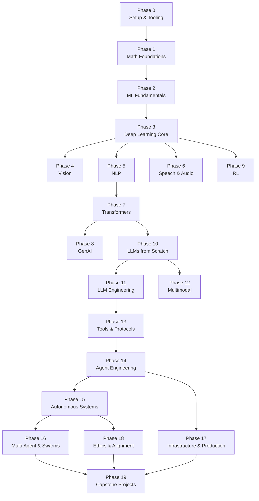
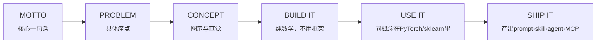

## 这份教程真正在解决什么问题

AI 学习材料的最大问题是，不是太少碎片化。一篇论文解读、一个微调教程、一个 Agent demo，各自独立，没有一条线把它们串起来。你学完可能能调用 API，但说不清楚 Attention 在模型内部做了什么；能跑通一个 RAG 流程，但不知道 tokenizer 的 BPE 分词是怎么训练的。

**AI Engineering From Scratch** 是 Rohit Gupta 构建的一条完整脊柱：从线性代数开始，到能独立构建、部署和维护一个 AI 系统结束。428 节课程，20 个阶段，覆盖 Python、TypeScript、Rust、Julia 四种语言，最终产出是 428 个可安装的工具：prompt、skill、agent、MCP server。

这是一份**工程师的训练手册**，不是入门科普。GitHub Stars 已达 8,973，Forks 1,862，MIT 协议，完全免费。

---

## 课程全貌：20 个阶段如何层层叠加

课程结构的一个关键设计：**阶段之间有明确的依赖关系，不可随意挑选模块**。Phase 0 到 Phase 19，从底层数学一直铺到最顶层的 capstone 项目，上层依赖下层，跳阶段会遭遇断层。



```python
def run(query, tools):
 history = [user(query)]
 for step in range(MAX_STEPS):
 msg = llm(history)
 if msg.tool_calls:
 for call in msg.tool_calls:
 result = tools[call.name](**call.args)
 history.append(tool_result(call.id, result))
 continue
 return msg.content
 raise StepLimitExceeded
```



```bash
git clone https://github.com/rohitg00/ai-engineering-from-scratch.git
cd ai-engineering-from-scratch
python phases/01-math-foundations/01-linear-algebra-intuition/code/vectors.py
```

/find-your-level

```python
def run(query, tools):
 history = [user(query)]
 for step in range(MAX_STEPS):
 msg = llm(history) # 步骤A
 if msg.tool_calls:
 for call in msg.tool_calls:
 result = tools[call.name](**call.args) # 步骤B
 history.append(tool_result(call.id, result))
 continue
 return msg.content # 步骤C
 raise StepLimitExceeded
```

<details>
<summary>答案</summary>

这是 **ReAct（Reasoning + Acting）** 设计模式。步骤 A 是 **Think/Reason**（模型推理下一步做什么），步骤 B 是 **Act**（执行工具调用），步骤 C 是 **Stop**（模型判断任务完成，返回最终结果）。完整循环：Observe → Think → Act → Observe → ... → Stop。所有 2026 年主流 Agent 框架的底层都在跑这个循环。
</details>

### 2. MCP 协议（Phase 13）

MCP 的全称是什么？它解决的本质问题是什么？一个 MCP 服务器至少需要实现哪两个通信方向？

<details>
<summary>答案</summary>

**MCP = Model Context Protocol**（模型上下文协议）。它解决的关键问题是：**LLM 如何以标准化的方式发现、连接和调用外部工具与数据源**——相当于 AI 世界的"USB-C 接口"。

一个 MCP 服务器至少需要实现两个通信方向：
- **Tools 方向**（Server → Client）：服务器声明自己提供哪些工具（名称、参数 Schema、描述）
- **Resources 方向**（Server → Client）：服务器暴露可读取的数据资源（文件、数据库、API 端点等）

实际实现中还包括 Prompts 模板和 Sampling 方向（Client → Server，允许服务器请求模型生成内容）。
</details>

### 3. Attention 机制（Phase 7）

在 Multi-Head Self-Attention 中，Q、K、V 分别从何而来？为什么要分成多个 Head 而不是一个大的 Attention？

<details>
<summary>答案</summary>

**Q、K、V 的来源：**
- 都来自同一个输入序列 X
- Q = X·W_Q, K = X·W_K, V = X·W_V（三个不同的可学习权重矩阵）
- Q 和 K 的点积产生注意力分数（"我应该关注哪里"），V 是实际被加权聚合的值（"那里有什么内容"）

**Multi-Head 的意义：**
单个 Attention 只能学习一种"关注模式"——比如只关注语法结构。多个 Head 并行运行，每个 Head 可以学习不同的关系模式：一个 Head 关注句法依赖，另一个关注语义相似性，再一个关注位置临近关系。最后将所有 Head 的输出拼接起来做一次线性投影，得到融合了多种"视角"的表示。这比一个大的单 Head Attention 既高效又灵活。
</details>

### 4. RLHF（Phase 10）

RLHF 训练流程的三个阶段分别是什么？DPO（Direct Preference Optimization）相比 RLHF 省掉了哪个阶段？

<details>
<summary>答案</summary>

**RLHF 三阶段：**
1. **SFT（Supervised Fine-Tuning）**：用高质量的人类指令-回答对微调基座模型
2. **Reward Model 训练**：收集人类对多个回答的偏好排序，训练一个打分模型来预测人类偏好
3. **PPO 强化学习**：用 Reward Model 作为奖励信号，通过 PPO 算法优化语言模型策略，同时加 KL 散度惩罚防止模型偏离 SFT 策略太远

**DPO 省掉了第 2 和第 3 阶段。** DPO 直接在偏好数据上优化模型，将偏好排序问题转化为一个简单的分类损失函数——不再需要单独训练 Reward Model，也不再需要 PPO 这种复杂的在线强化学习流程。DPO 的数学主要是将 RLHF 的隐式奖励函数重新参数化，使得最优策略可以直接从偏好数据中导出。
</details>

### 5. BPE 分词（Phase 10）

BPE（Byte Pair Encoding）分词算法的基本流程是什么？为什么 LLM 需要子词级别的分词而不是直接按空格切词？

<details>
<summary>答案</summary>

**BPE 基本流程：**
1. 将训练语料中每个词拆成字符序列，末尾加终止符（如 `"hello"` → `h e l l o </w>`）
2. 统计所有相邻字符对的频率
3. 将最高频的字符对合并为一个新的子词单元
4. 重复步骤 2-3，直到达到目标词表大小

**为什么需要子词分词：**
- 按空格切词会导致词表爆炸（英文有数百万形态变体）且无法处理新词（OOV 问题）
- 按字符切分则序列太长，每个 token 语义信息太少
- 子词分词在两者之间取得平衡：常见词保持完整（如 `"the"`），罕见词拆成有意义的片段（如 `"unhappiness"` → `un + happi + ness`），未知词也能用已知子词组合表示
</details>

### 6. LoRA 微调（Phase 11）

LoRA（Low-Rank Adaptation）为什么能大幅减少微调的参数量？矩阵的"低秩"特性在这里意味着什么？

<details>
<summary>答案</summary>

**重点原理：**
LoRA 不直接更新原始权重矩阵 W（d×d 维），而是在 W 旁边附加两个小矩阵 A（d×r）和 B（r×d），其中 r << d（r 通常取 8-64）。前向传播时：h = W·x + B·A·x，只训练 A 和 B。

**参数量对比：**
- 原始 W：d² 个参数（如 4096×4096 ≈ 16.8M）
- LoRA：2·d·r 个参数（如 r=16 时，2×4096×16 ≈ 131K）
- 压缩比：~128 倍

**"低秩"的含义：**
微调时模型权重的变化量ΔW 可以被一个低秩矩阵近似表示。直观理解：适配新任务不需要改动所有权重方向，只需要在少数几个"关键方向"上做调整——这就是ΔW 的秩远小于 d 的原因。A 和 B 的乘积 B·A 恰好构造了一个秩≤r 的矩阵。
</details>

### 7. RAG 全链路（Phase 11）

RAG（Retrieval-Augmented Generation）的基本流程是什么？检索模块和生成模块之间通过什么接口连接？

<details>
<summary>答案</summary>

**RAG 基本流程：**
1. **离线索引（Indexing）**：将知识库文档分块 → 用 Embedding 模型将每块编码为向量 → 存入向量数据库
2. **在线检索（Retrieval）**：用户查询 → 用同一 Embedding 模型编码查询 → 在向量数据库中做相似度搜索 → 取 Top-K 最相关文档块
3. **增强生成（Generation）**：将检索到的文档块拼入 Prompt 模板（如"根据以下参考资料回答问题：{retrieved_docs}\n\n 问题：{query}"）→ 发送给 LLM 生成答案

**检索与生成的接口：**
通过**Prompt 拼接**连接。检索模块输出的是文本片段列表，生成模块将这些片段直接插入 LLM 的上下文窗口。这种接口设计的好处是：生成模型不需要任何架构修改（不需要重新训练），任何支持长上下文的 LLM 都可以直接用作 RAG 的生成器。
</details>

---
