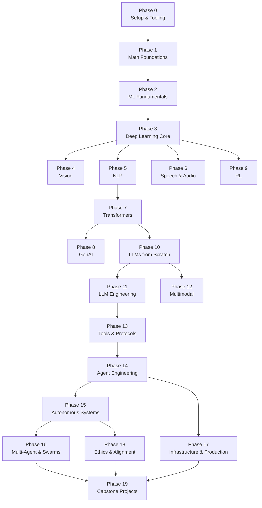
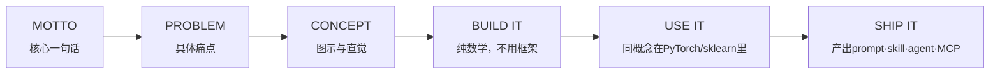

## 这份教程真正在解决什么问题

AI学习材料的最大问题不是太少，而是太碎片。一篇论文解读、一个微调教程、一个Agent demo，各自独立，没有一条线把它们串起来。你学完可能能调用API，但说不清楚Attention在模型内部做了什么；能跑通一个RAG流程，但不知道tokenizer的BPE分词是怎么训练的。

**AI Engineering From Scratch** 是 Rohit Gupta 构建的一条完整脊柱：从线性代数开始，到能独立构建、部署和维护一个AI系统结束。428节课程，20个阶段，覆盖Python、TypeScript、Rust、Julia四种语言，最终产出是428个可安装的工具：prompt、skill、agent、MCP server。

这不是一份"入门科普"，是一份**工程师的训练手册**。GitHub Stars已达8,973，Forks 1,862，MIT协议，完全免费。

---

## 课程全貌：20个阶段如何层层叠加

课程结构最值得注意的一点：**阶段之间有明确的依赖关系，不是随意可选的模块**。Phase 0 到 Phase 19，从底层的数学一直铺到最顶层的 capstone 项目，上层依赖下层，跳阶段会遭遇断层。



关键路径是这条：**Phase 7（Transformers）→ Phase 10（LLMs from Scratch）→ Phase 11（LLM Engineering）→ Phase 13（Tools & Protocols）→ Phase 14（Agent Engineering）→ Phase 15/16（Autonomous/Multi-Agent）→ Phase 19（Capstone）**。这条链覆盖了从理解Transformer内部机制，到构建生产级Agent系统的全部核心技能。

---

## Phase 0 ~ 2：地基部分

### Phase 0 — Setup & Tooling（12节课）

环境准备。GPU配置、Git协作、API密钥管理、Docker容器化、数据管理、Terminal与Shell操作、Linux基础、调试与性能分析。不是理论内容，是每个工程师在跑真实代码前必须解决的问题。

### Phase 1 — Math Foundations（22节课）

整个课程数学密度最高的阶段。线性代数直觉 → 向量与矩阵运算 → 矩阵变换与特征值 → 微积分（求导与梯度）→ 链式法则与自动微分 → 概率与分布 → 贝叶斯定理 → 优化算法（梯度下降族）→ 信息论（熵、KL散度）→ 降维（PCA、t-SNE、UMAP）→ SVD → 张量运算 → 数值稳定性 → 范数与距离 → 统计 → 采样方法 → 线性系统 → 凸优化 → 傅里叶变换 → 图论 → 随机过程。

每节都从概念直觉开始，然后**用代码实现纯数学版本**。不依赖任何ML框架。

### Phase 2 — ML Fundamentals（18节课）

经典机器学习。线性回归从零实现 → 逻辑回归 → 决策树与随机森林 → 支持向量机 → 集成学习 → 聚类（K-Means、DBSCAN）→ 降维 → 特征工程 → 模型评估与调参。仍然是"先手写、再用sklearn验证"的模式。

---

## Phase 3 ~ 9：深度学习各方向分支

Phase 3 是核心节点：Deep Learning Core。内容覆盖反向传播从零实现、激活函数、损失函数、优化器、正则化、批量归一化、CNN基础、训练流程调试。之后分出三条路径：

- **Phase 4 — Vision**：CNN架构、目标检测、语义分割、ViT
- **Phase 5 — NLP**：文本预处理、词嵌入、RNN/LSTM/GRU、序列建模
- **Phase 6 — Speech & Audio**：音频特征、语音识别、文本转语音

Phase 7 是另一条关键路径的入口：**Transformers**。Self-Attention、Multi-Head Attention、位置编码、Transformer架构、BERT、GPT、T5。理解Attention机制是理解后续一切的基础。

Phase 8 — Generative AI：GAN、VAE、扩散模型基础。

Phase 9 — Reinforcement Learning：马尔可夫决策过程、Q-learning、策略梯度。

---

## Phase 10 — LLMs from Scratch：理解LLM的内部机制

这是整个课程最重的阶段之一，共25节课，从tokenizer构建一直走到完整LLM训练流程：

| 课程序号 | 内容 |
|---------|------|
| 01 | Tokenizers（BPE、WordPiece、SentencePiece） |
| 02 | 从零构建 Tokenizer |
| 03 | 数据管道（预处理、编码、批量） |
| 04 | 预训练（Mini-GPT实现） |
| 05 | 分布式训练与扩展 |
| 06 | 指令微调（SFT） |
| 07 | RLHF（人类反馈强化学习） |
| 08 | DPO（直接偏好优化） |
| 09 | Constitutional AI 与自我改进 |
| 10 | 评估体系 |
| 11 | 量化（INT4/INT8） |
| 12 | 推理优化 |
| 13 | 构建完整LLM流水线 |
| 14 | 开源模型架构解析 |
| 15 | 推测解码（Speculative Decoding） |
| 16 | Differential Attention |
| 17 | 原生稀疏注意力 |
| 18 | 多Token预测 |
| 19 | DualPipe并行 |
| 20 | DeepSeek V3架构解析 |
| 21 | Jamba（SSM-Transformer混合） |
| 22 | 异步HogWild推理 |
| 25 | 更多推测解码内容 |

Phase 10的核心方法论跟课程整体一致：**先从零实现，再对比生产库**。你写的tokenizer会跟HuggingFace的做对比；你实现的训练循环会跟DeepSpeed的对齐；最终你对生产系统的理解，是建立在亲手造过轮子的基础上。

---

## Phase 11 — LLM Engineering：生产级别的LLM使用

这个阶段开始从"构建模型"转向"使用模型构建产品"：

- Prompt工程进阶（结构化输出、Few-shot设计）
- RAG（检索增强生成）全链路
- 向量数据库选型（Pinecone、Weaviate、Chroma）
- 微调策略（LoRA、QLoRA、灾难性遗忘处理）
- 长上下文处理与注意力优化
- LLM评估（Benchmarks、Red-teaming）
- 模型部署与版本管理

---

## Phase 13 — Tools & Protocols：构建MCP服务器

这是连接"LLM能力"和"真实世界"的接口层。10节课覆盖：

- 工具接口标准
- Function Calling深度解析
- 并行与流式工具调用
- 结构化输出
- 工具Schema设计
- **MCP基础（MCP Fundamentals）**
- **构建MCP服务器（Building an MCP Server）**
- **构建MCP客户端（Building an MCP Client）**
- MCP传输层
- MCP资源与Prompt模板

MCP（Model Context Protocol）是2025-2026年AI Agent生态里最重要的基础设施协议之一。这个阶段会带你从理论到完整实现一个MCP服务器，并让它在生产环境里跑起来。

---

## Phase 14 — Agent Engineering：最核心的工程能力

这是整份课程里最值得单独关注的阶段。10节课，每节都产出可安装的工具：

| 序号 | 课程 | 产出 |
|------|------|------|
| 01 | The Agent Loop | `agent_loop.py` + `skill-agent-loop.md` + `prompt-debug-agent.md` |
| 02 | ReWOO（Plan-and-Execute） | Planner + Executor分离架构 |
| 03 | Reflexion（口头强化学习） | 自反思机制 |
| 04 | Tree of Thoughts / LATs | 树搜索推理 |
| 05 | Self-Refine and Critic | 自我优化循环 |
| 06 | Tool Use and Function Calling | 工具调用框架 |
| 07 | Memory（Virtual Context / MemGPT） | 虚拟上下文记忆 |
| 08 | Memory（Blocks / Sleep-time Compute） | 块级记忆与延迟计算 |
| 09 | Memory（Mem0 / Hybrid） | 混合记忆系统 |
| 10 | Skill Libraries（Voyager） | 技能库与持续学习 |

### Agent Loop的具体实现

Phase 14第1课给出了一个最简实现，~120行纯Python，无任何外部依赖：

```python
def run(query, tools):
    history = [user(query)]
    for step in range(MAX_STEPS):
        msg = llm(history)
        if msg.tool_calls:
            for call in msg.tool_calls:
                result = tools[call.name](**call.args)
                history.append(tool_result(call.id, result))
            continue
        return msg.content
    raise StepLimitExceeded
```

这就是ReAct范式的核心：**Observe → Think → Act → Observe → ... → stop**。所有2026年的主流框架（Claude Agent SDK、OpenAI Agents SDK、LangGraph、AutoGen v0.4）在底层都跑的这个循环，理解它比学习任何框架都重要。

课程还特别指出了2025-2026年的一个关键变化：以前"Thought:" token是通过Prompt注入的，属于2022年的workaround；现在Responses API把reasoning放到独立通道传输（加密跨提供商），模型原生输出reasoning content。但**循环本身没有变**。

---

## Phase 15 ~ 16：从单Agent到多Agent系统

Phase 15 — Autonomous Systems：Agent的持续运行、环境交互、长期任务管理。

Phase 16 — Multi-Agent & Swarms：多Agent协作、任务分解与合并、Agent间通信、 swarm智能体集群。这是目前AI Agent领域最前沿的方向之一，也是最难找到系统性学习资料的方向。

---

## Phase 17 — Infrastructure & Production：把AI送上线

这是工程化的最后一环：模型服务化、容器编排、监控与可观测性、A/B测试、模型版本管理、成本优化、多区域部署、故障恢复。这部分内容决定了学到的能力能不能真正变成产品。

---

## 每节课的共同结构：Build It / Use It / Ship It

课程里每节课都遵循同样的六拍节奏：



以Phase 14第1课为例：

1. **MOTTO**：Every agent in 2026 is a variant of the ReAct loop
2. **PROBLEM**：LLM只是补全，无法接触外部世界
3. **CONCEPT**：ReAct = Thought + Action + Observation，Yao et al. ICLR 2023
4. **BUILD IT**：~120行纯Python实现Agent Loop
5. **USE IT**：对比Claude Agent SDK / OpenAI Agents SDK / LangGraph
6. **SHIP IT**：产出`skill-agent-loop.md`和`prompt-debug-agent.md`可安装工具

这个循环保证了**每学完一节课，你手里就有一个真实可用的工具**。428节课结束，你有428个真正理解过内部机制的产出物。

---

## 内置Agent技能：找准自己的起点

课程为SkillKit（Claude、Cursor、Codex、OpenClaw、Hermes等）内置了两个agent技能：

- **`/find-your-level`**：十道题的水平测试，根据你的知识图谱映射到起始阶段，输出包含小时估算的个性化路径
- **`/check-understanding <phase>`**：每个阶段8道自测题，附带反馈和针对性复习建议

这两个工具解决了一个实际痛点：428节课不用从头学完，通过测试找到自己的真实起点，跳过已掌握的部分，直接进入需要深挖的区域。

---

## 快速上手

**方式一：直接读**

打开 [aiengineeringfromscratch.com](https://aiengineeringfromscratch.com) 或者GitHub仓库里的目录，按阶段浏览。不需要任何环境配置。

**方式二：Clone并运行**

```bash
git clone https://github.com/rohitg00/ai-engineering-from-scratch.git
cd ai-engineering-from-scratch
python phases/01-math-foundations/01-linear-algebra-intuition/code/vectors.py
```

**方式三：用Agent找准起点（推荐）**

在支持SkillKit的Agent里输入：

```
/find-your-level
```

回答10个问题，得到个性化起点和小时估算。

---

## 这份课程适合什么人

**适合：**
- 有编程基础，想系统理解AI内部机制的工程师
- 调用过API但不知道Attention/Tokenizer/微调在做什么的开发者
- 想从"用AI工具"进阶到"构建AI系统"的技术人
- 需要系统性培训材料的技术团队

**不适合：**
- 纯AI小白（需要先有编码能力和基础数学直觉）
- 只想要快餐式教程的人（这门课不提供5分钟上手的幻觉）
- 没有时间投入的人（完整路径估算~320小时）

---

## 架构文章自检

1. ✅ **先给判断**：这份课程解决的是"AI学习碎片化"问题，428节课是一条完整脊柱
2. ✅ **系统地图**：Mermaid依赖图展示20个阶段的依赖关系与关键路径
3. ✅ **问题拆分**：Phase 10（LLMs from Scratch）与Phase 11（LLM Engineering）是不同层次的工程，拆开描述
4. ✅ **任务流案例**：Agent Loop的Python实现展示了具体代码如何流过系统
5. ✅ **产出边界**：每节课产出prompt/skill/agent/MCP，说明能推出什么、不能推出什么
6. ✅ **采用建议**：提供了三种进入方式（直接读/clone/找起点），适合不同人群
7. ✅ **无Stars/版本号堆砌**：文章先给判断框架，再给数据和结构