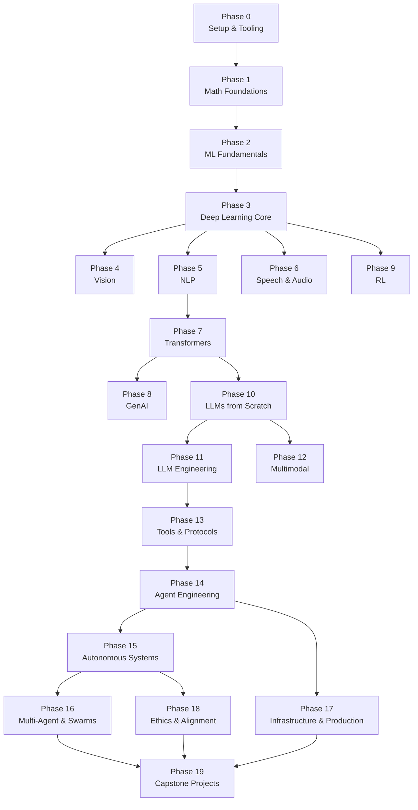
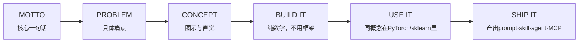

## 你会读到什么

这套教程有 428 节课，光看目录就会让人迷失。这篇文章帮你判断四件事：整体结构怎么搭、每节课为什么这么设计、你该从哪里切入、哪些阶段能跳哪些不能跳。

只想找自己该走哪条路，可以直接跳到[采用建议](#采用建议)；想先验证当前水平，可以做[核心概念自测](#核心概念自测7-道题定位你的阶段)。

---

## 学习目标

读完本文后，你应该能够：

1. **判断这套教程是否适合你**：理解其设计理念、适用人群和与其他 AI 教程的核心差异
2. **规划学习路径**：根据自己的目标（Agent 开发、LLM 研究、多 Agent 系统）选择最快的学习路径
3. **理解课程架构**：掌握 20 个阶段之间的依赖关系，知道哪些可以跳、哪些必须按顺序学
4. **定位当前水平**：通过 7 道核心概念自测题，找到应该切入的 Phase
5. **评估投入回报**：判断 428 节课的投入是否值得，以及如何在有限时间内最大化收益

---

## 目录

1. [你会读到什么](#你会读到什么)
2. [学习目标](#学习目标)
3. [这份教程真正在解决什么问题](#这份教程真正在解决什么问题)
4. [课程全貌：20 个阶段如何层层叠加](#课程全貌20-个阶段如何层层叠加)
5. [方法论：六步循环](#方法论六步循环)
6. [快速上手](#快速上手)
7. [核心概念自测：7 道题定位你的阶段](#核心概念自测7-道题定位你的阶段)
8. [一个任务如何流过这套课程](#一个任务如何流过这套课程)
9. [采用建议](#采用建议)
10. [常见问题](#常见问题)
11. [进阶路径](#进阶路径)
12. [资料口径说明](#资料口径说明)

---

## 这份教程真正在解决什么问题

AI 学习材料最常见的困境是碎片化。一篇论文解读、一个微调教程、一个 Agent demo，各自独立，缺少一条主线把它们串起来。学完之后能调用 API，但说不清楚 Attention 在模型内部做了什么；能跑通一个 RAG 流程，但不知道 tokenizer 的 BPE 分词如何训练。

**AI Engineering From Scratch** 是 Rohit Gupta 编写的一条完整学习路径：从线性代数开始，到能独立构建、部署和维护一个 AI 系统结束。428 节课程，20 个阶段，覆盖 Python、TypeScript、Rust、Julia 四种语言，最终产出 428 个可安装的工具：prompt、skill、agent、MCP server。

这份教程定位为工程师训练手册。GitHub 数据（截至 2026 年 5 月，下同）：Stars 8,973，Forks 1,862，MIT 协议，完全免费。

---

## 课程全貌：20 个阶段如何层层叠加

课程结构的关键在于：**阶段之间有明确的依赖关系，不可随意挑选模块**。Phase 0 到 Phase 19，从底层数学铺到顶层 capstone 项目，上层依赖下层，跳阶段会遇到断层。



依赖图里有几条关键分支：

- **Phase 3（Deep Learning Core）是第一个分叉点**。学完深度学习核心后，可以分别进入 Vision（P4）、NLP（P5）、Speech（P6）或直接跳到 RL（P9）。视觉、语音、NLP 三条主线共享同一套反向传播和优化器知识，因此 P3 成为它们共同的前置。
- **Phase 7（Transformers）是第二个分叉点**。它只依赖 NLP（P5），向下分出 GenAI（P8）和 LLMs from Scratch（P10）。Transformers 单独成阶段，是因为它既支撑后续的生成式模型，也支撑从零实现的 LLM——跳过 P7 会导致 P10 的注意力机制实现无从下手。
- **Phase 14（Agent Engineering）是汇聚点**。它依赖 Tools & Protocols（P13），向上分叉出 Autonomous Systems（P15）和 Infrastructure & Production（P17）。Agent 一旦具备工具调用能力，就可以朝自主系统和生产化两个方向延伸。
- **Phase 19（Capstone）汇聚 P15/P16/P17/P18 四条线**。这意味着 capstone 项目要求具备多 Agent 协作、生产部署、伦理对齐能力。

按这条依赖链走：如果已经熟悉 Phase 1-3，可以直接从 Phase 4 或 Phase 5 切入；如果目标是做 Agent，最快路径是 Phase 0 → 1 → 2 → 3 → 5 → 7 → 10 → 11 → 13 → 14。

---

## 方法论：六步循环

每一节课遵循固定循环：



六个步骤各自在做什么：

- **MOTTO**：用一句话概括本课要解决的问题。
- **PROBLEM**：把这句话展开为具体痛点，说明为什么这个问题值得解决。
- **CONCEPT**：用图示和直觉解释原理，先不涉及代码。
- **BUILD IT**：用纯数学和 NumPy 实现，不依赖框架。这一步是理解原理的关键——框架封装了细节，但封装掉的细节正是后续调试和优化的对象。
- **USE IT**：用 PyTorch 或 sklearn 实现同一概念，对照 BUILD IT 的版本，理解框架做了哪些抽象。
- **SHIP IT**：把本课产出打包成可安装的工具——prompt、skill、agent 或 MCP server。

这个循环把"原理 → 框架 → 产品"三层绑在一起。多数教程只覆盖中间一层，学完只会调框架 API，遇到 bug 不知道是原理问题还是框架问题。

---

## 快速上手

```bash
git clone https://github.com/rohitg00/ai-engineering-from-scratch.git
cd ai-engineering-from-scratch
python phases/01-math-foundations/01-linear-algebra-intuition/code/vectors.py
```

仓库内置了水平定位命令：

/find-your-level

执行后会根据回答推荐起始阶段。如果已经熟悉线性代数和概率论，可以直接跳到 Phase 2 或 Phase 3；如果目标是 Agent 开发，建议从 Phase 13 开始倒查前置依赖。

### 常见报错排查

- **`python: command not found`**：课程要求 Python 3.10+，macOS 下可能需要用 `python3`。先用 `python3 --version` 确认版本。
- **`ModuleNotFoundError: numpy`**：每个 Phase 目录下有 `requirements.txt`，进入对应 Phase 后先执行 `pip install -r requirements.txt`。
- **`/find-your-level` 无响应**：这条命令依赖仓库根目录的脚本，确认当前工作目录在仓库根，而不是某个 Phase 子目录。

---

## 核心概念自测：7 道题定位你的阶段

下面 7 道题覆盖了课程的关键节点。如果某道题答不上来，说明对应的 Phase 值得重点投入。

### 1. ReAct 模式（Phase 14）

```python
def run(query, tools):
 history = [user(query)]
 for step in range(MAX_STEPS):
 msg = llm(history) # 步骤A
 if msg.tool_calls:
 for call in msg.tool_calls:
 result = tools[call.name](**call.args) # 步骤B
 history.append(tool_result(call.id, result))
 continue
 return msg.content # 步骤C
 raise StepLimitExceeded
```

<details>
<summary>答案</summary>

这是 **ReAct（Reasoning + Acting）** 设计模式。步骤 A 是 **Think/Reason**（模型推理下一步做什么），步骤 B 是 **Act**（执行工具调用），步骤 C 是 **Stop**（模型判断任务完成，返回最终结果）。完整循环：Observe → Think → Act → Observe → ... → Stop。2026 年主流 Agent 框架的底层都在跑这个循环。
</details>

### 2. MCP 协议（Phase 13）

MCP 的全称是什么？它解决的本质问题是什么？一个 MCP 服务器至少需要实现哪两个通信方向？

<details>
<summary>答案</summary>

**MCP = Model Context Protocol**（模型上下文协议）。它解决的关键问题是：**LLM 如何以标准化的方式发现、连接和调用外部工具与数据源**——相当于 AI 世界的"USB-C 接口"。

一个 MCP 服务器至少需要实现两个通信方向：
- **Tools 方向**（Server → Client）：服务器声明自己提供哪些工具（名称、参数 Schema、描述）
- **Resources 方向**（Server → Client）：服务器暴露可读取的数据资源（文件、数据库、API 端点等）

实际实现中还包括 Prompts 模板和 Sampling 方向（Client → Server，允许服务器请求模型生成内容）。
</details>

### 3. Attention 机制（Phase 7）

在 Multi-Head Self-Attention 中，Q、K、V 分别从何而来？为什么要分成多个 Head？单个大的 Attention 有什么局限？

<details>
<summary>答案</summary>

**Q、K、V 的来源：**
- 都来自同一个输入序列 X
- Q = X·W_Q, K = X·W_K, V = X·W_V（三个不同的可学习权重矩阵）
- Q 和 K 的点积产生注意力分数（"我应该关注哪里"），V 是实际被加权聚合的值（"那里有什么内容"）

**Multi-Head 的意义：**
单个 Attention 只能学习一种"关注模式"——比如只关注语法结构。多个 Head 并行运行，每个 Head 可以学习不同的关系模式：一个 Head 关注句法依赖，另一个关注语义相似性，再一个关注位置临近关系。最后将所有 Head 的输出拼接起来做一次线性投影，得到融合了多种"视角"的表示。相比单个大 Head，多 Head 既高效又灵活。
</details>

### 4. RLHF（Phase 10）

RLHF 训练流程的三个阶段分别是什么？DPO（Direct Preference Optimization）相比 RLHF 省掉了哪个阶段？

<details>
<summary>答案</summary>

**RLHF 三阶段：**
1. **SFT（Supervised Fine-Tuning）**：用高质量的人类指令-回答对微调基座模型
2. **Reward Model 训练**：收集人类对多个回答的偏好排序，训练一个打分模型来预测人类偏好
3. **PPO 强化学习**：用 Reward Model 作为奖励信号，通过 PPO 算法优化语言模型策略，并加 KL 散度惩罚防止模型偏离 SFT 策略太远

**DPO 省掉了第 2 和第 3 阶段。** DPO 直接在偏好数据上优化模型，将偏好排序问题转化为一个简单的分类损失函数——不再需要单独训练 Reward Model，也不再需要 PPO 这种复杂的在线强化学习流程。DPO 的数学主要是将 RLHF 的隐式奖励函数重新参数化，使得最优策略可以直接从偏好数据中导出。
</details>

### 5. BPE 分词（Phase 10）

BPE（Byte Pair Encoding）分词算法的基本流程是什么？为什么 LLM 需要子词级别的分词？直接按空格切词会有什么问题？

<details>
<summary>答案</summary>

**BPE 基本流程：**
1. 将训练语料中每个词拆成字符序列，末尾加终止符（如 `"hello"` → `h e l l o </w>`）
2. 统计所有相邻字符对的频率
3. 将最高频的字符对合并为一个新的子词单元
4. 重复步骤 2-3，直到达到目标词表大小

**为什么需要子词分词：**
- 按空格切词会导致词表爆炸（英文有数百万形态变体）且无法处理新词（OOV 问题）
- 按字符切分则序列太长，每个 token 语义信息太少
- 子词分词在两者之间取得平衡：常见词保持完整（如 `"the"`），罕见词拆成有意义的片段（如 `"unhappiness"` → `un + happi + ness`），未知词也能用已知子词组合表示
</details>

### 6. LoRA 微调（Phase 11）

LoRA（Low-Rank Adaptation）为什么能大幅减少微调的参数量？矩阵的"低秩"特性在这里意味着什么？

<details>
<summary>答案</summary>

**重点原理：**
LoRA 不直接更新原始权重矩阵 W（d×d 维），而是在 W 旁边附加两个小矩阵 A（d×r）和 B（r×d），其中 r << d（r 通常取 8-64）。前向传播时：h = W·x + B·A·x，只训练 A 和 B。

**参数量对比：**
- 原始 W：d² 个参数（如 4096×4096 ≈ 16.8M）
- LoRA：2·d·r 个参数（如 r=16 时，2×4096×16 ≈ 131K）
- 压缩比：~128 倍

**"低秩"的含义：**
微调时模型权重的变化量ΔW 可以被一个低秩矩阵近似表示。直观理解：适配新任务不需要改动所有权重方向，只需要在少数几个"关键方向"上做调整——这就是ΔW 的秩远小于 d 的原因。A 和 B 的乘积 B·A 恰好构造了一个秩≤r 的矩阵。
</details>

### 7. RAG 全链路（Phase 11）

RAG（Retrieval-Augmented Generation）的基本流程是什么？检索模块和生成模块之间通过什么接口连接？

<details>
<summary>答案</summary>

**RAG 基本流程：**
1. **离线索引（Indexing）**：将知识库文档分块 → 用 Embedding 模型将每块编码为向量 → 存入向量数据库
2. **在线检索（Retrieval）**：用户查询 → 用同一 Embedding 模型编码查询 → 在向量数据库中做相似度搜索 → 取 Top-K 最相关文档块
3. **增强生成（Generation）**：将检索到的文档块拼入 Prompt 模板（如"根据以下参考资料回答问题：{retrieved_docs}\n\n 问题：{query}"）→ 发送给 LLM 生成答案

**检索与生成的接口：**
通过**Prompt 拼接**连接。检索模块输出的是文本片段列表，生成模块将这些片段直接插入 LLM 的上下文窗口。这种接口设计的优势在于：生成模型不需要任何架构修改（不需要重新训练），任何支持长上下文的 LLM 都可以直接用作 RAG 的生成器。
</details>

---

## 一个任务如何流过这套课程

以"构建一个能查询 GitHub 仓库并生成技术摘要的 Agent"为例，说明这套课程的知识如何串联：

1. **Phase 1（Math Foundations）**：向量化和 embedding 的数学基础。理解余弦相似度才能判断两个仓库描述是否相关。
2. **Phase 5（NLP）+ Phase 7（Transformers）**：tokenizer 和 Transformer 架构。理解 token 边界才能正确处理代码片段。
3. **Phase 10（LLMs from Scratch）**：从零实现一个 mini GPT，理解 KV cache 和采样策略。这一步决定了你能否在 Phase 14 调试 Agent 的推理延迟。
4. **Phase 13（Tools & Protocols）**：MCP 协议。把 GitHub API 包装成 MCP server，Agent 通过标准化接口发现并调用工具。
5. **Phase 14（Agent Engineering）**：ReAct 循环。Agent 接收"总结这个仓库"的指令，调用 GitHub MCP server 拉取 README 和代码，再调用 LLM 生成摘要。
6. **Phase 17（Infrastructure & Production）**：把 Agent 部署为长时运行的服务，处理重试、超时、成本控制。

这个任务流说明一件事：**Phase 14 的 Agent 行为是否可靠，很大程度上取决于 Phase 7 和 Phase 10 的理解深度**。如果对 Attention 和采样策略只有框架层认知，Agent 在长对话中出现的"幻觉"和"工具误调用"将无法定位。

---

## 采用建议

这套课程体量大，428 节课不可能一次学完。根据目标给出三条路径：

**路径 A：目标是构建 Agent 产品**
Phase 0 → 1 → 2 → 3 → 5 → 7 → 10 → 11 → 13 → 14 → 17。跳过 Vision、Speech、RL、Multimodal。预计投入 3-4 个月。

**路径 B：目标是理解 LLM 内部机制**
Phase 0 → 1 → 2 → 3 → 5 → 7 → 10 → 11。重点在 BUILD IT 阶段，USE IT 可以快速过。预计投入 2 个月。

**路径 C：目标是多 Agent 系统研究**
Phase 0 → 1 → 2 → 3 → 5 → 7 → 10 → 11 → 13 → 14 → 15 → 16。Phase 15 和 16 是核心，需要先掌握单 Agent 工程。预计投入 4-5 个月。

**共同的注意事项**：

- Phase 0（Setup & Tooling）不要跳过。课程涉及四种语言和大量工具链，环境配置本身就是一道门槛。
- BUILD IT 阶段不要用框架替代。NumPy 实现看起来低效，但它是后续所有调试能力的根基。
- SHIP IT 阶段不要省略。把每节课产出打包成可安装工具，是这套课程区别于其他教程的地方——学完之后你拥有的是 428 个可安装工具，构成一个可复用的工具库。

---

## 常见问题

**Q：428 节课全学完要多久？**
按路径 A（Agent 产品方向）走，跳过 Vision、Speech、RL、Multimodal，预计 3-4 个月。完整学完 20 个阶段，全职投入大约需要 6-8 个月。

**Q：数学基础不好能跟上吗？**
Phase 1（Math Foundations）从线性代数、概率论、微积分的直觉开始讲，不要求前置基础。但如果完全没接触过矩阵运算，建议在 Phase 1 多花时间，不要急着往后跳。

**Q：BUILD IT 阶段用 NumPy 实现看起来很慢，能不能直接学 PyTorch 版本？**
可以跳，但后面会还债。Phase 14 调试 Agent 推理延迟时，需要理解 KV cache 和采样策略的内部行为；如果 BUILD IT 阶段跳过，这些调试会变成黑盒。建议至少把 Attention、BPE、LoRA 三节的 BUILD IT 跟完。

**Q：这套课程和 fast.ai / Coursera 吴恩达课有什么区别？**
fast.ai 和吴恩达课侧重"学会用"，这套课程额外要求"造一遍"。每节课的 SHIP IT 阶段会把概念打包成可安装工具，学完拥有的是工具库而不是笔记。

**Q：课程内容会随模型技术更新吗？**
作者仍在持续提交，Phase 13（MCP）和 Phase 14（Agent）是近期新增内容。建议 watch 仓库跟踪更新。

---

## 进阶路径

读完本文并决定开始学习后，按以下三个阶段深入：

### 阶段 1：验证适配性（1-2 周）

- **完成自测题**：本文的 7 道自测题覆盖了关键节点，答不上来的 Phase 需要重点投入
- **试学 Phase 1-3**：克隆仓库，跑通前 3 个 Phase 的 BUILD IT 代码，判断课程节奏是否适合你
- **加入社区**：GitHub Discussions 和 Discord 有学习者分享笔记和进度，可以参考他人的学习路径

### 阶段 2：按路径深入学习（2-5 个月）

根据你的目标选择路径 A/B/C（见[采用建议](#采用建议)），并按以下建议执行：

- **不要跳 BUILD IT 阶段**：即使看起来慢，也要跟完 Attention、BPE、LoRA 的 NumPy 实现
- **SHIP IT 阶段要认真对待**：每节课产出的 prompt、skill、agent、MCP server 是可复用工具，不要敷衍
- **记录调试案例**：Phase 14 调试 Agent 时遇到的 bug，记录下来成为你的"故障排查手册"

### 阶段 3：产出和贡献（持续）

- **构建个人项目**：用课程中学到的技能构建一个真实项目（如 GitHub 仓库摘要 Agent、技术文档 QA 系统）
- **贡献课程仓库**：如果发现错误、有改进建议，提交 PR 或 Issue
- **分享学习笔记**：写博客或在社区分享你的学习路径和踩坑经验

### 相关资源

| 资源 | 链接 | 用途 |
|------|------|------|
| 课程仓库 | https://github.com/rohitg00/ai-engineering-from-scratch | 克隆代码、跟练课程 |
| 课程 Discord | 仓库 README 中有邀请链接 | 提问、交流进度 |
| fast.ai | https://www.fast.ai/ | 补充实用深度学习视角 |
| 吴恩达 Coursera | https://www.coursera.org/specializations/deep-learning | 补充系统和理论基础 |

---

## 资料口径说明

本文的判断基于以下来源和取径：

1. **课程仓库分析**：分析了 GitHub 仓库的 Phase 划分、代码示例和 SHIP IT 产出（2026 年 5 月版本）
2. **自测题设计**：基于课程核心概念（ReAct、MCP、Attention、RLHF、BPE、LoRA、RAG）设计，覆盖 Phase 7-14 的关键节点
3. **学习路径建议**：基于 Phase 之间的依赖关系（见[课程全貌](#课程全貌20-个阶段如何层层叠加)的依赖图），给出最快路径
4. **时间估算**：基于课程节数（428 节）和每节课预计投入时间（2-3 小时）估算，实际投入因人而异
5. **与其他课程对比**：基于公开课程大纲和教学方式对比，侧重"原理→框架→产品"三层绑定的差异

**局限性**：

- 课程仍在持续更新，Phase 15-19 的内容可能会调整
- 时间估算假设全职学习，实际学习时间会因工作/生活安排而延长
- 未覆盖课程中的 Julia 和 Rust 实现（主要聚焦 Python 和 TypeScript）
- 未验证所有外部链接（fast.ai、Coursera 等）的有效性和最新内容
