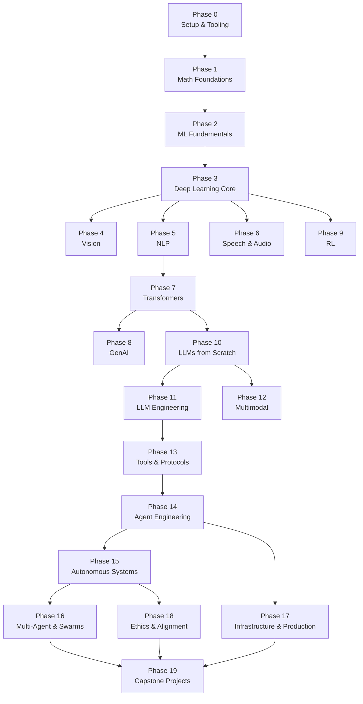
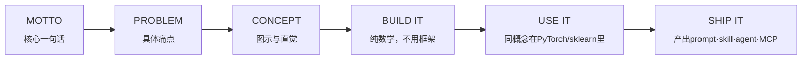

## 这份教程真正在解决什么问题

AI 学习材料的最大问题不是太少，而是碎片化。一篇论文解读、一个微调教程、一个 Agent demo，各自独立，没有一条线把它们串起来。你学完可能能调用 API，但说不清楚 Attention 在模型内部做了什么；能跑通一个 RAG 流程，但不知道 tokenizer 的 BPE 分词是怎么训练的。

**AI Engineering From Scratch** 是 Rohit Gupta 构建的一条完整脊柱：从线性代数开始，到能独立构建、部署和维护一个 AI 系统结束。428 节课程，20 个阶段，覆盖 Python、TypeScript、Rust、Julia 四种语言，最终产出是 428 个可安装的工具：prompt、skill、agent、MCP server。

这不是一份入门科普，是一份**工程师的训练手册**。GitHub Stars 已达 8,973，Forks 1,862，MIT 协议，完全免费。

---

## 课程全貌：20 个阶段如何层层叠加

课程结构的一个关键设计：**阶段之间有明确的依赖关系，不可随意挑选模块**。Phase 0 到 Phase 19，从底层数学一直铺到最顶层的 capstone 项目，上层依赖下层，跳阶段会遭遇断层。



关键路径是这条：**Phase 7（Transformers）→ Phase 10（LLMs from Scratch）→ Phase 11（LLM Engineering）→ Phase 13（Tools & Protocols）→ Phase 14（Agent Engineering）→ Phase 15/16（Autonomous/Multi-Agent）→ Phase 19（Capstone）**。这条链覆盖了从理解 Transformer 内部机制，到构建生产级 Agent 系统的全部核心技能。

---

## Phase 0 ~ 2：地基部分

### Phase 0 — Setup & Tooling（12 节课）

环境准备。GPU 配置、Git 协作、API 密钥管理、Docker 容器化、数据管理、Terminal 与 Shell 操作、Linux 基础、调试与性能分析。不是理论内容，是每个工程师在跑真实代码前必须解决的问题。

### Phase 1 — Math Foundations（22 节课）

整个课程数学密度最高的阶段。线性代数直觉 → 向量与矩阵运算 → 矩阵变换与特征值 → 微积分（求导与梯度）→ 链式法则与自动微分 → 概率与分布 → 贝叶斯定理 → 优化算法（梯度下降族）→ 信息论（熵、KL 散度）→ 降维（PCA、t-SNE、UMAP）→ SVD → 张量运算 → 数值稳定性 → 范数与距离 → 统计 → 采样方法 → 线性系统 → 凸优化 → 傅里叶变换 → 图论 → 随机过程。

每节都从概念直觉开始，然后**用代码实现纯数学版本**。不依赖任何 ML 框架。

### Phase 2 — ML Fundamentals（18 节课）

经典机器学习。线性回归从零实现 → 逻辑回归 → 决策树与随机森林 → 支持向量机 → 集成学习 → 聚类（K-Means、DBSCAN）→ 降维 → 特征工程 → 模型评估与调参。仍然是"先手写、再用 sklearn 验证"的模式。

---

## Phase 3 ~ 9：深度学习各方向分支

Phase 3 是核心节点：Deep Learning Core。内容覆盖反向传播从零实现、激活函数、损失函数、优化器、正则化、批量归一化、CNN 基础、训练流程调试。之后分出三条路径：

- **Phase 4 — Vision**：CNN 架构、目标检测、语义分割、ViT
- **Phase 5 — NLP**：文本预处理、词嵌入、RNN/LSTM/GRU、序列建模
- **Phase 6 — Speech & Audio**：音频特征、语音识别、文本转语音

Phase 7 是另一条关键路径的入口：**Transformers**。Self-Attention、Multi-Head Attention、位置编码、Transformer 架构、BERT、GPT、T5。理解 Attention 机制是理解后续一切的基础。

Phase 8 — Generative AI：GAN、VAE、扩散模型基础。

Phase 9 — Reinforcement Learning：马尔可夫决策过程、Q-learning、策略梯度。

---

## Phase 10 — LLMs from Scratch：理解 LLM 的内部机制

这是整个课程最重的阶段之一，共 25 节课，从 tokenizer 构建一直走到完整 LLM 训练流程：

| 课程序号 | 内容 |
|---------|------|
| 01 | Tokenizers（BPE、WordPiece、SentencePiece） |
| 02 | 从零构建 Tokenizer |
| 03 | 数据管道（预处理、编码、批量） |
| 04 | 预训练（Mini-GPT 实现） |
| 05 | 分布式训练与扩展 |
| 06 | 指令微调（SFT） |
| 07 | RLHF（人类反馈强化学习） |
| 08 | DPO（直接偏好优化） |
| 09 | Constitutional AI 与自我改进 |
| 10 | 评估体系 |
| 11 | 量化（INT4/INT8） |
| 12 | 推理优化 |
| 13 | 构建完整 LLM 流水线 |
| 14 | 开源模型架构解析 |
| 15 | 推测解码（Speculative Decoding） |
| 16 | Differential Attention |
| 17 | 原生稀疏注意力 |
| 18 | 多 Token 预测 |
| 19 | DualPipe 并行 |
| 20 | DeepSeek V3 架构解析 |
| 21 | Jamba（SSM-Transformer 混合） |
| 22 | 异步 HogWild 推理 |
| 25 | 更多推测解码内容 |

Phase 10 的核心方法论跟课程整体一致：**先从零实现，再对比生产库**。你写的 tokenizer 会跟 HuggingFace 的做对比；你实现的训练循环会跟 DeepSpeed 的对齐；最终你对生产系统的理解，是建立在亲手造过轮子的基础上。

---

## Phase 11 — LLM Engineering：生产级别的 LLM 使用

这个阶段开始从"构建模型"转向"使用模型构建产品"：

- Prompt 工程进阶（结构化输出、Few-shot 设计）
- RAG（检索增强生成）全链路
- 向量数据库选型（Pinecone、Weaviate、Chroma）
- 微调策略（LoRA、QLoRA、灾难性遗忘处理）
- 长上下文处理与注意力优化
- LLM 评估（Benchmarks、Red-teaming）
- 模型部署与版本管理

---

## Phase 13 — Tools & Protocols：构建 MCP 服务器

这是连接"LLM 能力"和"真实世界"的接口层。10 节课覆盖：

- 工具接口标准
- Function Calling 深度解析
- 并行与流式工具调用
- 结构化输出
- 工具 Schema 设计
- **MCP 基础（MCP Fundamentals）**
- **构建 MCP 服务器（Building an MCP Server）**
- **构建 MCP 客户端（Building an MCP Client）**
- MCP 传输层
- MCP 资源与 Prompt 模板

MCP（Model Context Protocol）是 2025-2026 年 AI Agent 生态里最重要的基础设施协议之一。这个阶段会带你从理论到完整实现一个 MCP 服务器，并让它在生产环境里跑起来。

---

## Phase 14 — Agent Engineering：最核心的工程能力

这是整份课程里需要单独拆解来看的阶段。10 节课，每节都产出可安装的工具：

| 序号 | 课程 | 产出 |
|------|------|------|
| 01 | The Agent Loop | `agent_loop.py` + `skill-agent-loop.md` + `prompt-debug-agent.md` |
| 02 | ReWOO（Plan-and-Execute） | Planner + Executor 分离架构 |
| 03 | Reflexion（口头强化学习） | 自反思机制 |
| 04 | Tree of Thoughts / LATs | 树搜索推理 |
| 05 | Self-Refine and Critic | 自我优化循环 |
| 06 | Tool Use and Function Calling | 工具调用框架 |
| 07 | Memory（Virtual Context / MemGPT） | 虚拟上下文记忆 |
| 08 | Memory（Blocks / Sleep-time Compute） | 块级记忆与延迟计算 |
| 09 | Memory（Mem0 / Hybrid） | 混合记忆系统 |
| 10 | Skill Libraries（Voyager） | 技能库与持续学习 |

### Agent Loop 的具体实现

Phase 14 第 1 课给出了一个最简实现，~120 行纯 Python，无任何外部依赖：

```python
def run(query, tools):
    history = [user(query)]
    for step in range(MAX_STEPS):
        msg = llm(history)
        if msg.tool_calls:
            for call in msg.tool_calls:
                result = tools[call.name](**call.args)
                history.append(tool_result(call.id, result))
            continue
        return msg.content
    raise StepLimitExceeded
```

这就是 ReAct 范式的核心：**Observe → Think → Act → Observe → ... → stop**。所有 2026 年的主流框架（Claude Agent SDK、OpenAI Agents SDK、LangGraph、AutoGen v0.4）在底层都跑的这个循环，理解它比学习任何框架都重要。

课程还特别指出了 2025-2026 年的一个关键变化：以前"Thought:" token 是通过 Prompt 注入的，属于 2022 年的 workaround；现在 Responses API 把 reasoning 放到独立通道传输（加密跨提供商），模型原生输出 reasoning content。但**循环本身没有变**。

---

## Phase 15 ~ 16：从单 Agent 到多 Agent 系统

Phase 15 — Autonomous Systems：Agent 的持续运行、环境交互、长期任务管理。

Phase 16 — Multi-Agent & Swarms：多 Agent 协作、任务分解与合并、Agent 间通信、 swarm 智能体集群。这是目前 AI Agent 领域最前沿的方向之一，也是最难找到系统性学习资料的方向。

---

## Phase 17 — Infrastructure & Production：把 AI 送上线

这是工程化的最后一环：模型服务化、容器编排、监控与可观测性、A/B 测试、模型版本管理、成本优化、多区域部署、故障恢复。这部分内容决定了学到的能力能不能真正变成产品。

---

## 每节课的共同结构：Build It / Use It / Ship It

课程里每节课都遵循同样的六拍节奏：



以 Phase 14 第 1 课为例：

1. **MOTTO**：Every agent in 2026 is a variant of the ReAct loop
2. **PROBLEM**：LLM 只是补全，无法接触外部世界
3. **CONCEPT**：ReAct = Thought + Action + Observation，Yao et al. ICLR 2023
4. **BUILD IT**：~120 行纯 Python 实现 Agent Loop
5. **USE IT**：对比 Claude Agent SDK / OpenAI Agents SDK / LangGraph
6. **SHIP IT**：产出`skill-agent-loop.md`和`prompt-debug-agent.md`可安装工具

这个循环保证了**每学完一节课，你手里就有一个真实可用的工具**。428 节课结束，你有 428 个真正理解过内部机制的产出物。

---

## 内置 Agent 技能：找准自己的起点

课程为 SkillKit（Claude、Cursor、Codex、OpenClaw、Hermes 等）内置了两个 agent 技能：

- **`/find-your-level`**：十道题的水平测试，根据你的知识图谱映射到起始阶段，输出包含小时估算的个性化路径
- **`/check-understanding <phase>`**：每个阶段 8 道自测题，附带反馈和针对性复习建议

这两个工具瞄准了一个实际问题：428 节课不用从头学完，通过测试找到自己的真实起点，跳过已掌握的部分，直接进入需要深挖的区域。

---

## 快速上手

**方式一：直接读**

打开 [aiengineeringfromscratch.com](https://aiengineeringfromscratch.com) 或者 GitHub 仓库里的目录，按阶段浏览。不需要任何环境配置。

**方式二：Clone 并运行**

```bash
git clone https://github.com/rohitg00/ai-engineering-from-scratch.git
cd ai-engineering-from-scratch
python phases/01-math-foundations/01-linear-algebra-intuition/code/vectors.py
```

**方式三：用 Agent 找准起点（推荐）**

在支持 SkillKit 的 Agent 里输入：

```
/find-your-level
```

回答 10 个问题，得到个性化起点和小时估算。

---

## 这份课程适合什么人

**适合：**
- 有编程基础，想系统理解 AI 内部机制的工程师
- 调用过 API 但不知道 Attention/Tokenizer/微调在做什么的开发者
- 想从"用 AI 工具"进阶到"构建 AI 系统"的技术人
- 需要系统性培训材料的技术团队

**不适合：**
- 纯 AI 小白（需要先有编码能力和基础数学直觉）
- 只想要快餐式教程的人（这门课不提供 5 分钟上手的幻觉）
- 没有时间投入的人（完整路径估算~320 小时）

---

## 常见问题（FAQ）

### Q1：完整学完 20 个阶段需要多少时间？

完整路径官方估算约 320 小时。按每天投入 2 小时计算，大约需要 5-6 个月。实际时间取决于你的起点：如果你已经掌握线性代数和 Python，Phase 0-2 可以压缩到一周以内；如果从零开始，数学基础部分（Phase 1）本身就需要 30-50 小时。课程内置的 `/find-your-level` 会根据你的知识图谱给出个性化的小时估算，比一刀切的数字更有参考意义。

### Q2：需要什么前置知识？

**硬性要求：** 编程能力——至少能用 Python 熟练写函数、处理数据结构、操作文件。Phase 0-2 会带你补齐数学和经典 ML，但不会教你写 for 循环。

**有帮助但不强制：** 大学层次的线性代数（矩阵运算、特征值）和概率论（贝叶斯、分布）。如果你全忘了，Phase 1 会从直觉层面重建这些概念，但进度会比有基础的人慢。

**不需要：** 深度学习经验、PyTorch 熟悉度、任何 LLM 使用经验。课程假设你从这些领域的零基础开始。

### Q3：和吴恩达的 DeepLearning.AI、CS229、Fast.ai 有什么区别？

最根本的区别在于**教学哲学**：

| 维度 | AI Engineering From Scratch | DeepLearning.AI / CS229 | Fast.ai |
|------|---------------------------|------------------------|---------|
| 核心方法 | 先手写实现，再对比框架 | 先讲理论，再用框架验证 | 先跑起来，再理解底层 |
| 语言覆盖 | Python、TypeScript、Rust、Julia | Python 为主 | Python |
| 产出物 | 428 个可安装工具 | Jupyter Notebook 练习 | 训练好的模型 |
| 工程深度 | 到生产部署和多 Agent 系统 | 到模型训练 | 到模型训练与调优 |
| 适合人群 | 想构建 AI 系统的工程师 | 想入门 ML/AI 的学习者 | 想快速出结果的实践者 |

吴恩达的课程更适合"理解 AI 能做什么"；Fast.ai 更适合"快速做出东西"；本课程更适合"理解每一个组件是怎么工作的，并且能自己造出来"。三者不互斥，很多学习者会交叉使用。

### Q4：能不能跳过数学部分（Phase 1）直接学 Agent？

**不建议。** Phase 1 的数学直觉在后续阶段会反复用到：理解 Attention 需要矩阵乘法的直觉（Q·K^T 在做什么），理解 RLHF 需要 KL 散度的概念（约束策略不要偏离太远），理解扩散模型需要概率分布的直觉。没有这些基础，你能跑通代码，但无法 debug，也无法举一反三。

如果你已经有扎实的数学基础，`/find-your-level` 测试会让你跳过已掌握的部分。但跳过不等于不需要——测试的目的是定位，不是回避。

### Q5：学完之后实际能做什么？对找工作有帮助吗？

**能产出什么：**
- 从零构建并训练一个 Mini-GPT（Phase 10）
- 搭建完整的 RAG 系统（Phase 11）
- 实现生产级 MCP 服务器和客户端（Phase 13）
- 构建能自主调用工具的 Agent 系统（Phase 14）
- 设计多 Agent 协作系统（Phase 16）

**对求职的帮助：** 这门课的关键价值不是"证书"（它不颁发任何证书），而是**能力证明**——428 个可安装的产出物本身就是一份作品集。对于 AI Engineer、ML Engineer、Agent Developer 等岗位，面试时能说清楚 Attention 机制的内部运算、RLHF 的三个训练阶段、MCP 协议的传输层设计，比单纯列出"用过 LangChain"有力得多。

但要注意：这是一份工程训练，不是论文复现训练。如果你想走研究路线（发 paper、做基础模型），还需要补充学术文献的深度阅读。

### Q6：为什么用四种语言？只学 Python 行不行？

**可以只学 Python。** 课程的核心路径全部有 Python 实现。Rust、TypeScript、Julia 出现在以下场景：

- **Rust**：高性能推理服务、底层优化（Phase 17 基础设施部分）
- **TypeScript**：前端 Agent UI、MCP 客户端浏览器集成（Phase 13/14 部分内容）
- **Julia**：科学计算与数值实验（Phase 1 数学部分的辅助语言）

如果你只关注模型训练和 Agent 逻辑，Python 完全够用。四种语言的设计是为了覆盖 AI 工程的全链路——从训练到部署到前端交互——而不是要求你精通每一门。把 Python 吃透，其余按需取用。

### Q7：428 节课，能不能挑着学？只学 Phase 10-14-17 这条线？

可以，但有前提。Phase 10（LLMs from Scratch）依赖 Phase 7（Transformers），Phase 7 依赖 Phase 3（Deep Learning Core），Phase 3 依赖 Phase 1-2 的数学和 ML 基础。所以**最小可行路径**大概是：

**Phase 1（选择性复习）→ Phase 2（选择性复习）→ Phase 3 → Phase 7 → Phase 10 → Phase 11 → Phase 13 → Phase 14 → Phase 17**

如果你已有基础，`/find-your-level` 会帮你精确标出每个阶段的起点。推荐做法是：先跑一遍测试，拿到个性化路径，再决定跳过哪些。盲目跳阶段的常见后果是：到 Phase 10 的 Tokenizer 实现时，发现 Phase 1 的信息论部分（熵、BPE 原理）没过关，被迫回头补课。

---

## 自检测试

以下 7 个问题覆盖了课程核心阶段的要点。如果大部分答不上来，建议跑一遍 `/find-your-level` 定位真实起点。

### 1. Agent Loop（Phase 14）

下面的 Python 代码实现了什么设计模式？步骤 A、B、C 分别对应什么操作？

```python
def run(query, tools):
    history = [user(query)]
    for step in range(MAX_STEPS):
        msg = llm(history)          # 步骤A
        if msg.tool_calls:
            for call in msg.tool_calls:
                result = tools[call.name](**call.args)  # 步骤B
                history.append(tool_result(call.id, result))
            continue
        return msg.content           # 步骤C
    raise StepLimitExceeded
```

<details>
<summary>答案</summary>

这是 **ReAct（Reasoning + Acting）** 设计模式。步骤 A 是 **Think/Reason**（模型推理下一步做什么），步骤 B 是 **Act**（执行工具调用），步骤 C 是 **Stop**（模型判断任务完成，返回最终结果）。完整循环：Observe → Think → Act → Observe → ... → Stop。所有 2026 年主流 Agent 框架的底层都在跑这个循环。
</details>

### 2. MCP 协议（Phase 13）

MCP 的全称是什么？它解决的核心问题是什么？一个 MCP 服务器至少需要实现哪两个通信方向？

<details>
<summary>答案</summary>

**MCP = Model Context Protocol**（模型上下文协议）。它解决的核心问题是：**LLM 如何以标准化的方式发现、连接和调用外部工具与数据源**——相当于 AI 世界的"USB-C 接口"。

一个 MCP 服务器至少需要实现两个通信方向：
- **Tools 方向**（Server → Client）：服务器声明自己提供哪些工具（名称、参数 Schema、描述）
- **Resources 方向**（Server → Client）：服务器暴露可读取的数据资源（文件、数据库、API 端点等）

实际实现中还包括 Prompts 模板和 Sampling 方向（Client → Server，允许服务器请求模型生成内容）。
</details>

### 3. Attention 机制（Phase 7）

在 Multi-Head Self-Attention 中，Q、K、V 分别从何而来？为什么要分成多个 Head 而不是一个大的 Attention？

<details>
<summary>答案</summary>

**Q、K、V 的来源：**
- 都来自同一个输入序列 X
- Q = X·W_Q, K = X·W_K, V = X·W_V（三个不同的可学习权重矩阵）
- Q 和 K 的点积产生注意力分数（"我应该关注哪里"），V 是实际被加权聚合的值（"那里有什么内容"）

**Multi-Head 的意义：**
单个 Attention 只能学习一种"关注模式"——比如只关注语法结构。多个 Head 并行运行，每个 Head 可以学习不同的关系模式：一个 Head 关注句法依赖，另一个关注语义相似性，再一个关注位置临近关系。最后将所有 Head 的输出拼接起来做一次线性投影，得到融合了多种"视角"的表示。这比一个大的单 Head Attention 既高效又灵活。
</details>

### 4. RLHF（Phase 10）

RLHF 训练流程的三个阶段分别是什么？DPO（Direct Preference Optimization）相比 RLHF 省掉了哪个阶段？

<details>
<summary>答案</summary>

**RLHF 三阶段：**
1. **SFT（Supervised Fine-Tuning）**：用高质量的人类指令-回答对微调基座模型
2. **Reward Model 训练**：收集人类对多个回答的偏好排序，训练一个打分模型来预测人类偏好
3. **PPO 强化学习**：用 Reward Model 作为奖励信号，通过 PPO 算法优化语言模型策略，同时加 KL 散度惩罚防止模型偏离 SFT 策略太远

**DPO 省掉了第 2 和第 3 阶段。** DPO 直接在偏好数据上优化模型，将偏好排序问题转化为一个简单的分类损失函数——不再需要单独训练 Reward Model，也不再需要 PPO 这种复杂的在线强化学习流程。DPO 的数学核心是将 RLHF 的隐式奖励函数重新参数化，使得最优策略可以直接从偏好数据中导出。
</details>

### 5. BPE 分词（Phase 10）

BPE（Byte Pair Encoding）分词算法的基本流程是什么？为什么 LLM 需要子词级别的分词而不是直接按空格切词？

<details>
<summary>答案</summary>

**BPE 基本流程：**
1. 将训练语料中每个词拆成字符序列，末尾加终止符（如 `"hello"` → `h e l l o </w>`）
2. 统计所有相邻字符对的频率
3. 将最高频的字符对合并为一个新的子词单元
4. 重复步骤 2-3，直到达到目标词表大小

**为什么需要子词分词：**
- 按空格切词会导致词表爆炸（英文有数百万形态变体）且无法处理新词（OOV 问题）
- 按字符切分则序列太长，每个 token 语义信息太少
- 子词分词在两者之间取得平衡：常见词保持完整（如 `"the"`），罕见词拆成有意义的片段（如 `"unhappiness"` → `un + happi + ness`），未知词也能用已知子词组合表示
</details>

### 6. LoRA 微调（Phase 11）

LoRA（Low-Rank Adaptation）为什么能大幅减少微调的参数量？矩阵的"低秩"特性在这里意味着什么？

<details>
<summary>答案</summary>

**核心原理：**
LoRA 不直接更新原始权重矩阵 W（d×d 维），而是在 W 旁边附加两个小矩阵 A（d×r）和 B（r×d），其中 r << d（r通常取8-64）。前向传播时：h = W·x + B·A·x，只训练A和B。

**参数量对比：**
- 原始W：d² 个参数（如4096×4096 ≈ 16.8M）
- LoRA：2·d·r 个参数（如 r=16 时，2×4096×16 ≈ 131K）
- 压缩比：~128倍

**"低秩"的含义：**
微调时模型权重的变化量ΔW可以被一个低秩矩阵近似表示。直观理解：适配新任务不需要改动所有权重方向，只需要在少数几个"关键方向"上做调整——这就是ΔW的秩远小于d的原因。A和B的乘积B·A恰好构造了一个秩≤r的矩阵。
</details>

### 7. RAG 全链路（Phase 11）

RAG（Retrieval-Augmented Generation）的基本流程是什么？检索模块和生成模块之间通过什么接口连接？

<details>
<summary>答案</summary>

**RAG 基本流程：**
1. **离线索引（Indexing）**：将知识库文档分块 → 用 Embedding 模型将每块编码为向量 → 存入向量数据库
2. **在线检索（Retrieval）**：用户查询 → 用同一 Embedding 模型编码查询 → 在向量数据库中做相似度搜索 → 取 Top-K 最相关文档块
3. **增强生成（Generation）**：将检索到的文档块拼入 Prompt 模板（如"根据以下参考资料回答问题：{retrieved_docs}\n\n 问题：{query}"）→ 发送给 LLM 生成答案

**检索与生成的接口：**
通过**Prompt 拼接**连接。检索模块输出的是文本片段列表，生成模块将这些片段直接插入 LLM 的上下文窗口。这种接口设计的好处是：生成模型不需要任何架构修改（不需要重新训练），任何支持长上下文的 LLM 都可以直接用作 RAG 的生成器。
</details>

---

## 本文覆盖的核心主题

- **先给判断**：这份课程解决的是"AI 学习碎片化"问题，428 节课是一条完整脊柱
- **系统地图**：Mermaid 依赖图展示 20 个阶段的依赖关系与关键路径
- **问题拆分**：Phase 10（LLMs from Scratch）与 Phase 11（LLM Engineering）是不同层次的工程，拆开描述
- **任务流案例**：Agent Loop 的 Python 实现展示了具体代码如何流过系统
- **产出边界**：每节课产出 prompt/skill/agent/MCP，说明能推出什么、不能推出什么
- **采用建议**：提供了三种进入方式（直接读/clone/找起点），适合不同人群
- **无 Stars/版本号堆砌**：文章先给判断框架，再给数据和结构