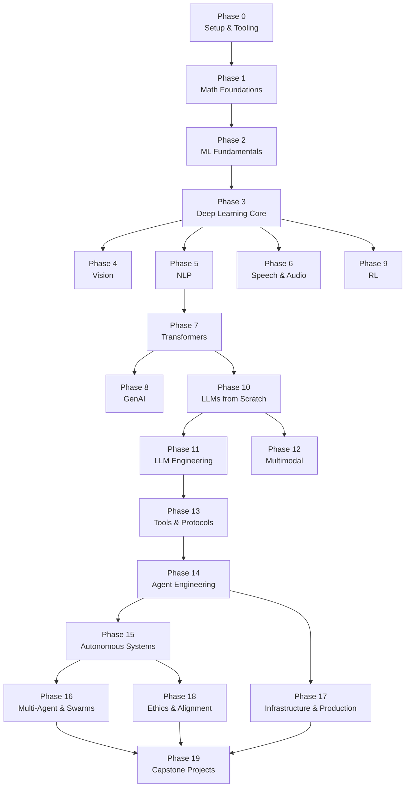
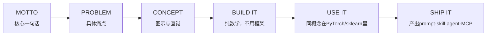

AI 学习材料常见的问题是碎片化：一篇论文解读、一个微调教程、一个 Agent demo 各自独立，缺少一条主线串起来。学完能调用 API，但说不清 Attention 在模型内部做了什么；能跑通 RAG 流程，但不知道 BPE 分词怎么训练。

**AI Engineering From Scratch** 是 Rohit Ghumare 维护的一条完整学习路径——从线性代数开始，到能独立构建、部署和维护一个 AI 系统结束。523 节课程，20 个阶段，官方估算约 342 小时，覆盖 Python、TypeScript、Rust、Julia 四种语言；每节课产出一个可复用工件（artifact）：prompt、skill、agent 或 MCP（Model Context Protocol，模型上下文协议）server。

GitHub 数据（截至 2026 年 9 月 7 日）：Stars 52,575，Forks 9,161，MIT 协议，完全免费。配套网站 [aiengineeringfromscratch.com](https://aiengineeringfromscratch.com) 免安装可直接读课，仓库首页提供含简体中文在内的 12 种语言入口，站点统计近 30 天约有 11.5 万读者。

README 开篇引用了一组调查数字：84% 的学生已经在用 AI 工具，只有 18% 觉得自己能在专业场景里用得称职。这门课补的就是中间那段差距——不是再教你调一次 API，而是把模型内部的每一层都亲手实现一遍。

这篇导读面向两类读者：想把"会调 API"补成"能自己搭模型"的开发者，以及想评估这门课值不值得投入时间的学习者。读完你至少能判断两件事：课程的知识结构是否覆盖你的目标，以及从哪个阶段切入最省时间。

---

## 课程全貌：20 个阶段如何层层叠加

阶段之间有明确的依赖关系。Phase 0 到 Phase 19，从底层数学铺到顶层毕业项目，上层依赖下层。


```mermaid
flowchart TB
 P0["Phase 0<br/>Setup & Tooling"] --> P1["Phase 1<br/>Math Foundations"]
 P1 --> P2["Phase 2<br/>ML Fundamentals"]
 P2 --> P3["Phase 3<br/>Deep Learning Core"]
 P3 --> P4["Phase 4<br/>Vision"]
 P3 --> P5["Phase 5<br/>NLP"]
 P3 --> P6["Phase 6<br/>Speech & Audio"]
 P3 --> P9["Phase 9<br/>RL"]
 P5 --> P7["Phase 7<br/>Transformers"]
 P7 --> P8["Phase 8<br/>GenAI"]
 P7 --> P10["Phase 10<br/>LLMs from Scratch"]
 P10 --> P11["Phase 11<br/>LLM Engineering"]
 P10 --> P12["Phase 12<br/>Multimodal"]
 P11 --> P13["Phase 13<br/>Tools & Protocols"]
 P13 --> P14["Phase 14<br/>Agent Engineering"]
 P14 --> P15["Phase 15<br/>Autonomous Systems"]
 P15 --> P16["Phase 16<br/>Multi-Agent & Swarms"]
 P14 --> P17["Phase 17<br/>Infrastructure & Production"]
 P15 --> P18["Phase 18<br/>Ethics & Alignment"]
 P16 --> P19["Phase 19<br/>Capstone Projects"]
 P17 --> P19
 P18 --> P19
```

README 用一个比喻解释这张图：数学是地板，Agent 和生产化是屋顶。可以跳过已经会的下层，但跳完之后上层出问题，别奇怪。这个警告有实感：不懂反向传播，调优化器就是盲调；不懂 Attention，Agent 长对话里的幻觉就无从排查。

依赖图上有四个分支点：

- **Phase 3（Deep Learning Core）是第一个分叉**。学完深度学习核心后，可分别进入 Vision（P4）、NLP（P5）、Speech（P6）或直接跳到 RL（P9）。视觉、语音、NLP 三条主线共享同一套反向传播和优化器知识，P3 是它们共同的前置。
- **Phase 7（Transformers）是第二个分叉**。只依赖 NLP（P5），向下分出 GenAI（P8）和 LLMs from Scratch（P10）。Transformers 单独成阶段，因为它既支撑后续的生成式模型，也支撑从零实现的 LLM。
- **Phase 14（Agent Engineering）是汇聚点**。依赖 Tools & Protocols（P13），向上分叉出 Autonomous Systems（P15）和 Infrastructure & Production（P17）。Agent 一旦具备工具调用能力，就可以朝自主系统和生产化两个方向延伸。
- **Phase 19（Capstone）汇聚 P15/P16/P17/P18 四条线**。毕业项目要求同时具备多 Agent 协作、生产部署、伦理对齐能力。

从体量看，最重的三个阶段是 Multimodal（约 65 小时）、Agent Engineering（约 55 小时）和 Tools & Protocols（约 43 小时）；最轻的是 RL（约 13 小时）。这些数字出自仓库的 ROADMAP 文件，下文的路径换算会用到。

仓库还把 20 个阶段编译成六卷本电子书（Foundations、Deep Learning、Language、LLMs、Agents、Production），EPUB 和 PDF 挂在 GitHub Releases 上，由 CI 从同一份课文源构建。不想 clone 仓库的话，这也是一种离线阅读方式。

---

## 方法论：六步循环

每节课遵循固定循环：


```mermaid
flowchart LR
 M["MOTTO<br/><sub>核心一句话</sub>"] --> Pr["PROBLEM<br/><sub>具体痛点</sub>"]
 Pr --> C["CONCEPT<br/><sub>图示与直觉</sub>"]
 C --> B["BUILD IT<br/><sub>纯数学，不用框架</sub>"]
 B --> U["USE IT<br/><sub>同概念在PyTorch/sklearn里</sub>"]
 U --> S["SHIP IT<br/><sub>产出prompt·skill·agent·MCP</sub>"]
```

- **MOTTO**：一句话概括本课要解决的问题。
- **PROBLEM**：把这句话展开为具体痛点，说明为什么这个问题值得解决。
- **CONCEPT**：用图示和直觉解释原理，先不涉及代码。
- **BUILD IT**：用纯数学和 NumPy 实现，不依赖框架。框架封装了细节，但封装掉的细节正是后续调试和优化的对象。
- **USE IT**：用 PyTorch 或 sklearn 实现同一概念，对照 BUILD IT 版本理解框架做了哪些抽象。
- **SHIP IT**：把本课产出打包成可安装的工件——prompt、skill、agent 或 MCP server。

BUILD IT 和 USE IT 的分工是整门课的主轴，README 的说法是：先从零实现算法，再让同一件事跑在生产库里——框架在引擎盖下做什么，你已经知道了，因为小型版本是你自己写的。

每节课一个目录，全课程统一结构：

```text
phases/<NN>-<phase-name>/<NN>-<lesson-name>/
├── code/      可运行实现（Python、TypeScript、Rust、Julia）
├── docs/
│   └── en.md  课文
├── outputs/   本课产出的 prompt、skill、agent 或 MCP server
└── quiz.json  课后测验（523 课中有 373 课配有）
```

以第 1 课 Linear Algebra Intuition 为例：课文用"每个 AI 模型都是戴着时髦帽子的矩阵数学"开场，标注 60 分钟；code 目录里并排放着 `vectors.py` 和 `vectors.jl` 两个语言版本；outputs 里是一个叫 `prompt-linear-algebra-tutor` 的提示词工件，装给 AI 助手后，它会用几何直觉讲线性代数，并把每个概念挂到 embedding 和 Attention 上。学完这一课，你就同时拿到了原理、代码和一个能复用的提示词。

---

## 快速上手

三种方式，按上手成本从低到高排：

**方式一：在线读，零安装。** 打开 [aiengineeringfromscratch.com](https://aiengineeringfromscratch.com) 按阶段读课文，界面支持简体中文、日本語、한국어等 12 种语言——英文是唯一权威版本，非英文课文为机器翻译，关键概念建议对照原文。适合先免费试读几课、判断这门课值不值得投入。

**方式二：把课程装进 coding agent（README 推荐）。** 前置要求只有一个：会写代码，语言不限。已确认 Node.js 20+ 和 `npx` 可用后执行：

```bash
npx skills add rohitg00/ai-engineering-from-scratch
```

装完之后，兼容的 agent（Claude Code、Codex 等）里会多出一组学习技能：

| 技能 | 作用 |
|------|------|
| `start-learning` | 一次性入学登记：定位测验加个性化计划，写入 `LEARNING.md` |
| `learn` | 导师循环：先回忆热身，再互动讲下一课，最后小测并记录复习队列 |
| `course-guide` | 主题路由："哪里讲 Attention？""loss 为什么是 NaN？"→ 给出具体课号 |
| `find-your-level` | 十题定位测验，按答题情况推荐起始阶段，附时长估算 |
| `check-understanding` | 按阶段出 8 题测验，附反馈和需要回看的课 |

进度落在你项目里的 `LEARNING.md`（MCP 和 Agent Skills 专题各有独立进度文件），换个会话能接着学，不用从头来。

**方式三：clone 代码库。** 适合想跑代码、改代码的读者：

```bash
git clone https://github.com/rohitg00/ai-engineering-from-scratch.git
cd ai-engineering-from-scratch
python3 phases/01-math-foundations/01-linear-algebra-intuition/code/vectors.py
```

依赖统一装在仓库根目录：`pip install -r requirements.txt`（NumPy、PyTorch、transformers、scikit-learn 等）。

### 常见报错排查

- **`python: command not found`**：课程要求 Python 3.11+（P0 第 1 课的口径，同时要求 Node.js 20+），macOS 的命令是 `python3`，README 的示例命令也用的 `python3`。
- **`ModuleNotFoundError: No module named 'numpy'`**：课程没有按阶段拆分依赖文件，`requirements.txt` 只在仓库根目录有一份，进任何 Phase 之前先在根目录装一次。
- **`/find-your-level` 没反应**：它不是仓库里的脚本，而是随 `npx skills add` 安装的 agent 技能。没装技能时，也可以在对话里直接说 "where should I start" 或 "find my level"——技能描述里注册了这些触发短语，兼容的 agent 会自己接手。

---

## 一个任务流经课程的路径

以"构建一个能查询 GitHub 仓库并生成技术摘要的 Agent"为例，看这套课程的知识如何串联：

1. **Phase 1（Math Foundations）**：第 14 课 Norms & Distances 讲向量距离和余弦相似度。判断两个仓库描述是否相关，靠的就是它。
2. **Phase 5（NLP）+ Phase 7（Transformers）**：P5 的第 19 课讲 subword tokenization，P7 把 Transformer 架构铺开。理解 token 边界才能正确处理代码片段。
3. **Phase 10（LLMs from Scratch）**：第 4 课从零预训练一个 mini GPT，第 12 课 Inference Optimization 实现 KV cache，对比投机解码和 flash attention 的吞吐差异。这一步决定了你能否在 Phase 14 定位 Agent 的推理延迟。
4. **Phase 13（Tools & Protocols）**：第 6 到 8 课从 MCP 基础一路写到自己实现 MCP server 和 client。把 GitHub API 包装成 MCP server，就是第 7 课的作业形态。
5. **Phase 14（Agent Engineering）**：第 1 课 the agent loop 从最朴素的循环写起——模型自己决定下一步调什么工具、把观察结果喂回去再决定。第 2 课 ReWOO 讲先规划后执行，第 6 课讲 function calling。
6. **Phase 17（Infrastructure & Production）**：把 Agent 部署为长时运行的服务，处理重试、超时、成本控制。

这条串法带出一个反直觉的结论：**Phase 14 的 Agent 行为是否可靠，取决于 Phase 7 和 Phase 10 的理解深度**。如果对 Attention 和采样策略只有框架层认知，Agent 在长对话里出现的"幻觉"和"工具误调用"就无从定位。单点知识看起来都能用，但只有按顺序长在一起，才组得出一个能上线的系统。

---

## 采用建议

523 节课一次学不完。ROADMAP 给了每个阶段的官方时长估算，三条常见路径可以直接换算（按每天投入 2-3 小时）：

**路径 A：构建 Agent 产品**
Phase 0 → 1 → 2 → 3 → 5 → 7 → 10 → 11 → 13 → 14 → 17，官方估算合计约 290 小时，约 4 个月。跳过 Vision、Speech、RL、Multimodal。

**路径 B：理解 LLM 内部机制**
Phase 0 → 1 → 2 → 3 → 5 → 7 → 10 → 11，约 160 小时，约 2 个月。重心放在 BUILD IT，USE IT 快速过。

**路径 C：多 Agent 系统研究**
Phase 0 → 1 → 2 → 3 → 5 → 7 → 10 → 11 → 13 → 14 → 15 → 16，约 306 小时，约 4 个月。Phase 15 和 16 是核心，但需要先掌握单 Agent 工程。

**注意事项**：

- Phase 0（Setup & Tooling）不要跳。课程横跨四种语言和一整套工具链，环境配置是第一道门槛，官方给了 12 节课、约 14 小时。
- BUILD IT 阶段用 NumPy 从零写看起来慢，但它是后面所有调试能力的根基。README 的原话：等 PyTorch 出现的时候，你已经知道它在做什么了。
- 每课的 SHIP IT 产出会累积成一个工件库：全课程跑完，`outputs` 目录下有 577 个文件，全是装上就能用的 prompt、skill、agent 和 MCP server。
- Phase 19（Capstone）在 ROADMAP 里单列约 620 小时——那是全部毕业项目加总的口径，挑和目标相关的做就行。

---

## 自测：判断自己是否该投入

开始之前，用三个问题衡量这门课适不适合当下的你：

1. **你的短板在原理还是框架？** 只差"会用某个库"，直接刷 USE IT 更快；回答不了"为什么这样设计"，才需要走 BUILD IT。
2. **你能接受几个月的跨度吗？** 最短的路径 B 也要 160 小时。跳课省下的时间，最终会在断层处加倍还回来。
3. **你愿意手写实现吗？** 如果只想快速出 demo，这门课是绕路；如果想把 Agent 做到能上线，这些手写环节就是正课本身。

三个问题都过关，再按上面三条路径选一条；拿不准的话，先用方式一在官网免费读几课，试过再决定。

---

## 相关资源

| 资源 | 链接 | 用途 |
|------|------|------|
| 课程仓库 | https://github.com/rohitg00/ai-engineering-from-scratch | 克隆代码、跟练课程 |
| 配套网站 | https://aiengineeringfromscratch.com | 免安装在线读课，支持简体中文等 12 种语言 |
| 六卷本电子书 | 仓库 Releases 页面 | EPUB/PDF 随每次发布更新，链接始终指向最新版 |
| fast.ai | https://www.fast.ai/ | 补充实用深度学习视角 |
| 吴恩达 Coursera | https://www.coursera.org/specializations/deep-learning | 补充系统和理论基础 |

---

## 边界与维护

- 20 个阶段在仓库 ROADMAP 中均已标记完成，课程仍在活跃维护（最近一次推送在 2026 年 9 月 6 日），课程数、时长估算和价格都可能继续变化。
- Star/Fork 数字截至 2026 年 9 月 7 日；总时长引用 README 首页的约 342 小时口径，ROADMAP 头部另有约 323 小时的汇总，两个口径不完全一致，引用时以仓库当日数据为准。
- 时间换算假设每天投入 2-3 小时；全职学习可以按 3 倍压缩。
- 本文聚焦 Python 实现，Rust 和 Julia 版本在各课 `code/` 目录下同步提供，未展开。
- 引用仓库信息以 [GitHub 仓库](https://github.com/rohitg00/ai-engineering-from-scratch) 为准；本文只做结构解读，不替代课程原文。
