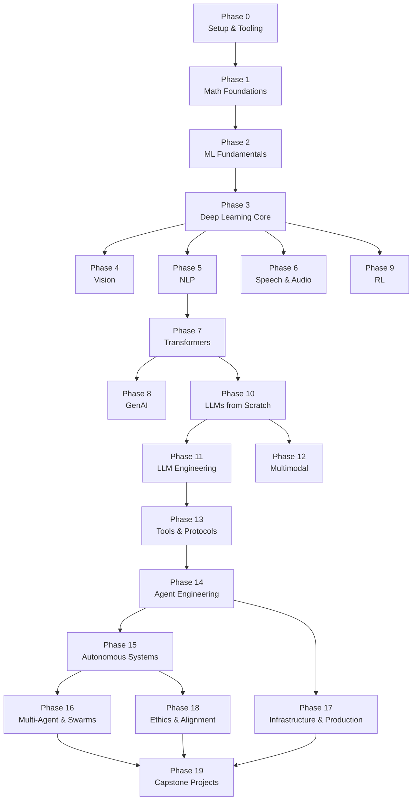
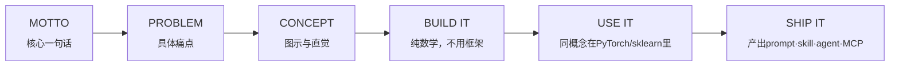

AI 学习材料常见的困境是碎片化：一篇论文解读、一个微调教程、一个 Agent demo 各自独立，但缺少一条主线串起来。学完能调用 API，但说不清楚 Attention 在模型内部做了什么；能跑通 RAG 流程，但不知道 BPE 分词如何训练。

**AI Engineering From Scratch** 是 Rohit Gupta 编写的一条完整学习路径——从线性代数开始，到能独立构建、部署和维护一个 AI 系统结束。428 节课程，20 个阶段，覆盖 Python、TypeScript、Rust、Julia 四种语言，最终产出 428 个可安装的工具：prompt、skill、agent、MCP server。GitHub 数据（截至 2026 年 5 月）：Stars 8,973，Forks 1,862，MIT 协议，完全免费。

---

## 课程全貌：20 个阶段如何层层叠加

课程结构有一条硬约束：**阶段之间有明确的依赖关系，不可随意挑选模块**。Phase 0 到 Phase 19，从底层数学铺到顶层 capstone 项目，上层依赖下层，跳阶段会遇到断层。


```mermaid
flowchart TB
 P0["Phase 0<br/>Setup & Tooling"] --> P1["Phase 1<br/>Math Foundations"]
 P1 --> P2["Phase 2<br/>ML Fundamentals"]
 P2 --> P3["Phase 3<br/>Deep Learning Core"]
 P3 --> P4["Phase 4<br/>Vision"]
 P3 --> P5["Phase 5<br/>NLP"]
 P3 --> P6["Phase 6<br/>Speech & Audio"]
 P3 --> P9["Phase 9<br/>RL"]
 P5 --> P7["Phase 7<br/>Transformers"]
 P7 --> P8["Phase 8<br/>GenAI"]
 P7 --> P10["Phase 10<br/>LLMs from Scratch"]
 P10 --> P11["Phase 11<br/>LLM Engineering"]
 P10 --> P12["Phase 12<br/>Multimodal"]
 P11 --> P13["Phase 13<br/>Tools & Protocols"]
 P13 --> P14["Phase 14<br/>Agent Engineering"]
 P14 --> P15["Phase 15<br/>Autonomous Systems"]
 P15 --> P16["Phase 16<br/>Multi-Agent & Swarms"]
 P14 --> P17["Phase 17<br/>Infrastructure & Production"]
 P15 --> P18["Phase 18<br/>Ethics & Alignment"]
 P16 --> P19["Phase 19<br/>Capstone Projects"]
 P17 --> P19
 P18 --> P19
```

依赖图上有四个值得注意的分支点：

- **Phase 3（Deep Learning Core）是第一个分叉**。学完深度学习核心后，可分别进入 Vision（P4）、NLP（P5）、Speech（P6）或直接跳到 RL（P9）。视觉、语音、NLP 三条主线共享同一套反向传播和优化器知识，P3 是它们共同的前置。
- **Phase 7（Transformers）是第二个分叉**。只依赖 NLP（P5），向下分出 GenAI（P8）和 LLMs from Scratch（P10）。Transformers 单独成阶段，因为它既支撑后续的生成式模型，也支撑从零实现的 LLM。
- **Phase 14（Agent Engineering）是汇聚点**。依赖 Tools & Protocols（P13），向上分叉出 Autonomous Systems（P15）和 Infrastructure & Production（P17）。Agent 一旦具备工具调用能力，就可以朝自主系统和生产化两个方向延伸。
- **Phase 19（Capstone）汇聚 P15/P16/P17/P18 四条线**。Capstone 项目要求同时具备多 Agent 协作、生产部署、伦理对齐能力。

按这条依赖链走：如果已经熟悉 Phase 1-3，可以直接从 Phase 4 或 Phase 5 切入；如果目标是做 Agent，最快路径是 Phase 0 → 1 → 2 → 3 → 5 → 7 → 10 → 11 → 13 → 14。

---

## 方法论：六步循环

每节课遵循固定循环：


```mermaid
flowchart LR
 M["MOTTO<br/><sub>核心一句话</sub>"] --> Pr["PROBLEM<br/><sub>具体痛点</sub>"]
 Pr --> C["CONCEPT<br/><sub>图示与直觉</sub>"]
 C --> B["BUILD IT<br/><sub>纯数学，不用框架</sub>"]
 B --> U["USE IT<br/><sub>同概念在PyTorch/sklearn里</sub>"]
 U --> S["SHIP IT<br/><sub>产出prompt·skill·agent·MCP</sub>"]
```

- **MOTTO**：一句话概括本课要解决的问题。
- **PROBLEM**：把这句话展开为具体痛点，说明为什么这个问题值得解决。
- **CONCEPT**：用图示和直觉解释原理，先不涉及代码。
- **BUILD IT**：用纯数学和 NumPy 实现，不依赖框架。框架封装了细节，但封装掉的细节正是后续调试和优化的对象。
- **USE IT**：用 PyTorch 或 sklearn 实现同一概念，对照 BUILD IT 版本理解框架做了哪些抽象。
- **SHIP IT**：把本课产出打包成可安装的工具——prompt、skill、agent 或 MCP server。

这个循环绑定了"原理 → 框架 → 产品"三层。多数教程只覆盖中间一层，学完只会调框架 API，遇到 bug 分不清是原理问题还是框架问题。

---

## 快速上手

```bash
git clone https://github.com/rohitg00/ai-engineering-from-scratch.git
cd ai-engineering-from-scratch
python phases/01-math-foundations/01-linear-algebra-intuition/code/vectors.py
```

仓库内置了水平定位命令，执行后会根据回答推荐起始阶段：

```bash
/find-your-level
```

熟悉线性代数和概率论可以直接跳到 Phase 2 或 Phase 3；目标是 Agent 开发的话，建议从 Phase 13 开始倒查前置依赖。

### 常见报错排查

- **`python: command not found`**：课程要求 Python 3.10+，macOS 下可能需要用 `python3`。先用 `python3 --version` 确认版本。
- **`ModuleNotFoundError: numpy`**：每个 Phase 目录下有 `requirements.txt`，进入对应 Phase 后先执行 `pip install -r requirements.txt`。
- **`/find-your-level` 无响应**：这条命令依赖仓库根目录的脚本，确认当前工作目录在仓库根，而不是某个 Phase 子目录。

---

## 一个任务流经课程的路径

以"构建一个能查询 GitHub 仓库并生成技术摘要的 Agent"为例，看这套课程的知识如何串联：

1. **Phase 1（Math Foundations）**：向量化和 embedding 的数学基础。理解余弦相似度才能判断两个仓库描述是否相关。
2. **Phase 5（NLP）+ Phase 7（Transformers）**：tokenizer 和 Transformer 架构。理解 token 边界才能正确处理代码片段。
3. **Phase 10（LLMs from Scratch）**：从零实现一个 mini GPT，理解 KV cache 和采样策略。这一步决定了你能否在 Phase 14 调试 Agent 的推理延迟。
4. **Phase 13（Tools & Protocols）**：MCP 协议。把 GitHub API 包装成 MCP server，Agent 通过标准化接口发现并调用工具。
5. **Phase 14（Agent Engineering）**：ReAct 循环。Agent 接收"总结这个仓库"的指令，调用 GitHub MCP server 拉取 README 和代码，再调用 LLM 生成摘要。
6. **Phase 17（Infrastructure & Production）**：把 Agent 部署为长时运行的服务，处理重试、超时、成本控制。

这条路径说明一个实际问题：**Phase 14 的 Agent 行为是否可靠，很大程度上取决于 Phase 7 和 Phase 10 的理解深度**。如果对 Attention 和采样策略只有框架层认知，Agent 在长对话中出现的"幻觉"和"工具误调用"将无法定位。

---

## 采用建议

428 节课一次学不完。根据目标给出三条路径：

**路径 A：目标是构建 Agent 产品**
Phase 0 → 1 → 2 → 3 → 5 → 7 → 10 → 11 → 13 → 14 → 17。跳过 Vision、Speech、RL、Multimodal。预计投入 3-4 个月。

**路径 B：目标是理解 LLM 内部机制**
Phase 0 → 1 → 2 → 3 → 5 → 7 → 10 → 11。重点在 BUILD IT 阶段，USE IT 可以快速过。预计投入 2 个月。

**路径 C：目标是多 Agent 系统研究**
Phase 0 → 1 → 2 → 3 → 5 → 7 → 10 → 11 → 13 → 14 → 15 → 16。Phase 15 和 16 是核心，需要先掌握单 Agent 工程。预计投入 4-5 个月。

**共同注意事项**：

- Phase 0（Setup & Tooling）不能跳过。课程涉及四种语言和大量工具链，环境配置本身就是一道门槛。
- BUILD IT 阶段用 NumPy 实现看起来低效，但它是后续所有调试能力的根基，不要用框架替代。
- SHIP IT 阶段把每节课产出打包成可安装工具，这是这套课程区别于其他教程的地方——学完之后你拥有 428 个可安装工具，构成一个可复用的工具库。

---

## 相关资源

| 资源 | 链接 | 用途 |
|------|------|------|
| 课程仓库 | https://github.com/rohitg00/ai-engineering-from-scratch | 克隆代码、跟练课程 |
| 课程 Discord | 仓库 README 中有邀请链接 | 提问、交流进度 |
| fast.ai | https://www.fast.ai/ | 补充实用深度学习视角 |
| 吴恩达 Coursera | https://www.coursera.org/specializations/deep-learning | 补充系统和理论基础 |

---

## 局限性

- 课程仍在持续更新，Phase 15-19 的内容可能会调整
- 时间估算假设全职学习，实际学习时间会因工作/生活安排而延长
- 未覆盖课程中的 Julia 和 Rust 实现（主要聚焦 Python 和 TypeScript）
- 未验证所有外部链接（fast.ai、Coursera 等）的有效性和最新内容