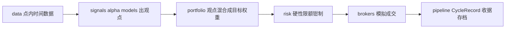

virattt/ai-hedge-fund 在 2026 年年中把仓库重写了一遍。网上流传的大量解读——包括本文旧版——描述的还是旧版 LangGraph 工作流：13 位投资大师 agent 加风险管理员、组合经理排队走图。这套东西已经从主干上消失了。新版只保留一个 `hedge_fund/` 包，并把一条原则写进了"不可妥协"清单：**The LLM never touches the trade**——语言模型只产出观点，仓位、订单、风控全部由确定性代码完成。

本文基于 2026 年 9 月 13 日的 main 分支（v2.2.0）解析新架构。所有文件路径和命令都对照当前源码核实过。

---

## §0 三分钟速览

先记住 4 点，其余按需跳读：

1. **这是教育研究项目，不交易。** README 原话是 "the system does not actually make any trades"；paper 和 live 两类 broker 在路线图上还是 ⬜。
2. **旧版多 Agent 工作流已成历史。** LangGraph 依赖已移除，13 位投资人 agent 只移植了 5 位，包已发布到 PyPI（`aihf`），入口是一个终端应用（TUI）。
3. **核心抽象只有一个接口：** `AlphaModel.predict(ticker, date, data_client) -> Signal`。LLM 投资人和量化模型实现同一接口，因此可回测、可组合、可替换。
4. **一条流水线贯穿所有模式：** `run_cycle`（数据 → 分析师 → 组合构建 → 风控 → 执行 → 账本）。回测就是这条流水线在历史上循环。

---

## §1 5 个关键词

| 关键词 | 这篇文章里的意思 |
| ------ | ---------------- |
| `mandate` | 基金章程，一份 YAML：策略、人员、风控、资本、调仓节奏——不含任何股票代码 |
| `strategy`（pod） | 一组分析师加一个混合政策，分走一份资本切片 |
| `alpha model` | 产出观点的组件，LLM 投资人和量化模型都算 |
| `Signal` | 观点的数据形态：`[-1, +1]` 的信念值，加一段书面理由 |
| `run_cycle` | 基金的一个 tick，所有模式共用的唯一代码路径 |

主线：一份 `mandate` 定义基金怎么组织，若干 `strategy` 各自雇佣 `alpha model`，模型对每只股票产出 `Signal`，`run_cycle` 把观点混合成目标持仓、过风控、下单、存档。

---

## §2 v1 已成历史

对照一下前后差异，读者能省掉大量过时资料的干扰。

**旧版（约 2025 年至 2026 年上半年）**：`src/main.py` 用 LangGraph 的 `StateGraph` 编排 13 位投资人 agent（Buffett、Munger、Graham、Cathie Wood 等）加 6 个功能分析师（估值、基本面、技术面、情绪等），后面接 `risk_management_agent` 和 `portfolio_manager` 两个节点；另有 FastAPI + React 的 `app/` 目录和独立的 `src/backtester.py`。

**新版（当前 main）**：根目录只剩 `hedge_fund/`，约 90 个文件，每个核心模块都带 pytest 测试。`pyproject.toml` 的依赖里已经没有 `langgraph`，LLM 调用直接走 langchain 的各家 provider 客户端。2026 年 8 月，v2 成为默认版本并打包发布到 PyPI，安装命令是 `pipx install aihf`。项目 MIT 协议，要求 Python 3.11+，目前 6.3 万 stars（2026 年 9 月）。

重写不是推翻判断，而是把判断升级成了原则。旧版里"分析归 agent、约束归代码"体现在两个节点的分工；新版把它写进 `hedge_fund/README.md` 的 Principles 一节，措辞是硬性的："Agents form views and narrate; deterministic code sizes and places orders; risk limits are hard gates."（agent 形成观点并叙述，确定性代码定量和下单，风控限额是硬门。）

也有确实丢掉的东西：v1 的 6 个功能分析师在 v2 路线图里没有对应条目；13 位投资人只回来了 5 位（Buffett、Munger、Graham、Lynch、Druckenmiller），其余 8 位在路线图上等移植；Ollama 本地模型支持也在路上。想复刻旧版功能的人，现在得自己动手。

---

## §3 系统地图：三层嵌套，一条流水线

v2 把基金组织成三层，每层都可以替换（`VISION.md` 的原话是 "Everything is pluggable"）：

```text
FUND     = 在若干 STRATEGY 上切资本，对合并后的账本上 master risk
STRATEGY = 一个 pod：一组模型 + 一个混合政策 + 一份资本切片
MODEL    = 一个 alpha model → 产出 Signal（信念值 + 理由）
```

一次运行的数据流是单向的：



各模块与仓库目录的对应：`data/` 是带磁盘缓存的 Financial Datasets 客户端，`signals/` 放 alpha model，`portfolio/` 做观点混合，`risk/` 是限额，`brokers/` 是券商协议和模拟券商，`pipeline/run_cycle.py` 把它们串成一个 tick，`backtesting/` 负责在历史上循环，`tui/` 是交互界面。`fund/spec.py` 定义 `mandate` 的数据结构。

流水线里有个刻意安排：`run_cycle.py` 的模块注释明确说自己是全链路**唯一有副作用**的环节——只有它跟数据源和券商打交道，其余每个阶段（混合、限额、生成订单）都是纯函数。"给定相同输入必然得到相同输出"因此成为可测试的性质，而不是愿望。

---

## §4 AlphaModel：一种接口，两种分析师

### 4.1 接口契约

`signals/base.py` 定义了整个系统的合约：

```python
class AlphaModel(ABC):
    @property
    @abstractmethod
    def name(self) -> str: ...

    @abstractmethod
    def predict(self, ticker: str, date: str, data_client: DataClient) -> Signal:
        """Form a point-in-time view on *ticker* as of *date*."""
```

产出的 `Signal`（`models.py`）是个 Pydantic 模型：`value` 是 `[-1.0, +1.0]` 的信念值，`reasoning` 是人类可读的理由，另带量化的 `components` 和自由的 `metadata`。`0.0` 表示"没有观点"（弃权）。

这个接口刻意只管"形成观点"，不管仓位机制——入场时点、持仓期、规模都归下游。`signals/base.py` 的注释说这个分离是 deliberate（有意的）。量化模型继承 `QuantModel`（纯数学，附带了 RSI、sigmoid 等公共工具），LLM 投资人继承 `LLMAgent`。两条路，一个出口。

### 4.2 LLM 投资人：persona 只是 system prompt

`signals/buffett.py` 全文只有 54 行，机制部分一行没有——`LLMAgent` 基类包办了取数据、拼 prompt、调模型、解析、缓存，子类只需要提供名字和一段 system prompt。Buffett 的 prompt 是一份检查清单：能力圈、护城河、管理层资本配置、财务强度、估值、十年持有意愿，最后要求只输出 JSON：`{"signal": "bullish"|"bearish"|"neutral", "confidence": <0-100>, "reasoning": "..."}`。

prompt 里有两条硬规矩值得注意：只准用给定的数据，并把数据里最近的财报日期当作"今天"——这是把 point-in-time 约束压进模型上下文；数据不足以判断时必须明说并弃权。`VISION.md` 同时声明这些 persona 是公开投资哲学的风格化近似，不是本人，也不构成背书。

失败处理也写成了契约（`llm_agent.py` 的 docstring）：

- **数据层错误直接抛出。** 一个坏掉的财务快照绝不允许悄悄变成"中性观点"。
- **LLM 调用或解析失败则弃权**，产出 `Signal(value=0.0, metadata={"abstained": True})`。
- **每次 LLM 调用的完整 prompt 和响应都落盘缓存**（`PromptCache`）。同一个 snapshot 不付第二次 API 钱；一位 persona 被两个策略同时雇佣时，第二次调用是缓存命中。

第三条解释了为什么这个架构敢让 LLM 参与回测：缓存保证了回放是逐字节确定的，成本也可控。

### 4.3 PEAD：量化侧的样本

`signals/pead.py` 实现了财报后漂移（Post-Earnings Announcement Drift）：业绩超预期（BEAT）后做多，不及预期（MISS）后做空，赌市场对财报消息反应不足、股价继续朝意外方向漂。

实现要点：只看 `date` 之前已经提交的财报文件（8-K 优先于 10-Q/10-K，因为 8-K 披露最早）；事件距今超过默认 4 天窗口就不再发力；信念值固定 ±1.0，v0 不按超预期幅度缩放。整个模型是纯 Python 数学，零 LLM 调用——和 Buffett agent 一样，产出的都是同一个 `Signal`。

一个 LLM agent 和一个漂移模型能在同一份回测、同一个组合里平起平坐，靠的就是 §4.1 那个接口。这是 v2 相对 v1 最大的架构收益。

---

## §5 一个 cycle 的完整流转

用仓库自带的 `fund/example.yaml` 走一遍。章程是：`deep-value` 策略占 0.6 资本（Graham 权重 2.0，Buffett、Munger 各 1.0），`earnings-drift` 策略占 0.4（PEAD）；单票上限 25%，总敞口上限 1.0，资金 10 万美元，每周调仓，基准 SPY。

假设某天对 AAPL、MSFT 各跑一轮（以下数字为演示）：

1. **取数。** `run_cycle` 先给所有标的取 as-of 之前的最近收盘价。AAPL、MSFT 有价；假设 PEAD 查 AAPL 财报，发现 3 天前有一份 8-K 超预期。
2. **出观点。** deep-value 策略问 Graham（0.8）、Buffett（0.6）、Munger（0.7）——都是演示数字；earnings-drift 策略问 PEAD，AAPL 得 +1.0。MSFT 没有近期财报，PEAD 给 0.0。
3. **策略内混合。** deep-value 对 AAPL 的加权信念 = (2.0×0.8 + 1.0×0.6 + 1.0×0.7) / 4.0 = 0.725；对 MSFT 的三人意见弱一些，混出 0.2。策略内按截面归一到 `gross_target`（1.0）：AAPL 拿到 0.784，MSFT 拿到 0.216。
4. **策略间净额。** 每个 pod 的权重乘自己的资本切片再相加：AAPL = 0.6×0.784 + 0.4×1.0 = 0.870，MSFT = 0.6×0.216 = 0.130。
5. **风控钳制。** AAPL 的 0.870 超过单票上限 0.25，被钳到 0.25；MSFT 的 0.130 合规保留。总敞口 0.38，没碰到 1.0 上限。**被钳掉的 62% 敞口留在现金里**——风控不把额度分给别人。
6. **执行与存档。** 执行层把目标权重和当前持仓的差值变成订单，`SimBroker` 成交，整张 `CycleRecord`——每个 Signal 及其理由、每次钳制事件、订单、成交、持仓、NAV——作为收据返回。

关键在最后一步的观感：LLM（Graham、Buffett、Munger）的发言停在信念值，真正决定" AAPL 只买 25%"的是一条 `if abs(w) > cap` 的分支。模型提要求，代码做处置——源码里的说法是 "conviction requests, risk disposes"。

---

## §6 两道确定性闸门

### 6.1 组合构建：弃权不冒充中性

`portfolio/construction.py` 的 `blend_signals` 把一个策略内所有观点压成权重。单个标的的混合信念是投票加权均值：

```text
conviction_t = Σ(w_m × value_m,t) / Σ(w_m)
```

细节在弃权语义上。`metadata.abstained` 为真的 Signal 被同时剔除出分子和分母——"没有观点"不能冒充"观点：中性"。而非弃权的 0.0（比如 PEAD 窗口外）是真实的 neutral 票，会稀释组合。三种状态（看好/看空/真实中性）之外再加第四种（弃权），是很多投票系统没想清楚的地方。

可选的 `market_neutral` 开关先对信念做截面去均值再缩放：做多相对最喜欢的、做空相对最不喜欢的，整个 sleeve 的美元敞口为零。所有信念相同或全零时，输出空仓而不是除零崩溃。

源码也诚实地记了自己的已知瑕疵：截面归一化忽略绝对信念，唯一的弱观点也会拿满 `gross_target`，然后被风控钳回去。作者的选择是先接受，等评估能力跟上再加减仓门槛——这个取舍本身写在注释里，比藏着好。

### 6.2 风控：顺序保证幂等，钳掉的不再分配

`risk/limits.py` 只有两条规则：`max_position_pct`（单票权重上限）和 `max_gross_exposure`（总敞口上限，1.0 即不加杠杆）。执行顺序固定：先逐票钳（保留多空方向），再对仍超限的总敞口等比缩小。只缩不涨，所以第二步不会重新违反第一步——这对性质保证了函数幂等。

两条注释级别的设计决定值得抄走。其一，被钳掉的敞口**留在现金里**，不重新分配给其他标的——重新分配会让风控阶段变成加仓阶段，职责颠倒。其二，每次钳制生成一条 `ClampEvent`（哪条限额、钳前钳后各多少），随 `CycleRecord` 落账，任何一笔持仓偏离都能追溯到具体哪条规则在哪个值上开的火。

---

## §7 回测：同一引擎的历史回放

### 7.1 回测就是 run_cycle 循环

`backtesting/` 的 `backtest_fund` 把 `run_cycle` 沿历史按章程的调仓节奏（daily/weekly/monthly）循环，配 `SimBroker` 成交，产出对基准（`mandate` 里的 `benchmark`，同时充当交易日历网格）的净值曲线。`VISION.md` 的目标形态是三种模式只换时钟和券商：BACKTEST 用历史时钟加模拟券商，PAPER 用实时时钟加模拟券商，LIVE 用实时时钟加真券商。

现状要说清楚：三种模式里只有回测和单日运行是通的。paper broker 和 live broker 都在路线图上标 ⬜；账本也只写了"写的一半"——每次运行从章程里的现金起步，NAV 没有跨运行的记忆。当前开发焦点（ROADMAP 第一段）就是把读的一半补上：从最近一张收据恢复券商状态，让 NAV 变成可累积的 track record。

### 7.2 单模型研究工具

全基金回测之外还有两件研究工具。`BacktestEngine` 针对**单个** alpha model：等额下单、信念过阈值才动、默认持有 5 个交易日，输出收益、Sharpe、回撤。`event_study/` 算市场模型异常收益（CARs），用来回答"财报事件后到底漂了多少"。

### 7.3 还缺什么

用它做严肃研究前，先看这份缺口清单（全部来自 ROADMAP 的 ⬜/🚧 项）：过拟合验证门（CPCV、PBO 概率）未实现，`validation/` 目前只有空壳；组合构建是 v0 政策（作者自己标注了 wart）；动态资本分配器、调度器、观察性都还没有。教育用途和策略原型验证够用，可信的绩效归因要等验证门落地。

---

## §8 上手

安装即用，不用预配 key：

```bash
pipx install aihf
aihf
```

不带参数的 `aihf` 启动交互式终端应用（Textual 实现的 TUI）：选股票、选策略、定调仓节奏，回测时净值曲线对着基准现场画。建好的基金存成 `~/.hedge-fund/mandates/` 下的 YAML。首次运行会提示要两把 key——Financial Datasets（行情、基本面、财报）和任一家 LLM（Anthropic、OpenAI、DeepSeek、Google、xAI、Kimi）——存进 `~/.hedge-fund/.env`，shell 里显式导出的变量优先。API 响应全部缓存到 `~/.hedge-fund/cache/`，重跑免费且离线可用。

非交互运行，输出是全 JSON 的 `CycleRecord`（stdout），人读摘要走 stderr：

```bash
aihf ~/.hedge-fund/mandates/example.yaml --tickers AAPL,MSFT
```

回测加 `--backtest`，起止日期用 `--start` 和 `--date` 控制：

```bash
aihf ~/.hedge-fund/mandates/example.yaml --tickers AAPL,MSFT --backtest
```

注意 `--tickers` 是运行时输入，不是章程字段——基金是"台子"，指向什么股票是每次运行的决定，这个决定也会被记录进收据。

开发路径：

```bash
git clone https://github.com/virattt/ai-hedge-fund.git
cd ai-hedge-fund
poetry install
poetry run aihf
poetry run pytest hedge_fund
```

---

## §9 可迁移的 5 个设计模式

这五条都不限于金融。

**1. 观点生产收敛到一条窄接口。** `predict(ticker, date, data_client) -> Signal` 小到没有扩展点，因此 LLM 和纯数学模型可回测、可混合、可互相替换。接口越窄，能进生态的组件越多。

**2. LLM 的输出止步于结构化观点。** 信念值加理由，后面全是纯函数。让模型碰执行面（下单、定量）的架构，等于把不可解释性注入了不可逆操作。硬限额必须是 agent 无法协商的门。

**3. 弃权、中性、失败是三种状态。** LLM 挂了走弃权（混合时分子分母都剔除），模型说中性是真实的一票，数据不足是显式声明的第四态。多模型投票系统里，把这几种混成一个 0 分，统计就全歪了。

**4. 章程即数据。** TUI 点选出来的和 CLI 读进引擎的是同一份 YAML——"人点、机器写、引擎只读一个东西"（`run.py` 的原话）。界面只是 spec 的编辑器，不是第二条执行路径。

**5. 回测即实盘，一条代码路径。** 研究态和评估态分叉最早的系统，最后都回答不了"回测成绩算不算数"。这里只有一个 `run_cycle`，换时钟和券商就能换模式；配合 prompt 缓存，回放逐字节确定。

贯穿性原则还有两条：point-in-time 诚实（任何模拟日期只许用当时已公开的数据，数据层按财报提交日期过滤而非报告期）和 fail loud（基础设施故障必须抛出，只有真正的"无数据"才返回空——一个静默的空值会把回测毒化成假信号）。

---

## §10 阅读路径与采用建议

按目的选入口：

- **想懂引擎**：`hedge_fund/pipeline/run_cycle.py` → `risk/limits.py` → `portfolio/construction.py`。三个文件加起来三百多行，§5 的每一步都能对上源码。
- **想写自己的分析师**：读 `signals/base.py` 的接口，照 `signals/buffett.py`（写个 system prompt 就是一个 agent）或 `signals/pead.py`（量化模板）实现，注册后引擎零改动接入。ROADMAP 把这列为最欢迎的贡献。
- **想加策略但不想写代码**：往 `strategies/` 丢一份 YAML，捆绑现有模型加混合政策即可，现有四个样例（fundamental-ls、deep-value、inflections、earnings-drift）就是格式。

采用判断分三种情况：

- **学多 Agent 系统的工程化**：现在就是好样本。它对"LLM 能碰什么、不能碰什么"的划线方式，直接适用于审批、告警处置、内容审核等任何"模型出意见、系统做决定"的场景。
- **做量化研究**：可以用它的数据层和事件研究工具，但策略结论要等验证门（CPCV/PBO）和账本读一半落地再信，或者自己补。
- **想实盘**：没有这条路。paper 和 live 都未实现，且项目的免责声明写得很清楚：仅供学习，不构成投资建议。

---

## 总结

`ai-hedge-fund` 经历了一次自我否定：把让它出名的 LangGraph 多 Agent 工作流整个拆掉，换成一个以 `AlphaModel` 接口为核心、以"LLM 不碰交易"为铁律的流水线。判断没变——观点归模型，约束归代码，决策收敛在安全空间内——但从设计取向升级成了可测试的工程性质：纯函数混合、幂等风控、可审计的钳制事件、逐字节可回放的回测。

对一个仍在快速重构期的项目，这份源码最有价值的读法不是照抄某个模块，而是看作者如何在每个分叉点上选择"少一个自由度"：接口收窄、状态三分、敞口不重分配、章程不含股票。这些决定单个看都不起眼，叠起来就是玩具和系统的分界。

**项目链接**：[https://github.com/virattt/ai-hedge-fund](https://github.com/virattt/ai-hedge-fund)

---

*本文基于 `virattt/ai-hedge-fund` main 分支源码分析（v2.2.0，2026 年 9 月 13 日核实）。项目处于活跃重构期，安装方式、命令与文件结构可能继续调整，以仓库当前状态为准。*
