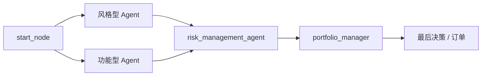

很多多 Agent 项目停留在"角色很多、提示词很多、截图很好看"的层面，`ai-hedge-fund` 做了一件更实在的事：把分析层、风控层、决策层分开。本文基于源码解析它的架构设计、协作模式和可迁移的设计模式。

---

## §0 三分钟速览

先记住下面 4 点，其余内容按需跳过：

1. **`ai-hedge-fund` 是教育和研究用的多 Agent 投资决策工作流，不接真实券商，不下真实订单。**
2. **看点在"分析层、风控层、决策层如何分离"，不在复刻了多少位投资大师。**
3. **项目不只有 CLI，还包含 Web 应用，能观察它从 Demo 走向产品雏形。**
4. **最值得带走的设计是"先用代码收缩动作空间，再让 LLM 做选择"。**

---

## §1 5 个关键词速览

| 关键词 | 这篇文章里的意思 |
| ------ | ---------------- |
| `Agent` | 负责某一类分析或决策任务的独立节点 |
| `LangGraph` | 用来编排多个节点执行顺序的工作流框架 |
| `LLM` | 生成分析结论或最终选择的模型 |
| `ticker` | 股票代码，例如 `AAPL`、`MSFT` |
| `portfolio` | 当前组合的现金、持仓与风险约束 |

主线：多个 `Agent` 围绕 `ticker` 生成观点，`LangGraph` 编排流程，`LLM` 参与分析和选择，最终结果受 `portfolio` 约束。

---

## §2 先给结论：这个项目到底是什么

`virattt/ai-hedge-fund` 是一个**教育和研究用途**的多 Agent 投资决策项目。目标是把"多名分析师 + 风控 + 投资组合经理"的决策流程落成一套可运行的 Python 系统，而不是接入真实券商做自动下单。

三条事实边界：

- **它会生成交易决策，但默认不实际下单**
- **它确实使用多 Agent 协作，但重心是"信号汇总与约束决策"**
- **它已经不只是命令行 Demo，还包含一个 `app/` 目录下的 Web 应用**

第一次看这个仓库，可以把它理解成一套"面向股票分析场景的多 Agent 工作流样板"，而不是一套可直接实盘的量化交易平台。

---

## §3 为什么值得研究

值得研究的地方，落在三处具体设计上。

### 3.1 角色分工落成了可执行节点

在 `src/main.py` 中，项目通过 `LangGraph` 把工作流拆成四个阶段：

1. `start_node`
2. 若干个分析 Agent 节点
3. `risk_management_agent`
4. `portfolio_manager`

多个独立节点先产出分析信号，再统一进入风控和最终决策，而不是用一个大 Prompt 扮演所有角色。

### 3.2 "看法"与"约束"分离

很多 Agent 系统的问题在于，分析意见和执行约束混在一起，最后谁都能越权。这个项目的做法更清晰：

- 分析 Agent 负责产出 `bullish`、`bearish`、`neutral` 等信号
- 风险管理 Agent 负责根据波动率、相关性、仓位现状计算可承受的头寸上限
- 投资组合管理 Agent 只在"允许动作集合"里做最终选择

主观判断留给 Agent，硬约束留给确定性代码。

### 3.3 从实验到产品雏形的演进路径

仓库里同时存在：

- `src/`：命令行与分析逻辑
- `src/backtester.py`：回测脚本
- `app/backend/`：FastAPI 后端
- `app/frontend/`：React + Vite 前端
- `v2/`：更偏实验性质的下一代目录

对学习者来说，看到的是逐步产品化的演进路线，而不是单点脚本。

> 版本提示：本文基于 2026 年 4 月的 `main` 分支。此后项目开始向 v2 重构——当前 main 已引入 `--ticker` 参数并逐步把 CLI 收拢到 `v2.run`，README 里的安装、回测命令也可能随之微调。对照源码时以仓库当前状态为准。

下面这张图是系统的整体分工，先建立地图再进细节：



---

## §4 项目里的 Agent 是两类角色协作，而不是"职位表演"

原始 README 列出了很多 Agent，如果只把它们翻译成"研究员、交易员、合规官"之类的传统岗位，反而会误读项目。更准确的分类是下面两类。

### 4.1 投资风格型 Agent

这类 Agent 借用知名投资人的思路来形成观点，例如：

- `aswath_damodaran`
- `ben_graham`
- `bill_ackman`
- `cathie_wood`
- `charlie_munger`
- `michael_burry`
- `mohnish_pabrai`
- `nassim_taleb`
- `peter_lynch`
- `phil_fisher`
- `rakesh_jhunjhunwala`
- `stanley_druckenmiller`
- `warren_buffett`

它们的共同点是把不同投资框架编码为不同分析视角，而不是"名字很响"。系统因此天然保留多种判断口径，而不是只有一个声音。

### 4.2 功能分析型 Agent

这类 Agent 直接围绕某种分析方法工作：

| Agent                    | 作用           |
| ------------------------ | -------------- |
| `valuation_analyst`      | 做估值分析     |
| `fundamentals_analyst`   | 做基本面分析   |
| `technical_analyst`      | 做技术面分析   |
| `sentiment_analyst`      | 做市场情绪分析 |
| `news_sentiment_analyst` | 做新闻情绪分析 |
| `growth_analyst`         | 做成长性分析   |

和风格型 Agent 相比，这一类更接近"专业职能模块"。

### 4.3 两个决定结果的关键节点

无论前面选择多少分析 Agent，最后都要经过两个关键节点：

| 节点                    | 作用                               |
| ----------------------- | ---------------------------------- |
| `risk_management_agent` | 计算风险限制、可用仓位与相关性约束 |
| `portfolio_manager`     | 在可执行动作集合中选择最终买卖决策 |

系统的约束就落在这里：**意见可以发散，落单必须收敛**。

---

## §5 架构要点：项目如何在代码里组织协作

### 5.1 工作流由 `LangGraph` 负责编排

下面这段是项目主流程的关键结构：

```python
def create_workflow(selected_analysts=None):
    workflow = StateGraph(AgentState)
    workflow.add_node("start_node", start)

    analyst_nodes = get_analyst_nodes()

    if selected_analysts is None:
        selected_analysts = list(analyst_nodes.keys())

    for analyst_key in selected_analysts:
        node_name, node_func = analyst_nodes[analyst_key]
        workflow.add_node(node_name, node_func)
        workflow.add_edge("start_node", node_name)

    workflow.add_node("risk_management_agent", risk_management_agent)
    workflow.add_node("portfolio_manager", portfolio_management_agent)

    for analyst_key in selected_analysts:
        node_name = analyst_nodes[analyst_key][0]
        workflow.add_edge(node_name, "risk_management_agent")

    workflow.add_edge("risk_management_agent", "portfolio_manager")
    workflow.add_edge("portfolio_manager", END)
```

节点之间的状态通过 `AgentState` 传递：

```python
class AgentState(TypedDict):
    messages: Annotated[Sequence[BaseMessage], operator.add]
    data: Annotated[dict[str, any], merge_dicts]
    metadata: Annotated[dict[str, any], merge_dicts]
```

### 5.2 一个 ticker 如何穿过整条链路

以分析 `AAPL` 为例，一条完整的流转是：

1. `start_node` 拉取 `AAPL` 的行情与基本面数据，写入 `AgentState.data`。
2. 被选中的分析 Agent 各自读取 `data`，产出 `bullish` / `bearish` / `neutral` 信号，写回共享状态。
3. `risk_management_agent` 读取全部信号与当前组合，算出 `AAPL` 的仓位上限和相关性约束。
4. `portfolio_manager` 只在"允许动作集合"内选出最终动作（买入、卖出或持有）及数量。

关键在最后一步：模型不是被问"该怎么办"，而是被塞进一个已经排除越权选项的集合里做选择。

### 5.3 快速运行

克隆并配置环境：

```bash
git clone https://github.com/virattt/ai-hedge-fund.git
cd ai-hedge-fund
cp .env.example .env
poetry install
```

基础运行：

```bash
poetry run python src/main.py --ticker AAPL,MSFT,NVDA
```

> 说明：`--ticker` 是当前 main 的参数写法；2026 年 4 月版本曾用 `--tickers`。两者都表示目标股票代码列表。

使用本地模型（通过 Ollama）：

```bash
poetry run python src/main.py --ticker AAPL,MSFT,NVDA --ollama
```

指定时间范围和参数：

```bash
poetry run python src/main.py \
  --ticker AAPL,MSFT,NVDA \
  --analysts warren_buffett,valuation_analyst \
  --model gpt-4o \
  --start-date 2024-01-01 \
  --end-date 2024-03-01 \
  --initial-cash 100000 \
  --margin-requirement 0.5
```

回测：

```bash
poetry run python src/backtester.py --ticker AAPL,MSFT,NVDA
```

回测模块复用 `run_hedge_fund()` 作为决策引擎——研究态运行与回测态运行共享决策逻辑，修改 Agent 行为后能更直接观察策略变化。

---

## §6 回测系统：同一决策引擎的双重身份

回测模块值得单独看，不是因为逻辑复杂，而是做了一个关键设计：**回测与实盘模拟共享同一套决策引擎**。

### 6.1 共享决策引擎

`src/backtester.py` 的核心逻辑是逐日调用 `run_hedge_fund()`，传入当日可见的数据，收集决策信号，模拟执行。于是：

- 修改 Agent 的分析逻辑后，回测结果直接反映新逻辑的表现
- 不需要在回测和实盘之间维护两套代码
- 新加入的分析 Agent 自动参与回测

### 6.2 回测 vs 实盘模拟的差异

| 维度 | 实盘模拟 | 回测 |
|------|---------|------|
| 数据源 | 实时市场数据 | 历史 K 线 |
| 时序 | 实时推进 | 批量回放 |
| 滑点 | 可模拟，但精度有限 | 需配置滑点模型 |
| 适用场景 | 策略观察 | 策略评估与调参 |

### 6.3 回测的局限性

这个项目的回测并不是生产级的。它缺少：

- 逐笔成交数据（用日线模拟，精度有限）
- 完整的滑点模型
- 多标的组合层面的风险归因
- 因子暴露分析

用于教育和策略快速验证，这些省略是合理的。用于严肃的量化研究，这些短板需要补上。

---

## §7 Web 应用：从 CLI 到产品雏形

不少读者第一次看到这个项目时，会误以为只有命令行。实际上仓库已经包含完整的 Web 应用目录：

- `app/backend/`：FastAPI 后端
- `app/frontend/`：React + Vite 前端

`app/README.md` 的定位很清晰：

- 后端提供运行对冲基金与回测的 REST API
- 前端提供可视化界面来操作与观察流程

这个部分的意义不只在多了一个 UI，而是引出一点：

> 当多 Agent 系统进入多人使用、可视化调试、配置管理阶段时，命令行往往不够用了。

自己做 Agent 平台时，这一层通常比"再多加两个分析角色"更值得优先建设。

---

## §8 可迁移的 5 个设计模式

### 8.1 观点生产与风险约束解耦

分析 Agent 负责表达观点，风险管理 Agent 负责定义边界，投资组合管理 Agent 负责最终落单。这个模式适用于金融以外的很多任务，例如审批、内容审核、告警处置。

### 8.2 先缩小动作空间，再调用 LLM

`portfolio_manager` 先算出允许动作和数量上限，再让模型选择，而不是直接问模型"该怎么做"。这样能降低幻觉式决策的危害。

### 8.3 Agent 注册中心

统一维护 `ANALYST_CONFIG`，新增 Agent 大多不用改编排逻辑，从 Demo 演进到平台时省去不少改动。

### 8.4 数据访问层集中封装

`src/tools/api.py` 统一处理外部金融数据请求。未来无论换数据源、补缓存还是加重试，影响范围都更可控。

### 8.5 同一决策引擎复用于实盘模拟与回测

只要"在线运行逻辑"和"离线评估逻辑"分叉太早，就很难知道回测成绩是否真实映射线上行为。这个仓库把两套运行统一在同一份决策逻辑里。

---

## §9 该怎么用这套东西

按阅读目的选路径：

- **想理解架构**：`README.md` → `src/main.py` → `src/agents/risk_manager.py` → `src/agents/portfolio_manager.py`
- **想研究策略**：`src/agents/valuation.py`、`src/agents/fundamentals.py` 和 `src/backtester.py`
- **想了解产品化**：`app/` 目录下的后端和前端实现

落地建议分三种情况：

- **想学多 Agent 编排**：直接读 `src/main.py` 的 `create_workflow`，它把"发散-收敛"讲得很清楚，适合第一个上手。
- **想评估它能否用于真实策略**：先看 §6.3 的局限清单，再决定是否补数据与滑点模型。
- **不急着用**：如果只是好奇多 Agent 系统长什么样，先看 §0 和 §4 就够，不必钻进回测细节。

---

## 总结

`AI Hedge Fund` 对多 Agent 系统里三个容易失控的环节做了约束：分析负责发散，风控负责约束，最终决策只在安全动作空间内发生。

仓库适合作为多 Agent 开源项目的研究样本，代码结构也能直接对照。它的公开边界是：**面向教育和研究的 AI 投资决策系统，不是可直接实盘的自动交易平台。**

**项目链接**：[https://github.com/virattt/ai-hedge-fund](https://github.com/virattt/ai-hedge-fund)

---

*本文基于 `virattt/ai-hedge-fund` 仓库源码分析（2026 年 4 月版本），项目仍在持续更新，部分实现可能会调整。*