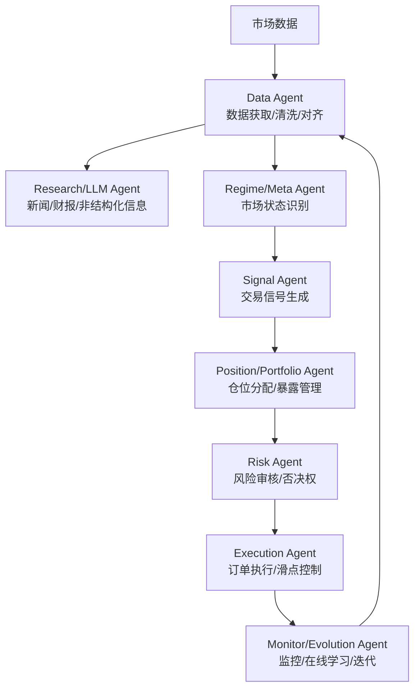

+++
date = '2026-06-28T13:56:19+08:00'
draft = false
title = 'Ai Quant Book Multi Agent Quant Trading Guide Optimized'
+++

## 练习

为了把本文真正学扎实，建议你完成下面三个练习：

### 练习 1：绘制你的量化系统架构图

根据本文的多智能体架构，绘制你自己的量化系统架构图：

1. 列出你的系统需要哪些 Agent（Data、Research、Regime、Signal、Position、Risk、Execution、Monitor）
2. 定义每个 Agent 的输入、输出和职责边界
3. 画出 Agent 之间的协作流程和依赖关系
4. 标识出你的系统当前缺少哪些能力

**目标**：理解多智能体架构的设计原理和职责拆分。

### 练习 2：实现一个最小化的 Risk Agent

根据本文第 15 课的内容，实现一个最小化的 Risk Agent：

1. 定义风险规则（如最大单票暴露、最大回撤、VaR 限制）
2. 实现订单审核逻辑（检查订单是否通过风险规则）
3. 实现否决权（如果订单不通过，拒绝执行）
4. 测试不同市场场景下的风险审核结果

**目标**：掌握 Risk Agent 的核心设计和实现方法。

### 练习 3：分析一个策略在不同市场状态下的表现

选择一个你已经实现的量化策略，分析它在不同市场状态下的表现：

1. 收集过去 1-2 年的市场数据，标注市场状态（趋势、震荡、高波动、低波动）
2. 回测你的策略在不同市场状态下的表现
3. 分析为什么策略在某些状态下表现好/差
4. 设计一个简单的 Regime Agent，根据市场状态调整策略权重

**目标**：理解 Regime Detection 的价值和实现方法。

---

## 常见问题 FAQ

### Q1：ai-quant-book 适合完全没有量化经验的人吗？

不适合。本文假设读者已经有基本的编程能力（Python）和金融常识。如果你完全没有量化经验，建议先学习 Part 2 的基础知识（市场机制、统计基础、策略范式、数据工程、回测陷阱、市场中性），再进入多智能体部分。

### Q2：我可以先实现单 Agent 系统，再拆成多 Agent 吗？

可以，而且推荐这样做。本文第 11 课给的渐进式路线就是从单 Agent 开始，先验证策略思路本身能不能赚钱，再逐步拆出 Risk、Regime、Execution 等 Agent。这样你能更清楚地理解每个 Agent 的价值和边界。

### Q3：多智能体系统会不会太慢，不适合高频交易？

会的。多智能体系统的延迟主要来自 Agent 之间的协作和决策收敛。如果你要做高频交易（持仓时间 < 1 小时），多智能体可能太慢。但对于中低频交易（持仓时间 > 1 天），多智能体是合适的。

### Q4：我可以把 ai-quant-book 的架构直接用在生产环境吗？

不能直接用。本文提供的是一套工程骨架和方法论，不是可直接用于实盘的交易系统。你需要：
1. 接入真实的券商 API
2. 实现可靠的订单执行和风险管理
3. 配置生产级的监控和告警
4. 进行充分的回测和模拟盘测试

### Q5：如何评估我的多智能体系统是否足够好？

建立评估集，包含以下维度：
1. **策略表现**：收益率、夏普率、最大回撤
2. **风险管控**：风险规则触发频率、否决订单占比
3. **执行质量**：滑点、成交额、订单完成率
4. **系统稳定性**：异常次数、恢复时间、监控覆盖率

定期回顾这些指标，持续优化你的系统。

---

---
title: "AI 量化交易从 0 到 1：ai-quant-book 多智能体量化系统导读"
date: "2026-04-23T21:02:46+08:00"
slug: "ai-quant-book-multi-agent-quant-trading-guide"
description: "系统解读 ai-quant-book 开源量化教程，梳理多智能体架构、22 课课程地图、学习路径，以及从 Regime Detection 到 Risk Agent、Execution Agent 的适用范围。"
draft: false
categories: ["技术笔记"]
tags: ["量化交易", "多智能体", "AI Agent", "量化", "Python"]
---

量化交易的坑，往往不在策略本身。回测跑出来的漂亮曲线，一到实盘就被滑点、跳空、风控缺位撕得粉碎。大部分教程教你怎么"玩"量化，[waylandzhang/ai-quant-book](https://github.com/waylandzhang/ai-quant-book) 想教你怎么"做"量化——用多智能体架构搭一套能扛住生产环境的交易系统。

## 快速信息卡

| 属性 | 值 |
|------|-----|
| GitHub Stars | 约 330+（截至 2026 年 4 月） |
| GitHub Forks | 约 70+ |
| 开源协议 | CC BY-NC-SA 4.0 |
| 项目形态 | 开源书籍 + 中英文网站教程 |
| 最后更新 | 2026-02-14（标记 Complete） |
| 内容规模 | 22 主课 + 30 篇背景知识 + 4 篇附录 |

> 本文写给写过回测脚本、想往系统化量化走的开发者，以及对 AI Agent 在严肃金融场景落地感兴趣的工程师。预计阅读时间 16 分钟。
>
> 你会看到：这套架构到底拆成了哪几层、为什么演进顺序比最终形态更重要、哪些章节值得花时间啃、哪些地方不要有错误预期。信息来源是 ai-quant-book GitHub README、中英文目录、英文官网和 Part 4/Part 5 的公开章节说明。

## §1 先把话说清楚：这本书是什么，不是什么

如果你想找一个"导入就能实盘赚钱"的项目，这里没有。

ai-quant-book 是 Wayland Zhang 写的开源书，主题就一个：用多智能体分工的思路，把量化交易从"回测脚本"变成"可运维的系统"。它不提供神奇 Alpha，也不接券商 API 直接下单。它给的是一套工程骨架，以及把数据、回测、状态识别、风控、执行、运维串起来的方法。

| 维度 | 实际情况 |
| ---- | ---- |
| 项目形态 | 开源书籍 + 网站教程，不是量化框架 |
| 语言版本 | 中文版、英文版均标记 Complete |
| 课程规模 | 5 个 Part、22 主课、30 篇背景文章、4 篇附录 |
| 协议 | CC BY-NC-SA 4.0（非商业使用） |

它把量化当成跨领域的系统工程问题处理：数据怎么拿、怎么清洗，回测怎么避开未来函数，单一策略为什么会在市场状态切换时失效，风控为什么不能写成事后补丁，执行滑点怎么建模，上线后怎么监控。这些问题，大部分回测框架教程不会碰。

按你的目标选读：

| 你的目标 | 优先看 |
| ---- | ---- |
| 先判断这套东西靠不靠谱 | §1、§2、§7、§8 |
| 搞懂多智能体主线到底讲到什么深度 | §3、§4、§6 |
| 想知道怎么开始读、从哪几课下手 | §5 |
| 打算把书里的方法迁到自己的系统 | §3、§6、§7 |

## §2 为什么量化需要多智能体，而不是一个大模型

很多人第一次看到"多智能体量化"，第一反应是：是不是让几个 LLM 聊天投票决定买还是卖？

不是。这本书里的 Agent 更像工程上的职责拆分，不是聊天机器人角色扮演。

传统量化教程容易停在五个地方，然后就不往下讲了：

| 教程常见终点 | 实盘真正要解决的问题 |
| ---- | ---- |
| 回测框架 API 怎么调 | 数据从哪来？限流、缺失值、复权、时区怎么处理？ |
| 技术指标怎么组合 | 未来函数怎么防？过拟合怎么识别？交易成本是真的吗？ |
| 如何找到一个好模型 | 市场状态变了怎么办？单一模型为什么会突然失效？ |
| 策略收益曲线好看 | 风控是独立层还是事后加一句判断？谁有否决权？ |
| 回测跑通了就算完 | 订单怎么执行？滑点谁来管？出故障怎么恢复？怎么监控？ |

作者引入多智能体，是为了回答这些问题。把信号生成、市场状态识别、风险审核、仓位分配、执行优化、系统监控拆成不同角色，每个角色只处理自己边界内的事，最后协作完成一笔交易。这不是什么 AI 黑科技，是软件工程里"单一职责"原则在交易系统里的具体落地。

## §3 完整架构：远不止 Signal/Risk/Execution 三件套

很多介绍把这本书简化成"Signal Agent + Risk Agent + Execution Agent"。这个说法不算错，但漏掉了一半东西。

### 3.1 系统分层总览

从第 01 课架构预览、第 11 课标准架构、第 21 课项目实战主循环来看，这套系统实际有 8 个主要角色：



各层具体职责和在书中的位置：

| 角色 | 主要职责 | 对应章节 |
| ---- | ---- | ---- |
| Data Agent | 数据获取、清洗、复权对齐、特征准备 | Part 2 第 06 课；第 21 课 Step 1 |
| Research/LLM Agent | 处理新闻、财报、社交媒体等非结构化信息 | 第 14 课；第 01 课架构预览 |
| Regime/Meta Agent | 判断当前市场状态，决定下游策略权重 | 第 11-12 课；第 21 课 Step 2 |
| Signal Agent | 生成原始交易信号和强度 | 第 10 课；第 21 课 Step 3 |
| Position/Portfolio Agent | 仓位分配、因子暴露管理、组合约束 | 第 16 课 |
| Risk Agent | 审核订单、执行止损、拥有一票否决权 | 第 15 课；第 21 课 Step 4 |
| Execution Agent | 拆单、路由、滑点控制、成交质量优化 | 第 19 课；第 21 课 Step 5 |
| Monitor/Evolution | 生产监控、异常告警、在线学习、策略迭代 | 第 17、20、21 课 |

有个细节要注意：公开材料里命名并不完全统一，Meta Agent 和 Regime Agent、Position Agent 和 Portfolio 层会交替出现，第 21 课实战里还出现了 Monitor Agent。这不影响主线——作者反复强调，职责边界比叫什么名字重要得多。

### 3.2 一次真实订单如何流过系统

光看分层表还是太抽象。我们跟踪一笔买单，看它在系统里怎么走：

假设现在是美股开盘后 30 分钟，某只科技股突然放量上涨：

1. **Data Agent** 先跑：拉取实时行情、Level 2 订单簿、过去 20 根 K 线，处理好拆股复权，对齐时区，把缺失的 Tick 补全。
2. **Research Agent** 扫了一下新闻和推特：发现刚出了超预期财报，不是乌龙指。
3. **Regime Agent** 判断当前市场状态：VIX 处于低位、科技板块整体走强、最近一周没有重大宏观事件——判定为"趋势行情"，允许趋势跟踪类信号通过，关闭均值回归策略的权重。
4. **Signal Agent** 在趋势状态下计算：动量因子打分进入买入区间，信号强度 0.72（满分为 1），建议买入 1000 股。
5. **Position Agent** 检查组合：当前账户科技板块暴露已经 28%，单票上限 5%。按当前股价计算，建议买入量缩到 600 股。
6. **Risk Agent** 做最后审核：今日已用 VaR 占额度 65%，这笔单加上后是 78%，在阈值内；距离最近止损位 3.2%，单笔最大亏损可接受；没有触发单票集中度限制——**通过**。如果发现接近暴露上限或日内亏损超标，这一层直接缩单或拒单，Signal 再强也没用。
7. **Execution Agent** 接手：当前盘口买卖价差 2 美分，流动性足够，不用拆太小；用 TWAP 算法在 5 分钟内分批吃单，控制市场冲击；实时跟踪滑点，超过 5 个基点就暂停。
8. **Monitor Agent** 全程记录：每笔成交价格、延迟、滑点、持仓变化都写进日志；如果这笔单实际滑点远超预期，触发告警，同时把这次执行结果反馈给 Evolution 模块，下次调整 Execution 参数。

这条链路里，任何一个环节出问题，交易结果都会和回测差很多。这也是为什么单策略脚本很难直接上实盘。

### 3.3 演进路径：不要一上来就堆 8 个 Agent

第 11 课给的渐进式路线非常实在。它不建议你第一天就把所有 Agent 都写出来，而是按痛点分步拆：

| 阶段 | 系统形态 | 解决什么问题 |
| ---- | ---- | ---- |
| 阶段 1 | 单 Agent | 先验证策略思路本身能不能赚钱 |
| 阶段 2 | Signal + Risk | 先把风控独立出来，别让一笔亏损拖垮账户 |
| 阶段 3 | Signal + Risk + Execution | 滑点和成交质量开始成为主要误差来源时加 |
| 阶段 4 | 加入 Regime | 发现策略在震荡市赚钱、趋势市亏钱，或反过来 |
| 阶段 5 | 完整架构 | 资金量上去、策略变多后，补 Data、Position、Research、Monitor |

如果你已经有一个能跑的单策略系统，推荐拆的顺序是：先拆 Risk，再补 Regime，最后强化 Execution。这个顺序是按实盘里"死得快"的程度排的——先把账户打爆的通常是回撤失控，然后是市场状态变了策略还在硬扛，最后才是执行细节吃掉利润。

## §4 22 课结构：为什么说这个编排本身就有价值

很多技术书的目录是知识点罗列，这本不是。它的五个 Part 是按认知路径排的：先给你全局地图，再补基础，最后回到系统集成。

### 4.1 五个 Part 构成的路径

| Part | 主题 | 核心内容 |
| ---- | ---- | ---- |
| Part 1 | Quick Start（第 01 课） | 量化全景图、多智能体直觉、课程边界 |
| Part 2 | Fundamentals（第 02-08 课） | 市场机制、统计基础、策略范式、数据工程、回测陷阱、市场中性 |
| Part 3 | Machine Learning（第 09-10 课） | 监督学习基础、从预测模型到可决策 Agent |
| Part 4 | Multi-Agent（第 11-17 课） | 架构设计、Regime Detection、误判降级、LLM 应用、风控、仓位管理、在线学习 |
| Part 5 | Production（第 18-22 课） | 交易成本建模、执行系统、生产运维、项目实战、总结 |

多智能体放在 Part 4，而不是开头。作者不假设 Agent 能替代基本功——数据、回测、统计、策略约束这些东西没搞懂，直接上 Agent 只是在脆弱的地基上搭复杂框架。

### 4.2 30 篇背景文章和 4 篇附录不是凑数的

很多教程的"延伸阅读"是摆设，这本不是。背景文章覆盖的主题相当实在：

- Alpha 和 Beta 的区别、中美量化市场差异、LTCM 和文艺复兴这些历史案例
- 数据源和 API 对比、订单簿机制细节、Sharpe Ratio 的统计陷阱、Purged CV、Triple Barrier Labeling
- 多智能体框架横向对比、量化开源框架生态、执行模拟器实现思路、算法交易监管要点

4 篇附录也直接对准实盘痛点：实盘记录规范、量化系统常见的"死法"、人类决策和自动化的边界、高频 FAQ。

这些内容讲的是方法论、失败模式和边界意识——恰恰是实盘里亏钱最快的地方。

## §5 怎么读：不同背景的人有不同的入口

### 5.1 官方推荐路径

| 读者类型 | 官方建议路径 |
| ---- | ---- |
| 零基础入门 | Part 1 → Part 2 全部 → Part 3 → Part 4（可先跳过第 13 课）→ Part 5 |
| 有编程基础 | 第 01 课 → 快速扫 Part 2 → Part 3-5 全部 |
| 有量化基础 | 第 01 课 → 第 08 课 → Part 3-5 全部 |
| 只关心架构 | 第 01 课 → 第 10-17 课 → 附录 B |

前置要求不高：基本 Python 编程能力是必须的，统计学和金融常识有帮助，不需要你先懂机器学习或深度学习。

### 5.2 如果时间有限，优先啃这几课

想快速建立系统感，不用按顺序一页页读：

| 你的目标 | 优先读 | 原因 |
| ---- | ---- | ---- |
| 先建立全局地图 | 第 01 课 | 量化全景、架构预览、课程边界都在这里 |
| 避免回测自欺欺人 | 第 06-08 课 | 数据工程、回测陷阱、市场中性，这是最容易被低估的部分 |
| 理解从模型到 Agent 的转折 | 第 10 课 | "预测"和"决策"是两回事，这一课讲清楚了 |
| 真正搞懂多智能体 | 第 11-13 课 | 为什么要拆、Regime Detection 怎么做、误判了怎么降级 |
| 建立风控和组合意识 | 第 15-16 课 | Risk Agent 的否决权、暴露管理，这是系统生死线 |
| 看落地系统长什么样 | 第 19-21 课 | 执行、运维、项目实战把前面的内容真正串起来 |

只想判断"这套东西能不能用到我自己的系统"，第 10、11、12、15、19、21 课这六课组合起来价值最高。

## §6 几个关键设计取舍

### 6.1 LLM 放在增强层，不是决策层

第 14 课的标题是 "LLM Applications in Quant"，不是"用 LLM 做交易"。作者对 LLM 的态度很克制：它适合处理新闻、财报、社交媒体这类非结构化文本，适合做研究辅助和结果解释，但不适合假装自己是高频交易大脑。

全书没有"Agent 化后自动赚钱"的叙事，LLM 始终待在工程系统里它该待的位置。

### 6.2 Regime Detection 看净值改善，不看分类准确率

这是个很典型的工程判断场景：分类模型准确率从 65% 提升到 78%，看起来不错。但组合净值没改善，最大回撤也没缩小——为什么？因为状态切换本身有成本：换仓的滑点、手续费、短期双重止损。如果模型经常在状态边界震荡，切换成本会吃掉分类正确带来的收益。

书里的做法是把评估指标从"分类准不准"改成"净值改善减去切换成本"。只有真的能改善收益质量的 Regime 模型，才进生产链路。分类准确率再高，不赚钱就不上。

### 6.3 Risk Agent 是否决层，不是提示层

再看一个真实场景：Signal Agent 给出强烈买入信号，分数 0.89，但账户当日 VaR 已经用了 92%，科技板块暴露离上限只差 1.5%。

这时候 Risk Agent 可以做三个选择：缩单（按剩余额度买）、拒单（直接否决）、触发强制止损（如果是已有持仓再加单）。它有实权，不是弹出一个"风险提示"然后让 Signal 继续下单。

很多"多智能体金融"项目把风控写成提示词里的一句"请注意风险"，那不是工程系统，是研究玩具。Risk Agent 有没有否决权，决定了这套东西能不能碰真钱。

### 6.4 第 21 课的主循环是个可以直接抄的骨架

从项目实战章节可以抽象出一条非常实用的系统链路：

```text
市场数据
    → Regime Agent 判断状态
    → Signal Agent 生信号
    → Position Agent 算仓位
    → Risk Agent 做审核
    → Execution Agent 去执行
    → Monitor 记录结果
    → Evolution 迭代参数
    → 下一个循环
```

这不是可以直接复制粘贴到生产的完整代码，但作为系统设计模板已经够用。你正在把单策略脚本改造成长期可维护的交易系统，这个骨架可以直接用。

## §7 边界：它能帮你什么，帮不了什么

### 7.1 实际价值在哪

说具体点，这本书至少在四个地方有用：

1. 把量化学习的重心从"找圣杯策略"拉到"构建可靠系统"——这是大部分自学者最缺的视角。
2. 把多 Agent 的拆分逻辑和职责边界讲清楚了，不是只给一张流程图。
3. Regime、Risk、Execution、Operations 这些真正决定实盘生死的环节，被放到了和策略同等重要的位置。
4. 中英文双版本、完整目录、背景文章和附录，构成了一个可以反复查阅的知识库，不是一次性的博客文章。

### 7.2 别抱错预期

| 你可能在找的 | 这本书实际给的 |
| ---- | ---- |
| 拿来就能实盘的完整系统 | 方法、课纲、设计骨架，不是即插即用的交易平台 |
| 稳定盈利策略合集 | 系统设计和风控思路，不承诺任何收益 |
| 所有券商/交易所接入细节 | 通用架构和学习路径，不是券商接口文档大全 |
| 只靠 LLM 就自动交易 | LLM 是增强层，不替代任何核心模块 |

它适合学习怎么搭系统。不要把"课程目录很完整"误读成"生产成熟度已经验证"。

## §8 结论：谁该读，谁不必浪费时间

如果你的情况符合下面任意一条，这本书值得投入时间：

- 已经写过策略或回测脚本，开始遇到回测和实盘不一致的问题，想理解系统化量化该怎么搭。
- 对 AI Agent 感兴趣，但不想停留在"多角色聊天"的 Demo 层面，想看它在严肃金融工程里怎么落地。
- 需要一份把数据、Regime、Risk、Execution、Production 串成一条线的学习材料，而不是零散的博客文章。

如果你的目标是下面这些，可以直接跳过：

- 想找一个今天导入、明天就能赚钱的策略模板。
- 只关心某个框架的 API 怎么调，对系统设计和风险边界没兴趣。
- 打算拿公开课纲直接替代实盘验证、监控、合规和部署工作。

ai-quant-book 不是量化交易的圣杯说明书，但在中文语境里，把多智能体量化系统当工程问题拆解得这么完整的开源教程，确实不多见。把它当系统地图用，别当暴富钥匙，收获会大很多。

## 资料来源

- [waylandzhang/ai-quant-book GitHub 仓库](https://github.com/waylandzhang/ai-quant-book)
- [英文网站首页](https://www.waylandz.com/quant-book-en)
- [中文版目录](https://github.com/waylandzhang/ai-quant-book/tree/main/manuscript/cn)
- [英文版目录](https://github.com/waylandzhang/ai-quant-book/tree/main/manuscript/en)

## 自测题

**问题 1**: ai-quant-book 的核心定位是什么？
<details>
<summary>查看答案</summary>
它是一套开源量化交易书籍和课程体系，把量化交易作为跨数据、研究、建模、风控、执行、运维的系统工程问题组织，教你用多智能体架构构建可落地的交易系统。它不提供现成的盈利策略，也不是可以直接实盘的交易平台。
</details>

**问题 2**: 多智能体的推荐演进顺序是什么？
<details>
<summary>查看答案</summary>
阶段 1（单 Agent 验证策略）→ 阶段 2（拆出 Risk Agent）→ 阶段 3（加入 Execution Agent）→ 阶段 4（补 Regime Agent）→ 阶段 5（完整架构含 Data、Position、Research、Monitor）。如果已有单策略系统，建议先拆 Risk，再补 Regime，最后强化 Execution。
</details>

**问题 3**: Risk Agent 和很多项目里的"风险提示"有什么本质区别？
<details>
<summary>查看答案</summary>
Risk Agent 在书里是否决层，不是说明层。它有实权审核订单，可以缩单、拒单或触发强制止损，优先守住风险边界。Signal 再强，过不了 Risk 这关也不能下单。
</details>

**问题 4**: Regime Detection 为什么不能只看分类准确率？
<details>
<summary>查看答案</summary>
因为状态切换本身有成本——换仓滑点、手续费、短期可能触发双重止损。如果模型在状态边界频繁震荡，分类准确率再高，切换成本也会吃掉收益。应该用"净值改善减去切换成本"来评估，而不是只看分类分数。
</details>

**问题 5**: 如果只有时间读 3 课，选哪几课？
<details>
<summary>查看答案</summary>
第 01 课（建立全局地图）、第 11 课（多智能体为什么要拆、怎么拆）、第 21 课（完整系统主循环和项目实战）。如果已经有回测经验，把第 15 课（Risk Agent）也加上。
</details>

## 进阶路径
## 练习

为了把本文真正学扎实，建议你完成下面三个练习：

### 练习 1：绘制你的量化系统架构图

根据本文的多智能体架构，绘制你自己的量化系统架构图：

1. 列出你的系统需要哪些 Agent（Data、Research、Regime、Signal、Position、Risk、Execution、Monitor）
2. 定义每个 Agent 的输入、输出和职责边界
3. 画出 Agent 之间的协作流程和依赖关系
4. 标识出你的系统当前缺少哪些能力

**目标**：理解多智能体架构的设计原理和职责拆分。

### 练习 2：实现一个最小化的 Risk Agent

根据本文第 15 课的内容，实现一个最小化的 Risk Agent：

1. 定义风险规则（如最大单票暴露、最大回撤、VaR 限制）
2. 实现订单审核逻辑（检查订单是否通过风险规则）
3. 实现否决权（如果订单不通过，拒绝执行）
4. 测试不同市场场景下的风险审核结果

**目标**：掌握 Risk Agent 的核心设计和实现方法。

### 练习 3：分析一个策略在不同市场状态下的表现

选择一个你已经实现的量化策略，分析它在不同市场状态下的表现：

1. 收集过去 1-2 年的市场数据，标注市场状态（趋势、震荡、高波动、低波动）
2. 回测你的策略在不同市场状态下的表现
3. 分析为什么策略在某些状态下表现好/差
4. 设计一个简单的 Regime Agent，根据市场状态调整策略权重

**目标**：理解 Regime Detection 的价值和实现方法。

---

## 常见问题 FAQ

### Q1：ai-quant-book 适合完全没有量化经验的人吗？

不适合。本文假设读者已经有基本的编程能力（Python）和金融常识。如果你完全没有量化经验，建议先学习 Part 2 的基础知识（市场机制、统计基础、策略范式、数据工程、回测陷阱、市场中性），再进入多智能体部分。

### Q2：我可以先实现单 Agent 系统，再拆成多 Agent 吗？

可以，而且推荐这样做。本文第 11 课给的渐进式路线就是从单 Agent 开始，先验证策略思路本身能不能赚钱，再逐步拆出 Risk、Regime、Execution 等 Agent。这样你能更清楚地理解每个 Agent 的价值和边界。

### Q3：多智能体系统会不会太慢，不适合高频交易？

会的。多智能体系统的延迟主要来自 Agent 之间的协作和决策收敛。如果你要做高频交易（持仓时间 < 1 小时），多智能体可能太慢。但对于中低频交易（持仓时间 > 1 天），多智能体是合适的。

### Q4：我可以把 ai-quant-book 的架构直接用在生产环境吗？

不能直接用。本文提供的是一套工程骨架和方法论，不是可直接用于实盘的交易系统。你需要：
1. 接入真实的券商 API
2. 实现可靠的订单执行和风险管理
3. 配置生产级的监控和告警
4. 进行充分的回测和模拟盘测试

### Q5：如何评估我的多智能体系统是否足够好？

建立评估集，包含以下维度：
1. **策略表现**：收益率、夏普率、最大回撤
2. **风险管控**：风险规则触发频率、否决订单占比
3. **执行质量**：滑点、成交额、订单完成率
4. **系统稳定性**：异常次数、恢复时间、监控覆盖率

定期回顾这些指标，持续优化你的系统。

---
**刚入门量化**：
1. 从 Part 1 开始，建立全景认知
2. Part 2 的数据工程和回测陷阱要认真学，这部分最容易跳过但最容易踩坑
3. 再进 Part 3 理解机器学习怎么从预测变成决策
4. 最后用 Part 4-5 搭一个自己的多 Agent 原型，不用追求全，先跑通 Signal + Risk + Execution 三层

**已有单策略系统**：
1. 第一步先把 Risk Agent 独立出来，给它否决权（第 15 课）
2. 然后补 Regime Agent，解决不同市场状态下策略表现差异大的问题（第 11-12 课）
3. 再优化 Execution Agent，把滑点和成交质量管起来（第 19 课）
4. 最后参考第 21 课主循环改造自己的系统骨架

**只关心架构设计**：
1. 第 01 课看架构预览
2. 第 10-17 课是多智能体核心，重点看职责拆分和演进顺序
3. 附录 B《量化系统常见死亡方式》值得反复看
4. 把第 21 课的主循环迁到自己的项目里，根据实际情况增删 Agent

---
*本文基于 2026 年 6 月前公开可见资料整理，不构成投资建议。项目数据随时间变化，以 GitHub 仓库最新状态为准。*
