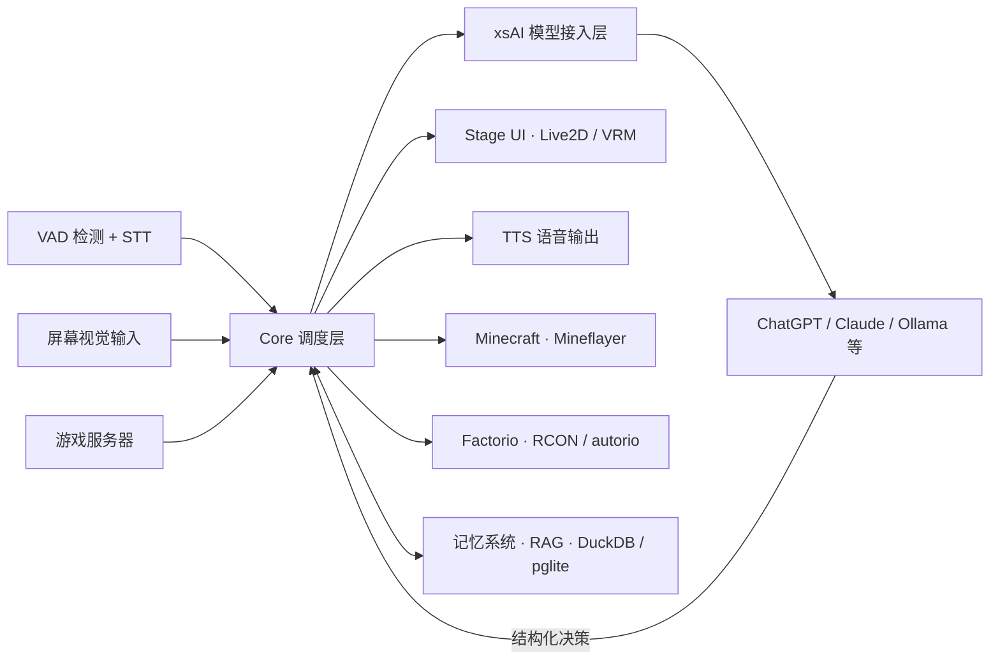

+++
github_repo = "moeru-ai/airi"
date = '2026-05-28T16:18:30+08:00'
draft = false
title = 'AIRI：自托管 AI 数字伴侣'
slug = 'airi-self-hosted-grok-companion-guide'
description = 'AIRI 是 moeru-ai 复现 Neuro-sama 的开源项目：把 Live2D/VRM 虚拟角色带到桌面，能实时语音对话、接入 20+ 大模型提供商，还能进 Minecraft、Factorio 玩游戏，数据自持。'
categories = ['技术笔记']
tags = ['开源', 'Live2D', '自托管']
+++

# AIRI：自托管 AI 数字伴侣

AIRI 是 moeru-ai 组织为了复现 Neuro-sama 做出来的开源项目：把 AI 虚拟角色装进 Live2D/VRM 的身体，能实时语音对话，也能进 Minecraft、Factorio 玩游戏。官方在 GitHub 上把它描述成「you-owned Grok Companion」「数字灵魂容器」，目标是把 Neuro-sama 这类能聊天又能玩游戏的 AI vtuber，做成普通人能自己部署、数据自持的版本。

它跟普通 AI 陪伴产品的分界在架构上：渲染、AI、游戏三条链路收进同一个调度框架，由 Core 统一协调。聊天、看屏幕、玩游戏这三件事不是各拉一套流程，而是共用同一套状态机。这是它区别于「只换皮肤的角色壳子」的地方。

---

## 核心数据

以下数据来自 GitHub API 与仓库 README，观测时间 2026-08-05：

| 项 | 值 |
|------|------|
| Stars / Forks | 43,860 / 4,384 |
| 主要语言 | TypeScript |
| 开源协议 | MIT |
| 默认分支 / 最近推送 | main / 2026-07-27 |
| 最新 release | v0.10.2 |
| 官方文档 | airi.moeru.ai/docs/ |

下载入口覆盖 Windows（winget / Scoop）、macOS（Homebrew Cask）、Linux，以及浏览器与移动端（PWA）。

---

## 系统总览

AIRI 的核心是三条并行链路在同一个 Core 调度层里汇合：



三条链路各自的职责：

| 链路 | 入口 | 关键依赖 | 出口 |
|------|------|----------|------|
| 渲染链路 | VRM / Live2D 模型 | Stage UI、WebGPU、Candle | 浏览器、桌面、移动端 |
| AI 链路 | LLM API | xsAI、Core | STT 输入、TTS 输出 |
| 游戏链路 | Minecraft / Factorio 服务器 | Mineflayer、RCON、`autorio` | agent 执行动作 |

渲染链路决定角色如何被看见，AI 链路决定角色如何思考与说话，游戏链路决定角色如何对外部世界产生作用。普通「AI 角色壳子」通常只覆盖前两条，AIRI 把第三条也拉进来了。

---

## 技术骨架

### 多端部署的三个 Stage

AIRI 把同一套逻辑拆成三个 stage，避免把同一种界面硬塞进不同壳子导致体验割裂：

- **Stage Web**：直接在浏览器里跑，承担零安装体验的入口，重点依赖 WebGPU、WebAssembly、WebAudio 和 WebSocket。官方在 airi.moeru.ai 提供在线试玩。
- **Stage Tamagotchi**：桌面版，推理层通过 HuggingFace Candle 走本地 CUDA / Metal 加速。Candle 的作用是把 PyTorch 生态的模型权重直接搬到 Rust 运行时，桌面端据此获得低延迟的本地推理。
- **Stage Pocket**：通过 Capacitor 和 PWA 把 Web 代码封装到移动端，覆盖陪伴场景的随身入口，复用 Web 代码避免维护两套 UI。

三个 stage 的分工对应不同场景：浏览器负责首次体验，桌面端负责持续运行时的低延迟推理，移动端负责随身陪伴。

### xsAI：模型接入层的抽象

模型接入层是一个独立的 `xsAI` 模块（`moeru-ai/xsai`），负责把 OpenAI、Claude、Gemini、Ollama、vLLM、SGLang、DeepSeek、Qwen、xAI、Groq、Mistral 等约 28 个提供商抽象成统一接口。

AIRI 本身不绑定某个模型品牌。换提供商不需要改核心代码；对开发者来说，这更像一个面向虚拟角色场景的模型编排层。虚拟角色对延迟、流式输出、函数调用、多模态输入的要求和普通聊天 API 不完全一致，xsAI 在统一接口之上补齐这些差异。

### 游戏代理能力

AI 角色被接进了真实的游戏运行时：

- **Minecraft**：通过 Mineflayer 把 LLM 生成的决策翻译成移动、攻击、放置方块等操作。Mineflayer 提供 Node.js 端的 Minecraft bot 协议实现，AIRI 之上再加一层「高层目标 → 动作序列」的翻译。
- **Factorio**：通过 RCON 和 `autorio` 把高层目标拆成流水线执行步骤。这一步仍是 WIP，官方仓库 `moeru-ai/airi-factorio` 提供了 PoC 和 demo。

Neuro-sama 风格体验难复现的难点正在于此：LLM 生成文本容易，把文本决策可靠地映射到游戏世界状态很难。AIRI 的游戏链路是针对这层映射做的工程化封装。

### 语音与本地数据层

语音链路和本地数据层是一起设计的：

- **输入**：客户端侧 VAD（Voice Activity Detection）先判断是否在说话，再触发客户端侧 STT，避免一直上传静音片段。音频输入支持浏览器和 Discord。
- **输出**：多提供商 TTS，包括 ElevenLabs、Microsoft/Azure Speech、OpenAI-compatible TTS、阿里云 Model Studio，以及本地的 Kokoro TTS。
- **数据**：DuckDB WASM 或 `pglite` 提供纯浏览器端嵌入式数据库，配合记忆系统与 RAG 模块沉淀跨会话上下文。

语音链路负责实时交互，数据层负责跨会话记忆——两者结合，让 AIRI 具备持续积累上下文的能力，而不是一次性对话演示。

---

## 任务流案例：一句「陪我玩 Minecraft」如何流过系统

假设用户对角色说「陪我玩 Minecraft」，大致流程如下：

1. **AI 链路入口**：本地 VAD 检测到语音活动，STT 把「陪我玩 Minecraft」转成文本，送入 Core。
2. **Core 调度**：Core 把文本连同当前屏幕状态、游戏服务器连接状态打包，通过 xsAI 调用配置好的 LLM，并附带系统提示词，告知当前可调用的工具（连接服务器、移动、攻击、说话等）。
3. **LLM 决策**：LLM 返回结构化决策，例如「连接到 Minecraft 服务器 → 走向玩家 → 说『我来了』」。决策以函数调用格式返回，便于 Core 解析路由。
4. **游戏链路执行**：Core 把决策路由到 Minecraft agent，Mineflayer 把「走向玩家」翻译成 bot 的寻路调用，bot 的坐标变化实时回写到 Core 的状态机。
5. **渲染链路同步**：角色在 Stage UI 中播放对应的 Live2D/VRM 动作，TTS 把「我来了」合成为语音输出。动作触发与语音合成是异步的，避免互相阻塞。
6. **数据层沉淀**：这次交互被记忆系统记录摘要，下次进入游戏时角色能回忆起「上次和玩家一起玩过」。摘要写入 DuckDB WASM，RAG 模块在下次对话时检索相关片段注入上下文。

三条链路是并行触发的——LLM 在生成决策时，渲染层已经在准备动作动画，数据层在异步写入记忆。Core 的职责是协调这些并行任务的时序，避免 LLM 还没返回就触发动作、动作执行完才合成语音导致画面与声音不同步。

---

## 能力现状与边界

README 的 roadmap 把能力分成四块，大多数已经打勾：

| 模块 | 状态 |
|------|------|
| Brain（大脑） | 已能玩 Minecraft；Factorio 为 WIP（有 PoC）；Kerbal Space Program 已宣布 TBD；Helldivers 2 WIP |
| Brain（通信） | 可接入 Telegram、Discord 聊天 |
| Memory | DuckDB WASM / pglite 已支持；Memory Alaya 与纯浏览器端（WebGPU）本地推理为 WIP |
| Ears（听觉） | 浏览器与 Discord 音频输入、客户端侧语音识别与说话检测均完成 |
| Mouth（发声） | 多提供商 TTS 完成，含本地 Kokoro |
| Body（身体） | VRM 与 Live2D 支持、动画、自动眨眼、自动注视、待机眼动均完成 |

注意两点：Factorio 和 Helldivers 2 仍是实验状态，游戏集成可能随版本更新变化；Memory Alaya 还没落地，当前跨会话记忆依赖摘要 + 检索，不是完整上下文保留。

---

## 安装与快速开始

不需要从源码编译，有现成的安装入口：

- **Windows**：`winget install MoeruAI.AIRI`，或用 Scoop：

```powershell
scoop bucket add airi https://github.com/moeru-ai/airi
scoop install airi/airi
```

- **macOS**：`brew install --cask airi`
- **Linux**：GitHub Releases 提供 Linux 安装包，开发环境也可用 Nix 运行 `nix run github:moeru-ai/airi`
- **浏览器**：直接访问 airi.moeru.ai 在线试玩，无需安装

角色配置需要两类文件：Live2D（`.moc3` / `.model3.json`，2D 纸片人路线，社区资源丰富）或 VRM（`.vrm`，3D 路线，兼容 VRChat 等平台）。项目本身不提供模型文件，需要自己准备或购买。

---

## 常见问题

**Q: AIRI 能替代 Neuro-sama 吗？**
A: 不能。Neuro-sama 是商业闭源项目，有持续的直播互动和社区运营；AIRI 是开源复现方案，功能与体验上有差距，优势是完全自托管、数据本地化。

**Q: 需要什么硬件配置？**
A: 桌面端做本地推理需要支持 CUDA 或 Metal 的 GPU，显存需求随模型大小、序列长度和并发数变化，社区经验认为 8GB 以上更稳妥；纯浏览器端不需要 GPU，但推理延迟会更高。

**Q: 能接入商业大模型吗？**
A: 可以。xsAI 支持约 28 个提供商，包括 OpenAI、Claude、Gemini、Ollama、vLLM 等，需要自己配置对应的 API Key。

**Q: 游戏代理能力稳定吗？**
A: 不稳定。Minecraft 和 Factorio 的集成是实验性的，游戏版本更新可能导致协议变化。建议只在本地单机世界测试，不要用在多人服务器上。

---

## 适用边界

**适合：**
- 有一定技术背景、想本地部署 AI 虚拟角色的用户
- 想要类似 Neuro-sama 体验、又不想依赖官方服务的用户
- 对 Live2D/VRM 角色格式有了解、愿意自己配置模型的开发者

**不适合：**
- 完全没有技术背景、想要开箱即用的普通用户（安装和配置模型都有门槛）
- 想直接用现成 3D 角色的人（模型需要自己准备）
- 期待功能与 Neuro-sama 完全一致的用户（开源复现与原版有差距）

## 采用建议

按以下顺序评估是否采用 AIRI：

1. **先验证模型接入**：在浏览器跑 Stage Web，配置一个已有 API Key 的 LLM，确认 xsAI 抽象层在你的提供商上工作正常。
2. **再验证角色渲染**：准备一个 Live2D 或 VRM 模型，确认 Stage UI 能正确加载并播放动作。
3. **最后验证游戏链路**：如果你关心 agent 能力，单独跑 Minecraft 集成，观察 Mineflayer 的动作执行稳定性。
4. **落地前评估数据层**：记忆系统和 RAG 模块在浏览器端的内存占用，需要单独压测。

前三步任何一步卡住，建议先暂停。AIRI 的价值在于三条链路协同，单链路跑通不等于整体可用。

---

## 资料口径说明

本文基于 AIRI 官方仓库（github.com/moeru-ai/airi）与其 README 撰写，核心数据经 GitHub API 于 2026-08-05 验证。需要说明的边界：

1. **版本时效性**：项目处于活跃开发阶段，Stage 策略、xsAI 接口、游戏链路支持可能随版本变化，请以官方仓库最新代码为准。
2. **模型文件依赖**：AIRI 本身不含 Live2D / VRM 模型文件，需要用户自行准备。不同模型格式的动画支持程度不同，本文无法保证所有模型都能正常运行。
3. **硬件要求**：上文提到的显存数值（8GB 以上）为社区经验值，实际需求会因模型大小、序列长度、并发数而变化。
4. **游戏链路稳定性**：Minecraft 和 Factorio 的集成是实验性的，游戏版本更新可能导致协议变化，建议在本地单机世界测试。
5. **语音链路依赖**：本地 VAD/STT 的识别质量依赖所选方案，本文未逐一验证；TTS 的延迟与音质随服务而异。
6. **数据隐私**：本地部署时数据自持，但接入商业大模型 API 时，对话内容会发送到对应服务商，请依据各服务商的隐私政策评估。

---

*本文基于 AIRI 项目撰写，相关信息可能随版本更新而变化。*