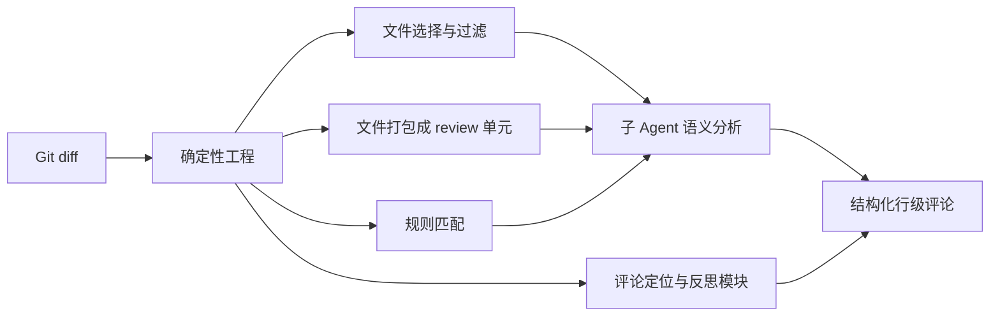

## 核心判断

OpenCodeReview（OCR）是阿里巴巴从内部工具孵化出的开源 AI 代码审查 CLI。按官方 README 的说法，它在阿里内部作为官方 AI 代码审查助手跑了两年，服务数万开发者，累计识别数百万个代码缺陷，验证充分后开源。它把一件事说得很清楚：**通用 AI agent 做代码审查时不够可靠，需要用确定性工程逻辑给 agent 加上硬约束，才能保证覆盖率和定位精度。**

这个判断有数据支撑。它来自一个 50 个开源仓库、200 个真实 PR、10 种编程语言构成的 benchmark，由 80+ 高级工程师交叉标注出 1,505 个 ground-truth 缺陷。在相同底层模型下，OCR 与 Claude Code 通用 agent 对比的结果是：

| 指标 | 含义 | OCR 的位置 |
|------|------|-----------|
| Precision | 报告的问题中真实缺陷的比例 | 显著更高 |
| F1 | 精确率和召回率的调和平均 | 显著更高 |
| Recall | 发现的真实缺陷比例 | 低于通用 agent |
| Avg Token | 每次审查消耗的 token | 仅约 1/9 |
| Avg Time | 每次审查耗时 | 更快 |

这是明确的工程取舍：**宁可少报，也不要误报**。在 CI 流水线里，高误报率会让开发者对审查结果逐渐脱敏，到最后没人再看告警。OCR 用高精确率 + 低 token 消耗，换来的是审查结果值得被认真对待。

截至 2026-09-14（GitHub API 验证）：Stars 约 2.5 万、Forks 约 1,800、主语言 Go、Apache-2.0、默认分支 main、仓库创建于 2026-05-18。仓库曾登 Trendshift 趋势榜，并拿到 OpenSSF Best Practices 金牌认证。

## 系统地图：两条主线如何分工

OCR 的架构可以拆成两条互补的主线，理解这两条线，剩下的细节都挂在这两个盒子上。



- **确定性工程**负责"绝对不能错"的步骤：哪些文件要审、哪些过滤、打包成什么单元、落在哪一行。这些由代码保证，不由模型生成。
- **Agent**负责动态的部分：语义分析、跨文件上下文、生成审查意见。它的不确定性被锁在"语义分析"这一环节，不影响覆盖和定位。

## 为什么通用 agent 不够好

README 对通用 agent（如 Claude Code + Skills）做代码审查时的痛点分析，落在这三点：

**1. 覆盖率不稳**：较大 changeset 里 agent 会"偷懒"，只审一部分文件就跳过其余。这跟模型能力无关，是 agent 在长上下文中容易丢掉任务目标。

**2. 定位漂移**：报告的问题经常对不上真实代码位置——文件名错、行号偏移、甚至指向完全无关的代码段。对需要逐行定位的 code review 来说，这不可接受。

**3. 质量波动**：prompt 的微小变化会让审查质量大幅波动。自然语言驱动的 Skills 方案缺少对审查流程的硬约束。

根因是：**纯粹靠语言模型驱动的架构，缺少对审查过程的确定性保证。**

## 确定性工程负责什么

这一侧把"必须稳定"的事情全部接管：

- **精确的文件选择**：工程逻辑确定哪些文件需要审查、哪些过滤，保证没有遗漏。
- **文件打包**：把相关文件合成一个审查单元，例如 `message_en.properties` 和 `message_zh.properties` 一起审。每个单元跑一个子 agent、上下隔离，属于分而治之——在超大 changeset 上依然稳定，也天然支持并发审查。
- **规则匹配**：用模板引擎把审查规则匹配到文件特征，让模型注意力集中，从源头消除信息噪音。相比纯语言驱动的规则引导，模板匹配更稳定、可预测。
- **外置定位与反思模块**：独立的评论定位和评论反思模块，系统性地提升反馈的位置准确度和内容准确度。

## Agent 负责什么

Agent 只在动态判断和动态取上下文的地方发力：

- **场景化 prompt 模板**：针对代码审查深度优化，既提升效果又省 token。
- **场景化工具集**：从大规模生产数据的工具调用轨迹里提炼——统计调用频率分布、单工具重复率、新工具对调用链的影响——得到一个比通用 agent 工具集更稳、更可预测的代码审查专用工具集。

## 一次审查是怎么流过系统的

以 `ocr review` 审一个 PR 上的 diff 为例，整个链路是：

1. 确定性工程先读 Git diff，按规则选出该审的文件，过滤掉测试生成、依赖锁文件一类噪音。
2. 相关文件被打包成审查单元，各自分给一个子 agent，上下文隔离。
3. 每个子 agent 读取完整文件内容、搜索代码库、对照其他变更文件，输出结构化审查意见。
4. 外置定位模块把意见落到精确行号和文件路径，反思模块再复查一遍内容。
5. 最终产出的是行级、可定位的评论，而不是一段雾里看花的总结。

## 快速上手

### 前置要求

Git >= 2.41。OCR 依赖 Git 生成 diff、做代码搜索和仓库操作。支持 Windows、macOS、Linux 三个平台。

### 安装

```bash
npm install -g @alibaba-group/open-code-review
```

装完后全局可用 `ocr` 命令。不想走 npm 的话，官方还提供安装脚本、GitHub Release 二进制下载和源码编译三种方式，见官方文档的安装页。

### 配置模型

审查前必须配置 LLM（除非用 Delegation 模式）。用交互式命令选择内置 provider 或自定义：

```bash
ocr config provider    # 选择内置 provider 或添加自定义
ocr config model       # 为当前 provider 选模型
```

交互式界面会引导你完成 provider 选择、API key 输入和模型配置，并自动测试连通性。环境变量、自定义 provider 等进阶配置见官方文档。

### 审查

```bash
# 工作区模式：审查所有已暂存、未暂存、未跟踪的改动
ocr review

# 分支区间：比较两个 ref
ocr review --from main --to feature-branch

# 单个 commit
ocr review --commit abc123

# 中断后恢复：先列出 session，再续跑
ocr session list
ocr review --from main --to feature-branch --resume <session-id>

# 整文件扫描：审整个仓库，或指定目录/文件
ocr scan
ocr scan --path internal/agent

# 输出 JSON 到文件（官方推荐给宿主 agent 消费）
ocr review --format json --output result.json
```

`ocr scan` 不依赖 git 历史，直接审完整文件，适合接手陌生代码库、审计没有 meaningful diff 的目录。范围审查和扫描都支持中断恢复：session 记录会留存，用 `--resume` 接着跑，不用从头重来。

### Delegation 模式

如果不想给 OCR 配自己的 LLM，可以走委托模式：OCR 只负责文件选择和规则匹配，审查由你的 AI 编码工具用自己的 LLM 完成。

```bash
ocr delegate preview
ocr delegate rule src/main.go src/handler.go
```

### 与编码工具集成

OCR 提供 Claude Code、Codex、Cursor、OpenCode 的集成插件，以及一份可移植的 agent skill，可以装进主流 AI 编码工具里当 code review 用。集成后有两种执行模式：默认由 OCR 用它配置的 LLM 跑审查，或走 Delegation 模式由编码工具自己的 LLM 跑。此外还有一条 QCA Forward 路径，用 QCA 宿主模型跑委托模式，并自带可直接发布的评论模板。

内置多语言规则集覆盖了 NPE、线程安全、XSS、SQL 注入等常见问题，也可通过路径过滤和定向规则自定义。

### 工程化配套

把它放进团队流程还需要几块拼图，官方都提供了：

- **CI/CD 集成**：GitHub Actions、GitLab CI、Gerrit 等有官方集成方案。文章开头说的"CI 流水线里自动审查 PR"，落地入口在这里。
- **Session Viewer**：在浏览器里浏览和回放审查会话，可以把评论标记为已修复或忽略，处理 findings 时自动隐藏。
- **MCP Server**：把外部工具接进审查 agent，扩展它在审查时能调用的能力。
- **OpenTelemetry**：审查过程可观测，接入现有遥测体系。

## benchmark 该怎么读

上面的 F1 / Precision 数字，先想清楚三个问题：

1. **在测什么**：测的是"用同一底层模型，OCR 的确定性骨架 vs 通用 agent"谁更准、更省。它不测模型本身谁更强。
2. **数字反映系统的哪部分**：Precision/F1 上去了，靠的是确定性骨架压住误报和定位漂移；token 降到 1/9，靠的是场景化 prompt 和工具集砍掉无谓的调用。
3. **不能推出什么**：Recall 更低是刻意取舍，不是被遗忘。所以"OCR 能保证找出所有缺陷"这种结论不能从这些数字里推出来——它优先保证报出来的都是真的，而不是报全。

这份 benchmark 以 AACR-Bench 之名公开在 Hugging Face 上，标注明细可以自己复查，不必只信官方给的结论。

## 什么时候用、什么时候不用

**先用起来**：

- CI/CD 流水线里自动化的 PR 审查环节。
- 接手陌生代码库时的批量审计，`ocr scan` 正好派上用场。
- 团队想从 review 里去掉重复劳动，同时对精确率（而非召回率）要求更高。

**不急着用 / 不适合**：

- 想用单个工具覆盖所有模型的场景——先想清楚你的 LLM 入口，OCR 审本地用自己配置的模型，委托模式则依赖编码工具的模型。
- 把 code review 完全托付给 AI，不打算人工复核——OCR 定位是辅助，不是替代。
- 需要 100% 召回所有缺陷的强监管场景，它的取舍决定它做不到。

## 阅读路径

- [GitHub 仓库](https://github.com/alibaba/open-code-review) — 源码和文档
- [open-codereview.ai](https://open-codereview.ai) — 官方网站
- [AACR-Bench 数据集](https://huggingface.co/datasets/Alibaba-Aone/aacr-bench) — benchmark 标注明细
- [DeepWiki](https://deepwiki.com/alibaba/open-code-review) — 自动生成的项目百科

回到开头那个判断：OCR 的价值不在模型，而在把"审查这件事里哪些步骤不容出错"想清楚了，然后用代码而不是 prompt 把它们锁死。这个思路不依赖某个具体模型，模型升级只会让它更快更准——确定性骨架才是这份资产里耐久的部分。对被 AI 审查误报折腾过的团队，它值得排在试用清单前列；本地装一下、拿手头项目跑一次 `ocr review`，半小时就能验证它适配你的代码库。