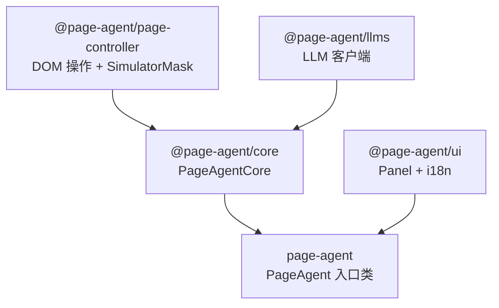
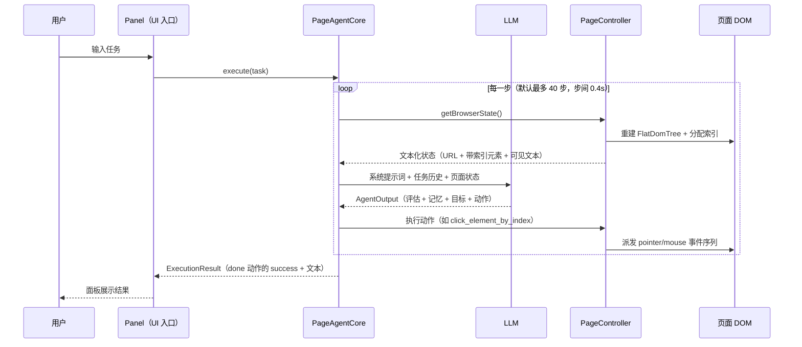

# Page Agent v1.12.4：阿里巴巴开源的浏览器控制 Agent 全栈拆解

## 读完你能判断什么

读这篇文章，你应该能：

1. 复述 Page Agent 单仓多包（monorepo）拆分中 8 个 workspace 的职责边界与依赖方向。
2. 解释 `PageAgentCore` 与 `PageController` 的异步解耦方式，以及 FlatDomTree → 文本化 → LLM → 索引化操作这条 DOM 流水线。
3. 描述 `@page-agent/mcp` Server 与 Chrome 扩展 Hub Tab 之间通过 localhost WebSocket 桥接外部 Agent 客户端的全过程。
4. 对照 Page Agent、browser-use、Playwright MCP 给出三者的选型建议与适用边界。
5. 在自己的 Web 应用中集成 Page Agent 的最小代码（一行 script 标签 + 一段 `new PageAgent(...)`）。

## 目录

- [1. 项目定位与最新状态](#1-项目定位与最新状态)
  - [1.1 一句话定位](#11-一句话定位)
  - [1.2 截至 2026-09 的核心数据](#12-截至-2026-09-的核心数据)
  - [1.3 与既有方案的设计分界](#13-与既有方案的设计分界)
- [2. 单仓多包架构总览](#2-单仓多包架构总览)
  - [2.1 8 个 workspace 的拓扑顺序](#21-8-个-workspace-的拓扑顺序)
  - [2.2 模块边界与通信契约](#22-模块边界与通信契约)
- [3. DOM 流水线：FlatDomTree → 文本化 → LLM → 索引化操作](#3-dom-流水线flatdomtree--文本化--llm--索引化操作)
  - [3.1 提取（FlatDomTree）](#31-提取flatdomtree)
  - [3.2 脱水（Dehydration）](#32-脱水dehydration)
  - [3.3 LLM 决策：一次调用里的反思与行动](#33-llm-决策一次调用里的反思与行动)
  - [3.4 PageController 异步回写](#34-pagecontroller-异步回写)
- [4. 任务如何流过系统：一次"点登录按钮"](#4-任务如何流过系统一次点登录按钮)
- [5. MCP Server：让外部 Agent 接管你的浏览器](#5-mcp-server让外部-agent-接管你的浏览器)
  - [5.1 启动流程](#51-启动流程)
  - [5.2 三个 MCP Tool 的语义](#52-三个-mcp-tool-的语义)
  - [5.3 在 Claude Desktop / Cursor 中配置](#53-在-claude-desktop--cursor-中配置)
- [6. Chrome 扩展与多页面 Agent](#6-chrome-扩展与多页面-agent)
  - [6.1 Hub Tab WebSocket 协议](#61-hub-tab-websocket-协议)
  - [6.2 多标签页调度](#62-多标签页调度)
- [7. 与 browser-use、Playwright MCP 的设计取舍](#7-与-browser-useplaywright-mcp-的设计取舍)
  - [7.1 三者目标对比](#71-三者目标对比)
  - [7.2 选型决策表](#72-选型决策表)
- [8. 快速上手](#8-快速上手)
  - [8.1 一行 script 标签（最快）](#81-一行-script-标签最快)
  - [8.2 NPM 安装（生产环境）](#82-npm-安装生产环境)
  - [8.3 自定义模型接入](#83-自定义模型接入)
- [9. 适用边界与已知限制](#9-适用边界与已知限制)
  - [9.1 Page Agent 适合的场景](#91-page-agent-适合的场景)
  - [9.2 Page Agent 不适合的场景](#92-page-agent-不适合的场景)
  - [9.3 已知限制](#93-已知限制)
- [10. 采用顺序与决策建议](#10-采用顺序与决策建议)
- [11. 常见问题与排查](#11-常见问题与排查)
- [12. 练习与自测](#12-练习与自测)
- [13. 进阶路径](#13-进阶路径)
- [14. 资料口径说明](#14-资料口径说明)
- [15. 延伸阅读](#15-延伸阅读)

## 1. 项目定位与最新状态

### 1.1 一句话定位

Page Agent 是阿里巴巴在 2025 年 9 月开源、目标"让任何 Web 页面自带 AI 助手"的前端 Agent 框架。它的核心承诺是：网站运营方不需要写后端 Agent，也不需要让用户装浏览器扩展或 Python 运行环境，只要在自己网页里加一段 `<script>` 标签，访问者就能用自然语言操控这个页面。

仓库 [alibaba/page-agent](https://github.com/alibaba/page-agent) 当前版本 v1.12.4（2026-09-06 发布），License 为 MIT，TypeScript 为主语言。它不是一个孤立脚本，而是一个 npm workspaces 单仓多包体系：核心 Agent 在 `@page-agent/core`，带 UI 的入口类在 `page-agent`，DOM 操作在 `@page-agent/page-controller`，LLM 客户端在 `@page-agent/llms`，浏览器扩展在 `packages/extension`，MCP Server 在 `@page-agent/mcp`。

### 1.2 截至 2026-09 的核心数据

| 指标 | 数值 |
|------|------|
| Stars | 29,217 ⭐ |
| Forks | 2,626 |
| 主语言 | TypeScript（仓库声明） |
| 仓库创建 | 2025-09-23 |
| 最新版本 | v1.12.4（2026-09-06） |
| 最近提交 | 2026-09-21 |
| License | MIT |
| 浏览器扩展 | Chrome Web Store 上架（Page Agent Ext） |
| Demo 链接 | <https://alibaba.github.io/page-agent/> |
| HN 讨论 | <https://news.ycombinator.com/item?id=47264138> |
| 仓库 Topics | agent、ai、ai-agents、browser-automation、javascript、mcp、typescript、web |

数据来源：GitHub API `repos/alibaba/page-agent` 与 Releases 页，访问于 2026-09-27。

### 1.3 与既有方案的设计分界

Page Agent 跟以下两类项目经常被一起提及，但目标截然不同：

- **`browser-use`（服务端自动化）**：Python + 无头浏览器 + 截图 + 多模态 LLM。定位是"代替人操作浏览器"。它跑在你控制的服务器或本地进程里，目标站点不知道它的存在。
- **Playwright MCP（工具型 MCP Server）**：把浏览器控制能力以 MCP Tool 的形式暴露给 LLM，让 LLM 用 Playwright 风格 API（点击 selector、截图、填表单）操作网页。定位是"通用工具集"，不绑死任何网站。
- **Page Agent（客户端增强）**：JavaScript 直接注入目标网页，文本化 DOM、调用 LLM、让用户在自己正在浏览的网页里用自然语言完成任务。定位是"给站点加 AI Copilot"，目标站点是合作方，运营方对自己的 UI 有完全控制权。

这个分界决定了下文 7.1 的对比维度。

## 2. 单仓多包架构总览

### 2.1 8 个 workspace 的拓扑顺序

`alibaba/page-agent` 的顶层 `package.json` 用 npm workspaces 管理 8 个内部包，其中 6 个发布到 npm（`page-agent`、`@page-agent/core`、`@page-agent/llms`、`@page-agent/page-controller`、`@page-agent/ui`、`@page-agent/mcp`，截至本文均为 1.12.4），`extension` 打包为浏览器扩展，`website` 是私有官网：

```text
alibaba/page-agent (monorepo)
├── packages/
│   ├── page-controller/  # npm: @page-agent/page-controller ← DOM 操作 + SimulatorMask
│   ├── ui/               # npm: @page-agent/ui        ← Panel 与 i18n
│   ├── llms/             # npm: @page-agent/llms      ← LLM 客户端（reflection-before-action）
│   ├── core/             # npm: @page-agent/core      ← 核心 Agent 逻辑（无 UI）
│   ├── page-agent/       # npm: page-agent            ← 入口类（带 UI + demo builds）
│   ├── mcp/              # npm: @page-agent/mcp       ← MCP Server（Beta）
│   ├── extension/        # 浏览器扩展（WXT + React）
│   └── website/          # 官网 + 文档（React，私有）
```

依赖方向（箭头从被依赖方指向依赖方）：


```mermaid
graph TD
  PC["@page-agent/page-controller<br/>DOM 操作 + SimulatorMask"]
  LLMS["@page-agent/llms<br/>LLM 客户端"]
  CORE["@page-agent/core<br/>PageAgentCore"]
  UI["@page-agent/ui<br/>Panel + i18n"]
  PA["page-agent<br/>PageAgent 入口类"]
  PC --> CORE
  LLMS --> CORE
  CORE --> PA
  UI --> PA
```

这张图之外的三个包各有各的接法：`extension` 直接依赖 core、llms、page-controller、ui 四个底层包；`mcp` 和 `website` 不依赖任何内部包——前者只靠 WebSocket 与扩展对话，后者是独立 React 站点。

四条边界，各自都可独立验证：

1. `page-controller`、`ui`、`llms` 是三个零内部依赖的底层包，任何一个都能单独抽走复用。
2. `core` 只依赖 `llms` 和 `page-controller`，无 UI，可以被 Node.js 脚本或服务端直接调用。
3. `page-agent` 入口类把 `PageAgentCore` 和 `Panel` 装在一起，前端页面引它一个就够。
4. `mcp` 的 npm 依赖只有 MCP 官方 SDK、ws 和 zod，扩展侧换成任何 WebSocket 客户端都能对接。

`AGENTS.md` 原文写明："`workspaces` in `package.json` must be in topological order"。顶层 `package.json` 里 8 个目录的排列顺序，就是依赖的拓扑序。

### 2.2 模块边界与通信契约

`PageAgent` 与 `PageController` 之间全部走异步方法（以下方法名核对自 v1.12.4 源码 `packages/page-controller/src/PageController.ts`）：

```typescript
// PageAgent 委托 DOM 操作给 PageController
await this.pageController.updateTree()
await this.pageController.clickElement(index)
await this.pageController.inputText(index, text)
await this.pageController.scroll({ down: true, numPages: 1 })

// 状态读取：getBrowserState() 内部会先自动 updateTree() 刷新 DOM
const browserState = await this.pageController.getBrowserState()
```

三条边界原则：

- **全部异步**：`PageController` 的方法清一色返回 Promise，LLM 决策期间不阻塞页面主线程。
- **索引隔离**：`PageController` 与 LLM 之间只传递数字索引（`index`），LLM 拿不到任何真实 DOM 节点引用。
- **可选遮罩**：`PageAgent` 构造时默认 `enableMask: true`，执行动作期间用 `SimulatorMask` 冻结用户交互，避免人机同时操作同一个页面。

## 3. DOM 流水线：FlatDomTree → 文本化 → LLM → 索引化操作

整条流水线在 `AGENTS.md` 里被概括成四步：DOM 提取、脱水、LLM 处理、按索引操作。下面逐步展开。

### 3.1 提取（FlatDomTree）

`@page-agent/page-controller` 的 `src/dom/dom_tree/index.js` 是核心提取器（约 1700 行，衍生自 browser-use 的 DOM 处理组件）。它把活 DOM（live DOM）整理成一棵 `FlatDomTree`：

- 只保留可交互元素：input、textarea、select、button 这类原生控件，加上按 ARIA role、指针光标样式等规则判定的可点击节点。`interactiveBlacklist`/`interactiveWhitelist` 配置可以增删目标；页面侧不用改代码，给元素加 `data-page-agent-not-interactive` 属性就能把它从 Agent 的视野里剔除。
- 丢弃对交互无意义的节点：不可见元素、`aria-hidden` 节点都不会进入树。
- 处理 Shadow DOM 与同域 iframe：通过 `getRootNode()` 递归进 open shadow root，通过 `contentDocument` 递归进同源 iframe，跨域 iframe 则被浏览器安全策略挡住。
- 给每个可交互元素分配数字 `index`；相比上一步新出现的元素带 `*` 前缀标记。

### 3.2 脱水（Dehydration）

LLM 看到的不是原始 HTML，也不是截图，而是 `getBrowserState()` 返回的文本化状态。它由三部分组成：页头（当前页面、视口与整页尺寸、上下各剩多少页）、带索引的交互元素列表、页尾的滚动位置提示。元素部分的格式，`dom/index.ts` 的源码注释里有一个真实样例：

```text
[0]<a aria-label=page-agent.js 首页 />
[4]<a aria-label=查看源码（在新窗口打开）>源码 />
[5]<a role=button>快速开始 />
UI Agent in your webpage
用户输入需求，AI 理解页面并自动操作。
```

规则：只有带 `[数字]` 的元素可交互；缩进代表 DOM 父子关系；普通可见文本直接列出；相比上一步新出现的元素带 `*` 前缀（源码用 WeakMap 缓存判断）。序列化默认附带 title、type、placeholder、aria-label、aria-expanded、contenteditable 等 20 类属性——都是判断"能不能点、点了会怎样"要用到的信息；文本超长会截断加省略号。

页面范围是个可调项：`viewportExpansion` 默认 -1（提取整页），设为 0 就只取当前视口，此时页头页尾的 "... N pixels below - scroll to see more ..." 提示会引导模型先滚动再操作。可滚动容器在状态里带 `data-scrollable` 标注，这是系统提示词和序列化输出之间的又一层约定。

这个设计的直接后果是：不需要多模态模型。README 把它列为特性第一条——"No screenshots. No multi-modal LLMs or special permissions needed."

### 3.3 LLM 决策：一次调用里的反思与行动

`@page-agent/llms` 的 `LLM` 类是所有模型调用的出口：默认走 `OpenAIClient`（OpenAI 兼容协议即可，Qwen、DeepSeek、Kimi 都行），传输层失败按 `maxRetries`（默认 2 次）自动重试。真正决定行为的是 `packages/core/src/prompts/system_prompt.md` 和一个聚合工具：模型每步必须以一个 `AgentOutput` 结构作答，形如：

```json
{
  "evaluation_previous_goal": "点击登录按钮后出现了认证表单。Verdict: Success",
  "memory": "已在邮箱框填入 user@example.com，还差密码和验证码",
  "next_goal": "向密码框输入密码",
  "action": { "input_text": { "index": 16, "text": "my-password-123" } }
}
```

reflection-before-action 指的就是前三个字段：先评估上一步动作的实际结果，再写记忆，再说下一步目标，最后才给动作。这四样在同一次模型调用里一起返回——没有第二次"自检"调用。`PageAgentCore` 的主循环（`packages/core/src/PageAgentCore.ts`）默认最多 40 步（`maxSteps`），步间默认间隔 0.4 秒（`stepDelay`）。

系统提示词里还有一条直接影响执行质量：模型"绝不默认上一步成功"，若预期页面变化没出现，必须把上一步标记为失败并规划恢复。AGENTS.md 则写明了整个项目的取舍——"Traceability and predictability is more important than success rate."

可用的动作不止点击和输入。内置工具共九个：`done`（结束任务并给出结果）、`wait`、`ask_user`（需配置 `onAskUser` 回调，否则禁用）、`click_element_by_index`、`input_text`、`select_dropdown_option`、`scroll`、`scroll_horizontally`、`execute_javascript`（默认禁用，需 `experimentalScriptExecutionTool` 显式开启）。通过 `customTools` 配置还能增删工具。

### 3.4 PageController 异步回写

`actions.ts` 负责把动作落到真实 DOM，实现比"模拟点击"四个字讲究得多：

- `clickElement`：按 W3C 规范顺序派发完整事件序列——pointerover/enter → mouseover/enter → pointerdown → mousedown → focus → pointerup → mouseup → click，并且先用 `elementFromPoint` 做命中测试，找到点击坐标处最深的目标元素。前端框架在按钮外面包几层 div，也不会点错对象。
- `inputText`：先点击聚焦，再派发 `beforeinput`/`input` 事件，React、Vue 的受控组件都能监听到；contenteditable 场景在合成事件无效时回退到 `execCommand`。源码注释也写明边界：Monaco、CodeMirror 这类需要直接拿编辑器实例的组件不支持。
- `scroll`：支持按页数、按像素、按指定容器滚动。
- `selectOption`：按选项文本选择下拉项。

每个动作执行完，下一步循环会重新走一遍 3.1 的提取流程，拿到新状态。

## 4. 任务如何流过系统：一次"点登录按钮"

把上述四步串成一个具体案例。用户在 Page Agent Panel 里输入"点登录按钮"：


```mermaid
sequenceDiagram
  participant U as 用户
  participant P as Panel（UI 入口）
  participant C as PageAgentCore
  participant L as LLM
  participant PC as PageController
  participant D as 页面 DOM
  U->>P: 输入任务
  P->>C: execute(task)
  loop 每一步（默认最多 40 步，步间 0.4s）
    C->>PC: getBrowserState()
    PC->>D: 重建 FlatDomTree + 分配索引
    PC-->>C: 文本化状态（URL + 带索引元素 + 可见文本）
    C->>L: 系统提示词 + 任务历史 + 页面状态
    L-->>C: AgentOutput（评估 + 记忆 + 目标 + 动作）
    C->>PC: 执行动作（如 click_element_by_index）
    PC->>D: 派发 pointer/mouse 事件序列
  end
  C-->>P: ExecutionResult（done 动作的 success + 文本）
  P-->>U: 面板展示结果
```

每一步的成本 = 一次 LLM 往返（取决于模型与网络）+ 一次本地 DOM 重建（毫秒级）+ 0.4 秒步间等待。执行路径全部在浏览器里，没有后端中转。

## 5. MCP Server：让外部 Agent 接管你的浏览器

`@page-agent/mcp` 是一个独立的 npm 包（Beta），让 Claude Desktop、Cursor、Copilot 等 MCP 客户端能直接控制你的浏览器。它是纯 JS ESM、无构建步骤——发布的就是源码本身，npm 依赖只有 MCP 官方 SDK、ws 和 zod。

### 5.1 启动流程

`@page-agent/mcp/src/index.js` 是入口：

```text
┌──────────────┐  stdio   ┌──────────────────┐  WebSocket   ┌──────────────┐
│ Claude /     │◄────────►│ @page-agent/mcp  │◄────────────►│ Hub tab      │
│ Copilot      │  (MCP)   │ (Node.js)        │  (localhost) │ (extension)  │
└──────────────┘          └──────────────────┘              └──────┬───────┘
                                   │                               │
                                   │ HTTP                          │ useAgent
                                   ▼                               ▼
                          ┌──────────────────┐              ┌──────────────┐
                          │ Launcher page    │              │ MultiPage    │
                          │ (localhost:PORT) │              │ Agent        │
                          └──────────────────┘              └──────────────┘
```

四步走：

1. MCP 客户端通过 stdio 启动 `npx -y @page-agent/mcp`。
2. Server 在 `localhost:PORT`（默认 38401）同时开 HTTP 与 WebSocket，并在默认浏览器打开 launcher 页面（HTTP 端口服务的就是这个页面，`curl http://localhost:38401` 能看到它）。
3. launcher 页面触发扩展打开 Hub Tab（`hub.html?ws=PORT`）。
4. Hub 连上 WebSocket，MCP 工具从这时起可以把任务代理给 Hub。

两道安全阀：首次连接时，扩展会弹窗询问"允许外部应用控制你的浏览器吗？"（可在扩展设置里记住允许，对应 `allowAllHubConnection`）；同一时刻只接受一个 Hub 连接、只跑一个任务，第二个 Hub 会被直接断开。

Hub Tab 只认 `hub-ws.ts` 定义的 WebSocket 协议，不关心调用方是不是 MCP。换掉 MCP 客户端，浏览器侧不需要跟着改。

### 5.2 三个 MCP Tool 的语义

| Tool | Input | 含义 |
|------|-------|------|
| `execute_task` | `{ task: string }` | 在浏览器里执行一条自然语言任务，阻塞直到完成或失败 |
| `get_status` | — | 返回 `{ connected, busy }` |
| `stop_task` | — | 停止当前正在跑的任务 |

环境变量：`LLM_BASE_URL`、`LLM_API_KEY`、`LLM_MODEL_NAME`、`PORT`（默认 38401）。前提：Node.js >= 20，扩展已安装。

### 5.3 在 Claude Desktop / Cursor 中配置

`packages/mcp/README.md` 给了 Claude Desktop 的最小配置：

```json
{
  "mcpServers": {
    "page-agent": {
      "command": "npx",
      "args": ["-y", "@page-agent/mcp"],
      "env": {
        "LLM_BASE_URL": "https://dashscope.aliyuncs.com/compatible-mode/v1",
        "LLM_API_KEY": "sk-xxx",
        "LLM_MODEL_NAME": "qwen3.5-plus"
      }
    }
  }
}
```

Cursor / Copilot 用同样的 MCP 设置格式即可。配好之后，Claude 在桌面端就能在你已登录的 Chrome 里执行浏览器任务——复用的是现成的登录态，不需要再交一遍账号密码。

## 6. Chrome 扩展与多页面 Agent

### 6.1 Hub Tab WebSocket 协议

`packages/extension` 是 WXT + React 实现的 Chrome 扩展，除了 Hub Tab 还有侧边栏面板（查看任务历史）。Hub Tab 启动后作为 WS 客户端连到 `ws://localhost:{port}`，协议本身就定义在 `packages/extension/src/entrypoints/hub/hub-ws.ts` 的文件头注释里，一共五种消息：

- 调用方 → Hub：`{"type":"execute","task":"…","config":{…}}`、`{"type":"stop"}`
- Hub → 调用方：`{"type":"ready"}`、`{"type":"result","success":true,"data":"…"}`、`{"type":"error","message":"…"}`

全部是 JSON 文本帧，一次只处理一个任务。协议、传输、语义各管一层：Hub 不感知 MCP 的存在，MCP Server 只跟 Hub 对话。任何一侧被替换——比如你的自有平台想直接用 WebSocket 派任务——另一侧都不用动。

### 6.2 多标签页调度

多页面能力由扩展里的 `MultiPageAgent` 实现：在 core 的单页工具之外，追加三个标签页工具——`open_tab`、`switch_tab`、`close_tab`。当前标签页列表会出现在页面状态里，模型只能切到列表内的标签页；每个标签页的摘要（标题、URL、加载状态）进入 LLM 上下文，v1.12.0 起摘要里包含加载状态。

近期版本对这里做过两次工程改进：v1.12.0 把标签页状态同步改成按需拉取，MV3 service worker 保持无状态——被浏览器闲置回收后任务不会卡死，摘要里也从这一版起包含每个标签页的加载状态；跨步骤的"记忆"则由模型在 `memory` 字段里自己维护，随任务历史一起进入后续提示词，扩展同时把历史事件流落盘 IndexedDB 供回看。

## 7. 与 browser-use、Playwright MCP 的设计取舍

### 7.1 三者目标对比

| 维度 | Page Agent | browser-use | Playwright MCP |
|------|------------|-------------|----------------|
| 形态 | 前端 JS 注入目标页面 | Python + 无头浏览器 | MCP Server + Playwright |
| 触达目标 | 合作站点（自带 AI Copilot） | 任意站点（自动化） | 任意站点（自动化） |
| 感知 DOM | 文本化（不需多模态） | HTML 为主，可选视觉 | 截图 + selector |
| 模型要求 | 任意 OpenAI 兼容 LLM | 偏好多模态 LLM | 任意视觉/文本 LLM |
| 用户登录态 | 复用浏览器现成 Cookie | 自行登录或持久化 profile | 自行登录或持久化 profile |
| 部署成本 | 一行 `<script>` | Python 环境 + 浏览器 | Node 环境 + 浏览器 |
| 浏览器扩展 | 可选（多页面） | 不需要 | 不需要 |
| 上游依赖 | DOM 处理组件与提示词衍生自 browser-use | — | Playwright 内核 |
| 站点配合度 | 必须愿意嵌入 JS | 任意 | 任意 |

Page Agent 的 DOM 处理组件与提示词源自 browser-use（README 明确致谢 Gregor Zunic，并附版权声明），定位却从"服务端自动化"切到了"客户端增强"——上游是同一套 DOM 理解逻辑，落点是两个互斥的场景。

### 7.2 选型决策表

| 你的需求 | 优先选 | 原因 |
|----------|--------|------|
| 给自家 SaaS 加 AI Copilot | Page Agent | 一行 script，无需后端 |
| 想让 Claude 帮你跑浏览器任务 | Playwright MCP 或 Page Agent MCP | 取决于是否需要复用已登录态 |
| 做无头爬虫或回归测试 | browser-use | 服务端可控 |
| 想完全不要扩展、纯后端调度 | browser-use | 已经是 Python 生态 |
| 模型没有视觉能力 | Page Agent | 文本化 DOM 即可 |
| 多 Tab 协同 + 已有登录 | Page Agent 扩展 + MCP | 复用现成 Cookie |
| 高安全要求（不暴露站点源码） | Playwright MCP | 不需要站点嵌入代码 |

## 8. 快速上手

### 8.1 一行 script 标签（最快）

最快跑起来的方式，用 jsDelivr 加载：

```html
<script
  src="https://cdn.jsdelivr.net/npm/page-agent@1.12.4/dist/iife/page-agent.demo.js"
  crossorigin="anonymous">
</script>
```

页面加载后会自动弹出 Demo 面板，用的是 Page Agent 团队提供的免费测试 LLM（仅供技术评估，使用条款见仓库 `docs/terms-and-privacy.md`）。国内镜像：

```html
<script
  src="https://registry.npmmirror.com/page-agent/1.12.4/files/dist/iife/page-agent.demo.js"
  crossorigin="anonymous">
</script>
```

加 `?autoInit=false` 可以避免自动创建 Demo Agent，然后用 `new window.PageAgent(...)` 手动实例化、接入自己的模型。script 标签的 URL 还支持 `model`、`baseURL`、`apiKey`、`lang`、`showPanel` 参数（见 `packages/page-agent/src/demo.ts`）。

### 8.2 NPM 安装（生产环境）

```bash
npm install page-agent
```

```javascript
import { PageAgent } from 'page-agent'

const agent = new PageAgent({
  model: 'qwen3.5-plus',
  baseURL: 'https://dashscope.aliyuncs.com/compatible-mode/v1',
  apiKey: 'YOUR_API_KEY',
  language: 'en-US',
})

await agent.execute('Click the login button')
```

除这四个必填/常用项外，配置对象还支持 `maxSteps`、`stepDelay`、`enableMask`、`instructions`（系统级与按 URL 的页面级自定义指令）、`customTools`、`onBeforeStep`/`onAfterStep` 等生命周期钩子，类型定义见 `@page-agent/core` 的 `AgentConfig`。

### 8.3 自定义模型接入

只要是 OpenAI 兼容协议（`/v1/chat/completions`）即可，无需多模态。常用对接：

- Qwen：`baseURL = https://dashscope.aliyuncs.com/compatible-mode/v1`
- DeepSeek：`baseURL = https://api.deepseek.com/v1`
- OpenAI：`baseURL = https://api.openai.com/v1`
- 自托管 vLLM：`baseURL = http://your-host:8000/v1`

把 `model` 字段改成对应模型名即可。`packages/llms` 内部维护着一份按模型打请求补丁的清单（v1.11.0 重写过）：`*-chat-latest` 系列模型会跳过 `reasoning_effort` 补丁；`temperature` 配置已弃用，确需设置时用 `transformRequestBody` 只对验证过支持的模型加字段。支持的模型列表见官方文档 [Models](https://alibaba.github.io/page-agent/docs/features/models)。

## 9. 适用边界与已知限制

### 9.1 Page Agent 适合的场景

- SaaS 产品需要"AI 助手"按钮（CRM、ERP、表单工具、Admin 后台）。
- 老旧后台（jQuery、ExtJS、Vue 2）需要"自然语言导航"，但又无法重写。
- 无障碍场景：给视障用户语音操控站点。
- 多页面工作流：报销、采购、跨 Tab 数据搬运。
- 想用 MCP 客户端（Claude/Cursor）操作"我自己控制"的浏览器实例。

### 9.2 Page Agent 不适合的场景

- **抓取你无法控制的站点**：目标站点如果不愿意嵌入脚本，Page Agent 进不去（这种情况用 browser-use / Playwright）。
- **高频工业自动化**：每步一次 LLM 往返加 0.4 秒步间等待，不适合毫秒级任务。
- **强合规要求**：LLM 决策有随机性。扩展能查看、导出历史记录（含每步的原始请求响应），但完整的审计回放体系仍需自行建设，金融、医疗场景要先把这块补齐。
- **复杂视觉判断**：截图不在流水线里，"看图选图"任务做不了。
- **跨域跨账号**：每个 Tab 只能复用当前浏览器实例的登录态。

### 9.3 已知限制

- **非 DOM 内容不可见**：canvas、WebGL 画出来的东西进不了文本状态。
- **跨域 iframe 拿不到内部 DOM**（浏览器同源策略）；同域 iframe 会被递归收录。
- **超长页面会让状态文本变大**：`viewportExpansion` 默认提取整页，页面极长时上下文膨胀明显，可切到视口模式（设为 0），让模型按滚动提示分页读取。
- **验证码不能解**：系统提示词要求遇到 captcha 直接告知用户、结束任务。
- **不跳出新页面**：Agent 只在单页面范围内工作，`target="_blank"` 的链接不会点击。
- **特定富文本编辑器无法输入**：Monaco、CodeMirror 需要直接操作编辑器实例，合成事件进不去。
- **MCP Server 仍是 Beta**：Hub Tab 需要扩展已安装，且先打开一次 launcher 页面。
- **索引会重新分配**：每次重建 DOM 树索引都重新编号，页面变化后新元素带 `*` 标记；长任务要靠反思字段重新核对元素。
- **LLM 决策随机性**：同一任务两次执行的路径可能不同，调试时看 step 日志——每步历史都带原始请求与响应。

## 10. 采用顺序与决策建议

如果你是 SaaS 运营方，按以下顺序评估：

1. **第 1 周**：用 8.1 的 CDN 方式嵌入自家产品 demo，跑 5 个真实用户任务，确认模型在自家 DOM 上的命中率。
2. **第 2 周**：把模型切到生产可用的 Qwen/DeepSeek，加上 `?autoInit=false`，由产品方控制何时弹 Panel。
3. **第 3 周**：评估是否需要多页面/MCP 扩展——只有"用户已经在多个 Tab 之间切换"是核心痛点时才上。
4. **第 4 周**：决定是否需要自托管 LLM。Page Agent 可以直接对接 vLLM，无须额外封装。

如果你是想用 Claude/Cursor 控制浏览器的工程师：

1. 先装 Chrome 扩展，确认 Hub Tab 能独立启动。
2. 用 5.3 的最小 MCP 配置把 Claude Desktop 接入，跑一次 `execute_task`。
3. 把模型换成你想用的（示例配置是 qwen3.5-plus），确认延迟可接受。
4. 再考虑复杂多步任务。

不建议一上来就在生产环境启用 Page Agent：每个决策步都是一次 LLM 调用，任务越长、历史越重，token 消耗线性上涨。先用小流量试点 1–2 周，把单任务的步数和成本摸清楚。

## 11. 常见问题与排查

| 症状 | 可能原因 | 排查 |
|------|----------|------|
| `<script>` 加载后没弹 Panel | 属性没照 README 写（`crossorigin="anonymous"`）/ CDN 缓存旧版本 | 强制刷新 + DevTools 看网络请求 |
| Panel 弹出但 execute 卡住 | API Key 错误 / baseURL 配错 | DevTools Network 看 `/chat/completions` 响应 |
| 点不到页面元素 | 元素在视口外、由 canvas 渲染、或在跨域 iframe 里 | 先滚动再试；Console 里确认 `window.pageAgent` 已创建 |
| MCP 客户端连不上 Hub | 扩展未装 / 未打开 launcher / 端口被占 | `curl http://localhost:38401` 应返回 launcher 页面；再用 `get_status` 看 `connected` |
| `execute_task` 报 "Hub is not connected" | Hub Tab 未连上，或已有另一个 Hub 占用 | 重新打开 launcher 页面；同一端口只允许一个 Hub |
| execute 报 `reasoning_effort` 相关错误 | 用了 `*-chat-latest` 模型且版本低于 v1.11.0 | 升级到 v1.11.0 或更高 |
| 国内访问 jsDelivr 慢 | 网络问题 | 切换 npmmirror 镜像 |

## 12. 练习与自测

读完架构，动手跑一遍比继续读更有效。三条练习覆盖三种使用方式，五道自测题检查判断依据是否站得住。

### 练习一：在本页跑通一行 script 标签

用 §8.1 的 CDN 方式，在自己的一个 HTML 页面里引入 Page Agent 的 demo 脚本，让页面自动弹出 Panel。输入一条任务（例如"点击页面右上角的登录按钮"），观察 Agent 的决策过程。跑通后记录三点：初始化耗时、首次任务响应延迟、任务完成准确率。Panel 没弹出时，按 §11 的排查表检查 `crossorigin` 和 CDN 缓存。

### 练习二：同一任务对比 browser-use

用 [browser-use](https://github.com/browser-use/browser-use) 实现"自动填写表单"，再与 Page Agent 的做法对比。重点比较三处：开发成本（要写多少代码）、运行环境（本地 Python 进程 vs 浏览器内注入）、适用站点（任意站点 vs 愿意嵌入脚本的站点）。做完这组对比，§7.2 选型表的边界是否成立就有数了。

### 练习三：把 MCP Server 接进 Claude Desktop

按 §5.3 的配置把 `@page-agent/mcp` 接进 Claude Desktop，用自然语言让它打开一个常用站点并完成一次真实操作（例如登录后台导出报表）。开始前确认 Chrome 扩展已安装、Hub Tab 能独立启动；连不上时用 `curl http://localhost:38401` 检查端口。记录配置耗时、执行延迟和准确率。

### 自测题

1. Page Agent 的文本化 DOM 与 browser-use 的视觉方案，核心差异是什么？什么场景下必须选截图？
2. `@page-agent/core` 为什么不依赖 UI？什么场景下你会直接调用 `PageAgentCore` 而不是 `page-agent` 入口类？
3. Hub Tab 用 WebSocket 而不是 HTTP 轮询，换来什么，付出什么代价？
4. 生产环境用 Page Agent，模型选型优先看哪三个指标？
5. Page Agent 的历史记录机制能覆盖哪类审计需求，覆盖不了哪类？

<details>
<summary>参考答案</summary>

1. 文本化 DOM 成本低、不需多模态模型，但拿不到视觉信息；"看图选图"或依赖画布渲染的场景必须选截图方案。
2. `core` 无 UI，可以被 Node.js 脚本或服务端直接调用，适合后端定时任务操控页面或自动化测试；前端页面里的 AI Copilot 才用 `page-agent` 入口类。
3. WebSocket 换来双向长连接：任务下发和结果回传都不用轮询；代价是要管理连接生命周期和授权——所以协议里才有 `ready`/`error` 这类状态消息和首次连接确认。
4. 指令遵循与工具调用稳定性（决定每步动作质量）、延迟（每步一次往返，直接计入用户等待）、成本与上下文（任务历史随步数增长）。
5. 能覆盖：开发者调试与事后追溯——每步历史带反思字段和原始请求响应，扩展还能查看导出。覆盖不了：合规级完整回放（含页面快照、回放环境），这些仍需自行建设。

</details>

## 13. 进阶路径

- **主循环**：从 `packages/core/src/PageAgentCore.ts` 入手，理解 observe → think → act 的 Re-act 循环
- **系统提示词**：读 `packages/core/src/prompts/system_prompt.md`，模型的全部行为规则都在这里
- **工具定义**：`packages/core/src/tools/index.ts`，九个内置工具的输入输出
- **DOM 提取**：`packages/page-controller/src/dom/dom_tree/index.js`，FlatDomTree 的过滤与索引逻辑
- **事件模拟**：`packages/page-controller/src/actions.ts`，W3C 顺序的点击与输入实现
- **Hub 协议**：`packages/extension/src/entrypoints/hub/hub-ws.ts`，五种 WebSocket 消息
- **模型适配**：`packages/llms/`，按模型打补丁的请求改写逻辑

## 14. 资料口径说明

1. **信息来源与时效性**：本文基于 v1.12.4（2026-09-06 发布）的源码、README、AGENTS.md 与各子包文档整理，GitHub API 数据访问于 2026-09-27。Page Agent 仍在快速迭代，后续版本可能在 MCP Server 配置、Hub Tab 协议、模型补丁清单等方面变化。
2. **技术细节验证**：文中方法名、消息类型、默认值（`maxSteps=40`、`stepDelay=0.4s`、`PORT=38401` 等）均核对自对应源码文件；未做端到端复测，实际表现取决于模型选择、网络状况和页面 DOM 复杂度。
3. **与 AGENTS.md 的差异**：`AGENTS.md` 的通信契约示例中 `getSimplifiedHTML()`/`getPageInfo()` 与当前源码（`getBrowserState()`）存在滞后，本文以源码为准。
4. **判断与建议的边界**：选型建议、适用边界、采用顺序基于公开文档和架构分析得出，不构成阿里官方立场，也不构成商业建议。
5. **未覆盖的内容**：`packages/extension` 的完整 WXT 构建配置、`SimulatorMask` 的 CSS 隔离细节、`packages/llms` 各模型补丁的逐项清单。
6. **更新记录**：本文初稿基于 v1.10.0（2026-06-15），现更新至 v1.12.4（2026-09-06）；后续版本有架构变化时将同步更新对应章节。

## 15. 延伸阅读

- 仓库主页：<https://github.com/alibaba/page-agent>
- Demo：<https://alibaba.github.io/page-agent/>
- 文档站：<https://alibaba.github.io/page-agent/docs/introduction/overview>
- 支持模型与免费测试 API：<https://alibaba.github.io/page-agent/docs/features/models>
- Chrome 扩展：[Page Agent Ext](https://chromewebstore.google.com/detail/page-agent-ext/akldabonmimlicnjlflnapfeklbfemhj)
- 上游项目：[browser-use](https://github.com/browser-use/browser-use)
- MCP 协议：<https://modelcontextprotocol.io>
- 维护者 X 账号：`@simonluvramen`（README 标注）
- HN 讨论：<https://news.ycombinator.com/item?id=47264138>
