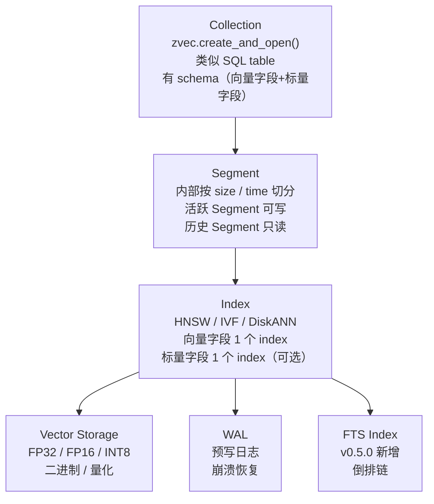

# Zvec 深度拆解：阿里开源的进程内向量数据库，10K Stars 的 SQLite-for-Vectors 怎么把 FAISS / Qdrant 拉开身位

**判断**：Zvec 不是"FAISS 套壳"，也不是"蹭 RAG 概念"。它精确卡在两个空白里：① 主流向量库都是 **C/S 架构**（Qdrant / Milvus / Weaviate），要么单进程嵌入（FAISS）但要自己写 WAL/查询规划/SDK 维护；② 嵌入式数据库（SQLite / DuckDB）没有"原生向量检索 + 全文 + 标量过滤"的混合检索。Zvec 把自己定位成 **"SQLite for Vectors"**——`pip install zvec` 一行就能用，多语言 SDK、Dense+Sparse 向量、DiskANN on-disk 索引、MultiQuery 混合检索全有。**6 个月（2025-12-05 创建）斩获 10,261 stars、600 forks**，并且阿里内部生产环境验证过（README 里直接写"battle-tested within Alibaba Group"），这个曲线说明它踩在了"RAG 本地化 + 嵌入式向量库"的真实需求上。

如果你属于下面任何一种，这篇值得读：

- RAG 工程师，受够 Qdrant / Milvus 的部署运维，但 FAISS 缺太多生产特性
- 想给本地 Notebook / CLI / 桌面应用塞一个向量库，不想再起一个服务
- 关心混合检索（Dense + Sparse + FTS + Filter）的工程实现
- 在 ARM Mac（M1/M2/M3/M4）上跑向量库，需要 RISC-V / ARM 优化
- 想评估 Zvec 是不是"又一个昙花一现的 GitHub 项目"

---

## 阅读导航

- **5 分钟判断值不值得用**：看「先看结论」
- **理解它的生态卡位**：看「为什么向量库还差一块"SQLite"」
- **想了解核心架构**：看「架构分层：Collection → Segment → Index」
- **想了解索引类型**：看「HNSW / IVF / DiskANN 怎么选」
- **想了解混合检索**：看「MultiQuery：Dense + Sparse + FTS + Filter」
- **想知道怎么上手**：看「快速上手 + 多语言 SDK」
- **想评估生产可用性**：看「适用边界 / 限制」

---

## 先看结论

| 维度 | 实际情况 |
|------|----------|
| Stars | 10,261+（2026-06-16） |
| Forks | 600+ |
| 主语言 | C++ 核心 + Python / Node.js / Go / Rust / Dart 多语言 SDK |
| 协议 | Apache-2.0 |
| 仓库 | <https://github.com/alibaba/zvec> |
| 创建时间 | 2025-12-05 |
| 最新版本 | v0.5.0（2026-06-12） |
| 半年发版节奏 | v0.1.0 → v0.5.0，共 8 个版本 |
| 平台支持 | Linux x86_64/ARM64、macOS ARM64、Windows x86_64、RISC-V（v0.5.0 新增） |
| 向量索引 | HNSW / IVF / Flat + DiskANN（v0.5.0 新增） |
| 检索类型 | Dense / Sparse 向量、Multi-Vector、全文检索（FTS，v0.5.0 新增）、混合检索（MultiQuery） |
| 持久化 | WAL（Write-Ahead Logging） |
| 并发模型 | 多进程可读、单进程写独占 |
| Open issues | 58 |

一句话：**它是阿里开源的"SQLite for Vectors"，用嵌入式架构 + 多语言 SDK + 全栈混合检索，把 RAG 本地化的部署摩擦压到了 `pip install` 级别**。

---

## 为什么向量库还差一块"SQLite"

把当前主流向量检索方案并列看：

| 方案 | 部署形态 | 进程内嵌入 | 混合检索 | 多语言 SDK | 持久化 | 维护状态 |
|------|----------|------------|----------|------------|--------|----------|
| FAISS | 库 | ✅ | ❌（仅向量） | C++ / Python | ❌ | Meta 持续 |
| Qdrant | C/S | ❌ | ✅ | Rust / Python / Go / JS | ✅ | 活跃 |
| Milvus | C/S | ❌ | ✅ | Python / Go / Java / Node | ✅ | 活跃 |
| Weaviate | C/S | ❌ | ✅ | Python / JS / Go | ✅ | 活跃 |
| Chroma | 嵌入式 | ✅ | ⚠️（基础） | Python / JS | ✅ | 活跃 |
| LanceDB | 嵌入式 | ✅ | ⚠️（基础） | Python / Rust / JS | ✅ | 活跃 |
| pgvector | PG 扩展 | ❌ | ✅ | PG 全家桶 | ✅ | 活跃 |
| **Zvec** | **嵌入式** | **✅** | **✅（MultiQuery）** | **Python / Node / Go / Rust / Dart** | **✅（WAL）** | **活跃（半年 8 版）** |

Zvec 的独特定位：**"嵌入式 + 全栈混合检索 + 多语言 SDK + 生产级持久化"这个四角**。

具体痛点：

1. **C/S 向量库的部署摩擦**：Qdrant / Milvus 要起服务、配端口、做 health check、监控长连接；本地 Notebook / CLI / 桌面应用根本不想起服务。Zvec `pip install` 直接用，零部署。
2. **FAISS 缺太多生产特性**：FAISS 只做"向量算最近邻"，没有 Collection 管理、没有 WAL、没有 SQL-like filter、没有 FTS、没有多语言 SDK。生产环境要在 FAISS 之上叠一层 ORM + WAL + Query Planner，重复造轮子。
3. **Chroma / LanceDB 混合检索弱**：Chroma 只能做简单 filter，LanceDB 有 SQL 但 FTS 是 beta。Zvec 的 MultiQuery 在一次查询里同时融合 Dense 向量 + Sparse 向量 + FTS + 标量过滤。
4. **多语言生态割裂**：Qdrant 有 gRPC REST，pgvector 要走 SQL，FAISS 主要 Python。如果产品是 Flutter（移动端）+ Node.js（BFF）+ Python（算法），不同端要维护不同的客户端栈。Zvec 5 种语言 SDK 对齐 API。
5. **ARM / RISC-V 优化缺位**：FAISS 主要优化 x86 + CUDA。Apple Silicon 用户要么用慢版本，要么起 CUDA 容器。Zvec v0.5.0 加了 RISC-V 支持，明确表态要做边缘 / IoT 场景。

---

## 架构分层：Collection → Segment → Index

Zvec 的存储分层是 **Collection → Segment → Index**，类似传统数据库的 table → partition → index：



### Collection：Schema 驱动

```python
import zvec

schema = zvec.CollectionSchema(
    name="example",
    vectors={
        "embedding": zvec.VectorSchema(
            zvec.DataType.VECTOR_FP32, dim=4
        ),
    },
    fields={
        "title": zvec.FieldSchema(zvec.DataType.STRING),
        "tags": zvec.FieldSchema(zvec.DataType.STRING, array=True),
        "score": zvec.FieldSchema(zvec.DataType.INT64),
    },
)
```

Collection 必须显式声明 schema（向量 + 标量字段 + 类型），类似 SQL CREATE TABLE。Zvec 用 schema 而不是无文档模式（MongoDB 风格），是为了把检索编译期优化（field type → index strategy）。

### Segment：读写隔离

Zvec 把一个 Collection 切成多个 Segment：

- **活跃 Segment**：当前可写，WAL 直接追加
- **只读 Segment**：超过阈值后冻结，转为只读，后台压缩 / 索引

读写分离的好处：多进程可同时读同一 Collection，写是单进程独占。读端不需要加锁，吞吐随 Segment 数线性扩展。

### Index：按字段类型选

每个字段挂一个 Index：

- 向量字段：HNSW / IVF / Flat / DiskANN
- 字符串字段：FTS（v0.5.0）
- 数值字段：默认 range scan（未公开专用 index API）

---

## 索引类型：HNSW / IVF / DiskANN 怎么选

Zvec v0.5.0 支持 4 种向量索引。决策表：

| 索引 | 内存占用 | 检索速度 | 训练阶段 | 适用规模 | 推荐场景 |
|------|----------|----------|----------|----------|----------|
| Flat | ❌（原始 FP32） | ⚠️（暴力） | ❌ | < 100K | 全量召回基线 |
| HNSW | ❌（图边 + 向量） | ✅（亚毫秒） | ❌ | 100K-10M | 高维、低延迟 |
| IVF | ✅（聚类量化） | ✅（毫秒级） | ✅（k-means） | 10M+ | 大规模 + 中等召回 |
| **DiskANN** | **✅✅**（主体磁盘） | **✅** | **❌（在线）** | **亿级** | **大 corpus + 低内存** |

### HNSW：默认选项

```python
collection = zvec.create_and_open(
    path="./zvec_example",
    schema=schema,
    index_params=zvec.HnswIndexParams(
        m=16, ef_construction=200, ef_search=50
    ),
)
```

HNSW（Hierarchical Navigable Small World）是主流图索引，recall 高、查询快，缺点是内存占用大（向量本体 + 图边）。Zvec 默认 HNSW。

### IVF：训练换空间

```python
index_params=zvec.IVFIndexParams(
    nlist=4096, nprobe=128
)
```

IVF（Inverted File）先把向量聚成 nlist 簇，查询时只搜最近的 nprobe 簇。**训练阶段是 k-means**，10M 向量通常 30-90 分钟。生产环境 corpus 持续增长，rebuild 时机是运维噩梦——这是 IVF 的硬伤。

### DiskANN：v0.5.0 新增，绕开训练

DiskANN 是 Microsoft Research 2019 年的工作，2024 年被 Postgres / Lantern 等接入。核心思想：**把 SSD 当 L3 cache**，只在内存放 graph 边，向量在磁盘用 PQ 压缩 + SSD 随机读。

```python
# v0.5.0 DiskANN（API 示意，以实际发布为准）
index_params=zvec.DiskANNIndexParams(
    max_degree=64,
    search_list_size=100,
)
```

**DiskANN 的两个核心优势**：

1. **无需训练**：与 IVF 不同，DiskANN 在线 build（边插入边建图），适合 corpus 持续增长的场景。
2. **内存可控**：10M × 1536 dim × FP32 = 61 GB 向量本体 + graph 边 ≈ 80 GB；DiskANN 把向量压到磁盘，内存只留 graph，约 5-10 GB。

Zvec v0.5.0 的 Release Notes 直接把 DiskANN 列为头牌特性，看得出团队押注 **"大 corpus + 低内存 + 无训练"** 这条线。

---

## MultiQuery：Dense + Sparse + FTS + Filter 一次融合

Zvec v0.5.0 最值得说的设计是 **MultiQuery**——单次查询里同时融合：

- Dense 向量（语义）
- Sparse 向量（BM25-like 关键词）
- FTS（结构化自然语言）
- 标量过滤（field = value）

```python
results = collection.query(
    zvec.MultiQuery(
        vector=zvec.VectorQuery(
            "embedding", vector=[0.4, 0.3, 0.3, 0.1]
        ),
        sparse_vector=zvec.SparseVectorQuery(
            "embedding", indices=[3, 7], values=[0.8, 0.6]
        ),
        text=zvec.TextQuery("title", "向量数据库"),
        filter="score > 100 AND tags CONTAINS 'rag'",
        topk=10,
    )
)
```

### 融合策略

MultiQuery 的关键是 **融合函数**——把多个异构 score（cosine / BM25 / bool）合到单一排序。Zvec 默认 **Reciprocal Rank Fusion (RRF)**，这也是 Elasticsearch / OpenSearch 的默认。

```text
RRF_score(d) = Σ 1 / (k + rank_i(d))
```

k=60 是经典默认。每个 sub-query 给每个 doc 一个 rank，RRF 把所有 rank 加权融合。优点是不需要 score 归一化（不同 score 体系直接拼），缺点是 weight 调优依赖经验。

### 一次 IO 取所有信号

MultiQuery 不是"分 4 次查询再合并"，而是 **查询规划器把 4 个子条件编译成 1 个执行计划**：

1. 先用 filter 拉候选集（廉价）
2. 在候选集上跑 vector / sparse / FTS（贵）
3. RRF 融合排序

这样避免"先拉 10× 向量再过滤"的 over-fetch，是混合检索的工程标准做法。

---

## 持久化与并发

### WAL：预写日志保 crash safety

Zvec 用 Write-Ahead Logging 保证持久性：

```text
insert(doc_42) → 
  1. 写 WAL（append-only 文件）
  2. 内存索引更新
  3. 后台刷盘（compact + index rebuild）
```

进程崩溃 / 断电 → 重启时 replay WAL 恢复到崩溃前状态。这与传统 RDBMS 一致，但 Zvec 是嵌入式实现，WAL 文件就在 collection path 下。

### 并发：多读单写

| 操作 | 进程数 | 说明 |
|------|--------|------|
| Read | N（任意） | 共享只读 Segment，加读锁 |
| Write | 1（独占） | 写活跃 Segment + WAL，加写锁 |
| Schema 修改 | 1（独占） | 不允许并发 |

这个模型与 SQLite 接近：读端高并发，写端串行。RAG 场景里 read-heavy、write-occasional（ingest 偶尔），这个模型刚好。

---

## 快速上手

### Python（主力 SDK）

```bash
pip install zvec
```

```python
import zvec

schema = zvec.CollectionSchema(
    name="example",
    vectors=zvec.VectorSchema(
        "embedding", zvec.DataType.VECTOR_FP32, 4
    ),
)

collection = zvec.create_and_open(
    path="./zvec_example", schema=schema
)

collection.insert([
    zvec.Doc(id="doc_1", vectors={"embedding": [0.1, 0.2, 0.3, 0.4]}),
    zvec.Doc(id="doc_2", vectors={"embedding": [0.2, 0.3, 0.4, 0.1]}),
])

results = collection.query(
    zvec.VectorQuery("embedding", vector=[0.4, 0.3, 0.3, 0.1]),
    topk=10
)
print(results)
```

### Node.js

```bash
npm install @zvec/zvec
```

```javascript
const { CollectionSchema, VectorSchema, DataType, createAndOpen, Doc, VectorQuery } = require('@zvec/zvec');

const schema = new CollectionSchema({
  name: 'example',
  vectors: { embedding: new VectorSchema(DataType.VECTOR_FP32, 4) },
});

const collection = await createAndOpen('./zvec_example', schema);
await collection.insert([
  new Doc({ id: 'doc_1', vectors: { embedding: [0.1, 0.2, 0.3, 0.4] } }),
]);
const results = await collection.query(new VectorQuery('embedding', [0.4, 0.3, 0.3, 0.1]), 10);
```

### Go / Rust / Dart

| 语言 | 仓库 | 安装 |
|------|------|------|
| Go | <https://github.com/zvec-ai/zvec-go> | `go get github.com/zvec-ai/zvec-go` |
| Rust | <https://github.com/zvec-ai/zvec-rust> | `cargo add zvec` |
| Dart/Flutter | <https://pub.dev/packages/zvec> | `flutter pub add zvec` |

5 种语言 SDK 对齐 API，移动端（Flutter）+ BFF（Node.js / Go）+ 算法（Python）可以共用同一套检索语义。

---

## 适用边界

### ✅ 适合

- **本地 RAG 应用**：Notebook、CLI、桌面 App，不想起 C/S 服务
- **嵌入式 AI**：智能硬件、边缘设备（v0.5.0 RISC-V 支持）
- **中小规模语义检索**：100K-100M 向量，单机扛得住
- **多语言产品**：5 种 SDK 一套 API
- **混合检索场景**：Dense + Sparse + FTS + Filter 一次查询

### ❌ 不适合

- **十亿级生产向量库**：C/S 架构（Qdrant / Milvus）的水平扩展能力更强，Zvec 是单进程嵌入
- **高频写入流**：WAL + 单进程写独占模型，写吞吐受限
- **需要 SQL 兼容**：Zvec 的查询是 SDK API，不是 SQL（pgvector / pgvector-scale 才是）
- **需要严格 ACID**：嵌入式 SQLite 级语义，不是分布式 Raft / Paxos

### 评估建议

| 维度 | Zvec 现状 | 替代方案 |
|------|-----------|----------|
| 10M 向量 + 高频读 | ✅（HNSW，亚毫秒） | Qdrant |
| 100M+ 向量 + 高并发 | ⚠️（单进程） | Milvus 集群 |
| Notebook / CLI 嵌入 | ✅（`pip install`） | Chroma / LanceDB |
| 移动端 + 多语言 | ✅（5 SDK） | 各家分别实现 |
| 大 corpus + 低内存 | ✅（v0.5.0 DiskANN） | Milvus Knowhere |

---

## 为什么是"阿里出品"值得多看一眼

Zvec 是阿里巴巴开源的。README 里直接写 **"battle-tested within Alibaba Group"**——这是少有的把内部生产环境背书写在脸上的项目。

具体信号：

- **半年 8 个版本**：v0.1.0（2025-12-31）→ v0.5.0（2026-06-12），节奏稳定
- **v0.5.0 一次加 4 个特性**：FTS / Hybrid / DiskANN / 多语言 SDK，明显是按季度规划的产品节奏
- **Roadmap 在 GitHub Issue 里公开**：<https://github.com/alibaba/zvec/issues/309>
- **多语言 SDK 不止 Python**：Go / Rust / Dart 都有官方仓库，不是社区包

阿里系开源的特点是"先内部验证，再开放"——FastJSON / Dubbo / Nacos / OpenSumi 都是这条路径。Zvec 的可信度主要来源于这种"已经在生产扛过流量"的背书。

---

## 参考

- 仓库：<https://github.com/alibaba/zvec>
- 文档：<https://zvec.org/zh/docs/db/>
- 快速上手：<https://zvec.org/zh/docs/db/quickstart/>
- 性能报告：<https://zvec.org/zh/docs/db/benchmarks/>
- v0.5.0 Release Notes：<https://github.com/alibaba/zvec/releases/tag/v0.5.0>
- 路线图：<https://github.com/alibaba/zvec/issues/309>
- 中文 README：<https://github.com/alibaba/zvec/blob/main/README_CN.md>
- Go SDK：<https://github.com/zvec-ai/zvec-go>
- Rust SDK：<https://github.com/zvec-ai/zvec-rust>
- Zvec Studio：<https://github.com/zvec-ai/zvec-studio>
- DeepWiki：<https://deepwiki.com/alibaba/zvec>
- DiskANN 论文：<https://papers.microsoft.com/archive/2019/DiskANN-Fast-accurate-billion-scale-nearest-neighbor-search-on-a-single-node.pdf>
