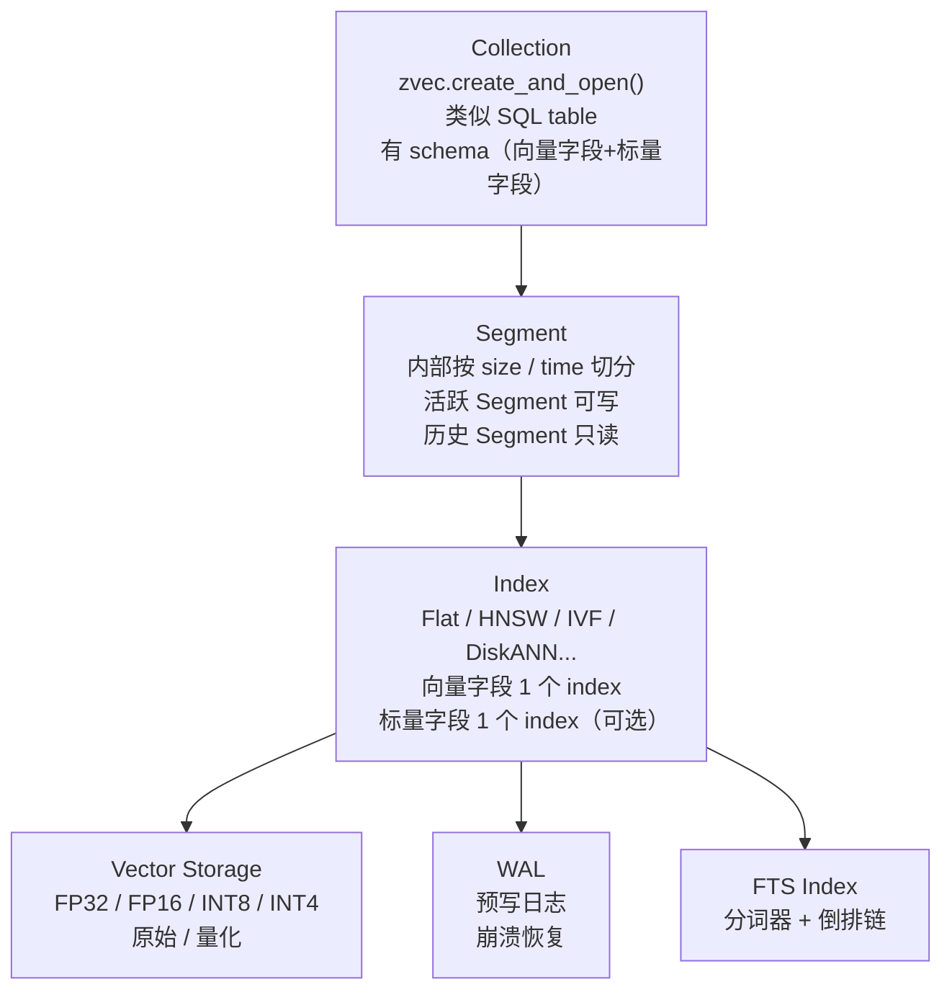

## 快速信息卡

| 指标 | 数值 |
|------|------|
| Stars | 15,600+ |
| Forks | 980+ |
| 许可证 | Apache-2.0 |
| 语言 | C++（核心）+ Python / Node.js / Go / Rust / Dart（SDK） |
| 官网 | https://zvec.org |
| 仓库 | [alibaba/zvec](https://github.com/alibaba/zvec) |
| 最新版本 | v0.7.0（2026-08-24） |

## 学习目标

读完本文，你应该能够：

1. **理解 Zvec 的核心定位**：明白它为什么是"SQLite for Vectors"，以及它如何填补嵌入式向量数据库的空白
2. **掌握架构分层**：理解 Collection → Segment → Index 的存储模型，以及它如何实现读写隔离
3. **选择索引类型**：Flat / HNSW / HNSW-RaBitQ / IVF / IVF-RaBitQ / DiskANN 的适用场景和权衡
4. **使用混合检索**：多个 Query + ReRanker 如何一次融合 Dense + Sparse + FTS + Filter
5. **评估适用性**：判断 Zvec 是否适合你的场景，以及迁移路径是什么

# Zvec 深度拆解：阿里开源的进程内向量数据库，10K Stars 的 SQLite-for-Vectors 怎么把 FAISS / Qdrant 拉开身位

**判断**：Zvec 把自己定位成 "SQLite for Vectors"——`pip install zvec` 一行能用，多语言 SDK、Dense+Sparse 向量、DiskANN on-disk 索引、多 Query 混合检索全有。它卡在一个具体空白上：主流向量库要么是 C/S 架构（Qdrant / Milvus / Weaviate），部署摩擦压不到本地场景；要么是单进程嵌入（FAISS），但要自己写 WAL、查询规划、SDK 维护；嵌入式数据库（SQLite / DuckDB）又没有"原生向量检索 + 全文 + 标量过滤"的混合检索。**8 个月（2025-12-05 创建）斩获 15,600+ stars、980+ forks**，README 直接写 "battle-tested within Alibaba Group"，阿里内部生产环境验证过。这个增长曲线背后是 RAG 应用本地化部署需求上升，而嵌入式向量库赛道此前没有强产品填补。

如果你属于下面任何一种，这篇值得读：

- RAG 工程师，受够 Qdrant / Milvus 的部署运维，但 FAISS 缺太多生产特性
- 想给本地 Notebook / CLI / 桌面应用塞一个向量库，不想再起一个服务
- 关心混合检索（Dense + Sparse + FTS + Filter）的工程实现
- 在 Apple Silicon Mac 上跑向量库，想要原生 ARM64 优化
- 想评估 Zvec 是不是"又一个昙花一现的 GitHub 项目"

---

## 阅读导航

- **5 分钟判断值不值得用**：看「先看结论」
- **理解它的生态卡位**：看「为什么向量库还差一块 "SQLite"」
- **想了解核心架构**：看「架构分层：Collection → Segment → Index」
- **想了解索引类型**：看「索引类型：六种方案怎么选」
- **想了解混合检索**：看「混合检索：多 Query + ReRanker」
- **想知道怎么上手**：看「快速上手 + 多语言 SDK」
- **想评估生产可用性**：看「适用边界 / 限制」

---

## 先看结论

| 维度 | 实际情况 |
|------|----------|
| Stars | 15,600+（2026-09） |
| Forks | 980+ |
| 主语言 | C++ 核心 + Python / Node.js / Go / Rust / Dart 多语言 SDK |
| 协议 | Apache-2.0 |
| 仓库 | <https://github.com/alibaba/zvec> |
| 创建时间 | 2025-12-05 |
| 最新版本 | v0.7.0（2026-08-24） |
| 发版节奏 | v0.1.0 → v0.7.0，约 8 个月 11 个版本 |
| 平台支持 | Linux（x86_64 / ARM64，glibc & musl）、macOS（ARM64 / x86_64）、Windows x86_64 |
| 向量索引 | Flat / HNSW / HNSW-RaBitQ / IVF / IVF-RaBitQ / DiskANN（Vamana 图） |
| 检索类型 | Dense / Sparse 向量、Multi-Vector、全文检索（FTS）、混合检索（多 Query + ReRanker） |
| 量化 | FP16 / INT8 / INT4 / RaBitQ / uniform uint7-uint8 |
| 持久化 | WAL（Write-Ahead Logging） |
| 并发模型 | 多进程可读、单进程写独占 |
| Python 版本 | 3.10 – 3.14 |
| 生态 | zvec-grep（CLI 搜索）、Zvec Studio、ReMe 集成 |

一句话：**阿里开源的 "SQLite for Vectors"，用嵌入式架构 + 多语言 SDK + 全栈混合检索，把 RAG 本地化的部署摩擦压到 `pip install` 级别**。

### 系统地图：四条并行机制

读 Zvec 要把四条机制分开看，后文按这四条线展开：

1. **存储分层**（Collection → Segment → Index）：决定数据怎么落盘、读写怎么隔离。
2. **索引选择**（Flat / HNSW / HNSW-RaBitQ / IVF / IVF-RaBitQ / DiskANN）：决定召回速度与内存权衡，以及建图阶段是否需要训练。
3. **混合检索执行计划**（多 Query + ReRanker）：决定 Dense + Sparse + FTS + Filter 怎么一次跑完，融合函数怎么选。
4. **WAL + 多读单写**：决定持久性语义和并发上限，对齐 SQLite 模型。

这四条机制互相独立：换索引不影响并发模型，换融合策略不影响存储分层。理解了边界，后面的章节就是逐条拆解。

---

## 为什么向量库还差一块 "SQLite"

把当前主流向量检索方案并列看：

| 方案 | 部署形态 | 进程内嵌入 | 混合检索 | 多语言 SDK | 持久化 | 维护状态 |
|------|----------|------------|----------|------------|--------|----------|
| FAISS | 库 | ✅ | ❌（仅向量） | C++ / Python | ❌ | Meta 持续 |
| Qdrant | C/S | ❌ | ✅ | Rust / Python / Go / JS | ✅ | 活跃 |
| Milvus | C/S | ❌ | ✅ | Python / Go / Java / Node | ✅ | 活跃 |
| Weaviate | C/S | ❌ | ✅ | Python / JS / Go | ✅ | 活跃 |
| Chroma | 嵌入式 | ✅ | ⚠️（基础） | Python / JS | ✅ | 活跃 |
| LanceDB | 嵌入式 | ✅ | ⚠️（基础） | Python / Rust / JS | ✅ | 活跃 |
| pgvector | PG 扩展 | ❌ | ✅ | PG 全家桶 | ✅ | 活跃 |
| **Zvec** | **嵌入式** | **✅** | **✅（多 Query + ReRanker）** | **Python / Node / Go / Rust / Dart** | **✅（WAL）** | **活跃（8 个月 11 版）** |

Zvec 的独特定位落在 **"嵌入式 + 全栈混合检索 + 多语言 SDK + 生产级持久化"** 这个四角上。具体痛点有五条：

1. **C/S 向量库的部署摩擦**：Qdrant / Milvus 要起服务、配端口、做 health check、监控长连接；本地 Notebook / CLI / 桌面应用根本不想起服务。Zvec `pip install` 直接用，零部署。
2. **FAISS 缺太多生产特性**：FAISS 只做"向量算最近邻"，没有 Collection 管理、没有 WAL、没有 SQL-like filter、没有 FTS、没有多语言 SDK。生产环境要在 FAISS 之上叠一层 ORM + WAL + Query Planner，重复造轮子。
3. **Chroma / LanceDB 混合检索弱**：Chroma 只能做简单 filter，LanceDB 有 SQL 但 FTS 是 beta。Zvec 的一次查询能同时融合 Dense 向量 + Sparse 向量 + FTS + 标量过滤。
4. **多语言生态割裂**：Qdrant 有 gRPC REST，pgvector 要走 SQL，FAISS 主要 Python。如果产品是 Flutter（移动端）+ Node.js（BFF）+ Python（算法），不同端要维护不同的客户端栈。Zvec 5 种语言 SDK 对齐 API。
5. **嵌入式方案的平台与性能缺位**：很多纯 Python 向量库在 Apple Silicon 上只能跑标量路径。Zvec 核心是 C++，macOS ARM64 / x86_64 都有原生二进制，DiskANN 在 v0.7.0 还补上了 macOS ARM64 和 io_uring 异步 I/O。

---

## 架构分层：Collection → Segment → Index

Zvec 的存储分层是 **Collection → Segment → Index**，对应传统数据库的 table → partition → index：


```mermaid
flowchart TB
  A["Collection<br/>zvec.create_and_open()<br/>类似 SQL table<br/>有 schema（向量字段+标量字段）"] --> B["Segment<br/>内部按 size / time 切分<br/>活跃 Segment 可写<br/>历史 Segment 只读"]
  B --> C["Index<br/>Flat / HNSW / IVF / DiskANN...<br/>向量字段 1 个 index<br/>标量字段 1 个 index（可选）"]
  C --> D["Vector Storage<br/>FP32 / FP16 / INT8 / INT4<br/>原始 / 量化"]
  C --> E["WAL<br/>预写日志<br/>崩溃恢复"]
  C --> F["FTS Index<br/>分词器 + 倒排链"]
```

### Collection：Schema 驱动

```python
import zvec
from zvec.typing import DataType

schema = zvec.CollectionSchema(
    name="example",
    fields=[
        zvec.FieldSchema("title", DataType.STRING),
        zvec.FieldSchema("tags", DataType.ARRAY_STRING),
        zvec.FieldSchema("score", DataType.INT64),
    ],
    vectors=[
        zvec.VectorSchema(
            name="embedding",
            data_type=DataType.VECTOR_FP32,
            dimension=4,
            index_param=zvec.HnswIndexParam(m=16, ef_construction=200),
        ),
    ],
)
```

Collection 必须显式声明 schema（向量 + 标量字段 + 类型），类似 SQL CREATE TABLE。Zvec 选 schema 驱动，放弃 MongoDB 风格的无文档模式，目的是把检索编译期优化做掉——field type 决定 index strategy，运行时不再做类型推断，查询计划可以提前生成。索引参数挂在 `VectorSchema.index_param` 上，默认是 `FlatIndexParam()`，一个向量字段只能配一种索引。

### Segment：读写隔离

Zvec 把一个 Collection 切成多个 Segment：

- **活跃 Segment**：当前可写，WAL 直接追加
- **只读 Segment**：超过阈值后冻结，转为只读，后台压缩 / 索引

读写分离带来两个直接收益：多进程可同时读同一 Collection，写是单进程独占；读端不需要加锁，吞吐随 Segment 数线性扩展。这是 SQLite 的同款模型，RAG 场景里 read-heavy、write-occasional（ingest 偶尔），匹配度较高。冻结阈值由内部 size / time 策略决定，未在公开 API 暴露调参。

### Index：按字段类型选

每个字段挂一个 Index：

- 向量字段：Flat / HNSW / HNSW-RaBitQ / IVF / IVF-RaBitQ / DiskANN
- 字符串字段：FTS（支持 standard / ngram / jieba / whitespace 分词）
- 数值字段：倒排索引（`InvertIndexParam`，可开范围查询优化与通配符）

---

## 索引类型：六种方案怎么选

Zvec 目前支持 6 种向量索引，外加 FTS 与倒排索引。决策表：

| 索引 | 内存占用 | 检索速度 | 训练阶段 | 适用规模 | 推荐场景 |
|------|----------|----------|----------|----------|----------|
| Flat | ❌（原始向量） | ⚠️（暴力） | ❌ | < 100K | 精确基线 |
| HNSW | ❌（图边 + 向量） | ✅（亚毫秒） | ❌ | 100K-10M | 高维、低延迟、默认首选 |
| HNSW-RaBitQ | ⚠️（量化后省 80%+） | ✅ | ⚠️（RaBitQ 采样训练） | 100K-100M | 低内存 + 高维 |
| IVF | ✅（聚类 + 量化） | ✅（毫秒级） | ✅（k-means） | 10M+ | 自带聚类结构的大规模数据 |
| IVF-RaBitQ | ✅✅ | ✅ | ✅（k-means + RaBitQ） | 10M+ | 内存受限的大规模近似检索 |
| **DiskANN** | **✅✅（仅 PQ 编码）** | **⚠️（磁盘 I/O）** | **✅（PQ 训练）** | **亿级** | **大 corpus + 低内存，可容忍延迟** |

### HNSW：默认选项

```python
schema = zvec.CollectionSchema(
    name="example",
    vectors=[
        zvec.VectorSchema(
            name="embedding",
            data_type=DataType.VECTOR_FP32,
            dimension=1536,
            index_param=zvec.HnswIndexParam(m=16, ef_construction=200),
        ),
    ],
)
collection = zvec.create_and_open(path="./zvec_example", schema=schema)

# 查询时用 HnswQueryParam 控制 ef
results = collection.query(
    queries=zvec.Query(
        field_name="embedding",
        vector=[0.4, 0.3, 0.3, 0.1],
        param=zvec.HnswQueryParam(ef=300),
    ),
    topk=10,
)
```

HNSW（Hierarchical Navigable Small World）是主流图索引，recall 高、查询快，代价是内存占用大（向量本体 + 图边）。构建参数：`m` 控制每个节点的图边数，越大 recall 越高、内存越大；`ef_construction` 是建图时候选邻居队列宽度，越大建图越慢但图质量越好。查询参数只有 `ef` 一个主旋钮——候选池越大 recall 越高、延迟越高。三者都是 recall 与成本的同向杠杆。官方建议大多数生产环境默认选 HNSW，先用 `ef` 找 recall/延迟平衡点，不够再动 `m` 和 `ef_construction`。

### HNSW-RaBitQ：量化换内存

```python
index_param=zvec.HnswRabitqIndexParam(
    total_bits=7, num_clusters=16, m=16, ef_construction=200
)
```

RaBitQ 是一种高压缩量化方案，用约 7 bit 表示一个维度，压缩比高、精度损失小。HNSW-RaBitQ 保留图结构的低延迟，同时把向量本体压到接近内存放不下的规模也能检索。v0.7.0 起 RaBitQ 的 AVX2 / AVX512 在运行时按 CPU 自动分发，同一套二进制在不同 CPU 上自动选最优路径，不用为指令集单独编译。

顺带一提，v0.6.0 给均匀 INT8 / INT4 量化也加了可选的随机旋转（`QuantizerParam(enable_rotate=True)`）——把方差均匀摊到各维度，能明显压低量化误差。官方在 cohere-1m 上的数据：HNSW INT8 的 recall 从 0.9285 提到 0.9397，INT4 更是从 0.2114 提到 0.7117。

### IVF：聚类换空间

```python
index_param=zvec.IVFIndexParam(
    n_list=4096, n_iters=10, use_soar=True
)
# 查询侧
param=zvec.IVFQueryParam(nprobe=128)
```

IVF（Inverted File）先把向量聚成 `n_list` 簇，查询时只搜最近的 `nprobe` 个簇。构建参数是 `n_list`（聚类数）和 `n_iters`（k-means 迭代次数），查询参数是 `nprobe`（考察几个桶）。官方建议初始 `n_list ≈ √N`（N 为向量数）。`n_list` 越大簇越细、单簇召回越低；`nprobe` 越大召回越高、延迟越高。**训练阶段是 k-means**，corpus 持续增长时簇分布会偏移，召回率缓慢下降，需要定期 rebuild——这是 IVF 的硬伤。`use_soar` 是 v0.6.0 引入的 SOAR 优化，进一步降低海量数据下的查询延迟。

### DiskANN：把向量压到磁盘，先过 PQ 训练这一关

DiskANN 是 Microsoft Research NeurIPS 2019 的论文工作（DiskANN: Fast Accurate Billion-point Nearest Neighbor Search on a Single Node）。核心思想：**把全精度向量和 Vamana 图放在磁盘上，内存里只留 PQ 压缩编码**（每向量每 chunk 1 字节），查询时把 SSD 当 L3 cache 用，用 PQ 距离表做粗筛、按需读全精度向量做精算。

```python
index_param=zvec.DiskAnnIndexParam(
    max_degree=64, list_size=100, pq_chunk_num=0
)
# 查询侧
param=zvec.DiskAnnQueryParam(list_size=300)
```

`max_degree` 控制 Vamana 图节点度数，`list_size` 是构建时候选列表大小，`pq_chunk_num` 控制 PQ 子空间数量（0 表示按维度自动选）。查询参数也叫 `list_size`（束搜索候选宽度）。

**DiskANN 的两个关键事实，容易记反**：

1. **它需要训练**：索引构建前要先做基于 KMeans 的 PQ 码本训练。文档明确把"构建时 PQ 训练开销"列为权衡项。所谓"DiskANN 免训练"是以讹传讹——它免的是 k-means 聚类那一步的"显式聚类训练"，但 PQ 码本训练跑不掉，只是训练成本比 IVF 的整库聚类低。corpus 增长后同样需要定期重建。
2. **内存里的是 PQ 编码，不是图**：全精度向量和 Vamana 图都在磁盘上，内存只放 PQ 压缩编码。举例：10M × 1536 dim FP32 的全精度向量约 61 GB 在磁盘，内存里 PQ 编码按 `pq_chunk_num=64` 算只有 10M × 64 B ≈ 0.64 GB。

v0.7.0 把 DiskANN 从 Linux x86_64 扩到了 Linux ARM64 和 macOS ARM64（Apple Silicon），I/O 后端在 io_uring / libaio / pread 之间自动选择，macOS 用 `F_NOCACHE` 关掉读缓存；查询还做了异步 I/O 重叠与动态束宽，磁盘绑定负载的延迟明显下降。代价是每次搜索要碰磁盘，QPS 比纯内存的 HNSW 低一个量级——它服务的是"亿级向量 + 低内存 + 能容忍延迟"的场景，不适合实时在线路径。

---

## 混合检索：多 Query + ReRanker

Zvec 早期版本的 "MultiQuery" 对象在 v0.6.0 之后被重构掉了。现在混合检索的姿势是：**一次 `collection.query()` 传多个 `Query`，再挂一个 `ReRanker` 融合结果**。单次查询里可以同时包含：

- Dense 向量（语义，走图索引）
- Sparse 向量（如 SPLADE 稀疏编码，走倒排）
- FTS（关键词，走全文倒排链）
- 标量过滤（field = value，先做预筛）

```python
results = collection.query(
    queries=[
        zvec.Query(
            field_name="embedding",
            vector=[0.4, 0.3, 0.3, 0.1],          # Dense
            param=zvec.HnswQueryParam(ef=300),
        ),
        zvec.Query(
            field_name="sparse",
            vector={3: 0.8, 7: 0.6},               # Sparse：{index: value}
        ),
        zvec.Query(
            field_name="title",
            fts=zvec.Fts(match_string="向量数据库"),  # FTS
        ),
    ],
    filter="score > 100 AND tags CONTAINS 'rag'",   # 标量预筛
    topk=10,
    reranker=zvec.RrfReRanker(rank_constant=60),     # 融合
)
```

`zvec.Query` 是统一查询入口：给 `vector` 就是向量检索（稠密给 list，稀疏给 dict），给 `fts` 就是全文检索，给 `id` 就是按主键查。旧的 `VectorQuery` 只是它的弃用别名，触发 `DeprecationWarning`。

### 融合策略：RRF 与加权融合

融合函数决定怎么把多个异构 score（cosine / BM25 / bool）合到单一排序。Zvec 内置两个：

**RrfReRanker（倒数排名融合）**——官方推荐，因为不需要 score 归一化：

```text
RRF_score(d) = Σ 1 / (k + r(d) + 1)
```

`r(d)` 是文档在某个 sub-query 结果里的 0 起始排名，`k` 默认 60。cosine 在 [-1, 1]、BM25 在 [0, ∞)、bool 在 {0, 1}，直接拼 score 会失真；RRF 只看排名不看 score，跨体系天然兼容。代价是权重调优靠经验——某个 sub-query 总被压制时，要手动给它的候选集放大或者换权重。

**WeightedReRanker（加权融合）**——各结果列表都有可比 score 时用，按权重线性加权并做归一化，适合 Dense + Sparse 这种同度量空间的结果。

### 执行顺序：filter-then-search

混合查询的规划器把多个 sub-query 编译进一个执行计划：

1. 先用 filter 拉候选集（廉价，把 200 万压到几万）
2. 在候选集上并行跑 vector / sparse / FTS（贵）
3. ReRanker 融合排序，取 top-k

顺序是 filter-then-search，挡住了"先拉 10× 向量再过滤"的 over-fetch，避免大部分无效向量计算。这是混合检索的工程标准做法。

### 任务流案例：一次 RAG 查询怎么走完 Zvec

假设场景：用户问"向量数据库怎么选"，RAG 服务要从一个 200 万文档的 corpus 里召回 top 10。文档有 `embedding`（1536 维 Dense）、`sparse`（SPLADE 稀疏权重）、`title`（FTS 索引）、`tags`（数组）、`score`（质量分）。

查询进入 Zvec 后的执行路径：

1. **解析阶段**：三个 `Query` 被拆开——`embedding` 走 HNSW 图，`sparse` 走倒排，`title` 走 FTS 倒排链；`filter` 走 `score` + `tags` 的标量索引。
2. **过滤优先**：filter 先执行，把 200 万文档压到 `score > 100 AND tags CONTAINS 'rag'` 的子集（假设剩 8 万）。
3. **并行检索**：在 8 万候选集上，HNSW 走图遍历拿 top 100，sparse 倒排拿 top 100，FTS 倒排链拿 top 100。三条路径共享同一份候选集，避免重复 IO。
4. **RRF 融合**：每个 sub-query 给每个 doc 一个排名，`RrfReRanker` 用 `1/(60 + r + 1)` 加权求和，输出单一 score。
5. **返回 top 10**：融合后按 score 排序，取前 10。

整个流程对调用方是一次 `collection.query()`，内部走完过滤 → 检索 → 融合。如果用 FAISS 自己拼，要写候选集交集、score 归一化、filter 前置逻辑，至少 200 行胶水代码。

---

## 持久化与并发

### WAL：预写日志保 crash safety

Zvec 用 Write-Ahead Logging 保证持久性：

```text
insert(doc_42) →
  1. 写 WAL（append-only 文件）
  2. 内存索引更新
  3. 后台刷盘（compact + index rebuild）
```

进程崩溃 / 断电 → 重启时 replay WAL 恢复到崩溃前状态。这与传统 RDBMS 一致，Zvec 是嵌入式实现，WAL 文件就在 collection path 下。v0.6.0 之后 WAL 做了崩溃恢复的健壮性加固（孤儿 segment 清理、mmap store 大块 IPC 处理、delete-only 写 segment 持久化），这条链路的稳定性是阿里内部生产环境的硬指标。

### 并发：多读单写

| 操作 | 进程数 | 说明 |
|------|--------|------|
| Read | N（任意） | 共享只读 Segment，加读锁 |
| Write | 1（独占） | 写活跃 Segment + WAL，加写锁 |
| Schema 修改 | 1（独占） | 不允许并发 |

这个模型与 SQLite 接近：读端高并发，写端串行。RAG 场景里 read-heavy、write-occasional（ingest 偶尔），契合度较高。写吞吐受单进程限制，高频写入流场景需要评估是否扛得住。v0.6.0 还加了 group-by 检索（按字段去重、每组取 top-k）和 `DocIterator` 全量流式遍历（快照语义，写删不可见），覆盖了 RAG 里常见的"分组聚合"和"全库巡检"两类操作。

---

## 快速上手

### Python（主力 SDK）

```bash
pip install zvec
```

```python
import zvec
from zvec.typing import DataType

schema = zvec.CollectionSchema(
    name="example",
    vectors=zvec.VectorSchema(
        name="embedding",
        data_type=DataType.VECTOR_FP32,
        dimension=4,
    ),
)

collection = zvec.create_and_open(path="./zvec_example", schema=schema)

collection.insert([
    zvec.Doc(id="doc_1", vectors={"embedding": [0.1, 0.2, 0.3, 0.4]}),
    zvec.Doc(id="doc_2", vectors={"embedding": [0.2, 0.3, 0.4, 0.1]}),
])

results = collection.query(
    queries=zvec.Query(field_name="embedding", vector=[0.4, 0.3, 0.3, 0.1]),
    topk=10,
)
print(results)
```

### Node.js / Go / Rust / Dart

| 语言 | 仓库 | 安装 |
|------|------|------|
| Node.js | npm 包 `@zvec/zvec` | `npm install @zvec/zvec` |
| Go | <https://github.com/zvec-ai/zvec-go> | `go get github.com/zvec-ai/zvec-go` |
| Rust | crates.io 包 `zvec-rust` | `cargo add zvec-rust` |
| Dart/Flutter | <https://pub.dev/packages/zvec> | `flutter pub add zvec` |

5 种语言 SDK 对齐同一套检索语义，移动端（Flutter）+ BFF（Node.js / Go）+ 算法（Python）可以共用同一套 API。想零代码看数据、调查询，可以装 [Zvec Studio](https://github.com/zvec-ai/zvec-studio)；想在终端里做本地语义搜索，官方还维护了 [zvec-grep](https://github.com/zvec-ai/zvec-grep)（`zg`），一个 CLI 统一 ripgrep、BM25 与向量检索。

---

## 适用边界

### ✅ 适合

- **本地 RAG 应用**：Notebook、CLI、桌面 App，不想起 C/S 服务
- **嵌入式 AI**：智能硬件、边缘设备、移动端
- **中小规模语义检索**：100K-100M 向量，单机扛得住
- **多语言产品**：5 种 SDK 一套 API
- **混合检索场景**：Dense + Sparse + FTS + Filter 一次查询
- **低内存大 corpus**：DiskANN 把全精度向量放磁盘，内存只留 PQ 编码

### ❌ 不适合

- **十亿级高并发生产向量库**：C/S 架构（Qdrant / Milvus）的水平扩展能力更强，Zvec 是单进程嵌入
- **高频写入流**：WAL + 单进程写独占模型，写吞吐受限
- **需要 SQL 兼容**：Zvec 的查询是 SDK API，pgvector 才是 SQL 路线
- **需要严格分布式 ACID**：嵌入式 SQLite 级语义，没有 Raft / Paxos
- **DiskANN 在线实时路径**：磁盘 I/O 让 QPS 比 HNSW 低一个量级，实时在线检索别指望它

### 评估建议

| 维度 | Zvec 现状 | 替代方案 |
|------|-----------|----------|
| 10M 向量 + 高频读 | ✅（HNSW，亚毫秒） | Qdrant |
| 100M+ 向量 + 高并发 | ⚠️（单进程） | Milvus 集群 |
| Notebook / CLI 嵌入 | ✅（`pip install`） | Chroma / LanceDB |
| 移动端 + 多语言 | ✅（5 SDK） | 各家分别实现 |
| 大 corpus + 低内存 | ✅（DiskANN） | Milvus Knowhere |

### 采用顺序建议

迁移路径按当前栈分三种情况：

- **从 FAISS + 自研 WAL 迁移**：先把 Collection schema 建好，把 FAISS 索引 dump 成 Zvec 的 insert 批次，跑一遍召回对比；通过后切混合检索，把原本在应用层做的 filter 前置、RRF 融合下推到 Zvec。收益是省掉自研 WAL 和查询规划。
- **从 Qdrant / Milvus 迁移**：如果当前没有部署痛点，不必迁移。Zvec 的优势在嵌入式场景，C/S 场景换它没有收益，反而损失水平扩展能力。
- **从零起步做本地 RAG**：直接用 Zvec，省掉 FAISS + Chroma + 自研 filter 的拼装成本。先用 HNSW 跑通，corpus 超过单机内存再切 DiskANN 或 HNSW-RaBitQ。

无论哪种路径，上线前都要在自己的 corpus 上跑召回率和延迟压测。README 的 "battle-tested" 是阿里内部背书，但具体业务场景和规模数据未公开，不能直接外推到自己的数据分布。

---

## 常见问题与故障排查

### Q1：Zvec 和 FAISS 到底差在哪？

**A**：FAISS 只做向量检索，没有 Collection 管理、WAL、SQL-like filter、FTS、多语言 SDK。生产环境要在 FAISS 之上叠一层 ORM + WAL + Query Planner，重复造轮子。Zvec 把这些全做了，开箱即用。

### Q2：什么时候选 HNSW，什么时候选 DiskANN？

**A**：
- **HNSW**：corpus 能装进内存，要低延迟 → 选 HNSW（默认首选）
- **HNSW-RaBitQ**：能装进内存但紧巴巴，想省内存 → 选 HNSW-RaBitQ
- **DiskANN**：corpus 远超内存，能容忍磁盘 I/O 延迟 → 选 DiskANN

简单判断：能全放内存用 HNSW；内存紧张但想保留图索引的低延迟用 HNSW-RaBitQ；装不下的量级用 DiskANN。注意 DiskANN 构建前要做 PQ 训练，corpus 增长后需要定期重建。

### Q3：混合检索的 RRF 融合要不要调参数？

**A**：默认不需要。`RrfReRanker(rank_constant=60)` 的默认 k=60 是社区经验值，只看排名不看 score，跨体系天然兼容。如果发现某个 sub-query 的结果总被压制，可以调大它的候选集规模（每个 Query 拉更多结果再融合），或者换 `WeightedReRanker` 按权重加权。

### Q4：Zvec 的 WAL 能保证什么级别的一致性？

**A**：Zvec 的 WAL 保证 crash safety（进程崩溃/断电后 replay WAL 恢复），但不保证分布式一致性。它是嵌入式数据库，不是分布式数据库。如果你需要跨节点一致性，要用 Qdrant / Milvus 集群。

### Q5：从 FAISS 迁移到 Zvec 难吗？

**A**：分两步：
1. **建 schema**：把 FAISS 的 `index.d` 和 `metadata` 映射成 Zvec 的 `CollectionSchema`（向量字段挂 `VectorSchema`，标量字段挂 `FieldSchema`）
2. **导数据**：把 FAISS 的向量 dump 成 `collection.insert()` 批次

没有自动化迁移工具，要手写脚本。但逻辑不复杂，几百行代码能搞定。

---

## 练习

### 练习一：本地跑通 Zvec 基础操作

1. 安装 Zvec：`pip install zvec`
2. 创建 Collection：按照本文"快速上手"部分的示例，创建一个包含 Dense 向量的 Collection
3. 插入向量：插入 10-100 条测试向量
4. 执行查询：用 `collection.query()` 执行向量查询，观察返回结果
5. 记录：安装耗时、创建 Collection 耗时、查询延迟

### 练习二：对比 HNSW 与 HNSW-RaBitQ 的内存与召回

1. 准备一个 10M+ 向量的数据集（或用 FAISS 生成随机向量）
2. 分别用 `HnswIndexParam` 和 `HnswRabitqIndexParam` 建索引
3. 记录：建图时间、内存占用、查询延迟、召回率
4. 对比：RaBitQ 省了多少内存，recall 掉了多少？

### 练习三：实现混合检索

1. 准备一个包含 Dense 向量、Sparse 向量、FTS 字段的 Collection
2. 用 `queries=[Query(...), Query(...)]` 加 `RrfReRanker` 执行混合查询
3. 调整 `rank_constant`，观察排序变化
4. 记录：混合检索的延迟是否可接受？结果质量是否优于单一检索？

---

## 自测题

### 问题 1：Zvec 的四大并行机制是什么？

<details>
<summary>查看答案</summary>
<b>答案</b>：
1. 存储分层（Collection → Segment → Index）
2. 索引选择（Flat / HNSW / HNSW-RaBitQ / IVF / IVF-RaBitQ / DiskANN）
3. 混合检索执行计划（多 Query + ReRanker）
4. WAL + 多读单写
</details>

### 问题 2：为什么 Zvec 的 Segment 模型适合 RAG 场景？

<details>
<summary>查看答案</summary>
<b>答案要点</b>：
RAG 场景是 read-heavy、write-occasional（偶尔 ingest 新文档）。Zvec 的 Segment 模型允许多进程同时读同一 Collection，写是单进程独占。读端不需要加锁，吞吐随 Segment 数线性扩展。这和 SQLite 的模型一致，适合 read-heavy 场景。
</details>

### 问题 3：HNSW 和 DiskANN 的核心区别是什么？

<details>
<summary>查看答案</summary>
<b>答案要点</b>：
- HNSW：内存图索引，低延迟，内存占用大
- DiskANN：Vamana 图 + PQ 编码，全精度向量在磁盘，内存只留 PQ 编码，适合大 corpus
- HNSW 不需要训练
- DiskANN 构建前需要 PQ 训练（KMeans 码本），这是它和"免训练"的常见误解
- IVF 需要 k-means 聚类训练，corpus 增长后要定期 rebuild
</details>

### 问题 4：混合检索的 RRF 融合为什么不需要 score 归一化？

<details>
<summary>查看答案</summary>
<b>答案要点</b>：
RRF 只看排名不看 score。cosine 在 [-1, 1]、BM25 在 [0, ∞)、bool 在 {0, 1}，直接拼会失真。RRF 用 `1/(k+r+1)` 加权融合，跨体系天然兼容，不需要归一化。
</details>

### 问题 5：Zvec 适合十亿级生产向量库吗？

<details>
<summary>查看答案</summary>
<b>答案</b>：
不适合作为高并发在线服务。Zvec 是单进程嵌入式数据库，没有水平扩展能力。十亿级高并发在线向量库应该用 Qdrant / Milvus 集群。Zvec 的优势在嵌入式场景（本地 RAG、边缘设备、桌面应用）；如果只是"亿级但低并发、内存有限"的批处理检索，DiskANN 反而合适。
</details>

---

## 进阶路径

### 阶段 1：快速体验（1-2 天）

- [ ] 安装 Zvec：`pip install zvec`
- [ ] 跑通官方快速上手示例（创建 Collection、插入向量、查询）
- [ ] 对比 FAISS：在同一份数据集上跑召回率和延迟

### 阶段 2：生产评估（1 周）

- [ ] 在自己的 corpus 上跑召回率压测（recall@10, recall@100）
- [ ] 测试 WAL 恢复：强制 kill 进程，重启后检查数据完整性
- [ ] 评估内存占用：HNSW vs HNSW-RaBitQ vs DiskANN 在你的 corpus 规模下的内存差异
- [ ] 评估写吞吐：单进程写是否能满足你的 ingest 速率

### 阶段 3：集成到 RAG 流水线（2-4 周）

- [ ] 用 Zvec 替换 FAISS / Chroma
- [ ] 实现混合检索：Dense + Sparse + FTS + Filter，挂 `RrfReRanker`
- [ ] 尝试 group-by 检索与 `DocIterator` 流式遍历
- [ ] 监控 WAL 文件大小，配置 compact 策略

### 阶段 4：深度定制（1-3 个月）

- [ ] 阅读 Zvec 源码，理解存储分层和索引实现
- [ ] 基于 Zvec C++ 核心做二次开发（如自定义 ReRanker、新量化器）
- [ ] 贡献代码：提交 PR 或 Feature Request
- [ ] 参与 Roadmap 讨论：https://github.com/alibaba/zvec/issues/309

### 进阶资源

- [Zvec 官方文档](https://zvec.org/zh/docs/db/)
- [Zvec GitHub 仓库](https://github.com/alibaba/zvec)
- [Zvec Roadmap](https://github.com/alibaba/zvec/issues/309)
- [zvec-grep：本地优先的搜索 CLI](https://github.com/zvec-ai/zvec-grep)
- [DiskANN 论文](https://papers.microsoft.com/archive/2019/DiskANN-Fast-accurate-billion-scale-nearest-neighbor-search-on-a-single-node.pdf)
- [HNSW 论文](https://arxiv.org/abs/1603.09320)

---

## 为什么是"阿里出品"值得多看一眼

Zvec 是阿里巴巴开源的。README 里直接写 **"battle-tested within Alibaba Group"**——把内部生产环境背书写在脸上的项目不多。

具体信号：

- **约 8 个月 11 个版本**：v0.1.0（2025-12-31）→ v0.7.0（2026-08-24），节奏稳定
- **v0.6.0 补工程短板**：Turbo 量化器抽象、INT8/INT4 随机旋转、group-by 检索、Unicode 分词（utf8proc + UAX #29 + Snowball 词干）
- **v0.7.0 一次性生产化**：DiskANN 扩到 Linux ARM64 / macOS ARM64 + io_uring、IVF-RaBitQ、运行时 AVX2/AVX512 分发、musl / Alpine 支持、预编译 SDK 发布管线、动态库瘦身 40%
- **C++ API 敢做破坏性变更**：v0.7.0 把 C++ 公共 API 从 PascalCase 换成 snake_case（Python / C 不受影响），说明项目在 1.x 之前敢于清债，而不是背着旧 API 往前拖
- **Roadmap 在 GitHub Issue 里公开**：<https://github.com/alibaba/zvec/issues/309>
- **多语言 SDK 不止 Python**：Go / Rust / Dart 都有官方仓库，不是社区包
- **生态在长**：zvec-grep CLI、Zvec Studio、以及被 ReMe（Agent 记忆管理套件）选为文件存储后端

阿里系开源常见路径是"先内部验证，再开放"——FastJSON / Dubbo / Nacos / OpenSumi 都走过这条线。Zvec 的可信度主要来自这种"已经在生产扛过流量"的背书，但 README 没给出具体业务场景或规模数据，评估时仍需在自己的 corpus 上做召回和压力测试。

---

## 资料口径说明

本文基于 Zvec 官方仓库（[alibaba/zvec](https://github.com/alibaba/zvec)）公开文档整理，需要说明的边界：

1. **性能数据来源**：文中提到的性能数据（召回率、延迟、内存占用、量化收益）来自官方文档、Release Notes 和社区反馈，未在标准化测试环境中验证，实际性能因硬件配置和数据分布而异。
2. **版本时效性**：Zvec 处于活跃开发阶段（v0.1.0 → v0.7.0，约 8 个月 11 个版本），API 仍在演进（C++ API 在 v0.7.0 做了 snake_case 破坏性变更），请以[官方 GitHub 仓库](https://github.com/alibaba/zvec)的最新代码为准。
3. **代码示例**：本文 Python 代码基于 v0.7.0 的 SDK 签名（`Query` / `VectorSchema(index_param=...)` / `RrfReRanker`），如遇 API 变动，以官方快速上手文档为准。
4. **索引选择**：六种索引的适用场景因数据规模、查询模式、硬件配置而异，本文决策表仅供参考，建议用户在实际数据集上做压测。
5. **多语言 SDK**：文中提到 5 种语言 SDK，实际可用性因语言而异，建议查看对应 SDK 仓库的 README。
6. **阿里内部验证**：README 提到"battle-tested within Alibaba Group"，但未提供具体业务场景或规模数据，评估时需在自己的数据集上做召回和压力测试。
7. **判断边界**：本文对 Zvec 适用场景的判断基于其设计目标和技术特征，具体采用决策请结合业务场景评估。

---

## 参考

- 仓库：<https://github.com/alibaba/zvec>
- 文档：<https://zvec.org/zh/docs/db/>
- 快速上手：<https://zvec.org/zh/docs/db/quickstart/>
- 性能报告：<https://zvec.org/zh/docs/db/benchmarks/>
- v0.7.0 Release Notes：<https://github.com/alibaba/zvec/releases/tag/v0.7.0>
- 路线图：<https://github.com/alibaba/zvec/issues/309>
- 中文 README：<https://github.com/alibaba/zvec/blob/main/README_CN.md>
- Go SDK：<https://github.com/zvec-ai/zvec-go>
- Rust SDK：<https://crates.io/crates/zvec-rust>
- zvec-grep：<https://github.com/zvec-ai/zvec-grep>
- Zvec Studio：<https://github.com/zvec-ai/zvec-studio>
- DeepWiki：<https://deepwiki.com/alibaba/zvec>
- DiskANN 论文：<https://papers.microsoft.com/archive/2019/DiskANN-Fast-accurate-billion-scale-nearest-neighbor-search-on-a-single-node.pdf>
