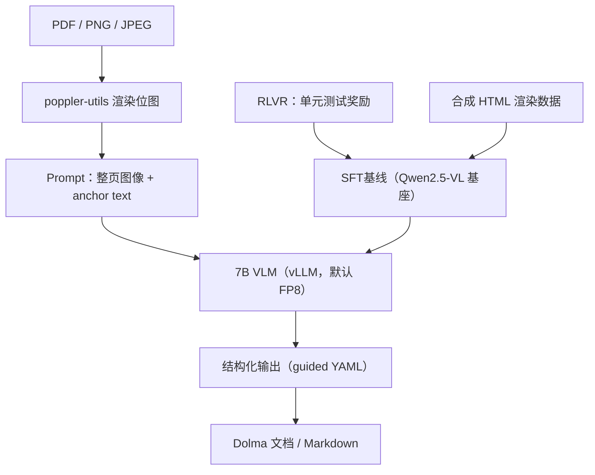

# olmOCR：用 7B VLM 把 PDF 线性化成 LLM 训练语料

做 LLM 预训练或 SFT 数据准备时，几乎都会被 PDF 卡住：arXiv 论文双栏加公式，PyMuPDF 提出来的纯文本读不通；旧扫描件没有文字层，tesseract 认错或漏掉；财报、杂志的多列表格和嵌入图表，页眉页脚还干扰阅读顺序。传统 OCR 管"识别字符"不管"理解版面"，单字准确率再高，跨段落、跨栏、跨页的自然阅读顺序也很难还原。

Ai2（Allen Institute for AI）的答案是换一条路：直接用 7B 视觉语言模型把整页渲染图当输入，端到端输出"自然阅读顺序"的纯文本或 Markdown。这就是 olmOCR。它不做发票、车牌这类狭义 OCR，目标是给 LLM 训练语料线性化 PDF，把零散文档变成干净的 token 流。

## 定位与核心数字

| 维度 | 内容 |
|---|---|
| 仓库 | allenai/olmocr，19.3k stars / 1.6k forks（GitHub API 2026-08-07 验证） |
| 定位 | 把 PDF / 扫描件 / 图片线性化为干净 Markdown 的 7B VLM 工具链 |
| 模型 | allenai/olmOCR-2-7B-1025-FP8，7B 参数，默认 FP8 |
| 许可证 | Apache-2.0 |
| 成本 | 百万页约 200 美元以内（论文口径约 176 美元） |
| olmOCR-Bench 总评 | 82.4 ± 1.1 |
| 开源范围 | 模型权重 + 训练代码 + 推理代码 + bench |

与 Mistral OCR 这类 API 服务的差别在于：权重、训练代码、推理代码全开源。你可以微调自己的版本，也可以从 v0.2.0 起的干净训练代码重新训练一个针对自己 PDF 分布的领域模型。

## 一张图看懂四层流水线

olmOCR 的仓库按研究项目工程化的方式分层。下面这张图把一页 PDF 从输入到输出的路径，以及训练侧怎么喂回模型，放在一起看。



| 层 | 关键内容 | 职责 |
|---|---|---|
| 数据层 | poppler-utils | PDF → 高分辨率位图 + 文字层 anchor |
| 推理层 | vLLM + guided decoding | 加载 FP8 模型，生成结构化输出 |
| 训练层 | SFT + RLVR + 合成数据 | 训练与微调流水线 |
| 部署层 | CLI / S3 多节点 / Beaker / Docker | 单机到百万级批处理 |

## 核心机制：VLM 怎么"读"一页 PDF

核心是把"读 PDF"建模成"图→文"任务，而不是逐字符识别。

### 页面渲染与 anchor text

olmOCR 依赖 `poppler-utils` 把 PDF 渲染成位图，同时抽出文字层。渲染分辨率由 `--target_longest_image_dim` 控制最长边。抽出的文字层会拼进 prompt 作为 anchor text——它只是"待校对的原稿"，不要求完整可靠。这样把任务从"从图像里抠字符"降级成"理解版面 + 对着 hint 校对文字"，准确率明显提升。

系统依赖：

```bash
sudo apt-get update
sudo apt-get install poppler-utils ttf-mscorefonts-installer msttcorefonts \
  fonts-crosextra-caladea fonts-crosextra-carlito gsfonts lcdf-typetools
```

### Prompt 结构

prompt 不是"OCR 这张图"这种开放指令，而是一份规定输出格式的工程 prompt。它把版面规则写死，避免模型自由发挥：

- 页眉/页脚只在首次出现时输出一次
- 空页输出空
- 多列布局按"先横后纵"的自然阅读顺序
- 数学公式用 LaTeX 记法，表格输出 Markdown 表格
- 不输出 "Here is the transcription:" 之类的前缀

这些规则保证了输出能被下游解析器稳定处理。

### 结构化输出（guided decoding）

`--guided_decoding` 启用后，vLLM 约束模型的输出必须符合一个 YAML 结构，把"页面属性"和"正文内容"拆成两个 token 流。模型先判断这页是不是表格、是不是纯图表、方向要不要旋转，再写 `natural_text`：

```yaml
primary_language: "en"
is_rotation_valid: true
rotation_correction: 0
is_table: false
is_diagram: false
natural_text: |
  <自然阅读顺序的正文>
```

这样做的直接好处是后处理方便：下游脚本可以解析出 `is_diagram: true` 的页直接跳过，不必再跑一遍模型。方向判断是早期版本的高频错误源，v0.3.0 的模型发布专门修了自动旋转检测，v0.4.0 继续沿用这套结构化输出。

### 推理后端

默认本地 vLLM，从 v0.1.75 起由 SGLang 切到 vLLM，v0.2.1 起默认 FP8（README 口径：跑得更快、单文档重试明显变少）。也支持任何 OpenAI 兼容端点，`--server` 指向远程 vLLM、Cirrascale、DeepInfra、Parasail 等已验证的供应商。本地单卡最低 12 GB 显存（RTX 4090 / L40S / A100 / H100），另需约 30 GB 磁盘。

## 训练流水线：SFT → RLVR + 合成数据

v0.2.0 起开源了清理过的训练代码，这才是仓库里值得单独看的部分。

**SFT 基线**：从 Qwen2.5-VL 微调而来，训练数据是合成 HTML 渲染图 + 真实 PDF 的对齐。v1 论文里训练集是 olmOCR-mix-0225，26 万页来自 10 万+ 抓取的 PDF，覆盖图形、手写、低质量扫描。

**v0.4.0 引入 RLVR**：OCR 这任务难做强化学习，因为"输出对不对"没有稳定的奖励信号。olmOCR 2 的做法是定义一组二进制的单元测试当奖励——比如"这页里有几张表格"、"公式 `$...$` 是否闭合"、"页码是否连续"。模型用可验证奖励的强化学习（RLVR）训练，同一输入采样多个候选，按测试通过情况更新。配套论文《olmOCR 2: Unit Test Rewards for Document OCR》（arXiv:2510.19817，2025-10）。

**合成数据**：为了规模化造单元测试，团队做了生成合成文档的流水线——抓 HTML 文档，渲染成"模拟 PDF"，用 HTML 源码当 ground truth，再自动旋转、加噪、注入页眉页脚。v0.4.0 靠合成数据 + RL 在 olmOCR-Bench 上提了约 4 分。

## 一次转换怎么流过系统

以本地 GPU 为例，从安装到拿到结果：

```bash
# 干净环境（README 要求，避免依赖冲突）
conda create -n olmocr python=3.11
conda activate olmocr

# 本地 GPU 推理（含 PyTorch，约 2GB+）
pip install olmocr[gpu] --extra-index-url https://download.pytorch.org/whl/cu128

# 推荐装 flashinfer 提速
pip install https://download.pytorch.org/whl/cu128/flashinfer/flashinfer_python-0.2.5%2Bcu128torch2.7-cp38-abi3-linux_x86_64.whl

# 下载示例 PDF 并转换
curl -o sample.pdf https://olmocr.allenai.org/papers/olmocr_3pg_sample.pdf
olmocr ./localworkspace --markdown --pdfs sample.pdf

# 查看结果
cat ./localworkspace/markdown/sample.md
```

流程是：`poppler-utils` 逐页渲染位图并抽 anchor text → vLLM 加载 FP8 模型 → 逐页生成结构化 YAML → 把 `natural_text` 写成 Markdown 文件，同时按 Dolma 格式落到 workspace。没有 GPU 时用 `--server` 指向远程 vLLM 或外部供应商，装轻量版 `pip install olmocr` 即可。

## olmOCR-Bench：它测的和它测不了的

olmOCR-Bench 是仓库自带的一套评测，覆盖 7,000+ 测试用例、1,400 篇文档，按 8 类版面铺开：arXiv、老扫描数学、表格、老扫描、页眉页脚、多栏、密集小字、干净基线。它故意把"文档特征维度"铺开，而不是只给一个干净的英文印刷体基准。

README 公布的 v0.4.0 结果：

| 系统 | 规模 | 总评 |
|---|---|---|
| Mistral OCR API | 闭源 | 72.0 ± 1.1 |
| Marker 1.10.1 | 开源 | 76.1 ± 1.1 |
| MinerU 2.5.4* | 开源 | 75.2 ± 1.1 |
| DeepSeek-OCR | 开源 | 75.7 ± 1.0 |
| PaddleOCR-VL* | 开源 | 80.0 ± 1.0 |
| Infinity-Parser 7B* | 7B | 82.5 ± ? |
| Chandra OCR 0.1.0* | 开源 | 83.1 ± 0.9 |
| **olmOCR v0.4.0** | **7B** | **82.4 ± 1.1** |

两个值得注意的点：带 \* 的模型用了非公开训练数据或额外微调，olmOCR v0.4.0 是完全开源的一方；7B 级别模型整体打平甚至压过部分更大的商用模型，这是"小而专"的红利。

不能从这张表推出来的东西同样重要。总分是英文文档的整体分，推不出中文、手写、极低分辨率扫描的表现；它衡量的是"整页文本还原质量"，不等于"下游 LLM 训练收益"。具体到你的 PDF 分布，得拿你自己的样本跑一遍才知道。

## 部署：四种路径

**本地 GPU**：上面本地转换的流程就是最常用的一种，适合单机批处理。

**远程 vLLM / 外部供应商**：无本地 GPU 时用 `--server` 指向远程端点，README 已验证 Cirrascale（$0.07/$0.15 每百万输入/输出 token）、DeepInfra（$0.09/$0.19）、Parasail（$0.10/$0.20）。服务端模型名要和 `--model` 一致：

```bash
vllm serve allenai/olmOCR-2-7B-1025-FP8 --max-model-len 16384
```

**S3 多节点**：要处理百万级 PDF 时，olmOCR 支持从 S3 读 PDF、用 S3 桶协调多节点。第一个节点建队列并开始转换，后续节点自动 join 同一个队列：

```bash
# 第一个节点
olmocr s3://my_s3_bucket/pdfworkspaces/exampleworkspace \
  --pdfs s3://my_s3_bucket/jakep/gnarly_pdfs/*.pdf

# 后续节点自动领取任务
olmocr s3://my_s3_bucket/pdfworkspaces/exampleworkspace
```

**Docker**：最省心，但要拉大镜像。带模型的镜像约 30 GB：

```bash
docker pull alleninstituteforai/olmocr:latest-with-model
docker run --gpus all \
  -v $(pwd):/workspace \
  alleninstituteforai/olmocr:latest-with-model \
  -c "olmocr /workspace/output --markdown --pdfs /workspace/sample.pdf"
```

Beaker 是 Ai2 内部集群方案，对外用户一般用 S3 多节点就够了。

## 适用边界与采用建议

**适合**：面向 LLM 预训练/SFT 的数据团队，需要统一 PDF 线性化器保证语料一致性；学术研究组把 arXiv 旧文批量线性化喂给本地 RAG；需把内部合同、报告做成"语义检索"的出版社、法务、咨询。

**谨慎**：手写体虽然列在支持范围内，但模型主要针对印刷文档优化，手写/草书这类退化样本的可靠性没有量化保证；极低分辨率扫描、跨页大表格、极小语种。olmOCR 2 的评测是英文文档基准，中文等语种的水准要单独验证。

**不建议**：单文件临时转换——用现成截图对话工具更省事；高 QPS 商用 OCR——它是研究工具，不是带 SLA 的服务。

## 结语

olmOCR 不是又一个"OCR 工具"，它把"PDF 线性化"从工具问题升级成了模型问题：用 7B VLM 端到端还原阅读顺序，再配上训练代码、bench 和合成数据流水线。在你只需要快速转几个文件时它重了些，但如果你要系统性地把一批 PDF 变成 LLM 训练语料，权重、训练、推理全开源这一条，让它值得放进评估清单。

---

**仓库**：<https://github.com/allenai/olmocr>
**在线 demo**：<https://olmocr.allenai.org/>
**论文 v1**：[olmOCR: Unlocking Trillions of Tokens in PDFs with Vision Language Models](https://arxiv.org/abs/2502.18443)
**论文 v2**：[olmOCR 2: Unit Test Rewards for Document OCR](https://arxiv.org/abs/2510.19817)
**模型权重**：[allenai/olmOCR-2-7B-1025-FP8](https://huggingface.co/allenai/olmOCR-2-7B-1025-FP8)