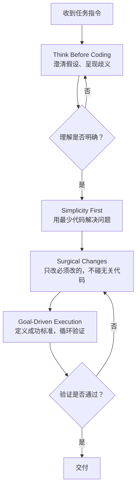

Andrej Karpathy Skills：Claude Code 进化指南

2026 年初，Andrej Karpathy 在博客和社交媒体上发布了一系列关于 LLM 编程陷阱的观察，指出当前 AI 编程助手存在四类典型行为缺失：盲目假设、隐藏困惑、过度工程、副作用盲区。社区随后将这些观察整理成 **Andrej Karpathy Skills**——一组可安装到 Claude Code 中的强制规则集，通过 Think Before Coding、Simplicity First、Surgical Changes、Goal-Driven Execution 四条原则约束 LLM 的编码行为。

这套 Skills 把"优秀工程师的思考纪律"写成可执行约束。本文先拆解四类行为缺失与四条原则的对应关系，再给出安装配置、任务流案例、团队推广路径和采用建议。

> 说明：本文引用的 Karpathy 原话来自其 2026 年初的公开博客与社交媒体帖子。案例数据基于社区报告和实际使用观察，行号与百分比为典型场景示意，不代表通用基准。

## 总览：四类缺失与四条原则的对应关系

Karpathy 诊断的是 LLM 在真实编程场景下的决策模式。LLM 缺少优秀工程师的思考纪律——澄清需求、控制范围、验证结果。下表把四类行为缺失与四条原则一一对应：

| 行为缺失 | 典型表现 | 对抗原则 | 关键指令 |
|---------|---------|---------|---------|
| 盲目假设 | 模糊需求下默默猜测并一路执行 | Think Before Coding | 声明假设、呈现歧义、必要时拒绝执行 |
| 隐藏困惑 | 遇到矛盾不指出，悄悄选一个方案 | Think Before Coding | 不确定就问，有歧义就呈现 |
| 过度工程 | 200 行能解决写成 1000 行，套上策略模式 | Simplicity First | 最少代码，零投机性设计 |
| 副作用盲区 | 顺手"优化"无关模块，引入回归 | Surgical Changes | 只改必须改的，只清理自己造成的垃圾 |
| 模糊交付 | 加个 `if` 就收工，不验证边界 | Goal-Driven Execution | 定义成功标准，循环直到验证通过 |

四条原则在工作流中形成层次：Think Before Coding 是入口哨兵，Simplicity First 和 Surgical Changes 是执行中的双轨约束（前者控制产出量，后者控制影响范围），Goal-Driven Execution 是出口检验。下图展示它们的协作关系：



## Karpathy 的诊断：四类行为缺失

### 盲目假设

LLM 看到模糊需求时的第一反应是填补，不主动澄清。它默默猜测你的意图，然后沿着猜测一路执行。猜对了万事大吉，猜错了一整个下午都在调试一个基础逻辑就有问题的实现。

Karpathy 的原话：*"The models make wrong assumptions on your behalf and just run along with them without checking."*

真实场景：你让 Claude Code "给用户表加个软删除功能"。它没问你软删除字段叫什么（`deleted_at` 还是 `is_deleted`？），没问你已有的查询要不要自动过滤，直接创建了 migration、改了 model、加了 trait——用的命名和你团队规范恰好相反。

### 隐藏困惑

LLM 不理解的时候，它不说。

*"They don't manage their confusion, don't seek clarifications, don't surface inconsistencies, don't present tradeoffs, don't push back when they should."*

它遇到矛盾不指出，发现两个依赖版本冲突不提醒，碰到不可能同时满足的需求就悄悄选一个。在人类工程师的协作中，"我不确定"是最有价值的信号之一。LLM 把这个信号掐掉了。

### 过度工程

*"They really like to overcomplicate code and APIs, bloat abstractions, don't clean up dead code…"*

200 行能解决的问题写成 1000 行，单次调用的逻辑套上策略模式，两个字段的数据结构背上完整的 builder pattern。它还会用"这样更灵活"、"为将来扩展考虑"来辩护——这些从来不是你要求的设计。

LLM 倾向过度工程的根源在于训练数据中大量代码库本身就带有抽象层，模型把"看起来像生产代码"等同于"正确代码"。Simplicity First 正是对抗这种倾向。

### 副作用盲区

*"They still sometimes change/remove comments and code they don't sufficiently understand as side effects, even if orthogonal to the task."*

你在改支付模块的退款逻辑，LLM 顺便"优化"了日志模块的 error handling 风格。它是出于好意——甚至那个风格确实更现代——但它没有意识到这两个模块的耦合点在哪里。线上回归就是这么来的。

## 四大原则详解

### Think Before Coding

对抗盲目假设和隐藏困惑。

每条指令在执行前必须通过一个思考关卡：声明假设、呈现歧义、必要时拒绝执行。LLM 被要求把"我认为你的意思是 X"改成"你的指令可以理解为 X 或 Y，你指的是哪种？"

```markdown
Think Before Coding
- State assumptions explicitly — If uncertain, ask rather than guess
- Present multiple interpretations — Don't pick silently when ambiguity exists 
- Push back when warranted — If a simpler approach exists, say so
- Stop when confused — Name what's unclear and ask for clarification
```

第四条 "Stop when confused" 是反直觉的。我们给 AI 下指令时默认期待它"无论如何都要产出结果"。这条规则明确告诉它：不产出比瞎产出更有价值。

### Simplicity First

对抗过度工程。

核心指令只有一句话：用最少代码解决问题，不做任何投机性设计。

```markdown
Simplicity First
- Minimum code that solves the problem. Nothing speculative.
- No features beyond what was asked
- No abstractions for single-use code
- No "flexibility" or "configurability" that wasn't requested
- No error handling for impossible scenarios
- If 200 lines could be 50, rewrite it
```

"No abstractions for single-use code" 这一条最关键。LLM 有一个顽固的倾向——把"代码复用"等同于"抽象"。它不理解有时候重复比抽象更清晰。一个 30 行的逻辑被提取成一个 15 行的函数加上 5 个参数和一段 docstring——净损失。单次使用的代码不需要抽象。

### Surgical Changes

对抗副作用盲区。

核心指令：只触碰必须改的，只清理自己造成的垃圾。这条规则最难执行，因为它要求 LLM 对自己产生的变更做三级过滤——请求的改动、你改动引发的必然连带、以及你觉得顺眼于是顺便改的——把第三类全部删掉。

```markdown
Surgical Changes
- Don't "improve" adjacent code, comments, or formatting
- Don't refactor things that aren't broken
- Match existing style, even if you'd do it differently
- If you notice unrelated dead code, mention it — don't delete it
- Remove imports/variables/functions that YOUR changes made unused
- Don't remove pre-existing dead code unless asked
```

"Match existing style, even if you'd do it differently" 这一条要求 LLM 压抑自己的审美偏好——这恰恰是 LLM 最不擅长的事。你项目用的是 snake_case，它想改成 camelCase——不行。你习惯把类型定义放在文件顶部，它想挪到末尾——不行。

### Goal-Driven Execution

这是 Karpathy 整套体系的核心假设，也是四条原则中最反直觉的一条。

*"LLMs are exceptionally good at looping until they meet specific goals… Don't tell it what to do, give it success criteria and watch it go."*

传统的人机交互模式是"指令 → 执行 → 交付"。Karpathy 提出的模式是"目标 → 循环验证 → 达标交付"。告诉 AI "添加输入校验"，LLM 可能加个 `if` 就收工；换成"为非法输入编写测试，然后让测试通过"，它要经历写测试 → 跑测试 → 发现边界遗漏 → 补充逻辑 → 重新测试 → 通过的完整闭环。

```markdown
Goal-Driven Execution
- Define success criteria. Loop until verified.
- Transform imperative tasks into verifiable goals:
```

任务转换范式：

| 不要这样说 | 要这样说 |
|-----------|---------|
| "添加校验逻辑" | "为非法输入写测试，然后让测试通过" |
| "修这个 bug" | "写一个能重现 bug 的测试，然后让测试通过" |
| "重构 X 模块" | "确保重构前后测试全部通过，不改变外部行为" |
| "实现用户登录" | "实现登录功能，成功标准：传入正确凭证返回 token，传入错误凭证返回 401，连续 5 次失败锁定账户" |

## 任务流案例：一个完整任务如何流过四大原则

下面通过一个真实场景展示四条原则如何依次生效。

**任务**：「给订单查询接口加上分页功能」

**Step 1 - Think Before Coding（入口哨兵）**

Claude Code 收到指令后，先声明假设和歧义：

> "在开始实现前需要确认：1) 现有接口是 REST 还是 GraphQL？2) 分页方式是 offset-based（`?page=1&size=20`）还是 cursor-based（`?after=cursor`）？3) 数据库是 MySQL 还是 PostgreSQL？不同数据库的分页性能差异较大。4) 是否需要返回总数？计算 COUNT 在大表上可能很慢。"

**Step 2 - Simplicity First（控制产出量）**

澄清后（offset-based、需要总数、MySQL），Claude Code 选择最简实现：在现有 repository 方法上加 `page` 和 `size` 参数，用 `LIMIT/OFFSET`，不引入分页抽象基类，不为"将来可能切换 cursor-based"预留接口。

**Step 3 - Surgical Changes（控制影响范围）**

只改 controller、service、repository 三层的相关方法。不重命名现有变量，不调整 import 顺序，不顺手优化查询性能。如果发现 `order/utils.py` 中有未使用的 import，提示用户但不删除。

**Step 4 - Goal-Driven Execution（出口检验）**

定义成功标准：
- 传入 `page=1, size=20` 返回前 20 条记录
- 传入 `page=2, size=20` 返回第 21-40 条记录
- 返回体包含 `total` 字段
- 超出范围的 `page` 返回空数组，不报错
- 现有所有测试通过

Claude Code 写测试 → 跑测试 → 修复 → 再跑 → 通过，循环直到所有标准满足。

## 安装与配置

社区已将这套规则封装为可安装的 Claude Code 插件。

### 插件安装（推荐）

一次性配置，全局生效：

```
/plugin marketplace add forrestchang/andrej-karpathy-skills
/plugin install andrej-karpathy-skills@karpathy-skills
```

### CLAUDE.md 手动配置

适合需要项目特定规则或不想使用插件的场景：

```bash
curl -o CLAUDE.md https://raw.githubusercontent.com/forrestchang/andrej-karpathy-skills/main/CLAUDE.md
```

已有 CLAUDE.md 则追加：

```bash
echo "" >> CLAUDE.md
curl https://raw.githubusercontent.com/forrestchang/andrej-karpathy-skills/main/CLAUDE.md >> CLAUDE.md
```

### 项目级定制

在 CLAUDE.md 中追加项目特定规则，与 Karpathy Skills 协同工作：

```markdown
Project-Specific Guidelines
- Use TypeScript strict mode
- All API endpoints must have tests
- Follow the existing error handling patterns in `src/utils/errors.ts`
- No console.log in production code
```

## 真实案例：安装前后的行为对比

以下对比基于社区报告的实际使用观察，行号与百分比为典型场景示意，不代表通用基准。

### 案例一：模糊需求处理

**任务**：「给这个 API 加上权限校验」

**安装前**：
- 直接假设你用的是 RBAC 模型，创建了 role、permission、role_permission 三张表
- 在中间件里硬编码了一个 admin 角色检查
- 没有问"现有认证体系是什么"、"哪些接口需要权限"、"权限粒度到接口还是到数据行"
- 产出约 300 行代码，其中约 200 行是你根本不需要的表结构和迁移

**安装后**：

> "我注意到你提到'权限校验'，但在开始实现前需要确认几个前提：1) 现有认证体系是 JWT、Session 还是 OAuth？2) 权限粒度是接口级（这个接口管理员可调）还是数据级（管理员只能看自己部门的）？3) 是否有现成的权限中间件可以复用？在等待你的澄清期间我不会开始编码。"

- 零代码产出，三个精准问题
- 澄清后只改了需要的中间件注册逻辑，新增约 15 行

### 案例二：过度工程抑制

**任务**：「把配置文件从 JSON 迁移到 YAML」

**安装前**：
- 创建了 `ConfigLoader` 抽象基类、`JSONConfigLoader`、`YAMLConfigLoader` 两个实现类
- 加了工厂模式 `ConfigLoaderFactory`
- 写了验证器 `ConfigSchemaValidator` 和迁移脚本 `MigrationRunner`
- 还加了一个 `--rollback` 参数
- 总计约 450 行，6 个新文件

**安装后**：
- 替换 `json.load` 为 `yaml.safe_load`
- 更新文件读取路径
- 改动 3 个文件，共约 12 行代码

### 案例三：副作用控制

**任务**：「修复订单金额计算中折扣小数点精度丢失的 bug」

**安装前**：
- 修了精度问题（`Decimal` 替换 `float`）
- 顺便把订单模块的 `print()` 调试语句删了
- 顺手把 `if amount > 0` 改成了 `if amount is not None and amount > 0`
- 把 import 块重新按字母排序了
- Diff 涉及 8 个文件，其中 5 个与精度无关

**安装后**：
- 修了精度问题
- 移除了本次改动造成的未使用 import（从 `typing` 导入的 `List` 不再需要）
- Diff 涉及 2 个文件
- 附带一条提示：「我注意到 `order/utils.py` 中有几处 `print()` 调试语句，需要我单独清理吗？」

### 案例四：目标驱动执行

**任务**：「重构用户模块，提高可测试性」

**安装前**：
- 重写了整个 `UserService` 类
- 把所有 private 方法改成了 public（"方便测试"）
- 加了依赖注入容器
- 原有约 40 个测试中约 17 个失败——因为方法签名全变了
- 回复："测试需要更新以适配新的 API，是否继续？"

**安装后**：

> "在开始重构前，我定义以下成功标准：1) 所有现有测试保持通过；2) 每个公开方法的代码路径至少有一个测试覆盖；3) 不改变任何外部接口的签名或行为。重构将以可逆的小步长进行，每步后运行完整测试套件。"

- 逐步提取依赖，每步后验证
- 增加约 12 个新测试，原有测试全绿
- 重构完成后测试覆盖率从约 62% 提升到约 89%（具体数字取决于项目基线）
- 零接口变更

## 与其他技能的关系

Andrej Karpathy Skills 是 AI 编程工作流的底层约束层，与上层任务型 Skills 协同工作：

| 技能 | 定位 | 与本技能的关系 |
|------|------|-------------|
| karpathy-llm-wiki | 知识管理 | 本技能约束编码行为，wiki 约束知识产出 |
| claude-code-skills | Agent 能力集 | 本技能是底层规则引擎，Skills 是上层任务单元 |
| mattpocock-skills | 领域专精 | 本技能是通用纪律，Skills 是 TypeScript 专项任务 |

组合使用示例：

```
"用 Simplicity First 的方式实现这个 CRUD API，然后用 wiki skill 把接口文档写入知识库"
```

Karpathy Skills 确保产出的代码干净，Wiki Skills 确保这份干净的设计被记录下来供团队检索。

## 团队推广路径

个人使用 Karpathy Skills 有效果，但团队级收益更大——当所有人的 AI 工具使用同一套行为约束时，代码审查者不再需要区分"这是 AI 的过度工程"还是"这是同事的设计决策"。

### 推广节奏

**第一步：演示痛点。** 找一段上个月的代码审查记录，挑出 AI 生成的典型过度工程案例，放进团队群里。大多数人看到那个"两个字段的数据结构用了完整 builder pattern"的例子后，不需要你再解释什么是过度工程。

**第二步：解释原则，不宣读规则。** 用一两个本团队的真实案例说明每条原则解决的问题。用团队自己的代码做例子，原则会自己说话。

**第三步：统一安装。** 用插件模式（`/plugin install`），减少配置摩擦。有项目特定需求的团队额外配置项目级 CLAUDE.md。

**第四步：代码审查纳入规则。** 在 Review 模板中增加一条检查：「AI 生成的代码是否违反 Karpathy 原则？」大部分违反规则的代码人工审查时本来就会打回，现在只是把原因标注得更具体。

**第五步：允许例外，但要求理由。** 团队的 CLAUDE.md 可以覆盖或补充规则，但覆盖的理由必须写下来。这个"写下理由"的要求本身就会过滤掉大部分不必要的覆盖。

### 常见阻力的处理

**「这会拖慢开发速度。」**

Karpathy Skills 确实偏谨慎。需要区分两种"快"——产出代码的速度，和交付功能的速度。默认 Claude Code 产出代码更快，但返工率更高。安装 Skills 后单次任务可能多花约 20% 的时间在澄清上，重写率通常下降约 50% 以上（数字基于社区反馈，具体比例因团队而异）。

**「我的需求都很简单，不需要这么重的流程。」**

Karpathy 自己在指南中留了免责条款：*"For trivial tasks (simple typo fixes, obvious one-liners), use judgment — not every change needs the full rigor."* Skills 是针对非平凡任务的约束。判断任务复杂度，决定是否启用完整流程。

**「规则太死板了，我需要灵活性。」**

把规则视为默认值，可以覆盖。CLAUDE.md 允许项目级覆盖，覆盖时写上理由即可。意识到默认行为的存在——很多时候"灵活性"只是"懒得想"的另一种说法。

## 提示词改造：从指令到目标

与 Karpathy Skills 配套使用的最有效技巧是改造提示词结构——把"步骤指令"转化为"成功标准"。这会让 Goal-Driven Execution 原则自动生效：

| 原始指令 | 改造后 |
|---------|--------|
| "帮我写一个用户注册 API" | "用 TDD 方式实现用户注册：先写测试覆盖正常注册、重复邮箱、弱密码三个场景，然后实现代码使测试通过。成功标准：所有测试绿、密码 bcrypt 加密、响应不包含密码字段。" |
| "修复这个搜索 bug" | "先写一个测试用例重现搜索结果为空时的 N+1 查询问题，然后修复代码使测试通过。额外要求：修复后的查询次数在 EXPLAIN 中不超过 3 次。" |
| "重构这个支付模块" | "在不改变任何外部接口的前提下提升支付模块的内聚性。成功标准：所有现有测试通过、`PaymentService` 的公开方法数不增加、循环复杂度下降。" |

## FAQ

**Q：这些规则会压制 LLM 的创造力吗？**

它们压制的是没有方向的"创作冲动"——LLM 在没有充分理解需求时的自发填充行为。真正的创造力需要约束才能聚焦。好的建筑设计是在承重墙和预算框架内的最优解。Karpathy Skills 就是给 LLM 划定承重墙。

**Q：Simplicity First 和必要的架构设计冲突时怎么办？**

Simplicity First 反对的是投机性设计（"将来可能会用到"）。判断标准：如果没有这个抽象，当前需求能不能被满足？如果能，它就是投机性的。今天用一个单文件脚本就够了，就不要创建微服务骨架。六个月后需求真的变了，那时再做架构演进——届时你拥有更多信息，做出的决策质量更高。

**Q：已经在用的项目怎么平滑迁移？**

规则的生效是渐进的——下一次 Claude Code 对话开始时，CLAUDE.md 被读取，行为从那一刻起调整。建议先在非关键分支上试用一周，观察 diff 模式的变化，确认团队认可后再推广到主干开发。

**Q：这些规则对非英文指令也有效吗？**

四大原则是语言无关的行为约束——"收到模糊指令时主动澄清"这件事不依赖指令语言。但 Karpathy Skills 的默认 CLAUDE.md 是英文写的，如果团队用中文和 Claude Code 对话，建议把规则翻译成中文放入项目 CLAUDE.md，确保行为约束和日常指令在同一语境下。

**Q：Goal-Driven Execution 中的"成功标准"应该写到什么粒度？**

可验证的最小粒度。"代码质量高"没法验证；"所有测试通过且 eslint 零警告"能验证。"用户体验好"没法验证；"页面加载时间小于 200ms 且 Lighthouse Performance 评分 > 90"能验证。原则：如果你不能在一个终端命令里自动化验证这个标准，它就太模糊了。

**Q：多条原则冲突时优先级怎么排？**

实际运行中四个原则几乎不会冲突——它们在同一个工作流的不同阶段起作用。Think Before Coding 是入口，判断任务是否足够清晰以进入执行。如果入口判断本身就过不去——不执行。Simplicity First 和 Surgical Changes 是执行中的双轨约束。Goal-Driven Execution 是出口。如果要放弃一条原则，先放弃效率（Simplicity），保留安全（Surgical）和正确性（Think、Goal-Driven）。

**Q：小团队（2-3 人）和大团队（50+ 人）使用效果有差别吗？**

有，而且方向和直觉相反：小团队收益更大。大团队通常已有成熟的代码审查流程和规范约束，AI 产出的代码在被合入前经过多人把关。小团队往往是同一个人写代码和审代码——AI 产出的问题更容易逃逸。Karpathy Skills 在小团队中相当于一个免费的自动化代码审查层。

## 采用建议

Andrej Karpathy Skills 把一位世界级 AI 研究者对 LLM 行为的理解，翻译成了一组可执行的约束规则。它教 LLM 做一个更好的协作者——写更好的代码只是附带效果。

四条原则用一个表格收束：

| 原则 | 对抗的行为 | 关键指令 |
|------|-----------|---------|
| Think Before Coding | 盲目假设、隐藏困惑 | 不确定就问，有歧义就呈现，该拒绝就拒绝 |
| Simplicity First | 过度工程 | 最少代码，零投机 |
| Surgical Changes | 副作用盲区 | 只改必须改的，只清理自己造成的垃圾 |
| Goal-Driven Execution | 模糊交付 | 定义成功标准，循环直到验证通过 |

### 采用顺序

1. **个人试用一周**：在非关键分支上安装 Skills，观察 diff 模式变化，记录哪些原则触发了行为调整。
2. **改造提示词**：把高频任务的"步骤指令"改写为"成功标准"，让 Goal-Driven Execution 自动生效。
3. **小范围团队试点**：2-3 人的小团队先统一安装，运行两周后评估返工率和代码审查通过率的变化。
4. **全团队推广**：在 Review 模板中纳入 Karpathy 原则检查，允许项目级覆盖但要求写理由。

### 适用边界

- **适合**：涉及业务逻辑、数据模型、API 契约的非平凡任务。
- **可跳过**：typo 修复、单行变更、明显的 one-liner——Karpathy 本人在指南中明确这些任务用判断即可。
- **不适合**：探索性原型、hackathon 项目——这些场景需要快速产出，Skills 的约束会拖慢节奏。

这套 Skills 在回答一个核心问题：在人类和 AI 协作的编程环境中，谁是主导者？Karpathy 的回答是：给出目标的人类。AI 是目标驱动引擎，人类是目标定义者。约束让 AI 把算力花在真正需要的地方。

---

*🦞 每日 08:00 自动更新*
