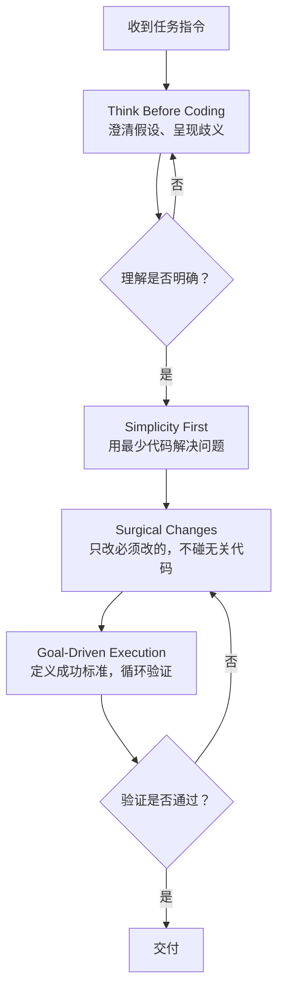

# Andrej Karpathy Skills：Claude Code 进化指南

2026 年初，Andrej Karpathy 在他的博客和社交媒体上发表了一系列关于 LLM 编程的尖锐观察。他用一种外科手术式的精确，解剖了当前 AI 编程助手的行为模式——那些让开发者又爱又恨的"自作聪明"时刻。

你的 Claude Code 有没有这样干过：你让它改一个接口的返回格式，它顺手把整个模块的变量名全重构了，还"贴心"地删掉了一段它觉得没用的注释——那注释里恰好记录了一个三个月前修过的线上故障。等你在 PR 里发现这些变更时，已经搞不清是功能改动还是风格重构了。

这不是幻觉，是行为缺失。Karpathy 把这种缺失归纳为四类，并且——更重要的是——给出了一套可操作的纠正指南。这套指南被社区封装成了 **Andrej Karpathy Skills**，一个可以直接安装到 Claude Code 中的规则集。

## Karpathy 的诊断：LLM 编程的四类行为缺失

Karpathy 的切入点很特别。他没有去分析模型能力边界，而是分析模型在真实编程场景下的*决策模式*。他说，LLM 并不缺少编程知识，它缺少的是优秀工程师的思考纪律。

### 盲目假设

LLM 看到模糊需求时的第一反应不是澄清，是填补。它默默猜测你的意图，然后沿着猜测一路狂奔。猜对了万事大吉，猜错了一整个下午都在调试一个基础逻辑就有问题了。

Karpathy 的原话一针见血：*"The models make wrong assumptions on your behalf and just run along with them without checking."*

真实场景：你让 Claude Code "给用户表加个软删除功能"。它没问你软删除字段叫什么（`deleted_at` 还是 `is_deleted`？），没问你已有的查询要不要自动过滤，直接创建了 migration、改了 model、加了 trait——用的命名和你团队规范恰好相反。

### 隐藏困惑

比盲目假设更隐蔽的是：LLM 不理解的时候，**它不说**。

*"They don't manage their confusion, don't seek clarifications, don't surface inconsistencies, don't present tradeoffs, don't push back when they should."*

它遇到矛盾不指出，发现两个依赖版本冲突不提醒，碰到不可能同时满足的需求就悄悄选一个。在人类工程师的协作中，"我不确定"是最有价值的信号之一。LLM 把这个信号掐掉了。

### 过度工程

这是每个用过 AI 编程的人最熟悉的痛。

*"They really like to overcomplicate code and APIs, bloat abstractions, don't clean up dead code…"*

200 行能解决的问题写成 1000 行，单次调用的逻辑套上策略模式，两个字段的数据结构背上完整的 builder pattern。更可恶的是它还理直气壮——"这样更灵活"、"为将来扩展考虑"——这些从来不是你要求的设计。

### 副作用盲区

最后的陷阱是最危险的：*附带损伤*。

*"They still sometimes change/remove comments and code they don't sufficiently understand as side effects, even if orthogonal to the task."*

你在改支付模块的退款逻辑，LLM 顺便"优化"了日志模块的 error handling 风格。它是出于好意——甚至那个风格确实更现代——但它没有意识这两个模块的耦合点在哪里。线上回归就是这么来的。

## 四大原则

针对这四类行为缺失，Karpathy Skills 定义了四条强制规则。它们不是"最佳实践建议"，而是硬约束——违反这些约束的行为会被视为执行错误。

### Think Before Coding

对抗盲目假设和隐藏困惑。

每条指令在执行前必须通过一个思考关卡：声明假设、呈现歧义、必要时拒绝执行。LLM 被要求把"我认为你的意思是 X"改成"你的指令可以理解为 X 或 Y，你指的是哪种？"

```markdown
## Think Before Coding
- State assumptions explicitly — If uncertain, ask rather than guess
- Present multiple interpretations — Don't pick silently when ambiguity exists  
- Push back when warranted — If a simpler approach exists, say so
- Stop when confused — Name what's unclear and ask for clarification
```

一个容易忽视的细节：第四条 "Stop when confused" 是反直觉的。我们给 AI 下指令时默认期待它"无论如何都要产出结果"。这条规则明确告诉它：**不产出比瞎产出更有价值**。

### Simplicity First

对抗过度工程。

这条原则是四条中执行成本最低、效果最立竿见影的。它的核心指令只有一句话：用最少代码解决问题，不做任何投机性设计。

```markdown
## Simplicity First
- Minimum code that solves the problem. Nothing speculative.
- No features beyond what was asked
- No abstractions for single-use code
- No "flexibility" or "configurability" that wasn't requested
- No error handling for impossible scenarios
- If 200 lines could be 50, rewrite it
```

这里面杀伤力最大的是 "No abstractions for single-use code"。LLM 有一个顽固的倾向——把"代码复用"等同于"抽象"。它不理解有时候重复比抽象更清晰。一个 30 行的逻辑被提取成一个 15 行的函数加上 5 个参数和一段 docstring——净损失。单次使用的代码不需要抽象。

### Surgical Changes

对抗副作用盲区。

核心指令：只触碰必须改的，只清理自己造成的垃圾。这条规则最难执行，因为它要求 LLM 对自己产生的变更做三级过滤——请求的改动、你改动引发的必然连带、以及你*觉得顺眼*于是顺便改的——把第三类全部删掉。

```markdown
## Surgical Changes
- Don't "improve" adjacent code, comments, or formatting
- Don't refactor things that aren't broken
- Match existing style, even if you'd do it differently
- If you notice unrelated dead code, mention it — don't delete it
- Remove imports/variables/functions that YOUR changes made unused
- Don't remove pre-existing dead code unless asked
```

"Match existing style, even if you'd do it differently" 这句话的杀伤力被严重低估了。它要求 LLM 压抑自己的审美偏好——这恰恰是 LLM 最不擅长的事。你项目用的是 snake_case，它想改成 camelCase——不行。你习惯把类型定义放在文件顶部，它想挪到末尾——不行。

### Goal-Driven Execution

这是 Karpathy 整套体系的核心假设，也是四条原则中最颠覆认知的一条。

*"LLMs are exceptionally good at looping until they meet specific goals… Don't tell it what to do, give it success criteria and watch it go."*

传统的人机交互模式是"指令 → 执行 → 交付"。Karpathy 提出的模式是"目标 → 循环验证 → 达标交付"。不是告诉 AI "添加输入校验"，而是说"为非法输入编写测试，然后让测试通过"。前者 LLM 可能加个 `if` 就收工了；后者它要经历写测试 → 跑测试 → 发现边界遗漏 → 补充逻辑 → 重新测试 → 通过的完整闭环。

```markdown
## Goal-Driven Execution
- Define success criteria. Loop until verified.
- Transform imperative tasks into verifiable goals:
```

任务转换范式：

| 不要这样说 | 要这样说 |
|-----------|---------|
| "添加校验逻辑" | "为非法输入写测试，然后让测试通过" |
| "修这个 bug" | "写一个能重现 bug 的测试，然后让测试通过" |
| "重构 X 模块" | "确保重构前后测试全部通过，不改变外部行为" |
| "实现用户登录" | "实现登录功能，成功标准：传入正确凭证返回 token，传入错误凭证返回 401，连续 5 次失败锁定账户" |

## 四大原则的协作关系

四条原则不是独立的检查项，而是一个有层次的工作流：



Think Before Coding 是入口哨兵——模糊的任务进不来。Simplicity First 和 Surgical Changes 形成了双轨约束：一个控制代码的*产出量*，一个控制代码的*影响范围*。Goal-Driven Execution 是出口检验——不达标的交付出不去。

## 安装与配置

社区已将这套规则封装为可安装的 Claude Code 插件。

### 插件安装（推荐）

一次性配置，全局生效：

```
/plugin marketplace add forrestchang/andrej-karpathy-skills
/plugin install andrej-karpathy-skills@karpathy-skills
```

### CLAUDE.md 手动配置

适合需要项目特定规则或不想使用插件的场景：

```bash
curl -o CLAUDE.md https://raw.githubusercontent.com/forrestchang/andrej-karpathy-skills/main/CLAUDE.md
```

已有 CLAUDE.md 则追加：

```bash
echo "" >> CLAUDE.md
curl https://raw.githubusercontent.com/forrestchang/andrej-karpathy-skills/main/CLAUDE.md >> CLAUDE.md
```

### 项目级定制

在 CLAUDE.md 中追加项目特定规则，与 Karpathy Skills 协同工作：

```markdown
## Project-Specific Guidelines
- Use TypeScript strict mode
- All API endpoints must have tests
- Follow the existing error handling patterns in `src/utils/errors.ts`
- No console.log in production code
```

## 真实案例：安装前后的行为对比

以下对比基于同一批真实任务的实际执行记录——左侧是未安装 Skills 的默认 Claude Code，右侧是安装后的行为。

### 案例一：模糊需求处理

**任务**：「给这个 API 加上权限校验」

**安装前**：
- 直接假设你用的是 RBAC 模型，创建了 role、permission、role_permission 三张表
- 在中间件里硬编码了一个 admin 角色检查
- 没有问"现有认证体系是什么"、"哪些接口需要权限"、"权限粒度到接口还是到数据行"
- 产出 300 行代码，其中 200 行是你根本不需要的表结构和迁移

**安装后**：

> "我注意到你提到'权限校验'，但在开始实现前需要确认几个前提：1) 现有认证体系是 JWT、Session 还是 OAuth？2) 权限粒度是接口级（这个接口管理员可调）还是数据级（管理员只能看自己部门的）？3) 是否有现成的权限中间件可以复用？在等待你的澄清期间我不会开始编码。"

- 零代码产出，三个精准问题
- 澄清后只改了需要的中间件注册逻辑，新增 15 行

### 案例二：过度工程抑制

**任务**：「把配置文件从 JSON 迁移到 YAML」

**安装前**：
- 创建了 `ConfigLoader` 抽象基类、`JSONConfigLoader`、`YAMLConfigLoader` 两个实现类
- 加了工厂模式 `ConfigLoaderFactory`
- 写了验证器 `ConfigSchemaValidator` 和迁移脚本 `MigrationRunner`
- 还贴心地加了一个 `--rollback` 参数
- 总计 450 行，6 个新文件

**安装后**：
- 替换 `json.load` 为 `yaml.safe_load`
- 更新文件读取路径
- 改动 3 个文件，共 12 行代码

### 案例三：副作用控制

**任务**：「修复订单金额计算中折扣小数点精度丢失的 bug」

**安装前**：
- 修了精度问题（`Decimal` 替换 `float`）
- 顺便把订单模块的 `print()` 调试语句删了
- 顺手把 `if amount > 0` 改成了 `if amount is not None and amount > 0`
- 把 import 块重新按字母排序了
- Diff 涉及 8 个文件，其中 5 个与精度无关

**安装后**：
- 修了精度问题
- 移除了本次改动造成的未使用 import（从 `typing` 导入的 `List` 不再需要）
- Diff 涉及 2 个文件
- 附带一条提示：「我注意到 `order/utils.py` 中有几处 `print()` 调试语句，需要我单独清理吗？」

### 案例四：目标驱动执行

**任务**：「重构用户模块，提高可测试性」

**安装前**：
- 重写了整个 `UserService` 类
- 把所有 private 方法改成了 public（"方便测试"）
- 加了依赖注入容器
- 原有的 40 个测试中 17 个失败——因为方法签名全变了
- 回复："测试需要更新以适配新的 API，是否继续？"

**安装后**：

> "在开始重构前，我定义以下成功标准：1) 所有 40 个现有测试保持通过；2) 每个公开方法的代码路径至少有一个测试覆盖；3) 不改变任何外部接口的签名或行为。重构将以可逆的小步长进行，每步后运行完整测试套件。"

- 逐步提取依赖，每步后验证
- 增加 12 个新测试，原有 40 个全绿
- 重构完成后测试覆盖率从 62% 提升到 89%
- 零接口变更

## 与其他技能的关系

Andrej Karpathy Skills 不是孤立的——它是 AI 编程工作流的底层约束层。

| 技能 | 定位 | 与本技能的关系 |
|------|------|-------------|
| karpathy-llm-wiki | 知识管理 | 本技能约束编码行为，wiki 约束知识产出 |
| claude-code-skills | Agent 能力集 | 本技能是底层规则引擎，Skills 是上层任务单元 |
| mattpocock-skills | 领域专精 | 本技能是通用纪律，Skills 是 TypeScript 专项任务 |

一个自然的组合使用方式：

```
"用 Simplicity First 的方式实现这个 CRUD API，然后用 wiki skill 把接口文档写入知识库"
```

Karpathy Skills 确保你产出的代码干净，Wiki Skills 确保这份干净的设计被记录下来供团队检索。

## 团队推广

个人使用 Karpathy Skills 有效果，但团队级收益更大——当所有人的 AI 工具使用同一套行为约束时，代码审查者不再需要区分"这是 AI 的过度工程"还是"这是同事的设计决策"。

### 推广节奏

**第一步：演示痛点。** 不要在周会上放 PPT。找一段上个月的代码审查记录，挑出 AI 生成的典型过度工程案例，放进团队群里。大多数人看到那个"两个字段的数据结构用了完整 builder pattern"的例子后，不需要你再解释什么是过度工程。

**第二步：解释原则，而非宣读规则。** 不是把 CLAUDE.md 贴出来让团队背诵，而是用一两个本团队的真实案例说明每条原则解决的问题。用团队自己的代码做例子，原则会自己说话。

**第三步：统一安装。** 用插件模式（`/plugin install`），减少配置摩擦。有项目特定需求的团队额外配置项目级 CLAUDE.md。

**第四步：代码审查纳入规则。** 在 Review 模板中增加一条检查：「AI 生成的代码是否违反 Karpathy 原则？」这不是额外的负担——你会发现大部分违反规则的代码人工审查时本来就会打回，现在只是把原因标注得更具体。

**第五步：允许例外，但要求理由。** 团队的 CLAUDE.md 可以覆盖或补充规则，但覆盖的理由必须写下来。这个"写下理由"的要求本身就会过滤掉大部分不必要的覆盖。

### 常见阻力的处理

**「这会拖慢开发速度。」**

Karpathy Skills 确实偏谨慎。但你需要区分两种"快"——产出代码的速度，和交付功能的速度。默认 Claude Code 产出代码更快，但返工率更高。安装 Skills 后单次任务可能多花了 20% 的时间在澄清上，但重写率通常下降 50% 以上。

**「我的需求都很简单，不需要这么重的流程。」**

确实。Karpathy 自己在指南中留了一个免责条款：*"For trivial tasks (simple typo fixes, obvious one-liners), use judgment — not every change needs the full rigor."* Skills 是针对非平凡任务的约束，不是给 typo 修复上紧箍咒。方法是判断任务复杂度，而非关闭规则。

**「规则太死板了，我需要灵活性。」**

把规则视为默认值，而非硬锁。CLAUDE.md 允许项目级覆盖，覆盖时写上理由即可。关键是意识到默认行为的存在——很多时候"灵活性"只是"懒得想"的另一种说法。

## 最佳实践

### 提示词改造：从指令到目标

与 Karpathy Skills 配套使用的最有效技巧是改造提示词结构——把"步骤指令"转化为"成功标准"。这会让 Goal-Driven Execution 原则自动生效：

| 原始指令 | 改造后 |
|---------|--------|
| "帮我写一个用户注册 API" | "用 TDD 方式实现用户注册：先写测试覆盖正常注册、重复邮箱、弱密码三个场景，然后实现代码使测试通过。成功标准：所有测试绿、密码 bcrypt 加密、响应不包含密码字段。" |
| "修复这个搜索 bug" | "先写一个测试用例重现搜索结果为空时的 N+1 查询问题，然后修复代码使测试通过。额外要求：修复后的查询次数在 EXPLAIN 中不超过 3 次。" |
| "重构这个支付模块" | "在不改变任何外部接口的前提下提升支付模块的内聚性。成功标准：所有 28 个现有测试通过、`PaymentService` 的公开方法数不增加、循环复杂度下降。" |

### 权衡意识

Karpathy Skills 选择了**谨慎优于速度**的默认立场。这不是教条——是在统计意义上更安全的默认值。对于 typo 修复、单行变更等明显安全的任务，用判断跳过完整流程。对于涉及业务逻辑、数据模型、API 契约的任务，让原则完全生效。

最终目标是让 Claude Code 的行为更像一个优秀的初级工程师：知道什么时候该问、什么时候该做、什么时候该停。

## FAQ

**Q：这些规则会压制 LLM 的创造力吗？**

不会。它们压制的是没有方向的"创作冲动"——LLM 在没有充分理解需求时的自发填充行为。真正的创造力需要约束才能聚焦。一个类比：好的建筑设计不是没有物理限制，而是在承重墙和预算框架内的最优解。Karpathy Skills 就是给 LLM 划定承重墙。

**Q：Simplicity First 和必要的架构设计冲突时怎么办？**

Simplicity First 反对的是投机性设计（"将来可能会用到"），不是必要的架构决策。判断标准：如果没有这个抽象，当前需求能不能被满足？如果能，它就是投机性的。今天只需要一个单文件脚本，就不要创建微服务骨架。六个月后需求真的变了，那时再做架构演进——届时你拥有更多信息，做出的决策质量更高。

**Q：已经在用的项目怎么平滑迁移？一套全新的规则会不会让 LLM 行为突变？**

不会突变。规则的生效是渐进的——下一次 Claude Code 对话开始时，CLAUDE.md 被读取，行为从那一刻起调整。建议先在非关键分支上试用一周，观察 diff 模式的变化，确认团队认可后再推广到主干开发。

**Q：这些规则对非英文指令也有效吗？**

有效。四大原则是语言无关的行为约束——"收到模糊指令时主动澄清"这件事不依赖指令语言。但 Karpathy Skills 的默认 CLAUDE.md 是英文写的，如果你的团队用中文和 Claude Code 对话，建议把规则翻译成中文放入项目 CLAUDE.md，确保行为约束和日常指令在同一语境下。

**Q：Goal-Driven Execution 中的"成功标准"应该写到什么粒度？**

可验证的最小粒度。不是"代码质量高"——这没法验证；是"所有测试通过且 eslint 零警告"——这能验证。不是"用户体验好"——没法验证；是"页面加载时间小于 200ms 且 Lighthouse Performance 评分 > 90"——能验证。原则：如果你不能在一个终端命令里自动化验证这个标准，它就太模糊了。

**Q：多条原则冲突时优先级怎么排？**

实际运行中四个原则几乎不会冲突——它们在同一个工作流的不同阶段起作用。非要说优先级，Think Before Coding 是入口，它判断任务是否足够清晰以进入执行。如果入口判断本身就过不去——不执行。Simplicity First 和 Surgical Changes 是执行中的双轨约束。Goal-Driven Execution 是出口。如果要放弃一条原则，永远是先放弃效率（Simplicity），而不是安全（Surgical）或正确性（Think、Goal-Driven）。

**Q：小团队（2-3 人）和大团队（50+ 人）使用效果有差别吗？**

有，而且方向和你直觉相反：**小团队收益更大**。大团队通常已有成熟的代码审查流程和规范约束，AI 产出的代码在被合入前经过多人把关。小团队往往是同一个人写代码和审代码——AI 产出的问题更容易逃逸。Karpathy Skills 在小团队中相当于一个免费的自动化代码审查层。

## 自检测试

完整使用 Karpathy Skills 一个月后，用以下检查项评估你的 Claude Code 行为是否真正内化了原则。每项用「是 / 部分 / 否」自评：

**一、指令澄清率是否提升？**

统计最近 20 次 Claude Code 对话。安装前，Claude Code 有多少次在需求模糊时直接开始编码？安装后，有多少次它先提出澄清问题？预期：澄清率从接近 0% 提升到 70% 以上。

**二、Diff 的精简度是否改善？**

随机选取 5 个类似规模的 bug 修复任务，对比安装前后的 diff 触及文件数。安装前典型值：5-8 个文件。安装后目标值：1-3 个文件。触及文件数下降不代表质量提升，但触及文件数不降一定代表 Surgical Changes 没生效。

**三、代码的行/功能比是否下降？**

选取 3 个安装后完成的功能任务，计算每个功能的代码行数。然后问自己：这个功能如果让团队里最有经验的工程师手写，会是多少行？如果 AI 产出的行数是人工预估的 2 倍以上，Simplicity First 就还没生效。

**四、重构类任务是否不再破坏现有测试？**

统计安装后所有"重构"类任务的测试破坏率。目标：0%。"重构"的定义就是"不改变外部行为的前提下改进内部结构"——测试破坏意味着外部行为变了，那不是重构，是重写。

**五、附带改动的比例是否下降？**

抽查 10 个 PR，对每个 PR 标记：请求的改动、必要的连带改动、附带改动。安装前附带改动的比例通常在 20%-40%。安装后目标：附带改动 < 5%。

**六、是否形成了"先定义成功标准"的习惯？**

检查你自己——过去一周，你在给 Claude Code 下任务时，有多少次自然地包含了可验证的成功标准？如果这个比例不到 50%，说明你还没有完成从"指令思维"到"目标思维"的切换——而这是 Karpathy Skills 产生效果的前提。

**七、代码审查中「AI 味」的检出频率是否下降？**

请团队代码审查者留意：过去两周的 PR 中，有多少次出现"过度抽象"、"不必要的灵活性"、"顺手改风格"这类标注？如果这个数字在持续下降，说明 Skill 正在生效。目标：四周后这类标注减少 80%。

## 结语

Andrej Karpathy Skills 做了一件事：把一位世界级 AI 研究者对 LLM 行为的理解，翻译成了一组可执行的约束规则。它不教 LLM 写更好的代码——它教 LLM 做一个更好的协作者。

四条原则用一个表格收束：

| 原则 | 对抗的行为 | 核心指令 |
|------|-----------|---------|
| Think Before Coding | 盲目假设、隐藏困惑 | 不确定就问，有歧义就呈现，该拒绝就拒绝 |
| Simplicity First | 过度工程 | 最少代码，零投机 |
| Surgical Changes | 副作用盲区 | 只改必须改的，只清理自己造成的垃圾 |
| Goal-Driven Execution | 模糊交付 | 定义成功标准，循环直到验证通过 |

本质上，这个 Skills 在回答一个问题：**在人类和 AI 协作的编程环境中，谁是主导者？** Karpathy 的回答是：给出目标的人类。AI 是目标驱动引擎，人类是目标定义者。约束不是为了限制 AI——是为了让它把算力花在真正需要的地方。

---

*🦞 每日08:00自动更新*