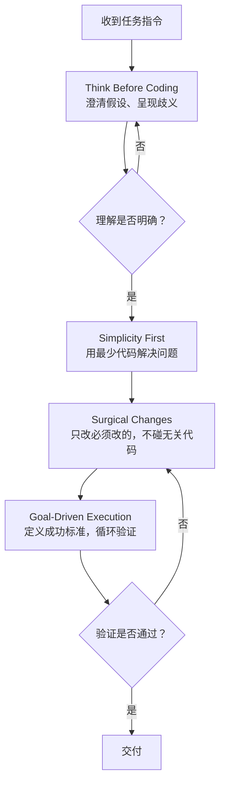

# Andrej Karpathy Skills：Claude Code 进化指南

2026 年 1 月 26 日，Andrej Karpathy 在 X 上发帖，列举 LLM 写代码时的几类典型毛病：替你做错误假设还不检查、管理不好自己的困惑、酷爱过度工程、顺手改动它没真正理解的代码。帖子发出的第二天，开发者 forrestchang（X 账号 @jiayuan_jy）把针对性的行为规则整理成一份 CLAUDE.md 传上 GitHub。这个仓库后来迁到 multica-ai 组织名下，到 2026 年 9 月已经积累超过 21 万 stars——社区用 star 数投了票：这些毛病确实普遍，这份规则确实对症。

这套规则被统称为 **Andrej Karpathy Skills**，本质是一份可安装到 Claude Code 的行为约束文件，通过 Think Before Coding、Simplicity First、Surgical Changes、Goal-Driven Execution 四条原则约束 LLM 的编码行为。它把"优秀工程师的思考纪律"翻译成了 LLM 可执行的指令。

本文先拆解四类行为缺失与四条原则的对应关系，再给出安装配置、任务流案例、团队推广路径和采用建议。

## 学习目标

读完本文后你应当能够：

1. 说清 LLM 在真实编程场景下的四类典型行为缺失
2. 解释四条原则各自对抗哪些行为缺失，以及它们之间的层次关系
3. 描述一个完整任务如何依次流过 Think Before Coding、Simplicity First、Surgical Changes、Goal-Driven Execution 四层约束
4. 在团队中制定 Andrej Karpathy Skills 的推广路径
5. 判断什么场景下应该跳过完整流程，直接用简化模式

## 目录

- [总览：四类缺失与四条原则的对应关系](#总览四类缺失与四条原则的对应关系)
- [Karpathy 的诊断：四类行为缺失](#karpathy-的诊断四类行为缺失)
- [四大原则详解](#四大原则详解)
- [任务流案例：一个完整任务如何流过四大原则](#任务流案例一个完整任务如何流过四大原则)
- [安装与配置](#安装与配置)
- [真实案例：安装前后的行为对比](#真实案例安装前后的行为对比)
- [与项目规则及其他 Skills 的关系](#与项目规则及其他-skills-的关系)
- [团队推广路径](#团队推广路径)
- [提示词改造：从指令到目标](#提示词改造从指令到目标)
- [FAQ](#faq)
- [采用建议](#采用建议)
- [自测题](#自测题)
- [资料口径说明](#资料口径说明)
- [进阶路径](#进阶路径)

> 说明：本文引用的 Karpathy 原话来自其 2026 年 1 月 26 日的 X 帖子（仓库 README 附有原文链接）；原则条文引用自仓库 CLAUDE.md，引用块标注了出处。文中"安装前/后"对比案例为教学示意，仓库 EXAMPLES.md 提供了带真实代码的对照案例。

## 总览：四类缺失与四条原则的对应关系

Karpathy 诊断的是 LLM 在真实编程场景下的决策模式。LLM 缺少优秀工程师的思考纪律——澄清需求、控制范围、验证结果。下表把行为缺失与四条原则一一对应：

| 行为缺失 | 典型表现 | 对抗原则 | 关键指令 |
|---------|---------|---------|---------|
| 盲目假设 | 模糊需求下默默猜测并一路执行 | Think Before Coding | 声明假设、呈现歧义、必要时拒绝执行 |
| 隐藏困惑 | 遇到矛盾不指出，悄悄选一个方案 | Think Before Coding | 不确定就问，有歧义就呈现 |
| 过度工程 | 100 行能解决写成 1000 多行，套上策略模式 | Simplicity First | 最少代码，零投机性设计 |
| 副作用盲区 | 顺手"优化"无关模块，引入回归 | Surgical Changes | 只改必须改的，只清理自己造成的垃圾 |
| 模糊交付 | 加个 `if` 就收工，不验证边界 | Goal-Driven Execution | 定义成功标准，循环直到验证通过 |

前四行对应 Karpathy 帖子里的三段观察（第一段同时点名了盲目假设和隐藏困惑两个毛病）；最后一行"模糊交付"不是他的诊断，而是 Goal-Driven Execution 要解决的问题——他对这条原则的原话是"LLM 极擅长朝明确目标循环迭代，别告诉它做什么，给它成功标准，然后看它跑"。

四条原则在工作流中形成层次：Think Before Coding 是入口哨兵，Simplicity First 和 Surgical Changes 是执行中的双轨约束（前者控制产出量，后者控制影响范围），Goal-Driven Execution 是出口检验。下图展示它们的协作关系：


```mermaid
flowchart TD
 A["收到任务指令"] --> B["Think Before Coding<br/>澄清假设、呈现歧义"]
 B --> C{"理解是否明确？"}
 C -->|否| B
 C -->|是| D["Simplicity First<br/>用最少代码解决问题"]
 D --> E["Surgical Changes<br/>只改必须改的，不碰无关代码"]
 E --> F["Goal-Driven Execution<br/>定义成功标准，循环验证"]
 F --> G{"验证是否通过？"}
 G -->|否| E
 G -->|是| H["交付"]
```

## Karpathy 的诊断：四类行为缺失

### 盲目假设

LLM 看到模糊需求时的第一反应是填补，不主动澄清。它默默猜测你的意图，然后沿着猜测一路执行。猜对了万事大吉，猜错了一整个下午都在调试一个基础逻辑就有问题的实现。

Karpathy 的原话：*"The models make wrong assumptions on your behalf and just run along with them without checking."*

真实场景：你让 Claude Code "给用户表加个软删除功能"。它没问你软删除字段叫什么（`deleted_at` 还是 `is_deleted`？），没问你已有的查询要不要自动过滤，直接创建了 migration、改了 model、加了 trait——用的命名和你团队规范恰好相反。

### 隐藏困惑

LLM 不理解的时候，它不说。

*"They don't manage their confusion, don't seek clarifications, don't surface inconsistencies, don't present tradeoffs, don't push back when they should."*

它遇到矛盾不指出，发现两个依赖版本冲突不提醒，碰到不可能同时满足的需求就悄悄选一个。在人类工程师的协作中，"我不确定"是最有价值的信号之一。LLM 把这个信号掐掉了。

### 过度工程

*"They really like to overcomplicate code and APIs, bloat abstractions, don't clean up dead code... implement a bloated construction over 1000 lines when 100 would do."*

100 行能解决的问题写成 1000 多行，单次调用的逻辑套上策略模式，两个字段的数据结构背上完整的 builder pattern。它还会用"这样更灵活"、"为将来扩展考虑"来辩护——这些从来不是你要求的设计。

LLM 倾向过度工程的根源在于训练数据中大量代码库本身就带有抽象层，模型把"看起来像生产代码"等同于"正确代码"。Simplicity First 正是对抗这种倾向。

### 副作用盲区

*"They still sometimes change/remove comments and code they don't sufficiently understand as side effects, even if orthogonal to the task."*

你在改支付模块的退款逻辑，LLM 顺便"优化"了日志模块的 error handling 风格。它是出于好意——甚至那个风格确实更现代——但它没有意识到这两个模块的耦合点在哪里。线上回归就是这么来的。

## 四大原则详解

下面每段引用都是仓库 CLAUDE.md 的原文——也就是你安装之后真正生效的条文。

### Think Before Coding

对抗盲目假设和隐藏困惑。

```markdown
## 1. Think Before Coding

**Don't assume. Don't hide confusion. Surface tradeoffs.**

Before implementing:
- State your assumptions explicitly. If uncertain, ask.
- If multiple interpretations exist, present them - don't pick silently.
- If a simpler approach exists, say so. Push back when warranted.
- If something is unclear, stop. Name what's confusing. Ask.
```

最后一条是反直觉的。我们给 AI 下指令时默认期待它"无论如何都要产出结果"，这条规则明确告诉它：不产出比瞎产出更有价值。值得注意的是第一条条文用的是 "State your assumptions"——假设是你替用户做的，所以要用你的名义承认，而不是藏在"需求分析"里。

### Simplicity First

对抗过度工程。

```markdown
## 2. Simplicity First

**Minimum code that solves the problem. Nothing speculative.**

- No features beyond what was asked.
- No abstractions for single-use code.
- No "flexibility" or "configurability" that wasn't requested.
- No error handling for impossible scenarios.
- If you write 200 lines and it could be 50, rewrite it.

Ask yourself: "Would a senior engineer say this is overcomplicated?" If yes, simplify.
```

"No abstractions for single-use code" 这一条最关键。LLM 有一个顽固的倾向——把"代码复用"等同于"抽象"。它不理解有时候重复比抽象更清晰。一个 30 行的逻辑被提取成一个 15 行的函数加上 5 个参数和一段 docstring——净损失。单次使用的代码不需要抽象。

结尾的自检问句给出了一个可操作的判断标准：一个资深工程师会不会说这段代码过度复杂？会，就简化。Karpathy 帖子里"100 行写成 1000 多行"是病症，这条"200 行能压到 50 行就重写"是处方——两个数字来自两处，别混为一谈。

### Surgical Changes

对抗副作用盲区。

```markdown
## 3. Surgical Changes

**Touch only what you must. Clean up only your own mess.**

When editing existing code:
- Don't "improve" adjacent code, comments, or formatting.
- Don't refactor things that aren't broken.
- Match existing style, even if you'd do it differently.
- If you notice unrelated dead code, mention it - don't delete it.

When your changes create orphans:
- Remove imports/variables/functions that YOUR changes made unused.
- Don't remove pre-existing dead code unless asked.

The test: Every changed line should trace directly to the user's request.
```

这条原则要求 LLM 对自己产生的变更做三级过滤——请求的改动、你改动引发的必然连带、以及你觉得顺眼于是顺便改的——把第三类全部删掉。收尾那句 "The test" 是整份文件里最锋利的一行：每一行改动都应该能直接追溯到用户的请求。追溯不了，就不该改。

"Match existing style, even if you'd do it differently" 要求 LLM 压抑自己的审美偏好——这恰恰是 LLM 最不擅长的事。你项目用的是 snake_case，它想改成 camelCase——不行。你习惯把类型定义放在文件顶部，它想挪到末尾——不行。

### Goal-Driven Execution

这是整套体系的核心假设，也是四条原则中最反直觉的一条。

*"LLMs are exceptionally good at looping until they meet specific goals... Don't tell it what to do, give it success criteria and watch it go."*

传统的人机交互模式是"指令 → 执行 → 交付"。Karpathy 提出的模式是"目标 → 循环验证 → 达标交付"。告诉 AI "添加输入校验"，LLM 可能加个 `if` 就收工；换成"为非法输入编写测试，然后让测试通过"，它要经历写测试 → 跑测试 → 发现边界遗漏 → 补充逻辑 → 重新测试 → 通过的完整闭环。

```markdown
## 4. Goal-Driven Execution

**Define success criteria. Loop until verified.**

Transform tasks into verifiable goals:
- "Add validation" → "Write tests for invalid inputs, then make them pass"
- "Fix the bug" → "Write a test that reproduces it, then make it pass"
- "Refactor X" → "Ensure tests pass before and after"

For multi-step tasks, state a brief plan:
1. [Step] → verify: [check]
2. [Step] → verify: [check]
3. [Step] → verify: [check]
```

CLAUDE.md 在这一节末尾补了一句关键判断：强成功标准让 LLM 能独立循环，弱标准（"让它能跑"）会逼着用户反复澄清。多步任务的 plan 模板把验证点直接写进步骤里——每做一步，验一步。

任务转换范式（前三行是 CLAUDE.md 原文，第四行是扩展示例）：

| 不要这样说 | 要这样说 |
|-----------|---------|
| "添加校验逻辑" | "为非法输入写测试，然后让测试通过" |
| "修这个 bug" | "写一个能重现 bug 的测试，然后让测试通过" |
| "重构 X 模块" | "确保重构前后测试全部通过" |
| "实现用户登录" | "实现登录功能，成功标准：传入正确凭证返回 token，传入错误凭证返回 401，连续 5 次失败锁定账户" |

## 任务流案例：一个完整任务如何流过四大原则

下面通过一个场景展示四条原则如何依次生效。

**任务**：「给订单查询接口加上分页功能」

**Step 1 - Think Before Coding（入口哨兵）**

Claude Code 收到指令后，先声明假设和歧义：

> "在开始实现前需要确认：1) 现有接口是 REST 还是 GraphQL？2) 分页方式是 offset-based（`?page=1&size=20`）还是 cursor-based（`?after=cursor`）？3) 数据库是 MySQL 还是 PostgreSQL？不同数据库的分页性能差异较大。4) 是否需要返回总数？计算 COUNT 在大表上可能很慢。"

**Step 2 - Simplicity First（控制产出量）**

澄清后（offset-based、需要总数、MySQL），Claude Code 选择最简实现：在现有 repository 方法上加 `page` 和 `size` 参数，用 `LIMIT/OFFSET`，不引入分页抽象基类，不为"将来可能切换 cursor-based"预留接口。

**Step 3 - Surgical Changes（控制影响范围）**

只改 controller、service、repository 三层的相关方法。不重命名现有变量，不调整 import 顺序，不顺手优化查询性能。如果发现 `order/utils.py` 中有未使用的 import，提示用户但不删除。

**Step 4 - Goal-Driven Execution（出口检验）**

定义成功标准：
- 传入 `page=1, size=20` 返回前 20 条记录
- 传入 `page=2, size=20` 返回第 21-40 条记录
- 返回体包含 `total` 字段
- 超出范围的 `page` 返回空数组，不报错
- 现有所有测试通过

Claude Code 写测试 → 跑测试 → 修复 → 再跑 → 通过，循环直到所有标准满足。

## 安装与配置

仓库地址是 [multica-ai/andrej-karpathy-skills](https://github.com/multica-ai/andrej-karpathy-skills)（创建时的路径 forrestchang/andrej-karpathy-skills 仍可通过 GitHub 重定向访问），MIT 协议，核心就是一份 CLAUDE.md。装法有两种。

### 插件安装（推荐）

一次性配置，全局生效。以下命令来自仓库 README，插件元数据由仓库内 `.claude-plugin/marketplace.json` 声明：

```
/plugin marketplace add forrestchang/andrej-karpathy-skills
/plugin install andrej-karpathy-skills@karpathy-skills
```

### CLAUDE.md 手动配置

适合需要项目特定规则或不想使用插件的场景。新项目直接下载：

```bash
curl -o CLAUDE.md https://raw.githubusercontent.com/multica-ai/andrej-karpathy-skills/main/CLAUDE.md
```

已有 CLAUDE.md 则追加——CLAUDE.md 开头一句话表明它就是为合并设计的："Merge with project-specific instructions as needed"：

```bash
echo "" >> CLAUDE.md
curl https://raw.githubusercontent.com/multica-ai/andrej-karpathy-skills/main/CLAUDE.md >> CLAUDE.md
```

### Cursor 用户

同一个仓库附带了 Cursor 规则文件 `.cursor/rules/karpathy-guidelines.mdc`，仓库里的 CURSOR.md 说明了如何在 Cursor 中启用，以及它与 Claude Code 插件的关系。两个编辑器可以用同一套规则。

### 项目级定制

在 CLAUDE.md 中追加项目特定规则，与 Karpathy Skills 协同工作：

```markdown
Project-Specific Guidelines
- Use TypeScript strict mode
- All API endpoints must have tests
- Follow the existing error handling patterns in `src/utils/errors.ts`
- No console.log in production code
```

### 如何确认生效

装完之后别急着交付任务，仓库 README 给了四条判据，符合得越多说明规则在起作用：

- **diff 里不必要的改动变少**——只出现请求过的变更
- **因过度复杂导致的重写变少**——代码第一次就写得简单
- **澄清问题出现在实现之前**——而不是搞砸之后
- **PR 干净、最小**——没有顺手重构和"顺手改进"

反向验证也简单：故意给一条模糊指令（比如"把这个接口弄快一点"），看它是先问"快指的是响应时间还是吞吐量"，还是直接开始加缓存。

## 真实案例：安装前后的行为对比

先给一个仓库 EXAMPLES.md 自带的真实案例，再给几个示意场景。

### 仓库真实案例：过度抽象

EXAMPLES.md 里有一组带完整代码的对照：任务只要求"写一个计算折扣的函数"，未加约束的 LLM 产出了 `DiscountStrategy` 抽象基类、`PercentageDiscount` 和 `FixedDiscount` 两个子类、`DiscountConfig` 数据类、`DiscountCalculator` 门面类——用一次折扣计算背上整套策略模式。EXAMPLES.md 给出的正确形态是几行以内的直接计算。这个案例对应 Simplicity First 的 "No abstractions for single-use code"，读者可以直接到仓库 [EXAMPLES.md](https://github.com/multica-ai/andrej-karpathy-skills/blob/main/EXAMPLES.md) 看完整代码。

### 以下为示意场景

下面的对比基于 CLAUDE.md 规则推演的典型行为差异，用于教学，行数与百分比不代表通用基准。

### 案例一：模糊需求处理

**任务**：「给这个 API 加上权限校验」

**安装前**：
- 直接假设你用的是 RBAC 模型，创建了 role、permission、role_permission 三张表
- 在中间件里硬编码了一个 admin 角色检查
- 没有问"现有认证体系是什么"、"哪些接口需要权限"、"权限粒度到接口还是到数据行"
- 产出约 300 行代码，其中约 200 行是你根本不需要的表结构和迁移

**安装后**：

> "我注意到你提到'权限校验'，但在开始实现前需要确认几个前提：1) 现有认证体系是 JWT、Session 还是 OAuth？2) 权限粒度是接口级（这个接口管理员可调）还是数据级（管理员只能看自己部门的）？3) 是否有现成的权限中间件可以复用？在等待你的澄清期间我不会开始编码。"

- 零代码产出，三个精准问题
- 澄清后只改了需要的中间件注册逻辑，新增约 15 行

### 案例二：过度工程抑制

**任务**：「把配置文件从 JSON 迁移到 YAML」

**安装前**：
- 创建了 `ConfigLoader` 抽象基类、`JSONConfigLoader`、`YAMLConfigLoader` 两个实现类
- 加了工厂模式 `ConfigLoaderFactory`
- 写了验证器 `ConfigSchemaValidator` 和迁移脚本 `MigrationRunner`
- 还加了一个 `--rollback` 参数
- 总计约 450 行，6 个新文件

**安装后**：
- 替换 `json.load` 为 `yaml.safe_load`
- 更新文件读取路径
- 改动 3 个文件，共约 12 行代码

### 案例三：副作用控制

**任务**：「修复订单金额计算中折扣小数点精度丢失的 bug」

**安装前**：
- 修了精度问题（`Decimal` 替换 `float`）
- 顺便把订单模块的 `print()` 调试语句删了
- 顺手把 `if amount > 0` 改成了 `if amount is not None and amount > 0`
- 把 import 块重新按字母排序了
- Diff 涉及 8 个文件，其中 5 个与精度无关

**安装后**：
- 修了精度问题
- 移除了本次改动造成的未使用 import（从 `typing` 导入的 `List` 不再需要）
- Diff 涉及 2 个文件
- 附带一条提示：「我注意到 `order/utils.py` 中有几处 `print()` 调试语句，需要我单独清理吗？」

### 案例四：目标驱动执行

**任务**：「重构用户模块，提高可测试性」

**安装前**：
- 重写了整个 `UserService` 类
- 把所有 private 方法改成了 public（"方便测试"）
- 加了依赖注入容器
- 原有约 40 个测试中约 17 个失败——因为方法签名全变了
- 回复："测试需要更新以适配新的 API，是否继续？"

**安装后**：

> "在开始重构前，我定义以下成功标准：1) 所有现有测试保持通过；2) 每个公开方法的代码路径至少有一个测试覆盖；3) 不改变任何外部接口的签名或行为。重构将以可逆的小步长进行，每步后运行完整测试套件。"

- 逐步提取依赖，每步后验证
- 增加约 12 个新测试，原有测试全绿
- 零接口变更

## 与项目规则及其他 Skills 的关系

CLAUDE.md 的定位是行为约束层，它生来就要和项目规则合并使用——文件开头写明 "Merge with project-specific instructions as needed"。分工是：Karpathy Skills 管"怎么干活"，项目规则管"在这个项目里什么算干对了"。上文"项目级定制"一节就是标准的合并方式。

往上叠一层，还有领域任务型的 Skills 仓库。两个可核实的例子：

| 仓库 | 定位 | 与 Karpathy Skills 的关系 |
|------|------|-------------|
| [mattpocock/skills](https://github.com/mattpocock/skills) | "Skills for Real Engineers"，Matt Pocock 从自己 `.agents` 目录里拿出来的工程技能合集 | Karpathy Skills 是行为纪律，这些是具体任务能力，一层约束一层执行 |
| [Astro-Han/karpathy-llm-wiki](https://github.com/Astro-Han/karpathy-llm-wiki) | Agent Skills 兼容的 LLM 知识库，从原始来源和引用构建 Karpathy 风格的知识库 | 本规则约束编码行为，wiki 约束知识产出，互不覆盖 |

组合使用示例：

```
"用 Simplicity First 的方式实现这个 CRUD API，然后用 wiki skill 把接口文档写入知识库"
```

Karpathy Skills 确保产出的代码干净，wiki skill 确保这份干净的设计被记录下来供团队检索。

## 团队推广路径

个人使用 Karpathy Skills 有效果，但团队级收益更大——当所有人的 AI 工具使用同一套行为约束时，代码审查者不再需要区分"这是 AI 的过度工程"还是"这是同事的设计决策"。

### 推广节奏

**第一步：演示痛点。** 找一段上个月的代码审查记录，挑出 AI 生成的典型过度工程案例，放进团队群里。大多数人看到那个"两个字段的数据结构用了完整 builder pattern"的例子后，不需要你再解释什么是过度工程。

**第二步：解释原则，不宣读规则。** 用一两个本团队的真实案例说明每条原则解决的问题。用团队自己的代码做例子，原则会自己说话。

**第三步：统一安装。** 用插件模式（`/plugin install`），减少配置摩擦。有项目特定需求的团队额外配置项目级 CLAUDE.md。

**第四步：代码审查纳入规则。** 在 Review 模板中增加一条检查：「AI 生成的代码是否违反 Karpathy 原则？」大部分违反规则的代码人工审查时本来就会打回，现在只是把原因标注得更具体。

**第五步：允许例外，但要求理由。** 团队的 CLAUDE.md 可以覆盖或补充规则，但覆盖的理由必须写下来。这个"写下理由"的要求本身就会过滤掉大部分不必要的覆盖。

### 常见阻力的处理

**「这会拖慢开发速度。」**

仓库 README 的 Tradeoff Note 不回避这个代价："These guidelines bias toward caution over speed." 紧接着是它的自我辩护："The goal is reducing costly mistakes on non-trivial work, not slowing down simple tasks." 需要区分两种"快"——产出代码的速度，和交付功能的速度。默认 Claude Code 产出代码更快，但返工率更高。

**「我的需求都很简单，不需要这么重的流程。」**

同一段 Tradeoff Note 给了豁免："For trivial tasks (simple typo fixes, obvious one-liners), use judgment — not every change needs the full rigor." Skills 是针对非平凡任务的约束，琐碎任务凭判断跳过即可。CLAUDE.md 文件开头也写了同样的 "For trivial tasks, use judgment"。

**「规则太死板了，我需要灵活性。」**

把规则视为默认值，可以覆盖。CLAUDE.md 允许项目级覆盖，覆盖时写上理由即可。意识到默认行为的存在——很多时候"灵活性"只是"懒得想"的另一种说法。

## 提示词改造：从指令到目标

与 Karpathy Skills 配套使用的最有效技巧是改造提示词结构——把"步骤指令"转化为"成功标准"。这会让 Goal-Driven Execution 原则自动生效：

| 原始指令 | 改造后 |
|---------|--------|
| "帮我写一个用户注册 API" | "用 TDD 方式实现用户注册：先写测试覆盖正常注册、重复邮箱、弱密码三个场景，然后实现代码使测试通过。成功标准：所有测试绿、密码 bcrypt 加密、响应不包含密码字段。" |
| "修复这个搜索 bug" | "先写一个测试用例重现搜索结果为空时的 N+1 查询问题，然后修复代码使测试通过。额外要求：修复后的查询次数在 EXPLAIN 中不超过 3 次。" |
| "重构这个支付模块" | "在不改变任何外部接口的前提下提升支付模块的内聚性。成功标准：所有现有测试通过、`PaymentService` 的公开方法数不增加、循环复杂度下降。" |

## FAQ

**Q：这些规则会压制 LLM 的创造力吗？**

它们压制的是没有方向的"创作冲动"——LLM 在没有充分理解需求时的自发填充行为。好的建筑设计是在承重墙和预算框架内的最优解，Karpathy Skills 就是给 LLM 划定承重墙。真正的创造力需要约束才能聚焦。

**Q：Simplicity First 和必要的架构设计冲突时怎么办？**

Simplicity First 反对的是投机性设计（"将来可能会用到"）。判断标准：如果没有这个抽象，当前需求能不能被满足？如果能，它就是投机性的。今天用一个单文件脚本就够了，就不要创建微服务骨架。六个月后需求真的变了，那时再做架构演进——届时你拥有更多信息，做出的决策质量更高。

**Q：已经在用的项目怎么平滑迁移？**

规则的生效是渐进的——下一次 Claude Code 对话开始时，CLAUDE.md 被读取，行为从那一刻起调整。建议先在非关键分支上试用一周，观察 diff 模式的变化，确认团队认可后再推广到主干开发。

**Q：这些规则对非英文指令也有效吗？**

四大原则是语言无关的行为约束——"收到模糊指令时主动澄清"这件事不依赖指令语言。但 CLAUDE.md 原文是英文写的，如果团队用中文和 Claude Code 对话，建议把规则翻译成中文放入项目 CLAUDE.md，确保行为约束和日常指令在同一语境下。仓库提供了中文 README（README.zh.md）可供参考，但注意 CLAUDE.md 本身只有英文版。

**Q：Goal-Driven Execution 中的"成功标准"应该写到什么粒度？**

可验证的最小粒度。"代码质量高"没法验证；"所有测试通过且 eslint 零警告"能验证。"用户体验好"没法验证；"页面加载时间小于 200ms 且 Lighthouse Performance 评分 > 90"能验证。原则：如果你不能在一个终端命令里自动化验证这个标准，它就太模糊了。

**Q：多条原则冲突时优先级怎么排？**

实际运行中四个原则几乎不会冲突——它们在同一个工作流的不同阶段起作用。Think Before Coding 是入口，判断任务是否足够清晰以进入执行。如果入口判断本身就过不去——不执行。Simplicity First 和 Surgical Changes 是执行中的双轨约束。Goal-Driven Execution 是出口。如果要放弃一条原则，先放弃效率（Simplicity），保留安全（Surgical）和正确性（Think、Goal-Driven）。

**Q：小团队（2-3 人）和大团队（50+ 人）使用效果有差别吗？**

有，而且方向和直觉相反：小团队收益更大。大团队通常已有成熟的代码审查流程和规范约束，AI 产出的代码在被合入前经过多人把关。小团队往往是同一个人写代码和审代码——AI 产出的问题更容易逃逸。Karpathy Skills 在小团队中相当于一个免费的自动化代码审查层。

## 采用建议

Andrej Karpathy Skills 把一位世界级 AI 研究者对 LLM 行为的观察，翻译成了一组可执行的约束规则。它教 LLM 做一个更好的协作者——写更好的代码只是附带效果。

四条原则用一个表格收束：

| 原则 | 对抗的行为 | 关键指令 |
|------|-----------|---------|
| Think Before Coding | 盲目假设、隐藏困惑 | 不确定就问，有歧义就呈现，该拒绝就拒绝 |
| Simplicity First | 过度工程 | 最少代码，零投机 |
| Surgical Changes | 副作用盲区 | 只改必须改的，只清理自己造成的垃圾 |
| Goal-Driven Execution | 模糊交付 | 定义成功标准，循环直到验证通过 |

### 采用顺序

1. **个人试用一周**：在非关键分支上安装 Skills，用上文"如何确认生效"的四条判据观察 diff 模式变化，记录哪些原则触发了行为调整。
2. **改造提示词**：把高频任务的"步骤指令"改写为"成功标准"，让 Goal-Driven Execution 自动生效。
3. **小范围团队试点**：2-3 人的小团队先统一安装，运行两周后评估返工率和代码审查通过率的变化。
4. **全团队推广**：在 Review 模板中纳入 Karpathy 原则检查，允许项目级覆盖但要求写理由。

### 适用边界

- **适合**：涉及业务逻辑、数据模型、API 契约的非平凡任务。
- **可跳过**：typo 修复、单行变更、明显的 one-liner——README 的 Tradeoff Note 明确这些任务用判断即可。
- **不适合**：探索性原型、hackathon 项目——这些场景需要快速产出，Skills 的约束会拖慢节奏。

这套 Skills 在回答一个核心问题：在人类和 AI 协作的编程环境中，谁是主导者？Karpathy 的回答是：给出目标的人类。AI 是目标驱动的循环引擎，人类是目标定义者。约束让 AI 把迭代花在真正需要的地方。

---

## 自测题

用以下 5 题检验对四条原则的理解。答案在每题下方。

**Q1**：Think Before Coding 中最后一条（"If something is unclear, stop. Name what's confusing. Ask."）为什么反直觉？

> **答案**：给 AI 下指令时，人们默认期待它无论如何都产出结果。这条规则把优先级反过来：不确定时停下来提问，比硬着头皮产出一个可能错误的实现更有价值。

**Q2**：Simplicity First 的 "No abstractions for single-use code" 为什么关键？

> **答案**：它切断了 LLM"代码复用 = 抽象"的等式。单次使用的逻辑被抽成带参数和 docstring 的函数，往往是净损失——重复有时比抽象更清晰。

**Q3**：Surgical Changes 的检验标准是什么？为什么它要求 LLM 做三级过滤？

> **答案**：标准是 "Every changed line should trace directly to the user's request"。三级过滤指把变更分成请求的改动、必然连带、顺便改的三类，只保留前两类——第三类正是线上回归的常见来源。

**Q4**：把"步骤指令"转化为"成功标准"为什么更有效？

> **答案**：成功标准让 LLM 能独立循环验证（写测试 → 跑 → 修 → 再跑），而弱标准（"让它能跑"）会逼用户反复澄清。CLAUDE.md 原文点明了这个差别：强标准支撑自主循环。

**Q5**：多条原则冲突时，推荐的取舍顺序是什么？

> **答案**：四原则在工作流不同阶段起作用，很少真冲突。真要取舍：先放弃效率（Simplicity），保留安全（Surgical）和正确性（Think、Goal-Driven）。

## 资料口径说明

1. **信息来源与时效性**：本文基于 Andrej Karpathy 2026 年 1 月 26 日的 X 帖子（仓库 README 附原文链接），以及 multica-ai/andrej-karpathy-skills 仓库（创建于 2026-01-27，原路径 forrestchang/andrej-karpathy-skills，2026-04-20 最后推送）的 CLAUDE.md、README、EXAMPLES.md。stars/forks 数据为 2026-09-21 经 GitHub API 核实的数值（214k+ stars，21.6k+ forks），会随时间变化。
2. **引用口径**：文中"四大原则详解"的引用块为 CLAUDE.md 原文；"任务转换范式"表格前三行为 CLAUDE.md 原文、第四行为扩展示例；"如何确认生效"四条判据译自 README "How to Know It's Working"；Tradeoff 引语出自 README "Tradeoff Note"，作者为仓库作者而非 Karpathy 本人。
3. **案例口径**：「真实案例」一节中，过度抽象案例来自仓库 EXAMPLES.md；四个安装前后对比为基于规则推演的教学示意，非真实基准测试，行数与百分比不代表通用水平。
4. **判断与建议的边界**：本文给出的团队推广路径、提示词改造建议、适用边界等判断，基于对规则文本和 LLM 行为模式的分析，不代表 Karpathy 本人、仓库作者或 Anthropic 官方立场。
5. **未覆盖的内容**：本文未深入覆盖 Skills 与其他 Claude Code 配置（CLAUDE.local.md、settings.json）的协同、多 Skills 组合的冲突处理、团队级 Skills 版本管理最佳实践；CURSOR.md 的详细配置步骤请直接阅读仓库文档。
6. **术语使用说明**：LLM（Large Language Model）、Skills、CLAUDE.md、Think Before Coding、Simplicity First、Surgical Changes、Goal-Driven Execution 等专有名词保留英文不翻译。
7. **更新记录**：本文初稿基于 2026-04-08 的仓库版本，2026-09-21 对照仓库最新状态（迁移至 multica-ai、EXAMPLES.md、Cursor 支持）核实并修订。若 Karpathy 或仓库作者后续更新原则内容，将同步更新对应章节。

## 进阶路径

读完本文后，按以下顺序深入：

1. **读 Karpathy 原帖**：从仓库 README 的链接进入那条 2026 年 1 月的 X 帖子，读原文中对 LLM 编程毛病的完整表述——中文转述替代不了原话的分量。
2. **读 EXAMPLES.md**：仓库自带的真实代码对照案例，每条原则都有"LLM 常见错误写法 → 正确做法"的完整代码，比本文的示意场景更具体。
3. **读 CLAUDE.md 源文件**：全文不到百行，十分钟读完。你会注意到结尾有一段 "These guidelines are working if"——那是最诚实的自检清单。
4. **组合其他 Skills**：尝试把 Karpathy Skills 与 mattpocock/skills 的任务型技能、karpathy-llm-wiki 的知识库组合使用，观察"行为约束 + 任务能力"分层的协同效果。
5. **贡献社区**：如果团队沉淀出了有效的补充规则，可以按 README 的方式提交 PR 到 multica-ai/andrej-karpathy-skills 仓库。

---

*🦞 每日 08:00 自动更新*
