# jellium-desktop：Jellyfin 的非官方桌面客户端，CEF + mpv 双引擎

> Jellium Desktop 解决的不是"Jellyfin 没有桌面客户端"——官方有 Qt 版。它解决的是另一件事：把网页端 UI 和一个真正接管播放的 mpv 内核拼在一起，让解码、字幕、HDR 都走系统原生栈，而不是浏览器 video 标签。
>
> 前置知识：用过 Jellyfin 服务器，了解 Chromium 嵌入和 mpv 是什么即可。读完你应能判断它和官方客户端该选谁，以及三平台构建产物各自怎么装。

## 这篇文章的判断

[andrewrabert/jellium-desktop](https://github.com/andrewrabert/jellium-desktop) 自称"非官方 Jellyfin 桌面客户端"，技术上用 CEF（Chromium Embedded Framework）承载 jellyfin 网页端、mpv 做播放内核。它值得注意的地方不在"又一个客户端"，而在两个选择：

- **UI 用 CEF 完整嵌入**，不是"原生控件 + WebView"的凑合方案，jellyfin 的网页界面开箱即用；
- **播放交给 mpv**，且 mpv 是播放状态的唯一权威源——快进、暂停、进度都由 mpv 报出来，网页端只是消费者。

这种"薄壳 + 深度播放"的组合，在自托管媒体客户端里并不多见。官方 `jellyfin/jellyfin-desktop`（Qt 6 + MpvQt）和 `jellyfin/jellyfin-media-player`（Qt WebEngine + libmpv）走的是另一条路线。所以这篇文章的重点，是把这个双引擎架构讲清楚，再告诉你它适合谁、什么时候不必用。

## 快速信息卡

> **GitHub 仓库**: [andrewrabert/jellium-desktop](https://github.com/andrewrabert/jellium-desktop)
>
> | 指标 | 数值 |
> |------|------|
> | ⭐ Stars | 约 1.8K |
> | 🍴 Forks | 139 |
> | 📜 License | GPL-2.0 |
> | 💻 主要语言 | Rust（占 89%） |
> | ⚙️ 内核 | CEF + mpv（fork） |
> | 📦 Release | 无正式发布，走 nightly.link |

数据截至 2026-09-03，通过 GitHub API 核实。

## 学习目标

读完本文应能：

- 说清 jellium-desktop 的 CEF + mpv 双引擎如何分工，为什么 mpv 是播放状态唯一权威源
- 区分它和官方 jellyfin-desktop / jellyfin-media-player 的实现路线差异
- 完成一次"下载对应平台产物 → 启动 → 配服务器 → 播放"的完整流程
- 判断自己的场景（Linux 用户、mpv 播放质量、跨平台一致性）是否值得从官方客户端切换过来

## 目录

- [这篇文章的判断](#这篇文章的判断)
- [系统地图：两个引擎的职责边界](#系统地图两个引擎的职责边界)
- [和官方客户端的关系](#和官方客户端的关系)
- [核心机制一：CEF 壳与多进程](#核心机制一cef-壳与多进程)
- [核心机制二：mpv 作为状态权威源](#核心机制二mpv-作为状态权威源)
- [一次播放请求如何穿过双引擎](#一次播放请求如何穿过双引擎)
- [安装与分发](#安装与分发)
- [构建与开发体验](#构建与开发体验)
- [适用边界与采用顺序](#适用边界与采用顺序)
- [常见问题排查](#常见问题排查)
- [自测题](#自测题)
- [练习](#练习)
- [进阶路径](#进阶路径)
- [资料口径说明](#资料口径说明)

## 系统地图：两个引擎的职责边界

先把整个系统拆成三层，记住哪层管什么，后面读机制才不会混。

| 层 | 模块 | 职责 | 技术选型 |
|------|------|------|----------|
| UI 层 | CEF 进程组 | 渲染 jellyfin-web，接收键盘 / 鼠标输入 | CEF 151（多进程：browser / renderer / GPU） |
| 播放层 | mpv | 视频 / 音频解码、渲染、字幕、HDR | mpv fork（third_party/mpv） |
| 桥接层 | IPC + 状态流 | 网页命令发给 mpv，mpv 状态回报给网页与系统媒体会话 | CefProcessMessage + mpv 属性观察 |
| 打包层 | 平台产物 | Linux / macOS / Windows 三平台分发 | AppImage / Flatpak / AUR / zip |

```mermaid
graph TB
    subgraph CEF[CEF 进程组]
        BP[browser 进程<br/>主应用 + CefBrowser]
        RP[renderer 进程<br/>V8/Blink]
        GP[GPU 进程]
    end
    subgraph MPV[mpv]
        MP[播放内核<br/>自有窗口 + GPU]
    end
    subgraph OS[系统集成]
        SESS[OS 媒体会话<br/>MPRIS / macOS]
    end
    RP -- "播放命令 (IPC)" --> MP
    MP -- "状态流 (属性观察)" --> RP
    MP -- "状态流" --> SESS
    BP -- "UI 纹理叠加" --> GP
```



读这张图的要点：命令走下行（网页 → mpv），状态走上行（mpv → 网页 / 系统会话）。mpv 在上游，网页和系统会话都只是消费者。

## 和官方客户端的关系

常有人把 jellium-desktop 定位成"官方没有桌面端时的替代"，但这个前提已经过时。Jellyfin 官方有两个桌面客户端：

| | jellyfin-desktop（官方） | jellyfin-media-player（官方） | jellium-desktop（非官方） |
|------|------|------|------|
| UI 承载 | Qt 6 WebEngine | Qt WebEngine | CEF（Chromium） |
| 播放内核 | MpvQt / libmpv | libmpv | mpv fork |
| 实现语言 | C++（Qt） | C++（Qt） | Rust |
| 更新节奏 | 有版本发布 | 有版本发布 | nightly（无正式 release） |
| 定位 | 官方主力桌面端 | 同窗口内嵌播放 | 薄壳 + 深度播放 |

一句话总结：**官方走 Qt，jellium 走 Chromium + mpv**。前者与 Jellyfin 生态绑定更深、发布更稳；后者用更薄的壳换来更贴近原生 Chromium 的渲染和 mpv 的完整播放能力，代价是没有正式版本、维护集中于 andrewrabert 一人。选型时先想清楚要"稳定跟随官方"还是"追求播放深度"。

## 核心机制一：CEF 壳与多进程

CEF 不是简单的"把网页塞进一个 WebView"。项目直接嵌入 Chromium 本身，走标准的多进程模型：

- **browser 进程**：主应用进程，持有 `CefBrowser`，负责窗口生命周期与进程编排；
- **renderer 进程**：跑 V8 / Blink，执行 jellyfin-web 的 JS；
- **GPU 进程**：负责合成。

三层之间用 `CefProcessMessage` 做 IPC。项目把 UI 渲染成一张 **overlay 纹理**，叠在视频层之上——这是"CEF + mpv 双引擎"能共存的关键：视频由 mpv 独占自己的窗口和 GPU 渲染，网页 UI 叠在上面，互不抢绘制权。

Linux 下视频层走 Wayland subsurface；macOS / Windows 各有独立平台 crate（`src/macos`、`src/windows`，Linux 下还有 X11 路径）。

## 核心机制二：mpv 作为状态权威源

这是全篇最值得记的一条设计约束：**mpv 是播放状态的唯一权威源**。

进度、倍速、暂停、seek 完成——所有这些状态都从 mpv 的属性观察向外广播，分别流向两处：

1. 网页 UI（jellyfin-web 的播放条、进度显示）；
2. OS 媒体会话（Linux 的 MPRIS、macOS 的媒体会话），让系统媒体键能控制播放。

网页端和系统会话只做"反映"，从不回写状态。这样做的好处是状态只有一份真相，不会出现"网页说播了、mpv 其实没播"的分裂。

实现上还有一个硬性约定：**不要在事件回调里调用同步 mpv API**（`mpv_get_property` 等），否则视频初始化时会死锁；要用属性观察或异步变体。这条写在项目自己的开发笔记里，是踩过坑之后沉淀的。

## 一次播放请求如何穿过双引擎

把上面的机制串成一个具体任务：你在 jellium-desktop 里点开一部电影。

1. **renderer 进程**里，jellyfin-web 的播放器发起请求，CEF 把"播放这个媒体项"打包成 `CefProcessMessage`，经 IPC 送到 browser 进程；
2. browser 进程把命令转给 **mpv**（注入的 native shim 覆盖了浏览器默认的媒体播放路径）；
3. mpv 拿到媒体 URL，用系统原生解码栈开始播放，视频渲染进它自己的窗口 / GPU 表面；
4. mpv 通过属性观察把 `position`、`duration`、`pause` 等状态流推给 renderer 进程和 OS 媒体会话；
5. 网页 UI 更新进度条，系统媒体键随时可用。

整个流程里，网页只负责"发起命令"和"显示状态"，**实际播放全程由 mpv 掌控**。这也是它比"浏览器看片"强的地方：HEVC、HDR、字幕这些不再依赖 Chromium 的 video 标签能力。

## 安装与分发

项目没有传统 release，下载全部指向 **nightly.link**——GitHub Actions 产物的代理服务，让不登录 GitHub 也能拿 nightly build。每个 main 分支的提交都会自动出产物。

| 平台 | 产物 |
|------|------|
| Linux x86_64 | AppImage（zip 内） |
| Linux aarch64 | AppImage（zip 内） |
| Linux 任意 | Flatpak（非 Flathub bundle） |
| Arch Linux | AUR `jellium-desktop-git` |
| macOS Apple Silicon | zip（arm64） |
| macOS Intel | zip（x86_64） |
| Windows x64 | zip |
| Windows arm64 | zip |

macOS 安装后需要移除 quarantine：

```bash
sudo xattr -cr /Applications/Jellium\ Desktop.app
```

AUR 用户直接 `yay -S jellium-desktop-git`。Windows 解压 zip 即可运行。

## 构建与开发体验

项目用 [just](https://github.com/casey/just) 而非 Makefile 作为命令运行器，recipe 按 OS 门控（`[macos]` / `[linux]` / `[windows]`），同一套命令三平台一致：

```makefile
# 一次性环境准备
just deps        # submodules + CEF 下载 + macOS brew 包

# 构建 / 运行
just build       # 构建并 stage 到 build/（macOS 生成 .app）
just run         # 带 debug 日志运行，日志写到 build/run.log
just run-mpv     # 直接跑内置 mpv CLI（仅调试 mpv）

# 测试 / 质量
just test        # 运行 workspace 测试
just lint        # fmt-check + clippy（-D warnings）
just strict-lint # lint + clippy pedantic/nursery

# 打包
just appimage    # [linux] AppImage
just flatpak     # [linux] Flatpak bundle
just dmg         # [macos] DMG
```

工程约束值得留意：clippy 开了 `-D warnings` 且禁用 `unwrap` / `expect` / `panic`，`strict-lint` 再叠 `pedantic` / `nursery`。对"错误处理必须显式"有要求的读者，这套门槛是加分项。

## 适用边界与采用顺序

**适合谁：**

- **Jellyfin 自托管、想要原生桌面体验**：不想在浏览器标签里看片，想要系统媒体键、独立窗口。
- **Linux 桌面用户**：AppImage / Flatpak / AUR 三种安装方式覆盖全。
- **追求播放深度的人**：mpv 内核对硬解、字幕、HDR 的掌控超过浏览器 video 标签。
- **想要跨平台一致的人**：macOS / Windows / Linux 同一客户端。

**不适合谁：**

- **要稳定正式版的用户**：项目没有 release，全是 nightly，`jellium-desktop-git` 直接跟踪 main 分支。
- **要商业级 SLA 的人**：无商业支持，问题只能走 GitHub Issues。
- **深度绑定官方生态的人**：官方 Qt 客户端发布更稳、跟进 Jellyfin 新特性更快。

**采用顺序建议：**

1. 官方客户端（jellyfin-desktop 或 jellyfin-media-player）先用起来，它最稳；
2. 如果遇到官方客户端的播放能力瓶颈（编码、HDR、字幕），再装 jellium-desktop 对比；
3. 确认 nightly 节奏可接受、播放提升明显，再切换到 jellium 作为主力；
4. 贡献代码前先跑 `just strict-lint`，保持环境干净。

## 常见问题排查

### Q1: 为什么官网说 macOS 装完要执行 `sudo xattr -cr`？
**A**: macOS 的 quarantine 属性会拦截未签名应用的首次运行。`xattr -cr` 递归清除该属性即可，属于 nightly 构建的常见处理。

### Q2: 没有正式 release，如何确定自己用的版本？
**A**: 项目当前 workspace 版本为 `0.1.0-dev`，无 tag。你在 nightly.link 拿到的产物对应 main 分支最近一次提交，属于滚动更新。

### Q3: 播放时网页 UI 和视频不同步怎么办？
**A**: 状态一律以 mpv 为准。先确认是否触发了"同步 API 死锁"陷阱（项目开发笔记明确禁止在事件回调里调同步 mpv API）；仍异常就去仓库 Issues 搜对应平台关键词。

### Q4: 和官方客户端能共存吗？
**A**: 能。两者配置文件与安装路径各自独立，可并行安装对比，不必二选一。

## 自测题

1. jellium-desktop 的 UI 渲染层和播放层分别由什么承担？为什么 UI 能叠在视频之上？
2. 为什么说 mpv 是"播放状态的唯一权威源"？如果网页端也回写状态，会引入什么问题？
3. 官方 jellyfin-desktop 和 jellium-desktop 在 UI 承载上最大的差异是什么？
4. 项目为什么没有正式 release？作为用户你如何评估这个风险？

## 练习

### 练习 1：完成一次完整播放链路

在任一平台下载对应产物，启动后配置你的 Jellyfin 服务器，验证"登录 → 浏览 → 播放"三条链路，并观察播放中系统媒体键（键盘媒体键 / MPRIS）能否控制进度。

**参考答案**：能顺利播放且系统媒体键生效，说明 CEF + mpv 状态流走通了；若媒体键无效，检查 OS 媒体会话集成是否被桌面环境拦截。

### 练习 2：对比官方客户端

分别安装 jellyfin-desktop 和 jellium-desktop，用同一个 4K HEVC 片源各播一遍，记录转码情况、硬解占用和字幕渲染差异。

**参考答案**：jellium 若在网页端播放器路径外直接接管播放，通常转码更少；具体差异取决于服务器转码策略与客户端解码能力。

### 练习 3：判断是否切换

列出你当前最依赖官方客户端的三个功能，再列出 jellium 的播放深度能否覆盖其中两个以上，据此决定是否切换。

**参考答案**：若你的痛点集中在播放质量（编码 / HDR / 字幕），且能接受 nightly 更新节奏，切换有充分理由；若痛点在于稳定发布或新特性跟进，留在官方更合理。

## 进阶路径

### 阶段一：理解双引擎架构（1 周）
- 目标：说清 CEF 多进程与 mpv 状态权威流的协作
- 行动：阅读 [CLAUDE.md](https://github.com/andrewrabert/jellium-desktop/blob/main/CLAUDE.md) 的 Architecture 与 mpv Integration 小节，对照 `src/jfn_cef`、`src/mpv` 源码
- 验收：能解释"命令下行、状态上行"为什么能避免状态分裂

### 阶段二：本地构建（2-4 周）
- 目标：在三平台之一完成从源码构建
- 行动：`just deps` 拉取 submodules 与 CEF，`just build`，`just run` 跑通
- 验收：本地构建产物可启动并播放

### 阶段三：深入 mpv 集成（1-3 个月）
- 目标：理解 libmpv 控制面与渲染面的分离
- 行动：`just run-mpv` 直接调试 mpv，观察属性观察流；读 `third_party/mpv` fork 与上游差异
- 验收：能定位播放状态流的中断点

### 阶段四：贡献（长期）
- 目标：为项目修 bug 或加平台能力
- 行动：先跑 `just strict-lint`，按开发笔记约束提交
- 验收：PR 通过 CI（fmt + clippy 严格门槛）

## 资料口径说明

1. **信息来源与时效性**：本文基于 `andrewrabert/jellium-desktop` 的 GitHub README、CLAUDE.md、justfile 与仓库元数据。Stars / Forks / License 等数据通过 GitHub API 于 2026-09-03 核实。

2. **技术细节验证**：架构描述（CEF 多进程、overlay 纹理、mpv 状态权威源、Wayland subsurface、同步 API 死锁约束）均来自仓库 CLAUDE.md 与源码目录结构。项目处于活跃开发状态，细节可能随提交变化。

3. **对比口径**：官方客户端信息（Qt 6 / Qt WebEngine / libmpv）来自 `jellyfin/jellyfin-desktop` 与 `jellyfin/jellyfin-media-player` 仓库 README 与 release 说明，截至 2026-09-03。

4. **判断与建议的边界**：本文的选型建议基于"稳定性 vs 播放深度"这一维度，不构成对两项目维护质量的评判；nightly 更新的稳定性风险由读者自行评估。

5. **未覆盖的内容**：本文未深入 jellyfin-web 与 mpv 之间 IPC 的协议细节、各平台 GPU 渲染管线的具体实现，也未评测实际播放性能，这些需要读者在本地验证。

6. **更新记录**：本文于 2026-07-20 撰写，2026-09-03 依据最新仓库信息修订（修正仓库标识与官方客户端现状，补充架构机制）。
