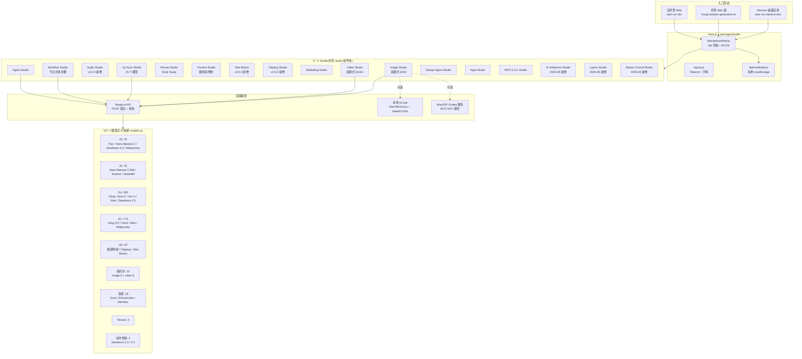
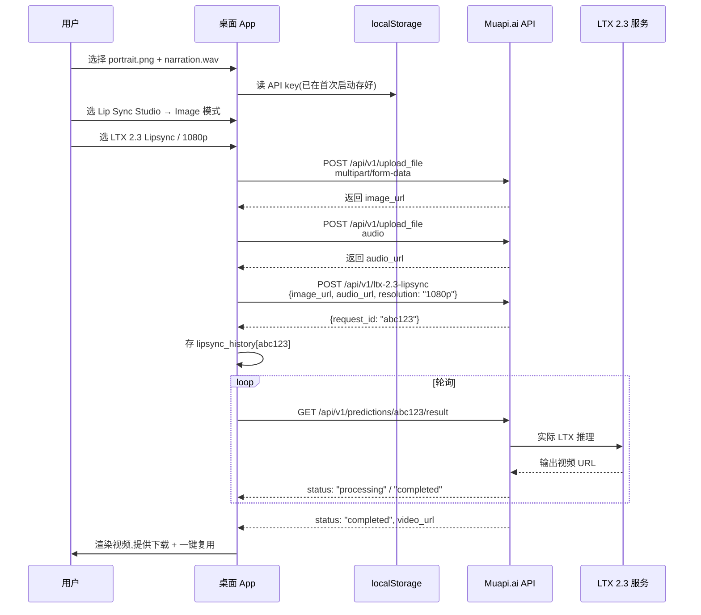

# Anil-matcha/Open-Generative-AI 指南

`Anil-matcha/Open-Generative-AI` 真正解决的不是「自研一个 AI 模型」,而是把当下碎片化的 400+ 商业/开源 AI 图像、视频、音频、唇同步模型,塞进同一个可自托管、无内容过滤、桌面/Web 双形态的开源工作室。截至 2026-09-26,仓库 29.2k stars、5.3k forks,MIT 协议,JavaScript/Next.js 实现,最新发布 v2.0.0(2026-05-23),此后 main 分支又前进 256 个提交——2023-05-09 创建三年多,它已经从「模型接入清单」长成「跨模型工作流编排器」,但核心吸引力始终没变:「把模型选择权和过滤权交回给用户」。

本文围绕这条主线展开:**这个仓库是一份「模型接入清单 + 跨模型工作流」,而不是一套新的推理引擎**。理解这一点,就能准确判断它适合放在工具链的哪一环。

## 一句话定位

- **仓库**:[Anil-matcha/Open-Generative-AI](https://github.com/Anil-matcha/Open-Generative-AI)
- **官方定位**:Unrestricted Open-source alternative to AI video platforms — Free AI image & video generation studio with 600+ models (Flux, Midjourney, Kling, Sora, Veo). No content filters. Self-hosted, MIT licensed(仓库 About 自述;README 正文口径是「400+ state-of-the-art models across 14 studios」,两处不一致,下文有拆解)
- **当前发布**:v2.0.0(2026-05-23,「Audio Studio、Vibe Motion、Clipping、Design Agent & more」),距 v1.0.11(2026-05-11)12 天;此后 v2.0.0 仍是最新 tag,但 main 已累积 256 个提交(截至 2026-09-26)
- **语言**:JavaScript(Next.js 14 Web 版 + Electron/Vite 桌面版)
- **License**:MIT
- **运行环境**:Node.js 18+(开发)/ Electron 桌面应用(打包后)/ 浏览器托管版(muapi.ai/open-generative-ai)
- **API 后端**:`Muapi.ai` 统一 API gateway(自托管 app 与官方托管版共用)

## 系统地图

整个应用是一套「桌面 + Web 共享同一份 React 组件库」的 monorepo,通过 Muapi.ai API gateway 调用第三方模型:


```mermaid
flowchart TB
    subgraph Entry["入口形态"]
        Electron[Electron 桌面应用<br/>npm run electron:dev]
        Web[托管 Web 版<br/>muapi.ai/open-generative-ai]
        SelfHost[自托管 Web<br/>npm run dev]
    end

    subgraph Frontend["Next.js + packages/studio"]
        Layout[layout.js<br/>Tailwind + 字体]
        Shell[StandaloneShell.js<br/>Tab 导航 + BYOK]
        KeyModal[ApiKeyModal.js<br/>本地 localStorage]
    end

    subgraph Studios["17 个 Studio(共享 studio 组件库)"]
        ImageStudio[Image Studio<br/>双模式 t2i/i2i]
        VideoStudio[Video Studio<br/>双模式 t2v/i2v]
        AudioStudio[Audio Studio<br/>v2.0.0 新增]
        LipSync[Lip Sync Studio<br/>15 个模型]
        RecastS[Recast Studio<br/>Body Swap]
        Cinema[Cinema Studio<br/>摄影机控制]
        VibeMotion[Vibe Motion<br/>v2.0.0 新增]
        Clipping[Clipping Studio<br/>v2.0.0 新增]
        Marketing[Marketing Studio]
        Workflow[Workflow Studio<br/>节点式多步骤]
        Agent[Agent Studio]
        DesignAgent[Design Agent Studio]
        Apps[Apps Studio]
        McpCli[MCP & CLI Studio]
        AiInfluencer[AI Influencer Studio<br/>2026-09 新增]
        Layers[Layers Studio<br/>2026-09 新增]
        MotionControlS[Motion Control Studio<br/>2026-09 新增]
    end

    subgraph Backends["后端路径"]
        Muapi[Muapi.ai API<br/>POST 提交 + 轮询]
        LocalSd[本地 sd.cpp<br/>Mac/Win/Linux + Metal/CUDA]
        Wan2GP[Wan2GP Gradio 服务<br/>BYO GPU 服务]
    end

    subgraph Models["537 个模型定义(单源 models.js)"]
        T2I[t2i: 78<br/>Flux / Nano Banana 2 / Seedream 5.0 / Midjourney]
        I2I[i2i: 76<br/>Nano Banana 2 Edit / Kontext / Seededit]
        T2V[t2v: 105<br/>Kling / Sora 2 / Veo 3 / Wan / Seedance 2.5]
        I2V[i2v: 173<br/>Kling I2V / Veo3 / Wan / Midjourney]
        V2V[v2v: 67<br/>视频特效 / Clipping / Vibe Motion]
        LipsyncModels[唇同步: 15<br/>image 9 + video 6]
        AudioModels[音频: 18<br/>Suno / ElevenLabs / MiniMax]
        RecastM[Recast: 3]
        MotionControlM[动作控制: 2<br/>Seedance 2.5 / 2.0]
    end

    Electron --> Shell
    Web --> Shell
    SelfHost --> Shell
    Shell --> KeyModal
    Shell --> Studios
    ImageStudio --> Muapi
    ImageStudio -.可选.-> LocalSd
    ImageStudio -.可选.-> Wan2GP
    VideoStudio --> Muapi
    LipSync --> Muapi
    Workflow --> Muapi
    Agent --> Muapi
    Muapi --> Models
```

读这张图的三条主线:

- **17 个 Studio 共享 `packages/studio` 组件库**——`models.js` 是单一来源(2026-09-26 实测 537 条模型定义),模型更新一次,自托管 app 和官方托管版同步生效,避免「桌面/Web 两套 UI 漂移」
- **API 走 Muapi.ai 统一 gateway**——app 不直连各家模型供应商(OpenAI/Google/ByteDance/xAI 等),而是把请求交给 `api.muapi.ai`,由 Muapi.ai 做模型路由、排队、计费;用户 API key 存浏览器 localStorage,只发给 Muapi.ai
- **本地推理是「可选旁路」,不是主路径**——`sd.cpp`(随 Electron 打包,Mac/Win/Linux + Metal/CUDA/Vulkan/ROCm)支持 SD 1.5/SDXL/Z-Image;`Wan2GP`(BYO Gradio 服务)支持 Flux/Qwen-Image/Wan 2.2 等更大模型。两者配置入口都在 `Settings → Local Models`

## 模型覆盖:400+ 是怎么分类的

README 给出 8 个分类的统计。有个值得注意的细节:**项目自己的三处口径已经互相追不上**——README 头条写「400+ models across 14 studios」,仓库 About 写「600+ models」,README 表格脚注写「total 420+」,而单一来源 `models.js` 实测是 537 条。宣传数字在涨,权威数字永远以代码为准:

| 类别 | README 口径 | models.js 实测 | 代表模型 |
|---|---:|---:|---|
| Text-to-Image | 70+ | 78 | Flux Dev / Nano Banana 2 / Seedream 5.0 / Ideogram v3 / Midjourney v7 / GPT-4o / SDXL |
| Image-to-Image | 70+ | 76 | Nano Banana 2 Edit(支持 14 张参考图)/ Flux Kontext Pro / GPT-4o Edit / Seededit v3 / Upscaler / Background Remover |
| Text-to-Video | 85+ | 105 | Kling v3 / Sora 2 / Veo 3 / Wan 2.6 / Seedance 2.5 / Seedance 2.0 Extend / Hailuo 2.3 / Runway Gen-3 |
| Image-to-Video | 120+ | 173 | Kling v2.1 I2V / Veo3 I2V / Runway I2V / Seedance 2.0 I2V / Midjourney v7 I2V / Hunyuan I2V / Wan 2.2 I2V |
| Video-to-Video | 35+ | 67 | 视频特效 / AI Clipping / Vibe Motion / 视频条件编辑 |
| Lip Sync | 15 | 15 | Infinite Talk / LTX 2.3 / Kling Avatar / Omnihuman 1.5(见下节) |
| Body Swap / Recast | 3 | 3 | 图像/视频主体替换 |
| Audio | 15+ | 18 | Suno 作曲/Remix/克隆 / ElevenLabs TTS / MiniMax 语音 |
| Motion Control | —(表外) | 2 | Seedance 2.5 / 2.0 动作迁移 |

「双模式」(dual mode)是核心设计原则——**同一个 Studio 根据是否提供参考素材,自动切换到不同模型集**:

```text
Image Studio
├── no image uploaded → Text-to-Image mode (t2i models)
└── image uploaded    → Image-to-Image mode (i2i models)
```

Video Studio 同样的切分。近期模型更新主要在两个方向:多图参考(Nano Banana 2 Edit 14 张、Seedance 2.0 I2V 9 张、Seedream Edit v4 10 张等,每模型上限在 models.js 里逐一定义)和时长/档位扩展(Seedance 2.5 支持 480p 到 4K、最长 30 秒、最多 30 个素材、可生成音频——models.js 里这段定义注明「Verified against api.muapi.ai/openapi.json on 2026-09-09」)。

## 双模式工作室的工程实现

17 个 Studio 不是简单套同一份模板——每个 Studio 对应一份独立的 React 组件,但所有 Studio 共享 `packages/studio/src/index.js` 导出的组件 API。`models.js` 是 537 条模型定义的**单一来源**——同时驱动自托管 Electron app 和官方托管 Web 版,模型更新一次两端同步。

API 调用走统一两步模式:

```text
1. POST /api/v1/{model-endpoint}  → 拿到 request_id
2. GET  /api/v1/predictions/{request_id}/result  → 轮询到 status: "completed"
```

所有模型(图像、视频、音频、唇同步)都用这个两步走——只是轮询间隔和超时不同。文件上传走 `POST /api/v1/upload_file`,多图模型一次提交整个 `images_list` 数组。`x-api-key` header 鉴权;桌面开发环境用 Vite proxy 把 `/api` 路由到 `https://api.muapi.ai` 解决 CORS(Electron 侧是 Vite,Web 侧是 Next.js,两套入口共享同一份 studio 组件)。

## Lip Sync Studio:15 个模型的工程差异

唇同步是这个仓库特别值得展开的一块——它是少数把「portrait image + audio」与「video + audio」两条路径都做齐的开源项目。

模型清单在 `models.js` 的 `lipsyncModels` 数组里,每个条目带 `category` 字段(`image`/`video`),`LipSyncStudio` 组件直接消费这个数组。README 的宣传口径还停在「9 dedicated models」,代码里已经是 15 个——又一处文档滞后于单源。

### Image 类:portrait image + audio → video(9 个)

| 模型 | endpoint | 分辨率 |
|---|---|---|
| Infinite Talk | `infinitetalk-image-to-video` | 480p / 720p |
| Wan 2.2 Speech to Video | `wan2.2-speech-to-video` | 480p / 720p |
| LTX 2.3 Lipsync | `ltx-2.3-lipsync` | 480p / 720p / 1080p |
| LTX 2 19B Lipsync | `ltx-2-19b-lipsync` | 480p / 720p / 1080p |
| Kling v1 Avatar Standard | `kling-v1-avatar-standard` | — |
| Kling v1 Avatar Pro | `kling-v1-avatar-pro` | — |
| Kling v2 Avatar Standard | `kling-v2-avatar-standard` | — |
| Kling v2 Avatar Pro | `kling-v2-avatar-pro` | — |
| Omnihuman 1.5 | `omnihuman-1-5` | — |

### Video 类:video + audio → lipsync video(6 个)

| 模型 | endpoint | 分辨率 |
|---|---|---|
| Sync Lipsync | `sync-lipsync` | — |
| LatentSync | `latentsync-video` | — |
| Creatify Lipsync | `creatify-lipsync` | — |
| Veed Lipsync | `veed-lipsync` | — |
| Infinite Talk V2V | `infinitetalk-video-to-video` | 480p / 720p |
| Volcengine Video to Video Lip Sync | `volcengine-video-to-video-lip-sync` | — |

(分辨率一栏出自 README;Kling Avatar、Omnihuman、Volcengine 六个较新条目 README 未标注,以实际调用返回为准。)

输入按类切换:Image 类传 `image_url` + `audio_url`,Video 类传 `video_url` + `audio_url`,可选 prompt 控制动作风格。`processLipSync()` 走同样的两步 API 模式,轮询到输出视频 URL。历史作业存 `lipsync_history`,页面刷新后未完成任务自动恢复。

### 15 个模型背后的选型逻辑

仓库没有公开 benchmark 对比唇同步精度差异——但从接口与文档可以读出三个工程维度:

1. **分辨率阶梯**:LTX 2 / 2.3 系列支持 1080p,Infinite Talk / Wan 2.2 上限 720p;高分辨率适合最终交付,720p 适合草稿迭代
2. **视频输入兼容性**:只有 Video 类 6 个模型接受 video 输入——如果手头是「视频片段 + 新音频」,只能在这 6 个里选;Image 类 9 个都要求静态肖像图
3. **生态集成度**:Infinite Talk 同时有 image 与 video 两个版本,适合混合管线;Sync/LatentSync/Creatify/Veed/Volcengine 是单点模型,适合直接做替换;Kling Avatar 与 Omnihuman 是 2026 年新增的数字人方向,偏「单图生成口播视频」

## 本地推理:两个引擎的工程边界

桌面应用支持**两套独立本地引擎**——不是二选一,而是按模型规模分流:

| 引擎 | 形态 | 适用模型 | 硬件要求 |
|---|---|---|---|
| **sd.cpp**(随 Electron 打包) | C++ 引擎,Apple Silicon Metal GPU / Linux-Windows CUDA/Vulkan/ROCm | SD 1.5 / SDXL / Z-Image | Mac M 系列 / NVIDIA / AMD GPU |
| **Wan2GP**(BYO Gradio 服务) | HTTP client,服务跑 Python + PyTorch + CUDA | Wan 2.2 / Hunyuan / LTX / Flux / Qwen-Image | 服务端必须有 NVIDIA/AMD GPU;桌面 app 端可以是 Mac |

**为什么拆两个引擎**

Wan2GP 运行时需要 Sage attention / flash-attn / AWQ/GGUF kernels,**只有 CUDA,没有 MPS / Apple Silicon 路径**。把它当远程服务处理,可以让 Mac-only 用户保持桌面 app、推理却跑到 Linux/Windows GPU 机器、LAN 上的游戏 PC、或者租的 RunPod / vast.ai 实例。`sd.cpp` 随 Electron 打包,Mac/Win/Linux 即开即用,但只能跑中小模型。两点边界要记住:Wan2GP 的视频模型目前在 Image Studio 里显式拒绝视频输出(完整 Video Studio 接线还在路线图上);本地推理只在桌面 app 可用,托管 Web 版永远走云 API。

### sd.cpp 已支持的本地模型

| 模型 | 类型 | 大小 | 备注 |
|---|---|---|---|
| Z-Image Turbo ⚡ | Diffusion Transformer | 2.5 GB + 2.7 GB aux | 8 步 turbo,吃显存 |
| Z-Image Base ⚡ | Diffusion Transformer | 3.5 GB + 2.7 GB aux | 50 步高质量,吃显存 |
| Dreamshaper 8 | SD 1.5 | 2.1 GB | 20 步通用,Mac 上最轻量 |
| Realistic Vision v5.1 | SD 1.5 | 2.1 GB | 25 步照片真实感 |
| Anything v5 | SD 1.5 | 2.1 GB | 20 步动漫/插画 |
| SDXL Base 1.0 | SDXL | 6.9 GB | 30 步高分辨率 |

Z-Image 系列需要两份共享辅助文件(下载一次、两模型共用):Qwen3-4B Text Encoder(2.4 GB)+ FLUX VAE(335 MB)。

### 硬件推荐与已知坑

- **Z-Image 推荐 16 GB RAM**(7.4 GB 权重 + 2.4 GB 计算缓冲)。**8 GB M 系列基础款 Mac 上 Z-Image 会卡死系统**,只跑 SD 1.5
- **SD 1.5 on M2**:Metal dylib 激活时约 1-2 s/step。如果看到 10 s/step,说明二进制回退到 CPU——用 `otool -L "$APP_DATA/bin/libstable-diffusion.dylib" | grep -i metal` 验证 Metal dylib 是否加载
- **Ubuntu 24.04+ AppArmor sandbox restriction** 会阻断 Chromium 的 user-namespace sandbox——`.deb` 包已自带 AppArmor profile;AppImage 用户需要临时 `sysctl -w kernel.apparmor_restrict_unprivileged_userns=0`

### 验证 sd.cpp 健康度

不用走 UI,直接驱动 `sd-cli`:

```bash
APP_DATA="${OPEN_GENERATIVE_AI_LOCAL_AI_DIR:-$HOME/Library/Application Support/open-generative-ai/local-ai}"
ls "$APP_DATA/bin"     # sd-cli, libstable-diffusion.dylib
ls "$APP_DATA/models"  # 已下载模型

curl -L --fail --progress-bar \
  -o "$APP_DATA/models/DreamShaper_8_pruned.safetensors" \
  "https://huggingface.co/Lykon/DreamShaper/resolve/main/DreamShaper_8_pruned.safetensors"

DYLD_LIBRARY_PATH="$APP_DATA/bin" "$APP_DATA/bin/sd-cli" \
  -m "$APP_DATA/models/DreamShaper_8_pruned.safetensors" \
  -p "a serene mountain lake at sunrise, oil painting" \
  -o /tmp/sd15-test.png \
  --steps 12 -H 512 -W 512 --cfg-scale 7.5 --seed 42 \
  --sampling-method euler_a
```

健康输出:`total params memory size = 1969.78MB (VRAM 1969.78MB, RAM 0.00MB)`。如果 `VRAM` 是 `0.00MB`,dylib 是 CPU-only——重新安装引擎。`OPEN_GENERATIVE_AI_LOCAL_AI_DIR` 环境变量可以把多 GB 的模型权重指到其他盘,app 会在该目录下建 `bin/`、`models/`、`tmp/`,设置页显示解析后的路径。

## v2.0.0 新增的能力

v2.0.0(2026-05-23)在已有 Studio 之上加了 7 件东西:

- **Audio Studio**——独立的音频生成 Studio,与图像/视频并列
- **Vibe Motion**——「氛围化运动」生成,介于静态图与完整视频之间
- **Clipping Studio**——AI 视频切片与重组(适合长视频 → Shorts/TikToks 工作流)
- **Design Agent**——自主设计 Agent,接管多步骤设计决策
- **EN/ZH 语言切换器**——全部 Studio 组件的中英双语界面
- **MCP & CLI Studio 的交互式命令生成器 Playground**
- **自定义本地模型存储目录**——即上面的 `OPEN_GENERATIVE_AI_LOCAL_AI_DIR`

这些新增的共同特征:**进一步把工作流模板化**——Clipping 对应「长视频 → 短视频」流水线,Vibe Motion 对应「静态图 → 氛围短动效」流水线,Design Agent 对应「需求 → 多模型组合调用」。v2.0.0 把 Open Generative AI 从「200+ 模型的 UI gateway」推向「跨模型工作流编排器」。

## v2.0.0 之后:main 上的演进

v2.0.0 至今仍是最新 release,但 main 分支在四个多月里又累积了 256 个提交(截至 2026-09-26),方向有四条:

- **Studio 从 14 个扩到 17 个**——新增 AI Influencer Studio(2026-09-02,一致化 AI 人设内容)、Layers Studio(2026-09-08)、Motion Control Studio(2026-09-09,Seedance 2.5/2.0 动作迁移:从参考视频提取运动、重建新主体场景,2.5 支持 30 秒/30 素材,2.0 支持 15 秒/9 素材)
- **模型清单扩容**——`models.js` 从 v2.0.0 时的 239 条涨到 537 条;Seedance 2.5 全系接入(Standard/Intl/Spicy 路由,Spicy 额外支持原生分辨率与音频生成控制)
- **模型选择体验简化**——2026-09-09 一大批提交逐家精简 Kling/Sora/Veo/LTX/PixVerse/Vidu/Seedance/MiniMax 的选择器,并把硬编码的积分数字从按钮上移除
- **工程修复**——per-component 子路径导出避免 barrel bundling、Electron 构建解析修复等

对使用者的含义很直接:**看功能别只看 release 页,要看 main**。桌面安装包方面,v2.0.0 的 release 页已附齐五个平台的安装器(macOS arm64/x64 DMG、Windows EXE、Linux AppImage/.deb),README 的下载表还链在 v1.0.9 旧包上,直接去 Releases 页取最新即可。

## 安装与部署:三种路径的工程取舍

```text
路径 A:桌面 App(最简单)
  1. 下载对应平台的 installer(DMG/EXE/AppImage/.deb)
  2. macOS 第一次启动被 Gatekeeper 拦——用 xattr -cr 或 系统设置 → 隐私与安全 → 仍要打开
  3. Windows SmartScreen 弹窗 → 更多信息 → 仍要运行
  4. 进入 app 后输入 Muapi.ai access key(只发给 Muapi.ai;只用本地模型可以跳过)

路径 B:从源码开发(贡献者)
  git clone --recurse-submodules https://github.com/Anil-matcha/Open-Generative-AI.git
  cd Open-Generative-AI
  npm run setup   # 装依赖 + build workspace packages(必须,npm install 不够)
  npm run electron:dev   # 或 npm run dev 启 Web 版

路径 C:只用 Web 版
  打开 https://muapi.ai/open-generative-ai 浏览器注册即可,无需本地安装
```

**macOS Gatekeeper 提示**:app 没做 Apple notarization,第一次启动需要手动绕过——`xattr -cr "/Applications/Open Generative AI.app"` 一次性解决。

**Windows SmartScreen**:同理,没做 code signing,SmartScreen 弹窗需要手动选「仍要运行」,装完静默写入 `%LocalAppData%` 并创建开始菜单快捷方式。

**Linux Ubuntu 24.04+ AppArmor**:AppImage 路径下需要临时关掉 `apparmor_restrict_unprivileged_userns=0`;`.deb` 路径下已自带 profile,无需手动操作。老系统跑不起 AppImage 先装 `libfuse2`。

源码路径的两个坑:克隆时必须带 `--recurse-submodules`(Workflow 和 Agent 包是子模块,漏了就 `git submodule update --init --recursive` 补);`npm run dev` 报 `Couldn't find a 'pages' directory` 说明 Next.js 没看到 `app/` 目录——确认在仓库根目录运行、子模块已拉全。

## API Key 与数据流

API key 走 BYOK 模式——存浏览器 localStorage,**只发给 Muapi.ai,不会发到任何其他后端**。这是仓库对「自托管」承诺的具体落地:

- 你下载 app = 你自己的桌面 app 二进制
- 你注册 Muapi.ai = 你自己控制的 API key + 账户
- 你的文件 = 走 Muapi.ai 上传到它的对象存储(URL 在 i2i/i2v/lip sync 调用里被引用)
- 你的生成历史 = 浏览器 localStorage,不会跨设备同步(但可以多设备同 key 共用)

自托管 ≠ 完全离线——**模型推理实际跑在 Muapi.ai 后端**,app 只负责 UI 和 polling。本地推理(sd.cpp / Wan2GP)是绕过 Muapi.ai 的「旁路」。

## 一个端到端任务怎么流过系统

任务:用户在桌面 app 里选 portrait 照片 + 自己的旁白音频,用 LTX 2.3 Lipsync 生成 1080p 说话视频。


```mermaid
sequenceDiagram
    participant U as 用户
    participant App as 桌面 App
    participant LS as localStorage
    participant Muapi as Muapi.ai API
    participant Model as LTX 2.3 服务

    U->>App: 选择 portrait.png + narration.wav
    App->>LS: 读 API key(已在首次启动存好)
    U->>App: 选 Lip Sync Studio → Image 模式
    U->>App: 选 LTX 2.3 Lipsync / 1080p
    App->>Muapi: POST /api/v1/upload_file<br/>multipart/form-data
    Muapi-->>App: 返回 image_url
    App->>Muapi: POST /api/v1/upload_file<br/>audio
    Muapi-->>App: 返回 audio_url
    App->>Muapi: POST /api/v1/ltx-2.3-lipsync<br/>{image_url, audio_url, resolution: "1080p"}
    Muapi-->>App: {request_id: "abc123"}
    App->>App: 存 lipsync_history[abc123]
    loop 轮询
        App->>Muapi: GET /api/v1/predictions/abc123/result
        Muapi->>Model: 实际 LTX 推理
        Model-->>Muapi: 输出视频 URL
        Muapi-->>App: status: "processing" / "completed"
    end
    Muapi-->>App: status: "completed", video_url
    App->>U: 渲染视频,提供下载 + 一键复用
```

注意几个关键时序:

- **上传与生成解耦**——图片、音频先 `POST /api/v1/upload_file` 拿到 hosted URL,再发起生成调用;多图模型(上限 14 张参考图)一次性传 `images_list` 数组
- **轮询而非流式**——Muapi.ai 用两步提交/轮询,UI 用「Generation History」面板轮询结果,失败任务也会显示具体失败原因
- **生成历史持久化**——作业元数据存 `lipsync_history` 或 `generation_history`,页面刷新后未完成任务自动恢复轮询;参考图上传一次后存本地,跨会话可从 picker 直接复用

## 适用边界与决策建议

读完 README、v2.0.0 release notes 和项目结构,可以看出这个仓库画了三道明确的边界。

**适合**

- 内容创作者需要**多模型横评**——同一份 prompt 跑 Flux vs Midjourney vs Seedream,看哪个最对味
- **无内容过滤**是硬需求——商业 SaaS 会改写或拒答的 prompt,这里直通模型
- **自托管有数据合规要求**——本地 app + BYOK API key,文件不强制过自家后端(除 Muapi.ai 对象存储)
- 桌面应用体验比纯 Web 更顺手——Electron 打包 + 系统剪贴板/文件管理器集成
- 想跑 **Cinema Studio** 这种「带摄影机控制的图像」——机身(70mm 胶片/S35 数字电影机等 6 种)/镜头(11 种)/焦距(6 档)/光圈(3 档)组合成 prompt 修饰符
- 想组 **Workflow Studio** 节点式多步骤流水线——图像链 + 视频链 + 音频链组合;每个 workflow 还能直接通过 Muapi API 调用
- 想把这套东西**变成自己的产品**——MIT 允许直接 fork;不想碰基础设施的话,官方 MuAPI White Label($49/月起)提供换 logo/自定义域名/自定价格的托管方案

**不适合**

- 离线/完全本地化是硬需求——主路径还是 Muapi.ai,本地推理只覆盖中小模型。完全离线请看 [ComfyUI](https://github.com/comfyanonymous/ComfyUI)
- 想要「最强单模型效果」——你直接调对应模型的官方 API/Studio 可能更直接,这个仓库的价值是「一站式跨模型」,不是「单模型最优」
- 服务端生产部署——Electron + Next.js 是面向终端用户的形态,不是 headless 服务。如果要批量跑图像生成,直接调 Muapi.ai API 更合理
- 企业级 SLA/审计要求——MIT 是开源,但实际依赖 Muapi.ai 这个第三方网关,它的稳定性直接决定 app 上限
- 中文社区对「无内容过滤」有合规担忧——仓库对此态度是「Full creative freedom」,不会加 guardrail

## 与其他 AI 视频平台的对比

仓库 README 直接列出对比表:

| 维度 | 其他供应商 | Open Generative AI |
|---|---|---|
| 成本 | 订阅制 | 免费(开源) |
| 内容过滤 | 有 | 无 |
| 限制 | 平台强制 guardrail | 全开放 |
| 模型 | 专有 | 400+ 开源/商业 |
| 多图输入 | 有限 | 单次最多 14 张 |
| 唇同步 | 无 | image + video 双模式 |
| 托管版 | 订阅 | muapi.ai 免费 |
| 自托管 | 不支持 | 支持 |
| 可定制 | 不支持 | 完全可改 |
| 数据隐私 | 云端 | 数据本地 |
| 源码 | 闭源 | MIT |

这对比表的语义很直白:**这个仓库的全部工程取舍都围绕「把模型选择权和过滤权交回给用户」这一条**。商业模式差异是结果,不是目标。

## 关联项目生态

作者(Anil-matcha,核心集成项目在 SamurAIGPT 组织下)在 README 的 Related Projects 维护一组「高价值枢纽 + 分发工具 + 模型级集成」,呈现一个完整的「AI 媒体生成 + 工作流」产品族:

- [awesome-generative-ai-apps](https://github.com/Anil-matcha/awesome-generative-ai-apps)——开源 AI 应用目录(本仓库亦位列其中)
- [awesome-ai-video-models](https://github.com/Anil-matcha/awesome-ai-video-models) / [awesome-ai-image-models](https://github.com/Anil-matcha/awesome-ai-image-models)——按 API/价格/能力横评视频与图像模型
- [awesome-vibecoded-saas](https://github.com/Anil-matcha/awesome-vibecoded-saas)——开源 SaaS 替代品目录
- [Generative-Media-Skills](https://github.com/SamurAIGPT/Generative-Media-Skills)——给 Claude Code / Codex 等 agent 驱动生成媒体工作流的 skills 库
- [Vibe-Workflow](https://github.com/SamurAIGPT/Vibe-Workflow)——驱动 Workflow Studio 的开源节点式工作流引擎(README 的 Workflow Studio 节单独推荐:「Drop it into any project」)
- [AI-Youtube-Shorts-Generator](https://github.com/SamurAIGPT/AI-Youtube-Shorts-Generator)——开源 Opus Clip 替代应用
- [Seedance-2.5-API](https://github.com/SamurAIGPT/Seedance-2.5-API)——Seedance 2.5 视频生成 Python SDK
- [Open-AI-Design-Agent](https://github.com/Anil-matcha/Open-AI-Design-Agent)——自主设计 Agent
- 早期的 muapi-cli / muapi-comfyui / n8n-nodes-muapi(Muapi.ai 接 CLI/ComfyUI/n8n)仍在维护,只是已从 README 推荐列表移出

**部署权重最大的项目是 Vibe-Workflow**——它是 Workflow Studio 的引擎,也可以独立嵌入自己的应用。如果你想用「节点式跨模型工作流」但不想装整个 Open Generative AI,直接装 Vibe-Workflow 即可。

## 结尾判断

回到开头的 thesis:`Anil-matcha/Open-Generative-AI` 的工程价值是把当下碎片化的 400+ AI 图像/视频/音频/唇同步模型收编到一套自托管、桌面/Web 双形态、开源 MIT、无内容过滤的工作室。它**不是一个新推理引擎**(那是 sd.cpp / ComfyUI / Wan2GP 的事),**也不是一个新模型**(那是各模型供应商的事)——它是一个**模型接入清单 + 跨模型工作流编排器 + 用户体验封装**。

这套取舍背后的核心承诺是「把模型选择权和过滤权交回给用户」。代价是:你必须接受 Muapi.ai 这个第三方网关的稳定性与商业模式;必须接受无 guardrail 的合规风险;必须接受桌面 app 的迭代节奏——以及 README 数字滞后于代码的追赶游戏。

如果你正面对「想跨模型横评但不想开 10 个 SaaS 标签页」「想要无内容过滤的图像/视频生成」「想要把图像/视频/唇同步/音频四件事装在一个 app 里」的痛点,这个仓库是 2026 年值得认真试 v2.0.0 的开源项目之一。如果你只是要单个最强模型的稳定 API,直接调官方更直接。

仓库地址:[github.com/Anil-matcha/Open-Generative-AI](https://github.com/Anil-matcha/Open-Generative-AI),v2.0.0 Release:[v2.0.0 — Audio Studio, Vibe Motion, Clipping, Design Agent & more](https://github.com/Anil-matcha/Open-Generative-AI/releases/tag/v2.0.0)。已发表的相关解读:[Open Generative AI Studio 指南](/posts/tech/open-generative-ai-studio-guide/) 与 [Open Generative AI 全模型清单](/posts/tech/open-generative-ai-open-source-ai-image-video-studio/) 侧重「工作室能力清单」,本文侧重「架构与适用边界」。

## 参考来源与口径说明

- 本文数据口径以 2026-09-26 为准(main 分支最新提交 2026-09-25);stars/forks/提交数均为当日 GitHub API 读数
- 仓库元数据、release 列表与 assets、提交统计:GitHub API(repos/releases/commits 端点);v2.0.0 之后 main 累积 256 个提交
- 模型与 Studio 计数:逐条统计 `packages/studio/src/models.js`(9 个模型数组合计 537 条)与 `packages/studio/src/index.js`(17 个 Studio 导出);README 自身三处口径(头条 400+/About 600+/脚注 420+)与代码不一致处,均以代码为准并在正文注明
- 唇同步模型分类与 endpoint:models.js 的 `lipsyncModels` 数组(`category: image` 9 条 / `video` 6 条);分辨率标注取自 README 唇同步节
- 安装排障、本地推理(sd.cpp 模型表、硬件建议、sd-cli 验证)、API 两步模式:与 README 逐段核对一致
- 文章发布时点(2026-06-28)快照按 commit `9e608ed` 核对:当时 index.js 已导出 14 个 Studio(含 Recast)、README 口径 200+ 模型;文中历史对比均以此为基准
