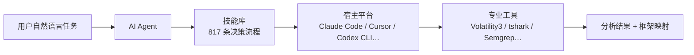

+++
github_repo = "mukul975/Anthropic-Cybersecurity-Skills"
date = '2026-05-24T00:00:00+08:00'
draft = false
title = 'Anthropic Cybersecurity Skills：Claude AI 安全分析工具包'
slug = 'anthropic-cybersecurity-skills-ai-security-analysis'
description = 'Anthropic Cybersecurity Skills 是一套面向 AI Agent 的网络安全技能库，把资深分析师的决策流程编码成 817 条技能，覆盖 29 个安全领域、映射 6 个行业框架，兼容 Claude Code、Cursor、Codex CLI 等 26+ 平台。'
categories = ['技术笔记']
tags = ['安全', 'Claude', 'AI Agent']
+++

# Anthropic Cybersecurity Skills：Claude AI 安全分析工具包

Anthropic Cybersecurity Skills 不是一个安全扫描工具。它是一个给 AI Agent 准备的技能库：把资深安全分析师在真实任务里会怎么做（用什么工具、先查什么、跑完怎么验证）编码成 Agent 能读取、能按步骤执行的 Markdown 文件。仓库地址 <https://github.com/mukul975/Anthropic-Cybersecurity-Skills>，作者 mukul975，许可证 Apache-2.0，社区项目——README 明确声明 *Not affiliated with Anthropic PBC*，与 Anthropic 官方没有关系。

项目把 817 条结构化技能按 29 个安全领域组织，兼容 Claude Code、GitHub Copilot、OpenAI Codex CLI、Cursor、Gemini CLI 等 26+ 个 AI 平台。下面拆它和传统 SAST/DAST 工具的关系：它能做什么、不能做什么，安全团队怎么把它放进现有工作流。

## 项目定位与事实边界

先厘清它"是什么"和"不是什么"，后面才不至于把技能库和工具混为一谈。

它不是扫描器：不直接检测漏洞，不抓包，不跑 exploit。它做的是把"资深分析师的决策流程"写成 Agent 可以读取执行的技能文件，让 Agent 面对安全任务时有一套可遵循的工作流，而不是靠模型现场猜。



技能库在链路里只负责"告诉 Agent 按什么步骤做"。剩下三类参与者各自独立：AI Agent 负责读取并执行流程；宿主平台（Claude Code、Cursor 等）提供运行环境；专业工具（Volatility3、tshark、Semgrep 等）承担实际扫描。技能库不替代其中任何一层。

| 维度 | 数值 |
|------|------|
| 仓库 | `mukul975/Anthropic-Cybersecurity-Skills` |
| 技能数 | 817 条结构化技能 |
| 领域覆盖 | 29 个安全领域 |
| 框架映射 | 6 个：MITRE ATT&CK、NIST CSF 2.0、MITRE ATLAS、MITRE D3FEND、NIST AI RMF、MITRE F3 |
| 兼容平台 | 26+（Claude Code、GitHub Copilot、OpenAI Codex CLI、Cursor、Gemini CLI 等） |
| 技能标准 | agentskills.io 开放标准 |
| 许可证 | Apache-2.0 |
| Stars / Forks | 27,436 / 3,319 |
| 主要语言 | Python |
| 项目性质 | 社区项目，非 Anthropic 官方 |

> Stars、Forks 来自 GitHub API，2026-08-07 验证，会随仓库更新变化；其余数字来自仓库 README。

## 为什么需要它

ISC2 2024 年度劳动力研究显示，2024 年全球网络安全岗位缺口约 480 万（来源：<https://www.isc2.org/research>）。AI Agent 能补一部分，但前提是 Agent 得有结构化的领域知识。通用大模型会写代码、能搜索，缺的恰恰是"什么时候用什么技术、执行前查什么、跑完怎么验证"这类实操判断。现有安全工具仓库给的是字典、payload、exploit 代码，没有给 Agent 一套决策工作流。

这个技能库填的正是这块。每条技能编码的是真实从业者的工作流，来源是访谈记录和公开 playbook，保留了人工经验，不是模型生成的摘要。

映射 6 个框架，是因为它们各管安全工作的一个切面，单独用都留盲区：ATT&CK 描述对手怎么做，D3FEND 描述防御动作，两者构成攻防对照；NIST CSF 描述组织整体态势，ATLAS 描述 AI/ML 特有威胁，AI RMF 管理 AI 系统风险，MITRE F3 管网络金融欺诈。一条技能挂上多个框架 ID，执行一次就能在攻防、组织、AI、欺诈几个维度同时留下可追溯的痕迹，对合规归档和价值论证都有用。

要注意，不是每条技能都挂满 6 个框架，而是按技能类型挂相关的那些。README 给出了整体覆盖：ATT&CK 805 条、NIST CSF 804 条、D3FEND 139 条、NIST AI RMF 97 条、MITRE F3 94 条、ATLAS 93 条。取证类技能走 ATT&CK + CSF，AI 安全类技能才额外挂 ATLAS 和 AI RMF。

## 技能库结构

### 目录组织

每条技能遵循统一的目录结构：

```text
skills/performing-memory-forensics-with-volatility3/
├── SKILL.md          # 技能定义（YAML frontmatter + Markdown 正文）
├── references/
│   ├── standards.md  # MITRE ATT&CK、ATLAS、D3FEND、NIST 映射
│   └── workflows.md  # 深度技术流程参考
├── scripts/
│   └── process.py    # 可用的辅助脚本
└── assets/
    └── template.md   # 检查清单和报告模板
```

### YAML frontmatter 示例

```yaml
---
name: performing-memory-forensics-with-volatility3
description: >-
  Analyze memory dumps to extract running processes, network connections,
  injected code, and malware artifacts using the Volatility3 framework.
domain: cybersecurity
subdomain: digital-forensics
tags: [forensics, memory-analysis, volatility3, incident-response, dfir]
atlas_techniques: [AML.T0047]
d3fend_techniques: [D3-MA, D3-PSMD]
nist_ai_rmf: [MEASURE-2.6]
nist_csf: [DE.CM-01, RS.AN-03]
version: "1.2"
author: mukul975
license: Apache-2.0
---
```

frontmatter 字段包括：`name`（kebab-case，1-64 字符）、`description`（关键词丰富，方便 Agent 发现）、`domain`、`subdomain`、`tags`、`atlas_techniques`（MITRE ATLAS ID）、`d3fend_techniques`（MITRE D3FEND ID）、`nist_ai_rmf`（NIST AI RMF 引用）、`nist_csf`（NIST CSF 2.0 类别）。MITRE ATT&CK 技术映射记在每条技能的 `references/standards.md` 里，release 资产里附带 ATT&CK Navigator 层文件；F3 的映射则写在技能的 `mitre_f3:` frontmatter 块里。

frontmatter 被刻意设计得"轻"——只放 Agent 匹配阶段需要的信息（名称、描述、标签、框架 ID），具体流程留在 Markdown 正文。这种切分是渐进式披露成立的前提：扫描阶段读到的字段越少，817 条技能一次性过完的 token 成本越低。

### Markdown 正文结构

```markdown
## When to Use
触发条件——AI Agent 什么时候应该激活这条技能

## Prerequisites
所需工具、访问权限、环境配置

## Workflow
分步执行指南，包含具体命令和决策点

## Verification
如何确认这条技能执行成功
```

四个章节的顺序对应"判断是否适用 → 检查前置条件 → 执行工作流 → 验证结果"一条完整链路。把 Verification 放在最后，是为了避免 Agent 跑完 Workflow 就直接交差——安全分析里，没验证的结论比没有结论更危险，会让下游误判已经做过复核。

## 29 个安全领域覆盖

技能按 29 个领域分布。下表是 README 给出的完整清单和技能数：

| 领域 | 技能数 | 能力方向 |
|------|--------|----------|
| Cloud Security | 66 | AWS/Azure/GCP 加固、CSPM、云攻击模拟、云取证 |
| Threat Hunting | 58 | 假设驱动狩猎、LOTL 检测、EVTX 狩猎 |
| Threat Intelligence | 52 | STIX/TAXII、MISP、OpenCTI、情报源集成、攻击者画像 |
| Network Security | 43 | IDS/IPS、防火墙规则、VLAN 分段、流量分析 |
| Web Application Security | 42 | OWASP Top 10、SQLi、XSS、SSRF、反序列化 |
| Digital Forensics | 41 | 磁盘镜像、内存取证、Hayabusa/KAPE/Plaso 时间线 |
| Malware Analysis | 39 | 静态/动态分析、逆向工程、沙箱 |
| Identity & Access Management | 37 | Entra ID、设备码钓鱼、PAM、零信任身份 |
| SOC Operations | 35 | Playbook、升级流程、图日志检测、桌面演练 |
| Red Teaming | 33 | ADCS/Certipy、BloodHound CE、C2、NTLM relay |
| Container Security | 33 | K8s RBAC、镜像扫描、Falco、容器逃逸 |
| Security Operations | 28 | SIEM 关联、日志分析、告警分诊 |
| OT/ICS Security | 28 | Modbus、DNP3、IEC 62443、SCADA |
| API Security | 28 | GraphQL、REST、OWASP API Top 10、WAF 绕过 |
| Incident Response | 26 | 入侵遏制、勒索软件响应、IR Playbook |
| Vulnerability Management | 25 | Nessus、扫描工作流、补丁优先级、CVSS |
| Penetration Testing | 21 | 网络/Web/云/移动渗透、NetExec 横向移动 |
| DevSecOps | 18 | CI/CD 安全、Trivy IaC/镜像扫描、代码签名 |
| Zero Trust Architecture | 17 | BeyondCorp、CISA 成熟度模型、微隔离 |
| Endpoint Security | 17 | EDR、LOTL 检测、无文件恶意软件、持久化狩猎 |
| Cryptography | 16 | TLS、Ed25519、后量子迁移、密钥管理 |
| Phishing Defense | 15 | 邮件认证、BEC 检测、钓鱼响应 |
| AI Security | 14 | LLM 红队、提示注入、MCP/Agentic 安全、护栏 |
| Mobile Security | 13 | Android/iOS 分析、移动渗透、MDM 取证 |
| Ransomware Defense | 13 | 前兆检测、响应、恢复、加密分析 |
| Compliance & Governance | 9 | NIST 800-30/RMF、CMMC、HIPAA、TPRM |
| Supply Chain Security | 8 | SBOM、依赖混淆、恶意包分诊、SLSA/Sigstore |
| Deception Technology | 6 | 蜜标、canarytoken、失陷检测 |
| Hardware & Firmware Security | 4 | CHIPSEC/UEFI 审计、Secure Boot 绕过、TPM 证明 |

29 个领域的划分沿用了主流安全运营中心（SOC）的职能切分，好处是和团队现有岗位对得上号；代价是部分领域有交叉（例如 Threat Hunting 和 Threat Intelligence 都涉及 IOC 处理）。Agent 匹配时可能同时命中多个领域，需要靠 `subdomain` 和 `tags` 进一步收敛。

## 六框架映射

每条技能按类型映射到 6 个行业框架中的若干个。README 给出的版本和覆盖情况：

| 框架 | 版本 | 覆盖范围 | 映射技能数 |
|------|------|----------|------|
| MITRE ATT&CK | v19.1 | 15 战术，Enterprise/Mobile/ICS | 805 |
| NIST CSF 2.0 | 2.0 | 6 功能、22 类别、106 子类别 | 804 |
| MITRE ATLAS | 2026.07 | 101 技术、77 子技术 | 93 |
| MITRE D3FEND | v1.4.0 | 270 技术 | 139 |
| NIST AI RMF | 1.0 | 4 功能（Govern/Map/Measure/Manage） | 97 |
| MITRE F3（Fight Fraud） | v1.1 | 8 战术、123 技术 | 94 |

跨框架映射的实际效果可以用一条技能说明：`analyzing-network-traffic-of-malware` 同时映射到 ATT&CK T1071、NIST CSF DE.CM、ATLAS AML.T0047、D3FEND D3-NTA、AI RMF MEASURE-2.6，F3 这一列留空。另一条 `detecting-business-email-compromise` 则映射 ATT&CK T1566、NIST CSF DE.AE，并挂 F3 的 F1005.006（monetization）。同一条技能执行后，可以同时满足多个合规框架的检查点。

MITRE F3 是 2026 年 4 月由 MITRE 威胁知悉防御中心（CTID）发布的网络金融欺诈 TTP 目录，补上了 ATT&CK 在初始入侵之后留下的空白。v1.1 新增两个 ATT&CK 没有的欺诈专用战术：Positioning（FA0001，入侵后收集/篡改数据为欺诈做准备）和 Monetization（FA0002，把窃取资产换成可用资金）。欺诈专用技术用 `F1XXX` ID（如 `F1005.003` Add Beneficiary、`F1007` Adversary-in-the-Browser），沿用 ATT&CK 的技术保留 `T1XXX` ID。

ATT&CK 方面，仓库已经升级到 v19.1，把原来的 Defense Evasion 拆成了 Stealth（TA0005）和 Defense Impairment（TA0112）两个战术，所有 ID 用官方 `mitreattack-python` 库校验过，无 revoke 或 deprecated ID。

## 任务流案例：内存取证分析

目录结构、frontmatter 字段、正文章节拆完了，看一个具体任务怎么流过系统。场景是用户给 Agent 一个提示："分析这个内存镜像，看有没有凭证窃取痕迹"。

```text
用户提示: "Analyze this memory dump for signs of credential theft"

Agent 内部流程:

1. 扫描 817 条技能的 frontmatter（每条约 30 tokens）
   → 通过 tags、description、domain 匹配，识别出 12 条相关技能

2. 加载匹配度最高的 3 条:
   • performing-memory-forensics-with-volatility3
   • hunting-for-credential-dumping-lsass
   • analyzing-windows-event-logs-for-credential-access

3. 按技能的 Workflow 部分逐步执行
   → 运行 Volatility3 插件，检查 LSASS 访问模式，
     与事件日志证据关联

4. 用技能的 Verification 部分验证结果
   → 确认 IOC，把发现映射到 ATT&CK T1003（Credential Dumping）
```

没有这些技能时，Agent 只能自己猜该跑什么命令，容易漏掉关键步骤。有了技能，Agent 跑的是资深 DFIR（Digital Forensics and Incident Response）分析师会用的同一套 playbook。

## 渐进式披露，为什么扫描便宜

流程里有一个设计点单独说：渐进式披露（progressive disclosure）。Agent 先用约 30 tokens 扫描每条技能的 frontmatter，只在命中时才完整加载（500-2000 tokens）。这样 817 条技能可以在一次扫描里过完，不会撑爆上下文窗口。

大模型的上下文窗口是稀缺资源，这是渐进式披露存在的根本原因。817 条如果全部完整加载，按平均 1000 tokens 算就是约 82 万 tokens，超出当前任何模型的上下文上限。把扫描成本压到 30 tokens/条，一次全量扫描约 2.5 万 tokens，留在大多数模型的窗口内；命中后再按需加载完整内容，把 token 预算花在真正相关的技能上。

## 安装与使用

### 通过 npx 安装（推荐）

```bash
npx skills add mukul975/Anthropic-Cybersecurity-Skills
```

### 通过 Git 克隆

```bash
git clone https://github.com/mukul975/Anthropic-Cybersecurity-Skills.git
cd Anthropic-Cybersecurity-Skills
```

装完之后，技能文件会被 Claude Code、GitHub Copilot、OpenAI Codex CLI、Cursor、Gemini CLI 等兼容 agentskills.io 标准的平台自动发现。这个项目本身不调用任何 API，只是给 Agent 提供技能文件，所以不需要单独给它配 API Key。

一个常见误解先说清楚：这个项目没有 pip 包形式，没有 `pip install cybersecurity-skills` 这样的安装方式，也没有 `cybersecurity-skills analyze` 这样的命令行工具。它是一个技能文件库，由宿主 AI 平台读取和执行。

### 最小可运行示例

以 Claude Code 为例，装完技能后给 Agent 一个具体任务，看技能是否被正确激活：

```text
用户: 帮我分析 /tmp/suspicious.pcap 这个抓包文件，找出可能的 C2 通信

Agent 行为（预期）:
1. 扫描技能 frontmatter，匹配到 network-security 领域的技能
2. 加载 analyzing-network-traffic-of-malware 等相关技能
3. 按 Workflow 部分调用 tshark / zeek 进行流量解析
4. 按 Verification 部分核对 IOC，输出 ATT&CK 技术映射
```

如果 Agent 直接回答"我无法分析 pcap"或跳过技能流程，说明技能没被正确发现，参考下一节排查。

## 与传统 SAST/DAST 工具的对比

技能库和传统安全工具的差异集中在"做什么"和"谁来做"。

| 维度 | Anthropic Cybersecurity Skills | SAST（如 Semgrep、CodeQL） | DAST（如 Burp Suite、ZAP） |
|------|-------------------------------|-----------------------------|----------------------------|
| 形态 | AI Agent 技能文件库 | 静态代码扫描器 | 动态运行时扫描器 |
| 执行主体 | AI Agent（Claude、Copilot 等） | 扫描引擎本身 | 扫描引擎本身 |
| 输入 | 自然语言任务 + 上下文 | 源代码 | 运行中的 Web 应用 |
| 输出 | 结构化分析 + 框架映射 | 漏洞列表 + 代码位置 | 漏洞列表 + 请求/响应证据 |
| 误报率 | 取决于 Agent 推理质量 | 规则驱动，误报可控 | 规则驱动，误报可控 |
| 覆盖面 | 29 个领域，广但浅 | 单一领域（代码缺陷），深 | 单一领域（运行时漏洞），深 |
| 框架映射 | 6 框架按类型映射 | 通常无 | 通常无 |
| 可重复性 | 取决于模型、温度、上下文 | 确定性 | 确定性 |

边界在这里：SAST 和 DAST 是确定性工具，同一段代码跑十次结果一样；技能库驱动的是 AI Agent，结果受模型、温度、上下文影响。技能库的价值是给 Agent 决策流程，让 Agent 面对日志、流量、代码时知道该按什么步骤分析、该映射到哪个框架，扫描器的工作仍由 SAST/DAST 承担。

三类工具在工作流里互补：SAST 在代码提交阶段跑，DAST 在测试环境跑，技能库驱动的 Agent 在事件响应、威胁狩猎、合规归档这些需要"判断"的环节跑。把它们排在一条流水线上比谁替代谁，没有意义，关键是各自负责自己擅长的环节。

## 适用人群与采用建议

### 适合的人

- **安全工程师和渗透测试人员**：用 Agent 辅助编排测试流程，减少手动翻 playbook 的时间。
- **威胁情报分析师**：用技能里的框架映射快速定位 ATT&CK、ATLAS 技术 ID。
- **企业安全团队**：把技能库作为 Agent 的技能文件集合，统一分析口径和报告格式。
- **安全学习者**：通过技能文件学习从业者工作流，每条技能就是一个完整案例。

### 不能做的事

技能库不替代专业工具。具体来说：

- 不直接扫描代码漏洞，SAST 工具（Semgrep、CodeQL、Snyk）该用还得用。
- 不直接跑渗透测试，Burp Suite、Metasploit、Nmap 该用还得用。
- 不直接做内存取证，Volatility3、Rekall 该用还得用。
- 不替代 SIEM 的实时告警，Splunk、Elastic Security、Microsoft Sentinel 该用还得用。

它做的是让 AI Agent 用这些工具时有一套结构化的决策流程，避免随机调用。技能里的 `scripts/` 目录会提供辅助脚本，主流程还是 Agent 调用宿主平台的能力执行。

### 采用顺序

团队按三步走。

第一，先在 Claude Code 或 Cursor 里装上，挑 3-5 条和你日常工作相关的技能试跑。做 Web 安全的挑 Web Application Security 领域的技能，做事件响应的挑 Incident Response 和 Digital Forensics 领域的。这一步验证技能工作流和你团队的实际流程对不对得上。

第二，如果技能工作流和团队流程有差异，fork 仓库改 SKILL.md 的 Workflow 部分。技能文件是纯 Markdown + YAML，改造成本很低。改完用 Git 子树或 submodule 在团队内同步，保证所有人用同一版本。

第三，要满足合规要求（比如 SOC 2、ISO 27001）的话，重点看技能的框架映射字段。每条技能执行后产出的报告可以带上 ATT&CK、NIST CSF 的技术 ID，直接当合规证据归档。这一步要配合报告生成流程——技能库本身不生成报告，报告由宿主 Agent 按技能的 `assets/template.md` 模板生成。

### 适用边界

这个技能库适合已经用 AI Agent 做安全分析的团队。团队还没有 Agent 工作流的话，先建 Agent 工作流再装技能库，顺序不能反——没有 Agent 读取和执行，技能文件就是一堆 Markdown。团队坚持纯人工流程或纯工具流程的话，这个技能库同样用不上。

## 常见问题排查

| 现象 | 可能原因 | 处理方式 |
|------|----------|----------|
| Agent 没有按技能 Workflow 执行 | 技能目录没被宿主平台索引 | 检查技能目录是否在宿主平台的 skills 搜索路径下，重启宿主进程 |
| `npx skills add` 报网络错误 | npm registry 不可达或代理拦截 | 改用 `git clone` 方式，或配置 `HTTPS_PROXY` 后重试 |
| 技能加载后 token 占用过高 | 一次命中过多技能被全部完整加载 | 在 Agent 提示里限定领域，例如"只使用 digital-forensics 领域的技能" |
| 修改后的 SKILL.md 不生效 | 宿主平台缓存了旧版本 | 清空宿主平台技能缓存目录，或重新 clone 仓库 |
| Agent 调用了技能里没列出的工具 | 模型自行发挥，绕过 Workflow 约束 | 在提示里强调"严格按技能 Workflow 执行，不要自行选择工具" |

## 数据口径说明

1. **信息来源**：本文基于 `mukul975/Anthropic-Cybersecurity-Skills` 仓库的 README、SKILL.md 和 `references/standards.md` 整理，GitHub API 与 README 于 2026-08-07 验证。
2. **不变 vs 变动数字**：817 条技能、29 个领域、6 个框架、26+ 平台、各框架版本来自 README 徽章与正文；Stars 27,436、Forks 3,319、创建 2026-02-25、最后推送 2026-08-02 来自 GitHub API，会随仓库更新变化。
3. **token 估算**：frontmatter 约 30 tokens、完整加载 500-2000 tokens 来自 README 描述，未独立复测；实际消耗取决于宿主平台和上下文窗口。
4. **判断的边界**：引入顺序、适用边界、贡献建议基于 README 建议和社区使用观察，不代表 Anthropic 官方立场（仓库已声明 *Not affiliated with Anthropic PBC*）。
5. **未覆盖内容**：本文聚焦仓库架构和技能格式，未深入某条技能的完整 Workflow 拆解、`references/tools/` 中各安全工具的 YAML 格式细节、多技能冲突时的优先级仲裁逻辑。
6. **术语说明**：本文保留 ATT&CK、NIST CSF、NIST AI RMF、MITRE ATLAS、D3FEND、MITRE F3、SOP、PR、Volatility3、SAST、DAST、SIEM 等专有名词不翻译，因为它们在安全工程社区有固定英文表述。