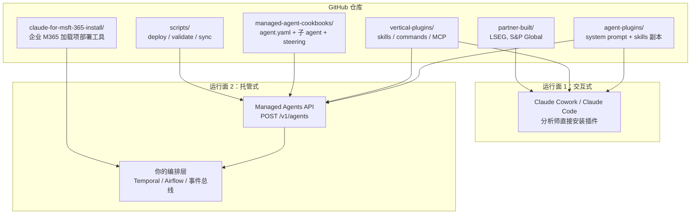

> **目标读者**：想搞清楚 Anthropic 如何把金融工作流做成可安装智能体的开发者、平台团队与金融科技从业者
> **核心判断**：这个仓库交付的是一套把投行、行研、私募、财富管理和基金运营的工作流拆成 agent、skill、command 和 connector 的参考实现——同一份 prompt 和 skill，可以在 Cowork 里交互式用，也可以通过 Managed Agents API 挂到自家编排层后面
> **资料基线**：本文以 [anthropics/financial-services](https://github.com/anthropics/financial-services) 仓库 README、managed-agent-cookbooks 目录说明和若干 agent guardrail 文档为准，并比对仓库最新主干内容做了事实校验
> **预计阅读时间**：22 - 30 分钟

读完后你能判断的几件事

- 仓库、Cowork 插件发布源、Managed Agent（托管智能体）模板这三层的边界分别在哪
- 你的团队该直接装命名 agent，还是只装一块 vertical plugin
- 这个仓库能产出哪些分析产物，又有哪些合规和操作底线绝对不能碰
- 一套典型的金融工作流从触发到产出，在不同运行面上经历了什么

| → | [分层图](#一张图看懂整个仓库的分层) | [是什么](#1-它到底是什么) | [易混点](#2-第一次读容易搞混的三件事) | [目录拆解](#3-仓库逐层拆开看) | [agent 列表](#4-现在有哪些-agent 它们各自能干到什么程度) | [skills/commands](#5-skills-和-commands 比-agent-列表更有复用价值的那层) | [任务流案例](#6-一次具体的工作流 pitch-agent-从触发到产出经历了什么) | [MCP](#7-mcp-连接器这仓库离生产最近的那层也是最远的那层) | [三条路径](#8-三种进入路径和一套务实的试装顺序) | [M365](#9-补充一块容易被跳过的内容 microsoft-365-部署工具) | [工程价值](#10-这个仓库为什么值得研究不止于金融) | [边界](#11-使用前要接受的边界) | [决策表](#12-按你团队的情况做选择)

一张图看懂整个仓库的分层

在深入任何细节之前，先把最容易混淆的几层结构摊开。这张图覆盖了从 GitHub 源代码到两种使用形态的完整链路：



图上能读出两条关键信息：

`agent-plugins/<slug>/agents/<slug>.md` 放的是核心系统提示词，`managed-agent-cookbooks/<slug>/agent.yaml` 再去引用同一份内容，把它解析成 `POST /v1/agents` 所需的配置。Anthropic 没有为 Cowork 和 Managed Agents 分别维护两套 prompt——上层运行面可以不同，底层知识源保持同一份。

`vertical-plugins/` 里的 skills 是"源"，`agent-plugins/<slug>/skills/` 是"副本"。每个命名 agent 把要用的 skills 打包了一份，装 agent 时不需要额外补装 vertical plugin。但如果只需拿 `/comps`、`/dcf`、`/earnings` 这样的单条命令，直接从 vertical plugin 装会更干净。仓库里还配了 `scripts/sync-agent-skills.py`，用来在修改 vertical 源文件后把更新推到所有打包了该 skill 的 agent。

. 它到底是什么

Anthropic 把这个项目命名为 [Claude for Financial Services](https://github.com/anthropics/financial-services)，但仓库定位写得很克制：它是"金融服务常见工作流的参考 agents、skills 和 data connectors"，而不是一个开箱即用的金融 SaaS。

仓库不承诺替你完成投资决策，也不宣称可以直接接管审批、入账或交易执行。它交付的是一套按行业语境写好的工作流骨架：提示词怎么拆、技能怎么组织、哪些斜杠命令该显式暴露、数据从哪里接进来、哪些环节必须留人工签字。真正把它带进生产的，还是你自己的数据权限、模板、术语、审阅制度和编排层。

README 开头的声明写得很直白：这里的内容不构成投资、法律、税务或会计建议；所有 agent 产出的是分析师工作底稿，必须由有资质的专业人士复核。这段话定义了整个仓库的设计边界——每个 agent 的终点是"交出第一版底稿，等人签字"，不是"完成一个金融动作"。

. 第一次读容易搞混的三件事

公开仓库是 [anthropics/financial-services](https://github.com/anthropics/financial-services)。但 README 在安装示例里用的发布源是 `anthropics/claude-for-financial-services`，插件标识是 `@claude-for-financial-services`。

这不是命名失误。Anthropic 把"开源代码仓库"和"插件市场发布源"分开了：GitHub 上你能 fork 和改源码，插件市场里你只做安装和版本管理。两套名字对应两套用途，不搞清楚这一点，第一次看文档就会在安装方式上走弯路。

**命名 agent 和 vertical plugin 不是一回事。**README 里最显眼的是 Pitch Agent、Market Researcher、GL Reconciler 这些命名 agent——它们是端到端工作流入口，装完就能跑完整任务。但仓库底层还有一层 vertical plugins：它们承载可复用的 skills、slash commands 和 MCP connectors，按投行、行研、私募、财富管理、基金运营等垂直场景分组。如果你的目标是拿到 `/comps`、`/dcf`、`/earnings` 这样的单条能力，而不是整套 agent，就该从 vertical plugin 入手。

**这是参考模板，不是即插即用的生产系统。**仓库内容几乎都是 Markdown、JSON 和 YAML——没有构建系统，没有二进制分发，没有 docker-compose。你可以直接装起来试，但只要牵涉真实金融数据、内部术语、PPT 模板、Excel 模板、审批链路或监管留痕，几乎都要做二次定制。Anthropic 给的是一套"你们公司往里塞自己流程和约束"的骨架，不是一个封闭产品。

. 仓库逐层拆开看

```text
plugins/
  agent-plugins/                     ← 10 个命名 agent，每个是自包含插件
    pitch-agent/agents/pitch-agent.md
    gl-reconciler/agents/gl-reconciler.md
    ...
  vertical-plugins/                  ← 7 组垂直能力包 + MCP 连接器
    financial-analysis/              ← 核心：全部建模技能和 11 个数据连接器
    investment-banking/
    equity-research/
    private-equity/
    wealth-management/
    fund-admin/
    operations/
  partner-built/                     ← 第三方数据商插件
    lseg/
    spglobal/
managed-agent-cookbooks/             ← 10 个 agent 的托管部署模板
  pitch-agent/agent.yaml
  ...
claude-for-msft-365-install/         ← M365 加载项企业部署工具
scripts/                             ← deploy / validate / sync / orchestrate
```

这套目录把复用边界划开了。命名 agent 管一条工作流的端到端执行。Vertical plugin 管可复用的领域技能和命令。Managed Agent cookbook 把同一套 system prompt 和 skills 包装成可通过 API 托管部署的形式。分析师和平台团队看到的是不同的运行面，底层的 prompt 和 skill 来源不变。

这个仓库是 file-based 的，主体内容就是 Markdown、JSON、YAML。没有构建系统，没有二进制分发，没有 docker-compose。Anthropic 把复杂度放在了内容组织、引用关系和部署脚本上，而不是代码框架上。这种取舍是刻意的：行业 agent 场景里真正频繁变化的是流程、模板、规则和数据接入方式，不是代码本身。Markdown 比代码更容易被业务团队读懂和修改——这本身就是一个设计决策，不是一个便利性妥协。

. 现在有哪些 agent，它们各自能干到什么程度

README 列出了 10 个命名 agent，按 4 组理解最清晰：

| 职能 | Agent | 它产出的是"第一版底稿"，不是"结论" |
| ------ | ------ | ------ |
| Coverage & advisory | Pitch Agent | comps、precedents、LBO → 品牌化 pitch deck |
| | Meeting Prep Agent | 客户会前简报包整理 |
| Research & modeling | Market Researcher | 行业/主题研究框架搭建、竞争格局、comps、标的短名单 |
| | Earnings Reviewer | 财报+电话会 → 模型更新 → 点评草稿 |
| | Model Builder | 在 Excel 中生成 DCF、LBO、三张报表或 comps 模型 |
| Fund admin & finance ops | Valuation Reviewer | 消化 GP 材料 → 估值模板 → LP 报告底稿 |
| | GL Reconciler | 找总账与子账差异、追根因、形成异常报告 |
| | Month-End Closer | 月结中的计提、roll-forward 和差异说明 |
| | Statement Auditor | LP 报表分发前的审计与勾稽 |
| Operations & onboarding | KYC Screener | 开户文件解析、规则引擎筛查、缺口标注 |

这些名字大多对应真实岗位里能被拆出来的"第一版产物"——Pitch Agent 的终点是品牌化 pitch deck，GL Reconciler 的终点是异常报告和 controller sign-off，KYC Screener 的终点是把疑点抬出来给合规官决定，而不是"审批通过"。每个 agent 的产出物都是具体的工作底稿，不是泛泛的研究摘要。

每个 agent 的 guardrails 都写得很硬。Pitch Agent 要在模型完成后和 deck 生成后各停一次，交 banker 审核。Earnings Reviewer 要求所有数字可溯源，找不到来源就标 `[UNSOURCED]`。KYC Screener 只给建议，风险评级决定权在合规官。Anthropic 把这些约束直接写进了 agent 定义里——停下来的节点和不能自动化的判断，跟建模和 deck 生成一样，是工作流的一部分，不是外挂的合规备注。

> **自测**：KYC Screener 产出的终点是什么——"审批通过"还是"把疑点交给合规官"？这个设计决定了 agent 在整个 KYC 流程里扮演的角色宽度。

. skills 和 commands：比 agent 列表更有复用价值的那层

如果只盯着命名 agent，会严重低估这个仓库真正可复用的部分。以 `financial-analysis` 这个核心 vertical plugin 为例，它承载了 14 个 skill 和对应的 slash command，覆盖了金融建模最常用的操作：

| Skill | Command | 做的事情 |
| ------ | ------ | ------ |
| comps-analysis | `/comps` | 可比公司分析与交易倍数 |
| dcf-model | `/dcf` | DCF 估值（含 WACC 和敏感性分析） |
| lbo-model | `/lbo` | 杠杆收购模型 |
| 3-statement-model | `/3-statement-model` | 三张报表模型填充 |
| audit-xls | `/debug-model` | Excel 审计：公式追踪、硬编码检测、平衡检查 |
| clean-data-xls | — | 清洗和规范 Excel 表数据 |
| deck-refresh | — | 跨 deck 重新链接和刷新嵌入图表 |
| competitive-analysis | `/competitive-analysis` | 竞争格局与市场定位 |
| ib-check-deck | — | 检查 pitch deck 错误与一致性 |
| pptx-author | — | 在 Managed Agent 模式下生成 `.pptx` |
| xlsx-author | — | 在 Managed Agent 模式下生成 `.xlsx` |
| ppt-template-creator | `/ppt-template` | 创建可复用的 PPT 模板 skill |
| skill-creator | — | 指导创建新 skill |

其他垂直包在这个基础上各自扩展了领域专用命令：

- **investment-banking**：`/one-pager`、`/cim`、`/teaser`、`/buyer-list`、`/merger-model`、`/process-letter`、`/deal-tracker`
- **equity-research**：`/earnings`、`/earnings-preview`、`/initiate`、`/model-update`、`/morning-note`、`/sector`、`/thesis`、`/catalysts`、`/screen`
- **private-equity**：`/source`、`/screen-deal`、`/dd-checklist`、`/dd-prep`、`/unit-economics`、`/returns`、`/ic-memo`、`/portfolio`、`/value-creation`、`/ai-readiness`
- **wealth-management**：`/client-review`、`/financial-plan`、`/rebalance`、`/client-report`、`/proposal`、`/tlh`
- **fund-admin**：`/gl-recon`、`/break-trace`、`/accruals`、`/nav-tieout`

仓库还在 partner-built 目录下单独放了 LSEG 和 S&P Global 的插件。这个信号比功能列表本身更能说明 Anthropic 的判断：金融工作流的数据层不是一家模型公司能自己写完的，最终要和数据商生态对接。LSEG 插件管债券相对价值、互换曲线、外汇 carry 和期权波动率；S&P Global 插件管 tear sheets、财报预览和融资摘要。

> **自测**：你已经装了 Market Researcher agent，团队里的分析师还想单独用 `/earnings` 命令写季报点评。应该再装 equity-research vertical plugin 吗？提示：想想 agent 是 self-contained 的，slash commands 从哪来。

. 一次具体的工作流：Pitch Agent 从触发到产出经历了什么

讲层级和模块不如跟一遍任务。下面用 Pitch Agent 做一次投行 pitch，把前面拆开的机制串起来。

**触发。**一位投行分析师在 Cowork 里激活 Pitch Agent，输入目标公司名称和交易场景（sell-side M&A）。

**第一段：数据接入与模型构建。**Agent 先通过 MCP connector 拉数据——comps 数据可能从 FactSet 或 CapIQ 来，precedents 从内部 deal database 来。`comps-analysis` skill 自动触发，生成可比公司分析。分析师审一轮后，`dcf-model` skill 启动，跑 DCF 估值。这一步结束后，agent 停下——guardrail 要求 banker 在模型阶段审核。

**第二段：deck 生成。**审核通过后，`pitch-deck` skill 填充公司定制的 PowerPoint 模板（模板本身通过 `/ppt-template` 命令预先教给了系统）。`ib-check-deck` skill 做一致性检查。deck 生成后 agent 再次停下，第二次人工审核。

**第三段：托管部署面。**如果平台团队决定把同一条工作流挂到后端，他们会拿 `managed-agent-cookbooks/pitch-agent/agent.yaml`，运行 `scripts/deploy-managed-agent.sh pitch-agent`。部署脚本解析 agent.yaml 中的文件引用，上传 skills，创建 leaf-worker 子 agent，然后 POST orchestrator 到 `/v1/agents`。之后编排层通过 `scripts/orchestrate.py` 参考实现来路由 `handoff_request` 事件。

这个流程里人工卡点有两处：模型完成后一次，deck 完成后一次。两次停下来都不是因为模型能力不够——金融场景里某些判断必须留在人手里。Pitch Agent 替分析师做了两件重体力活：跨数据源拼信息和按模板生成 deck。签字的节点没有让出去。

走 Managed Agents 路径还多一层：部署脚本要你提前设好 `CAPIQ_MCP_URL`、`DALOOPA_MCP_URL`、`FACTSET_MCP_URL` 等环境变量。少了这些，命令能跑，数据接不进来。同样装完 agent，有的团队觉得效果好，有的觉得"只是演示"——差距不在模型侧，在数据层有没有接上。

> **自测**：Pitch Agent 的工作流里有两个人工卡点，分别在哪两步之后？如果把这两个卡点拿掉会发生什么——答案不是"不合规"，想得更具体一些：产出物在哪个环节最可能出错？

. MCP 连接器：这仓库离生产最近的那层，也是最远的那层

`financial-analysis` 核心插件集中管理所有数据连接器，目前接入的有 11 个：Daloopa、Morningstar、S&P Global、FactSet、Moody's、MT Newswires、Aiera、LSEG、PitchBook、Chronograph、Egnyte。

每个 MCP 接入通常需要供应商订阅或 API key——Anthropic 自己也写了这条注释。这带来两个直接后果：

1. 仓库提供的是"把数据接进工作流的接口形状"，不是数据本体。用这个仓库不等于免费用 Bloomberg 或 CapIQ 的数据。
2. 越接近生产场景，越需要把内部的系统——研究库、CRM、文档库、审计系统——通过 MCP 接进来，而不是只靠公开大模型。

判断一个团队离真正能用还有多远，看他们装了几个 agent 意义不大，直接看 MCP 配置里填了几个有效的服务地址更准。

. 三种进入路径，和一套务实的试装顺序

同一个仓库提供 3 条进入路径，分别对应 3 类不同的角色和目标。

. 分析师直接上手：Cowork

最短路径。在 Cowork 里进 Settings → Plugins → Add plugin，粘贴 `https://github.com/anthropics/claude-for-financial-services`，然后从市场列表里挑需要的 agent 和 vertical。也可以直接把 `plugins/` 下某个目录打包成 zip 上传。

优点快，适合验证"这个工作流值不值得做"。缺点堆在另一边：能控制的范围基本停在插件层，和企业自定义编排、审计、权限体系之间还有距离。

. 只拿通用能力：Claude Code + vertical plugin

不想立刻给团队装完整 agent，只想先试 `/comps`、`/dcf`、`/earnings`、`/ic-memo` 这类单条命令，用 Claude Code 装 vertical plugin 更合适：

```bash
claude plugin marketplace add anthropics/claude-for-financial-services
claude plugin install financial-analysis@claude-for-financial-services
claude plugin install investment-banking@claude-for-financial-services
claude plugin install equity-research@claude-for-financial-services
```

命名 agent 是 self-contained 的，已经把需要的 skills 打包好了。如果你装的是完整 agent，通常不需要再为同一条工作流额外补装对应的 vertical plugin——除非你就是要单独暴露那些 commands 和 connectors。

. 挂到自家平台后面：Managed Agents

目标是把这些工作流接进企业已有的审批、调度、工单或事件系统，就看 `managed-agent-cookbooks/`。每个目录提供 `agent.yaml`、子 agent 清单、steering examples 和对应 README：

```bash
export ANTHROPIC_API_KEY=sk-ant-...
scripts/deploy-managed-agent.sh gl-reconciler
```

Anthropic 在文档里标得很清楚：子 agent 委派能力 `callable_agents` 仍是 preview。这套架构已经指向多 agent 协作，但"完全自治"不是当前版本的默认前提。`scripts/orchestrate.py` 是参考事件循环——你仍然要自己提供编排层。

. 第一次试装的推荐顺序

1. 先在 Cowork 装一个命名 agent，确认团队是否真的需要这种工作流入口。
2. 再在 Claude Code 装 `financial-analysis` 和一个对应 vertical plugin，确认 slash commands、skills 和 connectors 是否符合实际工作习惯。
3. 只有前面两步跑通，再去看 Managed Agents，把它接进审批、调度和审计流程。

最小可试装的起点就是前面那段 4 行命令。如果是 Managed Agents 路径，部署前还必须补齐对应数据源的 MCP 地址——Pitch Agent、Market Researcher、GL Reconciler 这些 cookbook 都要求先设好 `CAPIQ_MCP_URL`、`DALOOPA_MCP_URL`、`FACTSET_MCP_URL`、`GL_MCP_URL` 等环境变量。

> **自测**：一个做私募尽调的 5 人小团队，没有后端开发人员。他们该从 Cowork、Claude Code + vertical plugin、还是 Managed Agents 开始？如果他们半年后招了平台工程师，又该往哪条路径迁移？

. 补充一块容易被跳过的内容：Microsoft 部署工具

仓库里还有一个独立模块 `claude-for-msft-365-install/`，和前面讲的 agent、vertical plugin 是两套东西。

如果你的公司让 Claude 跑在 Excel、PowerPoint、Word 和 Outlook 里，通过 Microsoft 365 加载项来用，这个模块就是给 IT 管理员用的部署工具。它是 Claude Code 插件，不是 Cowork 插件，走的是企业自有云——Vertex AI、Bedrock 或内网 LLM gateway——而不是 Anthropic 的 API。

安装后通过 `/claude-for-msft-365-install:setup` 启动，工具会引导管理员生成定制化的加载项清单（manifest）、授予 Azure 管理员授权、通过 Microsoft Graph 写入每个用户的路由配置。这块和前面的 agents、skills 分工很明确：部署工具负责把加载项装进租户，agents 和 skills 负责装进去之后跑什么。

. 这个仓库为什么值得研究——不止于金融

只把这个项目当"金融行业插件集合"看就错了。Anthropic 在这里把一个强行业约束的 agent 系统拆成了几个相对稳定的层次：

- 工作流入口：命名 agent，自包含，面向端到端任务
- 领域知识：reusable skill，沉淀在 vertical plugin 里，可被多个 agent 打包引用
- 显式操作：slash command，需要分析师明确触发
- 数据与内网系统：统一走 MCP connector
- 交互式产品和托管 API 两种运行面，共享同一份 prompt 和 skill 来源

这五层拆法解决的其实是一个通用问题：当行业工作流必须同时面对"交互式使用者"和"后端自动化系统"时，知识怎么存、怎么复用、怎么保证两边看到的规则是同一套。医疗、法务、保险、供应链等强流程行业，迟早都会碰到同样的工程需求——"流程怎么拆、证据怎么留、人工在哪个节点接管、复用层怎么稳定"。

仓库不依赖构建系统的 file-based 策略、skills 源文件与 agent 副本之间的 sync 机制、partner-built 插件目录对第三方数据商生态的开放姿态——每一项都够单独写一篇文章，这里只点到为止。

. 使用前要接受的边界

这个仓库是为了把金融专业人员从大量第一版底稿、整理、校核、拼装和标准化输出里解放出来，不是把他们从流程里拿掉。

它适合做的事：

- 把 pitch、研究 note、估值底稿、KYC 缺口表、月结差异说明先起出第一版
- 把分散在数据终端、文档库、Excel 和规则表里的信息拼到同一条工作流里
- 用一致的 prompt、skills 和 connectors 把团队的实践建议固化下来

它不适合做的事：

- 直接生成有约束力的投资建议
- 绕开人工审批去执行交易、入账、开户或监管动作
- 在没有数据权限、没有模板、没有复核责任人的前提下，指望"一装即生产"

这不是保守。金融场景里成熟 agent 设计本来就该有这种克制——知道自己该停在哪。

. 按你团队的情况做选择

| 你的情况 | 从哪里开始 |
| ------ | ------ |
| 想先让分析师试工作流，不做系统对接 | Cowork 装一个命名 agent |
| 只想拿几条建模命令（/comps、/dcf 等） | Claude Code 装 `financial-analysis` vertical plugin |
| 投行团队，关注 deal 流程 | 装 `investment-banking` vertical plugin |
| 行研团队，关注财报和覆盖 | 装 `equity-research` vertical plugin |
| 私募团队，关注 sourcing 和尽调 | 装 `private-equity` vertical plugin |
| 想把工作流接进审批/调度/事件系统 | 看 `managed-agent-cookbooks/`，补齐编排层 |
| 公司用 M365，想在 Excel/PPT 里跑 Claude | 看 `claude-for-msft-365-install/` |
| 换了数据源（不用 FactSet 用 Bloomberg） | 改 `.mcp.json`，替换 MCP 地址 |
| 想加自己的流程和模板 | fork 仓库 → 改 skill 文件 → 跑 `sync-agent-skills.py` |

如果在"分析师试用过的工作流"和"平台团队部署的端点"之间感到割裂，矛盾的根通常不在代码，而在组织上没有把同一份 skill 源管好。这个仓库的 sync 脚本和"一套内容两种运行面"的设计，恰好能解决这个问题。

. 常见踩坑

**装了 agent，但跑来跑去都没有产出数据。**十有八九是 MCP 连接器没配。每个 agent 都依赖 `financial-analysis` 核心插件的 MCP 连接器来拉数据，而这些连接器需要供应商订阅或 API key。先检查 `.mcp.json` 里填了哪个服务的地址，再确认那个地址在你当前网络环境里确实能通。如果你用的是 Managed Agents 路径，还要确认 `CAPIQ_MCP_URL`、`FACTSET_MCP_URL` 等环境变量在部署脚本执行前已经 export 了。

**改了 skill 文件，agent 行为没变化。**命名 agent 打包了自己的 skills 副本（在 `agent-plugins/<slug>/skills/` 下），它读的是副本，不是你改的 vertical 源文件。改完 `vertical-plugins/<vertical>/skills/` 之后，需要跑 `python3 scripts/sync-agent-skills.py` 把更新推到所有打包了该 skill 的 agent。没跑 sync 脚本就等于白改。

**Cowork 里装了 agent，但 slash commands 不出现。**slash commands 定义在 `vertical-plugins/<vertical>/commands/` 下。如果你只装了命名 agent 而没有装对应的 vertical plugin，agent 仍然能跑（因为 skills 已打包），但显式的 slash commands 不会出现在命令面板里。想用 `/comps`、`/dcf` 这类命令，要么装对应的 vertical plugin，要么确认你装的 agent 本身就暴露了这些命令。

**Managed Agent 部署后 `orchestrate.py` 报 handoff 超时。**`scripts/orchestrate.py` 是参考事件循环，不是生产级编排器。它假设你的 agent 之间的 handoff 在默认超时内完成。如果你的 agent 要拉大量数据（比如跑一次完整的 comps + DCF + LBO 模型），handoff_request 的响应时间可能远超参考实现的等待窗口。解决办法是自己写编排层的超时和重试逻辑——Anthropic 提供的是骨架，不是现成的重试策略。

**Agent 跑出来的数字和 Bloomberg 终端对不上。**agent 拉的数据来自你配置的 MCP 连接器，不是 Anthropic 自带的金融数据库。如果你配的是 FactSet，结果和 Bloomberg 不一致是正常的——数据源本身就有差异。这不是 bug，是金融数据行业的常态。解决办法是统一团队使用的数据源，或者写一个 cross-source reconciliation skill 来做差异说明。

参考

- [Anthropic 开源仓库：financial-services](https://github.com/anthropics/financial-services)
- [仓库 README](https://raw.githubusercontent.com/anthropics/financial-services/main/README.md)
- [Managed-agent templates 目录](https://github.com/anthropics/financial-services/tree/main/managed-agent-cookbooks)
- [Claude Managed Agents API 文档](https://platform.claude.com/docs/en/api/managed-agents)
- [Claude Cowork 产品页](https://claude.com/product/cowork)
- [Model Context Protocol (MCP) 规范](https://modelcontextprotocol.io/)