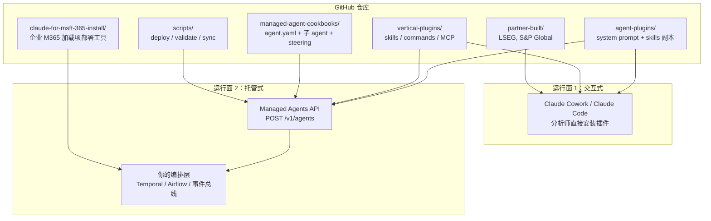

> **目标读者**：想搞清楚 Anthropic 如何把金融工作流做成可安装智能体的开发者、平台团队与金融科技从业者
> **核心判断**：这个仓库交付的是一套把投行、行研、私募和基金运营的工作流拆成 agent、skill、command 和 connector 的参考实现——同一份 prompt 和 skill，可以在 Cowork 里交互式用，也可以通过 Managed Agents API 挂到自家编排层后面
> **资料基线**：本文以 [anthropics/financial-services](https://github.com/anthropics/financial-services) 仓库 README、managed-agent-cookbooks 目录说明和若干 agent guardrail 文档为准，全文事实已对照 2026 年 9 月 28 日的主干逐条复核。仓库内容会随版本更新，文中涉及的 agent 数量、skill 数量、连接器数量以该日主干为准；与 5 月发文时相比的可见变化是 wealth-management 垂直包已从仓库移除、数据连接器从 11 个增至 12 个
> **预计阅读时间**：22 - 30 分钟

> **快速信息卡**（2026-09-28 读数）
> - **Stars**: 37,826
> - **Forks**: 5,462
> - **License**: Apache-2.0
> - **语言**: Python
> - **最后更新**: 2026-09-21

**学习目标**：读完后你能判断的几件事：
- GitHub 仓库、插件市场源名、Managed Agent（托管智能体）模板这三层各自管什么、边界在哪
- 你的团队该直接装命名 agent，还是只装一块 vertical plugin
- 这个仓库能产出哪些分析产物，又有哪些合规和操作底线绝对不能碰
- 一套典型的金融工作流从触发到产出，在不同运行面上经历了什么

| → | [分层图](#一张图看懂整个仓库的分层) | [是什么](#1-它到底是什么) | [易混点](#2-第一次读容易搞混的三件事) | [目录拆解](#3-仓库逐层拆开看) | [agent 列表](#4-现在有哪些-agent它们各自能干到什么程度) | [skills/commands](#5-skills-和-commands比-agent-列表更有复用价值的那层) | [任务流案例](#6-一次具体的工作流pitch-agent-从触发到产出经历了什么) | [MCP](#7-mcp-连接器离生产最近的那层也是最远的那层) | [三条路径](#8-三种进入路径和一套务实的试装顺序) | [M365](#9-补充一块容易被跳过的内容microsoft-365-部署工具) | [工程价值](#10-这个仓库为什么值得研究不止于金融) | [边界](#11-使用前要接受的边界) | [决策表](#12-按你团队的情况做选择) |

## 一张图看懂整个仓库的分层

在深入任何细节之前，先把最容易混淆的几层结构摊开。这张图覆盖了从 GitHub 源代码到两种使用形态的完整链路：


```mermaid
graph TD
    subgraph Source["GitHub 仓库"]
        direction LR
        A["agent-plugins/<br/>system prompt + skills 副本"]
        B["vertical-plugins/<br/>skills / commands / MCP"]
        C["partner-built/<br/>LSEG, S&P Global"]
        D["managed-agent-cookbooks/<br/>agent.yaml + 子 agent + steering"]
        E["claude-for-msft-365-install/<br/>企业 M365 加载项部署工具"]
        F["scripts/<br/>deploy / validate / sync"]
    end

    subgraph Runway1["运行面 1：交互式"]
        G["Claude Cowork / Claude Code<br/>分析师直接安装插件"]
    end

    subgraph Runway2["运行面 2：托管式"]
        H["Managed Agents API<br/>POST /v1/agents"]
        I["你的编排层<br/>Temporal / Airflow / 事件总线"]
    end

    A --> G
    B --> G
    C --> G
    A --> H
    B --> H
    D --> H
    H --> I
    E --> I
    F --> H
```

图上能读出两条关键信息：

`agent-plugins/<slug>/agents/<slug>.md` 放的是核心系统提示词，`managed-agent-cookbooks/<slug>/agent.yaml` 再去引用同一份内容，把它解析成 `POST /v1/agents` 所需的配置。Anthropic 没有为 Cowork 和 Managed Agents 分别维护两套 prompt——上层运行面可以不同，底层知识源保持同一份。这样设计的好处是：当投行团队在 Cowork 里调完一版 pitch agent 的 prompt，平台团队把它搬上 Managed Agents 时，不需要再做一次 prompt 对齐，两边天然看到同一套规则。

`vertical-plugins/` 里的 skills 是"源"，`agent-plugins/<slug>/skills/` 是"副本"。每个命名 agent 把要用的 skills 打包了一份，装 agent 时不需要额外补装 vertical plugin。但如果只需拿 `/comps`、`/dcf`、`/earnings` 这样的单条命令，直接从 vertical plugin 装会更干净。仓库里还配了 `scripts/sync-agent-skills.py`，用来在修改 vertical 源文件后把更新推到所有打包了该 skill 的 agent。这套源/副本分离的设计解决了一个具体问题：业务团队改 skill 源文件后，所有引用它的 agent 能批量同步，避免副本漂移导致不同 agent 行为不一致。

## 1. 它到底是什么

Anthropic 把这个项目命名为 [Claude for Financial Services](https://github.com/anthropics/financial-services)，但仓库定位写得很克制：它是"金融服务常见工作流的参考 agents、skills 和 data connectors"，明确不提供开箱即用的金融 SaaS。

仓库不承诺替你完成投资决策，也不宣称可以直接接管审批、入账或交易执行。它交付的是一套按行业语境写好的工作流骨架：提示词怎么拆、技能怎么组织、哪些斜杠命令该显式暴露、数据从哪里接进来、哪些环节必须留人工签字。真正把它带进生产的，还是你自己的数据权限、模板、术语、审阅制度和编排层。

README 开头的声明写得很直白：这里的内容不构成投资、法律、税务或会计建议；所有 agent 产出的是分析师工作底稿，必须由有资质的专业人士复核。这段话定义了整个仓库的设计边界——每个 agent 的终点是"交出第一版底稿，等人签字"，到不了"完成一个金融动作"这一步。这个边界来自金融行业对留痕和复核的硬性要求：监管要求每个关键判断都能追溯到具体的人，agent 可以做重体力活，但签字责任必须留在人手里。

## 2. 第一次读容易搞混的三件事

公开仓库是 [anthropics/financial-services](https://github.com/anthropics/financial-services)。但安装命令里出现的名字是两个：`claude plugin marketplace add anthropics/financial-services` 添加市场时用的是 GitHub 路径，装插件时的后缀却是 `@claude-for-financial-services`。

后缀来自仓库内 `.claude-plugin/marketplace.json` 的 `name` 字段——插件市场的源名叫 `claude-for-financial-services`，和 GitHub 仓库名不是一回事。市场源名是装好之后引用插件用的标识，GitHub 路径是拉取代码用的地址。两套名字对应两套用途，不搞清楚这一点，第一次看安装命令就会疑惑为什么一个命令里出现两个名字。

**命名 agent 和 vertical plugin 不是一回事。** README 里最显眼的是 Pitch Agent、Market Researcher、GL Reconciler 这些命名 agent——它们是端到端工作流入口，装完就能跑完整任务。但仓库底层还有一层 vertical plugins：它们承载可复用的 skills、slash commands 和 MCP connectors，按投行、行研、私募、基金运营等垂直场景分组。如果你只想要 `/comps`、`/dcf`、`/earnings` 这样的单条能力，不需要整套 agent，从 vertical plugin 入手更合适。

**这是参考模板，不是即插即用的生产系统。** 仓库内容几乎都是 Markdown、JSON 和 YAML——没有构建系统，没有二进制分发，没有 docker-compose。你可以直接装起来试，但只要牵涉真实金融数据、内部术语、PPT 模板、Excel 模板、审批链路或监管留痕，几乎都要做二次定制。Anthropic 给的是一套"你们公司往里塞自己流程和约束"的骨架，不是一个封闭产品。

## 3. 仓库逐层拆开看

```text
plugins/
  agent-plugins/                     ← 10 个命名 agent，每个是自包含插件
    pitch-agent/agents/pitch-agent.md
    gl-reconciler/agents/gl-reconciler.md
    ...
  vertical-plugins/                  ← 6 组垂直能力包 + MCP 连接器
    financial-analysis/              ← 核心：全部建模技能和 12 个数据连接器
    investment-banking/
    equity-research/
    private-equity/
    fund-admin/
    operations/
  partner-built/                     ← 第三方数据商插件
    lseg/
    spglobal/
managed-agent-cookbooks/             ← 10 个 agent 的托管部署模板
  pitch-agent/agent.yaml
  ...
claude-for-msft-365-install/         ← M365 加载项企业部署工具
scripts/                             ← deploy / check / validate / sync / orchestrate
```

这套目录把复用边界划开了。命名 agent 管一条工作流的端到端执行。Vertical plugin 管可复用的领域技能和命令。Managed Agent cookbook 把同一套 system prompt 和 skills 包装成可通过 API 托管部署的形式。分析师和平台团队看到的是不同的运行面，底层的 prompt 和 skill 来源不变。

这个仓库是 file-based 的，主体内容就是 Markdown、JSON、YAML。没有构建系统，没有二进制分发，没有 docker-compose。Anthropic 把复杂度放在了内容组织、引用关系和部署脚本上，没有放在代码框架上。这种取舍基于一个实际判断：行业 agent 场景里真正频繁变化的是流程、模板、规则和数据接入方式，代码本身相对稳定。Markdown 比代码更容易被业务团队读懂和修改，业务侧改 skill 时不需要走开发提测流程——这降低了运营成本，代价是失去了类型检查和编译期校验。

## 4. 现在有哪些 agent，它们各自能干到什么程度

截至 2026 年 9 月核对时，README 列出了 10 个命名 agent，按 4 组理解最清晰：

| 职能 | Agent | 它产出的是"第一版底稿"，到不了"结论"这一步 |
| ------ | ------ | ------ |
| Coverage & advisory | Pitch Agent | comps、precedents、LBO → 品牌化 pitch deck |
| | Meeting Prep Agent | 客户会前简报包整理 |
| Research & modeling | Market Researcher | 行业/主题研究框架搭建、竞争格局、comps、标的短名单 |
| | Earnings Reviewer | 财报+电话会 → 模型更新 → 点评草稿 |
| | Model Builder | 在 Excel 中生成 DCF、LBO、三张报表或 comps 模型 |
| Fund admin & finance ops | Valuation Reviewer | 消化 GP 材料 → 估值模板 → LP 报告底稿 |
| | GL Reconciler | 找总账与子账差异、追根因、路由给人工签核 |
| | Month-End Closer | 月结中的计提、roll-forward 和差异说明 |
| | Statement Auditor | LP 报表分发前的审计与勾稽 |
| Operations & onboarding | KYC Screener | 开户文件解析、规则引擎筛查、缺口标注 |

这些名字大多对应真实岗位里能被拆出来的"第一版产物"——Pitch Agent 的终点是品牌化 pitch deck，GL Reconciler 的终点是异常报告和 controller sign-off，KYC Screener 的终点是把疑点抬出来给合规官决定，到不了"审批通过"这一步。每个 agent 的产出物都是具体的工作底稿，落到可签字的文件上。

每个 agent 的 guardrails 都写得很硬。Pitch Agent 要在模型完成后和 deck 生成后各停一次，交 banker 审核。Earnings Reviewer 要求所有数字可溯源，找不到来源就标 `[UNSOURCED]`。KYC Screener 只给建议，风险评级决定权在合规官。Anthropic 把这些约束直接写进了 agent 定义里——停下来的节点和不能自动化的判断，跟建模和 deck 生成一样，是工作流的一部分，没有作为外挂的合规备注处理。这样写的原因是金融监管对留痕的要求：每个关键判断都要能追溯到具体的人，如果 guardrail 只写在文档里而没写进 agent 定义，agent 行为和合规要求就会脱节。

> **自测**：KYC Screener 产出的终点是什么——"审批通过"还是"把疑点交给合规官"？这个设计决定了 agent 在整个 KYC 流程里扮演的角色宽度。

## 5. skills 和 commands：比 agent 列表更有复用价值的那层

如果只盯着命名 agent，会严重低估这个仓库真正可复用的部分。以 `financial-analysis` 这个核心 vertical plugin 为例，截至 2026 年 9 月核对时它承载了 13 个 skill 和 7 条 slash command，覆盖了金融建模最常用的操作：

| Skill | Command | 做的事情 |
| ------ | ------ | ------ |
| comps-analysis | `/comps` | 可比公司分析与交易倍数 |
| dcf-model | `/dcf` | DCF 估值（含 WACC 和敏感性分析） |
| lbo-model | `/lbo` | 杠杆收购模型 |
| 3-statement-model | `/3-statement-model` | 三张报表模型填充 |
| audit-xls | `/debug-model` | Excel 审计：公式追踪、硬编码检测、平衡检查 |
| clean-data-xls | — | 清洗和规范 Excel 表数据 |
| deck-refresh | — | 跨 deck 重新链接和刷新嵌入图表 |
| competitive-analysis | `/competitive-analysis` | 竞争格局与市场定位 |
| ib-check-deck | — | 检查 pitch deck 错误与一致性 |
| pptx-author | — | 在 Managed Agent 模式下生成 `.pptx` |
| xlsx-author | — | 在 Managed Agent 模式下生成 `.xlsx` |
| ppt-template-creator | `/ppt-template` | 创建可复用的 PPT 模板 skill |
| skill-creator | — | 指导创建新 skill |

其他垂直包在这个基础上各自扩展了领域专用命令：

- **investment-banking**：`/one-pager`、`/cim`、`/teaser`、`/buyer-list`、`/merger-model`、`/process-letter`、`/deal-tracker`
- **equity-research**：`/earnings`、`/earnings-preview`、`/initiate`、`/model-update`、`/morning-note`、`/sector`、`/thesis`、`/catalysts`、`/screen`
- **private-equity**：`/source`、`/screen-deal`、`/dd-checklist`、`/dd-prep`、`/unit-economics`、`/returns`、`/ic-memo`、`/portfolio`、`/value-creation`、`/ai-readiness`

不是每个垂直包都带命令。fund-admin 和 operations 只有 skill、没有 slash command——总账对账（gl-recon、break-trace）、应计（accrual-schedule）、NAV 勾稽（nav-tieout）这些技能由 agent 在工作流里自动调用，不需要分析师手动触发。仓库曾在 2026 年 9 月前提供过 wealth-management 垂直包（客户检视、财务规划、再平衡等六条命令），已在 9 月中旬的 PR #349 中移除，本文不再展开。

仓库还在 partner-built 目录下单独放了 LSEG 和 S&P Global 的插件。把第三方数据商放进一级目录，说明 Anthropic 对金融数据层的边界有清醒判断：金融工作流的数据层一家模型公司写不完，最终要和数据商生态对接。LSEG 插件管债券相对价值、互换曲线、外汇 carry、期权波动率和宏观利率监控；S&P Global 插件管 tear sheets、财报预览和融资摘要。这两个插件各自带独立的 `.mcp.json`，数据走合作方自己的通道。

> **自测**：你已经装了 Market Researcher agent，团队里的分析师还想单独用 `/earnings` 命令写季报点评。应该再装 equity-research vertical plugin 吗？提示：想想 agent 是 self-contained 的，slash commands 从哪来。

## 6. 一次具体的工作流：Pitch Agent 从触发到产出经历了什么

讲层级和模块不如跟一遍任务。下面用 Pitch Agent 做一次投行 pitch，把前面拆开的机制串起来。

**触发。** 一位投行分析师在 Cowork 里激活 Pitch Agent，输入目标公司名称和交易场景（sell-side M&A）。

**第一段：数据接入与模型构建。** Agent 先通过 MCP connector 拉数据——pitch-agent 的 cookbook 里挂了 CapIQ 和 Daloopa 两个数据源，comps 和 precedents 从这里来。`comps-analysis` skill 自动触发，生成可比公司分析。分析师审一轮后，`dcf-model` skill 启动，跑 DCF 估值。这一步结束后，agent 停下——guardrail 要求 banker 在模型阶段审核。

**第二段：deck 生成。** 审核通过后，`pitch-deck` skill 填充公司定制的 PowerPoint 模板（模板本身通过 `/ppt-template` 命令预先教给了系统）。`ib-check-deck` skill 做一致性检查。deck 生成后 agent 再次停下，第二次人工审核。

**第三段：托管部署面。** 如果平台团队决定把同一条工作流挂到后端，他们会拿 `managed-agent-cookbooks/pitch-agent/agent.yaml`，运行 `scripts/deploy-managed-agent.sh pitch-agent`（脚本支持 `--dry-run`，依赖 jq 和带 pyyaml 的 python3）。这份 manifest 声明模型为 `claude-opus-4-7`，system prompt 直接引用 `plugins/agent-plugins/pitch-agent/agents/pitch-agent.md` 这一份文件，另带 researcher、modeler、deck-writer 三个子 agent。部署脚本解析这些文件引用，上传 skills，创建 leaf-worker 子 agent，然后 POST orchestrator 到 `/v1/agents`。之后编排层通过 `scripts/orchestrate.py` 参考实现来路由 `handoff_request` 事件。

这个流程里人工卡点有两处：模型完成后一次，deck 完成后一次。两次停下来都出于同一个原因：金融场景里某些判断必须留在人手里，与模型能力是否够用无关。Pitch Agent 替分析师做了两件重体力活：跨数据源拼信息和按模板生成 deck。签字的节点没有让出去。

走 Managed Agents 路径还多一层：部署前要按 cookbook 设好数据源环境变量——pitch-agent 需要 `CAPIQ_MCP_URL` 和 `DALOOPA_MCP_URL`，manifest 里的 `${CAPIQ_MCP_URL}` 占位符由部署脚本从环境读入后替换。少了这些，命令能跑，数据接不进来。同样装完 agent，有的团队觉得效果好，有的觉得"只是演示"——差距主要出在数据层有没有接上，模型侧反倒不是瓶颈。

> **自测**：Pitch Agent 的工作流里有两个人工卡点，分别在哪两步之后？如果把这两个卡点拿掉会发生什么——答案不是"不合规"，想得更具体一些：产出物在哪个环节最可能出错？

## 7. MCP 连接器：离生产最近的那层，也是最远的那层

`financial-analysis` 核心插件集中管理所有数据连接器，截至 2026 年 9 月核对时接入的有 12 个：Daloopa、Morningstar、S&P Global、FactSet、Moody's、MT Newswires、Aiera、LSEG、PitchBook、Chronograph、Egnyte、Box。

所有连接器都写在 `plugins/vertical-plugins/financial-analysis/.mcp.json` 里，形态统一是远程 HTTP 服务——每条配置只有 `type: http` 和一个 `https://mcp.<厂商>/...` 形式的 URL，没有本地进程，没有 SDK 集成。接入动作就是把 URL 指向你有权访问的服务端点。

每个 MCP 端点通常需要供应商订阅或 API key——Anthropic 自己也写了这条注释。这带来两个直接后果：

1. 仓库提供的是"把数据接进工作流的接口形状"，数据本体仍要靠订阅。用这个仓库不等于免费用 Bloomberg 或 CapIQ 的数据。
2. 越接近生产场景，越需要把内部的系统——研究库、CRM、文档库、审计系统——通过 MCP 接进来，公开大模型本身撑不起金融工作流的数据层。

判断一个团队离真正能用还有多远，看他们装了几个 agent 意义不大，直接看 MCP 配置里填了几个有效的服务地址更准。这就是"离生产最近也是最远"的含义：接口形状已经备好，离生产只差填地址；但填地址背后牵涉订阅采购、内网打通、权限审批，这层做完才算真到生产。

## 8. 三种进入路径，和一套务实的试装顺序

同一个仓库提供 3 条进入路径，分别对应 3 类不同的角色和目标。

### 8.1 分析师直接上手：Cowork

最短路径。在 Cowork 里进 Settings → Plugins → Add plugin，粘贴 `https://github.com/anthropics/financial-services`，然后从市场列表里挑需要的 agent 和 vertical。也可以直接把 `plugins/` 下某个目录打包成 zip 上传。

优点快，适合验证"这个工作流值不值得做"。缺点堆在另一边：能控制的范围基本停在插件层，和企业自定义编排、审计、权限体系之间还有距离。

### 8.2 只拿通用能力：Claude Code + vertical plugin

不想立刻给团队装完整 agent，只想先试 `/comps`、`/dcf`、`/earnings`、`/ic-memo` 这类单条命令，用 Claude Code 装 vertical plugin 更合适：

```bash
claude plugin marketplace add anthropics/financial-services
claude plugin install financial-analysis@claude-for-financial-services
claude plugin install investment-banking@claude-for-financial-services
claude plugin install equity-research@claude-for-financial-services
```

命名 agent 是 self-contained 的，已经把需要的 skills 打包好了。如果你装的是完整 agent，通常不需要再为同一条工作流额外补装对应的 vertical plugin；只有当你需要单独暴露那些 commands 和 connectors 时才补装。

### 8.3 挂到自家平台后面：Managed Agents

目标是把这些工作流接进企业已有的审批、调度、工单或事件系统，就看 `managed-agent-cookbooks/`。每个目录提供 `agent.yaml`、子 agent 清单、steering examples 和对应 README：

```bash
export ANTHROPIC_API_KEY=sk-ant-...
scripts/deploy-managed-agent.sh gl-reconciler
```

Anthropic 在文档里标得很清楚：子 agent 委派能力 `callable_agents` 仍是 preview。这套架构已经指向多 agent 协作，但"完全自治"在当前版本里还不是默认前提。`scripts/orchestrate.py` 是参考事件循环——你仍然要自己提供编排层。

### 8.4 第一次试装的推荐顺序

1. 先在 Cowork 装一个命名 agent，确认团队是否真的需要这种工作流入口。
2. 再在 Claude Code 装 `financial-analysis` 和一个对应 vertical plugin，确认 slash commands、skills 和 connectors 是否符合实际工作习惯。
3. 只有前面两步跑通，再去看 Managed Agents，把它接进审批、调度和审计流程。

最小可试装的起点就是前面那段 4 行命令。如果是 Managed Agents 路径，部署前要按 cookbook 补齐对应数据源的 MCP 地址：Pitch Agent 用 `CAPIQ_MCP_URL` 和 `DALOOPA_MCP_URL`，Market Researcher 用 `CAPIQ_MCP_URL` 和 `FACTSET_MCP_URL`，GL Reconciler 用 `GL_MCP_URL` 和 `SUBLEDGER_MCP_URL`——每个 agent 的变量清单以它自己那份 agent.yaml 为准。

> **自测**：一个做私募尽调的 5 人小团队，没有后端开发人员。他们该从 Cowork、Claude Code + vertical plugin、还是 Managed Agents 开始？如果他们半年后招了平台工程师，又该往哪条路径迁移？

## 9. 补充一块容易被跳过的内容：Microsoft 365 部署工具

仓库里还有一个独立模块 `claude-for-msft-365-install/`，和前面讲的 agent、vertical plugin 是两套东西。

如果你的公司让 Claude 跑在 Excel、PowerPoint、Word 和 Outlook 里，通过 Microsoft 365 加载项来用，这个模块就是给 IT 管理员用的部署工具。它是 Claude Code 插件，不是 Cowork 插件，走的是企业自有云——Vertex AI、Bedrock 或内网 LLM gateway——不经过 Anthropic 的 API。走自有云的原因是金融企业对数据出境和模型调用链路有合规要求，自有云能把数据留在租户内。

安装后通过 `/claude-for-msft-365-install:setup` 启动，工具会引导管理员生成定制化的加载项清单（manifest）、授予 Azure 管理员授权、通过 Microsoft Graph 写入每个用户的路由配置。这块和前面的 agents、skills 分工很明确：部署工具负责把加载项装进租户，agents 和 skills 负责装进去之后跑什么。

## 10. 这个仓库为什么值得研究——不止于金融

这个项目的价值超出"金融行业插件集合"。Anthropic 在这里把一个强行业约束的 agent 系统拆成了几个相对稳定的层次：

- 工作流入口：命名 agent，自包含，面向端到端任务
- 领域知识：reusable skill，沉淀在 vertical plugin 里，可被多个 agent 打包引用
- 显式操作：slash command，需要分析师明确触发
- 数据与内网系统：统一走 MCP connector
- 交互式产品和托管 API 两种运行面，共享同一份 prompt 和 skill 来源

这五层拆法解决的其实是一个通用问题：当行业工作流必须同时面对"交互式使用者"和"后端自动化系统"时，知识怎么存、怎么复用、怎么保证两边看到的规则是同一套。医疗、法务、保险、供应链等强流程行业，迟早都会碰到同样的工程需求——"流程怎么拆、证据怎么留、人工在哪个节点接管、复用层怎么稳定"。

仓库不依赖构建系统的 file-based 策略、skills 源文件与 agent 副本之间的 sync 机制、partner-built 插件目录对第三方数据商生态的开放姿态——这三项各自对应一个可迁移的工程判断：内容比代码更值得版本化、复用层需要显式同步机制、数据层必须留给生态。本文不展开，但每一项都值得单独研究。

## 11. 使用前要接受的边界

这个仓库的目的是把金融专业人员从大量第一版底稿、整理、校核、拼装和标准化输出里解放出来，流程里仍然需要他们签字。

它适合做的事：

- 把 pitch、研究 note、估值底稿、KYC 缺口表、月结差异说明先起出第一版
- 把分散在数据终端、文档库、Excel 和规则表里的信息拼到同一条工作流里
- 用一致的 prompt、skills 和 connectors 把团队的实践建议固化下来

它不适合做的事：

- 直接生成有约束力的投资建议
- 绕开人工审批去执行交易、入账、开户或监管动作
- 在没有数据权限、没有模板、没有复核责任人的前提下，指望"一装即生产"

这种克制符合金融场景对 agent 设计的常规要求：agent 必须明确知道自己该停在哪一步。金融监管对留痕和复核有硬性规定，agent 自动化到哪一步就要停到哪一步，这是合规底线，与保守与否无关。

## 12. 按你团队的情况做选择

| 你的情况 | 从哪里开始 |
| ------ | ------ |
| 想先让分析师试工作流，不做系统对接 | Cowork 装一个命名 agent |
| 只想拿几条建模命令（/comps、/dcf 等） | Claude Code 装 `financial-analysis` vertical plugin |
| 投行团队，关注 deal 流程 | 装 `investment-banking` vertical plugin |
| 行研团队，关注财报和覆盖 | 装 `equity-research` vertical plugin |
| 私募团队，关注 sourcing 和尽调 | 装 `private-equity` vertical plugin |
| 想把工作流接进审批/调度/事件系统 | 看 `managed-agent-cookbooks/`，补齐编排层 |
| 公司用 M365，想在 Excel/PPT 里跑 Claude | 看 `claude-for-msft-365-install/` |
| 换了数据源（不用 FactSet 用 Bloomberg） | 改 `.mcp.json`，替换 MCP 地址 |
| 想加自己的流程和模板 | fork 仓库 → 改 skill 文件 → 跑 `sync-agent-skills.py` |

如果在"分析师试用过的工作流"和"平台团队部署的端点"之间感到割裂，矛盾的根通常不在代码，而在组织上没有把同一份 skill 源管好。这个仓库的 sync 脚本和"一套内容两种运行面"的设计，恰好能解决这个问题。

## 13. 常见踩坑

**装了 agent，但跑来跑去都没有产出数据。** 十有八九是 MCP 连接器没配。每个 agent 都依赖 `financial-analysis` 核心插件的 MCP 连接器来拉数据，而这些连接器需要供应商订阅或 API key。先检查 `.mcp.json` 里填了哪个服务的地址，再确认那个地址在你当前网络环境里确实能通。如果你用的是 Managed Agents 路径，还要确认 `CAPIQ_MCP_URL`、`FACTSET_MCP_URL` 等环境变量在部署脚本执行前已经 export 了。

**改了 skill 文件，agent 行为没变化。** 命名 agent 打包了自己的 skills 副本（在 `agent-plugins/<slug>/skills/` 下），它读的是副本，不是你改的 vertical 源文件。改完 `vertical-plugins/<vertical>/skills/` 之后，需要跑 `python3 scripts/sync-agent-skills.py` 把更新推到所有打包了该 skill 的 agent。没跑 sync 脚本就等于白改。

**Cowork 里装了 agent，但 slash commands 不出现。** slash commands 定义在 `vertical-plugins/<vertical>/commands/` 下。如果你只装了命名 agent 而没有装对应的 vertical plugin，agent 仍然能跑（因为 skills 已打包），但显式的 slash commands 不会出现在命令面板里。想用 `/comps`、`/dcf` 这类命令，要么装对应的 vertical plugin，要么确认你装的 agent 本身就暴露了这些命令。

**直接拿 `orchestrate.py` 当生产编排器。** `scripts/orchestrate.py` 自己的文件头写着 REFERENCE ONLY——它只示范事件循环的形状：订阅源 agent 的会话事件流，从输出文本里用正则提取 `handoff_request`，校验后调用 steer 把任务转给目标 agent。没有重试，没有持久化，没有失败恢复，这些都要你的编排层（Temporal、Airflow 或事件总线）自己补。它还自带一条值得照搬的安全缓解：handoff 是从模型输出文本里解析的，被处理文档里可能被注入伪造的 handoff_request，所以脚本对目标 agent 做了硬白名单、对 payload 做了 schema 校验——你自己的编排层至少要做到这两条。

**Agent 跑出来的数字和 Bloomberg 终端对不上。** agent 拉的数据来自你配置的 MCP 连接器，不是 Anthropic 自带的金融数据库。如果你配的是 FactSet，结果和 Bloomberg 不一致是正常的——数据源本身就有差异。这属于金融数据行业的常态，不构成 bug。解决办法是统一团队使用的数据源，或者写一个 cross-source reconciliation skill 来做差异说明。

## 参考

- [Anthropic 开源仓库：financial-services](https://github.com/anthropics/financial-services)
- [仓库 README](https://raw.githubusercontent.com/anthropics/financial-services/main/README.md)
- [Managed-agent cookbooks 目录](https://github.com/anthropics/financial-services/tree/main/managed-agent-cookbooks)（每个 agent 一份 `agent.yaml` 与安全说明）
- [Managed Agents 参考事件循环 orchestrate.py](https://github.com/anthropics/financial-services/blob/main/scripts/orchestrate.py)
- [Claude Cowork 产品页](https://claude.com/product/cowork)
- [Model Context Protocol (MCP) 规范](https://modelcontextprotocol.io/)

---

## 自测题

1. **仓库的三层内容（agent-plugins/、vertical-plugins/、managed-agent-cookbooks/）各自承载什么？**
   - 参考答案：agent-plugins/ 是 10 个自包含的命名 agent（system prompt + 打包的 skills 副本）；vertical-plugins/ 是按垂直场景组织的可复用 skills、slash commands 和 MCP 连接器（源文件在这层）；managed-agent-cookbooks/ 是把同一套 prompt 和 skills 包装成可通过 Managed Agents API 托管部署的模板（agent.yaml + 子 agent + steering 示例）

2. **Pitch Agent 的工作流里有两个人工卡点，分别在哪两步之后？**
   - 参考答案：模型完成后一次，deck 完成后一次。如果把这两个卡点拿掉，产出物在数字溯源、模板一致性、合规表述这几个环节最可能出错。

3. **仓库的 MCP 连接器是什么形态？接上数据的前提是什么？**
   - 参考答案：全部是远程 HTTP 服务，`.mcp.json` 里每条配置只有 `type: http` 加一个厂商端点 URL。端点通常需要供应商订阅或 API key——仓库提供接口形状，不提供数据本体。

4. **文中提到哪些写进 agent 定义的 guardrails？**
   - 参考答案：Pitch Agent 在模型完成和 deck 生成后各停一次等 banker 审核；Earnings Reviewer 要求所有数字可溯源，找不到来源标 `[UNSOURCED]`，且永不对外发布（发布需资深分析师签字）；KYC Screener 只给建议，风险评级由合规官决定。

5. **改了 vertical 源文件之后，为什么 agent 行为可能没变化？该做什么？**
   - 参考答案：命名 agent 打包了 skills 副本（`agent-plugins/<slug>/skills/`），读的是副本不是 vertical 源文件。需要跑 `python3 scripts/sync-agent-skills.py` 把更新推到所有打包了该 skill 的 agent；推送前可用 `scripts/check.py` 校验副本与源是否一致。

---

## 进阶路径

### 阶段一：分析师试用（1-2 周）
- 在 Cowork 装一个命名 agent（如 Pitch Agent 或 Market Researcher）
- 确认团队是否真的需要这种工作流入口
- 只使用 Standalone 模式，不接 MCP 连接器

### 阶段二：验证命令和技能（2-4 周）
- 在 Claude Code 装 `financial-analysis` 和一个对应 vertical plugin
- 确认 slash commands、skills 和 connectors 是否符合实际工作习惯
- 试着改一条 skill 源文件，跑 `python3 scripts/sync-agent-skills.py` 观察 agent 行为如何跟着变（仓库的 `check.py`/`validate.py` 脚本用于校验 manifest 和引用完整性）

### 阶段三：接入数据源（1-3 个月）
- 把 `.mcp.json` 里的连接器指向你有订阅的端点（FactSet、CapIQ、Daloopa 等 12 个任选）
- 在 Cowork 或 Claude Code 里跑通一条带真实数据的完整工作流（从触发到产出）
- 如果要走 Managed Agents，再按所选 cookbook 设好环境变量（`CAPIQ_MCP_URL`、`DALOOPA_MCP_URL` 等，以 agent.yaml 里的占位符为准）

### 阶段四：生产部署（3 个月+）
- 看 `managed-agent-cookbooks/`，把工作流接进审批、调度、事件系统
- 补齐编排层（Temporal / Airflow / 事件总线）
- 建立 guardrails 和人工审核节点

---

## 练习

为了把本文真正学扎实，建议你完成下面三个练习：

### 练习 1：分析一个命名 Agent 的三层结构

**任务**：选择 `anthropics/financial-services` 仓库中的一个命名 Agent（如 Pitch Agent、Market Researcher、GL Reconciler），分析它的三层结构。

**要求**：
1. 找到 `agent-plugins/<agent-slug>/agents/<agent-slug>.md` 文件，阅读系统提示词
2. 找到对应的 `vertical-plugins/<vertical>/skills/` 目录，列出所有技能
3. 找到对应的 `vertical-plugins/<vertical>/commands/` 目录，列出所有命令
4. 检查 `.mcp.json` 配置，列出所有 MCP 连接器

<details>
<summary>参考答案（以 Pitch Agent 为例）</summary>

**Agent 系统提示词**：`agent-plugins/pitch-agent/agents/pitch-agent.md`——pitch-agent 的 cookbook 就是通过 `system.file` 引用这份文件。

**Skills**（打包副本在 `agent-plugins/pitch-agent/skills/`，共 11 个）：3-statement-model、audit-xls、comps-analysis、dcf-model、deck-refresh、ib-check-deck、lbo-model、pitch-deck、pptx-author、sector-overview、xlsx-author。注意 pitch-deck 来自 investment-banking、sector-overview 来自 equity-research——一个 agent 的技能包会跨垂直包取材，这正是 sync 脚本存在的原因。

**Commands**（在 `vertical-plugins/financial-analysis/commands/` 中）：`/comps`、`/dcf`、`/lbo`、`/3-statement-model`、`/debug-model`、`/competitive-analysis`、`/ppt-template`。命令只在 vertical 层定义，agent 层不重复。

**MCP 连接器**：仓库级在 `plugins/vertical-plugins/financial-analysis/.mcp.json`（12 个远程 HTTP 端点）；pitch-agent 的托管部署另在 cookbook 的 agent.yaml 里挂 `capiq` 和 `daloopa` 两个 `mcp_toolset`。

**三层关系**：
- Agent 系统提示词（`agent-plugins/pitch-agent/agents/pitch-agent.md`）定义角色和行为边界
- Skills 提供领域知识和分析框架，源文件在 vertical 层，agent 打包同步副本
- Commands（`vertical-plugins/financial-analysis/commands/`）提供显式触发入口
- MCP 连接器（`.mcp.json` / agent.yaml 的 `mcp_servers`）连接外部数据源

</details>

---

### 练习 2：配置一个金融数据 MCP 连接器

**任务**：为 `financial-services` 仓库配置一个 MCP 连接器，让 AI 能够查询金融数据。

**要求**：
1. 选择一个你团队有订阅的 MCP 连接器（FactSet、CapIQ、Morningstar 等）
2. 在 `.mcp.json` 中添加配置
3. 测试连接器是否能正常工作（AI 是否能调用工具）
4. 验证 Skill 是否能正确注入

<details>
<summary>参考答案（以 FactSet 为例）</summary>

仓库里的连接器是远程 HTTP 端点，不是本地进程。在 `plugins/vertical-plugins/financial-analysis/.mcp.json` 的 `mcpServers` 里确认或修改 `factset` 条目（仓库自带的默认值是 `https://mcp.factset.com/mcp`）：

```json
{
  "mcpServers": {
    "factset": {
      "type": "http",
      "url": "https://mcp.factset.com/mcp"
    }
  }
}
```

**测试步骤**：
1. 确认你持有的 FactSet 订阅覆盖该 MCP 端点（README 注明"接入可能需要供应商订阅或 API key"）
2. 启动 Claude Cowork 或 Claude Code，装载 financial-analysis 插件
3. 让 Claude 拉一家公司的市场数据，观察回复是否引用了 FactSet 的数据
4. 对一个你已知答案的数字（如某公司最近一季营收）交叉核对，确认数据真的接通了

**常见问题**：
- 端点无响应：确认你的网络环境能访问 `mcp.factset.com`，企业内网常需代理放行
- 连上了但没有数据：订阅权限不含对应数据集，联系数据商开通
- 想换内部数据源：把 URL 指向公司自己的 MCP 服务即可，配置形态完全相同

</details>

---

### 练习 3：读懂官方 skill，再写一个自己的

**任务**：private-equity 垂直包自带 `ic-memo` skill（投资委员会备忘录）。先读懂它，再为你们团队流程里仓库没有覆盖的文档写一个新 skill。

**要求**：
1. 读 `plugins/vertical-plugins/private-equity/skills/ic-memo/SKILL.md`，总结它的结构：触发条件怎么写、输出结构怎么组织、有没有硬性检查项
2. 选一个你们团队特有、仓库没覆盖的文档（如内部立项周报、投后季度回顾）
3. 仿照官方 skill 的写法，在 `vertical-plugins/<对应垂直>/skills/` 下新建目录和 SKILL.md
4. 改完后跑 `python3 scripts/sync-agent-skills.py`，观察打包副本如何更新

<details>
<summary>要点提示（以官方 ic-memo 的实际写法为例）</summary>

官方 ic-memo 的 SKILL.md 分三段 Workflow：先列 Gather Inputs 清单（历史财务、尽调发现、交易条款、回报测算等缺一不可）；再给标准备忘录结构——执行摘要、公司概况、行业与市场、财务分析、投资论点、交易条款与结构、回报测算、风险因子、建议（Proceed / Pass / Conditional proceed）九节，每节标了篇幅和内容要求；最后规定输出格式（默认 .docx，可用 Markdown，财务部分必须用表格）。

写自己的 skill 时照着做四件事：

- **frontmatter**：name 和 description 决定 Claude 何时自动调用这个技能，官方 description 会写明触发语（如 "write IC memo"、"deal write-up"）
- **固定结构**：官方 skill 把每节的内容要求和页数都写死——固定结构是可签字底稿的前提
- **边界约束**：它的 Important Notes 规定"正反两方都要陈述、不淡化风险、缺输入要问而不是假设交易条款"——这和 agent 的 guardrails 是同一设计思想
- **数据来源**：先收集输入再动笔，财务表必须勾稽一致（EBITDA 桥、Sources & Uses、回报测算相互对得上），你的 skill 也要写清数据从哪来，否则 Claude 只能编

写完记得：新 skill 要进哪个 vertical、哪些 agent 需要打包它（跑 sync 脚本）、要不要配一条 slash command（在 `commands/` 下加同名 .md）。

</details>

---

## 资料口径说明

1. **来源与版本锚点**：本文事实口径为 [anthropics/financial-services](https://github.com/anthropics/financial-services) 主干 2026 年 9 月 28 日状态，关键声明（agent 清单、skills/commands 计数、MCP 连接器、环境变量、guardrails、安装命令）逐条对照该日 README、`.mcp.json`、agent 定义文件与 managed-agent-cookbooks 核实。文首信息卡的 Stars/Forks 为 2026-09-28 读数。
2. **时效边界**：这个仓库演进频繁——发文半年内就经历了 wealth-management 移除（PR #349，2026-09-11）与连接器扩容（+Box）。安装命令、目录结构与计数请以你实际拉取的版本为准，本文的核对方法（README + 目录列表 + 源文件逐条对照）可以复用。
3. **示例数据**：任务流案例中的公司名称、交易场景为说明性设定，非真实业务数字。
4. **功能边界**：本文描述仓库当前状态，Anthropic 可能在不通知的情况下调整 agent 功能、增删 skills/commands/connectors。
5. **合规要求**：受监管金融机构在将 AI 生成内容用于分析报告、投资建议或决策支持前，请先完成内部合规审批。

---

