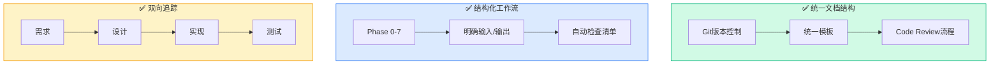
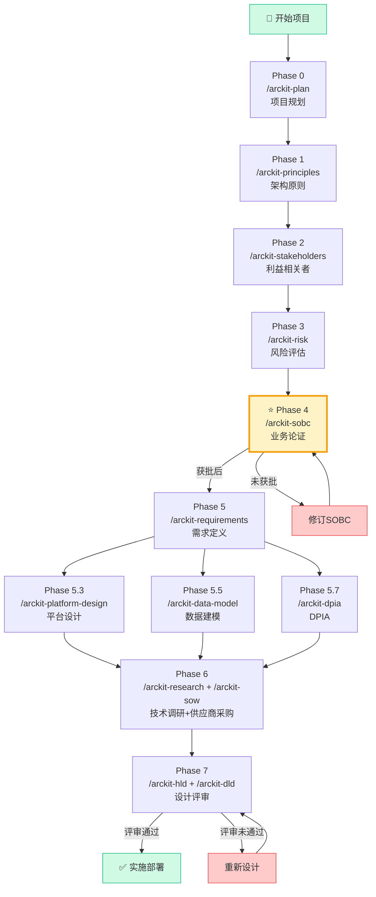
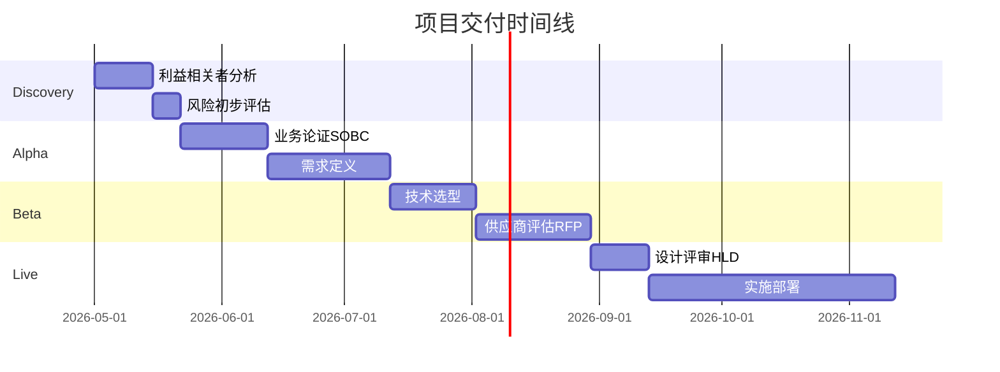
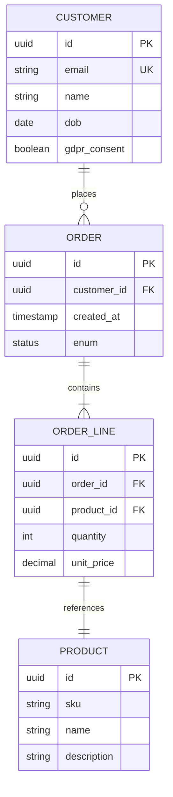
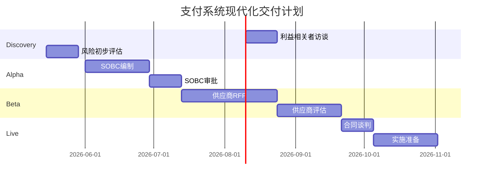
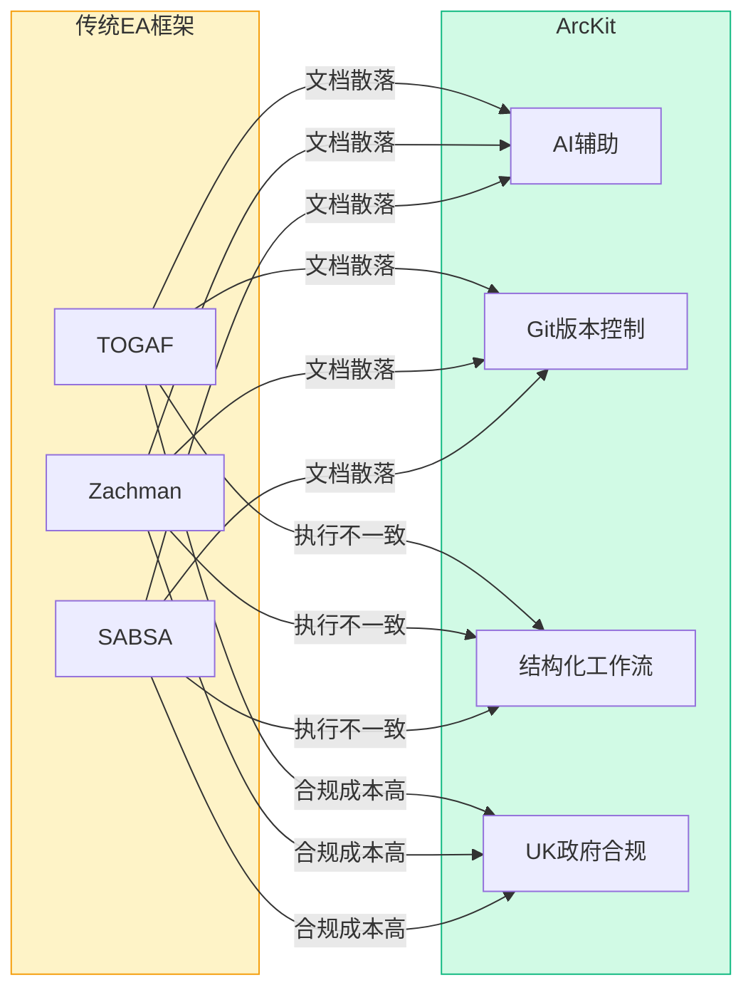
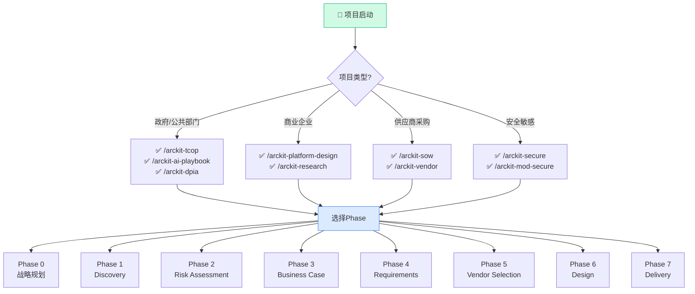

# ArcKit:785 Stars的企业架构治理与供应商采购工具包--从入门到精通

> **目标读者**:企业架构师、IT项目经理、数字化转型负责人、政府信息化部门、供应商采购人员
> **预计阅读时间**:50-70分钟
> **前置知识**:对企业架构有基础了解、有过项目管理或采购经验
> **难度定位**:⭐⭐⭐⭐ 专家设计

---

## §1 项目概述

### 1.1 基本信息

| 属性 | 值 |
|------|-----|
| **仓库** | github.com/tractorjuice/arc-kit |
| **Stars** | 785 |
| **Forks** | 105 |
| **语言** | HTML(模板驱动) |
| **许可证** | MIT License |
| **官网** | arckit.org |
| **最新版本** | v4.6.12 |

### 1.2 项目定位

> **"Build better enterprise architecture through structured governance, vendor procurement, and design review workflows."**
> "通过结构化治理、供应商采购和设计评审工作流,构建更好的企业架构。"

ArcKit将企业架构治理从散落的文档转化为系统性、AI辅助的工作流,解决传统架构治理的三大核心问题:

| 问题 | 传统方案 | ArcKit方案 |
|------|----------|------------|
| **文档散落** | Word/Confluence/PPT各自为政 | Git版本控制+统一模板 |
| **治理执行不一致** | 依赖个人经验和意愿 | 标准化流程+自动检查 |
| **可追溯性丢失** | 需求与设计脱节 | 双向追踪矩阵 |

### 1.3 核心功能矩阵

| 功能领域 | 支持命令 | 说明 |
|----------|----------|------|
| **架构原则** | /arckit-principles | 企业架构原则制定 |
| **利益相关者** | /arckit-stakeholders | 驱动/目标/成果分析 |
| **风险管理** | /arckit-risk | HM Treasury Orange Book |
| **业务论证** | /arckit-sobc | Green Book SOBC框架 |
| **需求定义** | /arckit-requirements | 完整需求文档 |
| **数据建模** | /arckit-data-model | ERD+GDPR合规 |
| **DPIA** | /arckit-dpia | 数据保护影响评估 |
| **数据溯源** | /arckit-datascout | 外部数据源发现 |
| **技术调研** | /arckit-research | Build vs Buy分析 |
| **平台设计** | /arckit-platform-design | Wardley Mapping |
| **供应商采购** | /arckit-sow | RFP生成与管理 |
| **设计评审** | /arckit-hld / /arckit-dld | HLD/DLD评审 |
| **合规检查** | /arckit-tcop | UK Technology Code of Practice |
| **AI合规** | /arckit-ai-playbook | UK Government AI Playbook |
| **安全设计** | /arckit-secure | NCSC CAF + Cyber Essentials |
| **国防合规** | /arckit-mod-secure / /arckit-jsp-936 | MOD JSP 936 |

---

## §2 问题与解决方案

### 2.1 传统企业架构的困境

企业架构治理长期面临五大挑战:

| 挑战 | 表现 | 后果 |
|------|------|------|
| **文档散落** | Word/Confluence/PPT/Excel各自为政 | 版本混乱、找不到最新、冲突覆盖 |
| **治理执行不一致** | 依赖架构师个人经验和意愿 | 不同项目差异巨大、无法标准化 |
| **供应商选择偏见** | 商务关系影响大于技术评估 | 缺乏系统性评分框架 |
| **可追溯性丢失** | 需求→设计→实现→测试链路断裂 | 需求变更不知道影响哪些设计 |
| **文档过时** | 设计与实现不符、文档无人维护 | 架构决策失去依据 |

### 2.2 ArcKit的解决方案

ArcKit通过三个核心设计解决上述问题:



**项目目录结构示例**:

```
projects/
└── payment-modernization/
    ├── ark/
    │   ├── 00-project-plan/       # Phase 0
    │   ├── 01-principles/          # Phase 1
    │   ├── 02-stakeholders/        # Phase 2
    │   ├── 03-risk/               # Phase 3
    │   ├── 04-sobc/               # Phase 4
    │   ├── 05-requirements/        # Phase 5
    │   ├── 05c-data-model/        # Phase 5.5
    │   └── 06-research/            # Phase 6
    └── docs/
```

### 2.2 ArcKit的解决方案

```
┌─────────────────────────────────────────────────────────────┐
│                    ArcKit 解决方案                            │
│                                                              │
│  ✅ 统一模板 + Git版本控制                                   │
│  ┌─────────────────────────────────────────────────────┐   │
│  │  projects/                                          │   │
│  │  ├── principles/      架构原则                        │   │
│  │  ├── stakeholders/   利益相关者分析                   │   │
│  │  ├── risk/          风险登记册                        │   │
│  │  ├── sobc/          业务论证                         │   │
│  │  ├── requirements/   需求文档                         │   │
│  │  ├── data-model/    数据模型                          │   │
│  │  ├── research/      技术调研                          │   │
│  │  └── vendors/       供应商评估                        │   │
│  └─────────────────────────────────────────────────────┘   │
│  → 一切皆文本、版本清晰、可Code Review                       │
│                                                              │
│  ✅ AI辅助生成 + 人工审核                                   │
│  → AI快速生成初稿,架构师专注决策                           │
│                                                              │
│  ✅ 结构化工作流                                            │
│  → Phase 0-6 清晰路径,每个阶段有明确输入/输出              │
│                                                              │
│  ✅ 自动可追溯性                                            │
│  → 需求→设计→实现→测试 全链路追踪                         │
└─────────────────────────────────────────────────────────────┘
```

---

## §3 完整工作流程

### 3.1 ArcKit架构生命周期



**关键里程碑**：

| 阶段 | 审批者 | 输出物 | Gate |
|------|--------|--------|------|
| Phase 0 | 项目发起人 | 项目计划 | - |
| Phase 1 | 架构委员会 | 架构原则 | - |
| Phase 2 | 项目发起人 | 利益相关者分析 | - |
| Phase 3 | 项目发起人 | 风险登记册 | - |
| **Phase 4** | **审批委员会** | **SOBC** | **⭐ 必须获批** |
| Phase 5 | 架构师 | 需求文档 | - |
| Phase 6 | 采购委员会 | RFP+评估报告 | - |
| Phase 7 | 架构委员会 | HLD+DLD | - |

### 3.2 Phase 0: 项目规划

**`/arckit-plan`** 生成完整的项目规划和交付时间线:



### 3.3 Phase 1: 架构原则

**`/arckit-principles`** 为组织建立架构标准:

| 原则类别 | 示例 |
|----------|------|
| **云策略** | 所有新系统优先考虑云部署 |
| **安全框架** | 零信任架构,默认加密 |
| **技术标准** | API优先、微服务架构 |
| **成本治理** | FinOps实践,成本可见性 |

### 3.4 Phase 2: 利益相关者分析

**`/arckit-stakeholders`** 在业务论证之前完成,理解"谁关心这个项目":

```mermaid
flowchart LR
    subgraph StakeholderMapping [利益相关者追溯链]
        direction TB
        S1[👤 CIO] --> D1[数字化转型]
        D1 --> G1[2027年50%流程自动化]

        S2[👤 CFO] --> D2[成本优化]
        D2 --> G2[年度节省£2M]

        S3[👤 CDO] --> D3[数据驱动决策]
        D3 --> G3[数据资产货币化]
    end

    subgraph RACI [RACI矩阵]
        direction TB
        R[Responsible] A[Accountable] C[Consulted] I[Informed]
    end

    style StakeholderMapping fill:#dbeafe,stroke:#3b82f6
    style RACI fill:#fef3c7,stroke:#f59e0b
```

**RACI矩阵示例**：

| 活动 | CIO | CFO | CDO | 项目经理 |
|------|-----|-----|-----|----------|
| 制定架构原则 | A | C | C | R |
| 批准SOBC | R | A | C | C |
| 风险评估 | C | C | R | A |
| 供应商选择 | C | A | C | R |

### 3.5 Phase 3: 风险评估

**`/arckit-risk`** 使用HM Treasury Orange Book框架:

| 风险类别 | 示例风险 |
|----------|----------|
| **战略性** | 市场变化、竞争加剧 |
| **运营性** | 系统中断、数据丢失 |
| **财务性** | 预算超支、投资回报不足 |
| **合规性** | 监管处罚、数据泄露 |
| **声誉性** | 负面公关、客户流失 |
| **技术性** | 技术过时、供应商锁定 |

### 3.6 Phase 4: 业务论证(关键前置步骤)

**`/arckit-sobc`** 使用HM Treasury Green Book 5 Case模型:

> ⚠️ **重要提示**:这个阶段在开始详细需求**之前**完成!

```
┌─────────────────────────────────────────────────────────────┐
│                    Green Book 5 Case 模型                       │
│                                                              │
│  ┌─────────────────────────────────────────────────────┐   │
│  │ Case 1: Strategic                                    │   │
│  │ → 项目与组织战略的一致性                             │   │
│  └─────────────────────────────────────────────────────┘   │
│                           │                                  │
│  ┌─────────────────────────────────────────────────────┐   │
│  │ Case 2: Economic                                    │   │
│  │ → 投资回报分析、选项对比、ROI范围                    │   │
│  └─────────────────────────────────────────────────────┘   │
│                           │                                  │
│  ┌─────────────────────────────────────────────────────┐   │
│  │ Case 3: Commercial                                   │   │
│  │ → 供应商选择、合同框架、采购策略                     │   │
│  └─────────────────────────────────────────────────────┘   │
│                           │                                  │
│  ┌─────────────────────────────────────────────────────┐   │
│  │ Case 4: Financial                                    │   │
│  │ → 详细成本估算、资金安排、支付计划                   │   │
│  └─────────────────────────────────────────────────────┘   │
│                           │                                  │
│  ┌─────────────────────────────────────────────────────┐   │
│  │ Case 5: Management                                  │   │
│  │ → 治理结构、风险管控、收益实现计划                   │   │
│  └─────────────────────────────────────────────────────┘   │
└─────────────────────────────────────────────────────────────┘
```

### 3.7 Phase 5: 需求定义

**`/arckit-requirements`** 创建完整需求文档:

| 需求类型 | 说明 | 示例 |
|----------|------|------|
| **BR** | 业务需求 | "系统必须支持每日10万笔交易" |
| **FR** | 功能需求 | "系统必须提供用户认证功能" |
| **NFR** | 非功能需求 | "系统响应时间<200ms@p99" |
| **INT** | 集成需求 | "系统必须与SAP ERP集成" |
| **DR** | 数据需求 | "客户数据必须符合GDPR" |

### 3.8 Phase 5.3: 平台设计

**`/arckit-platform-design`** 使用Platform Design Toolkit设计平台战略:

```
┌─────────────────────────────────────────────────────────────┐
│                    平台设计画布                              │
│                                                              │
│  ┌─────────────────────────────────────────────────────┐   │
│  │ Supply Side (供给侧)                                │   │
│  │  • 数据提供方                                      │   │
│  │  • 服务提供方                                      │   │
│  └─────────────────────────────────────────────────────┘   │
│                           ↕                                  │
│  ┌─────────────────────────────────────────────────────┐   │
│  │ Platform Core (平台核心)                            │   │
│  │  • 交易撮合                                        │   │
│  │  • 价值交换                                        │   │
│  └─────────────────────────────────────────────────────┘   │
│                           ↕                                  │
│  ┌─────────────────────────────────────────────────────┐   │
│  │ Demand Side (需求侧)                                │   │
│  │  • 消费者                                          │   │
│  │  • 企业用户                                        │   │
│  └─────────────────────────────────────────────────────┘   │
└─────────────────────────────────────────────────────────────┘
```

### 3.9 Phase 5.5: 数据建模

**`/arckit-data-model`** 创建完整数据模型:



### 3.10 Phase 5.7: DPIA数据保护影响评估

**`/arckit-dpia`** 生成UK GDPR Article 35合规的DPIA:

| DPIA章节 | 内容 |
|----------|------|
| **必要性评估** | 处理是否必要? |
| **风险筛选** | ICO 9项标准检查 |
| **影响评估** | 对个人的影响(隐私危害、歧视) |
| **权利实现** | SAR、删除权、数据可携性 |
| **儿童数据** | 年龄核实、家长同意 |
| **AI/ML处理** | 偏见、可解释性、人工监督 |

### 3.11 Phase 6: 技术调研

**`/arckit-research`** 进行Build vs Buy分析:

```
┌─────────────────────────────────────────────────────────────┐
│                    Build vs Buy 分析框架                       │
│                                                              │
│  ┌─────────────────────────────────────────────────────┐   │
│  │ Build(自建)                                         │   │
│  │ 优势:完全控制、定制化、数据安全                      │   │
│  │ 劣势:开发周期长、需要专业团队、长期维护成本          │   │
│  └─────────────────────────────────────────────────────┘   │
│                           vs                                  │
│  ┌─────────────────────────────────────────────────────┐   │
│  │ Buy(采购)                                           │   │
│  │ 优势:快速上线、专业支持、持续更新                    │   │
│  │ 劣势:供应商锁定、定制化受限、数据控制弱              │   │
│  └─────────────────────────────────────────────────────┘   │
│                           vs                                  │
│  ┌─────────────────────────────────────────────────────┐   │
│  │ Adopt(采用现有平台)                                 │   │
│  │ 如:GOV.UK One Login、Pay、Notify                    │   │
│  └─────────────────────────────────────────────────────┘   │
│                                                              │
│  3年TCO对比 + 风险矩阵 → 决策建议                           │
└─────────────────────────────────────────────────────────────┘
```

---

## §4 UK政府合规套件

### 4.1 Technology Code of Practice (TCOP)

**`/arckit-tcop`** 评估13个TCOP点:

| 阶段 | TCOP点 | ArcKit覆盖 |
|------|--------|------------|
| **Discovery** | 1.了解用户需求 | /arckit-stakeholders |
| | 2.改善流程 | /arckit-sobc |
| **Alpha** | 3.敏捷方法 | /arckit-plan |
| | 4.模块化架构 | /arckit-requirements |
| | 5.开源优先 | /arckit-research |
| **Beta** | 6.云优先 | /arckit-principles |
| | 7.监控 | /arckit-dld |
| | 8.共享/重用 | /arckit-platform-design |
| | 9.安全合规 | /arckit-secure |
| **Live** | 10.数据最大化利用 | /arckit-datascout |
| | 11.可持续性 | NFR |
| | 12.无障碍 | NFR |
| | 13.合法合规 | /arckit-dpia |

### 4.2 AI Playbook & ATRS

**`/arckit-ai-playbook`** 生成负责任AI评估:

- AI使用场景识别
- 偏见与公平性评估
- 可解释性要求
- 人工监督机制
- 持续监控计划

### 4.3 Secure by Design

**`/arckit-secure`** 生成安全工件:

| 框架 | 覆盖内容 |
|------|----------|
| **NCSC CAF** | 网络安全评估框架13项原则 |
| **Cyber Essentials** | 基础安全控制 |
| **UK GDPR** | 数据保护控制 |

### 4.4 MOD JSP 936

**`/arckit-mod-secure`** 和 **`/arckit-jsp-936`** 针对国防AI系统:

- JSP 440安全管理
- IAMM信息保障方法论
- 安全许可路径

---

## §5 平台支持

### 5.1 多平台对比

| 平台 | 完整度 | 说明 |
|------|--------|------|
| **Claude Code Plugin** | ⭐⭐⭐⭐⭐ | 首选体验:68命令 + 10研究代理 + 5自动化钩子 |
| **Gemini CLI Extension** | ⭐⭐⭐⭐⭐ | 完整支持:68命令 + MCP服务器 |
| **GitHub Copilot** | ⭐⭐⭐⭐ | 68 prompt文件 + 10 agent定义 |
| **Codex / OpenCode CLI** | ⭐⭐⭐⭐ | 完整支持,部分bash命令需WSL |

### 5.2 Claude Code插件特有功能

ArcKit为Claude Code提供独家高级功能:

| 功能 | 说明 |
|------|------|
| **68命令** | 完整ArcKit命令集 |
| **10研究代理** | 深度研究自动化 |
| **5自动化钩子** | Session初始化、项目上下文注入、文件名强制、输出验证、影响扫描 |
| **MCP服务器捆绑** | AWS Knowledge、Microsoft Learn、Google Developer Knowledge、govreposcrape |
| **自动更新** | 通过市场自动更新 |

---

## §6 Wardley Mapping

### 6.1 什么是Wardley Mapping

Wardley Mapping是Simon Wardley创建的一种战略规划工具,通过在演化轴上定位组件(从Genesis到Commodity)来揭示竞争动态和技术成熟度。

```mermaid
wardley
    title Wardley Mapping演化轴
    axis top
    genesis[Genesis<br/>基因阶段] visible 9
    custom[Custom Built<br/>定制开发] custom 6
    product[Product<br/>产品化] product 3
    commodity[Commodity+Utility<br/>商品化/公用化] commodity 1

    genesis --> custom
    custom --> product
    product --> commodity

    style genesis fill:#fef3c7,stroke:#f59e0b
    style custom fill:#dbeafe,stroke:#3b82f6
    style product fill:#e0e7ff,stroke:#6366f1
    style commodity fill:#d1fae5,stroke:#10b981
```

**四象限定位**:

| 象限 | 特征 | 策略 |
|------|------|------|
| **I (左下)** | 不确定+定制 | 快速实验 |
| **II (右下)** | 不确定+商品 | 差异化 |
| **III (左上)** | 确定+商品 | 效率竞争 |
| **IV (右上)** | 确定+定制 | 专注核心 |

### 6.2 ArcKit中的Wardley Mapping

**`/arckit-platform-design`** 自动生成Wardley图,支持平台战略设计:

```mermaid
wardley
    title 政府数据平台Wardley图
    axis beta

    genesis_ai[AI模型定制] visible 8
    custom_api[API网关定制] custom 6
    custom_auth[身份认证定制] custom 6

    product_iaas[IaaS租赁] product 4
    product_storage[对象存储] product 4
    product_cdn[CDN服务] product 3

    commodity_compute[计算资源] commodity 2
    commodity_network[网络带宽] commodity 1
    commodity_power[电力供应] commodity 0.5

    genesis_ai --> custom_api
    custom_api --> product_iaas
    custom_auth --> product_iaas
    product_iaas --> commodity_compute
    commodity_compute --> commodity_power
    product_iaas --> product_storage
    product_storage --> product_cdn
    product_cdn --> commodity_network
```

**解读示例**:

- 计算资源(commodity_compute)位于底部,意味着这是成熟的基础设施
- 向上追溯可以看到依赖链:AI定制 → API网关 → IaaS → 计算
- 如果IaaS成为瓶颈,可以考虑向上演进(定制替代租赁)

---

## §7 实战案例

### 7.1 ArcKit命令决策树

```mermaid
flowchart TD
    START["🤔 你需要什么?"] --> Q1[是什么阶段?]

    Q1 -->|Discovery| Q2[需要什么?]
    Q2 -->|了解项目背景| P0["/arckit-plan<br/>项目规划"]
    Q2 -->|建立治理标准| P1["/arckit-principles<br/>架构原则"]
    Q2 -->|了解利益相关者| P2["/arckit-stakeholders<br/>利益相关者"]

    Q1 -->|Alpha| Q3[需要什么?]
    Q3 -->|评估风险| P3["/arckit-risk<br/>风险评估"]
    Q3 -->|论证价值| P4["/arckit-sobc<br/>业务论证 ⭐"]

    Q1 -->|Beta| Q4[需要什么?]
    Q4 -->|定义需求| P5["/arckit-requirements<br/>需求定义"]
    Q4 -->|设计平台| P5A["/arckit-platform-design<br/>Wardley Mapping"]
    Q4 -->|数据建模| P5B["/arckit-data-model<br/>ERD+GDPR"]
    Q4 -->|隐私评估| P5C["/arckit-dpia<br/>DPIA"]
    Q4 -->|评估供应商| P6R["/arckit-research<br/>技术调研"]
    Q4 -->|生成RFP| P6S["/arckit-sow<br/>供应商工作说明书"]

    Q1 -->|Live| Q5[需要什么?]
    Q5 -->|高层设计| P7H["/arckit-hld<br/>高层设计评审"]
    Q5 -->|详细设计| P7D["/arckit-dld<br/>详细设计评审"]

    Q1 -->|合规检查| Q6[什么类型?]
    Q6 -->|UK政府| TCOP["/arckit-tcop<br/>TCOP评估"]
    Q6 -->|AI系统| AIPLAY["/arckit-ai-playbook<br/>AI合规"]
    Q6 -->|安全设计| SEC["/arckit-secure<br/>Secure by Design"]
    Q6 -->|国防| MOD["/arckit-mod-secure<br/>MOD JSP 936"]

    style START fill:#d1fae5,stroke:#10b981
    style P4 fill:#fef3c7,stroke:#f59e0b,stroke-width:3px
    style P0 fill:#dbeafe,stroke:#3b82f6
    style P1 fill:#dbeafe,stroke:#3b82f6
    style P2 fill:#dbeafe,stroke:#3b82f6
    style P3 fill:#dbeafe,stroke:#3b82f6
    style P5 fill:#dbeafe,stroke:#3b82f6
```



**按场景速查表**：

| 场景 | 推荐命令 | 优先级 |
|------|----------|--------|
| "我不知道从哪开始" | /arckit-plan | ⭐⭐⭐⭐⭐ |
| "需要向领导论证项目价值" | /arckit-sobc | ⭐⭐⭐⭐⭐ |
| "要做数据处理系统" | /arckit-dpia + /arckit-data-model | ⭐⭐⭐⭐⭐ |
| "要采购供应商" | /arckit-sow + /arckit-research | ⭐⭐⭐⭐ |
| "要做UK政府项目" | /arckit-tcop | ⭐⭐⭐⭐ |
| "要用AI系统" | /arckit-ai-playbook | ⭐⭐⭐⭐ |
| "要做平台战略规划" | /arckit-platform-design | ⭐⭐⭐ |
| "要做设计评审" | /arckit-hld + /arckit-dld | ⭐⭐⭐ |

### 7.2 示例项目一览

ArcKit提供了14个完整的演示项目:

| 项目 | 领域 | 亮点 |
|------|------|------|
| NHS预约系统 | 数字健康 | NHS Spine集成+GDPR保障 |
| M365 GCC-H迁移 | 政府云 | 合规映射+变更管理 |
| HMRC税务助手 | Conversational AI | PII保护+双语支持 |
| Windows 11部署 | 企业OS | 策略迁移+安全基线 |
| 专利申请系统 | 知产 | GOV.UK Pay集成 |
| ONS数据平台 | 官方统计 | Five Safes治理 |
| GenAI平台(内阁办公室) | 政府GenAI | 负责任AI护栏 |
| 培训市场平台 | 采购 | 多边平台设计 |
| 国家高速数据架构 | 数据平台 | 战略道路网络 |
| 苏格兰法院GenAI | 司法 | MLOps+FinOps |
| 燃油价格透明 | 透明服务 | 实时数据 |
| 智能电表APP | 物联网 | DCC/SMIP集成 |
| 政府API聚合器 | 聚合 | 240+ API覆盖34+部门 |

---

## §8 快速上手

### 8.1 Claude Code插件安装

```bash
# 1. 在Claude Code中安装ArcKit插件
/plugin marketplace add tractorjuice/arc-kit

# 2. 从Discover标签页安装
# → 打开Claude Code → 左侧栏 → Plugins → Discover → 搜索ArcKit → Install

# 3. 初始化项目(自动创建目录结构)
mkdir payment-modernization && cd payment-modernization
/codex  # 或在Claude Code中
/arckit-plan  # 开始规划
```

### 8.2 命令输出示例

**`/arckit-plan` 输出示例**:

```markdown
# 项目计划:支付系统现代化

## 交付时间线

| 阶段 | 周期 | 关键里程碑 |
|------|------|-----------|
| Discovery | 4周 | 利益相关者分析完成 |
| Alpha | 8周 | SOBC获批 |
| Beta | 12周 | RFP完成 |
| Live | 6周 | 系统上线 |

## Gantt图


```

**`/arckit-sobc` 输出示例**:

```markdown
# Strategic Outline Business Case

## Case 1: Strategic
- 项目与"2027年数字化转型战略"一致 ✓
- 支持"客户体验提升"核心目标 ✓

## Case 2: Economic
| 选项 | 3年TCO | ROI | 风险 |
|------|---------|-----|------|
| 自建 | £4.2M | 18% | 高 |
| SaaS采购 | £2.8M | 32% | 中 |
| 混合模式 | £3.1M | 27% | 低 |

**推荐**: SaaS采购(最优风险收益比)

## Case 3: Commercial
- 供应商:Stripe / Adyen / Worldpay
- 合同框架:G-Cloud 14

## Case 4: Financial
- 年度成本:£840K
- 支付来源:数字化转型预算

## Case 5: Management
- 项目总监:TBC
- 治理结构:PRINCE2
```

### 8.3 实施检查清单

```markdown
## ArcKit交付检查清单

### Phase 0-4(治理基础)
- [ ] `/arckit-plan` 生成项目计划
- [ ] `/arckit-principles` 建立架构原则(已审批)
- [ ] `/arckit-stakeholders` 完成利益相关者分析
- [ ] `/arckit-risk` 完成风险登记册
- [ ] `/arckit-sobc` SOBC获批(重要里程碑!)

### Phase 5(需求)
- [ ] `/arckit-requirements` 完整需求文档
- [ ] `/arckit-data-model` ERD和数据治理
- [ ] `/arckit-dpia` DPIA审批(如适用)

### Phase 6-7(执行)
- [ ] `/arckit-research` 技术调研报告
- [ ] `/arckit-sow` RFP文档
- [ ] `/arckit-hld` 高层设计评审
- [ ] `/arckit-dld` 详细设计评审
```

### 8.4 常见陷阱

| 陷阱 | 避免方法 |
|------|----------|
| 跳过Phase 2-4直接做需求 | 必须在SOBC获批前完成 |
| 需求过于详细 | 聚焦高优先级,迭代细化 |
| 忽视NFR | NFR决定架构约束 |
| 供应商锁定 | 保留退出策略 |
| 文档过时 | 建立文档更新机制 |

---

## §9 总结

### 核心价值定位

> **ArcKit = 结构化治理 × AI辅助 × Git版本控制**

ArcKit将企业架构从"依赖专家经验的艺术"转变为"结构化可复制的科学"。

| 维度 | 传统方式 | ArcKit方式 |
|------|----------|------------|
| 治理执行 | 依赖个人经验 | 标准化流程+自动检查 |
| 文档管理 | 散落各处 | Git版本控制+统一模板 |
| 可追溯性 | 需求与设计脱节 | 双向追踪矩阵 |
| 决策方式 | 供应商主导 | 证据驱动 |

### 适用场景评分

| 场景 | 推荐度 | 理由 |
|------|--------|------|
| UK政府数字化项目 | ⭐⭐⭐⭐⭐ | 完整TCOP/AI Playbook覆盖 |
| 受监管行业 | ⭐⭐⭐⭐⭐ | DPIA + Orange Book合规 |
| 大型企业IT转型 | ⭐⭐⭐⭐ | 标准化治理框架 |
| 供应商评估 | ⭐⭐⭐⭐ | RFP + Build vs Buy分析 |
| 中小企业 | ⭐⭐⭐ | 按需选取部分命令 |
| 非UK地区 | ⭐⭐ | 合规框架偏重UK |

### ArcKit vs 传统EA框架

ArcKit与主流企业架构框架的核心差异:



| 维度 | TOGAF | Zachman | ArcKit |
|------|-------|---------|--------|
| **方法论完整性** | ⭐⭐⭐⭐⭐ | ⭐⭐⭐⭐⭐ | ⭐⭐⭐ |
| **AI辅助** | ❌ | ❌ | ✅ |
| **Git集成** | ❌ | ❌ | ✅ |
| **UK政府合规** | ⚠️需定制 | ⚠️需定制 | ✅开箱即用 |
| **学习曲线** | 陡峭(需认证) | 中等 | 平缓 |
| **实施速度** | 数月 | 数周-数月 | 数天-数周 |
| **工具支持** | 商业工具 | 商业工具 | 开源免费 |
| **供应商采购** | ⚠️需单独方法 | ⚠️需单独方法 | ✅内置 |

**ArcKit的独特价值**：
- 将严谨性与现代DevOps实践结合
- 通过AI加速文档生成，同时保持人工审核
- 专为UK公共部门设计的合规框架

### 关键成功因素

1. **Phase 4必须在Phase 5之前** —— 业务论证获批是详细需求的先决条件
2. **利益相关者分析要做在业务论证之前** —— 理解"为什么做"才能选对方案
3. **保持文档更新** —— Git工作流让文档与实现保持同步
4. **选择合适规模** —— 不是所有项目都需要完整的Phase 0-7

---


### 🚀 ArcKit速查卡（1页速览）



**核心命令速查**：

| 场景 | 命令 | 输出 |
|------|------|------|
| 架构原则 | `/arckit-principles` | 原则文档模板 |
| 利益相关者 | `/arckit-stakeholders` | RACI矩阵 |
| 风险评估 | `/arckit-risk` | Orange Book报告 |
| 业务论证 | `/arckit-sobc` | SOBC文档 |
| DPIA合规 | `/arckit-dpia` | DPIA报告 |
| 供应商评估 | `/arckit-vendor` | 评估矩阵 |
| Build vs Buy | `/arckit-research` | 分析报告 |
| Wardley图 | `/arckit-platform-design` | 图+文档 |
| 设计评审 | `/arckit-hld` / `/arckit-dld` | 评审清单 |
| TCOP合规 | `/arckit-tcop` | 合规检查 |

**Phase执行顺序**：
```
Phase 0 → Phase 1 → Phase 2 → Phase 3 → Phase 4 → Phase 5 → Phase 6 → Phase 7
   ↓          ↓          ↓          ↓          ↓          ↓         ↓
 战略      发现       风险       论证       需求      供应商      设计
                                                                 ↓
                                                              Phase 7
```

**陷阱警示**：
- ❌ 跳过Phase 2-4直接做需求 → 必须先获批SOBC
- ❌ 需求过于详细 → 聚焦高优先级,迭代细化
- ❌ 忽视NFR → NFR决定架构约束
- ❌ 供应商锁定 → 保留退出策略
- ❌ 文档过时 → 建立文档更新机制


## 相关资源

- **GitHub仓库**：https://github.com/tractorjuice/arc-kit
- **官网**：https://arckit.org/
- **示例项目**：https://github.com/tractorjuice/arckit-test-project-v7-nhs-appointment
- **最新版本**：v4.6.12
- **TOGAF官方**：https://www.opengroup.org/togaf
- **Zachman框架**：https://www.zachman.com/

---

*🦞 撰写于2026年4月19日 | 第二轮优化于2026年4月19日*
