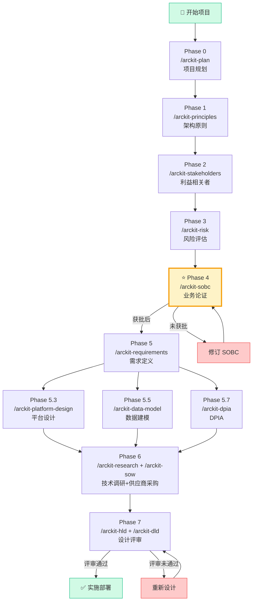
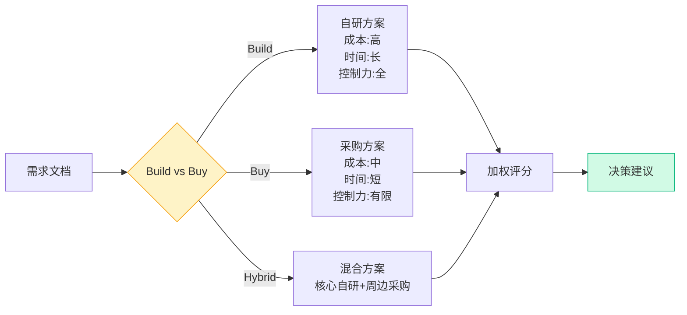
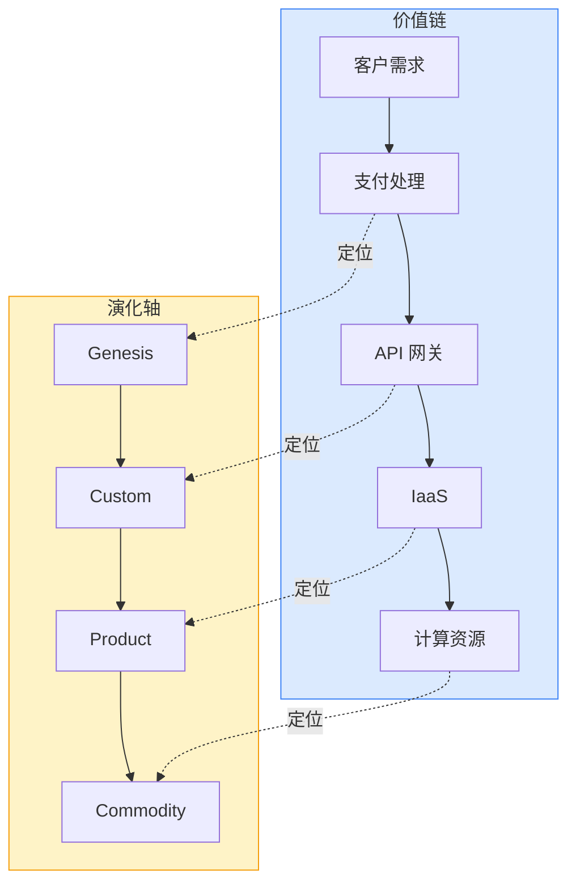
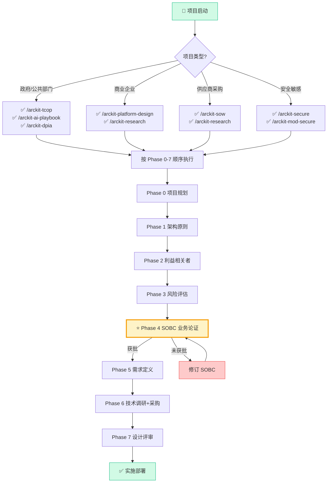

# ArcKit:企业架构治理与供应商采购工具包--从入门到精通

> **目标读者**:企业架构师、IT 项目经理、数字化转型负责人、政府信息化部门、供应商采购人员
> **预计阅读时间**:50-70 分钟
> **前置知识**:对企业架构有基础了解、有过项目管理或采购经验
> **难度定位**:⭐⭐⭐⭐ 专家设计
> **数据时效声明**:本文 Star/Fork/版本号等数据截至 2026 年 4 月 19 日撰写时;ArcKit 迭代极快(每周发版),引用前请以 [GitHub 仓库](https://github.com/tractorjuice/arc-kit) 当前数据为准。

## 一句话判断

ArcKit 把"企业架构治理"这件通常散落在 Word/Confluence/PPT 里、依赖专家经验的事,固化成一套跑在 Claude Code/Gemini CLI/Copilot/Codex/Vibe 五个 AI 编程助手里、由 75 个官方斜杠命令 + 10 个研究代理 + 5 个自动化钩子驱动的 Git 工作流。它最适合 UK 公共部门与受监管行业的中大型项目;如果你的项目不在 UK 合规框架内、或团队没有 AI 编程助手,这套工具的边际收益会大幅下降。

## 总览地图

阅读本文前,先建立四个边界清晰的认知:

| 子系统 | 边界 | 关键产物 |
|--------|------|----------|
| **文档统一层** | 解决"文档散落在哪、谁来管版本" | `projects/<project>/ark/<phase>/` 目录约定 + Git 版本控制 |
| **流程标准化层** | 解决"按什么顺序产出什么" | Phase 0-7 八阶段工作流,每阶段对应一个或多个 `/arckit-*` 命令 |
| **可追溯性层** | 解决"需求→设计→实现→测试如何串起来" | 双向追踪矩阵 + `[DOC-CN]` 引用标记 |
| **AI 辅助层** | 解决"文档初稿怎么快速生成、谁来校验" | 75 个官方命令 + 10 个研究代理 + 5 个自动化钩子 + 4 个捆绑 MCP 服务器 |

这四层同时存在,不按顺序执行:文档统一层是地基,流程标准化层定义"什么时候产出什么",可追溯性层贯穿全程,AI 辅助层加速每一阶段的初稿生成与校验。理解这四层的边界,才能判断哪些 Phase 可以裁剪、哪些命令可以跳过。

### 项目基本信息

| 属性 | 值 |
|------|-----|
| **仓库** | github.com/tractorjuice/arc-kit |
| **Stars(截至 2026-04-19)** | 785 |
| **Forks(截至 2026-04-19)** | 105 |
| **语言** | HTML(模板驱动) + Python(CLI) |
| **许可证** | MIT License |
| **官网** | arckit.org |
| **最新版本(截至 2026-04-19)** | v5.15.0 |
| **官方命令数** | 75(含社区插件共 150) |
| **支持平台** | Claude Code、Gemini CLI、GitHub Copilot、Codex/OpenCode CLI、Mistral Vibe |

### 核心功能矩阵

| 功能领域 | 支持命令 | 说明 |
|----------|----------|------|
| **架构原则** | `/arckit-principles` | 企业架构原则制定 |
| **利益相关者** | `/arckit-stakeholders` | 驱动/目标/成果分析 |
| **风险管理** | `/arckit-risk` | HM Treasury Orange Book |
| **业务论证** | `/arckit-sobc` | Green Book SOBC 框架 |
| **需求定义** | `/arckit-requirements` | 完整需求文档 |
| **数据建模** | `/arckit-data-model` | ERD+GDPR 合规 |
| **DPIA** | `/arckit-dpia` | 数据保护影响评估 |
| **数据溯源** | `/arckit-datascout` | 外部数据源发现 |
| **技术调研** | `/arckit-research` | Build vs Buy 分析 |
| **平台设计** | `/arckit-platform-design` | Wardley Mapping |
| **供应商采购** | `/arckit-sow` | RFP 生成与管理 |
| **设计评审** | `/arckit-hld` / `/arckit-dld` | HLD/DLD 评审 |
| **合规检查** | `/arckit-tcop` | UK Technology Code of Practice |
| **AI 合规** | `/arckit-ai-playbook` | UK Government AI Playbook |
| **安全设计** | `/arckit-secure` | NCSC CAF + Cyber Essentials |
| **国防合规** | `/arckit-mod-secure` / `/arckit-jsp-936` | MOD JSP 936 |

## 为什么需要 ArcKit:传统架构治理的五个断裂点

企业架构治理长期面临五个具体断裂点,每个都对应可观察的后果:

| 断裂点 | 表现 | 后果 |
|------|------|------|
| **文档散落** | Word/Confluence/PPT/Excel 各自为政 | 版本混乱、找不到最新、冲突覆盖 |
| **治理执行不一致** | 依赖架构师个人经验和意愿 | 不同项目差异巨大、无法标准化 |
| **供应商选择偏见** | 商务关系影响大于技术评估 | 缺乏系统性评分框架 |
| **可追溯性丢失** | 需求→设计→实现→测试链路断裂 | 需求变更不知道影响哪些设计 |
| **文档过时** | 设计与实现不符、文档无人维护 | 架构决策失去依据 |

ArcKit 的回应是把所有产物收进 Git 仓库的 `projects/<project>/ark/<phase>/` 目录,每个产物对应一个 Phase、一个命令、一个模板。架构师从命令生成的初稿开始做判断,不用从空白文档起步。

## 三层核心机制

### 机制一:文档统一层

所有产物落在固定的目录结构里,版本由 Git 管理,变更通过 Code Review 把关:

```
projects/
└── payment-modernization/
    ├── ark/
    │   ├── 00-project-plan/       # Phase 0
    │   ├── 01-principles/          # Phase 1
    │   ├── 02-stakeholders/        # Phase 2
    │   ├── 03-risk/               # Phase 3
    │   ├── 04-sobc/               # Phase 4
    │   ├── 05-requirements/        # Phase 5
    │   ├── 05c-data-model/        # Phase 5.5
    │   └── 06-research/            # Phase 6
    └── docs/
```

Git 相比 Confluence 的优势:Git 提供了 Confluence 缺失的三件事--行级 diff、强制 Code Review、分支隔离实验性变更。架构治理的核心矛盾是"谁在什么时候改了什么",Git 的提交历史直接回答这个问题。

### 机制二:流程标准化层

ArcKit 把架构生命周期切成 Phase 0-7 八个阶段,每个阶段有明确的输入、输出、审批者和 Gate:



**关键里程碑**:

| 阶段 | 审批者 | 输出物 | Gate |
|------|--------|--------|------|
| Phase 0 | 项目发起人 | 项目计划 | - |
| Phase 1 | 架构委员会 | 架构原则 | - |
| Phase 2 | 项目发起人 | 利益相关者分析 | - |
| Phase 3 | 项目发起人 | 风险登记册 | - |
| **Phase 4** | **审批委员会** | **SOBC** | **⭐ 必须获批** |
| Phase 5 | 架构师 | 需求文档 | - |
| Phase 6 | 采购委员会 | RFP+评估报告 | - |
| Phase 7 | 架构委员会 | HLD+DLD | - |

Phase 4 是唯一的硬 Gate:SOBC(业务论证)未获批,Phase 5 不能开始。这个设计的目的是把"为什么做这个项目"的论证,从"事后补文档"前移到"事前挡板",避免团队在没拿到预算和战略对齐前就投入需求细化。

### 机制三:可追溯性层

每个产物文件名带 `ARC-<TYPE>-<NNN>` 编号,需求、设计、实现、测试之间通过 `[DOC-CN]` 引用标记建立双向链接。变更一个需求时,可以通过引用反查所有受影响的设计文档和测试用例。

为什么不用 Jira 链接:Jira 链接是人工维护的、容易腐化;`[DOC-CN]` 标记嵌在文档正文里,由 ArcKit 的 `stale-artifact-scan` 钩子自动扫描过期引用,在每次 Claude Code 会话启动时提醒。

## 任务流案例:支付系统现代化项目

下面用一个具体案例展示任务如何流过 Phase 0-7。假设某政府部门的支付系统需要现代化,替换运行 15 年的遗留 Oracle 系统。

### Phase 0-3:Discovery(约 3 周)

1. **Phase 0**:`/arckit-plan` 生成项目计划,定义交付时间线:


2. **Phase 1**:`/arckit-principles` 与架构委员会对齐原则,典型输出包括:

| 原则类别 | 示例 |
|----------|------|
| **云策略** | 所有新系统优先考虑云部署 |
| **安全框架** | 零信任架构,默认加密 |
| **技术标准** | API 优先、微服务架构 |
| **成本治理** | FinOps 实践,成本可见性 |

3. **Phase 2**:`/arckit-stakeholders` 在业务论证之前完成,回答"谁关心这个项目":

```mermaid
flowchart LR
    subgraph StakeholderMapping [利益相关者追溯链]
        direction TB
        S1[👤 CIO] --> D1[数字化转型]
        D1 --> G1[2027 年 50%流程自动化]

        S2[👤 CFO] --> D2[成本优化]
        D2 --> G2[年度节省£2M]

        S3[👤 CDO] --> D3[数据驱动决策]
        D3 --> G3[数据资产货币化]
    end

    subgraph RACI [RACI 矩阵]
        direction TB
        R[Responsible] A[Accountable] C[Consulted] I[Informed]
    end

    style StakeholderMapping fill:#dbeafe,stroke:#3b82f6
    style RACI fill:#fef3c7,stroke:#f59e0b
```

**RACI 矩阵示例**:

| 活动 | CIO | CFO | CDO | 项目经理 |
|------|-----|-----|-----|----------|
| 制定架构原则 | A | C | C | R |
| 批准 SOBC | R | A | C | C |
| 风险评估 | C | C | R | A |
| 供应商选择 | C | A | C | R |

4. **Phase 3**:`/arckit-risk` 使用 HM Treasury Orange Book 框架,产出风险登记册:

| 风险类别 | 示例风险 |
|----------|----------|
| **战略性** | 市场变化、竞争加剧 |
| **运营性** | 系统中断、数据丢失 |
| **财务性** | 预算超支、投资回报不足 |
| **合规性** | 监管处罚、数据泄露 |
| **声誉性** | 负面公关、客户流失 |
| **技术性** | 技术过时、供应商锁定 |

### Phase 4:SOBC 业务论证(关键 Gate,约 3 周)

`/arckit-sobc` 使用 HM Treasury Green Book 5 Case 模型。这个阶段必须在详细需求**之前**完成,因为它的产出决定项目是否值得继续投入。

```
┌─────────────────────────────────────────────────────────────┐
│                    Green Book 5 Case 模型                       │
│                                                              │
│  ┌─────────────────────────────────────────────────────┐   │
│  │ Case 1: Strategic                                    │   │
│  │ → 项目与组织战略的一致性                             │   │
│  └─────────────────────────────────────────────────────┘   │
│                           │                                  │
│  ┌─────────────────────────────────────────────────────┐   │
│  │ Case 2: Economic                                    │   │
│  │ → 投资回报分析、选项对比、ROI 范围                    │   │
│  └─────────────────────────────────────────────────────┘   │
│                           │                                  │
│  ┌─────────────────────────────────────────────────────┐   │
│  │ Case 3: Commercial                                   │   │
│  │ → 供应商选择、合同框架、采购策略                     │   │
│  └─────────────────────────────────────────────────────┘   │
│                           │                                  │
│  ┌─────────────────────────────────────────────────────┐   │
│  │ Case 4: Financial                                    │   │
│  │ → 详细成本估算、资金安排、支付计划                   │   │
│  └─────────────────────────────────────────────────────┘   │
│                           │                                  │
│  ┌─────────────────────────────────────────────────────┐   │
│  │ Case 5: Management                                  │   │
│  │ → 治理结构、风险管控、收益实现计划                   │   │
│  └─────────────────────────────────────────────────────┘   │
└─────────────────────────────────────────────────────────────┘
```

5 Case 模型的设计逻辑:Strategic 回答"为什么做",Economic 回答"值不值",Commercial 回答"怎么买",Financial 回答"钱从哪来",Management 回答"怎么管"。五个 Case 互相校验--如果 Strategic 立不住,Economic 的 ROI 再高也不能做;如果 Financial 资金没落实,Commercial 的合同框架就是空谈。

### Phase 5:需求定义(SOBC 获批后)

`/arckit-requirements` 创建完整需求文档:

| 需求类型 | 说明 | 示例 |
|----------|------|------|
| **BR** | 业务需求 | "系统必须支持每日 10 万笔交易" |
| **FR** | 功能需求 | "系统必须提供用户认证功能" |
| **NFR** | 非功能需求 | "系统响应时间<200ms@p99" |
| **INT** | 集成需求 | "系统必须与 SAP ERP 集成" |
| **DR** | 数据需求 | "客户数据必须符合 GDPR" |

Phase 5 之后并行展开三条支线:

- **Phase 5.3 平台设计**:`/arckit-platform-design` 使用 Wardley Mapping 设计平台战略(详见后文)
- **Phase 5.5 数据建模**:`/arckit-data-model` 创建完整数据模型,产出 ERD 图并检查 GDPR 合规
- **Phase 5.7 DPIA**:`/arckit-dpia` 生成 UK GDPR Article 35 合规的 DPIA:

| DPIA 章节 | 内容 |
|----------|------|
| **必要性评估** | 处理是否必要 |
| **风险筛选** | ICO 9 项标准检查 |
| **影响评估** | 对个人的影响(隐私危害、歧视) |
| **权利实现** | SAR、删除权、数据可携性 |
| **儿童数据** | 年龄核实、家长同意 |
| **AI/ML 处理** | 偏见、可解释性、人工监督 |

### Phase 6:技术调研与供应商采购

`/arckit-research` 进行 Build vs Buy 分析,产出对比矩阵:



`/arckit-sow` 基于决策生成 RFP,管理供应商评估流程。

### Phase 7:设计评审

`/arckit-hld` 生成高层设计(HLD),`/arckit-dld` 生成详细设计(DLD),由架构委员会评审。评审通过后进入实施部署;未通过则回到设计修订。

## UK 政府合规套件

ArcKit 的优势集中在 UK 公共部门合规。下面四个命令覆盖了 UK 政府项目的主要合规要求。

### Technology Code of Practice(TCOP)

`/arckit-tcop` 评估 13 个 TCOP 点,每个点映射到对应的 ArcKit 命令:

| 阶段 | TCOP 点 | ArcKit 覆盖 |
|------|--------|------------|
| **Discovery** | 1.了解用户需求 | `/arckit-stakeholders` |
| | 2.改善流程 | `/arckit-sobc` |
| **Alpha** | 3.敏捷方法 | `/arckit-plan` |
| | 4.模块化架构 | `/arckit-requirements` |
| | 5.开源优先 | `/arckit-research` |
| **Beta** | 6.云优先 | `/arckit-principles` |
| | 7.监控 | `/arckit-dld` |
| | 8.共享/重用 | `/arckit-platform-design` |
| | 9.安全合规 | `/arckit-secure` |
| **Live** | 10.数据最大化利用 | `/arckit-datascout` |
| | 11.可持续性 | NFR |
| | 12.无障碍 | NFR |
| | 13.合法合规 | `/arckit-dpia` |

### AI Playbook 与 ATRS

`/arckit-ai-playbook` 生成负责任 AI 评估,覆盖:

- AI 使用场景识别
- 偏见与公平性评估
- 可解释性要求
- 人工监督机制
- 持续监控计划

### Secure by Design

`/arckit-secure` 生成安全工件:

| 框架 | 覆盖内容 |
|------|----------|
| **NCSC CAF** | 网络安全评估框架 13 项原则 |
| **Cyber Essentials** | 基础安全控制 |
| **UK GDPR** | 数据保护控制 |

### MOD JSP 936

`/arckit-mod-secure` 和 `/arckit-jsp-936` 针对国防 AI 系统:

- JSP 440 安全管理
- IAMM 信息保障方法论
- 安全许可路径

## Wardley Mapping:为什么用它

Wardley Mapping 是 Simon Wardley 创建的战略规划工具,通过在演化轴上定位组件(从 Genesis 到 Commodity)来揭示竞争动态和技术成熟度。

ArcKit 选 Wardley Mapping 的理由:Wardley Mapping 同时显示"组件现在的成熟度"和"组件在价值链中的位置",这两个维度直接对应"该自研还是采购"的决策。SWOT 只给定性判断,Porter 五力只看行业结构,都不回答"这个组件未来会演化到哪"。



**四象限定位**:

| 象限 | 特征 | 策略 |
|------|------|------|
| **I(左下)** | 不确定+定制 | 快速实验 |
| **II(右下)** | 不确定+商品 | 差异化 |
| **III(左上)** | 确定+商品 | 效率竞争 |
| **IV(右上)** | 确定+定制 | 专注核心 |

`/arckit-platform-design` 自动生成 Wardley 图,支持平台战略设计。解读示例:

- 计算资源(commodity_compute)位于底部,意味着这是成熟的基础设施,采购比自研划算
- 向上追溯可以看到依赖链:AI 定制 → API 网关 → IaaS → 计算
- 如果 IaaS 成为瓶颈,可以考虑向上演进(定制替代租赁)

## 平台支持对比

ArcKit 支持 5 个 AI 编程助手平台,Claude Code 是首要开发平台,功能最完整:

| 平台 | 完整度 | 说明 |
|------|--------|------|
| **Claude Code Plugin** | ⭐⭐⭐⭐⭐ | 首选体验:75 命令 + 10 研究代理 + 5 自动化钩子 + 4 捆绑 MCP 服务器 |
| **Gemini CLI Extension** | ⭐⭐⭐⭐⭐ | 完整支持:75 命令 + MCP 服务器 |
| **GitHub Copilot** | ⭐⭐⭐⭐ | 80 prompt 文件 + 10 agent 定义 |
| **Codex / OpenCode CLI** | ⭐⭐⭐⭐ | 完整支持,部分 bash 命令需 WSL |
| **Mistral Vibe CLI** | ⭐⭐⭐⭐ | 75 命令作为 skills + 10 专用 agents |

### Claude Code 插件特有功能

ArcKit 为 Claude Code 提供独家高级功能:

| 功能 | 说明 |
|------|------|
| **75 命令** | 完整 ArcKit 官方命令集 |
| **10 研究代理** | 研究任务自动化 |
| **5 自动化钩子** | Session 初始化、项目上下文注入、文件名强制、输出验证、影响扫描 |
| **MCP 服务器捆绑** | AWS Knowledge、Microsoft Learn、Google Developer Knowledge、govreposcrape |
| **自动更新** | 通过市场自动更新 |

为什么 Claude Code 是首要平台:ArcKit 的 5 个自动化钩子(SessionStart、文件名强制、输出验证、影响扫描、上下文注入)依赖 Claude Code 的 hooks 机制,其他平台只能通过 prompt 文件近似实现,无法做强制校验。

## 快速上手

### Claude Code 插件安装

Claude Code 是首要开发平台,推荐从这里开始。要求 Claude Code v2.1.172+(修复了 `WebFetch` 通配符域名权限规则,这是 OFFICIAL-SENSITIVE 部署中约束研究代理流量的关键):

```bash
# 1. 升级 Claude Code 到最新版本
claude install latest

# 2. 添加 ArcKit 市场
/plugin marketplace add tractorjuice/arc-kit

# 3. 安装核心插件(75 命令,UK 政府民用 + 通用企业)
claude plugin install arckit

# 4. 如需其他司法管辖区,按需安装(共 150 命令)
claude plugin install arckit arckit-{uae,fr,ca,eu,at,au,us,uk-nhs,uk-gcloud}
```

如果只想克隆插件目录(避免克隆完整 monorepo 约 100MB),使用 sparse checkout:

```bash
claude plugin marketplace add tractorjuice/arc-kit --sparse .claude-plugin arckit-claude
```

### 命令输出示例

`/arckit-plan` 输出示例(支付系统现代化交付计划):


`/arckit-sobc` 输出包含 5 Case 完整文档,每个 Case 对应一个 Markdown 文件,带 `ARC-SOBC-001` 到 `ARC-SOBC-005` 编号,便于后续追踪。

### 实施检查清单

| 检查项 | 状态 |
|--------|------|
| Claude Code 已升级到 v2.1.172+ | ☐ |
| ArcKit 市场已添加 | ☐ |
| 核心插件 `arckit` 已安装 | ☐ |
| 项目目录 `projects/<name>/ark/` 已创建 | ☐ |
| Phase 0 项目计划已生成 | ☐ |
| Phase 4 SOBC 已获审批委员会批准 | ☐ |
| `[DOC-CN]` 引用标记已扫描 | ☐ |

### 常见陷阱

| 陷阱 | 避免方法 |
|------|----------|
| 跳过 Phase 2-4 直接做需求 | 必须在 SOBC 获批前完成 |
| 需求过于详细 | 聚焦高优先级,迭代细化 |
| 忽视 NFR | NFR 决定架构约束 |
| 供应商锁定 | 保留退出策略 |
| 文档过时 | 建立文档更新机制 |

## 命令决策树

按场景速查推荐命令:



**按场景速查表**:

| 场景 | 推荐命令 | 优先级 |
|------|----------|--------|
| "我不知道从哪开始" | `/arckit-plan` | ⭐⭐⭐⭐⭐ |
| "需要向领导论证项目价值" | `/arckit-sobc` | ⭐⭐⭐⭐⭐ |
| "要做数据处理系统" | `/arckit-dpia` + `/arckit-data-model` | ⭐⭐⭐⭐⭐ |
| "要采购供应商" | `/arckit-sow` + `/arckit-research` | ⭐⭐⭐⭐ |
| "要做 UK 政府项目" | `/arckit-tcop` | ⭐⭐⭐⭐ |
| "要用 AI 系统" | `/arckit-ai-playbook` | ⭐⭐⭐⭐ |
| "要做平台战略规划" | `/arckit-platform-design` | ⭐⭐⭐ |
| "要做设计评审" | `/arckit-hld` + `/arckit-dld` | ⭐⭐⭐ |

## 示例项目一览

ArcKit 提供了 14 个完整的演示项目,覆盖不同领域:

| 项目 | 领域 | 亮点 |
|------|------|------|
| NHS 预约系统 | 数字健康 | NHS Spine 集成+GDPR 保障 |
| M365 GCC-H 迁移 | 政府云 | 合规映射+变更管理 |
| HMRC 税务助手 | Conversational AI | PII 保护+双语支持 |
| Windows 11 部署 | 企业 OS | 策略迁移+安全基线 |
| 专利申请系统 | 知产 | GOV.UK Pay 集成 |
| ONS 数据平台 | 官方统计 | Five Safes 治理 |
| GenAI 平台(内阁办公室) | 政府 GenAI | 负责任 AI 护栏 |
| 培训市场平台 | 采购 | 多边平台设计 |
| 国家高速数据架构 | 数据平台 | 战略道路网络 |
| 苏格兰法院 GenAI | 司法 | MLOps+FinOps |
| 燃油价格透明 | 透明服务 | 实时数据 |
| 智能电表 APP | 物联网 | DCC/SMIP 集成 |
| 政府 API 聚合器 | 聚合 | 240+ API 覆盖 34+部门 |

## 与主流 EA 框架对比

ArcKit 与 TOGAF、Zachman 等主流企业架构框架的主要差异:

| 维度 | TOGAF | Zachman | ArcKit |
|------|-------|---------|--------|
| **方法论完整性** | ⭐⭐⭐⭐⭐ | ⭐⭐⭐⭐⭐ | ⭐⭐⭐ |
| **AI 辅助** | ❌ | ❌ | ✅ |
| **Git 集成** | ❌ | ❌ | ✅ |
| **UK 政府合规** | ⚠️需定制 | ⚠️需定制 | ✅开箱即用 |
| **学习曲线** | 陡峭(需认证) | 中等 | 平缓 |
| **实施速度** | 数月 | 数周-数月 | 数天-数周 |
| **工具支持** | 商业工具 | 商业工具 | 开源免费 |
| **供应商采购** | ⚠️需单独方法 | ⚠️需单独方法 | ✅内置 |

ArcKit 的方法论完整性低于 TOGAF,因为它聚焦 UK 公共部门场景,不追求覆盖所有行业的通用方法论。它的优势在执行速度:从空白到 Phase 4 SOBC 初稿,Claude Code 配合 `/arckit-sobc` 通常在数小时内产出,架构师专注做判断和修订。

## 采用建议

### 推荐场景

| 场景 | 推荐度 | 理由 |
|------|--------|------|
| UK 政府数字化项目 | ⭐⭐⭐⭐⭐ | 完整 TCOP/AI Playbook 覆盖 |
| 受监管行业 | ⭐⭐⭐⭐⭐ | DPIA + Orange Book 合规 |
| 大型企业 IT 转型 | ⭐⭐⭐⭐ | 标准化治理框架 |
| 供应商评估 | ⭐⭐⭐⭐ | RFP + Build vs Buy 分析 |
| 中小企业 | ⭐⭐⭐ | 按需选取部分命令 |
| 非 UK 地区 | ⭐⭐ | 合规框架偏重 UK,需大量裁剪 |

### 采用顺序建议

1. **先试一个 Phase**:从 `/arckit-plan` 或 `/arckit-sobc` 开始,在一个真实项目上跑通单个命令,观察产出质量
2. **再跑完整 Phase 0-4**:这是 ArcKit 价值最集中的区间,Phase 5-7 可以与现有流程混用
3. **最后切换平台**:如果团队已经在用 Claude Code,直接装插件;如果在用 Copilot 或 Codex,用 `arckit init --ai <platform>` 脚手架
4. **裁剪合规命令**:非 UK 项目可以跳过 `/arckit-tcop`、`/arckit-ai-playbook`、`/arckit-mod-secure` 等 UK 专属命令,保留 `/arckit-principles`、`/arckit-stakeholders`、`/arckit-risk`、`/arckit-sobc`、`/arckit-requirements` 等通用命令

### 不推荐场景

- **没有 AI 编程助手的团队**:ArcKit 的价值 80% 来自 AI 辅助生成初稿,没有 Claude Code/Copilot 等工具,它退化为一份 Markdown 模板集合
- **快速原型/POC 项目**:Phase 0-7 的开销对 2 周内交付的 POC 过重
- **非英语团队**:命令输出和模板以英语为主,中文团队需要额外做术语对齐

### 关键成功因素

1. **Phase 4 必须在 Phase 5 之前**--业务论证获批是详细需求的先决条件
2. **利益相关者分析要做在业务论证之前**--理解"为什么做"才能选对方案
3. **保持文档更新**--Git 工作流让文档与实现保持同步,`stale-artifact-scan` 钩子会扫描过期引用
4. **选择合适规模**--不是所有项目都需要完整的 Phase 0-7,小项目可以只跑 Phase 0+4+5

## 相关资源

- **GitHub 仓库**:https://github.com/tractorjuice/arc-kit
- **官网**:https://arckit.org/
- **示例项目**:https://github.com/tractorjuice/arckit-test-project-v7-nhs-appointment
- **最新版本**:v5.15.0(截至 2026-04-19)
- **TOGAF 官方**:https://www.opengroup.org/togaf
- **Zachman 框架**:https://www.zachman.com/

---

*🦞 撰写于 2026 年 4 月 19 日 | 第二轮优化于 2026 年 4 月 19 日*
