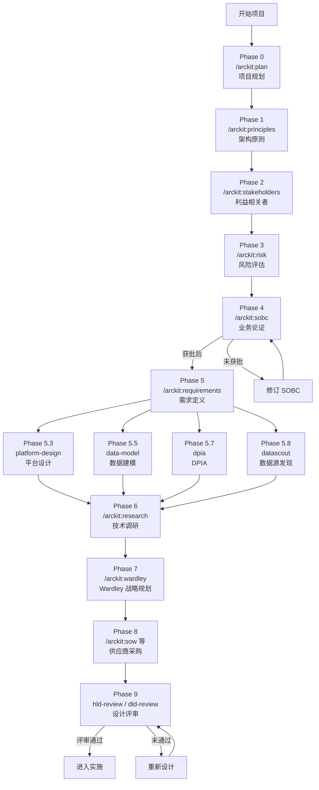
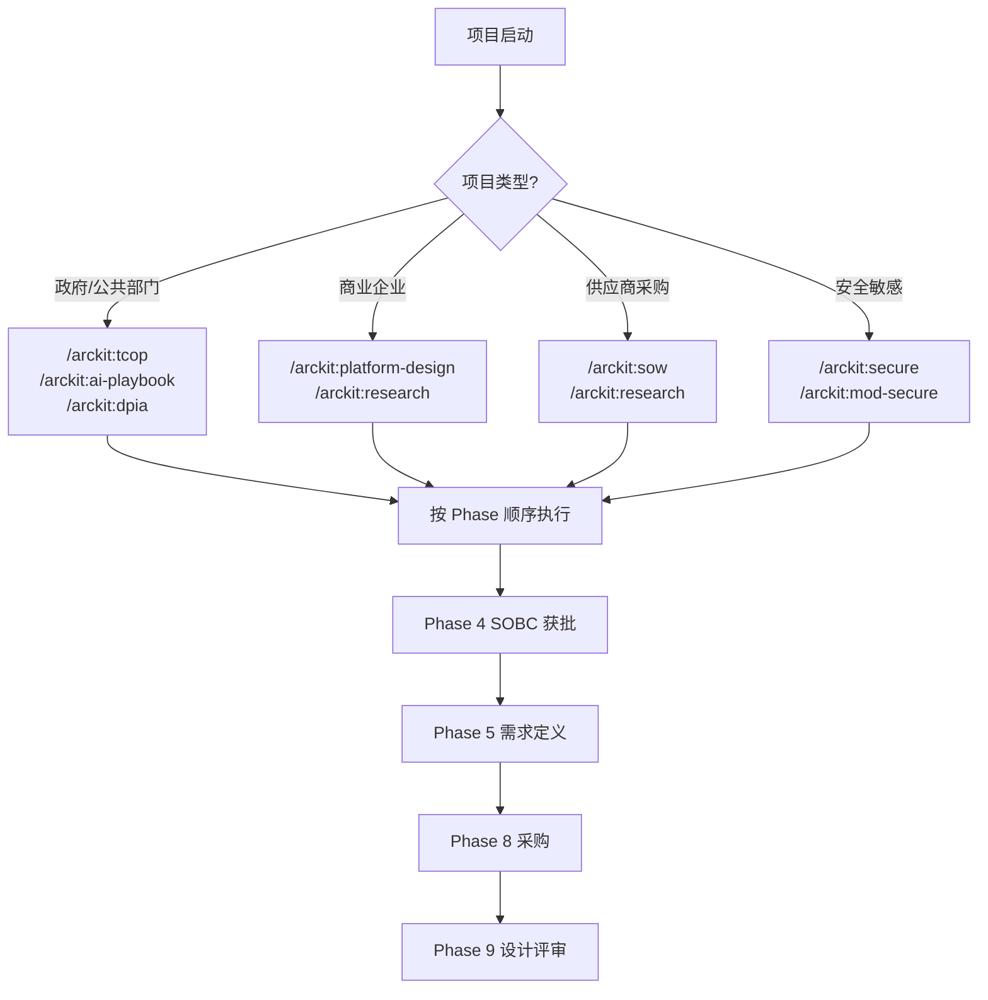

# ArcKit：把企业架构治理搬进 Git 仓库和 AI 编程助手

> **数据时效**：本文 Star/Fork/版本号等数据截至 2026-09-29（v6.16.4）。ArcKit 发版频繁，引用前请以 [GitHub 仓库](https://github.com/tractorjuice/arc-kit)当前数据为准。完整取径说明见文末「资料口径说明」。

## 一句话判断

企业架构治理的日常产出——原则、风险登记册、业务论证、需求文档、评审记录——通常散落在 Word、Confluence 和 PPT 里，质量取决于哪位架构师在写。ArcKit 的做法是把这些产出收进 Git 仓库的固定目录，用 76 个斜杠命令驱动 Claude Code、Gemini CLI 等 6 个 AI 编程助手生成初稿，人负责判断和签核。它对 UK 公共部门和受监管行业价值最大；团队没有 AI 编程助手，它就退化为一份 Markdown 模板集合。

## 总览地图

ArcKit 有四层同时存在的机制，不按顺序执行。先分清边界，才能判断哪些 Phase 可以裁剪、哪些命令可以跳过：

| 子系统 | 解决的问题 | 关键产物 |
|--------|-----------|----------|
| **文档统一层** | 文档散落、版本混乱 | `projects/<project>/ark/<phase>/` 目录约定 + Git 版本控制 |
| **流程标准化层** | 按什么顺序产出什么 | Phase 0-16 工作流，每阶段对应一个或多个命令 |
| **可追溯性层** | 需求→设计→实现→测试的链路 | `ARC-<TYPE>-<NNN>` 文件编号 + Phase 12 追溯矩阵 |
| **AI 辅助层** | 初稿生成速度与格式一致性 | 76 个官方命令 + 10 个自治研究代理 + 9 类钩子事件 + 5 个捆绑 MCP 服务器（Claude Code） |

### 项目基本信息

| 属性 | 值 |
|------|-----|
| **仓库** | github.com/tractorjuice/arc-kit |
| **Stars / Forks** | 2,250 / 282（截至 2026-09-29） |
| **最新版本** | v6.16.4（2026-09-27 发布） |
| **语言构成** | JavaScript、Python、HTML 为主；Python 提供 `arckit` CLI 脚手架，命令与模板以 Markdown/HTML 为主 |
| **许可证** | MIT（`plugins/arckit-uk-gcloud/` 目录除外，该目录专有） |
| **官网** | [arckit.org](https://arckit.org/) |
| **官方命令数** | 核心插件 76 个；另有 EU、法国、加拿大、奥地利、澳大利亚、美国、阿联酋、荷兰等司法辖区 overlay 和 NHS、金融等行业 overlay 按需安装 |
| **支持平台** | Claude Code、Gemini CLI、GitHub Copilot、Codex/OpenCode CLI、Mistral Vibe、Kimi Code CLI |

### 核心功能矩阵

| 功能领域 | 命令 | 说明 |
|----------|------|------|
| **架构原则** | `/arckit:principles` | 企业架构原则制定 |
| **利益相关者** | `/arckit:stakeholders` | 驱动/目标/成果分析 |
| **风险管理** | `/arckit:risk` | HM Treasury Orange Book 框架 |
| **业务论证** | `/arckit:sobc` | Green Book SOBC 五案模型 |
| **需求定义** | `/arckit:requirements` | BR/FR/NFR/INT/DR 完整需求 |
| **数据建模** | `/arckit:data-model` | ERD + PII 识别 + GDPR 合规 |
| **DPIA** | `/arckit:dpia` | UK GDPR Article 35 影响评估 |
| **数据溯源** | `/arckit:datascout` | 外部数据源发现与评估 |
| **技术调研** | `/arckit:research` | Build vs Buy vs Adopt 分析 |
| **战略规划** | `/arckit:wardley` | Wardley Map 战略定位 |
| **供应商采购** | `/arckit:sow` 等 | RFP 生成与供应商评估 |
| **设计评审** | `/arckit:hld-review` / `/arckit:dld-review` | HLD/DLD 评审 |
| **合规检查** | `/arckit:tcop` | UK Technology Code of Practice 13 点 |
| **AI 合规** | `/arckit:ai-playbook` | UK Government AI Playbook 与 ATRS |
| **安全设计** | `/arckit:secure` | NCSC CAF + Cyber Essentials |
| **国防合规** | `/arckit:mod-secure` / `/arckit:jsp-936` | MOD Secure by Design、JSP 936 AI 保证 |

> 命令写法因平台而异：Claude Code 与 Codex 里是 `/arckit:xxx`，Copilot 与 Mistral Vibe 里是 `/arckit-xxx`，Kimi Code CLI 里是 `/skill:arckit-xxx`。下文统一用 `/arckit:xxx`。

## 为什么需要 ArcKit：传统架构治理的五个断裂点

README 把 ArcKit 针对的问题归纳为五条，每条都能在多数组织里找到对应物：

| 断裂点 | 常见表现 | ArcKit 的回应 |
|--------|----------|---------------|
| **文档散落** | Word、Confluence、PPT 各自为政 | 所有产物收进 Git 仓库固定目录 |
| **治理执行不一致** | 质量取决于架构师个人经验和意愿 | 模板 + 命令统一产出结构 |
| **供应商评估带偏见** | 商务关系影响大于技术评估 | 加权评分框架，评分过程确定性可复查 |
| **追溯链断裂** | 需求变更不知道影响哪些设计 | 统一编号 + 追溯矩阵命令 |
| **文档过时** | 设计与实现脱节，文档无人维护 | Git 工作流让文档变更走评审 |

ArcKit 不假装能凭空解决「文档过时」——它把文档变成和代码一样走版本控制和评审的资产，让过时至少变得可见。这个边界后面还会反复出现：它产出的是**供有资质的人审查的草稿**，不是结论。

## 四层核心机制

### 机制一：文档统一层

所有产物落在固定的目录结构里，版本由 Git 管理，变更通过评审把关：

```
projects/
└── payment-modernization/
    ├── ark/
    │   ├── 00-project-plan/       # Phase 0
    │   ├── 01-principles/         # Phase 1
    │   ├── 02-stakeholders/       # Phase 2
    │   ├── 03-risk/               # Phase 3
    │   ├── 04-sobc/               # Phase 4
    │   ├── 05-requirements/       # Phase 5
    │   ├── 05c-data-model/        # Phase 5.5
    │   └── 06-research/           # Phase 6
    └── docs/
```

Git 相比 Confluence 多了三样东西：行级 diff、强制评审、用分支隔离实验性变更。架构治理的核心矛盾是「谁在什么时候改了什么、为什么」，Git 的提交历史直接回答这个问题，Confluence 的页面历史回答不了。

### 机制二：流程标准化层

ArcKit 把架构生命周期切成 Phase 0-16，主线加支线。Phase 0-9 是一条项目主线，Phase 10-16 覆盖交付后的冲刺、服务管理和收尾：


```mermaid
flowchart TD
    START[开始项目] --> P0[Phase 0<br/>/arckit:plan<br/>项目规划]
    P0 --> P1[Phase 1<br/>/arckit:principles<br/>架构原则]
    P1 --> P2[Phase 2<br/>/arckit:stakeholders<br/>利益相关者]
    P2 --> P3[Phase 3<br/>/arckit:risk<br/>风险评估]
    P3 --> P4[Phase 4<br/>/arckit:sobc<br/>业务论证]
    P4 -->|获批后| P5[Phase 5<br/>/arckit:requirements<br/>需求定义]
    P4 -->|未获批| REVISE[修订 SOBC]
    REVISE --> P4
    P5 --> P5A[Phase 5.3<br/>platform-design<br/>平台设计]
    P5 --> P5B[Phase 5.5<br/>data-model<br/>数据建模]
    P5 --> P5C[Phase 5.7<br/>dpia<br/>DPIA]
    P5 --> P5D[Phase 5.8<br/>datascout<br/>数据源发现]
    P5A & P5B & P5C & P5D --> P6[Phase 6<br/>/arckit:research<br/>技术调研]
    P6 --> P7[Phase 7<br/>/arckit:wardley<br/>Wardley 战略规划]
    P7 --> P8[Phase 8<br/>/arckit:sow 等<br/>供应商采购]
    P8 --> P9[Phase 9<br/>hld-review / dld-review<br/>设计评审]
    P9 -->|评审通过| DEPLOY[进入实施]
    P9 -->|未通过| REDESIGN[重新设计]
    REDESIGN --> P9
```

Phase 9 之后还有冲刺规划（Phase 10 `/arckit:backlog`，可导出 Jira/Azure DevOps）、ServiceNow 服务管理设计（Phase 11）、需求追溯（Phase 12）、质量保证（Phase 13）、UK/EU 合规评估（Phase 14/14.5）、项目故事与汇报（Phase 15）、文档发布（Phase 16）。这些阶段按需进入，不是每个项目都走全。

**关键里程碑**（审批者角色因组织而异，下表为 README 建议的治理形态）：

| 阶段 | 产出物 | Gate |
|------|--------|------|
| Phase 0 | 项目计划（含 GDS Discovery→Alpha→Beta→Live 时间线） | - |
| Phase 1 | 架构原则 | - |
| Phase 2 | 利益相关者分析 | - |
| Phase 3 | 风险登记册（Orange Book 六类 + 4Ts 响应） | - |
| **Phase 4** | **SOBC 业务论证（Green Book 五案模型）** | **必须获批** |
| Phase 5 | 需求文档 | - |
| Phase 6 | 技术调研报告（Build vs Buy vs Adopt + 3 年 TCO） | - |
| Phase 7 | Wardley Map 与战略建议 | - |
| Phase 8 | RFP/SOW + 供应商评估 | - |
| Phase 9 | HLD/DLD 评审报告 | 评审通过 |

Phase 4 是唯一在 README 里被明确标注「先于详细需求」的 go/no-go 决策点：SOBC 未获批，Phase 5 不该开始。这个设计的意图是把「为什么做这个项目」的论证从事后补文档前移为事前挡板，避免团队在没拿到预算和战略对齐之前就投入需求细化。

### 机制三：可追溯性层

可追溯性靠两样东西：

1. **统一编号**：每个产物文件名带 `ARC-<TYPE>-<NNN>` 编号（如 `ARC-001-REQS-v1.0.md`），需求里的 `DR-xxx`（数据需求）、DPIA 里的 `DPIA-xxx`（风险条目）互相引用。
2. **追溯命令**：Phase 12 的 `/arckit:traceability` 生成追溯矩阵，检查需求→设计→测试的覆盖与缺口。

另外，正文里的 `[DOC-CN]` 标记服务于**外部文档引用溯源**：命令在引用外部资料时记录出处和原文引语，方便复查「这个结论是从哪份文件里来的」。要注意引用反映的是抓取时刻的内容，法规和标准之后可能已经修订。

### 机制四：AI 辅助层

这是 ArcKit 和传统模板库的分界线，也是各平台支持差异最大的地方。以 Claude Code（首要开发平台）为例：

| 组件 | 数量 | 作用 |
|------|------|------|
| 官方命令 | 76 个 | 每个命令绑定模板 + 生成流程，产出固定结构的草稿 |
| 自治研究代理 | 10 个 | 市场调研、数据源发现、云服务评估等重研究任务跑在隔离子上下文里，不污染主会话 |
| 钩子事件 | 9 类 | SessionStart 自动检测版本与项目、UserPromptSubmit 注入项目上下文、PreToolUse 纠正 ARC 文件名、PermissionRequest 自动放行 MCP 文档工具、命令级 Stop 钩子校验输出（如 Wardley Map 数学一致性） |
| 捆绑 MCP 服务器 | 5 个 | AWS Knowledge、Microsoft Learn、Google Developer Knowledge、govreposcrape、uk-tenders，云调研与政府代码检索直接查权威文档 |

钩子做的事本质是把治理规则自动化：文件名不符合约定会被自动纠正，每个命令都能感知项目里已有哪些产物，生成的 Wardley 图会先过数学一致性校验再落盘。其他平台没有这套钩子机制，只能靠 prompt 文件近似。

## 任务流案例：支付系统现代化项目

用一个案例串起 Phase 0-9。以下为演示项目（示例项目库里有真实的同类交付物可对照）。

假设某政府部门的支付系统需要现代化，替换一套遗留系统。

**Phase 0-3：摸清现状（Discovery）**

1. `/arckit:plan` 生成项目计划：GDS 交付阶段（Discovery→Alpha→Beta→Live）时间线、Mermaid 甘特图、各 Gate 的批准标准。
2. `/arckit:principles` 与架构委员会对齐原则——云策略、安全框架、技术标准、成本治理。
3. `/arckit:stakeholders` 在业务论证之前完成，梳理「谁关心这个项目、为什么」：把每个利益相关者的驱动（driver）映射到 SMART 目标，再映射到可度量的成果，形成 Stakeholder→Driver→Goal→Outcome 追溯链。
4. `/arckit:risk` 按 Orange Book 2023 框架产出风险登记册：六类风险（战略、运营、财务、合规、声誉、技术），每条风险评估固有风险与剩余风险，用 4Ts（Tolerate/Treat/Transfer/Terminate）定响应策略，并关联到 RACI 矩阵里的利益相关者。

**Phase 4：SOBC 业务论证（关键 Gate）**

`/arckit:sobc` 按 Green Book 五案模型生成业务论证。这个阶段必须在详细需求之前完成，因为它的产出决定项目是否值得继续投入：

| Case | 回答的问题 |
|------|-----------|
| Strategic | 为什么做——与组织战略的一致性 |
| Economic | 值不值——选项对比、ROI 区间、回收期 |
| Commercial | 怎么买——采购策略、合同框架 |
| Financial | 钱从哪来——成本估算、资金安排 |
| Management | 怎么管——治理结构、风险管控、收益实现 |

五个 Case 互相校验：Strategic 立不住，Economic 的 ROI 再高也不能做；Financial 资金没落实，Commercial 的合同框架就是空谈。SOBC 分析「什么都不做/最小/均衡/全面」四个战略选项，收益显式映射回 Phase 2 的利益相关者目标——这是追溯链在业务层的一次落地。

**Phase 5 及支线：需求与数据**

SOBC 获批后，`/arckit:requirements` 生成需求文档，需求分五类：BR（业务）、FR（功能）、NFR（非功能）、INT（集成）、DR（数据）。之后四条支线并行：

- **Phase 5.3 平台设计**（可选）：`/arckit:platform-design` 用 Platform Design Toolkit 的八张画布设计多边平台战略——生态画布、实体角色画像、交易看板、MVP 画布等。注意这不是 Wardley Mapping，Wardley 在 Phase 7。
- **Phase 5.5 数据建模**：`/arckit:data-model` 基于 DR 需求生成 Mermaid ERD、实体目录、PII 识别与 GDPR/DPA 2018 合规检查、CRUD 矩阵。
- **Phase 5.7 DPIA**：`/arckit:dpia` 面向 UK GDPR Article 35，先跑 ICO 九项标准筛查，再评估对个人的影响、数据主体权利实现（SAR、删除、可携）、儿童数据、AI/ML 处理（偏见、可解释性、人工监督），高剩余风险会标记 ICO 事前咨询。
- **Phase 5.8 数据源发现**：`/arckit:datascout` 从需求中提取数据需求，检索 data.gov.uk、ONS、NHS Digital 等 UK 政府开放数据源与商业 API，按需求契合度、数据质量、许可成本等加权评分，未满足的需求标记为缺口。

**Phase 6-8：调研、战略与采购**

`/arckit:research` 做技术调研：从需求里动态识别品类（认证、支付、数据库……），检索商业 SaaS（定价、评价）、开源替代（GitHub 数据、社区成熟度）、UK 政府平台（GOV.UK One Login、Pay、Notify、Forms）和 G-Cloud/DOS 供应商，产出三年 TCO 对比和 Build vs Buy vs Adopt 建议，结果回填 SOBC 经济案。`/arckit:wardley`（Phase 7）画战略地图定演化位置；`/arckit:sow`（Phase 8）生成 RFP，配套 `/arckit:evaluate` 建评分框架、对比供应商提案。UK 公共部门还可以用 `/arckit:dos`（DOS 采购文档，评估框架为技术 40%、团队 30%、质量 20%、价值 10%）和 `/arckit:gcloud-search`（实时检索 Digital Marketplace 在售服务）。

**Phase 9：设计评审**

`/arckit:hld-review` 检查高层设计是否满足架构原则、需求覆盖、安全合规；`/arckit:dld-review` 检查详细设计的实现就绪度——组件规格、OpenAPI 契约、数据库模式、测试策略。评审通过进入实施，未通过回炉。这是两个**评审**命令：设计文档本身由团队编写，ArcKit 负责按固定清单审查。

## UK 政府合规套件

ArcKit 的差异化优势集中在 UK 公共部门合规，四个命令覆盖主要合规面：

**Technology Code of Practice（TCOP）**：`/arckit:tcop` 评估全部 13 个 TCOP 点并映射到交付阶段——用户需求（Point 1）对应利益相关者分析，开源优先（Point 5）对应技术调研，云优先（Point 6）对应架构原则，数据利用（Point 10）对应数据源发现，以此类推。每个点的评估结果指向对应的 ArcKit 产物作为证据。

**AI Playbook 与 ATRS**：`/arckit:ai-playbook` 按 UK Government AI Playbook 生成负责任 AI 评估（使用场景、偏见与公平性、可解释性、人工监督、持续监控），`/arckit:atrs` 生成算法透明度记录。

**Secure by Design**：`/arckit:secure` 生成 NCSC CAF（网络安全评估框架）、Cyber Essentials 和 UK GDPR 相关的安全工件。

**国防合规**：`/arckit:mod-secure` 映射 MOD Secure by Design 要求（JSP 440、IAMM、许可路径），`/arckit:jsp-936` 为国防 AI 系统生成 JSP 936 AI 保证包。

### 边界：ArcKit 明确不做什么

README 用了整整一节声明这些命令**不产生合规结论**，这是评估它时最容易误判的一点：

- 所有产物带 `Status: DRAFT`，直到有名有姓的负责人签核——签核那一刻责任转移到你的组织。
- `/arckit:dpia` 的输出不是一份完成的 DPIA：UK GDPR Article 35 把评估责任放在控制者身上，高剩余风险仍需按 Article 36 与 ICO 事前协商。
- `/arckit:secure`、`/arckit:mod-secure` 不产生保证决策——NCSC CAF 结论和 Cyber Essentials 认证由具名责任人和认证机构判定。
- `/arckit:ai-playbook`、`/arckit:atrs` 不会让一个算法工具变得合法、公平、透明——ATRS 记录由部门内部审批后发布。
- 没有任何输出是采购决策——研究、评分、评估命令只是按既定标准排序选项，决策权在高级责任负责人（SRO）和采购官。
- 引用只反映抓取时刻；生成内容由语言模型产出，研究命令抽取的第三方网页本身可能不准确。

换句话说，ArcKit 把「从空白到可审查的草稿」的成本压到很低，但审查、签核、担责这件事它明确不碰。

## Wardley Mapping：为什么它在 Phase 7

Wardley Mapping 是 Simon Wardley 创建的战略规划方法：把价值链上的组件按演化阶段（Genesis→Custom→Product→Commodity）定位，同时回答「这个组件多成熟」和「它在价值链的什么位置」——这两个维度直接对应「该自研还是采购」。SWOT 只给定性判断，Porter 五力只看行业结构，都不回答「这个组件会向哪里演化」。

`/arckit:wardley` 生成 Wardley Map 并附战略建议。解读逻辑举例（示意）：计算资源位于 Commodity 区，意味着采购比自研划算；紧邻的定制组件如果成为瓶颈，可以考虑向上演化替代。Phase 7.5 的 `/arckit:roadmap` 把地图结论拉成 3-5 年路线图（按财政年度排投资），Phase 7.7 的 `/arckit:adr` 把具体决策写成 MADR v4.0 格式的架构决策记录。

值得注意的是平台设计（Phase 5.3）和 Wardley（Phase 7)的分工：前者处理多边平台的生态结构（谁参与、什么交易、怎么冷启动），后者处理组件演化与自研/采购。两件事经常被混为一谈，ArcKit 把它们拆成了两个命令。

## 平台支持对比

ArcKit 支持 6 个 AI 编程助手平台，Claude Code 是首要开发平台，功能最完整：

| 平台 | 完整度 | 说明 |
|------|--------|------|
| **Claude Code** | ★★★★★ | 插件形式：76 命令 + 10 研究代理 + 9 类钩子 + 5 捆绑 MCP 服务器，市场自动更新 |
| **Gemini CLI** | ★★★★ | 扩展形式：76 命令 + MCP 服务器，无代理委派和钩子 |
| **GitHub Copilot** | ★★★★ | 165 个 prompt 文件（76 官方命令 + 社区 overlay）+ 10 个自定义 agent，无钩子和 MCP |
| **Codex / OpenCode CLI** | ★★★ | 核心命令功能，需 `arckit init` 脚手架；原生 Windows 下部分内联 bash 片段需 Git Bash 或 WSL2 |
| **Mistral Vibe** | ★★★★ | 76 命令作为 skills + 10 个专用 agent + 4 个 MCP 服务器 |
| **Kimi Code CLI** | ★★★★ | 插件形式：命令作为 skills（`/skill:arckit-*`）+ 6 个捆绑 MCP 服务器 |

为什么 Claude Code 体验最完整：钩子治理（文件名纠正、上下文注入、输出校验）依赖 Claude Code 的 hooks 机制，研究代理依赖子代理委派，这两样其他平台要么没有、要么只能近似。要求 Claude Code **v2.1.280+**——这个版本线累积了多个对 ArcKit 关键的修复，包括通配符域名 `WebFetch` 规则（OFFICIAL-SENSITIVE 部署中约束研究代理流量的基础）、关闭思考模式下高 effort 命令的兼容性、MCP 诊断不再打印明文密钥等。另外 ArcKit 在 Linux 上开发和测试，Windows 原生环境建议 WSL2 或 devcontainer。

## 快速上手

### Claude Code 插件安装

推荐从 Claude Code 开始。要求 v2.1.280+：

```bash
# 1. 升级 Claude Code 到最新版本
claude install latest

# 2. 在 Claude Code 里添加 ArcKit 市场
/plugin marketplace add tractorjuice/arckit-claude

# 3. 从 Discover 面板安装，或用 CLI 安装核心插件
claude plugin install arckit@arckit-claude

# 4. 按需安装其他司法管辖区 overlay（市场共 17 个插件）
claude plugin install arckit arckit-{uae,fr,ca,eu,at,au,us,uk-nhs,uk-gcloud}
```

注意市场地址是 `tractorjuice/arckit-claude`（独立插件市场仓库）；旧的 `tractorjuice/arc-kit` 市场仅为兼容保留，新安装不应再使用。Claude Code 用户无需初始化项目——插件自带一切；Copilot、Codex、OpenCode、Kimi 用户先装 `arckit` CLI（`pip install git+https://github.com/tractorjuice/arc-kit.git`），再 `arckit init my-project --ai <platform>` 生成脚手架。

### 安装检查清单

| 检查项 | 状态 |
|--------|------|
| Claude Code 已升级到 v2.1.280+ | ☐ |
| 已添加 `tractorjuice/arckit-claude` 市场 | ☐ |
| 核心插件 `arckit` 已安装 | ☐ |
| 项目目录 `projects/<name>/ark/` 已建立 | ☐ |
| Phase 0 项目计划已生成 | ☐ |
| Phase 4 SOBC 已获审批 | ☐ |

### 常见陷阱

- **跳过 Phase 2-3 直接做需求**：利益相关者分析和风险登记册是 SOBC 的输入，跳过它们，业务论证就成了空中楼阁。
- **把生成物当结论**：DPIA、安全评估、采购评分都只是草稿和输入，签核责任在人（详见「ArcKit 明确不做什么」）。
- **在原生 Windows 上硬跑**：钩子依赖 bash 和 jq，WSL2 或 devcontainer 是更省事的选择。
- **非 UK 项目不裁剪**：TCOP、AI Playbook、MOD 系列命令对非 UK 项目是纯开销，按下一节建议裁剪。

## 命令决策树

按场景速查入口命令，选定后仍按 Phase 顺序推进：


```mermaid
flowchart TD
    START[项目启动] --> Q1{项目类型?}
    Q1 -->|政府/公共部门| GOV["/arckit:tcop<br/>/arckit:ai-playbook<br/>/arckit:dpia"]
    Q1 -->|商业企业| BIZ["/arckit:platform-design<br/>/arckit:research"]
    Q1 -->|供应商采购| VENDOR["/arckit:sow<br/>/arckit:research"]
    Q1 -->|安全敏感| SEC["/arckit:secure<br/>/arckit:mod-secure"]
    GOV & BIZ & VENDOR & SEC --> PHASE[按 Phase 顺序执行]
    PHASE --> P4[Phase 4 SOBC 获批]
    P4 --> P5[Phase 5 需求定义]
    P5 --> P8[Phase 8 采购]
    P8 --> P9[Phase 9 设计评审]
```

**按场景速查表**：

| 场景 | 推荐命令 |
|------|----------|
| 不知道从哪开始 | `/arckit:plan` |
| 需要向领导论证项目价值 | `/arckit:sobc` |
| 要做数据处理系统 | `/arckit:dpia` + `/arckit:data-model` |
| 要采购供应商 | `/arckit:sow` + `/arckit:research` |
| 要做 UK 政府项目 | `/arckit:tcop` |
| 要用 AI 系统 | `/arckit:ai-playbook` |
| 要做平台战略规划 | `/arckit:platform-design`（多边平台）/ `/arckit:wardley`（演化战略） |
| 要做设计评审 | `/arckit:hld-review` + `/arckit:dld-review` |

## 示例项目一览

仓库提供了 14 个完整的公开演示项目，每个都含从 Phase 0 到评审的全套产物，适合在安装前先看产出质量：

| 项目 | 领域 | 亮点 |
|------|------|------|
| [NHS 预约系统](https://github.com/tractorjuice/arckit-test-project-v7-nhs-appointment) | 数字健康 | NHS Spine 集成 + GDPR 保障 |
| [M365 GCC-H 迁移](https://github.com/tractorjuice/arckit-test-project-v1-m365) | 政府云 | 合规映射 + 变更管理 |
| [HMRC 税务助手](https://github.com/tractorjuice/arckit-test-project-v2-hmrc-chatbot) | 对话式 AI | PII 保护 + 双语支持 |
| [Windows 11 部署](https://github.com/tractorjuice/arckit-test-project-v3-windows11) | 企业 OS | 策略迁移 + 安全基线 |
| [专利申请系统](https://github.com/tractorjuice/arckit-test-project-v6-patent-system) | 知产 | GOV.UK Pay / Notify 集成 |
| [ONS 数据平台](https://github.com/tractorjuice/arckit-test-project-v8-ons-data-platform) | 官方统计 | Five Safes 治理 |
| [内阁办公室 GenAI 平台](https://github.com/tractorjuice/arckit-test-project-v9-cabinet-office-genai) | 政府 GenAI | 负责任 AI 护栏 |
| [培训市场平台](https://github.com/tractorjuice/arckit-test-project-v10-training-marketplace) | 采购 | 多边平台设计 |
| [国家高速数据架构](https://github.com/tractorjuice/arckit-test-project-v11-national-highways-data) | 数据平台 | 战略道路网络现代化 |
| [苏格兰法院 GenAI](https://github.com/tractorjuice/arckit-test-project-v14-scottish-courts) | 司法 | MLOps + FinOps |
| [医生预约系统](https://github.com/tractorjuice/arckit-test-project-v16-doctors-appointment) | 数字健康 | NHS 集成在线预约 |
| [燃油价格透明](https://github.com/tractorjuice/arckit-test-project-v17-fuel-prices) | 透明服务 | 实时价格数据 |
| [智能电表 APP](https://github.com/tractorjuice/arckit-test-project-v18-smart-meter) | 物联网 | DCC/SMIP 集成 |
| [政府 API 聚合器](https://github.com/tractorjuice/arckit-test-project-v19-gov-api-aggregator) | 聚合 | 240+ API 覆盖 34+ 部门 |

## 与主流 EA 框架对比

| 维度 | TOGAF | Zachman | ArcKit |
|------|-------|---------|--------|
| **方法论完整性** | 完整 | 完整（分类法） | 聚焦 UK 公共部门场景 |
| **AI 辅助生成** | 无 | 无 | 内置 |
| **Git 原生工作流** | 无 | 无 | 内置 |
| **UK 政府合规** | 需定制 | 需定制 | 开箱即用 |
| **学习曲线** | 陡峭（认证体系） | 中等 | 平缓 |
| **工具支持** | 商业工具为主 | 商业工具为主 | 开源免费 |
| **供应商采购** | 需单独方法 | 需单独方法 | 内置（Phase 8） |

ArcKit 的方法论完整性不及 TOGAF，它不追求覆盖所有行业的通用方法论。它的位置是执行工具：如果团队已经在用 TOGAF，ArcKit 可以加速文档生成和治理执行（仓库还提供 `arckit-togaf-adm` overlay，9 个命令覆盖 TOGAF ADM 周期）；如果团队没有架构框架，ArcKit 可以当轻量起点。执行速度是它相对传统方法的主要优势——从空白到 SOBC 初稿通常以小时计，架构师的时间花在判断和修订上，而不是排版和填模板。

## 采用建议

**推荐场景**：

| 场景 | 推荐度 | 理由 |
|------|--------|------|
| UK 政府数字化项目 | ★★★★★ | TCOP/AI Playbook/DPIA 全覆盖 |
| 受监管行业 | ★★★★ | Orange Book 风险框架 + DPIA 流程可复用 |
| 大型企业 IT 转型 | ★★★★ | 标准化治理 + 采购套件 |
| 非 UK 地区 | ★★ | 合规命令需大幅裁剪，通用命令仍有价值 |

**采用顺序**：

1. **先试一个命令**：从 `/arckit:plan` 或 `/arckit:sobc` 开始，在一个真实项目上跑通单个命令，对照示例项目库评估产出质量。
2. **再跑 Phase 0-4**：这是 ArcKit 价值最集中的区间；Phase 5-9 可以与现有流程混用。
3. **按平台选安装方式**：团队在用 Claude Code 就直接装插件；在用 Copilot/Codex/Kimi 则走 `arckit init` 脚手架。
4. **裁剪合规命令**：非 UK 项目跳过 `/arckit:tcop`、`/arckit:ai-playbook`、`/arckit:mod-secure`、`/arckit:jsp-936` 等 UK 专属命令，保留原则、利益相关者、风险、SOBC、需求等通用命令。
5. **把治理资产当代码维护**：命令产出、模板定制都进版本控制，变更走评审——ArcKit 自己就是这么管理自己的。

**不推荐场景**：

- **没有 AI 编程助手的团队**：失去命令驱动和钩子治理后，它只是一份 Markdown 模板集合，直接拿模板更省事。
- **快速原型/POC**：Phase 0-9 的开销对两三周交付的原型过重，小项目可以只跑 Phase 0 + 4 + 5。
- **非英语团队**：命令输出和模板以英语为主，中文团队需要额外的术语对齐成本。

## 常见问题

### ArcKit 和 TOGAF 是什么关系？

不是替代关系。TOGAF 提供完整方法论，ArcKit 提供执行工具：把文档生成、追溯检查、评审清单做成命令。两件事可以叠着用——`arckit-togaf-adm` overlay 就是为此准备的。

### Phase 4 为什么是硬 Gate？

SOBC 决定项目是否值得继续投入。很多项目的失败模式是：预算和战略对齐还没落实，需求细化已经投入了几周，最后发现不值得做。Phase 4 把「为什么做」的论证前置成 go/no-go 挡板，这个顺序在 UK Green Book 体系里本身就是规范要求，ArcKit 只是把规范做成了流程。

### 非 UK 项目能用吗？

能，但要有意识地裁剪。通用命令（原则、利益相关者、风险、SOBC、需求、数据建模、技术调研、Wardley）对任何受监管行业都有价值；UK 专属命令（TCOP、AI Playbook、MOD 系列、DOS/G-Cloud 采购）对非 UK 项目是噪音。另外仓库已有 EU/法国/荷兰/奥地利/加拿大/澳大利亚/美国/阿联酋 overlay，其中 EU、法国、奥地利、加拿大、美国、阿联酋为社区维护，产出需相应司法辖区的合规人员复核。

### ArcKit 的产出能直接当合规结论用吗？

不能。所有产物都是 `Status: DRAFT` 的草稿，DPIA 不等于完成的 DPIA，安全评估不等于认证，评分排序不等于采购决策。签核那一刻，责任从工具转移到组织。这是设计立场而不是免责套话——它决定了这个工具该怎么用：生成给有资质的人看，而不是替有资质的人签字。

## 自测题

读完后，尝试回答这些问题：

1. ArcKit 的四层机制（文档统一、流程标准化、可追溯性、AI 辅助）各解决什么问题？哪一层是它与传统模板库的分界线？
2. Phase 4 为什么是硬 Gate？它产出什么、按什么框架、谁签核？
3. 平台设计（Phase 5.3）和 Wardley Mapping（Phase 7）分别处理什么问题？为什么拆成两个命令？
4. 为什么 ArcKit 把文档收进 Git 仓库？相比 Confluence 多了什么？
5. 如果你的项目不在 UK 公共部门，你会保留哪些命令、跳过哪些？裁剪的依据是什么？

## 资料口径说明

本文的判断基于以下来源和取径：

1. **仓库核实**：GitHub API 与 README（`tractorjuice/arc-kit`，v6.16.4，2026-09-29 核实）。Stars/Forks/版本/License/语言构成/命令数/平台清单/钩子与 MCP 服务器名均取自 API 响应或 README 原文。
2. **UK 政府合规框架**：[HM Treasury Green Book](https://www.gov.uk/government/publications/the-green-book-appraisal-and-evaluation-in-central-government)（业务论证）、[Orange Book](https://www.gov.uk/government/publications/orange-book)（风险管理）、[Technology Code of Practice](https://www.gov.uk/government/publications/technology-code-of-practice)（13 点，以 gov.uk 当前版本为准）。
3. **Wardley Mapping 方法论**：[Learn Wardley Mapping](https://learnwardleymapping.com/) 与 Simon Wardley 的公开材料。
4. **示例性质声明**：任务流案例为演示用的虚构场景，用于展示命令衔接方式；文中 RACI、时间线等表格均为示意。TCOP 各点与 ArcKit 命令的映射关系为本文归纳，`/arckit:tcop` 官方行为以仓库文档为准。

**局限性**：

- ArcKit 发版频繁（近期每周多版），命令数、Phase 结构、平台支持都可能变化，本文以 v6.16.4 为准。
- 本文未实际运行全部 76 个命令，命令行为描述基于 README 与官方文档。
- 平台功能对齐情况（尤其 Copilot/Kimi 的钩子近似实现）以各平台当前版本为准。
