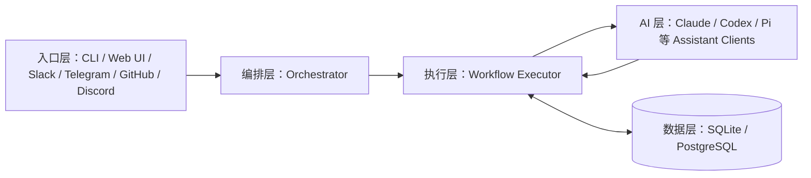

用 Claude Code、Codex 这类编码 Agent 一段时间后，会撞上同一个瓶颈：模型能力在涨，开发流程却仍靠临时提示词、人工盯执行、手动补审查维系。Archon 解决的就是这一层——把 Agent 的执行收束成可审计的工程流程。

Archon 是一个面向 AI 编程的 workflow engine（工作流引擎），也是一个 AI coding harness builder（编码流程框架构建器）。开发流程写成 YAML，它负责把规划、实现、验证、评审、批准、PR 创建这些步骤编排成可重复执行的工程流水线。官方 README 给的类比是：Dockerfile 之于基础设施、GitHub Actions 之于 CI/CD，Archon 之于 AI 编程工作流——"Think n8n, but for software development"。

GitHub API 2026-09-27 复核的仓库基本数据：

| 指标 | 数值 |
|------|------|
| GitHub Stars | 23,565 |
| Forks | 3,487 |
| 主语言 | TypeScript |
| License | MIT |
| 最新 release | v0.11.1（2026-09-25 发布）|
| 默认分支 | dev |
| 仓库描述 | The first open-source harness builder for AI coding. Make AI coding deterministic and repeatable. |

一个需要留意的口径差异：README 的 workflow 表列出 19 个默认 workflow，authoring 文档则写 21 个打包进二进制——多出的 `archon-review-block`、`archon-test-loop-dag` 不在 README 表格里。v0.10.0 起这批改版前的 workflow 整体进入弃用通道，继任者是新的 sdlc pack。清单一直在动，最稳妥的确认方式始终是运行 `archon workflow list`。

## 先说结论：Archon 到底是什么

Archon 的定位在编排层。它把开发过程拆成有顺序、有依赖、有门禁的步骤——AI 只在需要智能的地方发挥作用，测试、脚本、验证、审批、分支隔离、工件沉淀这些工程动作则放进确定性框架里。

| 你关心的问题 | 直接使用单个 Agent 的典型状态 | Archon 提供的能力层 |
| ------ | ------ | ------ |
| 同一个需求每次结果都不一样 | 流程取决于模型当时怎么理解指令 | 用 workflow 固定步骤、顺序和门禁 |
| 多个任务并行容易互相污染 | 共用工作区，分支和文件状态容易冲突 | 每次运行默认进入独立 worktree |
| 很难知道 AI 到底做了什么 | 只能看零散终端输出或最终结果 | DAG 执行、事件、工件、状态全程可追溯 |
| 想在关键步骤插入人工审核 | 往往只能临时打断，流程不稳定 | approval / interactive 节点内建 human-in-the-loop（人机协同） |
| 团队希望复用同一套开发流程 | 最终只剩提示词，难以长期维护 | YAML workflow 可提交到仓库，团队共享同一流程 |
| 希望在 CLI、Web、聊天平台之间保持一致 | 不同入口各做一套 | 同一套 workflow 可跨 CLI、Web UI、Slack、Telegram、GitHub、Discord 复用 |

Archon 解决的是 AI 如何进入工程体系的问题，模型本身的能力不在它的职责范围内。

理解 Archon 还需要先区分三层并行机制，它们各自独立，边界不清就会误判适用场景：

- **DAG 内并行**：同一依赖层的节点并发执行，例如多个 review agent 同时审查。
- **worktree 隔离**：多个 workflow run 之间互不污染，每个写任务独占一个 git worktree（独立工作树）。
- **多入口复用**：CLI、Web UI、聊天平台共享同一套 workflow，入口不同行为一致。

普通脚本编排不会自动得到这三层，下面逐层展开。

## 它适合谁，不适合谁

### 适合的场景

- 你已经在高频使用编码 Agent，希望把规划、验证、评审、PR 创建这些步骤标准化。
- 你所在的团队不只关心"能不能写出来"，还关心过程是否可审计、能不能回放。
- 你有并发任务，且不想让多个 AI 任务互相污染本地工作区。
- 你准备把团队实践建议沉淀成仓库内的 workflow 文件，避免经验散落在聊天记录里。

### 不太适合的场景

- 你只是偶尔问几个代码问题，或者只想让 Agent 快速看一段代码。
- 你的任务非常短平快，工作流编排的固定成本已经高于收益。
- 你当前真正缺的是"更强模型"或"更懂代码的提示词"，流程治理还不是主要矛盾。

最短判断标准：如果你的痛点已经从"怎么让 AI 干活"转成"怎么让 AI 稳定地按流程干活"，Archon 才会显著放大价值。

## Archon 把几个长期问题拉进了同一套系统

下面三个问题，是编码 Agent 用久了都会遇到的。Archon 用 workflow 把它们一并处理。

### 把随机聊天变成可重复执行的流程

对着 Agent 说"修复这个 bug"，结果常常取决于模型这次有没有先规划、会不会主动运行测试、会不会遵守团队的 PR 模板。Archon 把这些"不一定会发生"的步骤提前写进 workflow，让它们从模型当时的判断变成流程里的固定节点。这样即使模型这次"忘了"跑测试，workflow 里的 bash 节点也会强制执行。

### 把"看结果"换成"看过程"

在团队环境里，最终 diff 只是结果的一小部分。更重要的问题是：它读了哪些上下文、跑了哪些验证、在哪一步卡住、为什么重试、人工是在什么环节介入的。Archon 通过 workflow run、event、artifact、review 这些对象，让过程本身变成可回放资产。排查"为什么这次 PR 没过 review"时，你能回放整条执行链，不必只看最终评论。

### 把单人技巧变成团队流程资产

如果某个同事写出了一套非常有效的"规划 → 验证 → 审查 → PR"流程，传统做法通常只能把它存成提示词。Archon 的做法更接近基础设施：把流程写成 YAML，随仓库提交，交给整个团队反复复用和演进。新人 clone 仓库后运行 `archon workflow list`，看到的就是团队当前的标准流程。

## 一个真实 workflow 是怎么跑完的

把 Archon 只理解成"写 YAML 然后交给 AI 跑"还是太抽象。把一次 workflow run 拆开看，是下面这条执行链：

1. 你在 CLI、Web UI 或聊天平台发出需求。
2. Orchestrator（编排器）识别意图，解析 workflow 名称，必要时自动匹配最接近的 workflow。
3. 如果当前目录是一个 Git 仓库，Archon 会注册 codebase，并准备 workflow 运行上下文。
4. 对于会写代码的任务，隔离层创建或复用独立 worktree，并生成对应分支。
5. Workflow Executor 按 DAG 依赖关系启动节点；能并行的节点并行，必须等待的节点顺序执行。
6. AI 节点读上下文、调用模型；确定性节点执行测试、构建、脚本或 Git 操作。
7. 节点输出被写入 artifact 或结构化 output，供后续节点继续消费。
8. 如果流程中包含人工门禁，workflow 会暂停，等待 `approve` 或 `reject` 指令继续。
9. 完成后，结果、事件、消息、运行状态会被保留下来，供 Web UI、CLI 和后续排查使用。

走完这 9 步，输出是一条有状态、有产物、可排查的运行记录，而不是聊天框里的一段回复。

## 工作流引擎是怎么运作的

### Workflow 是一个 DAG

Archon 把 workflow 定义成 directed acyclic graph（有向无环图，DAG）。每个 node（节点）声明自己要做什么，以及依赖哪些上游节点。没有依赖的节点立即执行；同一拓扑层的节点并发跑；有依赖的节点等前置结果就绪后再执行。被 `when:` 条件或 `trigger_rule` 跳过的节点，会把跳过状态传给下游依赖。

DAG 模型让流程的顺序、并行和依赖关系都变成显式声明，避免藏在提示词里靠模型自己理解。这对团队协作的意义在于：流程变更会触发 code review，避免某天某个同事改了提示词就悄悄变了。

官方 authoring 文档的第一个完整示例，展示的是"先分类、再按类型走不同支路"的典型结构：

```yaml
name: classify-and-fix
description: Classify issue type, then run the appropriate fix path

nodes:
  - id: classify
    command: classify-issue
    output_format:
      type: object
      properties:
        type:
          type: string
          enum: [BUG, FEATURE]
      required: [type]

  - id: investigate
    command: investigate-bug
    depends_on: [classify]
    when: "$classify.output.type == 'BUG'"

  - id: plan
    command: plan-feature
    depends_on: [classify]
    when: "$classify.output.type == 'FEATURE'"

  - id: implement
    command: implement-changes
    depends_on: [investigate, plan]
    trigger_rule: none_failed_min_one_success
```

DAG 模型的价值落在三处：

1. **顺序是显式的**：流程不再藏在一大段提示词里，而是写成节点依赖图。
2. **并行是天然的**：同一依赖层的节点可以并发跑，例如多个 review agent 并行审查。
3. **输出可被消费**：上游节点的输出可以通过 `$nodeId.output` 传给下游，用于路由和条件判断。

`trigger_rule: none_failed_min_one_success` 这类汇合规则有一个 v0.11.0 起的行为变化：因上游失败而被跳过的依赖，现在也会阻塞汇合节点，哪怕另一条支路成功了。此前"一条支路失败、一条成功"时汇合节点仍会运行，新语义下它跳过并保留原始失败节点作为原因。

### 节点类型比"AI + Bash"丰富得多

早期介绍多停留在 prompt 和 bash 两类节点，当前的工作流原语已经覆盖了大部分工程控制流：

| 节点 / 能力 | 作用 | 什么时候用 |
| ------ | ------ | ------ |
| `command:` / `prompt:` | 让 AI 做规划、实现、审查、总结 | 需要模型推理和代码理解时 |
| `bash:` | 执行确定性的 shell 命令 | 跑测试、lint、构建、Git 操作 |
| `script:` | 用 `bun` / `uv` 运行内联 TypeScript / Python 或 `.archon/scripts/` 里的脚本 | 需要比 shell 更可控的逻辑时 |
| `loop:` | 迭代执行一个 prompt，直到声明的完成条件触发 | 测试-修复循环、逐任务实现 |
| `loop_group:` | 每轮迭代重跑一个多节点子 DAG | 一轮迭代需要多个节点配合时 |
| `approval:` | 暂停 workflow，等人工批准或驳回 | 不可逆动作前的门禁 |
| `wait:` | 持久等待到某个时间点、有界外部事件或显式外部动作 | 跨等待的长流程（v0.10.0 引入） |
| `cancel:` | 按条件提前终止整个 run | 前置检查失败时止损 |
| `include:` / `workflow:` | 把另一个 workflow 内联进 DAG，或作为子 run 调用 | 流程复用（v0.9.0 起支持 `inputs:` / `returns:` / `with:` 签名） |
| `when:` / `output_format:` / `context: fresh` / `provider:` / `model:` | 条件路由、结构化输出、上下文与模型控制 | 节点级精细控制 |

`script:` 值得单独说。从官方 release 信息看，v0.3.3 开始，Archon 支持 script node：通过 `bun` 或 `uv` 运行内联 TypeScript / Python 或 `.archon/scripts/` 中的脚本，stdout 直接成为 `$nodeId.output` 供下游消费，支持 `deps:`（仅 uv）和 `timeout:`。这让它在 YAML 加提示词的编排器之外，更像一个真正的工程自动化 runtime。需要解析 JSON、调用内部 API、做复杂条件判断时，script node 比纯 prompt 更可靠。

另一个 v0.9.0 之后必须知道的变化：工作流里的 Claude 节点不再继承你机器上配置的 skills 和 MCP servers。节点能看见什么，由它 YAML 里的 `skills:` 和 `mcp:` 字段显式声明；声明了但实际不可达的 skill 会在产生任何模型开销之前报错。以前"全局配好了顺便就能用"的写法，现在必须写进节点。

### Human-in-the-loop 有两种模式

Archon 在文档里明确区分了两种人机协同模式，官方给的选择标准很直接：人和 AI 在来回对话，用 interactive loop；流程默认前进、有人反对才回头，用 approval 加 `on_reject`。

#### Interactive loop

适合"看一版 → 给反馈 → 再迭代"的往返式过程，例如方案评审、PRD 打磨、PIV（Plan-Implement-Validate）循环。

```yaml
- id: refine-plan
  loop:
    prompt: |
      User's feedback: $LOOP_USER_INPUT
      Read the plan, apply feedback, present changes.
    until: PLAN_APPROVED
    max_iterations: 10
    interactive: true
    gate_message: "Review the plan. Provide feedback or say 'approved'."
```

每轮迭代结束后流程暂停，用户的输入通过 `$LOOP_USER_INPUT` 进入下一轮。approve 的行为取决于暂停时这轮迭代的状态：如果完成条件已经触发，不带评论的 approve 直接接受结果；带评论的 approve 则把评论当反馈再跑一轮。

#### Approval with on_reject

适合"先过门，再修复"的 gate-then-fix 模式。人类只在批准或驳回时介入；如果驳回，再由 AI 按明确原因修订。

```yaml
- id: review
  approval:
    message: "Review the report. Approve or request changes."
    capture_response: true
    on_reject: { prompt: "Revise based on: $REJECTION_REASON", max_attempts: 5 }
  depends_on: [generate]
```

没有 `on_reject` 时，驳回等于取消整个 workflow；有了 `on_reject`，驳回会触发修订 prompt，然后重新在同一道门禁前暂停。`capture_response: true` 打开后，你的审批意见才能作为 `$review-gate.output` 被下游节点读到。

一个 v0.10.0 起的安全垫：在聊天平台里，门禁暂停期间随便发一句普通消息不再被自动记成批准——此前"不，别动 schema"也会被当成同意存档。现在门禁交给聊天 Agent 走确认式的 approve / reject：明确的同意才批准，明确的反对以你的原话为理由驳回，含糊的消息 Agent 会反过来问你。斜杠命令仍是最确定的路径。

## 为什么 worktree 隔离是 Archon 的工程核心

Archon 最有工程含量的设计，是默认把可写任务放进独立 git worktree 里执行——YAML 编排只是它的表达层。

```bash
# 显式指定分支名运行 workflow
archon workflow run archon-idea-to-pr --branch feat/export-csv "Add CSV export to the reports page"

# 让 Archon 自动生成分支 / worktree
archon workflow run archon-idea-to-pr "Add CSV export to the reports page"

# 仅在确实需要时，才跳过 worktree 隔离
archon workflow run archon-assist --no-worktree "How does error handling work here?"
```

git worktree 的优势在于它复用了团队已有的 Git 工作流，不需要额外的容器或虚拟机开销。

worktree 隔离直接解决了四个工程痛点：

- **并行安全**：多个任务可以同时运行，不用担心互相改坏同一个工作目录。
- **主工作区更干净**：AI 不需要直接在你的 live checkout 上反复试错。
- **结果天然可追踪**：每次运行对应一个分支 / worktree，方便回溯和清理。
- **和 PR 生命周期天然对齐**：从 feature 分支到 review，再到 merge，路径一致。

对团队来说，这是 Archon 区别于"脚本编排 + Agent"的最关键一点。没有 worktree 隔离，多个 AI 任务并发时会互相覆盖文件、抢占分支，最终只能串行执行，DAG 并行的价值也会被抵消。

## 架构拆解：从一句指令到一次工作流运行

从系统视角看，Archon 可以拆成 5 层：



| 层 | 组件 | 职责 |
| ------ | ------ | ------ |
| 入口层 | CLI、Web UI、Slack、Telegram、GitHub、Discord | 接收用户指令，触发 workflow |
| 编排层 | Orchestrator | 路由消息、管理上下文、决定调用哪个 workflow |
| 执行层 | Workflow Executor | 解析 YAML、执行 DAG、处理依赖、条件和循环 |
| AI 层 | Claude / Codex / Pi 等 Assistant Clients | 在指定节点执行推理、生成代码、做审查 |
| 数据层 | SQLite / PostgreSQL | 14 张核心表，持久化 codebases、conversations、sessions、workflow runs、isolation environments、messages、workflow events 等（PostgreSQL 下另有 Better Auth 表） |

一次运行从入口进入编排层：Orchestrator 判定意图、选定 workflow 后交给执行层；Workflow Executor 按 DAG 逐个触发节点，AI 节点把推理结果交回，确定性节点直接执行；运行状态与产物持续写入数据层，供回放和排查。

同一套 workflow 在 Web UI、命令行和聊天平台之间行为一致，本地 CLI 只是其中一个入口。数据层统一持久化，无论从哪个入口触发，运行历史都能在 Web UI 里回放。

## 默认 workflows：先认清弃用窗口，再选

官方 README 和 Getting Started 文档面向入门用户时，主目录是 19 个默认 workflow。它们覆盖了从问答到 PR 的常见场景，但 v0.10.0 起，这批 workflow 大部分已进入弃用窗口，选型前需要先知道这一点。

### README 表里的 19 个默认 workflow

| Workflow | 用途 |
| ------ | ------ |
| `archon-assist` | 通用问答、调试、探索代码库——带全部工具的完整 Claude Code Agent |
| `archon-fix-github-issue` | Issue 分类 → 调查/规划 → 实现 → 验证 → PR → 定向审查 → 自修复 |
| `archon-create-issue` | 问题归类 → 收集上下文 → 调查 → 创建 GitHub Issue |
| `archon-issue-review-full` | GitHub Issue 的完整修复 + 多 Agent 全量审查流水线 |
| `archon-piv-loop` | 有引导的 Plan-Implement-Validate 循环，迭代间有人工审查 |
| `archon-idea-to-pr` | 功能想法 → 规划 → 实现 → 验证 → PR → 5 路并行审查 → 自修复 |
| `archon-plan-to-pr` | 执行既有计划 → 实现 → 验证 → PR → 审查 → 自修复 |
| `archon-feature-development` | 按既有计划实现功能 → 验证 → 创建 PR |
| `archon-adversarial-dev` | 用对抗式开发从零构建完整应用 |
| `archon-smart-pr-review` | 按 PR 复杂度分类 → 运行定向审查 Agent → 汇总结论 |
| `archon-comprehensive-pr-review` | 5 个并行 reviewer 的多 Agent PR 审查，带自动修复 |
| `archon-validate-pr` | 全面验证 PR，同时测试 main 分支与 feature 分支的行为 |
| `archon-architect` | 架构扫频、降低复杂度、提升代码库健康度 |
| `archon-refactor-safely` | 带类型检查钩子和行为验证的安全重构 |
| `archon-interactive-prd` | 通过引导式对话创建 PRD |
| `archon-ralph-dag` | PRD 实现循环——按 story 迭代直到完成 |
| `archon-workflow-builder` | 为你的项目生成一份新的 Archon workflow YAML |
| `archon-remotion-generate` | 用 AI 生成或修改 Remotion 视频组合 |
| `archon-resolve-conflicts` | 检测合并冲突 → 分析双方 → 解决 → 验证 → 提交 |

### v0.10.0 起：sdlc pack 是它们的继任者

v0.10.0 的 changelog 把这次更替说得很清楚：新的 sdlc pack 用八个可复用原语组合出从"一个待办问题"到"评审过、CI 绿、可合并的 PR"的完整链路，取代过去的单体式 prompt。仓库源码里能看到它的十个子工作流：`archon-triage`、`archon-investigate`、`archon-plan`、`archon-implement`、`archon-review`、`archon-validate`、`archon-deliver`、`archon-pr`、`archon-ship`、`archon-upkeep`。

改版前的 20 个 `archon-*` workflow（含 README 表格未列出的 `archon-review-block`、`archon-test-loop-dag`）被移进 `.archon/workflows/defaults/legacy/`，每次运行都会播报弃用公告，官方声明将在后续版本删除。`archon-assist` 不在 legacy 之列，单独留在 defaults 顶层。想长期保留某个旧 workflow，把它的 YAML 复制到你自己的 `.archon/workflows/`（项目级或全局、同名文件）即可，复制出去的版本不再播报弃用。

### 选型建议

| 你的目标 | 优先选择 |
| ------ | ------ |
| 先问代码库问题、做探索 | `archon-assist` |
| 从自然语言需求直接做功能 | `archon-idea-to-pr`，或直接试 sdlc 链路 |
| 你已经有成熟 plan，只想稳妥落地 | `archon-plan-to-pr` 或 `archon-feature-development` |
| 你只想 review 当前 PR | `archon-smart-pr-review` 或 `archon-comprehensive-pr-review` |
| 你要修 GitHub Issue | `archon-fix-github-issue` |
| 你要做人机反复协作的开发闭环 | `archon-piv-loop` |

上表右侧的 legacy workflow 在弃用窗口内仍然照常工作，适合现在上手；如果团队要定长期标准，值得直接评估 sdlc pack 的子工作流。

### 默认 workflow 数量口径不一致

官方不同位置对"默认 workflows"的口径确实对不上，这是核实过的现状，不是文档笔误那么简单：

- README 的表格与正文说的是 19 个默认 workflows。
- authoring 文档写的是 21 个打包进二进制，多出的是 `archon-review-block` 和 `archon-test-loop-dag`。
- v0.10.0 起，其中 20 个改版前的 workflow 被 `deprecated:` 标记覆盖，进入弃用窗口。
- YAML 语法本身也在演进，例如 v0.11.0 移除了 `thinking:`，推理深度只剩 `effort:` 一个写法；`workflow:` 子运行节点不再允许声明自己的 `output_format`。

实践里不要死记清单，直接在目标仓库运行下面这条命令最可靠：

```bash
archon workflow list
```

如果你准备自己写 workflow，建议把 README 当成概念导览，把 [Authoring Workflows](https://archon.diy/guides/authoring-workflows/) 当成实际语法基准。写完先跑 `archon validate workflows <name>`——它检查 YAML 语法、DAG 结构、依赖引用、command 文件存在性、MCP 配置和模型引用，报错信息带"did you mean"提示。

## 三条上手路径

不同读者的操作入口不一样，分开讲比混在一起更清楚。Archon 至少有三条常见上手路线。

### 路线 A：第一次接触，用官方 setup wizard

这条路径适合首次完整配置。官方 README 给出的前提是：你已经有 Bun、Claude Code 和 GitHub CLI。

```bash
git clone https://github.com/coleam00/Archon
cd Archon
bun install
claude
```

进入 Claude Code 后，对它说：

```text
Set up Archon
```

向导会引导你完成 CLI 安装、认证配置、平台选择，以及把 Archon skill 复制到目标项目中。官方文档还特别强调：**真正开始工作时，要在你的目标仓库里启动 Claude Code，不要一直待在 Archon 自己的仓库里。** 原因是 Archon 的 workflow 从当前仓库动态加载，待在 Archon 仓库里只会看到 Archon 自带的 workflows，无法加载你目标项目的 `.archon/workflows/`。

### 路线 B：你已经装好 Claude Code，只想装 CLI

如果你已经具备 Claude Code 环境，只想快速拿到 Archon CLI，可以走 quick install。

```bash
# macOS / Linux
curl -fsSL https://archon.diy/install | bash

# Windows (PowerShell)
irm https://archon.diy/install.ps1 | iex

# Homebrew
brew install coleam00/archon/archon

# Docker
docker run --rm -v "$PWD:/workspace" ghcr.io/coleam00/archon:latest workflow list
```

两个安装前提值得提前知道。其一，quick-install 的二进制不捆绑 Claude Code，装完 Archon 还要单独装 Claude Code 并通过 `CLAUDE_BIN_PATH` 指向它，或在 `~/.archon/config.yaml` 里配 `assistants.claude.claudeBinaryPath`——只有 Docker 镜像内置了 Claude Code。其二，x64 架构的 macOS/Linux 快速安装要求 CPU 支持 AVX2，老 Intel/AMD 机器和屏蔽了 AVX2 的虚拟机要走源码安装，ARM64 不受影响。

安装后先做两步验证：

```bash
archon version
archon workflow list
```

### 路线 C：你想用 Web UI 观察和管理 workflows

Archon 不只有 CLI。两种安装方式都用 `archon serve` 启动 Web 控制台：二进制安装首次运行时会下载匹配版本的 Web UI；源码检出则先在仓库根目录跑一次 `bun run build:web`，之后同样 `archon serve`。

Web UI 有五个页面值得看：

| 页面 | 你会看到什么 |
| ------ | ------ |
| Runs | 所有项目或单项目的运行列表，带状态过滤和实时进度 |
| Run detail | 事件日志、工件、workflow 图，以及 approve / reject / resume / cancel / abandon 等治理操作 |
| Project chat | 所选项目的实时对话与工具活动 |
| Settings | Provider 凭证、模型分层与别名、Assistant 默认值、系统状态、GitHub 身份 |
| Workflow builder | 实验性的可视化编排，覆盖一部分节点表单 |

如果给团队引入，Web UI 让 workflow 运行从个人终端事件变成团队可见事件，它并不替代 CLI。多人协作时，Web UI 让运行状态、审批待办、历史回放对所有人可见，避免"只有跑命令的人知道发生了什么"。

## 常用 CLI 操作

除了 `archon setup`，实际使用中最常见的命令其实只有下面这些：

```bash
# 查看当前目录可用的 workflows
archon workflow list

# 先零成本推演一遍 DAG：不建 run、不开 worktree、不调模型
archon workflow run archon-idea-to-pr --dry-run "Add dark mode to the settings page"

# 运行 workflow
archon workflow run archon-idea-to-pr "Add dark mode to the settings page"

# 指定分支名运行
archon workflow run archon-idea-to-pr --branch feat/dark-mode "Add dark mode"

# 对另一个目录运行
archon workflow run archon-idea-to-pr --cwd /path/to/repo "Add dark mode"

# 不使用 worktree，直接在当前 checkout 上运行
archon workflow run archon-assist --no-worktree "How does error handling work here?"

# 查看活动中的运行（running + paused）
archon workflow status

# 恢复失败的 workflow
archon workflow resume <run-id>

# 校验 workflow 定义（不运行）
archon validate workflows <name>

# 放弃一个非终态 workflow
archon workflow abandon <run-id>

# 批准或驳回人工门禁
archon workflow approve <run-id>
archon workflow reject <run-id> --reason "Please split the migration into two steps"
```

四个细节值得注意：

1. 写操作默认优先配合 worktree 隔离，不要把 `--no-worktree` 当常态。
2. `archon workflow list` 的发现范围是三处：当前仓库的 `.archon/workflows/`、全局的 `~/.archon/workflows/`、内置 bundled defaults。全局目录适合放跨项目通用的自有 workflow。
3. 如果仓库里有和内置 workflow 同名的文件，仓库版本会覆盖 bundled default。
4. approve 在 interactive loop 门禁上有讲究：完成条件已触发时，不带评论的 approve 是接受结果，带评论的 approve 会把评论当作下一轮反馈继续迭代；`approval:` 节点的 approve 则是直接放行。另外 v0.11.0 起 abandon 与 cancel 语义分离——`failed` 的 run 可以 resume，`cancelled` 的 run 直接丢弃，abandon 会先尝试停掉仍在写的活进程再落 cancelled 状态。

## 第一次成功的最小闭环

如果你不想一上来就跑最重的 feature workflow，最稳妥的首次体验顺序是：

```bash
# 确认 CLI 和 workflow 已就绪
archon version
archon workflow list

# 用轻量问题确认编排器能正常工作
archon workflow run archon-assist "What workflows are available here?"

# 零成本推演一次重量 workflow，确认 DAG 和门禁符合预期
archon workflow run archon-idea-to-pr --dry-run "Add a tiny docs-only improvement"

# 再运行一个真正会创建 worktree 的写任务
archon workflow run archon-idea-to-pr --branch feat/hello-archon "Add a tiny docs-only improvement"

# 查看状态
archon workflow status
```

当你能稳定完成这五步，才算跑通 Archon 的最小闭环：CLI 可用、workflow 可发现、AI 节点可执行、隔离与门禁行为符合预期。

## 新手最容易踩的 6 个坑

### 把 README 示例当成完整语法真相

README 适合快速建立直觉，但不适合作为 workflow authoring 的最终依据。真正写 YAML 时，应以 authoring 文档和本机 `archon workflow list` 的实际行为为准。README 里的示例为了简洁会省略很多字段，照抄到生产环境往往会缺关键字段。

### 只关心 AI prompt，不关心验证门

很多人第一次写 workflow 时，会把精力全花在 prompt 上，却忘了把 lint、test、build 或 review gate 写进流程。这样得到的结果只是更长的提示词，工程流程并没有变强。判断一个 workflow 好不好，看的是它有多少确定性节点，AI prompt 写得多精细不是关键。

### 误把 `--no-worktree` 当默认选项

`--no-worktree` 适合只读探索，不适合常规写操作。你一旦习惯在 live checkout 上让 AI 反复试错，Archon 最重要的隔离价值就被你自己抹掉了。多个写任务并发时，没有 worktree 隔离还会导致分支和文件互相覆盖。

### 写 interactive loop 时漏掉 `gate_message`

官方 loop 文档对 `gate_message` 的标注是"interactive: true 时必填"。而且要注意方向：单独写 `gate_message` 并不会产生门禁，必须是 `loop.interactive: true` 和 `gate_message` 成对出现；把 `interactive:` 直接写在节点层（loop 外面）是未知键，加载时会被忽略并给出警告。`archon validate workflows` 能在运行前把这类问题报出来。

### 假设节点继承你机器上的 skills 和 MCP

v0.9.0 起，workflow 里的 Claude 节点只看见 YAML 声明的 `skills:` 和 `mcp:`，操作员机器上的用户级、项目级、插件级配置都不再透传。从旧版本升级后如果某个节点突然"少了能力"，先检查是不是依赖了环境里的隐式配置。

### 忘了"同名文件覆盖默认 workflow"

如果仓库里放了和内置 workflow 同名的文件，它会覆盖 bundled default。这很有用，但也意味着你需要像维护 CI 配置一样认真维护这些 YAML。升级 Archon 版本时，如果内置 workflow 更新了，你的覆盖文件不会自动同步，需要手动 diff。

## 自定义 workflows

Archon 的上限不在那 19 个默认 workflow，而在于你能不能把团队流程写成可提交、可维护的 workflow 文件。

### 自定义文件放在哪里

- workflow 文件放在 `.archon/workflows/`
- command 文件放在 `.archon/commands/`
- script node 相关脚本可放在 `.archon/scripts/`

现在还多了一种 pack 形态：把某个 workflow 的 YAML、commands、scripts 整体放进 `.archon/workflows/<pack>/<workflow>/`，两层目录名都由你定，这棵树在目标仓库和 `~/.archon/workflows/` 下都能用。旧的扁平结构和共享的 `.archon/commands/`、`.archon/scripts/` 继续支持。v0.11.0 起，`archon plugin install owner/repo` 可以把发布在 GitHub 上的 workflow pack 整棵装进本地，`archon plugin copy` 再复制成可编辑的项目副本。

这些文件都从运行时动态加载。你可以把 workflow 当作仓库基础设施的一部分来维护，这意味着同一个团队的不同项目可以有完全不同的 workflow 集合，新成员 clone 仓库后就能看到团队当前的标准流程。

### 一个更接近真实团队流程的示例

下面这个例子展示的是"审查 → 人工批准 → 驳回后自动修订"的 gate-then-fix 模式（`review-pr`、`create-pr` 需要在 `.archon/commands/` 里有对应的 command 文件）：

```yaml
name: team-review-gate
description: |
  Review changes, require explicit approval, then proceed.

interactive: true

nodes:
  - id: review
    command: review-pr

  - id: approve
    depends_on: [review]
    approval:
      message: "Review findings. Approve or request changes."
      capture_response: true
      on_reject:
        prompt: "Revise based on: $REJECTION_REASON"
        max_attempts: 3

  - id: publish
    command: create-pr
    depends_on: [approve]
```

它在不可逆动作前把人判断显式写进系统，比"让 AI 自己 review 自己"可靠。`create-pr` 一旦创建就会通知 reviewer、触发 CI，在它前面加 approval gate，能避免 AI 把不成熟的改动直接推到团队视野里。

另一个细节：workflow 级的 `interactive: true` 和节点的 interactive loop 不是一回事——它只在 Web UI 生效，让 run 保持在前台交互，聊天平台本来就是前台，这个字段对它们没有作用。这个约束在参考文档里写得比 README 更明确。

### 自定义时最值得坚持的 4 条原则

1. 一个节点只做一件事，不要把规划、实现、验证混在同一个 AI prompt 里。混在一起会让失败定位变得困难——你不知道是规划错了、实现错了还是验证错了。
2. 所有 AI 节点后面都跟一个确定性验证步骤，至少是测试、lint 或构建之一。AI 节点的输出有随机性，确定性节点是兜底。
3. 重要决策前加 approval gate，例如数据库迁移、批量删除、PR 创建。判断标准是：这个动作的回滚成本高不高。
4. 从默认 workflow 复制再改，避免第一天就从空白 YAML 重新发明流程。复制还有个附带好处：拷进自己项目目录的副本不再播报 legacy 弃用公告，不受官方删除节奏影响。

## 边界与注意事项

工程选型先看边界。Archon 当前至少有 6 个限制：

### Archon 解决的是流程治理，不是模型能力替换

如果底层模型看不懂你的代码，Archon 不会把它变聪明。它解决的是流程确定性、隔离性和可追溯性。引入 Archon 前，先确认你的痛点是"流程不稳"还是"模型不够强"，后者换工具解决不了。

### Workflow 设计水平会直接决定输出上限

坏流程会把坏结果稳定放大。把流程写成 YAML 并不会自动得到好工程实践，反而要求你把隐含经验显式化。一个没有验证门的 workflow，比裸用 Agent 更危险，因为它会让坏结果披上"经过流程"的外衣。

### 不是所有任务都值得进 workflow

如果只是问一个函数是做什么的、为什么测试失败，直接用 `archon-assist` 或普通 Agent 往往更省成本。Archon 最有价值的地方，是多步、需要验证、需要隔离的任务。判断标准是：这个任务会不会被重复执行、需不需要回溯、错了能不能回滚。

### 默认 workflow 正处在换代期，实际以本机 live list 为准

19（README 表格）、21（打包进二进制）、20（进入弃用窗口的 legacy）这组数字是 2026-09-27 复核时的读数，legacy workflow 的删除时点官方只说了"后续版本"。不要把某一页 README 当唯一真相。升级版本后第一件事是跑 `archon workflow list`，确认本机实际可用的工作流，再对照 `archon version` 决定是否需要同步团队的自定义 workflow。

### 人工审核仍然不可省略

Archon 提供了更好的审批点，但并不意味着你可以在数据库迁移、大规模重构、权限改造这类任务上完全放弃人工 review。approval gate 是流程里的一环，它不能替代有经验的工程师对不可逆动作的最终判断。v0.10.0 把"聊天里的普通消息不再自动算批准"写进了行为，机制上收紧了一步，但最终判断仍然是人的。

### 遥测默认开启，但可一键关闭

Archon 默认发送匿名使用事件：哪些 bundled workflow 被真实使用、什么平台、成功率如何。官方声明不收集代码、prompt、消息内容，自有 workflow 的名字也只以 `"custom"` 计。不想发送的话，设 `ARCHON_TELEMETRY_DISABLED=1`、`DO_NOT_TRACK=1` 或 `POSTHOG_API_KEY=off` 任一即可，CI 环境（`CI=true`）自动关闭。用 `archon telemetry status` 可以查看当前状态。给公司内网环境做评估时，这一项建议放进清单。

## 实践建议

- 从 `archon-idea-to-pr`、`archon-plan-to-pr`、`archon-feature-development` 三者中选一个作为团队起点，不要一开始就铺满所有 workflow。先让一个 workflow 跑稳，再扩展。团队要定长期标准的话，把 sdlc pack 纳入评估。
- 任何会改代码的任务，默认保留 worktree isolation；只有只读探索才考虑 `--no-worktree`。
- 把 workflow 当仓库资产来维护，和 CI、lint、脚本一样进入版本控制。workflow 变更应该走 code review，避免某个人偷偷改 YAML。
- 在 workflow 里优先放"组织步骤"和"验证门禁"，不要试图把所有聪明都塞进长 prompt。prompt 越长越难维护，验证门越多流程越稳。
- 每次升级 Archon 版本后，先运行 `archon workflow list`、`archon version` 和 `archon validate workflows`，再决定是否需要同步更新团队的自定义 workflow。v0.9 到 v0.11 之间有多次影响 YAML 写法的破坏性变更，覆盖文件需要手动 diff。

采用顺序：先在个人项目跑通 `archon-assist` 和 `archon-idea-to-pr` 的最小闭环，确认 worktree 隔离和 approval gate 对你有价值；再把一个团队高频流程（例如 PR 审查）写成自定义 workflow，验证它能否被团队复用；最后再考虑是否把所有开发任务都迁进 Archon。

## 常见问题

### Archon 是不是 Claude Code 的替代品？

Archon 不是 Claude Code 的替代品。它把 Claude Code、Codex、Pi 等编码能力拉进可编排流程，和底层 Agent 是编排器与执行器的关系。Claude Code 负责单个节点的推理和代码生成，Archon 负责把多个节点串成有依赖、有门禁的流程。

### 为什么我本机看到的默认 workflows 数量和文章里不一样？

因为"默认 workflow"在官方语境里至少有四个来源：README 表格（19 个）、打包进二进制的 defaults（21 个）、已标记弃用的 legacy 集合（20 个）、外加你的全局和项目目录里的自有 workflow。发现来源分 bundled、global、project 三处，同名时项目级文件覆盖内置版本。你本机的 live list 才是最终答案。

### `archon-idea-to-pr`、`archon-plan-to-pr`、`archon-feature-development` 应该怎么选？

- 需求还只有一句描述，用 `archon-idea-to-pr`。它会先规划再实现。
- 已经有人给出 plan，用 `archon-plan-to-pr`。它跳过规划直接执行。
- 团队流程比较轻，只想从现有计划快速实现并发 PR，用 `archon-feature-development`。它的验证门更少，速度更快。

这三个都在 legacy 弃用窗口内，短期内照常可用；长期规划建议对照 sdlc pack 的 `archon-plan`、`archon-implement`、`archon-deliver` 链路。

### 一定要用 Web UI 吗？

不一定。CLI 已经足够完成大多数个人使用场景。Web UI 的价值主要在于共享可见性、监控和团队协作。单人使用时 CLI 更轻量，团队引入时 Web UI 让运行状态对所有人可见。

### 我能不能只把 Archon 当作 workflow authoring system 来用？

可以，而且这恰恰是很多团队最终最看重的价值：把 workflow 作为仓库内可维护的工程资产，避免实践建议停留在某个成员脑子里。即使不使用内置 workflow，只用自己的 YAML，Archon 的编排引擎、worktree 隔离、approval gate 依然有效。

## 结尾判断

Archon 解决的不是让 AI 写出更多代码，而是让 AI 的产出进入可审计、可回放、可复用的工程流程。流程写进仓库、跑进独立 worktree、卡在审批门前，AI 编程就从个人的使用习惯变成了团队的工程资产。它不负责让模型变聪明，但流程能不能被固定、被复查、被复用，往往是团队真正卡住的地方。

要不要引入，判断标准只有一条：你的开发任务会不会被重复执行、需不需要回溯、错了能不能回滚。三个回答都是"是"，Archon 值得进入工具链；有任何一个是"否"，先用 `archon-assist` 这类轻量入口，别让编排的固定成本跑在收益前面。

## 官方资源

- [GitHub 仓库](https://github.com/coleam00/Archon)
- [官方文档](https://archon.diy/)
- [Getting Started](https://archon.diy/getting-started/installation/)
- [Authoring Workflows](https://archon.diy/guides/authoring-workflows/)
- [CLI Reference](https://archon.diy/reference/cli/)
- [The Book of Archon](https://archon.diy/book/what-is-archon/)
- [llms.txt（全站文档索引，供 AI 工具读取）](https://archon.diy/llms.txt)

---

## 资料口径说明

本文的判断基于以下来源和取径：

1. **版本锚点**：原稿基于 2026-08-05 前后的仓库状态（v0.7.1）；2026-09-27 复核并整体更新至 v0.11.1（2026-09-25 发布）与 dev 分支文档，v0.8 至 v0.11 期间影响正文表述的变化（sdlc 换代、节点 skills/MCP 声明化、汇合规则收紧、abandon/cancel 语义分离、`thinking:` 移除）已并入正文。
2. **仓库读数**：Stars 23,565、Forks 3,487、MIT、TypeScript、默认分支 dev，均为 2026-09-27 GitHub API 读数。
3. **核实渠道**：GitHub API（repo / releases / tags / git trees）、dev 分支的 README 与 CHANGELOG、`packages/docs-web` 文档源（authoring-workflows、loop-nodes、script-nodes、approval 节点、CLI reference、adapters/web、getting-started/installation），以及 archon.diy 线上页面逐条验证可访问。
4. **YAML 示例来源**：正文三段 YAML 分别取自 authoring 文档的 Workflow Structure 示例、Interactive Loop 示例与 Approval with on_reject 示例，未做改写；自定义一节的 `team-review-gate` 是按官方语法组织的示例，其中的 command 需要读者自行提供。
5. **事实边界**：sdlc pack 在二进制发行版中的打包与分发方式，以你本机 `archon workflow list` 的输出为准；legacy workflow 的删除时点官方仅表述为"an upcoming release"；README 与 CHANGELOG 的更新节奏不完全同步，两者冲突时以 CHANGELOG 和本机实测为准。本文未实际运行 workflow，运行期行为以官方文档与实测为准。
