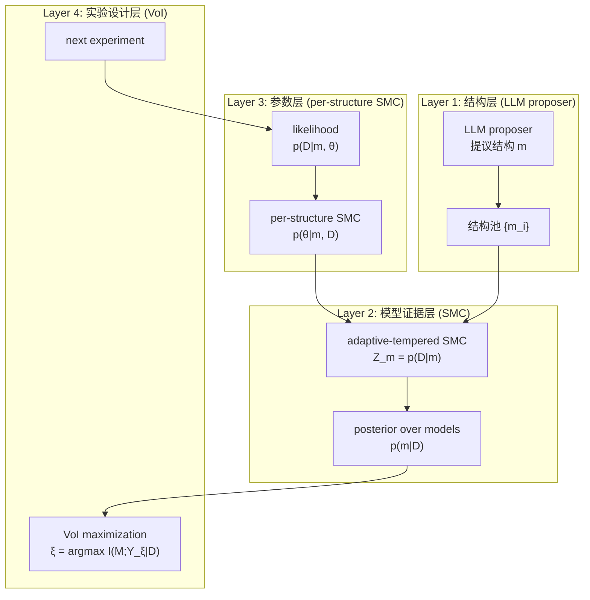

## 这篇文章在回答什么

`arXiv:2608.09696` 是 Kevin Murphy（Probabilistic Machine Learning 教材作者，Uber ML 时代的大佬级人物）2026 年 8 月挂出来的论文：*Model Discovery Agent (MDA): LLM-assisted Bayesian experiment design for data-efficient discovery of mechanistic world models*。

Murphy 这篇的核心主张一句话能说完：传统 Bayesian 实验设计只解决「**给定假设类，挑最 informative 的实验**」——但科学发现从来不是「给定假设类」。新机制是「**真值在你假设类之外**」的情况，统计学叫 M-open。LLM 的长项恰好是「**根据上下文，提议你没想到的假设**」——但 LLM 单独跑没有 posterior 校准、没有 likelihood 评估、没有 data efficiency 保障。

MDA 把这两件事拼成一个 4 步循环：

```text
LLM proposer (提议结构) → SMC 更新 posterior over (structure, parameters)
                     ↓
       Predictive check (held-out 干预预测误差)
                     ↓
       误差超阈值 → 扩张假设空间 (LLM 提新机制)
                     ↓
       VoI design (挑下一个最 informative 的实验)
```

物理 / 化学 / 生物三个 benchmark 都验证同一套循环：ForceBench（粒子间未知力律）、ChemBench（酶动力学率律）、NeuronBench（新贡献：6 个 mystery neuron + Hodgkin-Huxley ODE + 部分可观察 + 随机扩展 NeuronBenchStoch）。

这篇文章要回答三件事：

1. **为什么 mechanistic model 必须靠 intervention** —— 被动观测永远 underdetermine 机制
2. **为什么 LLM 当 proposer 不会让 Bayesian 那套垮掉** —— 严格区分「结构」（LLM 出）和「参数/似然/VoI」（标准 Bayesian 出）
3. **M-open 的 predictive check 怎么不变成「LLM 瞎补」** —— 残差阈值 + 现有证据排序挑前 N_m

## 一个直觉：interventional question 不可能靠 curve fit 答

论文 §1 开篇那句很重：

> Predicting the answer to interventional "what if" questions — the outcome of an action never taken — requires a *mechanistic*, causal model, not a curve fit; and learning such a model requires *experiments*, because passive data leaves its mechanisms unidentified.

Murphy 直接把「曲线拟合 vs 因果模型」当成科学发现的核心张力：给定一个药物从未给过的病人、一个轨道从未飞行过的探测器、一个从未实施过的政策——**回答「如果做了会怎样」需要 mechanistic 模型**，因为两个机制可以在所有观测数据上完全一致，却给出截然相反的干预预测。Richens & Everitt 2024 的定理说「能 robust 预测全范围干预的 agent 隐式学到了 causal world model」——MDA 反过来：显式表示 causal model，让 LLM 注入 prior knowledge，用 Bayesian 推理不确定性，给用户可解释的模型。

但 mechanistic model 有第二个问题：**passive data 永远 underdetermine 它**。两个机制可以生成同一组观测；只有 intervene（扰动 + 看响应）才能打破这个 degeneracy。问题是「实验贵」——实验室化验、临床试验、卫星发射——所以操作性问题变成「**data efficiency**」：用尽可能少的实验，识别出足以回答 query 的机制。这正是 Bayesian experimental design 的古典命题（Lindley 1956）：挑预期产出最 informative 的干预。Murphy 强调：但这条路径几乎从未和「科学发现需要的开放式假设创造」结合过。**MDA 就是这两个领域的接缝**。

论文给了三个 anchor benchmark：

| 领域 | benchmark | 来源 | MDA 的 SOTA |
|---|---|---|---|
| 物理 | ForceBench (DiscoverPhysics 包装) | Wiemann et al. 2026 | 在 6 个 two-particle world 上数据效率显著优于 Opus 4.7 / DeepSeek-v4 Pro baseline |
| 化学 | ChemBench (ActiveSciBench-Chem 包装) | Kabra et al. 2026 | 8 个实验达到 ≈56% SA；LLM-AutoSciLab baseline 在 B=60 步只到 ≈42% |
| 生物 | NeuronBench (新贡献) | 本文作者 | 6 个 mystery neuron (HH 模型加 novel 通道)；Stochastic 扩展 NeuronBenchStoch |

三个 benchmark 的共性是：**真值已知（合成数据），所以可以同时测「预测误差」和「机制恢复对错」**。这一条让 paper 写得比纯 LLM baseline 严谨很多——LLM-AutoSciLab 在 ChemBench 上能拿到 RMSLE=0.001 但机制是错的（PySR 返回 `10^a log(·)` 这种「数值对、符号错」的形式），MDA 返回的则是 substrate inhibition 的真实方程。

## 系统地图：MDA 的四层 inference

论文 §3 Methods 的核心是 4 层嵌套 inference，每一层用一个标准 Bayesian 工具：



**关键设计：LLM 只在结构层出现**。一旦结构 m 固定，参数 θ、似然 p(D|m,θ)、实验设计 VoI 全部走标准 Bayesian 路径——SMC、particle filter、closed-form VoI。这是 Murphy 整篇论文的核心工程取舍：**让 LLM 做 LLM 擅长的事，让 Bayesian 做 Bayesian 擅长的事**。

下面按层拆解。

### 结构层：LLM proposer 的 prompt 设计

`SMC-S` 方法（Piriyakulkij et al. 2024）的 LLM proposal kernel 形式是：

```text
p_b(m_b | {m_{b-1}^i}, D_{0:b-1}, r_{b-1}, C)
```

即第 b 步的结构提议 = 之前所有结构 + 它们的残差 + 当前数据集 + 自然语言 context C（领域描述）。MDA 在结构扩张时（残差超阈值）让 LLM 提议「**novel unnamed mechanism**」，赋予 broad prior——这是 M-open 的「补」操作。Breaker–Builder 方法（Buehler 2026）也走这条路。附录 G 给出了完整 prompt 模板。

LLM 不是每一步都重新提议——MDA 设了一个 `R_m` 阈值和最大扩张轮数 `R_max > 0`，超出后才启用「扩 N_new 个新候选 → 算证据 → 留前 N_m」的剪枝。这是「LLM 帮出主意，Bayesian 帮筛掉」的工程实现。

### 证据层：adaptive-tempered SMC 的 Occam 罚

每个 LLM 提议的结构 m 要算 **evidence**（marginal likelihood）：

```text
Z_m = p(D_{0:b} | m) = ∫ p(D_{0:b} | m, θ) p(θ | m) dθ
```

这是经典的模型选择量。Murphy 强调一句：「the integration over model parameters provides an automatic Occam penalty factor for complex models with many parameters (MacKay 1991)」。含义：复杂模型必须解释更多数据才能在 evidence 上赢过简单模型——SMC 在做结构选择时**自动**做了复杂度-拟合度 trade-off，不需要额外 BIC / AIC 那一类调整。

`Algorithm 3` 用 per-structure adaptive-tempered SMC 计算这个 evidence；`Algorithm 2` 用 SMC 在结构空间采样——两层 SMC 嵌套，内层算 Z_m，外层更新 p(m|D)。§1 Fig. 1(b) 的 Pareto curve 把每个候选模型画在 (accuracy, complexity) 平面上——Bayesian description length `-log₂ p(m|D)` 当 x 轴，准确度当 y 轴。

### 参数层：似然的两条路

参数 inference 的关键是 **likelihood p(D|m,θ)**。论文给了两条路：

**路 1：确定性潜在动力学**（ForceBench / ChemBench / 确定性 NeuronBench）：

```text
p(y_{1:T} | z_0, m, θ) = ∏_t p(y_t | z_t, m, θ)
z_t = m_θ^t(z_0)  # 推 m_θ 共 t 次
```

这是 closed-form——ODE 跑完直接出轨迹。Gaussian observation noise 时 VoI 还有 analytic expression（论文 Eq. 5）。

**路 2：随机潜在动力学**（NeuronBenchStoch，新贡献）：

当动力学是 SDE 时，likelihood intractable。MDA 用 bootstrap particle filter 估计：

```text
p̂(y_{1:T} | m, θ) = ∏_t (1/N_z ∑_i w_t^(i))
```

这个无偏估计 plugged into Algorithm 3 的 per-class tempered SMC 当 loglik，返回 model evidence `Z_m = p(D|m)`。这是 simulation-based inference (SBI) 的标准做法（Cranmer et al. 2020）。当确定性成立时 N_z=1，回退到路 1。

**另一条干扰**：单条轨迹太噪时，把轨迹转成 summary statistics `s_j(y_{1:T})`，用 trajectory-level likelihood：

```text
p(y_{1:T} | m, θ) = ∏_j p(s_j(y_{1:T}) | m, θ)
```

附录 A.4 给出了「学 summary statistics 本身」作为 1d CNN 特征的初步结果。

### 设计层：VoI 在 M-open 下还管用吗

实验设计的目标是 Lindley 1956 的 mutual information：

```text
ξ_⋆ = argmax_{ξ ∈ Ξ} I(M; Y_ξ | D)
```

确定性动力学 + Gaussian noise 时有 closed-form VoI（论文 Eq. 5）：选 posterior-predictive variance 最大的设计。因为 per-structure 参数 posterior 通常比较集中，这个方差**主要来自跨模型分歧**——VoI 选的设计就是「最能把不同机制区分开的实验」。

这是 *model discrimination* objective（区分机制）。论文在 ChemBench 上对比了 *exploit* 替代：

```text
ξ_⋆^{mean} = argmax_{ξ ∈ Ξ} E_{m,θ|D}[r(ξ; m, θ)]
```

这是 Bayesian optimization 风格的 exploit——挑预期 rate 最高的输入。论文里叫「MDA (Mean)」baseline。结果显示 VoI 在 M-open benchmark 上明显占优：MDA 默认比 exploit 快 5-7 倍达到 ceiling。

## M-open 的 predictive check：怎么不变成「LLM 瞎补」

论文最巧的一节是 §3 「Expanding and shrinking the hypothesis space」。机制如下：

```text
For each held-out test experiment ξ_i:
    1. 用当前 MAP 模型 m_* 预测 E[Y|ξ_i, m_*]
    2. 与 ground truth 对比，得 residual r_i
    3. 累积 residual R_m；若 R_m > threshold τ_r，启用扩张
```

扩张触发后：

1. LLM 提议 `N_new` 个 novel unnamed mechanisms，赋予 broad priors
2. 加入当前结构池
3. 每个新候选算 evidence Z_m
4. 留 evidence 最高的前 N_m 个

这一步的关键 invariant：**「扩」是 lazy + threshold-gated**——不是每轮都让 LLM 自由发挥，而是只在残差超阈值时启动。论文报告说这一条对 challenging domains 很关键（Fig. 16 ablation）。

论文给了一个 YUKAWA world 的具体例子——yukuwa 力律 `F = q_i q_j K₁(r/λ) / λ`，其中 K₁ 是修正 Bessel 函数。短距离（r ≤ λ）时 K₁(r/λ)/λ 和普通 power law 几乎完全重合——只用短距离数据无法区分。VoI 设计的「长距离 probe」触发了「aha moment」：在前沿上，本来 K₁ 和 power law 同居前沿中段，没有一个明显胜出；长距离 probe 加进来后，前沿整体下移，真模型掉到 convex corner。

Pareto curve 这一刻就是模型「真正 grok」概念的瞬间。`x` 轴不是语法复杂度（不是 Halstead 那种），是 Bayesian description length `-log₂ p(m|D)`——每个候选机制的 posterior code-length。

## 三 benchmark 的关键设计取舍

### ForceBench（物理）：8 步内见真章

**任务**：2D 空间里两个粒子，agent 控制其中一个的初位置 + 初速度 + 几个环境参数，找出未知力律 `F`。

**关键**：力律用 Green's function 表示，Newton 第二定律积分两步得轨迹。**LLM 提出候选 F**，MDA 算 posterior over F 和 VoI。设计空间离散化成 13 个组合（Table 5）。

**结果**：在 6 个 two-particle world 上聚合，MDA 比 Opus 4.7 / DeepSeek-v4 Pro 的 LLM baseline 数据效率显著高（Fig. 2）。Opus 4.7 在「unthrottled」模式下每步跑多个实验，16 轮才能到 MDA 8 轮的水平。

**Yukawa world 的 aha moment** 是这一节最有叙事张力的细节——见上面 §M-open 段。

### ChemBench（化学）：56% vs 42% 的 SOTA

**任务**：从 7 个可控输入（底物、抑制剂、第二底物、产物、酶载、温度、pH）映射到标量反应速率 `r` 的代数方程。

**关键**：噪声是 multiplicative Gaussian，likelihood 用相对噪声形式 `p(y|ξ,f,θ) = N(y | f(ξ,θ), σ_rel · f(ξ,θ))`，对齐 benchmark 的 RMSLE 度量。

**结果**：

| 方法 | B=8 实验 | B=60 实验 |
|---|---|---|
| MDA (VoI) | ≈56% SA | — |
| LLM-AutoSciLab | — | ≈42% SA |
| LLM-AutoSciLab (paper 原报) | — | 35.1% SA（用 gpt-4o-mini） |

论文用 Opus 4.7 替换 gpt-4o-mini 跑 baseline，所以 42% > 35.1%——这是诚实的「**替换 baseline 模型**」操作。

**Table 1 的对比是真正的炸点**：MDA 在 substrate inhibition 上返回**完全正确的方程**；LLM-AutoSciLab 的 PySR 在 hard noncompetitive 域返回 RMSLE=0.001（数值完美），但机制是「nested 10^a log(·) 和 stretched exponential」——**数值对、符号错**。这正是 Kabra et al. 2026 讨论的「high-exact / low-symbolic pathology」。

### NeuronBench（生物）：本文新贡献

**任务**：6 个 mystery neuron，每个基于 generalized Hodgkin-Huxley 模型（描述神经元 spike 的非线性 ODE），电流由 `I_Na + I_K + I_L + I_Z` 组成——前 3 个通道（钠、钾、漏电）是标准的 HH 模型，第 4 个 `I_Z` 是作者**故意设计**的 novel 膜机制，避免 LLM 直接靠「记忆」调出标准 HH 模型。

**关键**：

- LLM 只给**表型**（observable signature，不是机制），提议 2-5 个候选通道
- 候选映射到一个共享 channel library
- 真理有时根本不被提议——例如 z-rebound world 里 LLM 完全漏掉 low-threshold inward current，这是 **genuine M-open miss**，作者刻意保留，让 residual 能 reopen the pool
- MDA 跑 Poisson-evidence selection 在候选池上 + VoI 实验设计

**结果**（Fig. 4）：6 个 world 的 test error vs 实验数——Bayes-forecaster（蓝色）在每个 world 上都明显优于 in-context forecaster（紫色）。

**Stochastic 扩展 NeuronBenchStoch**（附录 F）：在 latent 动力学加 finite-channel gating noise，把模型变成 SDE——**likelihood intractable 是其他 benchmark 都没有的 regime**。**关键发现**：

> a deterministic likelihood gives poor results (the method confidently selects the wrong model), whereas a particle filter approximation to the marginal likelihood (Algorithm 4) gives the correct results.

确定性 likelihood 在 SDE 上「自信地选错」——这是个反直觉但深刻的警告。**用错误的 likelihood 算 evidence，越自信越危险**。

## 工程取舍：哪些决策是钉死的

**LLM 只在结构层**。一旦 LLM 提议了 m，参数 θ、likelihood p(D|m,θ)、VoI 全部走标准 Bayesian。这一刀切下去，所有「LLM 会让 Bayesian 失效」的反对意见就站不住脚——LLM 出结构，Bayesian 算 evidence 和 VoI，两者各司其职。

**Adaptive-tempered SMC 而不是 vanilla SMC**。证据层的标准做法是 per-structure adaptive-tempered SMC（Naesseth et al. 2019; Chopin & Papaspiliopoulos 2020），这样在高维参数空间里 particle 不会全部 collapse 到一个 mode。代价是要调温度调度参数。

**M-open 用 threshold-gated lazy expansion**。不是每轮都让 LLM 自由发挥，而是 residual `R_m > τ_r` 才触发 `N_new` 个新候选 → 算 evidence → 留前 N_m。论文 Fig. 16 ablation 显示这一条对 challenging domains 很关键——没有 threshold gate 的版本在 NeuronBench 上 evidence 不会收敛。

**两套 likelihood：deterministic ODE 与 particle filter SDE**。ForceBench/ChemBench/确定性 NeuronBench 走 closed-form ODE likelihood；NeuronBenchStoch 走 bootstrap particle filter 估计（Algorithm 4）。这条决策的核心证据是反直觉的：**deterministic likelihood on SDE gives confidently wrong answers**——即用错误的 likelihood 算 evidence 越自信越危险，所以 likelihood 实现必须按物理真实性选。

**One-step myopic design**。VoI 设计是单步贪心，不看未来多步。这是计算成本和性能的现实权衡——论文没在正文展开但附录 Figure 16 的 ablation 应该展示了 multi-step rollout 的成本收益曲线。

**NeuronBench 故意设计 I_Z 通道避免 LLM 记忆**。这是 benchmark 设计层面的关键决策——如果 LLM 直接调出标准 HH 模型，「发现」就退化成「回忆」，没有验证意义。

## 这件事为什么重要

Murphy 这篇论文在 2026 年这个时间点回答的是一个根本性命题：**「LLM + Bayesian」怎么拼才不互相拖后腿**。过去一年多 LLM-for-science 的论文大致分两派：

- **LLM 中心派**：让 LLM 提议机制、用 LLM 评分、用 LLM 设计实验（Piriyakulkij et al. 2024, Abhyankar et al. 2026, Prystawski et al. 2026 等）——简单、通用，但 posterior 校准和 data efficiency 没有严格保障。
- **Bayesian 中心派**：严格 Bayesian experimental design（Lindley 1956 路径）——有 posterior、有 VoI，但假设类是固定的，不能「想到新机制」。

MDA 是第三种拼法：**LLM 做结构层（开放式假设创造），Bayesian 做参数层 + 设计层（严格 inference + 严格 VoI）**。这一刀切下去：

- LLM 的「开放式创造」不再是 free-form——它每一步提议都被 SMC posterior 排序
- Bayesian 的「固定假设类」不再是束缚——LLM 在 residual 超阈值时自动扩张假设空间
- 两者的优势叠加，劣势被各自的对方弥补

这个范式可以拓展的方向：multi-step VoI（不是 one-step myopic）、learned summary statistics 的端到端优化、把 SMC 的 particle filter 替换成 diffusion-based posterior estimator（NeuronBenchStoch 是天然测试场）。

代码层面，`Typert 严格清单 + adaptive-tempered SMC + bootstrap particle filter + threshold-gated LLM expansion` 是这个范式能工程化落地的五个钉子。少一个，要么 LLM 失控、要么 Bayesian 限制太死。

`2608.09696` 版本的论文 + NeuronBench 开源 benchmark（https://github.com/murphyk/neuronbench）是这件事的当前最优解。下一版本会是什么——也许是 diffusion-based posterior 替换 particle filter（解决 SDE regime 的计算成本）、也许是 learned simulator 把 ODE 跑得更便宜——但「LLM 在结构层、Bayesian 在其它层」这条混合架构原则，大概率会留下。

## 维护指引：从 MDA 这篇论文读后续工作的几件事

**引用网络**。Bayesian experimental design 路线从 Lindley 1956 → Box & Hill 1967 → Chaloner & Verdinelli 1995 → Rainforth et al. 2024，论文里点名的「modern work scales it with amortised and gradient estimators」指 Foster et al. 2021 的 neural VoI。SMC 的两条技术源头：ModelSMC（Wahl et al. 2026）和 SMC-S（Piriyakulkij et al. 2024）——后者是 LLM-as-proposer 的 SMC 范式源头。

**Benchmarks**。三个 benchmark 的关系：DiscoverPhysics（Wiemann et al. 2026）是物理基线、ActiveSciBench-Chem（Kabra et al. 2026）是化学基线、NeuronBench（本文）是生物贡献。未来工作的候选 benchmark 包括 NewtonBench（Zheng et al. 2026）。

**Stochastic 扩展**。NeuronBenchStoch 是论文附录 F 的核心扩展，处理 latent SDE 的 intractable likelihood。这条路径的关键 reference 是 Cranmer et al. 2020（SBI）和 Fearnhead & Prangle 2012（learned summary stats）。Appendix E.8 给出了 1d CNN 学 summary stats 的实现。

**替代 Bayesian 工具**。论文用 SMC 是为了并行化和 particle-based 的天然优势；如果换 NUTS / HMC 也能算 evidence，但要权衡计算成本和粒子退化。MuZero / PPO 类 Bayesian RL 也能做实验设计，但只覆盖 reward optimization，不覆盖 model discovery。

**为什么 NeuronBenchStoch 的 deterministic likelihood 错**。这是论文最反直觉的发现——直觉上「确定性 ODE likelihood 是 SDE 的近似，应该不会太错」。但当 SDE 噪声在参数空间产生多峰时，deterministic likelihood 会忽略这些多峰，导致 evidence 计算偏向「最拟合均值」的参数，反而错失正确的随机动力学模型。这是 SBI 领域的老教训，但 NeuronBenchStoch 给出了一个干净的具体例子。