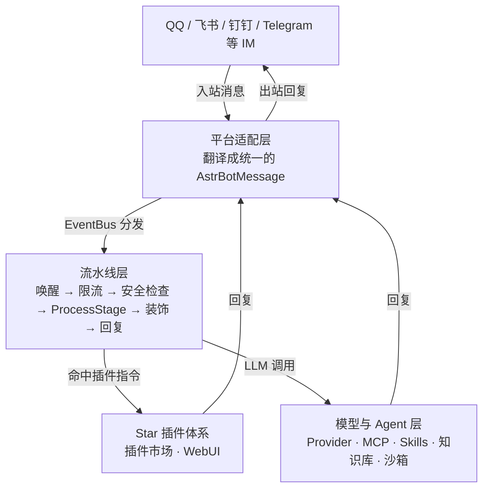

# AstrBot：让 AI Agent 真正住进 QQ/飞书/钉钉的桥接层

## 一句话判断

多数 Agent 项目做的是"怎么把模型用好"，AstrBot 解决的是另一个问题：**怎么让一个 Agent 稳定地住在 QQ、飞书、钉钉这些 IM 里**。这件事的难点不在模型，而在各家 IM 协议互不相通——消息结构、鉴权方式、支持的消息类型全都不一样。AstrBot 把这些差异吸收进平台适配层，上层只面对统一的事件对象；再把 LLM 接入、Agent 执行、插件生态做在适配层之上。对想在 IM 里落地 Agent 的团队来说，它是目前覆盖面最完整的开源选项。

## 项目现状

以下数据核验于 2026-09-17，来自 GitHub 仓库与官方文档：

- **仓库**：`AstrBotDevs/AstrBot`，Python 编写，AGPL-3.0 许可证，Python 3.12+，创建于 2022-12-08
- **热度**：40.4k Stars、2.9k Forks，最新版本 v4.28.0（2026-09-08 发布）
- **官方文档**：[astrbot.app](https://astrbot.app/)（文档站 docs.astrbot.app），Docker 镜像 `soulter/astrbot`
- **生态**：README 宣称 1000+ 插件可一键安装，另有 WebUI、Web ChatUI（内置沙箱与联网搜索）

README 的自我定位是 "open-source all-in-one Agent chatbot platform that integrates with mainstream instant messaging apps"。这个 all-in-one 在国产项目里少见——多数同类项目只覆盖微信或飞书其中一家，AstrBot 官方维护的适配器覆盖了十余个平台。

这些数字说明的是覆盖面与社区热度：适配器数量决定你还要不要自己写协议层，Stars 和插件量决定生态里现成的东西多不多。它们回答不了"跑得稳不稳"——沙箱至今标着技术预览，群聊安全靠的是流水线里的确定性检查，这两点比任何热度数字都更影响实际采用，后面两节会分别展开。

## 系统地图

自底向上分四层看：

| 层 | 职责 | 关键组件 |
|----|------|----------|
| 平台适配层 | 把各 IM 的消息翻译成统一的 `AstrBotMessage` 事件，经 EventBus 分发 | aiocqhttp（QQ 个人号）、QQ 官方机器人、飞书、钉钉、企业微信、Telegram、Slack、Discord、LINE、KOOK、Misskey、Satori 等 |
| 流水线层 | 每条消息按固定顺序穿过九个阶段，从唤醒检查到回复发送 | `astrbot/core/pipeline/` 下的 WakingCheck → ProcessStage → RespondStage |
| 模型与 Agent 层 | LLM 接入、工具调用、MCP、Skills、知识库、上下文压缩、代码沙箱 | provider 抽象、Agent 执行器（内置/Dify/Coze/百炼）、Shipyard 沙箱 |
| 插件与界面层 | 第三方扩展与可视化管理 | Star 插件体系、插件市场、Vue 3 WebUI |

一条消息在这个系统里的完整路径：



前两层解决"消息进得来、回得出"，第三层解决"Agent 有什么能力"，第四层解决"生态怎么长"。后面各节按这个顺序拆。

## 一条 QQ 消息如何穿过系统

以群里有人 @机器人 说"帮我总结这段文档"为例，走完整个链路：

1. **适配器收包**。QQ 适配器把平台原始消息翻译成 `AstrBotMessage`——统一的会话 ID、发送者、消息链（`Plain`、`At`、`Image` 等消息段的有序列表），扔进 EventBus。
2. **九级流水线依次过闸**。源码 `astrbot/core/pipeline/stage_order.py` 里的顺序是：唤醒检查（是否 @了机器人）→ 白名单检查 → 会话开关检查 → 频率限制 → 内容安全检查 → 预处理 → **ProcessStage** → 结果装饰 → 回复发送。
3. **ProcessStage 分流**。这是唯一动脑子的阶段：先看消息是否命中某个插件注册的指令或事件监听，命中则交给插件（Stars）处理；没被插件接走的走 LLM 调用——装配人设、知识库检索结果和上下文，请求模型，期间模型可以调用工具或 Skills。
4. **结果装饰与发送**。回复可能被加前缀、转成图片（t2i）或语音，最后由 RespondStage 经原适配器发回 QQ。

这条链路里真正要紧的设计是：安全、限流、唤醒这些"绝对不能错"的检查全部发生在 ProcessStage 之前，由确定性代码完成；模型的不确定性被隔离在处理阶段的中间。读者可以对照 OpenCodeReview 那类"确定性骨架 + 模型内核"的架构——思路一致，只是战场从代码审查换成了聊天消息。

## 核心机制

### 平台适配层：协议差异被吸收在这里

每个平台适配器做三件事：把 IM 协议的消息翻译成 `AstrBotMessage`（入站）、把回复序列化回协议（出站）、处理生命周期事件（加好友、退群、token 刷新）。适配器的注册接口在 `astrbot/core/platform/register.py`。

但"统一抽象"不是万能的——各家 IM 支持的消息类型差异被如实保留。官方文档的平台适配矩阵明确标注：QQ 个人号（aiocqhttp）支持全部消息类型，而 QQ 官方接口不支持 At、语音、视频、回复和主动消息，钉钉的图片只支持 http 链接。换句话说，适配器统一了消息的形状，统一不了平台的能力边界；写插件时仍然要查这张矩阵。插件可以通过 `metadata.yaml` 的 `support_platforms` 字段声明自己支持哪些平台。

### 模型与 Agent 层：能力栈

这一层的特点是"不锁定任何一家"：

- **模型接入**：OpenAI 兼容接口、Anthropic、Gemini、DeepSeek、智谱、Moonshot、Ollama、LM Studio 等都有 provider；还集成了 Dify、Coze、阿里云百炼、DeerFlow 这类 LLMOps 平台，把平台上编排好的应用当作执行器接入。语音侧覆盖主流 STT/TTS 服务。
- **Agent 能力**：README 列出的核心功能包括工具调用（Tools）、Skills（Anthropic 的 SKILL.md 协议）、MCP 外部工具、知识库、人设（Persona）、自动上下文压缩、SubAgent 编排、网页搜索。MCP 和 Skills 两条工具接入路径并存，用户按已有工具链选型即可。
- **Agent 沙箱**（官方文档称"沙盒环境"）：v4.12.0 引入（目前标注为技术预览），替代了此前的代码执行器。Agent 生成的 Python/Shell 代码在隔离环境里执行，支持会话级资源复用。驱动器有三档：Shipyard Neo（当前默认，Bay 控制面 + Ship 执行 + Gull 浏览器自动化三组件）、旧版 Shipyard、CUA（可以拉起 Linux/macOS/Windows/Android 沙箱，适合桌面操作场景）。每个沙箱实例限制 1 CPU、512 MB 内存，官方建议宿主机至少 2 核 4 GB 并开启 Swap。

沙箱对 IM 场景不是锦上添花：一个 QQ 群里被恶意 prompt 触发的 Agent，不该有机会把宿主机 shell 跑挂。把它和模型接入放在同一级，而不是后置补丁，这是这个项目对"Agent 落地公网 IM"的基本判断。

### 插件体系：生态是怎么长起来的

1000+ 插件是 AstrBot 最实在的资产。机制上有三个要点：

1. **写起来薄**。插件是继承 `Star` 基类的 Python 类，处理函数用 `@filter.command` 之类的装饰器注册，`yield event.plain_result(...)` 就能回复消息。插件目录放一个 `skills/` 文件夹，里面的 SKILL.md 会被自动纳入 Skill Manager。
2. **装起来快**。插件代码托管在各自的 GitHub 仓库，AstrBot 运行时注入插件；WebUI 里一键安装，改完代码点"重载插件"即刻生效，不用重启进程。
3. **市场有审核**。发布插件需要注册 AstrBot Cloud 账号并经发布页提交，CI 会校验压缩包体积（不超过 16 MB）等条件，市场展示信息解析自插件仓库的 `metadata.yaml`。它不是无门槛的通用包索引。

插件市场对研究者的价值常被忽略：什么能力真的有人用，市场下载量比任何调研报告都诚实。

## 上手路径

**Docker（推荐）**，官方文档给出的命令：

```bash
mkdir astrbot && cd astrbot
sudo docker run -itd -p 6185:6185 -p 6199:6199 \
  -v $PWD/data:/AstrBot/data \
  -v /etc/localtime:/etc/localtime:ro \
  -v /etc/timezone:/etc/timezone:ro \
  --name astrbot soulter/astrbot:latest
```

启动后注意三件事：管理面板在 6185 端口；首次登录的用户名通常是 `astrbot`，**初始密码是随机生成的，打印在启动日志里**（`docker logs -f astrbot` 查看），登录后立即改掉；Docker 隔离了网络，容器内服务不能用 localhost 访问，要用宿主机 IP 或日志里打印的地址。中国大陆环境拉不动镜像时，官方文档给了 `m.daocloud.io/docker.io/soulter/astrbot:latest` 的替代源。

**包管理器**，适合不想起容器的本机试用：

```bash
uv tool install astrbot --python 3.12
astrbot init
astrbot run
```

**要开沙箱**，用仓库里的 `compose-with-shipyard.yml` 起 Docker Compose，并额外拉取 `soulter/shipyard-ship:latest` 镜像；或者在 WebUI 里选 CUA 驱动器。

装完的第一件事不是接平台，而是配一个 LLM provider 并在 Web ChatUI 里试对话——确认模型链路通了，再接 IM，问题域会小很多。

## 写一个最小插件

插件开发的实际样子，官方模板的 `main.py` 大致如此：

```python
from astrbot.api.event import filter, AstrMessageEvent
from astrbot.api.star import Context, Star
from astrbot.api import logger

class MyPlugin(Star):
    def __init__(self, context: Context):
        super().__init__(context)

    @filter.command("helloworld")
    async def helloworld(self, event: AstrMessageEvent):
        """这是一个 hello world 指令"""
        user_name = event.get_sender_name()
        logger.info("触发 hello world 指令!")
        yield event.plain_result(f"Hello, {user_name}!")

    async def terminate(self):
        """插件被卸载/停用时调用"""
```

配套一个 `metadata.yaml`（名称、版本、仓库地址，市场展示信息解析自它），依赖写入插件目录的 `requirements.txt`。两个容易踩的坑：处理函数必须定义在插件类里，前两个参数必须是 `self` 和 `event`；注册指令用的 `filter` 要从 `astrbot.api.event` 导入，不要和 Python 内置的高阶函数 filter 混淆。进阶能力（接收消息事件、插件配置页、会话控制、文转图）见官方[插件开发指南](https://docs.astrbot.app/dev/star/guides/simple.html)。

## 适用边界与采用顺序

**适合**：

- 要在 QQ/微信/飞书/钉钉等中文 IM 场景落地 Agent 或 AI 客服的团队——这是它相对 Botpress、Rasa 等海外框架的决定性优势。
- 想自托管、自己掌握 Bot 数据与密钥的个人或小团队。AGPL-3.0 意味着对服务端做修改后对外提供网络服务，需要开源修改。
- 想研究"IM 场景下用户真的用什么 Agent 能力"的开发者——插件市场是现成的观察样本。

**不适合**：

- 只做英文 Slack/Telegram 场景，且不需要中文生态的团队，海外框架更专注。
- 只要一个极简 ChatGPT 套壳的人——多平台适配、流水线、插件体系的学习成本比单平台脚本高。
- 需要官方 SaaS 托管的场景，AstrBot 主打自托管。

**采用顺序**：先用 Docker 在本机跑通 Web ChatUI，确认模型接入没问题（半小时）；再接一个你实际在用的 IM 平台，观察唤醒规则和群聊表现（一天）；有定制需求时先搜插件市场，确认没有现成插件再自己写。沙箱功能目前是技术预览，生产环境启用前留意版本更新和 issue 区。

## 参考

- [AstrBotDevs/AstrBot 仓库](https://github.com/AstrBotDevs/AstrBot)：本文数据（Stars、版本、流水线阶段、沙箱资源限额）的核对来源，核验于 2026-09-17，版本 v4.28.0。
- [AstrBot 官方文档](https://docs.astrbot.app/)：Docker 部署命令、Agent 沙盒环境、插件开发与发布流程的原文出处。
- [插件开发指南](https://docs.astrbot.app/dev/star/guides/simple.html)与[平台适配矩阵](https://docs.astrbot.app/dev/star/plugin.html)：消息类型支持矩阵与最小插件实例的出处。
- [Agent 沙盒环境文档](https://docs.astrbot.app/use/astrbot-agent-sandbox.html)：Shipyard Neo（Bay/Ship/Gull）、CUA 驱动器、单实例资源限额与宿主机性能要求的官方出处。
