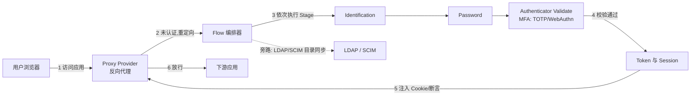

## 这个项目真正解决的是什么

身份认证几乎每个稍微复杂的应用都需要。选云服务（Okta、Auth0、Entra ID）省心，但代价是把身份数据交给第三方；自己搭，传统路线是 Keycloak + LDAP + Nginx 三个系统拼在一起，协议、生命周期、认证流程各管各的，维护成本被摊到多个组件上。

authentik 的切入点不是再提供一个认证单体，而是把上述几件事收进**一个**可自部署的系统：同一套身份源同时服务现代 Web 应用（OIDC/SAML）、传统应用（LDAP）、网络设备（RADIUS），认证流程用可视化编排，用户生命周期（注册、分组、映射、同步）也在同一处管理。它不纠缠于单个协议的实现细节，而是把"多套认证基础设施各自为政"这个更常见的工程负担，收进同一个入口。

核心数据：24.5K Stars、1.9K Forks，后端为 Python/Django、前端为 TypeScript，活跃维护（最近提交 2026-08-21）。当前稳定版是 2026.8，2026 年 8 月初发布；项目近年把大版本节奏从约两个月一轮放宽到约三个月一轮，安全覆盖最近两个版本。

## 系统地图：一次认证请求会穿过什么

在进入细节前，先看这套系统由哪几块组成、一次请求如何流动：



两条主线需要分开看：**认证流程**（Flow + Stage，决定"谁、怎么验证、是否放行"）和**目录同步**（LDAP/SCIM，决定"用户数据如何出入系统"）。前者是实时请求路径，后者是异步同步路径，不要混成一条线。

## 认证流程编排：Flow 与 Stage

authentik 的核心差异在 **Flow**，一个可视化认证流程编辑器。每个 Flow 由一系列 Stage 按顺序组成，Stage 类型覆盖认证的常见环节：

- **Identification**：收集用户名或邮箱
- **Password**：密码验证
- **Authenticator Validate**：MFA 验证（TOTP、WebAuthn、Duo、SMS）
- **Consent**：OAuth 授权同意页
- **User Write**：注册或更新用户属性
- **Email**：发送验证邮件
- **Custom**：自定义 Python 代码

Stage 可以按条件分支，条件包括用户来源、设备信任度、IP 范围等。像"公司内网自动通过 SSO，外部访问要求 MFA"这类策略，在管理界面配置即可，不需要写代码。这套设计把 Keycloak 里靠配置堆出来的 Authentication Flow，变成了一段可读、可复用的流程定义。

### 一次登录如何穿过整个系统

用一个具体任务把上面两条主线串起来：用户访问一个挂载了 Proxy Provider 的自托管应用。

1. 请求先到 authentik 的反向代理，代理检查会话。
2. 未认证，代理把请求重定向到登录 Flow。
3. Flow 依次执行 Identification（收集用户名）、Password（校验密码）、Authenticator Validate（若策略要求 MFA，校验 TOTP）。
4. 校验通过，authentik 生成会话，Proxy Provider 给浏览器注入 Cookie。
5. 代理带着认证上下文放行，应用正常返回。

如果同一用户信息还要进下游系统，则走 SCIM 同步这条旁路，把用户变更推到订阅了该同步的应用。两条路径一个管"访问当下"，一个管"数据一致"，各自独立。

## 用户生命周期管理

authentik 不只在认证时发一个 token，也管理用户从进入到离开的完整过程：

- **注册**：自助注册、邀请制、管理员创建
- **分组与角色**：用户分组，基于角色的权限分配
- **属性映射**：自定义用户属性到 SAML claim / OIDC scope 的映射
- **恢复**：密码重置流程
- **SCIM 同步**：用户变更自动同步到下游应用

一个身份源同时服务目录、认证、授权，是这套系统相比"各组件各管一段"的主要价值。

## 协议支持

authentik 作为统一身份层，同时提供：

- **SAML 2.0**：服务提供者（SP）发起和 IdP 发起的 SSO
- **OAuth2 / OIDC**：现代 Web 和移动应用的标准认证授权，官方已通过 OpenID 认证
- **LDAP**：传统应用和基础设施组件的目录服务
- **RADIUS**：网络设备、VPN、Wi-Fi 认证
- **SCIM**：用户生命周期同步到下游应用
- **Proxy Provider**：反向代理模式保护没有原生认证集成的应用
- **SSF（Shared Signals Framework）**：与下游系统异步共享实时安全事件与信号

企业版额外支持 **WS-Federation**，用于对接 SharePoint 等微软体系应用。更完整的协议与版本差异可见[官方特性页](https://goauthentik.io/features/)。

## 企业功能

开源版本（MIT）包含全部核心功能；SSO、MFA、Flow 编排、所有协议在开源版本中完整可用，不是"核心功能收费"的模式。企业版（EE License）在其上叠加面向治理与自动化管理的特性——2026.8 的 release notes 里，特权访问管理（PAM，用户可申请带到期时间的访问）、计划内的用户下线、对象生命周期评审、副账号（agent accounts）等都属于企业版。是否为此付费，取决于你更需要治理审批能力，还是只需要自托管 SSO 本身。

## 部署方式

| 方式 | 推荐场景 | 说明 |
|------|----------|------|
| Docker Compose | 小型/测试环境 | 官方推荐入门方式，server + worker 两个容器 |
| Kubernetes (Helm) | 生产环境 | 官方 Helm Chart，支持水平扩展 |
| AWS CloudFormation | AWS 部署 | 官方 CloudFormation 模板 |
| DigitalOcean Marketplace | 快速试用 | 一键部署 |

### Docker Compose 最小部署

```yaml
# docker-compose.yml（最小可运行，需替换密码）
services:
  postgresql:
    image: docker.io/library/postgres:16
    environment:
      POSTGRES_DB: authentik
      POSTGRES_USER: authentik
      POSTGRES_PASSWORD: <password>   # 需替换为强密码
  redis:
    image: docker.io/library/redis:alpine
  server:
    image: ghcr.io/goauthentik/server:latest
    command: server
    ports:
      - "9000:9000"    # HTTP 入口
      - "9443:9443"    # HTTPS 入口
  worker:
    image: ghcr.io/goauthentik/server:latest
    command: worker
```

`<password>` 是占位符，启动前替换为强密码；持久化卷与 secret 生成见[官方文档](https://docs.goauthentik.io/docs/install-config/install/docker-compose/)。9000 是 HTTP 入口、9443 是 HTTPS 入口，生产应只暴露 9443。

## 与同类工具对比

| 维度 | authentik | Keycloak | Authelia | Auth0 (Okta) |
|------|-----------|----------|----------|--------------|
| 协议覆盖 | SAML/OIDC/LDAP/RADIUS/SCIM | SAML/OIDC/LDAP | SAML/OIDC | OIDC/SAML |
| 认证流程编排 | 可视化 Flow | 配置式 Authentication Flow | 2FA/规则 | Actions/Rules |
| 自部署 | ✅ Docker/K8s | ✅ Docker/K8s | ✅ Docker | ❌ |
| 管理界面 | 完整 Web UI | 完整 Web UI | 基础 Web UI | 完整 Web UI |
| 许可证 | MIT (+ EE) | Apache 2.0 | Apache 2.0 | 商业 |
| 语言 | Python/TypeScript | Java/TypeScript | Go | — |

authentik 相对 Keycloak 的主要差异：可视化 Flow 编排（Keycloak 用配置式 Authentication Flow），Python 技术栈（对运维团队更容易贡献），以及对 RADIUS 和 SCIM 的原生支持。

## 适用边界

**适合**：

- 需要自部署统一身份基础设施的团队或组织
- 有多种协议需求（SAML + OIDC + LDAP）的异构应用环境
- 希望摆脱商业 IdP 供应商锁定的组织
- 有合规要求、需身份数据留在内网的场景

**不适合**：

- 只需要简单登录功能的个人项目（OAuth proxy 或 Authelia 更轻量）
- 需要 authentik 团队以外的商业支持的场景（社区支持为主）
- 无运维能力维护 PostgreSQL + Redis + authentik 三组件的场景
- Python 生态不熟悉的团队做深度定制（核心逻辑是 Python/Django）

## 采用顺序

如果你的场景符合"自部署统一身份层"，建议按这个顺序走：

1. 先用 Docker Compose 起一套，把登录 Flow 和 OIDC 接一个真实应用，验证流程编排是否满足你需要的分支策略。
2. 确认需要多协议时，再规划 LDAP 目录接入和 SCIM 同步，把现有应用逐步迁入。
3. 生产环境用 Helm 部署，只暴露 9443，把 PostgreSQL、Redis 与 authentik 三者的持久化与备份纳入现有运维体系。

只有单一协议、单应用的轻量需求，不必上 authentik，Authelia 或一个 OAuth proxy 更省事。

## 常见问题

**忘记管理员密码怎么重置？** 用 authentik 的管理命令重置，之后在管理界面重新设置，不需要重建数据库。

**9000 和 9443 分别是什么？** 9000 是 HTTP 入口、9443 是 HTTPS 入口。生产只暴露 9443，HTTP 用于内部或调试。

**开源版和 EE 版怎么选？** 开源版已含 SSO、MFA、Flow、全部协议。多数自托管场景开源版够用；需要特权访问管理（PAM）、对象生命周期评审、WS-Federation 这类治理与自动化特性才考虑 EE。

## 维护指引

- 升级前先读官方 release notes；2026.8 是新周期内的首个大版本，功能面较广，生产环境建议在测试环境验证后再升级。
- 备份对象是 PostgreSQL 数据库；Redis 为会话缓存，可重建。
- 修改 Flow 前先在测试环境验证，生产 Flow 变更会影响所有登录入口。
- 项目开源协议 MIT（核心）。