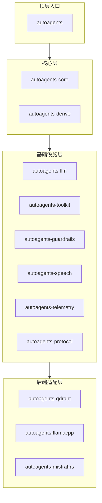

目录

- [为什么用 Rust 写 Agent 框架](#为什么用-rust-写-agent-框架)
- [架构总览：13 个 crate 的模块边界](#架构总览 13-个-crate-的模块边界)
- [智能体抽象：从 trait 到 derive 宏](#智能体抽象从-trait-到-derive-宏)
- [工具系统：WASM 沙盒与结构化调用](#工具系统 wasm-沙盒与结构化调用)
- [记忆系统：滑动窗口与可扩展后端](#记忆系统滑动窗口与可扩展后端)
- [LLM 后端：统一接口与灵活接入](#llm-后端统一接口与灵活接入)
- [Guardrails 与 LLM 优化层](#guardrails-与-llm-优化层)
- [多智能体编排：类型化通信与环境管理](#多智能体编排类型化通信与环境管理)
- [Python 绑定：PyPI 安装与使用](#python-绑定 pypi-安装与使用)
- [可观测性：OpenTelemetry 集成](#可观测性 opentelemetry-集成)
- [安装与快速上手](#安装与快速上手)
- [适用场景与决策建议](#适用场景与决策建议)
- [常见问题](#常见问题)

---

为什么用 Rust 写 Agent 框架

Python 生态有 LangChain、LlamaIndex 等成熟的 Agent 框架。但如果对性能、类型安全和内存占用有更严格的要求，Rust 正在成为一个值得关注的选择。

多智能体系统进入生产阶段后，会撞上 Python 的动态类型和 GIL 带来的几个具体问题：高并发的工具调用需要频繁序列化/反序列化，长时间运行的流式推理会累积内存压力，Python 异常在运行时才能捕获——而 Rust 的编译器在编译期就能捕捉到智能体状态、工具参数和 LLM 输出的类型错误。

AutoAgents 没有重复造轮子——它复用 Rust 生态中已有的优秀库（如用于 LLM 推理的 Burn、用于 WASM 的 wasmtime），专注在智能体编排层的抽象上。项目通过 13 个独立 crate 的模块化拆分，覆盖从核心 Agent trait 到 WASM 沙盒、Python 绑定、OpenTelemetry 可观测性的完整技术栈。

项目地址：[liquidos-ai/AutoAgents](https://github.com/liquidos-ai/AutoAgents)（628 Stars，70 Forks）

架构总览： 个 crate 的模块边界

AutoAgents 采用 workspace 结构，将功能拆分为 13 个独立 crate，每个 crate 有明确的职责边界：



| Crate | 职责 | 是否必需 |
|-------|------|:---:|
| `autoagents-core` | 核心抽象：Agent trait、Tool trait、Memory trait、Executor | ✅ |
| `autoagents-derive` | 派生宏：`#[agent]`、`#[tool]`、`#[tool_input]`、`#[agent_output]` | ✅ |
| `autoagents-llm` | LLM 接口抽象与统一后端调度 | ✅ |
| `autoagents-toolkit` | 内置工具集（文件系统、网络请求等） | 可选 |
| `autoagents-guardrails` | 输入/输出安全检查（Guardrails） | 可选 |
| `autoagents-speech` | TTS（文字转语音）和 STT（语音转文字）本地支持 | 可选 |
| `autoagents-telemetry` | OpenTelemetry 追踪与指标导出 | 可选 |
| `autoagents-protocol` | 多智能体通信协议（pub/sub） | 可选 |
| `autoagents-qdrant` | Qdrant 向量存储后端（记忆扩展） | 可选 |
| `autoagents-llamacpp` | llama.cpp 本地推理后端 | 可选 |
| `autoagents-mistral-rs` | Mistral-rs 本地推理后端 | 可选 |
| `autoagents` | 顶层入口包 | ✅ |

这种拆分方式的实际效果是**按需依赖**——如果只需要核心的 Agent 功能，不需要引入 Speech 或 Qdrant；如果只需要本地推理，不需要云端 provider 的依赖传递。

智能体抽象：从 trait 到 derive 宏

核心 trait 设计

AutoAgents 的核心抽象围绕三个 trait 展开：

```rust
// 智能体 trait - 定义了 run 方法
pub trait AgentT: Send + Sync {
    async fn run(&self, task: Task, context: &Context) -> Result<AgentOutput, Error>;
}

// 工具 trait - 定义了 execute 方法
#[async_trait]
pub trait ToolRuntime: Send + Sync {
    async fn execute(&self, args: Value) -> Result<Value, ToolCallError>;
}

// 记忆 trait - 定义了 read/write 能力
pub trait Memory: Send + Sync {
    async fn read(&self) -> Value;
    async fn write(&mut self, entry: MemoryEntry) -> Result<(), Error>;
}
```

这三个 trait 覆盖了智能体系统的核心要素：**做什么**（Agent）、**怎么做**（Tool）、**记得什么**（Memory）。所有具体实现都围绕这三个 trait 展开。

派生宏：减少样板代码

手写实现这些 trait 需要大量样板代码。AutoAgents 通过 `#[derive]` 宏大幅简化了这个过程：

```rust
// 定义工具：使用 #[tool] 派生宏自动生成 ToolInput
#[derive(Serialize, Deserialize, ToolInput, Debug)]
pub struct AdditionArgs {
    #[input(description = "Left Operand for addition")]
    left: i64,
    #[input(description = "Right Operand for addition")]
    right: i64,
}

#[tool(
    name = "Addition",
    description = "Use this tool to Add two numbers",
    input = AdditionArgs,
)]
struct Addition {}

// 实现工具运行时
#[async_trait]
impl ToolRuntime for Addition {
    async fn execute(&self, args: Value) -> Result<Value, ToolCallError> {
        let typed_args: AdditionArgs = serde_json::from_value(args)?;
        Ok((typed_args.left + typed_args.right).into())
    }
}
```

`#[tool]` 宏自动处理了工具注册、参数解析和 JSON Schema 生成。类似地，`#[agent]` 宏用于定义智能体，`#[agent_output]` 用于定义结构化输出。

ReAct 执行器

AutoAgents 内置了两种执行器，其中最核心的是 **ReAct（Reasoning + Acting）** 执行器：

```rust
pub async fn simple_agent(llm: Arc<dyn LLMProvider>) -> Result<(), Error> {
    let sliding_window_memory = Box::new(SlidingWindowMemory::new(10));

    let agent_handle = AgentBuilder::<_, DirectAgent>::new(ReActAgent::new(MathAgent {}))
        .llm(llm)
        .memory(sliding_window_memory)
        .build()
        .await?;

    let result = agent_handle.agent.run(Task::new("What is 1 + 1?")).await?;
    Ok(())
}
```

ReAct 执行器的执行循环：**思考（Thought）→ 行动（Action）→ 观察（Observation）** 持续迭代，直到智能体输出最终答案或达到最大步数限制。这种模式特别适合需要调用工具的多步骤推理任务。

工具系统：WASM 沙盒与结构化调用

工具调用的结构化设计

AutoAgents 的工具调用是**类型安全**的——不是用自然语言描述工具参数，而是通过 Rust 结构体 + serde 序列化来定义工具输入。也就是：

- 工具参数在编译期就有类型检查
- LLM 输出通过 serde 自动反序列化到正确的结构体
- 不存在传统「字符串模板 + 正则匹配」模式的脆弱性

WASM 沙盒隔离

AutoAgents 支持将工具执行在 **WASM 沙盒**中运行，这是安全性要求较高场景的关键特性：

```rust
// 工具可以注册为 WASM 运行时
// 恶意或出错的工具代码无法访问沙盒外的内存
impl ToolRuntime for SandboxedTool {
    async fn execute(&self, args: Value) -> Result<Value, ToolCallError> {
        // 在 WASM 虚拟机中安全执行
        self.wasm_module.execute(args).await
    }
}
```

当智能体调用不可信的工具代码时（如用户提供的自定义工具），WASM 沙盒可以防止工具代码对主进程造成损害。

内置工具包（Toolkit）

`autoagents-toolkit` 提供了开箱即用的内置工具：文件系统操作（读、写、搜索文件）、网络请求（HTTP GET/POST）、Shell 命令执行等。这些工具都经过了安全审计，可以直接集成到工作流中。

记忆系统：滑动窗口与可扩展后端

记忆是智能体保持上下文连贯性的关键。AutoAgents 的记忆抽象：

```rust
pub trait Memory: Send + Sync {
    async fn read(&self) -> Value;           // 读取当前记忆内容
    async fn write(&mut self, entry: MemoryEntry) -> Result<(), Error>;  // 写入新记忆
    fn len(&self) -> usize;                 // 记忆条目数量
    fn is_empty(&self) -> bool;
}
```

内置的 **SlidingWindowMemory**（滑动窗口记忆）是最基础的实现——始终保持最近 N 条记忆，超出部分自动淘汰。这种设计简单高效，适合短对话场景。

对于需要长期记忆的场景，`autoagents-qdrant` crate 提供了 Qdrant 向量存储后端，支持语义检索和持久化存储。

LLM 后端：统一接口与灵活接入

统一 Provider 接口

AutoAgents 的 LLM 层通过 `LLMProvider` trait 抽象了所有后端：

```rust
#[async_trait]
pub trait LLMProvider: Send + Sync {
    async fn complete(&self, prompt: &Prompt) -> Result<LLMOutput, Error>;
    async fn stream(&self, prompt: &Prompt) -> Result<StreamingOutput, Error>;
}
```

切换 LLM 后端不需要修改业务代码。只需要在初始化时注入不同的 Provider 实例：

```rust
// 使用 OpenAI
let llm: Arc<OpenAI> = LLMBuilder::<OpenAI>::new()
    .api_key(api_key)
    .model("gpt-4o")
    .build()?;

// 业务代码完全不用改，换成 Ollama 也一样
```

支持的 Provider 生态

**云端 Provider（10+）：** OpenAI、Anthropic、DeepSeek、xAI、Groq、Google Gemini、Azure OpenAI、MiniMax、OpenRouter、Phind

**本地 Provider：** Ollama、Mistral-rs、Llama-Cpp

**实验性：** Burn (Rust 原生推理)、ONNX Runtime

对于中国开发者而言，直接支持 MiniMax 是一个实用的细节。

Guardrails 与 LLM 优化层

Guardrails

Guardrails（护栏）是在 LLM 输入/输出层增加的安全检查机制。AutoAgents 支持三种策略：

- **Block**：拦截包含敏感词的请求/响应
- **Sanitize**：对敏感内容进行脱敏处理后放行
- **Audit**：记录但不拦截，供事后审查

这些策略通过 `LLMLayer` 接口插入到 LLM 调用链中：

```rust
let pipeline = LLMBuilder::new()
    .layer(GuardrailsLayer::new(block_policy))  // 插入 Guardrails 层
    .layer(CacheLayer::new())                    // 插入缓存层
    .layer(RetryLayer::new(3))                   // 插入重试层
    .backend(OpenAI::new())
    .build()?;
```

LLM 优化层

除了安全性，AutoAgents 还提供了两种性能优化：

**缓存层（CacheLayer）**：对相同 prompt 的重复请求直接返回缓存结果，避免重复调用 LLM API。在对话系统中可以显著降低 token 消耗。

**重试层（RetryLayer）**：对临时性失败（网络超时、服务端限流）自动重试，最多 N 次。配合指数退避策略，避免对 API 服务造成压力。

这两种优化都通过 `LLMLayer` 接口实现，属于同一套可插拔架构。

多智能体编排：类型化通信与环境管理

AutoAgents 的多智能体系统通过 **typed pub/sub 协议**实现通信：

```rust
// 定义智能体之间的消息类型（类型安全）
#[derive(Message, Serialize, Deserialize)]
pub struct AgentMessage {
    pub sender: AgentId,
    pub content: String,
    pub metadata: MessageMetadata,
}

// 订阅特定类型的消息
agent.subscribe::<AgentMessage>(|msg| {
    // 处理收到的消息
    Ok(())
});

// 发布消息给其他智能体
agent.publish(AgentMessage { ... });
```

类型化的价值在于：编译期就能确保消息发送方和接收方对消息结构的共识，避免运行时才发现字段不匹配。

**环境管理**（Environment）是多智能体编排的另一个核心概念。每个智能体可以在一个共享的「环境」中运行，环境负责维护全局状态、管理智能体之间的依赖关系、提供共享工具。

Python 绑定：PyPI 安装与使用

Rust 框架最大的门槛是 Rust 本身的上手成本。AutoAgents 通过 PyPI bindings 解决了这个问题——不需要写 Rust，用 Python 也能使用 AutoAgents 的核心功能：

```bash
pip install autoagents-py                        # 核心 + 云端 LLM
pip install "autoagents-py[llamacpp]"           # + llama.cpp 本地推理
pip install "autoagents-py[llamacpp-cuda]"     # + CUDA 加速
pip install "autoagents-py[guardrails]"        # + 安全护栏
```

Python API 与 Rust API 保持了概念上的一致性：

```python
from autoagents import Agent, Task
from autoagents.llm import OpenAI

初始化 LLM
llm = OpenAI(api_key="sk-...", model="gpt-4o")

创建智能体
agent = Agent(llm=llm)

运行任务
result = agent.run(Task("What is 1 + 1?"))
```

Python 绑定使用 maturin 构建，支持 CUDA 加速（通过 PyO3 绑定 Rust 原生实现），性能远优于纯 Python 实现的多智能体框架。

可观测性：OpenTelemetry 集成

生产环境中的调试和监控至关重要。AutoAgents 内置了 OpenTelemetry 支持：

```rust
use autoagents_telemetry::tracing;

// 在初始化时开启追踪
let tracer = tracing::opentelemetry()
    .with_exporter(tracing::exporter::console())
    .init();

let agent = AgentBuilder::new()
    .with_tracer(tracer)  // 接入 OpenTelemetry
    .build()?;
```

追踪数据包括每次 LLM 调用的延迟、工具执行的耗时、智能体状态转换等关键指标。导出器支持多种后端（Console、Jaeger、OTLP 等）。

安装与快速上手

Rust 原生安装

```bash
安装系统依赖（Linux）
sudo apt update && sudo apt install build-essential libasound2-dev alsa-utils pkg-config libssl-dev -y

克隆并构建
git clone https://github.com/liquidos-ai/AutoAgents.git
cd AutoAgents
cargo build --workspace --all-features

运行测试
cargo test --features "full" --workspace
```

Python 安装

```bash
基础安装
pip install autoagents-py

开发环境（需要 Rust 编译环境）
uv venv --python=3.12
source .venv/bin/activate
uv pip install maturin pytest pytest-asyncio pytest-cov
make python-bindings-build
```

适用场景与决策建议

**适合的场景：**

- 需要**高性能**多智能体推理的后端服务——Rust 的零成本抽象和所有权系统在并发场景下明显优于 Python
- 对**类型安全**有要求的生产系统——编译器检查覆盖了智能体状态、工具参数、消息结构等
- 需要在**边缘设备**上运行智能体——Rust 的低内存开销和 WASM 沙盒天然适合嵌入式和 IoT 场景
- 需要**本地部署** LLM 且不想引入 Python 环境——通过 llama.cpp 或 Mistral-rs 直接加载模型
- **安全敏感**场景——WASM 沙盒 + Guardrails 提供多层防护

**不适合的场景：**

- 快速原型开发和探索性实验——直接用 LangChain/Python 更灵活，迭代速度更快
- 对生态丰富度要求极高的场景——LangChain 的社区插件和集成数量远超 Rust 生态
- 团队没有 Rust 基础——除非只用 Python bindings，但 Python bindings 的功能覆盖不如 Rust API 完整

**技术亮点：**

1. **WASM 沙盒工具执行**——工具代码在隔离环境中运行，防止恶意工具影响主进程
2. **类型化 pub/sub 多智能体通信**——编译期保证消息结构一致性
3. **可插拔 LLM Layer 架构**——Guardrails、Cache、Retry 可以任意组合插入调用链
4. **Burn + Mistral-rs + Llama-Cpp 本地推理三路并存**——满足不同硬件条件的本地部署需求
5. **Python bindings + maturin 构建**——Rust 性能 + Python 生态两全其美

常见问题

**Q: AutoAgents 和 LangChain 怎么选？**

如果项目在快速迭代阶段，用 LangChain/Python 更快。当项目进入生产阶段，对性能、并发和类型安全有要求，或者需要部署到边缘设备，AutoAgents 的 Rust 底层更有优势。Python bindings 可以作为过渡方案——先用 Python 调用，等团队熟悉 Rust 后再逐步迁移核心逻辑。

**Q: Python bindings 的性能比纯 Python 框架好多少？**

Python bindings 的核心逻辑跑在 Rust 编译后的原生代码中，比纯 Python 实现快 3-5 倍（具体取决于工作负载）。但对于主要是 LLM API 调用的场景（网络延迟占主导），性能优势不明显。优势主要体现在高并发工具调用、大量序列化/反序列化、以及本地推理场景。

**Q: WASM 沙盒是否影响工具执行性能？**

有轻微影响（约 5-10% 的额外开销），但 WASM 的启动时间极短（毫秒级），对大多数场景来说可以忽略。如果需要极致性能，可以选择不使用 WASM 沙盒，直接执行原生工具代码。

**Q: 支持哪些 Rust 版本？**

项目在 README 中未明确指定 MSRV（Minimum Supported Rust Version），建议使用最新的 stable Rust 工具链。可以通过 `rustup update stable` 更新。

**Q: 生产环境部署需要注意什么？**

关注三点：1) 开启 OpenTelemetry 追踪，否则生产环境出问题无从排查；2) 为 LLM 调用配置 RetryLayer，处理网络抖动；3) 如果使用 WASM 沙盒，确认 `wasmtime` 的版本与项目兼容。

---

🦞 每日 08:00 自动更新

**数据来源**：liquidos-ai/AutoAgents GitHub 仓库、README.md、README.zh-CN.md、Cargo.toml workspace